# HC32L021 系列

## 32 位 ARM<sup>®</sup> Cortex<sup>®</sup>-M0+ 微控制器

# 参考手册

Rev1.00

2025 年 4 月

# 说明事项

## 版权所有©2025 小华半导体有限公司。保留所有权利

本文件及附件包含的信息有关知识产权权益全部属于小华半导体有限公司（以下简称“XHSC”）；客户对本文件及附件包含的信息只享有内部使用权，未经 XHSC 书面允许，任何单位和个人不得擅自摘抄、复制、改动或以其他任何形式使用本文件的部分或全部内容，并不得以任何形式进行传播。

## 商标声明

  和其他商标均为 XHSC 的商标。所有其他在 XHSC 产品上显示的产品或服务名称均为其各自所有者的财产。

## 注意事项

* XHSC 保留随时更改、更正、增强、修改产品和/或本文档的权利，恕不另行通知。用户可在下单前获取最新相关信息。XHSC 产品依据购销基本合同中载明的销售条款和条件进行销售。

* 客户应针对您的应用选择合适的 XHSC 产品，并设计、验证和测试您的应用，以确保您的应用满足相应标准以及任何安全、安保或其它要求。客户应对此独自承担全部责任。

* XHSC 在此确认未以明示或暗示方式授予任何知识产权许可。

* XHSC 产品的转售，若其条款与此处规定不同，XHSC 对此类产品的任何保修承诺无效。

* 本通知中的信息取代并替换先前版本中的信息。

## 小华半导体有限公司


<table>
  <tbody>
    <tr>
        <td>地址：</td>
        <td>上海市浦东新区中科路 1867 号 A 座 4 楼</td>
    </tr>
    <tr>
        <td>网址：</td>
        <td>https://www.xhsc.com.cn</td>
    </tr>
    <tr>
        <td>邮箱：</td>
        <td>XHSC_MCU@xhsc.com.cn</td>
    </tr>
    <tr>
        <td>电话：</td>
        <td>021-38880888-887</td>
    </tr>
  </tbody>
</table>

# 前言

## 位/位域

寄存器包含位（一个位宽）或者位域（多个位宽）的字段，位域通常描述成[y:x]，从 x 位开始到 y 位结束。没有特殊说明的情况下，位域字段使用的是十进制数。

不建议使用没有指定的字段，否则可能导致不可预知后果。

## 寄存器地址

每个寄存器的地址可以通过系统地址划分的基地址以及寄存器的偏移地址（详见各模块的寄存器总表）获得。

## 寄存器属性

寄存器说明中使用以下缩写词：


<table>
  <thead>
    <tr>
        <th>缩写词</th>
        <th>说明</th>
    </tr>
  </thead>
  <tbody>
    <tr>
        <td>RW</td>
        <td>读写，可以读写该位。</td>
    </tr>
    <tr>
        <td>RO</td>
        <td>只读，只能读取该位。</td>
    </tr>
    <tr>
        <td>WO</td>
        <td>只写，只能写入该位。</td>
    </tr>
    <tr>
        <td>RWA</td>
        <td>读写，可以读写该位。<br/>仅解锁或者安全模式下可写。</td>
    </tr>
    <tr>
        <td>RWC</td>
        <td>读写，可以读写该位。<br/>写入任意值将该位清零。</td>
    </tr>
    <tr>
        <td>RC</td>
        <td>只读，只能读取该位。<br/>读取后该位自动清零。</td>
    </tr>
    <tr>
        <td>RS</td>
        <td>只读，只能读取该位。<br/>读取后该位自动置位。</td>
    </tr>
  </tbody>
</table>

## 数据格式

* 0x 前缀表示十六进制数据

* 0b 前缀表示二进制数据

* 数字没有前缀表示十进制数据

## Reserved（Res.）

标记为 Reserved 的寄存器和位/位域是为了将来使用预留，必须保持复位值（寄存器另有说明的场景除外）。Reserved 位的读取值在不同设备或者特性中可能不同。

## 复位值（Reset）

复位值表示寄存器重置之后的值。寄存器在使用前需要进行初始化重置，否则可能导致不可预知后果。

## 外设可用性说明

HC32L021 系列 32 位 ARM<sup>®</sup> Cortex<sup>®</sup>-M0+ 微控制器所支持的外设以及其数目，请参见相应的《数据手册》。

## 安全声明

由于使用某个功能或者协议，可能会存在潜在的安全问题，需要进行声明，提醒用户慎用，规避安全风险。

# 修订记录


<table>
  <thead>
    <tr>
        <th>文档版本</th>
        <th>发布日期</th>
        <th>修改说明</th>
    </tr>
  </thead>
  <tbody>
    <tr>
        <td>Rev1.00</td>
        <td>2025/04/14</td>
        <td>第一次正式发布。</td>
    </tr>
  </tbody>
</table>

# 目录

前言................................................................................................................................................................iii
修订记录.........................................................................................................................................................iv
**1 产品简介.......................................................................................................................................................1**
**2 存储与架构................................................................................................................................................... 2**
2.1 系统框图..................................................................................................................................................................... 2
2.2 系统地址划分.............................................................................................................................................................. 3
2.3 存储器和模块地址分配................................................................................................................................................ 4
**3 工作模式.......................................................................................................................................................5**
3.1 概述............................................................................................................................................................................ 5
3.2 工作模式切换.............................................................................................................................................................. 5
3.3 运行模式（Active Mode）...........................................................................................................................................5
3.4 休眠模式（Sleep Mode）............................................................................................................................................6
3.5 深度休眠模式（Deep Sleep Mode）............................................................................................................................6
3.6 功能/模块工作状态...................................................................................................................................................... 7
3.7 寄存器.........................................................................................................................................................................9
3.7.1 系统控制寄存器（SCB_SCR）（Cortex-M0+ 内核系统控制寄存器）.....................................................................9
**4 FLASH 控制器（FLASH）............................................................................................................................10**
4.1 简介.......................................................................................................................................................................... 10
4.2 功能说明................................................................................................................................................................... 10
4.2.1 容量划分.............................................................................................................................................................10
4.2.2 读等待周期......................................................................................................................................................... 10
4.2.3 FLASH 安全保护..................................................................................................................................................10
4.3 操作示例................................................................................................................................................................... 11
4.3.1 页擦除（Sector Erase）......................................................................................................................................12
4.3.2 全片擦除（Chip Erase）.....................................................................................................................................12
4.3.3 写操作（Program）............................................................................................................................................ 12
4.3.4 连续写操作（Cont-Program）.............................................................................................................................13
4.3.5 读操作（Read）..................................................................................................................................................15
4.4 寄存器.......................................................................................................................................................................16
4.4.1 寄存器总表......................................................................................................................................................... 16
4.4.2 CR 寄存器（FLASH_CR）....................................................................................................................................17
4.4.3 IFR 寄存器（FLASH_IFR）...................................................................................................................................18
4.4.4 ICLR 寄存器（FLASH_ICLR）...............................................................................................................................18
4.4.5 BYPASS 寄存器（FLASH_BYPASS）..................................................................................................................... 19
4.4.6 SLOCK0 寄存器（FLASH_SLOCK0）....................................................................................................................19
4.4.7 保护状态寄存器（FLASH_LOCK_ST）..................................................................................................................20
**5 RAM 控制器（RAM）.................................................................................................................................. 21**
5.1 简介.......................................................................................................................................................................... 21
5.2 功能说明................................................................................................................................................................... 21
5.2.1 RAM 地址范围.....................................................................................................................................................21
5.2.2 读写位宽.............................................................................................................................................................21
**6 系统控制器（SYSCTRL）............................................................................................................................22**
6.1 系统时钟介绍............................................................................................................................................................ 22
6.1.1 时钟架构图......................................................................................................................................................... 22
6.1.2 时钟类型.............................................................................................................................................................23
6.1.3 时钟启动过程......................................................................................................................................................23
6.2 系统时钟切换............................................................................................................................................................ 24
6.2.1 系统时钟切换简介...............................................................................................................................................24

6.2.2 切换流程.............................................................................................................................................................24
6.2.3 切换示例.............................................................................................................................................................25
6.2.4 时钟切换示意图.................................................................................................................................................. 26
6.3 时钟校准模块............................................................................................................................................................ 26
6.4 中断唤醒控制............................................................................................................................................................ 26
6.4.1 从深度休眠模式唤醒后执行中断服务...................................................................................................................26
6.4.2 从深度休眠模式唤醒后不执行中断服务............................................................................................................... 27
6.4.3 使用退出休眠特性...............................................................................................................................................27
6.5 复位控制................................................................................................................................................................... 28
6.5.1 复位控制器概述.................................................................................................................................................. 28
6.5.2 复位功能.............................................................................................................................................................28
6.6 寄存器.......................................................................................................................................................................30
6.6.1 寄存器总表......................................................................................................................................................... 30
6.6.2 系统控制寄存器 0（SYSCTRL0）.........................................................................................................................31
6.6.3 系统控制寄存器 1（SYSCTRL1）.........................................................................................................................32
6.6.4 系统控制寄存器 2（SYSCTRL2）.........................................................................................................................33
6.6.5 RC48M 控制寄存器（RC48M_CR）......................................................................................................................34
6.6.6 RCL 控制寄存器（RCL_CR）................................................................................................................................35
6.6.7 XTL 控制寄存器（XTL_CR）................................................................................................................................36
6.6.8 外围模块时钟控制寄存器 0（PERI_CLKEN0）......................................................................................................38
6.6.9 外围模块时钟控制寄存器 1（PERI_CLKEN1）......................................................................................................40
6.6.10 复位标识寄存器（RESET_FLAG）......................................................................................................................41
6.6.11 外围模块复位控制寄存器 0（PERI_RESET0）....................................................................................................42
6.6.12 外围模块复位控制寄存器 1（PERI_RESET1）....................................................................................................43
6.6.13 外设调试功能有效性配置寄存器（DEBUG_ACTIVE）.........................................................................................44
# 7 端口控制器（GPIO）.................................................................................................................................. 45
7.1 简介.......................................................................................................................................................................... 45
7.2 主要特性................................................................................................................................................................... 45
7.3 功能说明................................................................................................................................................................... 46
7.3.1 端口配置功能......................................................................................................................................................46
7.3.2 端口的写入......................................................................................................................................................... 47
7.3.3 端口的读取......................................................................................................................................................... 47
7.3.4 端口数字复用功能...............................................................................................................................................49
7.3.5 端口中断功能......................................................................................................................................................50
7.3.6 端口输入滤波功能...............................................................................................................................................50
7.3.7 端口复位状态......................................................................................................................................................50
7.3.8 HSI2C 通信电平选择功能.....................................................................................................................................50
7.4 操作示例................................................................................................................................................................... 50
7.4.1 端口复用配置为模拟端口操作流程...................................................................................................................... 50
7.4.2 端口复用配置为数字通用端口操作流程............................................................................................................... 51
7.4.3 端口复用配置为数字功能端口操作流程............................................................................................................... 51
7.4.4 端口复用配置为调试测试端口操作流程............................................................................................................... 51
7.4.5 端口复用配置为红外输出信号操作流程............................................................................................................... 51
7.4.6 端口高电平中断操作流程.................................................................................................................................... 51
7.4.7 端口低电平中断操作流程.................................................................................................................................... 51
7.4.8 端口上升沿中断操作流程.................................................................................................................................... 52
7.4.9 端口下降沿中断操作流程.................................................................................................................................... 52
7.4.10 端口上拉使能配置操作流程...............................................................................................................................52
7.4.11 端口开漏输出配置操作流程...............................................................................................................................52
7.4.12 端口位置位操作流程......................................................................................................................................... 52
7.4.13 端口位清零操作流程......................................................................................................................................... 52
7.4.14 端口位置位清零操作流程.................................................................................................................................. 52

7.4.15 端口输入滤波操作流程 52
7.5 寄存器 54
7.5.1 寄存器总表 54
7.5.2 端口通用寄存器 56
7.5.3 端口辅助寄存器 64
7.5.4 端口功能选择寄存器 69
# 8 中断控制器（NVIC） 70
8.1 简介 70
8.2 功能说明 70
8.2.1 中断优先级 70
8.2.2 中断向量表 71
8.2.3 中断输入和挂起行为 71
8.2.4 中断等待 73
8.2.5 中断源 73
8.2.6 中断结构图 74
8.3 操作示例 76
8.3.1 外部中断使能 76
8.3.2 NVIC 中断使能和清除使能 76
8.3.3 NVIC 中断挂起和清除挂起 76
8.3.4 NVIC 中断优先级 76
8.3.5 NVIC 中断屏蔽 76
8.4 寄存器 77
8.4.1 寄存器总表 77
8.4.2 中断使能设置寄存器（NVIC_ISER） 78
8.4.3 中断使能清除寄存器（NVIC_ICER） 78
8.4.4 中断挂起状态设置寄存器（NVIC_ISPR） 79
8.4.5 中断挂起状态清除寄存器（NVIC_ICPR） 79
8.4.6 中断优先级寄存器（NVIC_IPR0） 80
8.4.7 中断优先级寄存器（NVIC_IPR1） 80
8.4.8 中断优先级寄存器（NVIC_IPR2） 81
8.4.9 中断优先级寄存器（NVIC_IPR3） 81
8.4.10 中断优先级寄存器（NVIC_IPR4） 82
8.4.11 中断优先级寄存器（NVIC_IPR5） 82
8.4.12 中断优先级寄存器（NVIC_IPR6） 83
8.4.13 中断优先级寄存器（NVIC_IPR7） 83
8.4.14 中断屏蔽特殊寄存器（PRIMASK） 84
# 9 系统定时器（SYSTICK） 85
9.1 简介 85
9.2 操作示例 85
9.2.1 设置 SysTick 85
9.3 寄存器 86
9.3.1 寄存器总表 86
9.3.2 SysTick 控制和状态寄存器（CTRL） 87
9.3.3 SysTick 重载寄存器（LOAD） 87
9.3.4 SysTick 当前值寄存器（VAL） 88
9.3.5 SysTick 校准值寄存器（CALIB） 88
# 10 时钟校准模块（CTRIM） 89
10.1 简介 89
10.2 主要特性 89
10.3 功能说明 89
10.3.1 RC48M 时钟校准模式 89

10.3.2 RCL 时钟校准模式.............................................................................................................................................90
10.3.3 低功耗定时器模式.............................................................................................................................................90
10.4 操作示例................................................................................................................................................................. 92
10.4.1 RC48M 时钟自动校准示例.................................................................................................................................92
10.4.2 RCL 时钟自动校准示例......................................................................................................................................92
10.5 寄存器.....................................................................................................................................................................93
10.5.1 寄存器总表....................................................................................................................................................... 93
10.5.2 自动装载寄存器（CTRIM_ARR）....................................................................................................................... 94
10.5.3 误差计数器寄存器（CTRIM_CNT）....................................................................................................................94
10.5.4 控制寄存器 0（CTRIM_CR0）............................................................................................................................95
10.5.5 控制寄存器 1（CTRIM_CR1）............................................................................................................................96
10.5.6 中断使能寄存器（CTRIM_IER）.........................................................................................................................97
10.5.7 中断和状态寄存器（CTRIM_ISR）..................................................................................................................... 98
10.5.8 中断状态清除寄存器（CTRIM_ICR）..................................................................................................................99
10.5.9 误差结果寄存器（CTRIM_FCAP）......................................................................................................................99
10.5.10 TRIM 结果寄存器（CTRIM_TVAL）.................................................................................................................100
10.5.11 误差上限寄存器（CTRIM_FLIM）...................................................................................................................100
# 11 复合定时器（CTIM）.............................................................................................................................. 101
11.1 简介...................................................................................................................................................................... 101
11.2 主要特性............................................................................................................................................................... 102
11.2.1 BTIM 主要特性................................................................................................................................................ 102
11.2.2 GTIM 主要特性................................................................................................................................................ 102
11.3 功能说明............................................................................................................................................................... 103
11.3.1 BTIM 功能描述................................................................................................................................................ 103
11.3.2 GTIM 功能描述................................................................................................................................................ 108
11.4 寄存器...................................................................................................................................................................114
11.4.1 寄存器总表..................................................................................................................................................... 114
11.4.2 BTIM 寄存器....................................................................................................................................................116
11.4.3 GTIM 寄存器....................................................................................................................................................122
# 12 高级定时器（ATIM3）.............................................................................................................................131
12.1 简介...................................................................................................................................................................... 131
12.2 主要特性............................................................................................................................................................... 131
12.3 功能说明............................................................................................................................................................... 132
12.3.1 定时器时钟..................................................................................................................................................... 132
12.3.2 定时计数器..................................................................................................................................................... 132
12.3.3 定时器预分频..................................................................................................................................................132
12.3.4 模式 0 计数定时器功能....................................................................................................................................133
12.3.5 模式 1 脉宽测量 PWC......................................................................................................................................135
12.3.6 模式 2/3 比较捕获模式....................................................................................................................................138
12.3.7 模式 2/3 从模式.............................................................................................................................................. 153
12.3.8 正交编码计数功能...........................................................................................................................................155
12.3.9 Timer 触发 ADC.............................................................................................................................................. 156
12.3.10 刹车控制.......................................................................................................................................................157
12.3.11 中断..............................................................................................................................................................157
12.3.12 Timer 互联....................................................................................................................................................157
12.3.13 输入互联.......................................................................................................................................................158
12.4 操作示例............................................................................................................................................................... 158
12.4.1 模式 0 计数定时器功能设置示例......................................................................................................................158
12.4.2 模式 1 脉宽测量 PWC 设置示例.......................................................................................................................158
12.4.3 模式 2/3 比较捕获模式设置示例......................................................................................................................159
12.4.4 互补 PWM 输出时 B 比较作为 ADC 触发功能....................................................................................................160

12.5 寄存器...................................................................................................................................................................161
- 12.5.1 寄存器总表..................................................................................................................................................... 161
- 12.5.2 模式 0 计数定时器寄存器................................................................................................................................163
- 12.5.3 模式 1 脉宽测量 PWC 寄存器...........................................................................................................................166
- 12.5.4 模式 2/3 比较捕获模式寄存器..........................................................................................................................173

# 13 实时时钟（RTC）....................................................................................................................................191
13.1 简介...................................................................................................................................................................... 191
13.2 主要特性............................................................................................................................................................... 191
13.3 功能说明............................................................................................................................................................... 192
- 13.3.1 功能框图.........................................................................................................................................................192
- 13.3.2 上电设定.........................................................................................................................................................192
- 13.3.3 时钟误差补偿..................................................................................................................................................193
- 13.3.4 时间戳功能..................................................................................................................................................... 194
- 13.3.5 唤醒定时器..................................................................................................................................................... 194
- 13.3.6 RTC 中断......................................................................................................................................................... 194
13.4 操作示例............................................................................................................................................................... 195
- 13.4.1 RTC 计数开始设置........................................................................................................................................... 195
- 13.4.2 读出计数寄存器.............................................................................................................................................. 195
- 13.4.3 写入计数寄存器.............................................................................................................................................. 195
- 13.4.4 闹钟设定.........................................................................................................................................................196
- 13.4.5 1Hz 输出.........................................................................................................................................................196
13.5 寄存器...................................................................................................................................................................198
- 13.5.1 寄存器总表..................................................................................................................................................... 198
- 13.5.2 控制寄存器 0（RTC_CR0）..............................................................................................................................199
- 13.5.3 控制寄存器 1（RTC_CR1）..............................................................................................................................200
- 13.5.4 秒计数寄存器（RTC_SEC）............................................................................................................................. 201
- 13.5.5 分计数寄存器（RTC_MIN）..............................................................................................................................201
- 13.5.6 时计数寄存器（RTC_HOUR）.......................................................................................................................... 202
- 13.5.7 日计数寄存器（RTC_DAY）............................................................................................................................. 203
- 13.5.8 周计数寄存器（RTC_WEEK）.......................................................................................................................... 204
- 13.5.9 月计数寄存器（RTC_MON）............................................................................................................................204
- 13.5.10 年计数寄存器（RTC_YEAR）......................................................................................................................... 205
- 13.5.11 时钟误差补偿寄存器（RTC_COMPEN）......................................................................................................... 206
- 13.5.12 高速补偿精度参数寄存器（RTC_HCOMP）.................................................................................................... 207
- 13.5.13 控制寄存器 2（RTC_CR2）............................................................................................................................208
- 13.5.14 闹钟 A 寄存器（RTC_ALMA）........................................................................................................................ 209
- 13.5.15 闹钟 B 寄存器（RTC_ALMB）........................................................................................................................ 210
- 13.5.16 时间戳时间寄存器（RTC_TSTR）.................................................................................................................. 211
- 13.5.17 时间戳日期寄存器（RTC_TSDR）..................................................................................................................211
- 13.5.18 唤醒定时器寄存器（RTC_WUTR）.................................................................................................................212
- 13.5.19 中断使能寄存器（RTC_IER）.........................................................................................................................212
- 13.5.20 中断标志寄存器（RTC_IFR）.........................................................................................................................213
- 13.5.21 中断清除寄存器（RTC_ICR）.........................................................................................................................214
- 13.5.22 保护寄存器（RTC_WPR）..............................................................................................................................214

# 14 独立看门狗（IWDT）..............................................................................................................................215
14.1 简介...................................................................................................................................................................... 215
14.2 主要特性............................................................................................................................................................... 215
14.3 功能说明............................................................................................................................................................... 215
- 14.3.1 功能框图.........................................................................................................................................................215
- 14.3.2 窗口看门狗模式.............................................................................................................................................. 215
- 14.3.3 独立看门狗模式.............................................................................................................................................. 215

14.3.4 看门狗溢出处理.............................................................................................................................................. 216
14.3.5 看门狗暂停..................................................................................................................................................... 216
14.3.6 看门狗停止及再次运行....................................................................................................................................216
14.3.7 寄存器写保护..................................................................................................................................................216
14.4 操作示例............................................................................................................................................................... 216
14.4.1 配置 IWDT 为窗口看门狗.................................................................................................................................216
14.4.2 配置 IWDT 为独立看门狗.................................................................................................................................216
14.4.3 看门狗超时时间（10kHz 的独立时钟）........................................................................................................... 217
14.5 寄存器...................................................................................................................................................................218
14.5.1 寄存器总表..................................................................................................................................................... 218
14.5.2 键值寄存器（IWDT_KR）................................................................................................................................ 219
14.5.3 控制寄存器（IWDT_CR）................................................................................................................................220
14.5.4 重载寄存器（IWDT_ARR）..............................................................................................................................221
14.5.5 状态寄存器（IWDT_SR）................................................................................................................................ 222
14.5.6 窗口寄存器（IWDT_WINR）............................................................................................................................223
# 15 低功耗同步异步收发器（LPUART）.........................................................................................................224
15.1 简介...................................................................................................................................................................... 224
15.2 主要特性............................................................................................................................................................... 224
15.3 功能说明............................................................................................................................................................... 225
15.3.1 功能框图.........................................................................................................................................................225
15.3.2 时钟说明.........................................................................................................................................................225
15.3.3 工作模式.........................................................................................................................................................225
15.3.4 波特率生成..................................................................................................................................................... 229
15.3.5 帧错误检测..................................................................................................................................................... 232
15.3.6 多机通讯.........................................................................................................................................................232
15.3.7 硬件流控.........................................................................................................................................................232
15.3.8 收发端缓存..................................................................................................................................................... 233
15.4 操作示例............................................................................................................................................................... 235
15.4.1 发送数据示例..................................................................................................................................................235
15.4.2 接收数据示例..................................................................................................................................................235
15.5 寄存器...................................................................................................................................................................236
15.5.1 寄存器总表..................................................................................................................................................... 236
15.5.2 数据寄存器（LPUART_SBUF）.........................................................................................................................237
15.5.3 控制寄存器（LPUART_SCON）........................................................................................................................238
15.5.4 地址寄存器（LPUART_SADDR）......................................................................................................................240
15.5.5 地址掩码寄存器（LPUART_SADEN）...............................................................................................................240
15.5.6 标志位寄存器（LPUART_ISR）........................................................................................................................ 241
15.5.7 标志位清除寄存器（LPUART_ICR）.................................................................................................................242
15.5.8 波特率寄存器（LPUART_SCNT）.....................................................................................................................242
15.5.9 波特率产生寄存器（LPUART_BSEL）...............................................................................................................243
15.5.10 9600/4800 波特率调制器寄存器（LPUART_MODU）.....................................................................................244
# 16 串行外设接口（SPI）..............................................................................................................................246
16.1 简介...................................................................................................................................................................... 246
16.2 主要特性............................................................................................................................................................... 246
16.3 功能说明............................................................................................................................................................... 246
16.3.1 功能框图.........................................................................................................................................................246
16.3.2 通信格式和时序.............................................................................................................................................. 246
16.3.3 从机选择管脚配置...........................................................................................................................................247
16.3.4 全双工通信..................................................................................................................................................... 248
16.3.5 单线半双工通信.............................................................................................................................................. 249
16.3.6 单工通信.........................................................................................................................................................249

16.3.7 多机通信 250
16.3.8 主机模式延后采样 250
16.3.9 状态标志和错误标志 251
16.3.10 中断的产生和清除 253
16.4 操作示例 254
16.4.1 主机全双工收发数据示例 254
16.4.2 从机全双工收发数据示例 254
16.4.3 单线半双工发送接收数据示例 254
16.5 寄存器 256
16.5.1 寄存器总表 256
16.5.2 SPI 控制寄存器 0 (SPI_CR0) 257
16.5.3 SPI 控制寄存器 1 (SPI_CR1) 258
16.5.4 SPI 单线半双工输出使能寄存器 (SPI_HDOE) 259
16.5.5 SPI 内部从机选择寄存器 (SPI_SSI) 259
16.5.6 SPI 状态寄存器 (SPI_SR) 260
16.5.7 SPI 中断清除寄存器 (SPI_ICR) 261
16.5.8 SPI 数据寄存器 (SPI_DR) 261
# 17 高速集成电路总线 (HSI2C) 262
17.1 简介 262
17.2 主要特性 262
17.3 功能说明 263
17.3.1 系统框图 263
17.3.2 协议描述 263
17.3.3 主机模式 264
17.3.4 从机模式 268
17.3.5 通信电平选择功能 270
17.4 操作示例 270
17.4.1 主机发送模式 270
17.4.2 主机接收模式 270
17.4.3 从机发送模式 271
17.4.4 从机接收模式 271
17.5 寄存器 272
17.5.1 寄存器总表 272
17.5.2 主机控制寄存器 (I2C_MCR) 273
17.5.3 主机状态寄存器 (I2C_MSR) 274
17.5.4 主机中断使能寄存器 (I2C_MIER) 276
17.5.5 主机状态清除寄存器 (I2C_MSCR) 277
17.5.6 主机配置 1 寄存器 (I2C_MCFGR1) 278
17.5.7 主机配置 2 寄存器 (I2C_MCFGR2) 280
17.5.8 主机配置 3 寄存器 (I2C_MCFGR3) 281
17.5.9 主机时钟配置 0 寄存器 (I2C_MCCR0) 282
17.5.10 主机时钟配置 1 寄存器 (I2C_MCCR1) 283
17.5.11 主机发送数据寄存器 (I2C_MTDR) 284
17.5.12 主机接收数据寄存器 (I2C_MRDR) 285
17.5.13 主机数据配置寄存器 (I2C_MDMR) 285
17.5.14 从机控制 0 寄存器 (I2C_SCR0) 286
17.5.15 从机状态寄存器 (I2C_SSR) 287
17.5.16 从机中断使能寄存器 (I2C_SIER) 290
17.5.17 从机状态清除寄存器 (I2C_SSCR) 291
17.5.18 从机控制 1 寄存器 (I2C_SCR1) 292
17.5.19 从机控制 2 寄存器 (I2C_SCR2) 294
17.5.20 从机发送 ACK 寄存器 (I2C_STAR) 295

17.5.21 从机发送数据寄存器 (I2C_STDR) 296
17.5.22 从机接收数据寄存器 (I2C_SRDR) 297
17.5.23 从机地址寄存器 (I2C_SADDR) 298
17.5.24 从机地址状态寄存器 (I2C_SASR) 299
# 18 模数转换器 (ADC) 300
18.1 简介 300
18.2 主要特性 300
18.3 功能说明 300
18.3.1 ADC 框图 300
18.3.2 转换时序及转换速度 300
18.3.3 扫描转换模式 301
18.3.4 ADC 转换外部触发源 301
18.3.5 ADC 中断 302
18.4 操作示例 302
18.4.1 通过 ADC_SQRSTART.START 位启动 ADC SQR 扫描转换操作流程 302
18.4.2 通过外部触发启动 ADC SQR 扫描转换操作流程 302
18.5 寄存器 304
18.5.1 寄存器总表 304
18.5.2 ADC 基本配置寄存器 0 (ADC_CR0) 305
18.5.3 ADC SQR 扫描转换通道配置寄存器 0 (ADC_SQR0) 307
18.5.4 ADC SQR 扫描转换通道配置寄存器 1 (ADC_SQR1) 308
18.5.5 ADC SQR 扫描转换通道 x 转换结果 (ADC_SQRRESULTx) (x = 0~3) 309
18.5.6 ADC 中断标志寄存器 (ADC_IFR) 310
18.5.7 ADC 中断清除寄存器 (ADC_ICR) 311
18.5.8 ADC SQR 扫描转换外部中断触发源配置寄存器 (ADC_EXTTRIGGER) 312
18.5.9 ADC SQR 扫描转换启动控制寄存器 (ADC_SQRSTART) 313
# 19 模拟电压比较器 (VC) 314
19.1 简介 314
19.2 主要特性 314
19.3 功能说明 314
19.3.1 功能框图 314
19.3.2 建立/响应时间 314
19.3.3 数字滤波 315
19.3.4 迟滞功能 315
19.3.5 比较结果极性配置 316
19.3.6 窗口比较功能 316
19.3.7 空白窗口 316
19.4 寄存器 317
19.4.1 寄存器总表 317
19.4.2 控制寄存器 0 (VCx_CR0) (x=0~1) 318
19.4.3 控制寄存器 1 (VCx_CR1) (x=0~1) 319
19.4.4 控制寄存器 2 (VCx_CR2) (x=0~1) 321
19.4.5 状态寄存器 (VCx_SR) (x=0~1) 322
# 20 低电压检测器 (LVD) 323
20.1 简介 323
20.2 主要特性 323
20.3 功能说明 323
20.3.1 LVD 框图 323
20.3.2 数字滤波 323
20.3.3 迟滞功能 324
20.4 操作示例 325

20.4.1 LVD 配置为低电压复位....................................................................................................................................325
20.4.2 LVD 配置为电压变化中断.................................................................................................................................325
20.5 寄存器...................................................................................................................................................................326
20.5.1 寄存器总表..................................................................................................................................................... 326
20.5.2 LVD 配置寄存器（LVD_CR）............................................................................................................................327
20.5.3 LVD 中断寄存器（LVD_SR）............................................................................................................................329
# 21 真随机数发生器（TRNG）...................................................................................................................... 330
21.1 简介...................................................................................................................................................................... 330
21.2 功能说明............................................................................................................................................................... 330
21.2.1 真随机数产生原理...........................................................................................................................................330
21.3 操作示例............................................................................................................................................................... 330
21.3.1 生成 64bits 真随机数的操作流程（上电第一次）............................................................................................ 330
21.3.2 生成 64bits 真随机数的操作流程（非上电第一次生成）..................................................................................331
21.4 寄存器...................................................................................................................................................................332
21.4.1 寄存器总表..................................................................................................................................................... 332
21.4.2 控制寄存器（TRNG_CR）................................................................................................................................333
21.4.3 模式寄存器（TRNG_MODE）.......................................................................................................................... 334
21.4.4 数据寄存器 0（TRNG_DATA0）.......................................................................................................................335
21.4.5 数据寄存器 1（TRNG_DATA1）.......................................................................................................................335
# 22 SWD 调试接口........................................................................................................................................ 336
22.1 简介...................................................................................................................................................................... 336
22.2 功能说明............................................................................................................................................................... 336
22.2.1 SWD 调试附加功能..........................................................................................................................................336
22.2.2 ARM<sup>®</sup>参考文档........................................................................................................................................ 337
22.2.3 调试端口引脚..................................................................................................................................................337
22.2.4 SWD 端口........................................................................................................................................................337
22.2.5 内核调试.........................................................................................................................................................340
22.2.6 BPU（断点单元）............................................................................................................................................341
22.2.7 DWT（数据观察点）.......................................................................................................................................341
22.2.8 MCU 调试组件（DBG）...................................................................................................................................341
# 23 器件电子签名..........................................................................................................................................343
23.1 简介...................................................................................................................................................................... 343
23.2 功能说明............................................................................................................................................................... 343
23.2.1 产品唯一身份标识（UID）.............................................................................................................................. 343
23.3 寄存器...................................................................................................................................................................344
23.3.1 产品唯一身份标识（UID）寄存器（80 位）.................................................................................................... 344
23.3.2 产品型号寄存器.............................................................................................................................................. 344
23.3.3 FLASH 容量寄存器.......................................................................................................................................... 345
23.3.4 RAM 容量寄存器..............................................................................................................................................345
23.3.5 管脚数量/Flash 扇区 Size 配置寄存器..............................................................................................................346
# A 术语表......................................................................................................................................................347

# 图目录

图 2-1 系统架构示意图............................................................................................................................................................... 2
图 3-1 工作模式状态转换图........................................................................................................................................................ 5
图 6-1 时钟架构图.................................................................................................................................................................... 22
图 6-2 晶振时钟启动示意图...................................................................................................................................................... 24
图 6-3 时钟切换示意图............................................................................................................................................................. 26
图 6-4 复位来源示意图............................................................................................................................................................. 28
图 7-1 端口电路图.................................................................................................................................................................... 46
图 7-2 AHB 总线端口随系统时钟的变化.................................................................................................................................... 47
图 7-3 读取端口引脚数据同步图............................................................................................................................................... 48
图 7-4 GPIO 端口输入滤波功能时序图.......................................................................................................................................50
图 8-1 中断向量表.................................................................................................................................................................... 71
图 8-2 中断激活和挂起状态...................................................................................................................................................... 72
图 8-3 中断挂起状态被清除然后被重新确认..............................................................................................................................72
图 8-4 中断退出时若中断请求保持高电平就会引起中断处理的再次执行....................................................................................72
图 8-5 中断处理中产生的中断挂起也可以被确认.......................................................................................................................73
图 8-6 中断结构图.................................................................................................................................................................... 75
图 10-1 RC48M 时钟校准时工作框图.........................................................................................................................................89
图 10-2 RCL 时钟校准时工作框图..............................................................................................................................................90
图 10-3 通用低功耗定时器场景工作框图...................................................................................................................................91
图 11-1 BTIM 框图.................................................................................................................................................................. 103
图 11-2 BTIM 滤波单元示意图.................................................................................................................................................103
图 11-3 BTIM 计数器波形........................................................................................................................................................104
图 11-4 BTIM 定时模式框图.................................................................................................................................................... 104
图 11-5 BTIM 计数器模式框图.................................................................................................................................................105
图 11-6 BTIM 触发启动器模式框图..........................................................................................................................................105
图 11-7 BTIM 触发启动模式计数示意图...................................................................................................................................106
图 11-8 BTIM 门控模式框图.................................................................................................................................................... 106
图 11-9 BTIM 门控模式计数示意图..........................................................................................................................................106
图 11-10 BTIM 定时器级联示意图........................................................................................................................................... 107
图 11-11 GTIM 框图................................................................................................................................................................108
图 11-12 GTIM 滤波单元示意图...............................................................................................................................................108
图 11-13 GTIM 计数器波形......................................................................................................................................................109
图 11-14 GTIM 定时模式框图..................................................................................................................................................109
图 11-15 GTIM 计数器模式框图...............................................................................................................................................110
图 11-16 GTIM 触发启动器模式框图........................................................................................................................................110
图 11-17 GTIM 触发启动模式计数示意图.................................................................................................................................111
图 11-18 GTIM 门控模式框图..................................................................................................................................................111
图 11-19 GTIM 门控模式计数示意图........................................................................................................................................111
图 11-20 GTIM 捕获功能示意图...............................................................................................................................................112
图 11-21 GTIM 比较功能示意图...............................................................................................................................................113
图 12-1 ATIM3 框图.................................................................................................................................................................132
图 12-2 模式 0 计数定时器自由计数框图................................................................................................................................ 133
图 12-3 模式 0 计数定时器重载计数框图................................................................................................................................ 133
图 12-4 模式 0 计数定时器 16 位重载计数波形....................................................................................................................... 134
图 12-5 模式 0 计数定时器 32 位自由计数波形....................................................................................................................... 134
图 12-6 模式 0 计数定时器自由计数时序图.............................................................................................................................134
图 12-7 模式 0 计数定时器重载计数时序图（预分频设置为 2）..............................................................................................135
图 12-8 模式 1 脉宽测量 PWC 功能框图..................................................................................................................................135
图 12-9 模式 1 脉宽测量 PWC 高电平脉冲宽度测量.................................................................................................................136
图 12-10 模式 1 脉宽测量 PWC 下降沿到下降沿周期测量....................................................................................................... 137

图 12-11 模式 1 脉宽测量 PWC 上升沿到上升沿周期测量 137
图 12-12 模式 1 脉宽测量 PWC 上升沿到上升沿周期测量单次模式 137
图 12-13 模式 2/3 比较捕获模式计数器框图 138
图 12-14 模式 2 比较捕获模式无预分频的向上计数 139
图 12-15 模式 2 比较捕获模式带预分频的向上计数 139
图 12-16 模式 2 比较捕获模式无预分频的向下计数 139
图 12-17 模式 2 比较捕获模式带预分频的向下计数 139
图 12-18 模式 2 边沿对齐计时器波形(M23CR.DIR=0) 140
图 12-19 模式 2 边沿对齐计时器波形(M23CR.DIR=1) 140
图 12-20 模式 3 比较捕获模式带预分频的上下计数 140
图 12-21 模式 3 中心对齐计数器波形 140
图 12-22 重复计数器产生更新时序（RCR.OV=0，RCR.UND=0） 141
图 12-23 上溢屏蔽时候重复计数器产生更新时序（RCR.OV=1，RCR.UND=0） 141
图 12-24 下溢屏蔽时候重复计数器产生更新时序（RCR.OV=0，RCR.UND=1） 142
图 12-25 模式 3 三角波模式缓存使能 142
图 12-26 模式 3 三角波模式缓存无效 142
图 12-27 模式 2 锯齿波模式上计数缓存使能 143
图 12-28 模式 2 锯齿波模式上计数缓存无效 143
图 12-29 模式 2 锯齿波模式下计数缓存使能 143
图 12-30 模式 2 锯齿波模式下计数缓存无效 144
图 12-31 模式 2 锯齿波模式下计数比较缓存使能 144
图 12-32 OCREF 输出框图 145
图 12-33 锯齿波计数单点比较 OCREF 输出波形（OCMyx=0b111） 146
图 12-34 三角波计数单点比较 OCREF 输出波形（OCMyx=0b111） 146
图 12-35 锯齿波计数双点比较 OCREF 输出（OCMyx=0b111） 146
图 12-36 三角波计数双点比较 OCREF 输出（OCMyx=0b111） 146
图 12-37 独立 PWM 输出框图 147
图 12-38 CCPy=0 时 PWM 输出波形 147
图 12-39 CCPy=1 时 PWM 输出波形 147
图 12-40 互补 PWM 输出框图 148
图 12-41 互补 PWM 输出波形图 148
图 12-42 互补 PWM 输出波形图（有死区） 149
图 12-43 死区时间 149
图 12-44 三角波模式单脉冲计数 150
图 12-45 锯齿波上计数单脉冲模式 150
图 12-46 锯齿波下计数单脉冲模式 150
图 12-47 比较中断示意图 151
图 12-48 捕获功能框图 152
图 12-49 捕获时序图 152
图 12-50 ATIM3 CH0A 捕获输入端口选择 152
图 12-51 CH0B 捕获输入端口选择 153
图 12-52 模式 2/3 从模式示意图 153
图 12-53 模式 2/3 从模式门控功能 154
图 12-54 模式 2/3 从模式触发和复位功能 155
图 12-56 正交编码计数模式 3 计数示意图 156
图 12-57 Timer 触发 ADC 157
图 13-1 RTC 框图 192
图 14-1 IWDT 功能框图 215
图 15-1 LPUART 功能框图 225
图 15-2 Mode0 发送数据 227
图 15-3 Mode0 接收数据 227
图 15-4 Mode1 发送数据 227

图 15-5 Mode1 接收数据 228
图 15-6 Mode2/Mode3 发送数据 228
图 15-7 Mode2/Mode3 接收数据 228
图 15-8 LPUART 硬件流控 232
图 15-9 RTS 硬件流控信号 233
图 15-10 CTS 硬件流控信号 233
图 15-11 接收缓存 233
图 15-12 发送缓存 234
图 16-1 SPI 框图 246
图 16-2 SPI 通信格式时序图 247
图 16-3 从机选择 NSS 管脚配置 248
图 16-4 SPI 全双工通信 248
图 16-5 SPI 单线半双工通信 249
图 16-6 SPI 单工发送通信示意 249
图 16-7 SPI 单工接收通信示意 250
图 16-8 SPI 多机系统 250
图 16-9 SPI 主机模式一般标志位说明图 252
图 16-10 SPI 从机模式一般标志位说明图 253
图 17-1 I2C 系统框图 263
图 17-2 I2C 总线的时序图 264
图 17-3 I2C 总线时序参数图 265
图 18-1 ADC 示意框图 300
图 18-2 ADC 转换时序图 301
图 18-3 ADC SQR 扫描转换过程示例 301
图 19-1 VC 功能框图 314
图 19-2 VC 滤波响应时间 315
图 19-3 VC 迟滞功能 316
图 19-4 VC 空白窗口 316
图 20-1 LVD 框图 323
图 20-2 LVD 滤波输出 324
图 20-3 LVD 迟滞响应 324
图 21-1 真随机数发生器功能框图 330
图 22-1 调试支持框图 336

# 表目录

表 2-1 地址划分表...................................................................................................................................................................... 4
表 3-1 不同工作模式下系统可响应的复位类型............................................................................................................................ 5
表 3-2 各模式下功能/模块工作状态表......................................................................................................................................... 7
表 4-1 FLASH 容量划分表......................................................................................................................................................... 10
表 4-3 FLASH 控制器（FLASH）寄存器偏移地址.......................................................................................................................16
表 5-1 RAM 地址映射................................................................................................................................................................21
表 6-2 系统控制器（SYSCTRL）寄存器偏移地址.......................................................................................................................30
表 7-1 端口状态真值表............................................................................................................................................................. 47
表 7-2 端口复用表.................................................................................................................................................................... 49
表 7-3 端口控制器（GPIO）寄存器偏移地址.............................................................................................................................54
表 8-1 Cortex-M0+ 处理器中断一览表......................................................................................................................................70
表 8-4 中断控制器（NVIC）寄存器偏移地址............................................................................................................................. 77
表 9-2 SysTick 定时器寄存器偏移地址...................................................................................................................................... 86
表 10-1 时钟校准模块（CTRIM）寄存器偏移地址..................................................................................................................... 93
表 11-1 管脚功能与定时器功能对照表.................................................................................................................................... 101
表 11-2 BTIM 定时器中断........................................................................................................................................................107
表 11-3 GTIM TRS 触发源列表................................................................................................................................................ 113
表 11-4 BTIM 寄存器偏移地址.................................................................................................................................................114
表 11-5 GTIM 寄存器偏移地址.................................................................................................................................................114
表 12-7 CH0A 捕获输入信号................................................................................................................................................... 152
表 12-12 ATIM3 中断列表....................................................................................................................................................... 157
表 12-13 定时器互联信号列表................................................................................................................................................ 158
表 12-14 模式 0 定时器寄存器偏移地址..................................................................................................................................161
表 12-15 模式 1 脉宽测量 PWC 寄存器偏移地址..................................................................................................................... 161
表 12-16 模式 2/3 比较捕获模式寄存器偏移地址.................................................................................................................... 161
表 13-1 RTC 的基本特性..........................................................................................................................................................191
表 13-2 实时时钟（RTC）寄存器偏移地址.............................................................................................................................. 198
表 14-1 IWDT 超时时间（10kHz 的独立时钟）....................................................................................................................... 217
表 14-2 独立看门狗（IWDT）寄存器偏移地址........................................................................................................................ 218
表 15-1 LPUART Mode0/1/2/3 数据结构.................................................................................................................................. 226
表 15-2 B8 数据含义...............................................................................................................................................................226
表 15-3 SCLK=4MHz 波特率计算表.........................................................................................................................................229
表 15-4 SCLK=8MHz 波特率计算表.........................................................................................................................................230
表 15-5 SCLK=16MHz 波特率计算表.......................................................................................................................................230
表 15-6 SCLK=24MHz 波特率计算表.......................................................................................................................................230
表 15-7 SCLK=32MHz 波特率计算表.......................................................................................................................................231
表 15-8 SCLK=48MHz 波特率计算表.......................................................................................................................................231
表 15-9 低功耗同步异步收发器（LPUART）寄存器偏移地址................................................................................................... 236
表 16-1 SPI 中断.....................................................................................................................................................................253
表 16-2 串行外设接口（SPI）寄存器偏移地址.........................................................................................................................256
表 17-1 主机时序参数.............................................................................................................................................................265
表 17-2 同步延迟....................................................................................................................................................................266
表 17-3 I2C 时序参数限制.......................................................................................................................................................266
表 17-4 I2C 示例时序配置.......................................................................................................................................................266
表 17-7 高速集成电路总线（HSI2C）寄存器偏移地址.............................................................................................................272
表 18-2 ADC 中断...................................................................................................................................................................302
表 18-3 模数转换器（ADC）寄存器偏移地址..........................................................................................................................304
表 19-1 模拟电压比较器（VC）寄存器偏移地址..................................................................................................................... 317
表 20-1 低电压检测器（LVD）寄存器偏移地址....................................................................................................................... 326
表 21-1 真随机数发生器（TRNG）寄存器偏移地址.................................................................................................................332

表 22-3 主机发送的数据包请求 338
表 22-4 目标发送的确认响应 338
表 22-5 主机或目标发送的数据传输 338

# 1 产品简介

HC32L021 系列是一款基础型超低功耗的 32 位 MCU，具有宽电压工作范围。芯片集成 12 位 1Msps 采样速率的 SARADC、高性能 PWM 定时器、LPUART、SPI、HSI2C 等丰富的外设，具有超低功耗、高可靠性、高集成度的特点。该系列产品采用 ARM 的 Cortex-M0+ 内核，主频最大到 48MHz，可配合成熟的 Keil、IAR、Eclipse 等主流开发调试软件，支持使用 C 语言及汇编语言开发。

## 典型应用

* 电机控制、电池管理
* 智能家居、医疗设备
* 安防报警、智能交通
* 传感器模块、无线模块、货架标签

## 关于本手册

本手册主要介绍芯片的功能、操作事项和使用方法。关于芯片的规格，请参阅对应的《数据手册》。

# 2 存储与架构

## 2.1 系统框图

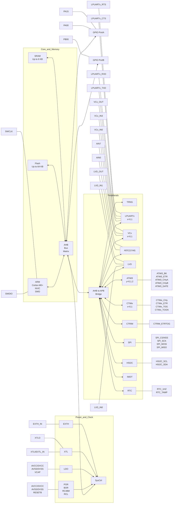

图 2-1 系统架构示意图

## 2.2 系统地址划分

系统的地址区域划分：


<table>
  <thead>
    <tr>
        <th>Start Address</th>
        <th>End Address</th>
        <th>Description</th>
        <th>Bus</th>
    </tr>
  </thead>
  <tbody>
    <tr>
        <td rowspan="2">0xE0100000</td>
        <td> </td>
        <td>---</td>
        <td> </td>
    </tr>
    <tr>
        <td>0xE0000000</td>
        <td>CM0+ Internal Peripheral</td>
        <td> </td>
    </tr>
    <tr>
        <td>0xE0000000</td>
        <td> </td>
        <td>---</td>
        <td> </td>
    </tr>
    <tr>
        <td>0x40022000</td>
        <td>0x40020000</td>
        <td>AHB</td>
        <td>AHB BUS</td>
    </tr>
    <tr>
        <td>0x40020000</td>
        <td> </td>
        <td>---</td>
        <td> </td>
    </tr>
    <tr>
        <td>0x4000C000</td>
        <td>0x40008000</td>
        <td>APB1</td>
        <td>APB BUS 1</td>
    </tr>
    <tr>
        <td>0x40008000</td>
        <td>0x40000000</td>
        <td>APB0</td>
        <td>APB BUS 0</td>
    </tr>
    <tr>
        <td>0x40000000</td>
        <td> </td>
        <td>---</td>
        <td> </td>
    </tr>
    <tr>
        <td>0x20001800</td>
        <td>0x20000000</td>
        <td>SRAM (6KByte)</td>
        <td> </td>
    </tr>
    <tr>
        <td>0x20000000</td>
        <td> </td>
        <td>---</td>
        <td> </td>
    </tr>
    <tr>
        <td>0x00010000</td>
        <td>0x00000000</td>
        <td>FLASH (64KByte)</td>
        <td> </td>
    </tr>
  </tbody>
</table>
<table>
  <thead>
    <tr>
        <th>Bus</th>
        <th>Peripheral</th>
        <th>Address</th>
    </tr>
  </thead>
  <tbody>
    <tr>
        <td rowspan="9">AHB BUS</td>
        <td>-</td>
        <td>0x40022000</td>
    </tr>
    <tr>
        <td>SYSCTRL</td>
        <td>0x40021C00</td>
    </tr>
    <tr>
        <td>-</td>
        <td>0x40021800</td>
    </tr>
    <tr>
        <td>-</td>
        <td>0x40021400</td>
    </tr>
    <tr>
        <td>GPIOA/B</td>
        <td>0x40021000</td>
    </tr>
    <tr>
        <td>-</td>
        <td>0x40020C00</td>
    </tr>
    <tr>
        <td>-</td>
        <td>0x40020800</td>
    </tr>
    <tr>
        <td>FLASH CTRL</td>
        <td>0x40020400</td>
    </tr>
    <tr>
        <td>0x40020000</td>
        <td></td>
    </tr>
    <tr>
        <td rowspan="15">APB BUS 1</td>
        <td>HSI2C</td>
        <td>0x4000C000</td>
    </tr>
    <tr>
        <td>-</td>
        <td>0x4000BC00</td>
    </tr>
    <tr>
        <td>-</td>
        <td>0x4000B800</td>
    </tr>
    <tr>
        <td>-</td>
        <td>0x4000B400</td>
    </tr>
    <tr>
        <td>-</td>
        <td>0x4000A800</td>
    </tr>
    <tr>
        <td>-</td>
        <td>0x4000A400</td>
    </tr>
    <tr>
        <td>-</td>
        <td>0x4000A000</td>
    </tr>
    <tr>
        <td>ATIM3</td>
        <td>0x40009C00</td>
    </tr>
    <tr>
        <td>-</td>
        <td>0x40009800</td>
    </tr>
    <tr>
        <td>CTRIM</td>
        <td>0x40009400</td>
    </tr>
    <tr>
        <td>TRNG</td>
        <td>0x40009000</td>
    </tr>
    <tr>
        <td>-</td>
        <td>0x40008C00</td>
    </tr>
    <tr>
        <td>-</td>
        <td>0x40008800</td>
    </tr>
    <tr>
        <td>LPUART1</td>
        <td>0x40008400</td>
    </tr>
    <tr>
        <td>-</td>
        <td>0x40008000</td>
    </tr>
    <tr>
        <td rowspan="16">APB BUS 0</td>
        <td>-</td>
        <td>0x40003C00</td>
    </tr>
    <tr>
        <td>-</td>
        <td>0x40003800</td>
    </tr>
    <tr>
        <td>-</td>
        <td>0x40003400</td>
    </tr>
    <tr>
        <td>LVD</td>
        <td>0x40003000</td>
    </tr>
    <tr>
        <td>VC</td>
        <td>0x40002C00</td>
    </tr>
    <tr>
        <td>ADC</td>
        <td>0x40002800</td>
    </tr>
    <tr>
        <td>-</td>
        <td>0x40002400</td>
    </tr>
    <tr>
        <td>CTIM1</td>
        <td>0x40002000</td>
    </tr>
    <tr>
        <td>CTIM0</td>
        <td>0x40001C00</td>
    </tr>
    <tr>
        <td>RTC</td>
        <td>0x40001800</td>
    </tr>
    <tr>
        <td>IWDT</td>
        <td>0x40001400</td>
    </tr>
    <tr>
        <td>-</td>
        <td>0x40001000</td>
    </tr>
    <tr>
        <td>SPI</td>
        <td>0x40000C00</td>
    </tr>
    <tr>
        <td>-</td>
        <td>0x40000800</td>
    </tr>
    <tr>
        <td>LPUART0</td>
        <td>0x40000400</td>
    </tr>
    <tr>
        <td>0x40000000</td>
        <td></td>
    </tr>
  </tbody>
</table>

## 2.3 存储器和模块地址分配

表 2-1 地址划分表


<table>
  <thead>
    <tr>
        <th>类别</th>
        <th>Boundary Address</th>
        <th>Size</th>
        <th>Memory Area</th>
    </tr>
  </thead>
  <tbody>
    <tr>
        <td rowspan="2">存储器</td>
        <td>0x00000000 - 0x0000FFFF</td>
        <td>64KByte</td>
        <td>FLASH</td>
    </tr>
    <tr>
        <td>0x20000000 - 0x200017FF</td>
        <td>6KByte</td>
        <td>SRAM</td>
    </tr>
    <tr>
        <td rowspan="9">APB0 外设</td>
        <td>0x40000000 - 0x400003FF</td>
        <td>1KByte</td>
        <td>LPUART0</td>
    </tr>
    <tr>
        <td>0x40000800 - 0x40000BFF</td>
        <td>1KByte</td>
        <td>SPI</td>
    </tr>
    <tr>
        <td>0x40001000 - 0x400013FF</td>
        <td>1KByte</td>
        <td>IWDT</td>
    </tr>
    <tr>
        <td>0x40001400 - 0x400017FF</td>
        <td>1KByte</td>
        <td>RTC</td>
    </tr>
    <tr>
        <td>0x40001800 - 0x40001BFF</td>
        <td>1KByte</td>
        <td>CTIM0</td>
    </tr>
    <tr>
        <td>0x40001C00 - 0x40001FFF</td>
        <td>1KByte</td>
        <td>CTIM1</td>
    </tr>
    <tr>
        <td>0x40002400 - 0x400027FF</td>
        <td>1KByte</td>
        <td>ADC</td>
    </tr>
    <tr>
        <td>0x40002800 - 0x40002BFF</td>
        <td>1KByte</td>
        <td>VC</td>
    </tr>
    <tr>
        <td>0x40002C00 - 0x40002FFF</td>
        <td>1KByte</td>
        <td>LVD</td>
    </tr>
    <tr>
        <td rowspan="5">APB1 外设</td>
        <td>0x40008000 - 0x400083FF</td>
        <td>1KByte</td>
        <td>LPUART1</td>
    </tr>
    <tr>
        <td>0x40008C00 - 0x40008FFF</td>
        <td>1KByte</td>
        <td>TRNG</td>
    </tr>
    <tr>
        <td>0x40009000 - 0x400093FF</td>
        <td>1KByte</td>
        <td>CTRIM</td>
    </tr>
    <tr>
        <td>0x40009800 - 0x40009BFF</td>
        <td>1KByte</td>
        <td>ATIM3</td>
    </tr>
    <tr>
        <td>0x4000BC00 - 0x4000BFFF</td>
        <td>1KByte</td>
        <td>HSI2C</td>
    </tr>
    <tr>
        <td rowspan="3">AHB 外设</td>
        <td>0x40020000 - 0x400203FF</td>
        <td>1KByte</td>
        <td>FLASH CTRL</td>
    </tr>
    <tr>
        <td>0x40020C00 - 0x40020FFF</td>
        <td>1KByte</td>
        <td>GPIOA/B</td>
    </tr>
    <tr>
        <td>0x40021800 - 0x40021BFF</td>
        <td>1KByte</td>
        <td>SYSCTRL</td>
    </tr>
  </tbody>
</table>

# 3 工作模式

## 3.1 概述

本产品在电源管理模块的控制下可实现三种工作模式，各工作模式下可工作的功能模块及功耗各不相同。
本产品支持以下工作模式：

1. 运行模式（Active Mode）：CPU 运行，周边功能模块运行。

2. 休眠模式（Sleep Mode）：CPU 停止，周边功能模块运行。

3. 深度休眠模式（Deep Sleep Mode）：CPU 停止，高速时钟模块停止运行。

## 3.2 工作模式切换

本产品工作时可在三种工作模式之间自由切换。在运行模式下执行 WFI 指令，可使本产品进入休眠模式或深度休眠模式。从休眠模式或深度休眠模式通过中断唤醒，回到运行模式。

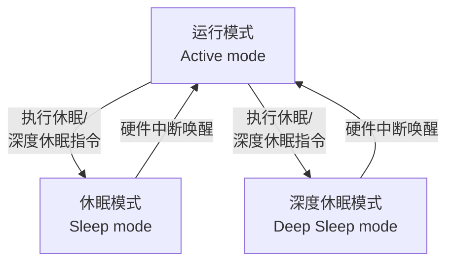

图 3-1 工作模式状态转换图

在各种工作模式下，CPU 可响应的中断详见《中断控制器（NVIC）》章节“中断源”。

在不同工作模式下，系统可响应的复位类型如下：

表 3-1 不同工作模式下系统可响应的复位类型


<table>
  <thead>
    <tr>
        <th>复位向量编号</th>
        <th>复位来源</th>
        <th>运行模式</th>
        <th>休眠模式</th>
        <th>深度休眠模式</th>
    </tr>
  </thead>
  <tbody>
    <tr>
        <td>[0]</td>
        <td>上电掉电复位 POR/BOR</td>
        <td>✓</td>
        <td>✓</td>
        <td>✓</td>
    </tr>
    <tr>
        <td>[1]</td>
        <td>硬件复位 RESETB 管脚</td>
        <td>✓</td>
        <td>✓</td>
        <td>✓</td>
    </tr>
    <tr>
        <td>[2]</td>
        <td>硬件复位 LVD</td>
        <td>✓</td>
        <td>✓</td>
        <td>✓</td>
    </tr>
    <tr>
        <td>[3]</td>
        <td>硬件复位 IWDT</td>
        <td>✓</td>
        <td>✓</td>
        <td>✓</td>
    </tr>
    <tr>
        <td>[4]</td>
        <td>硬件复位 Cortex-M0+ LOCKUP</td>
        <td>✓</td>
        <td>✕</td>
        <td>✕</td>
    </tr>
    <tr>
        <td>[5]</td>
        <td>软件复位 Cortex-M0+<br/>SYSRESETREQ</td>
        <td>✓</td>
        <td>✕</td>
        <td>✕</td>
    </tr>
  </tbody>
</table>

## 3.3 运行模式（Active Mode）

系统在电源上电复位后，或从各低功耗唤醒后，微控制器 MCU 处于运行状态。当 CPU 不需继续运行时，可以利用多种低功耗模式来节能，例如等待某个外部事件时。用户需要根据最低能耗、最快速启动时间、可用的唤醒源等条件，选定一个最佳的低功耗模式。

运行模式下，几种常用的降低芯片功耗的方法：

1. 在运行模式下，通过对预分频寄存器（SYSCTRL0.HCLK_PRS）进行编程，可以降低系统时钟（HCLK）的速度。
2. 在运行模式下，关闭不使用外设的时钟（PERI_CLKENx）来减少功耗。
3. 在执行 WFI 指令前关闭不使用外设的时钟（PERI_CLKENx）。
4. 在某些场景中，可以使用低功耗模式代替运行模式，因为本产品的唤醒时间极短，亦可满足系统的实时响应的需求。

## 3.4 休眠模式（Sleep Mode）

使用 WFI 指令可以进入休眠模式。休眠模式下 CPU 停止运行，但时钟模块、系统时钟、NVIC 中断处理以及周边的功能模块仍都正常工作。

系统进入休眠状态，不会改变端口状态，在进入休眠前根据需要更改 IO 的状态为休眠下的状态。

### 进入休眠模式

通过执行 WFI 指令进入休眠状态。根据 Cortex-M0+ 系统控制寄存器中的 SLEEPONEXIT 位的值，有两种选项可用于选择休眠模式进入机制：

* SLEEP-NOW：如果 SLEEPONEXIT 位被清除，当 WFI 被执行时，微控制器立即进入休眠模式。
* SLEEP-ON-EXIT：如果 SLEEPONEXIT 位被置位，系统从最低优先级的中断处理程序中退出时，微控制器就立即进入休眠模式。

### 退出休眠模式

如果执行 WFI 指令进入休眠模式，任意一个被高优先级嵌套向量中断控制器响应的外设中断都能将系统从休眠模式唤醒。

### 注意事项

* SLEEPONEXIT 位置 1，执行完中断自动进入 Sleep，程序不需要写\_\_wfi();
* SLEEPONEXIT 位清 0，main()执行\_\_wfi()后进入 Sleep，中断触发且执行完中断程序返回 main()后，执行 WFI 指令后进入 Sleep。等待后续中断触发。
* SLEEPONEXIT 位不影响\_\_wfi()指令的执行。SLEEPONEXIT=0：main()执行 wfi()后进入 Sleep，中断触发且执行完中断程序返回 main()后，继续往下执行；
* 若在中断中进入 Sleep，只有优先级高于此中断的中断才能唤醒，先执行高优先级，再执行低优先级；优先级低于或等于此中断的中断不能唤醒。
* 执行 WFE 进入休眠和唤醒的内容，请查询 Cortex-M0+ 相关手册。

## 3.5 深度休眠模式（Deep Sleep Mode）

使用 SLEEPDEEP 配合 WFI 指令可以进入深度休眠模式。在深度休眠模式下，CPU 停止运行，高速时钟关闭，低速时钟可配置是否运行，部分低功耗的周边模块可配置是否运行，NVIC 中断处理仍可以工作。

* 当高速时钟作为系统时钟，系统进入深度休眠模式，高速时钟自动关闭，低速时钟保持进入深度休眠前的状态。
* 当低速时钟作为系统时钟，系统进入深度休眠模式，由于低速时钟不会自动关闭，进入深度休眠模式时保持运行。只有 ARM Cortex-M0+ 不运行，其他模块都运行。
* 系统时钟切换时，所有时钟都不会自动关闭，需要根据功耗及系统需求软件关闭打开相应的时钟。
* 系统进入深度休眠状态，不会改变端口状态，在进入深度休眠前根据需要更改 IO 的状态为深度休眠下的状态。

### 进入深度休眠模式

首先设置 Cortex-M0+ 系统控制寄存器中的 SLEEPDEEP 位，通过执行 WFI 指令进入深度休眠状态。根据系统控制寄存器中的 SLEEPONEXIT 位的值，有两种选项可用于选择深度休眠模式进入机制：

* SLEEP-NOW：如果 SLEEPONEXIT 位被清除，当 WFI 被执行时，微控制器立即进入深度休眠模式。

* ● SLEEP-ON-EXIT：如果 SLEEPONEXIT 位被置位，系统从最低优先级的中断处理程序中退出时，微控制器就立即进入深度休眠模式。

## 退出深度休眠模式

如果执行 WFI 指令进入深度休眠模式，任意一个被高优先级嵌套向量中断控制器响应的外设中断（Deep Sleep 下可运行的周边模块中断）都能将系统从深度休眠模式唤醒。

唤醒设置请参考《系统控制器（SYSCRTL）》章节“中断唤醒控制”相关描述。

## 注意事项

* ● SLEEPONEXIT 位置 1，执行完中断自动进入 Deep Sleep，程序不需要写\_\_wfi()。

* ● SLEEPONEXIT 位清 0，main()执行\_\_wfi()后进入 Deep Sleep，中断触发且执行完中断程序返回 main()后，执行 WFI 指令后进入 Deep Sleep。等待后续中断触发。

* ● SLEEPONEXIT 位不影响\_\_wfi()指令的执行。SLEEPONEXIT=0：main()执行 wfi()后进入 Deep Sleep，中断触发且执行完中断程序返回 main()后，继续往下执行。

* ● 若在中断中进入 Deep Sleep，只有优先级高于此中断的中断才能唤醒，先执行高优先级，再执行低优先级；优先级低于或等于此中断的中断不能唤醒。

* ● 执行 WFE 进入深度休眠和唤醒的内容，请查询 Cortex-M0+ 相关手册。

## 3.6 功能/模块工作状态

在三种工作模式下功能/模块的工作状态对比如下表所示：

表 3-2 各模式下功能/模块工作状态表


<table>
<thead>
<tr>
<th>功能/模块</th>
<th>运行模式</th>
<th>休眠模式</th>
<th>深度休眠模式</th>
</tr>
</thead>
<tbody>
<tr>
<td>Cortex-M0+</td>
<td>✓</td>
<td>✕</td>
<td>✕</td>
</tr>
<tr>
<td>XTL</td>
<td>✓</td>
<td>✓</td>
<td>✓</td>
</tr><tr>
<td>RC48M</td>
<td>✓</td>
<td>✓</td>
<td>✕</td>
</tr><tr>
<td>RCL</td>
<td>✓</td>
<td>✓</td>
<td>✓</td>
</tr><tr>
<td>RESET</td>
<td>✓</td>
<td>✓</td>
<td>✓</td>
</tr><tr>
<td>GPIO</td>
<td>✓</td>
<td>✓</td>
<td>✓</td>
</tr><tr>
<td>HSI2C</td>
<td>✓</td>
<td>✓</td>
<td>✓(3)</td>
</tr><tr>
<td>SPI</td>
<td>✓</td>
<td>✓</td>
<td>✕</td>
</tr><tr>
<td>CTRIM</td>
<td>✓</td>
<td>✓</td>
<td>✓(2)</td>
</tr><tr>
<td>FLASH</td>
<td>✓</td>
<td>✓</td>
<td>✕</td>
</tr><tr>
<td>RAM</td>
<td>✓</td>
<td>✓</td>
<td>✕</td>
</tr><tr>
<td>CTIM</td>
<td>✓</td>
<td>✓</td>
<td>✕</td>
</tr><tr>
<td>ATIM3</td>
<td>✓</td>
<td>✓</td>
<td>✕</td>
</tr><tr>
<td>RTC</td>
<td>✓</td>
<td>✓</td>
<td>✓</td>
</tr><tr>
<td>IWDT</td>
<td>✓</td>
<td>✓</td>
<td>✓</td>
</tr><tr>
<td>LPUART</td>
<td>✓</td>
<td>✓</td>
<td>✓(2)</td>
</tr><tr>
<td>TRNG</td>
<td>✓</td>
<td>✓</td>
<td>✕</td>
</tr><tr>
<td>ADC</td>
<td>✓</td>
<td>✓</td>
<td>✕</td>
</tr>
<tr>
<td>VC</td>
<td>✓</td>
<td>✓</td>
<td>✓(1)</td>
</tr>
<tr>
<td>LVD</td>
<td>✓</td>
<td>✓</td>
<td>✓</td>
</tr>
<tr>
<td>SWD</td>
<td>✓</td>
<td>✓</td>
<td>✓</td>
</tr>
</tbody>
</table>

> >  **注意**
> > 1. 深度休眠模式如果使用 VC 唤醒功能，VC 滤波时钟不能选择 PCLK。
> > 2. 工作时钟为 PCLK 时不支持深度休眠模式唤醒。
> > 3. 只有从机模式支持 DeepSleep 唤醒。
> > 4. 在执行 WFI 命令进入深度休眠模式之前，必须关闭所有不用于唤醒 MCU 的中断。

# 3.7 寄存器

## 3.7.1 系统控制寄存器（SCB_SCR）（Cortex-M0+ 内核系统控制寄存器）

**基地址**：0xE000ED10


<table>
  <thead>
    <tr>
        <th>Offset</th>
        <th colspan="32">Bit Position</th>
    </tr>
    <tr>
        <th>-</th>
        <th>31</th>
        <th>30</th>
        <th>29</th>
        <th>28</th>
        <th>27</th>
        <th>26</th>
        <th>25</th>
        <th>24</th>
        <th>23</th>
        <th>22</th>
        <th>21</th>
        <th>20</th>
        <th>19</th>
        <th>18</th>
        <th>17</th>
        <th>16</th>
        <th>15</th>
        <th>14</th>
        <th>13</th>
        <th>12</th>
        <th>11</th>
        <th>10</th>
        <th>9</th>
        <th>8</th>
        <th>7</th>
        <th>6</th>
        <th>5</th>
        <th>4</th>
        <th>3</th>
        <th>2</th>
        <th>1</th>
        <th>0</th>
    </tr>
    <tr>
        <th>Reset</th>
        <th colspan="32">0x00000000</th>
    </tr>
    <tr>
        <th>Name</th>
        <th colspan="27">Reserved</th>
        <th>SEVONPEND</th>
        <th>Reserved</th>
        <th>SLEEPDEEP</th>
        <th>SLEEPONEXIT</th>
        <th>Reserved</th>
    </tr>
    <tr>
        <th>Access</th>
        <th colspan="27"> </th>
        <th>RW</th>
        <th> </th>
        <th>RW</th>
        <th>RW</th>
        <th> </th>
    </tr>
  </thead>
</table>
<table>
  <thead>
    <tr>
        <th>位/位域</th>
        <th>标记</th>
        <th>位名</th>
        <th>功能描述</th>
        <th>读写</th>
    </tr>
  </thead>
  <tbody>
    <tr>
        <td>31:5</td>
        <td>Reserved</td>
        <td>保留</td>
        <td>-</td>
        <td>-</td>
    </tr>
    <tr>
        <td>4</td>
        <td>SEVONPEND</td>
        <td>挂起时发送事件</td>
        <td>● 0b1：如果使用了 WFE 进入休眠或深度休眠模式，任何新挂起的事件都可以唤醒处理器</td>
        <td>RW</td>
    </tr>
    <tr>
        <td>3</td>
        <td>Reserved</td>
        <td>保留</td>
        <td>-</td>
        <td>-</td>
    </tr>
    <tr>
        <td>2</td>
        <td>SLEEPDEEP</td>
        <td>休眠模式选择</td>
        <td>● 0b0：休眠（Sleep）模式<br/>● 0b1：深度休眠（Deep Sleep）模式</td>
        <td>RW</td>
    </tr>
    <tr>
        <td>1</td>
        <td>SLEEPONEXIT</td>
        <td>退出时休眠特性</td>
        <td>● 0b0：禁止退出时休眠特性<br/>● 0b1：使能退出时休眠特性，当退出异常处理并返回程序线程时，处理器自动进入休眠或深度休眠模式（WFI）</td>
        <td>RW</td>
    </tr>
    <tr>
        <td>0</td>
        <td>Reserved</td>
        <td>保留</td>
        <td>-</td>
        <td>-</td>
    </tr>
  </tbody>
</table>

# 4 FLASH 控制器（FLASH）

## 4.1 简介

本系统包含一块 64KB 容量的 FLASH 存储器，共划分为 128 个页（Sector），每个页（Sector）的容量为 512 字节（Byte）。

本控制器支持对 FLASH 存储器的擦除、编程以及读操作，还支持对 FLASH 存储器擦写保护，以及控制寄存器的写保护。

本控制器支持对 FLASH 的 byte（8 位）、half-word（16 位）和 word（32 位）三种位宽的数据读写操作。注意，half-word 操作的目标地址必须按半字对齐（地址最低位为 0b0），word 操作的地址必须按字对齐（地址最低两位为 0b00）。如果目标地址没有按照位宽对齐，则该操作无效，并且 CPU 会进入 Hard Fault 出错中断。

## 4.2 功能说明

### 4.2.1 容量划分

容量划分的地址和序号对应关系如下：

表 4-1 FLASH 容量划分表


<table>
  <thead>
    <tr>
        <th>地址</th>
        <th>序号</th>
        <th>...</th>
        <th>地址</th>
        <th>序号</th>
    </tr>
  </thead>
  <tbody>
    <tr>
        <td>0x0E00 – 0x0FFF</td>
        <td>Sector7</td>
        <td>...</td>
        <td>0x0FE00– 0x0FFFF</td>
        <td>Sector127</td>
    </tr>
    <tr>
        <td>0x0C00 – 0x0DFF</td>
        <td>Sector6</td>
        <td>...</td>
        <td>0x0FC00– 0x0FDFF</td>
        <td>Sector126</td>
    </tr>
    <tr>
        <td>0x0A00 – 0x0BFF</td>
        <td>Sector5</td>
        <td>...</td>
        <td>0x0FA00– 0x0FBFF</td>
        <td>Sector125</td>
    </tr>
    <tr>
        <td>0x0800 – 0x09FF</td>
        <td>Sector4</td>
        <td>...</td>
        <td>0x0F800– 0x0F9FF</td>
        <td>Sector124</td>
    </tr>
    <tr>
        <td>0x0600 – 0x07FF</td>
        <td>Sector3</td>
        <td>...</td>
        <td>0x0F600– 0x0F7FF</td>
        <td>Sector123</td>
    </tr>
    <tr>
        <td>0x0400 – 0x05FF</td>
        <td>Sector2</td>
        <td>...</td>
        <td>0x0F400– 0x0F5FF</td>
        <td>Sector122</td>
    </tr>
    <tr>
        <td>0x0200 – 0x03FF</td>
        <td>Sector1</td>
        <td>...</td>
        <td>0x0F200– 0x0F3FF</td>
        <td>Sector121</td>
    </tr>
    <tr>
        <td>0x0000 – 0x01FF</td>
        <td>Sector0</td>
        <td>...</td>
        <td>0x0F000– 0x0F1FF</td>
        <td>Sector120</td>
    </tr>
  </tbody>
</table>

### 4.2.2 读等待周期

本设备内置的 FLASH 支持的最快取指频率为 24MHz。当 HCLK 频率超过 24MHz 小于等于 48MHz 时，必须为 FLASH 的读取时间插入等待周期，即设置 FLASH_CR.WAIT 为 1。当插入等待周期时，FLASH 每两个周期才会完成一次读取操作。

### 4.2.3 FLASH 安全保护

#### 全片擦写保护

可通过设置 FLASH_CR.RO 为 1 将整个 FLASH 配置为只读，不可编程或擦除。

#### 页面擦写保护

整个 64KB FLASH 存储器被划分为 128 个页，每 4 个页共用一个擦写保护位。当页被保护时，对该页进行的擦写操作均无效并产生报警标志位和中断信号。当 FLASH 存储器中的任意页被保护时，对该 FLASH 的全片擦写无效，并产生报警标志位和中断信号。

# PC 地址擦写保护

CPU 在 FLASH 中运行程序时，如果当前 PC 指针正好落在待擦写的页地址范围之内，那么该擦写操作无效并产生报警标志位和中断信号。

# 寄存器写保护

本模块的重要控制器屏蔽普通的写操作，必须用写序列方式才能修改。

● 需要通过写序列方式才能更改的寄存器

FLASH_CR、FLASH_SLOCK0、FLASH_LOCK_ST

● 不需要通过写序列方式即可更改的寄存器

FLASH_ICLR、FLASH_BYPASS

通过写序列方式修改寄存器值的具体操作步骤如下所示：

步骤 1. 向 FLASH_BYPASS 寄存器写入 0x5A5A。

步骤 2. 向 FLASH_BYPASS 寄存器写入 0xA5A5。

步骤 3. 对待修改的寄存器写入目标值。

步骤 4. 验证待修改的寄存器当前值是否与目标相同，如不同则跳转到第一步。

步骤 5. 执行其他操作。


### 注意

写 0x5A5A、0xA5A5、写目标寄存器，这三步写操作之间不可插入任何写操作（如：FLASH、RAM、REG 等），否则无法改写目标寄存器的数值。如改写失败，需要重新进行这三步操作。

# 数据读出保护

本芯片 FLASH 支持 4 级读保护，当前保护等级可通过 FLASH_LOCK_ST 寄存器读出。使用编程工具对芯片进行编程时，可配置 FLASH 的读保护等级。

芯片在各保护等级下的功能如下表所示：


<table>
  <thead>
    <tr>
        <th>保护等级</th>
        <th>芯片功能</th>
    </tr>
  </thead>
  <tbody>
    <tr>
        <td>Level0</td>
        <td>可以通过 ISP 及 SWD 对 FLASH 进行读写，如通过其它等级降级至该等级，FLASH 内容会被强制擦除</td>
    </tr>
    <tr>
        <td>Level1</td>
        <td>数据不可读出<br/>可以通过 ISP 及 SWD 降级</td>
    </tr>
    <tr>
        <td>Level2</td>
        <td>数据不可读出<br/>可以通过 ISP 降级<br/>SWD 接口被禁止</td>
    </tr>
    <tr>
        <td>Level3</td>
        <td>数据不可读出<br/>ISP 及 SWD 接口功能被禁止，即芯片只能进行一次编程</td>
    </tr>
  </tbody>
</table>

# 4.3 操作示例


### 注意

● 当对 FLASH 进行擦除或写操作时，须将 FLASH_CR.RO 设置为 0，将 FLASH 配置为可读，可编程，可擦除。

● 当 FLASH 擦除或写操作完成后，建议将 FLASH_CR.RO 设置为 1，将 FLASH 配置为只读，不可编程或擦除。

### 4.3.1 页擦除（Sector Erase）

#### 背景信息

页擦除每次可以擦除用户指定的一个页（Sector）。擦除操作完成后，页（Sector）内的数据均为 0xFF。如果该擦除操作是从 FLASH 内执行，则 CPU 会停止取指，硬件自动等待该操作完成（FLASH_CR.BUSY 变为 0）；如果该擦除操作是从 RAM 内执行，则 CPU 不会停止取指，用户软件应等待该操作完成（FLASH_CR.BUSY 变为 0）。

#### 操作步骤

步骤 1. 向 FLASH_BYPASS 寄存器依次写入 0x5A5A、0xA5A5，使能寄存器改写。
步骤 2. 配置 FLASH_CR.OP 为 2，设置 Flash 操作模式为 Sector 擦除。
步骤 3. 检查 FLASH_CR.OP 是否为 2，如不为 2 则跳转到步骤 1。
步骤 4. 向 FLASH_BYPASS 寄存器依次写入 0x5A5A、0xA5A5，使能寄存器改写。
步骤 5. 设置 FLASH_SLOCK 相应的比特为 1，去除该 Sector 的擦写保护。
步骤 6. 检查 FLASH_SLOCK 相应的比特是否为 1，如不为 1 则跳转到步骤 4。
步骤 7. 对待擦除的 Sector 内的任意地址进行写入任意数据，触发 Sector 擦除。

> `*((unsigned char *)0x00000200) = 0x00`

步骤 8. 等待 FLASH_CR.BUSY 变为 0，Sector 擦除操作完成。
步骤 9. 如需擦除其它 Sector，重复步骤 4~步骤 8。

### 4.3.2 全片擦除（Chip Erase）

#### 背景信息

全片擦除可以一次性擦除全部的页（Sector）。擦除操作完成后，所有页（Sector）内的数据均为 0xFF。如果该擦除操作是从 FLASH 内执行，则该操作会被禁止。因为该操作会擦除当前 PC 所在的程序段。如发生这种情况，IFR.PC 会被置起；如果该擦除操作是从 RAM 内执行，则 CPU 不会停止取指，用户软件应等待该操作完成（FLASH_CR.BUSY 变为 0）。

#### 操作步骤

步骤 1. 向 FLASH_BYPASS 寄存器依次写入 0x5A5A、0xA5A5，使能寄存器改写。
步骤 2. 配置 FLASH_CR.OP 为 3，设置 Flash 操作模式为 Chip 擦除。
步骤 3. 检查 FLASH_CR.OP 是否为 3，如不为 3 则跳转到步骤 1。
步骤 4. 向 FLASH_BYPASS 寄存器依次写入 0x5A5A、0xA5A5，使能寄存器改写。
步骤 5. 设置 FLASH_SLOCK0 为 0xFFFFFFFF，去除 Sector0~127 的擦写保护。
步骤 6. 检查 FLASH_SLOCK0 是否为 0xFFFFFFFF，如不为 0xFFFFFFFF 则跳转到步骤 4。
步骤 7. 对待擦除的 Chip 内的任意地址进行写操作，触发 Chip 擦除。

> `*((unsigned char *)0x00000000) = 0x00`

步骤 8. 等待 FLASH_CR.BUSY 变为 0，Chip 擦除操作完成。

### 4.3.3 写操作（Program）

#### 背景信息

写操作只能将 FLASH 内的比特数据由 1 写成 0，故写入数据前应确保待写入的地址内的数据为 0xFF。支持 3 种写入方式：Byte（8bits）、Half-word（16bits）、Word（32bits），写入的数据以小端模式存放在 FLASH 中，即低地址存放数据的低字节。如果写操作是从 FLASH 内执行，则 CPU 会停止取指，硬件自动等待该操作完成（FLASH_CR.BUSY 变为 0）；如果该写操作是从 RAM 内执行，则 CPU 不会停止取指，用户软件应等待该操作完成（FLASH_CR.BUSY 变为 0）。

# 操作步骤

## ● Byte 写操作

步骤 1. 向 FLASH_BYPASS 寄存器依次写入 0x5A5A、0xA5A5，使能寄存器改写。

步骤 2. 配置 FLASH_CR.OP 为 1，设置 Flash 操作模式为写入。

步骤 3. 检查 FLASH_CR.OP 是否为 1，如不为 1 则跳转到步骤 1。

步骤 4. 向 FLASH_BYPASS 寄存器依次写入 0x5A5A、0xA5A5，使能寄存器改写。

步骤 5. 设置 FLASH_SLOCK 相应的比特为 1，去除擦写保护。

步骤 6. 检查 FLASH_SLOCK 相应的比特是否为 1，如不为 1 则跳转到步骤 4。

步骤 7. 对待写入的目标地址进行 Byte 写操作，触发写入操作。

`*((unsigned char *)0x00001231) = 0x5A`

步骤 8. 等待 FLASH_CR.BUSY 变为 0，写入操作完成。

步骤 9. 如需写 Byte 到其它地址，重复步骤 7~步骤 8。

## ● Half-word 写操作

步骤 1. 向 FLASH_BYPASS 寄存器依次写入 0x5A5A、0xA5A5，使能寄存器改写。

步骤 2. 配置 FLASH_CR.OP 为 1，设置 Flash 操作模式为写入。

步骤 3. 检查 FLASH_CR.OP 是否为 1，如不为 1 则跳转到步骤 1。

步骤 4. 向 FLASH_BYPASS 寄存器依次写入 0x5A5A、0xA5A5，使能寄存器改写。

步骤 5. 设置 FLASH_SLOCK 相应的比特为 1，去除擦写保护。

步骤 6. 检查 FLASH_SLOCK 相应的比特是否为 1，如不为 1 则跳转到步骤 4。

步骤 7. 对待写入的目标地址进行 Half-word 写操作，触发写入操作。

`*((unsigned short int *)0x00001232) = 0xABCD`

步骤 8. 等待 FLASH_CR.BUSY 变为 0，写入操作完成。

步骤 9. 如需写 Half-word 到其它地址，重复步骤 7~步骤 8。

## ● Word 写操作

步骤 1. 向 FLASH_BYPASS 寄存器依次写入 0x5A5A、0xA5A5，使能寄存器改写。

步骤 2. 配置 FLASH_CR.OP 为 1，设置 Flash 操作模式为写入。

步骤 3. 检查 FLASH_CR.OP 是否为 1，如不为 1 则跳转到步骤 1。

步骤 4. 向 FLASH_BYPASS 寄存器依次写入 0x5A5A、0xA5A5，使能寄存器改写。

步骤 5. 设置 FLASH_SLOCK 相应的比特为 1，去除擦写保护。

步骤 6. 检查 FLASH_SLOCK 相应的比特是否为 1，如不为 1 则跳转到步骤 4。

步骤 7. 对待写入的目标地址进行 Word 写操作，触发写入操作。

`*((unsigned int *)0x00001234) = 0x55667788`

步骤 8. 等待 FLASH_CR.BUSY 变为 0，写入操作完成。

步骤 9. 如需写 Word 到其它地址，重复步骤 7~步骤 8。

## 4.3.4 连续写操作（Cont-Program）

### 背景信息

写操作只能将 FLASH 内的比特数据由 1 写成 0，故写入数据前应确保待写入的地址内的数据为 0xFF。支持 3 种写入方式：Byte（8bits）、Half-word（16bits）、Word（32bits），写入的数据以小端模式存放。

在 FLASH 中，即低地址存放数据的低字节。连续写操作只能从 RAM 内执行，并且禁止对 FLASH 做“读操作”，用户软件应等待该操作完成（FLASH_CR.BUSY 变为 0）。

连续编程时建议 HCLK 不低于 2MHz。

# 操作步骤

## ● Byte 写操作

步骤 1. 向 FLASH_BYPASS 寄存器依次写入 0x5A5A、0xA5A5，使能寄存器改写。

步骤 2. 配置 FLASH_CR.OP 值为 0。

步骤 3. 向 FLASH_BYPASS 寄存器依次写入 0x5A5A、0xA5A5，使能寄存器改写。

步骤 4. 配置 FLASH_CR.CONTP 为 1，设置 Flash 操作模式为连续写入。

步骤 5. 检查 FLASH_CR.OP 和 FLASH_CR.CONTP 是否为 0 和 1，如不为则跳转到步骤 1。

步骤 6. 向 FLASH_BYPASS 寄存器依次写入 0x5A5A、0xA5A5，使能寄存器改写。

步骤 7. 设置 FLASH_SLOCK 相应的比特为 1，去除擦写保护。

步骤 8. 检查 FLASH_SLOCK 相应的比特是否为 1，如不为 1 则跳转到步骤 6。

步骤 9. 对待写入的目标地址进行 Byte 写操作，触发写入操作。

`*((unsigned char *)0x00001232) = 0xAB`

步骤 10. 等待 FLASH_CR.BUSY 变为 0，写入操作完成。

步骤 11. 如需写 Byte 到其它地址，重复步骤 9~步骤 10。

步骤 12. 全部数据写完后执行下一步。

步骤 13. 向 FLASH_BYPASS 寄存器依次写入 0x5A5A、0xA5A5，使能寄存器改写。

步骤 14. 配置 FLASH_CR.OP 为 1。

步骤 15. 向 FLASH_BYPASS 寄存器依次写入 0x5A5A、0xA5A5，使能寄存器改写。

步骤 16. 配置 FLASH_CR.CONTP 为 0。

步骤 17. 检查 FLASH_CR.OP 和 FLASH_CR.CONTP 是否为 1 和 0，如不为则跳转到步骤 13。

步骤 18. 等待 FLASH_CR.BUSY 变为 0。

步骤 19. 后续 FLASH_CR.OP 可以改为其他模式的值完成其他功能操作。

## ● Half-word 写操作

步骤 1. 向 FLASH_BYPASS 寄存器依次写入 0x5A5A、0xA5A5，使能寄存器改写。

步骤 2. 配置 FLASH_CR.OP 值为 0。

步骤 3. 向 FLASH_BYPASS 寄存器依次写入 0x5A5A、0xA5A5，使能寄存器改写。

步骤 4. 配置 FLASH_CR.CONTP 为 1，设置 Flash 操作模式为连续写入。

步骤 5. 检查 FLASH_CR.OP 和 FLASH_CR.CONTP 是否为 0 和 1，如不为则跳转到步骤 1。

步骤 6. 向 FLASH_BYPASS 寄存器依次写入 0x5A5A、0xA5A5，使能寄存器改写。

步骤 7. 设置 FLASH_SLOCK 相应的比特为 1，去除擦写保护。

步骤 8. 检查 FLASH_SLOCK 相应的比特是否为 1，如不为 1 则跳转到步骤 6。

步骤 9. 对待写入的目标地址进行 Half-word 写操作，触发写入操作。

`*((unsigned short int *)0x00001232) = 0xABCD`

步骤 10. 等待 FLASH_CR.BUSY 变为 0，写入操作完成。

步骤 11. 如需写 Half-word 到其它地址，重复步骤 9~步骤 10。

步骤 12. 全部数据写完后执行下一步。

步骤 13. 向 FLASH_BYPASS 寄存器依次写入 0x5A5A、0xA5A5，使能寄存器改写。

步骤 14. 配置 FLASH_CR.OP 为 1。

步骤 15. 向 FLASH_BYPASS 寄存器依次写入 0x5A5A、0xA5A5，使能寄存器改写。

步骤 16. 配置 FLASH_CR.CONTP 为 0。

步骤 17. 检查 FLASH_CR.OP 和 FLASH_CR.CONTP 是否为 1 和 0，如不为则跳转到步骤 13。

步骤 18. 等待 FLASH_CR.BUSY 变为 0。

步骤 19. 后续 FLASH_CR.OP 可以改为其他模式的值完成其他功能操作。

● Word 写操作

步骤 1. 向 FLASH_BYPASS 寄存器依次写入 0x5A5A、0xA5A5，使能寄存器改写。

步骤 2. 配置 FLASH_CR.OP 值为 0。

步骤 3. 向 FLASH_BYPASS 寄存器依次写入 0x5A5A、0xA5A5，使能寄存器改写。

步骤 4. 配置 FLASH_CR.CONTP 为 1，设置 Flash 操作模式为连续写入。

步骤 5. 检查 FLASH_CR.OP 和 FLASH_CR.CONTP 是否为 0 和 1，如不为则跳转到步骤 1。

步骤 6. 向 FLASH_BYPASS 寄存器依次写入 0x5A5A、0xA5A5，使能寄存器改写。

步骤 7. 设置 FLASH_SLOCK 相应的比特为 1，去除擦写保护。

步骤 8. 检查 FLASH_SLOCK 相应的比特是否为 1，如不为 1 则跳转到步骤 6。

步骤 9. 对待写入的目标地址进行 Word 写操作，触发写入操作。

`*((unsigned int *)0x00001234) = 0xABCDABCD`

步骤 10. 等待 FLASH_CR.BUSY 变为 0，写入操作完成。

步骤 11. 如需写 Word 到其它地址，重复步骤 9~步骤 10。

步骤 12. 全部数据写完后执行下一步。

步骤 13. 向 FLASH_BYPASS 寄存器依次写入 0x5A5A、0xA5A5，使能寄存器改写。

步骤 14. 配置 FLASH_CR.OP 为 1，设置 Flash 操作模式为写入。

步骤 15. 向 FLASH_BYPASS 寄存器依次写入 0x5A5A、0xA5A5，使能寄存器改写。

步骤 16. 配置 FLASH_CR.CONTP 为 0。

步骤 17. 检查 FLASH_CR.OP 和 FLASH_CR.CONTP 是否为 1 和 0，如不为则跳转到步骤 13。

步骤 18. 等待 FLASH_CR.BUSY 变为 0。

步骤 19. 后续 FLASH_CR.OP 可以改为其他模式的值完成其他功能操作。

### 4.3.5 读操作（Read）

#### 背景信息

支持 3 种读取方式：Byte（8bits）、Half-word（16bits）、Word（32bits），读出的数据为小端模式，即低地址存放数据的低字节。读操作无需操作步骤，任何时刻都可以读出 FLASH 内的数据。

#### 操作步骤

● Byte 读操作

`temp = *((unsigned char *)0x00001231)`

● Half-word 读操作

`temp = *((unsigned short int *)0x00001232)`

● Word 读操作

`temp = *((unsigned int *)0x00001234)`

# 4.4 寄存器

## 4.4.1 寄存器总表

**基地址**：0x40020000

表 4-3 FLASH 控制器（FLASH）寄存器偏移地址


<table>
  <thead>
    <tr>
        <th>偏移地址</th>
        <th>寄存器</th>
        <th>描述</th>
    </tr>
  </thead>
  <tbody>
    <tr>
        <td>0x20</td>
        <td>FLASH_CR</td>
        <td>控制寄存器</td>
    </tr>
    <tr>
        <td>0x24</td>
        <td>FLASH_IFR</td>
        <td>中断标志寄存器</td>
    </tr>
    <tr>
        <td>0x28</td>
        <td>FLASH_ICLR</td>
        <td>中断标志清除寄存器</td>
    </tr>
    <tr>
        <td>0x2C</td>
        <td>FLASH_BYPASS</td>
        <td>0x5A5A-0xA5A5 Bypass 序列寄存器</td>
    </tr>
    <tr>
        <td>0x30</td>
        <td>FLASH_SLOCK0</td>
        <td>Sector0-127 擦写保护寄存器</td>
    </tr>
    <tr>
        <td>0x6C</td>
        <td>FLASH_LOCK_ST</td>
        <td>保护状态寄存器</td>
    </tr>
  </tbody>
</table>

## 4.4.2 CR 寄存器（FLASH_CR）


<table>
  <thead>
    <tr>
        <th>Offset</th>
        <th colspan="32">Bit Position</th>
    </tr>
    <tr>
        <th>0x20</th>
        <th>31</th>
        <th>30</th>
        <th>29</th>
        <th>28</th>
        <th>27</th>
        <th>26</th>
        <th>25</th>
        <th>24</th>
        <th>23</th>
        <th>22</th>
        <th>21</th>
        <th>20</th>
        <th>19</th>
        <th>18</th>
        <th>17</th>
        <th>16</th>
        <th>15</th>
        <th>14</th>
        <th>13</th>
        <th>12</th>
        <th>11</th>
        <th>10</th>
        <th>9</th>
        <th>8</th>
        <th>7</th>
        <th>6</th>
        <th>5</th>
        <th>4</th>
        <th>3</th>
        <th>2</th>
        <th>1</th>
        <th>0</th>
    </tr>
    <tr>
        <th>Reset</th>
        <th colspan="32">0b00000000 00000000 0000X010 00000000</th>
    </tr>
    <tr>
        <th>Name</th>
        <th colspan="20">Reserved</th>
        <th>RO</th>
        <th>CONTP</th>
        <th>DPSTB_EN</th>
        <th colspan="2">Reserved</th>
        <th colspan="2">IE</th>
        <th>BUSY</th>
        <th colspan="2">WAIT</th>
        <th colspan="2">OP</th>
    </tr>
    <tr>
        <th>Access</th>
        <th colspan="20"> </th>
        <th>RW</th>
        <th>RW</th>
        <th>RW</th>
        <th colspan="2"> </th>
        <th colspan="2">RW</th>
        <th>RO</th>
        <th colspan="2">RW</th>
        <th colspan="2">RW</th>
    </tr>
  </thead>
</table>
<table>
  <thead>
    <tr>
        <th>位/位域</th>
        <th>标记</th>
        <th>位名</th>
        <th>功能描述</th>
        <th>读写</th>
    </tr>
  </thead>
  <tbody>
    <tr>
        <td>31:12</td>
        <td>Reserved</td>
        <td>保留</td>
        <td>-</td>
        <td>-</td>
    </tr>
    <tr>
        <td>11</td>
        <td>RO</td>
        <td>只读使能位</td>
        <td>● 0b0：可读，可编程，可擦除<br/>● 0b1：只读，不可编程或擦除</td>
        <td>RW</td>
    </tr>
    <tr>
        <td>10</td>
        <td>CONTP</td>
        <td>连续编程</td>
        <td>● 0b0：单次编程<br/>● 0b1：连续编程</td>
        <td>RW</td>
    </tr>
    <tr>
        <td>9</td>
        <td>DPSTB_EN</td>
        <td>FLASH dpstb 使能 Mask 位</td>
        <td>● 0b0：当系统进入 DeepSleep 模式，FLASH 不进入低功耗模式<br/>● 0b1：当系统进入 DeepSleep 模式，FLASH 进入低功耗模式</td>
        <td>RW</td>
    </tr>
    <tr>
        <td>8:7</td>
        <td>Reserved</td>
        <td>保留</td>
        <td>-</td>
        <td>-</td>
    </tr>
    <tr>
        <td>6:5</td>
        <td>IE</td>
        <td>FLASH 中断使能</td>
        <td>IE[6]对应 FLASH 擦写被保护地址中断使能<br/>IE[5]对应 FLASH 擦写 PC 值中断使能<br/>● 0b0：不使能<br/>● 0b1：使能</td>
        <td>RW</td>
    </tr>
    <tr>
        <td>4</td>
        <td>BUSY</td>
        <td>空闲/忙标志位</td>
        <td>● 0b0：空闲状态<br/>● 0b1：忙状态</td>
        <td>RO</td>
    </tr>
    <tr>
        <td>3:2</td>
        <td>WAIT</td>
        <td>读 FLASH 周期</td>
        <td>● 0b00：1 个周期，0~24MHz<br/>● 0b01：2 个周期，24~48MHz<br/>● 0b10：禁止设置<br/>● 0b11：禁止设置</td>
        <td>RW</td>
    </tr>
    <tr>
        <td>1:0</td>
        <td>OP</td>
        <td>FLASH 操作</td>
        <td>● 0b00：读（read）<br/>● 0b01：写（program）<br/>● 0b10：页擦除（sector erase）<br/>● 0b11：全片擦除（chip erase）<br/>**说明**<br/>● 在 Flash 擦写过程中，不允许改变 RC48M 时钟配置 RC48M_CR.FSEL，否则可能导致擦写失败。<br/>● 在进入深度睡眠模式之前，OP 只能配置为 0b00，否则无法进入。</td>
        <td>RW</td>
    </tr>
  </tbody>
</table>


### 4.4.3 IFR 寄存器（FLASH_IFR）


<table>
  <thead>
    <tr>
        <th rowspan="2">Offset</th>
        <th colspan="32">Bit Position</th>
    </tr>
    <tr>
        <th>31</th>
        <th>30</th>
        <th>29</th>
        <th>28</th>
        <th>27</th>
        <th>26</th>
        <th>25</th>
        <th>24</th>
        <th>23</th>
        <th>22</th>
        <th>21</th>
        <th>20</th>
        <th>19</th>
        <th>18</th>
        <th>17</th>
        <th>16</th>
        <th>15</th>
        <th>14</th>
        <th>13</th>
        <th>12</th>
        <th>11</th>
        <th>10</th>
        <th>9</th>
        <th>8</th>
        <th>7</th>
        <th>6</th>
        <th>5</th>
        <th>4</th>
        <th>3</th>
        <th>2</th>
        <th>1</th>
        <th>0</th>
    </tr>
  </thead>
  <tbody>
    <tr>
        <td>0x24</td>
        <td colspan="32">0x00000010</td>
    </tr>
    <tr>
        <td>Name</td>
        <td colspan="30">Reserved</td>
        <td>PROT</td>
        <td>PC</td>
    </tr>
    <tr>
        <td>Access</td>
        <td colspan="30"> </td>
        <td>RO</td>
        <td>RO</td>
    </tr>
  </tbody>
</table>
<table>
  <thead>
    <tr>
        <th>位/位域</th>
        <th>标记</th>
        <th>位名</th>
        <th>功能描述</th>
        <th>读写</th>
    </tr>
  </thead>
  <tbody>
    <tr>
        <td>31:2</td>
        <td>Reserved</td>
        <td>保留</td>
        <td>-</td>
        <td>-</td>
    </tr>
    <tr>
        <td>1</td>
        <td>PROT</td>
        <td>FLASH 擦写保护<br/>报警中断标志位</td>
        <td>-</td>
        <td>RO</td>
    </tr>
    <tr>
        <td>0</td>
        <td>PC</td>
        <td>FLASH 擦写 PC<br/>地址报警中断标<br/>志位</td>
        <td>-</td>
        <td>RO</td>
    </tr>
  </tbody>
</table>

### 4.4.4 ICLR 寄存器（FLASH_ICLR）


<table>
  <thead>
    <tr>
        <th rowspan="2">Offset</th>
        <th colspan="32">Bit Position</th>
    </tr>
    <tr>
        <th>31</th>
        <th>30</th>
        <th>29</th>
        <th>28</th>
        <th>27</th>
        <th>26</th>
        <th>25</th>
        <th>24</th>
        <th>23</th>
        <th>22</th>
        <th>21</th>
        <th>20</th>
        <th>19</th>
        <th>18</th>
        <th>17</th>
        <th>16</th>
        <th>15</th>
        <th>14</th>
        <th>13</th>
        <th>12</th>
        <th>11</th>
        <th>10</th>
        <th>9</th>
        <th>8</th>
        <th>7</th>
        <th>6</th>
        <th>5</th>
        <th>4</th>
        <th>3</th>
        <th>2</th>
        <th>1</th>
        <th>0</th>
    </tr>
  </thead>
  <tbody>
    <tr>
        <td>0x28</td>
        <td colspan="32">0x0000000F</td>
    </tr>
    <tr>
        <td>Name</td>
        <td colspan="30">Reserved</td>
        <td>PROT</td>
        <td>PC</td>
    </tr>
    <tr>
        <td>Access</td>
        <td colspan="30"> </td>
        <td>WO</td>
        <td>WO</td>
    </tr>
  </tbody>
</table>
<table>
  <thead>
    <tr>
        <th>位/位域</th>
        <th>标记</th>
        <th>位名</th>
        <th>功能描述</th>
        <th>读写</th>
    </tr>
  </thead>
  <tbody>
    <tr>
        <td>31:2</td>
        <td>Reserved</td>
        <td>保留</td>
        <td>-</td>
        <td>-</td>
    </tr>
    <tr>
        <td>1</td>
        <td>PROT</td>
        <td>清除保护报警中<br/>断标志位</td>
        <td>写 0 清除，写 1 无效；读出恒为 1</td>
        <td>WO</td>
    </tr>
    <tr>
        <td>0</td>
        <td>PC</td>
        <td>清除 PC 地址报<br/>警中断标志位</td>
        <td>写 0 清除，写 1 无效；读出恒为 1</td>
        <td>WO</td>
    </tr>
  </tbody>
</table>


### 4.4.5 BYPASS 寄存器（FLASH_BYPASS）


<table>
  <thead>
    <tr>
        <th>Offset</th>
        <th colspan="32">Bit Position</th>
    </tr>
    <tr>
        <th>0x2C</th>
        <th>31</th>
        <th>30</th>
        <th>29</th>
        <th>28</th>
        <th>27</th>
        <th>26</th>
        <th>25</th>
        <th>24</th>
        <th>23</th>
        <th>22</th>
        <th>21</th>
        <th>20</th>
        <th>19</th>
        <th>18</th>
        <th>17</th>
        <th>16</th>
        <th>15</th>
        <th>14</th>
        <th>13</th>
        <th>12</th>
        <th>11</th>
        <th>10</th>
        <th>9</th>
        <th>8</th>
        <th>7</th>
        <th>6</th>
        <th>5</th>
        <th>4</th>
        <th>3</th>
        <th>2</th>
        <th>1</th>
        <th>0</th>
    </tr>
    <tr>
        <th>Reset</th>
        <th colspan="32">0x00000000</th>
    </tr>
    <tr>
        <th>Name</th>
        <th colspan="16">Reserved</th>
        <th colspan="16">BYSEQ</th>
    </tr>
    <tr>
        <th>Access</th>
        <th colspan="16"> </th>
        <th colspan="16">RW</th>
    </tr>
  </thead>
</table>
<table>
  <thead>
    <tr>
        <th>位/位域</th>
        <th>标记</th>
        <th>位名</th>
        <th>功能描述</th>
        <th>读写</th>
    </tr>
  </thead>
  <tbody>
    <tr>
        <td>31:16</td>
        <td>Reserved</td>
        <td>保留</td>
        <td>-</td>
        <td>-</td>
    </tr>
    <tr>
        <td>15:0</td>
        <td>BYSEQ</td>
        <td>FLASH 模块保护控制寄存器</td>
        <td>对 FLASH_BYPASS 先写 0x5A5A，再写 0xA5A5，启动对于 FLASH 模块寄存器的写操作，只要对 FLASH 模块寄存器进行了写操作，这个保护位自动恢复保护状态。后续再对 FLASH 模块寄存器进行写操作时还需要重复先前的操作。</td>
        <td>RW</td>
    </tr>
  </tbody>
</table>

### 4.4.6 SLOCK0 寄存器（FLASH_SLOCK0）


<table>
  <thead>
    <tr>
        <th>Offset</th>
        <th colspan="32">Bit Position</th>
    </tr>
    <tr>
        <th>0x30</th>
        <th>31</th>
        <th>30</th>
        <th>29</th>
        <th>28</th>
        <th>27</th>
        <th>26</th>
        <th>25</th>
        <th>24</th>
        <th>23</th>
        <th>22</th>
        <th>21</th>
        <th>20</th>
        <th>19</th>
        <th>18</th>
        <th>17</th>
        <th>16</th>
        <th>15</th>
        <th>14</th>
        <th>13</th>
        <th>12</th>
        <th>11</th>
        <th>10</th>
        <th>9</th>
        <th>8</th>
        <th>7</th>
        <th>6</th>
        <th>5</th>
        <th>4</th>
        <th>3</th>
        <th>2</th>
        <th>1</th>
        <th>0</th>
    </tr>
    <tr>
        <th>Reset</th>
        <th colspan="32">0x00000000（外设复位无效）</th>
    </tr>
    <tr>
        <th>Name</th>
        <th colspan="32">SLOCK</th>
    </tr>
    <tr>
        <th>Access</th>
        <th colspan="32">RW</th>
    </tr>
  </thead>
</table>
<table>
  <thead>
    <tr>
        <th>位/位域</th>
        <th>标记</th>
        <th>位名</th>
        <th>功能描述</th>
        <th>读写</th>
    </tr>
  </thead>
  <tbody>
    <tr>
        <td>31:0</td>
        <td>SLOCK</td>
        <td>Sector 擦写保护位</td>
        <td>● 0b0：不允许擦写<br/>● 0b1：允许擦写<br/></td>
        <td></td>
    </tr>
  </tbody>
</table>tsv\nBit 位\t序号\n0\tSector0~3\n1\tSector4~7\n2\tSector8~11\n3\tSector12~15\n...\t...\n31\tSector124~127\n```	RW
```

## 4.4.7 保护状态寄存器（FLASH_LOCK_ST）


<table>
  <thead>
    <tr>
        <th>Offset</th>
        <th colspan="32">Bit Position</th>
    </tr>
    <tr>
        <th>0x6C</th>
        <th>31</th>
        <th>30</th>
        <th>29</th>
        <th>28</th>
        <th>27</th>
        <th>26</th>
        <th>25</th>
        <th>24</th>
        <th>23</th>
        <th>22</th>
        <th>21</th>
        <th>20</th>
        <th>19</th>
        <th>18</th>
        <th>17</th>
        <th>16</th>
        <th>15</th>
        <th>14</th>
        <th>13</th>
        <th>12</th>
        <th>11</th>
        <th>10</th>
        <th>9</th>
        <th>8</th>
        <th>7</th>
        <th>6</th>
        <th>5</th>
        <th>4</th>
        <th>3</th>
        <th>2</th>
        <th>1</th>
        <th>0</th>
    </tr>
  </thead>
  <tbody>
    <tr>
        <td>Reset</td>
        <td colspan="32">0x00000000</td>
    </tr>
    <tr>
        <td>Name</td>
        <td colspan="30">Reserved</td>
        <td colspan="2">LOCK_ST</td>
    </tr>
    <tr>
        <td>Access</td>
        <td colspan="30">RO</td>
        <td colspan="2">RO</td>
    </tr>
  </tbody>
</table>
<table>
  <thead>
    <tr>
        <th>位/位域</th>
        <th>标记</th>
        <th>位名</th>
        <th>功能描述</th>
        <th>读写</th>
    </tr>
  </thead>
  <tbody>
    <tr>
        <td>31:2</td>
        <td>Reserved</td>
        <td>保留</td>
        <td>-</td>
        <td>-</td>
    </tr>
    <tr>
        <td>1:0</td>
        <td>LOCK_ST</td>
        <td>FLASH 保护状态</td>
        <td>● 0b00：Level0，ISP 可读写，SWD 可读写<br/>● 0b01：Level1，ISP 可降级，SWD 可降级；数据不可读出<br/>● 0b10：Level2，ISP 可降级，SWD 无功能；数据不可读出<br/>● 0b11：Level3，ISP 无功能，SWD 无功能；数据不可读出</td>
        <td>RO</td>
    </tr>
  </tbody>
</table>

# 5 RAM 控制器（RAM）

## 5.1 简介

本系统中包含一块容量为 6KB 的 SRAM，支持字节（8bits）、半字（16bits）、字（32bits）三种读写操作。可在系统时钟频率下进行读写操作，无须等待周期。

## 5.2 功能说明

### 5.2.1 RAM 地址范围

RAM 在系统映射中的地址范围如下表所示：

表 5-1 RAM 地址映射


<table>
  <thead>
    <tr>
        <th>地址范围</th>
        <th>大小</th>
        <th>Memory 类型</th>
    </tr>
  </thead>
  <tbody>
    <tr>
        <td>0x20000000 - 0x200017FF</td>
        <td>6KByte</td>
        <td>SRAM</td>
    </tr>
  </tbody>
</table>

### 5.2.2 读写位宽

本控制器支持字节（8 位）、半字（16 位）、字（32 位）三种位宽的读写操作：

* 字节操作的地址必须按字节对齐
* 半字操作的目标地址必须按半字对齐（地址最低位为 0b0）
* 字操作的地址必须按字对齐（地址最低两位为 0b00）

如果读写操作的目标地址没有按照位宽规定对齐，该操作无效，并且系统会产生 Hard Fault 出错中断。

# 6 系统控制器（SYSCTRL）

## 6.1 系统时钟介绍

时钟控制模块主要提供系统时钟、外设时钟和外设复位控制功能。
本产品提供以下几个不同的时钟源作为系统时钟：

* RC48M-内部高速 RC 时钟
* RCL-内部低速 RC 时钟
* EXTH-外部高速时钟源做输入
* XTL-外部低速晶振：支持外部低速晶体/陶瓷谐振器或外部低速时钟源做输入（高精度 32.768kHz）

> >  **说明**
> > 1. 切换系统时钟的时钟源时，请严格按照操作步骤进行切换，请参考系统时钟切换。
> > 2. XTL 使用有源时钟时，直接从 PA07 管脚输入时钟信号。EXTH 直接从 PA11 管脚输入时钟信号。

本产品还包含以下两个辅助时钟：

* RC10K-内部 10kHz 时钟，供 IWDT 模块使用
* RC256K-内部 256kHz 时钟，供 LVD 和 VC 模块使用

### 6.1.1 时钟架构图

本产品的时钟架构如下所示：


图 6-1 时钟架构图

## 6.1.2 时钟类型

### 6.1.2.1 RC48M

RC48M 是内部高速时钟振荡器，其频率可配置、可校准，也是芯片上电或部分复位后使用的默认时钟源，且默认频率为 4MHz。通过 RC48M_CR 寄存器可以配置时钟频率。出厂时已预置校准好的 4 个频率配置值：4MHz、6MHz、32MHz、48MHz，使用时可直接加载配置；也可根据实际需求通过调整该寄存器的校准值改变至其它频率或进行更高精度的校准。

当系统进入 DeepSleep 模式时，此高速时钟会自动关闭。

更改 RC48M 时钟源频率的操作请参见“系统时钟切换”章节相关描述。

内部高速时钟从启动到稳定用时较短。为了在深度休眠模式下能快速响应中断，建议进入深度休眠模式前将系统时钟源切换为 RC48M。

### 6.1.2.2 RCL

RCL 是内部低速时钟，其频率可配置、可校准。

通过 RCL_CR 寄存器可以配置时钟频率，出厂时已预置校准好的 2 个频率配置值：32.768kHz、38.4kHz，使用时可直接加载配置；也可根据实际需求通过调整该寄存器的校准值改变至其它频率或进行更高精度的校准。

当系统进入 DeepSleep 模式时，该时钟不会自动关闭，超低功耗外设模块可以选择 RCL 作为其时钟。

### 6.1.2.3 EXTH

EXTH 支持外部有源时钟作为输入，不支持外接晶体。

使用时直接从 PA11 管脚输入时钟信号。从 PA11 输入有源时钟信号的方法为：

* 配置 PA11 引脚为 GPIO 输入；
* 设置 SYSCTRL1.EXTH_EN 为 1。

> >  **注意**
>
> > 外部时钟源信号需符合《数据手册》电气特性中 EXTH 章节的相关要求。

### 6.1.2.4 XTL

XTL 外部低速晶振时钟需外接一个 32.768kHz 的低功耗晶振，具有超高精度以及超低功耗。当系统进入 DeepSleep 模式时，该时钟不会自动关闭。超低功耗模式下工作的外设模块可以选择 XTL 作为其时钟。

XTL 支持外部有源时钟作为输入，可以不接晶体，直接从 PA07 管脚输入时钟信号。从 PA07 输入有源时钟信号的方法为：

* 配置 PA07 引脚为 GPIO 输入；
* 配置 XTL 稳定时间 XTL_CR.STARTUP；
* 设置 SYSCTRL1.EXTL_EN 为 1；
* 等待 XTL 稳定标志置起 XTL_CR.STABLE。

> >  **注意**
>
> > 晶体及其匹配电容及外部时钟源信号需符合《数据手册》电气特性中低速外部时钟 XTL 的相关要求。

### 6.1.3 时钟启动过程

上述时钟源都需要启动稳定时间，以 XTL 为例说明时钟的启动稳定过程。


图 6-2 晶振时钟启动示意图

# 6.2 系统时钟切换

## 6.2.1 系统时钟切换简介

系统时钟的时钟源可通过 SYSCTRL0.CLKSW 在 RCL、EXTH、XTL、RC48M 之间进行切换。切换时 RCL、EXTH、XTL、RC48M 这几个时钟源中的任意两者可以相互切换。时钟切换操作必须按照下文所描述的时钟切换流程进行，否则可能出现异常。

系统时钟源经过系统分频后可作为 HCLK，可通过 SYSCTRL0.HCLK_PRS 设置合适的分频值。

时钟切换时需要根据当前及目标 HCLK 的频率，同步配置 FLASH_CR.WAIT：

* 当 HCLK≤24MHz 时，应设置 FLASH_CR.WAIT 为 0；

* 当 HCLK>24MHz 时，应设置 FLASH_CR.WAIT 为 1；

> > **说明**
>
> > 设置的具体操作方法，详见《FLASH 控制器》章节。

## 6.2.2 切换流程

### 6.2.2.1 标准的时钟切换流程

#### 操作步骤

**步骤 1.** 如新时钟源需要外部引脚，则将该引脚设置为适当的模式。

> > **说明**
>
> > 接外部晶振时需要模拟引脚；接外部时钟输入时需要 GPIO 输入并使能外部时钟输入。

**步骤 2.** 配置新时钟源的振荡参数。

**步骤 3.** 使能新时钟源的振荡器。

**步骤 4.** 如果新时钟源的频率大于原先时钟源频率，则根据新时钟源的频率，按照《FLASH 控制器》章节流程，切换前，先配置 FLASH_CR.WAIT。

**步骤 5.** 等待新时钟源输出稳定的频率。

**步骤 6.** 配置 SYSCTRL0.CLKSW，选择系统时钟的来源为新时钟源。

**步骤 7.** 如果新时钟源的频率小于原先时钟源频率，根据新时钟源的频率，按照《FLASH 控制器》章节流程，切换后，再配置 FLASH_CR.WAIT。

**步骤 8.** 关闭不再使用的时钟源。

#### 6.2.2.2 RC48M 不同振荡频率间切换流程

**背景信息**

根据使用场景选择以下方式之一：

**操作步骤**

* 根据目标频率选择加载：从出厂预设的目标频率校准值存放地址将数据直接加载至 RC48M_CR。

* 根据实际需要直接设置：向 RC48M_CR 写入校准值，调整 RC48M 的目标输出频率。

### 6.2.3 切换示例

#### 6.2.3.1 从其它时钟切换到 XTL 示例

**操作步骤**

步骤 1. 设置 PAADS.PA07 及 PAADS.PA06 为 1，配置 PA07/PA06 引脚为模拟端口。

步骤 2. 根据晶体及系统特性，配置 XTL_CR 寄存器中的参数。

步骤 3. 向 SYSCTRL2 寄存器依次写入 0x5A5A、0xA5A5，使能寄存器改写。

步骤 4. 设置 SYSCTRL0.XTL_EN 为 1，使能晶振振荡电路。

步骤 5. 查询等待 XTL_CR.STABLE 标志变为 1，晶振输出稳定时钟。

步骤 6. 向 SYSCTRL2 寄存器依次写入 0x5A5A、0xA5A5，使能寄存器改写。

步骤 7. 设置 SYSCTRL0.CLKSW 为 3，将系统时钟切换为 XTL。

步骤 8. 参考《FLASH 控制器》章节设置 FLASH_CR.WAIT 为 0。

步骤 9. 向 SYSCTRL2 寄存器依次写入 0x5A5A、0xA5A5，使能寄存器改写。

步骤 10. 配置 SYSCTRL0 或 SYSCTRL1 中控制位，关闭不再使用的时钟源。

#### 6.2.3.2 从其它时钟切换到 RCL 示例

**操作步骤**

步骤 1. 配置 RCL_CR.TRIM。

步骤 2. 向 SYSCTRL2 寄存器依次写入 0x5A5A、0xA5A5，使能寄存器改写。

步骤 3. 设置 SYSCTRL0.RCL_EN 为 1，使能 RCL 振荡电路。

步骤 4. 查询等待 RCL_CR.STABLE 标志变为 1，RCL 输出稳定时钟。

步骤 5. 向 SYSCTRL2 寄存器依次写入 0x5A5A、0xA5A5，使能寄存器改写。

步骤 6. 设置 SYSCTRL0.CLKSW 为 2，将系统时钟切换为 RCL。

步骤 7. 参考《FLASH 控制器》章节设置 FLASH_CR.WAIT 为 0。

步骤 8. 向 SYSCTRL2 寄存器依次写入 0x5A5A、0xA5A5，使能寄存器改写。

步骤 9. 配置 SYSCTRL0 或 SYSCTRL1 中控制位，关闭不再使用的时钟源。

#### 6.2.3.3 从其它时钟切换到 RC48M 示例

**操作步骤**

步骤 1. 根据当前时钟和将要配置的 RC48M 时钟两者中较高的频率，按照《FLASH 控制器》章节流程配置 FLASH_CR.WAIT。

步骤 2. 向 RC48M_CR 寄存器写入预设的值，配置需要的时钟频率。

步骤 3. 向 SYSCTRL2 寄存器依次写入 0x5A5A、0xA5A5，使能寄存器改写。

步骤 4. 设置 SYSCTRL0.RC48M_EN 为 1，使能 RC48M 振荡电路。

步骤 5. 查询等待 RC48M_CR.STABLE 标志变为 1，RC48M 输出稳定时钟。

步骤 6. 向 SYSCTRL2 寄存器依次写入 0x5A5A、0xA5A5，使能寄存器改写。

步骤 7. 设置 SYSCTRL0.CLKSW 为 0，将系统时钟切换为 RC48M。

步骤 8. 根据 RC48M 的频率，按照《FLASH 控制器》章节流程配置 FLASH_CR.WAIT。

步骤 9. 向 SYSCTRL2 寄存器依次写入 0x5A5A、0xA5A5，使能寄存器改写。

步骤 10. 配置 SYSCTRL0 或 SYSCTRL1 中控制位，关闭不再使用的时钟源。

### 6.2.4 时钟切换示意图


图 6-3 时钟切换示意图

## 6.3 时钟校准模块

RC48M 和 RCL 支持使用外部更高精度时钟源进行校准，本产品内嵌时钟校准电路 CTRIM 模块，具体使用可以参考相关章节描述。

## 6.4 中断唤醒控制

当处理器执行 WFI 指令进入休眠/深度休眠状态时，会停止执行指令。在休眠/深度休眠状态下发生了中断请求（更高优先级）且需要处理时，处理器就会被唤醒。

休眠/深度休眠状态下的处理器收到中断请求时的行为如下表所示：


<table>
  <thead>
    <tr>
        <th>PRIMASK 状态</th>
        <th>WFI 行为</th>
        <th>唤醒</th>
        <th>ISR 执行</th>
    </tr>
  </thead>
  <tbody>
    <tr>
        <td>0</td>
        <td>IRQ 优先级 &gt; 当前等级</td>
        <td>Y</td>
        <td>Y</td>
    </tr>
    <tr>
        <td>0</td>
        <td>IRQ 优先级 ≤ 当前等级</td>
        <td>N</td>
        <td>N</td>
    </tr>
    <tr>
        <td>1</td>
        <td>IRQ 优先级 &gt; 当前等级</td>
        <td>Y</td>
        <td>N</td>
    </tr>
    <tr>
        <td>1</td>
        <td>IRQ 优先级 ≤ 当前等级</td>
        <td>N</td>
        <td>N</td>
    </tr>
  </tbody>
</table>

### 6.4.1 从深度休眠模式唤醒后执行中断服务

#### 操作步骤

*   **步骤 1.** 使能需要唤醒处理器的模块所对应的 NVIC。

*   **步骤 2.** 使能需要唤醒处理器的模块所对应的中断。

*   **步骤 3.** 设置 SCB->SCR.SLEEPDEEP 为 1。

<page_header>
6 系统控制器 (SYSCTRL)
</page_header>

**步骤 4.** 执行 WFI 指令进入深度休眠模式。

**步骤 5.** 系统进入深度休眠模式等待中断唤醒，唤醒后执行中断服务程序。

### 配置举例

```c
SCB->SCR |= 0x00000004u;
while(1)
{
    __asm("WFI");
}
```

## 6.4.2 从深度休眠模式唤醒后不执行中断服务

### 操作步骤

**步骤 1.** 使能需要唤醒处理器的模块所对应的 NVIC。

**步骤 2.** 使能需要唤醒处理器的模块所对应的中断。

**步骤 3.** 设置 PRIMASK 为 1。

**步骤 4.** 设置 SCB->SCR.SLEEPDEEP 为 1。

**步骤 5.** 执行 WFI 指令进入深度休眠模式。

**步骤 6.** 系统进入深度休眠模式等待中断唤醒，唤醒后执行下一条指令。

**步骤 7.** 清除中断标志，清除中断挂起状态。

**步骤 8.** 执行用户定义的操作。

### 配置举例

```c
__asm("CPSID I"); //Set PRIMASK
SCB->SCR |= 0x00000004u;
while(1)
{
    __asm("WFI");
    ... //清除唤醒中断的中断标志
    ... //清除唤醒中断的中断挂起状态
    ... //执行用户定义的操作
}
```

## 6.4.3 使用退出休眠特性

### 背景信息

退出休眠（sleep-on-exit）非常适合中断驱动的应用程序。当该特性使能时，只要完成异常处理并且返回到了线程模式，处理器就会进入休眠或深度休眠模式。利用退出休眠特性，处理器可以尽可能多的处于休眠或深度休眠模式。

Cortex-M0+ 利用退出休眠特性进入休眠或深度休眠，这种情况与执行完异常退出后立即执行 WFI 的效果类似。需要注意的是，为了下次进入异常时不用再进行压栈操作，处理器不会执行出栈的过程。

### 操作步骤

**步骤 1.** 使能需要唤醒处理器的模块所对应的 NVIC。

**步骤 2.** 使能需要唤醒处理器的模块所对应的中断。

**步骤 3.** 设置 SCB->SCR.SLEEPDEEP 为 1。

**步骤 4.** 设置 SCB->SCR.SLEEPONEXIT 为 1。

**步骤 5.** 执行 WFI 指令进入深度休眠模式。


<page_footer>
版权所有 © 小华半导体有限公司
</page_footer>
<page_footer>
27
</page_footer>

步骤 6. 系统进入深度休眠模式等待中断唤醒，唤醒后执行中断服务子程序。

步骤 7. 退出中断服务时自动进入深度休眠模式。

配置举例

```c
SCB->SCR |= 0x00000004u;
SCB->SCR |= 0x00000002u;
while(1)
{
    __asm("WFI");
}
```

## 6.5 复位控制

### 6.5.1 复位控制器概述

本产品具有 6 个复位信号来源，每个复位信号都可以让 CPU 重新运行，绝大多数寄存器会被复位到复位值，程序会从复位向量处开始执行。

* 数字区域上电掉电复位 POR
* 外部 Reset PAD，低电平为复位信号
* IWDT 复位
* LVD 低电压复位
* Cortex-M0+ SYSRESETREQ 软件复位
* Cortex-M0+ LOCKUP 硬件复位

每个复位源由相应的复位标志进行指示。复位标志均由硬件置位，需要用户软件清零。芯片复位时，如果查询到 RESET_FLAG.POR15V 或 RESET_FLAG.POR5V 为 1 则为上电复位。上电复位时用户程序应当将寄存器 RESET_FLAG 清零，则下一次复位时可通过 RESET_FLAG 的相关比特判断复位来源。


图 6-4 复位来源示意图

### 6.5.2 复位功能

#### 6.5.2.1 上电下电复位 POR

本产品有两个供电区域：VCC 区域、VCAP 区域。所有的模拟模块及 IO 工作于 VCC 区域；其它模块工作于 VCAP 区域。

* VCC 区域上电时，当 VCC 电压低于 POR 阈值电压时，会产生 POR5V 信号；VCC 区域下电时，当 VCC 电压低于 BOR 阈值电压时，会产生 POR5V 信号。
* VCAP 区域上电时，当 VCAP 电压低于 POR 阈值电压时，会产生 POR15V 信号；VCAP 区域下电时，当 VCAP 电压低于 BOR 阈值电压时，会产生 POR15V 信号。

POR5V 信号和 POR15V 信号均会将芯片的寄存器复位到初始化状态。

#### 6.5.2.2 外部复位管脚复位

当外部复位引脚检测到低电平时会产生一个系统复位。该复位引脚已内置上拉电阻，并集成了一个毛刺过滤电路。毛刺过滤电路会过滤小于一定时间宽度的毛刺信号，因此，加到复位引脚上的低电平信号必须大于该时间宽度，才能确保芯片可靠复位，具体时间参数请参见《数据手册》的“电气特性”章节“RESETB 引脚特性”。

#### 6.5.2.3 看门狗复位

看门狗复位参见《看门狗定时器（IWDT）》章节相关介绍。

#### 6.5.2.4 LVD 低电压复位

LVD 低电压复位参见《低电压检测器（LVD）》章节相关介绍。

#### 6.5.2.5 Cortex-M0+ SYSRESETREQ 复位

Cortex-M0+ 软件复位。

#### 6.5.2.6 Cortex-M0+ LOCKUP 复位

当 Cortex-M0+ 遇到严重的异常时，会将自身 PC 指针停在当前地址处并锁死，在几个时钟周期延时之后复位整个 CORE 区域。

# 6.6 寄存器

## 6.6.1 寄存器总表

**基地址**：0x40021800

表 6-2 系统控制器（SYSCTRL）寄存器偏移地址


<table>
  <thead>
    <tr>
        <th>偏移地址</th>
        <th>寄存器</th>
        <th>描述</th>
    </tr>
  </thead>
  <tbody>
    <tr>
        <td>0x00</td>
        <td>SYSCTRL0</td>
        <td>系统控制寄存器 0</td>
    </tr>
    <tr>
        <td>0x04</td>
        <td>SYSCTRL1</td>
        <td>系统控制寄存器 1</td>
    </tr>
    <tr>
        <td>0x08</td>
        <td>SYSCTRL2</td>
        <td>系统控制寄存器 2</td>
    </tr>
    <tr>
        <td>0x0C</td>
        <td>RC48M_CR</td>
        <td>RC48M 控制寄存器</td>
    </tr>
    <tr>
        <td>0x14</td>
        <td>RCL_CR</td>
        <td>RCL 控制寄存器</td>
    </tr>
    <tr>
        <td>0x18</td>
        <td>XTL_CR</td>
        <td>XTL 控制寄存器</td>
    </tr>
    <tr>
        <td>0x1C</td>
        <td>RESET_FLAG</td>
        <td>复位标识寄存器</td>
    </tr>
    <tr>
        <td>0x20</td>
        <td>PERI_CLKEN0</td>
        <td>外围模块时钟控制寄存器 0</td>
    </tr>
    <tr>
        <td>0x24</td>
        <td>PERI_CLKEN1</td>
        <td>外围模块时钟控制寄存器 1</td>
    </tr>
    <tr>
        <td>0x28</td>
        <td>PERI_RESET0</td>
        <td>外围模块复位控制寄存器 0</td>
    </tr>
    <tr>
        <td>0x2C</td>
        <td>PERI_RESET1</td>
        <td>外围模块复位控制寄存器 1</td>
    </tr>
    <tr>
        <td>0x38</td>
        <td>DEBUG_ACTIVE</td>
        <td>外设调试功能有效性配置寄存器</td>
    </tr>
  </tbody>
</table>

## 6.6.2 系统控制寄存器 0（SYSCTRL0）


<table>
  <thead>
    <tr>
        <th>Offset</th>
        <th colspan="32">Bit Position</th>
    </tr>
    <tr>
        <th>0x00</th>
        <th>31</th>
        <th>30</th>
        <th>29</th>
        <th>28</th>
        <th>27</th>
        <th>26</th>
        <th>25</th>
        <th>24</th>
        <th>23</th>
        <th>22</th>
        <th>21</th>
        <th>20</th>
        <th>19</th>
        <th>18</th>
        <th>17</th>
        <th>16</th>
        <th>15</th>
        <th>14</th>
        <th>13</th>
        <th>12</th>
        <th>11</th>
        <th>10</th>
        <th>9</th>
        <th>8</th>
        <th>7</th>
        <th>6</th>
        <th>5</th>
        <th>4</th>
        <th>3</th>
        <th>2</th>
        <th>1</th>
        <th>0</th>
    </tr>
    <tr>
        <th>Reset</th>
        <th colspan="32">0x00008001</th>
    </tr>
    <tr>
        <th>Name</th>
        <th colspan="16">Reserved</th>
        <th>WAKEUP_BYRC48M</th>
        <th colspan="4">Reserved</th>
        <th colspan="3">HCLK_PRS</th>
        <th colspan="3">CLKSW</th>
        <th>Reserved</th>
        <th>XTL_EN</th>
        <th>RCL_EN</th>
        <th>Reserved</th>
        <th>RC48M_EN</th>
    </tr>
    <tr>
        <th>Access</th>
        <th colspan="16"> </th>
        <th>RW</th>
        <th colspan="4"> </th>
        <th>RW</th>
        <th>RW</th>
        <th>RW</th>
        <th> </th>
        <th>RW</th>
        <th>RW</th>
        <th> </th>
        <th colspan="4">RW</th>
    </tr>
  </thead>
</table>
<table>
  <thead>
    <tr>
        <th>位/位域</th>
        <th>标记</th>
        <th>位名</th>
        <th>功能描述</th>
        <th>读写</th>
    </tr>
  </thead>
  <tbody>
    <tr>
        <td>31:16</td>
        <td>Reserved</td>
        <td>保留</td>
        <td>-</td>
        <td>-</td>
    </tr>
    <tr>
        <td>15</td>
        <td>WAKEUP_BYRC48M</td>
        <td>唤醒后系统时钟源控制位</td>
        <td>● 0b0：从 Deep Sleep 模式唤醒后，不改变系统时钟源<br/>● 0b1：从 Deep Sleep 模式唤醒后，系统时钟源为 RC48M，原时钟继续使能<br/> **说明**<br/>当调试器连接时，芯片不会进入深度睡眠。</td>
        <td>RW</td>
    </tr>
    <tr>
        <td>14:11</td>
        <td>Reserved</td>
        <td>保留</td>
        <td>-</td>
        <td>-</td>
    </tr>
    <tr>
        <td>10:8</td>
        <td>HCLK_PRS</td>
        <td>HCLK 系统分频选择</td>
        <td>● 0b000：SystemClk<br/>● 0b001：SystemClk/2<br/>● 0b010：SystemClk/4<br/>● 0b011：SystemClk/8<br/>● 0b100：SystemClk/16<br/>● 0b101：SystemClk/32<br/>● 0b110：SystemClk/64<br/>● 0b111：SystemClk/128</td>
        <td>RW</td>
    </tr>
    <tr>
        <td>7:5</td>
        <td>CLKSW</td>
        <td>SystemClk 时钟来源选择</td>
        <td>● 0b000：RC48M<br/>● 0b001：EXTH<br/>● 0b010：RCL<br/>● 0b011：XTL<br/>● 其他：禁止设置</td>
        <td>RW</td>
    </tr>
    <tr>
        <td>4</td>
        <td>Reserved</td>
        <td>保留</td>
        <td>-</td>
        <td>-</td>
    </tr>
    <tr>
        <td>3</td>
        <td>XTL_EN</td>
        <td>外部低速晶振 XTL 使能控制</td>
        <td>● 0b0：关闭<br/>● 0b1：使能</td>
        <td>RW</td>
    </tr>
    <tr>
        <td>2</td>
        <td>RCL_EN</td>
        <td>内部低速时钟 RCL 使能控制</td>
        <td>● 0b0：关闭<br/>● 0b1：使能</td>
        <td>RW</td>
    </tr>
    <tr>
        <td>1</td>
        <td>Reserved</td>
        <td>保留</td>
        <td>-</td>
        <td>-</td>
    </tr>
    <tr>
        <td>0</td>
        <td>RC48M_EN</td>
        <td>内部高速时钟 RC48M 使能控制</td>
        <td>● 0b0：关闭<br/>● 0b1：使能</td>
        <td>RW</td>
    </tr>
  </tbody>
</table>

### 6.6.3 系统控制寄存器 1（SYSCTRL1）


<table>
  <thead>
    <tr>
        <th>Offset</th>
        <th colspan="32">Bit Position</th>
    </tr>
    <tr>
        <th>0x04</th>
        <th>31</th>
        <th>30</th>
        <th>29</th>
        <th>28</th>
        <th>27</th>
        <th>26</th>
        <th>25</th>
        <th>24</th>
        <th>23</th>
        <th>22</th>
        <th>21</th>
        <th>20</th>
        <th>19</th>
        <th>18</th>
        <th>17</th>
        <th>16</th>
        <th>15</th>
        <th>14</th>
        <th>13</th>
        <th>12</th>
        <th>11</th>
        <th>10</th>
        <th>9</th>
        <th>8</th>
        <th>7</th>
        <th>6</th>
        <th>5</th>
        <th>4</th>
        <th>3</th>
        <th>2</th>
        <th>1</th>
        <th>0</th>
    </tr>
    <tr>
        <th>Reset</th>
        <th colspan="32">0x00000008</th>
    </tr>
    <tr>
        <th>Name</th>
        <th colspan="21">Reserved</th>
        <th>CTIMER1_FUN_SEL</th>
        <th>CTIMER0_FUN_SEL</th>
        <th>SWD_USE_IO</th>
        <th>SPI_PCTRL</th>
        <th>LOCKUP_EN</th>
        <th>Reserved</th>
        <th>CLOCK_FAULT_EN</th>
        <th>XTL_ALWAYS_ON</th>
        <th>EXTL_EN</th>
        <th>EXTH_EN</th>
        <th>RESET_USE_IO</th>
    </tr>
    <tr>
        <th>Access</th>
        <th colspan="21"> </th>
        <th>RW</th>
        <th>RW</th>
        <th>RW</th>
        <th>RW</th>
        <th>RW</th>
        <th> </th>
        <th>RW</th>
        <th>RW</th>
        <th>RW</th>
        <th>RW</th>
        <th>RW</th>
    </tr>
  </thead>
</table>
<table>
  <thead>
    <tr>
        <th>位/位域</th>
        <th>标记</th>
        <th>位名</th>
        <th>功能描述</th>
        <th>读写</th>
    </tr>
  </thead>
  <tbody>
    <tr>
        <td>31:11</td>
        <td>Reserved</td>
        <td>保留</td>
        <td>-</td>
        <td>-</td>
    </tr>
    <tr>
        <td>10</td>
        <td>CTIMER1_FUN_SEL</td>
        <td>CTIM1 功能选择</td>
        <td>● 0b0：CTIM1 做为通用定时器 GTIM<br/>● 0b1：CTIM1 做为基本定时器 BTIM</td>
        <td>RW</td>
    </tr>
    <tr>
        <td>9</td>
        <td>CTIMER0_FUN_SEL</td>
        <td>CTIM0 功能选择</td>
        <td>● 0b0：CTIM0 做为通用定时器 GTIM<br/>● 0b1：CTIM0 做为基本定时器 BTIM</td>
        <td>RW</td>
    </tr>
    <tr>
        <td>8</td>
        <td>SWD_USE_IO</td>
        <td>SWD 端口功能配置</td>
        <td>● 0b0：SWD 端口<br/>● 0b1：GPIO 端口</td>
        <td>RW</td>
    </tr>
    <tr>
        <td>7</td>
        <td>SPI_PCTRL</td>
        <td>SPI 端口控制选择</td>
        <td>● 0b0：SPI 控制<br/>● 0b1：GPIO 控制</td>
        <td>RW</td>
    </tr>
    <tr>
        <td>6</td>
        <td>LOCKUP_EN</td>
        <td>Cortex-M0+ LockUp 使能</td>
        <td>● 0b0：关闭<br/>● 0b1：使能</td>
        <td>RW</td>
    </tr>
    <tr>
        <td>5</td>
        <td>Reserved</td>
        <td>保留</td>
        <td>-</td>
        <td>-</td>
    </tr>
    <tr>
        <td>4</td>
        <td>CLOCK_FAULT_EN</td>
        <td>时钟错误检测使能</td>
        <td>● 0b0：关闭<br/>● 0b1：使能</td>
        <td>RW</td>
    </tr>
    <tr>
        <td>3</td>
        <td>XTL_ALWAYS_ON</td>
        <td>XTL 使能权限控制</td>
        <td>● 0b0：SYSCTRL0.XTL_EN 可置位可清零<br/>● 0b1：SYSCTRL0.XTL_EN 只可置位</td>
        <td>RW</td>
    </tr>
    <tr>
        <td>2</td>
        <td>EXTL_EN</td>
        <td>外部 XTL 时钟来源控制</td>
        <td>● 0b0：XTL 由晶体产生<br/>● 0b1：XTL 时钟源从 PA07 输入，当使用该时钟做系统时钟时，不能关闭 EXTL_EN（外部时钟源需符合《数据手册》电气特性中低速外部时钟 XTL 的相关要求）</td>
        <td>RW</td>
    </tr>
    <tr>
        <td>1</td>
        <td>EXTH_EN</td>
        <td>EXTH 时钟使能控制</td>
        <td>● 0b0：EXTH 时钟关闭<br/>● 0b1：EXTH 时钟使能，EXTH 时钟源从 PA11 输入<br/><br/>✎ **说明**<br/>EXTH 做系统时钟源时，无法直接进入 DeepSleep 模式，如果需要进入 DeepSleep 模式，需要将系统时钟切换到 RC48M，当使用该时钟做系统时钟时，不能关闭 EXTH_EN。</td>
        <td>RW</td>
    </tr>
    <tr>
        <td>0</td>
        <td>RESET_USE_IO</td>
        <td>RESET PAD 功能配置</td>
        <td>● 0b0：作为 RESET 功能<br/>● 0b1：作为 PB00 端口输入功能</td>
        <td>RW</td>
    </tr>
  </tbody>
</table>

## 6.6.4 系统控制寄存器 2 (SYSCTRL2)


<table>
  <thead>
    <tr>
        <th>Offset</th>
        <th colspan="32">Bit Position</th>
    </tr>
    <tr>
        <th>0x08</th>
        <th>31</th>
        <th>30</th>
        <th>29</th>
        <th>28</th>
        <th>27</th>
        <th>26</th>
        <th>25</th>
        <th>24</th>
        <th>23</th>
        <th>22</th>
        <th>21</th>
        <th>20</th>
        <th>19</th>
        <th>18</th>
        <th>17</th>
        <th>16</th>
        <th>15</th>
        <th>14</th>
        <th>13</th>
        <th>12</th>
        <th>11</th>
        <th>10</th>
        <th>9</th>
        <th>8</th>
        <th>7</th>
        <th>6</th>
        <th>5</th>
        <th>4</th>
        <th>3</th>
        <th>2</th>
        <th>1</th>
        <th>0</th>
    </tr>
    <tr>
        <th>Reset</th>
        <th colspan="32">0x00000000</th>
    </tr>
    <tr>
        <th>Name</th>
        <th colspan="16">Reserved</th>
        <th colspan="16">SYSCTRL2</th>
    </tr>
    <tr>
        <th>Access</th>
        <th colspan="16"> </th>
        <th colspan="16">WO</th>
    </tr>
  </thead>
</table>
<table>
  <thead>
    <tr>
        <th>位/位域</th>
        <th>标记</th>
        <th>位名</th>
        <th>功能描述</th>
        <th>读写</th>
    </tr>
  </thead>
  <tbody>
    <tr>
        <td>31:16</td>
        <td>Reserved</td>
        <td>保留</td>
        <td>-</td>
        <td>-</td>
    </tr>
    <tr>
        <td>15:0</td>
        <td>SYSCTRL2</td>
        <td>寄存器 SYSCTL0 和 SYSCTRL1 保护控制寄存器</td>
        <td>对 SYSCTRL2 先写 0x5A5A，再写 0xA5A5，启动对于寄存器 SYSCTRL0 和 SYSCTRL1 的写操作，只要对寄存器 SYSCTRL0 或 SYSCTRL1 进行了写操作，这个保护位自动恢复保护状态。后续再对 SYSCTRL0 或 SYSCTRL1 进行写操作时还需要重复先前的操作。</td>
        <td>WO</td>
    </tr>
  </tbody>
</table>

### 6.6.5 RC48M 控制寄存器（RC48M_CR）


<table>
  <thead>
    <tr>
        <th>Offset</th>
        <th colspan="32">Bit Position</th>
    </tr>
    <tr>
        <th>0x0C</th>
        <th>31</th>
        <th>30</th>
        <th>29</th>
        <th>28</th>
        <th>27</th>
        <th>26</th>
        <th>25</th>
        <th>24</th>
        <th>23</th>
        <th>22</th>
        <th>21</th>
        <th>20</th>
        <th>19</th>
        <th>18</th>
        <th>17</th>
        <th>16</th>
        <th>15</th>
        <th>14</th>
        <th>13</th>
        <th>12</th>
        <th>11</th>
        <th>10</th>
        <th>9</th>
        <th>8</th>
        <th>7</th>
        <th>6</th>
        <th>5</th>
        <th>4</th>
        <th>3</th>
        <th>2</th>
        <th>1</th>
        <th>0</th>
    </tr>
    <tr>
        <th>Reset</th>
        <th colspan="32">0x0X00XXXX（上电复位值为 4MHz 校准值地址存储的值）</th>
    </tr>
    <tr>
        <th>Name</th>
        <th rowspan="2">STABLE</th>
        <th colspan="13" rowspan="2">Reserved</th>
        <th rowspan="2">FSEL</th>
        <th colspan="8" rowspan="2">TRIMC</th>
        <th colspan="6" rowspan="2">TRIMF</th>
        <th colspan="3" rowspan="2">Reserved</th>
    </tr>
    <tr>
        <th rowspan="2">Access</th>
        <th rowspan="2">RO</th>
        <th rowspan="2"> </th>
        <th rowspan="2"> </th>
        <th rowspan="2"> </th>
        <th rowspan="2"> </th>
        <th rowspan="2"> </th>
        <th rowspan="2"> </th>
        <th rowspan="2"> </th>
        <th rowspan="2"> </th>
        <th rowspan="2"> </th>
        <th rowspan="2"> </th>
        <th rowspan="2"> </th>
        <th rowspan="2"> </th>
        <th rowspan="2"> </th>
        <th rowspan="2">RW</th>
        <th rowspan="2"> </th>
        <th rowspan="2"> </th>
        <th rowspan="2"> </th>
        <th rowspan="2"> </th>
        <th rowspan="2"> </th>
        <th rowspan="2"> </th>
        <th rowspan="2"> </th>
        <th rowspan="2">RW</th>
        <th rowspan="2"> </th>
        <th rowspan="2"> </th>
        <th rowspan="2"> </th>
        <th rowspan="2"> </th>
        <th rowspan="2"> </th>
        <th rowspan="2">RW</th>
        <th rowspan="2"> </th>
        <th rowspan="2"> </th>
        <th rowspan="2"> </th>
    </tr>
  </thead>
</table>
<table>
  <thead>
    <tr>
        <th>位/位域</th>
        <th>标记</th>
        <th>位名</th>
        <th>功能描述</th>
        <th colspan="6">读写</th>
    </tr>
  </thead>
  <tbody>
    <tr>
        <td>31</td>
        <td>STABLE</td>
        <td>RC48M 时钟稳定<br/>标志位</td>
        <td>● 0b0：RC48M 未稳定，不可以被内部电路使用<br/>● 0b1：RC48M 已经稳定，可以被内部电路使用</td>
        <td>RO</td>
        <td colspan="5"></td>
    </tr>
    <tr>
        <td>30:18</td>
        <td>Reserved</td>
        <td>保留</td>
        <td>-</td>
        <td>-</td>
        <td colspan="5"></td>
    </tr>
    <tr>
        <td>17:16</td>
        <td>FSEL</td>
        <td>工作频率选择</td>
        <td>该位无需单独设置，参数选择详见说明<br/>● 0b00：4MHz<br/>● 0b01：6MHz<br/>● 0b10：32MHz<br/>● 0b11：48MHz<br/></td>
        <td colspan="5">说明<br/>在 Flash 编程和擦除期间不允许切换 FSEL。</td>
        <td>RW</td>
    </tr>
    <tr>
        <td>15:8</td>
        <td>TRIMC</td>
        <td>时钟频率粗调</td>
        <td>参数选择详见说明</td>
        <td>RW</td>
        <td colspan="5"></td>
    </tr>
    <tr>
        <td>7:2</td>
        <td>TRIMF</td>
        <td>时钟频率细调</td>
        <td>参数选择详见说明</td>
        <td>RW</td>
        <td colspan="5"></td>
    </tr>
    <tr>
        <td>1:0</td>
        <td>Reserved</td>
        <td>保留</td>
        <td>-</td>
        <td>-</td>
        <td colspan="5"></td>
    </tr>
  </tbody>
</table>

###  说明

RC48M 时钟频率调整，更改该寄存器的数值即可调整 RC48M 的输出频率。

Flash 中已保存了以下几组频率的校准值和配置参数，将 Flash 内的指定地址的数据全部读出并写入整个 RC48M_CR 寄存器即可获得精准的频率。

* **48MHz 校准值地址**: 0x001007B0 - 0x001007B3
* **32MHz 校准值地址**: 0x001007B4 - 0x001007B7
* **6MHz 校准值地址**: 0x001007B8 - 0x001007BB
* **4MHz 校准值地址**: 0x001007BC - 0x001007BF

### 6.6.6 RCL 控制寄存器（RCL_CR）


<table>
  <thead>
    <tr>
        <th>Offset</th>
        <th colspan="32">Bit Position</th>
    </tr>
    <tr>
        <th>0x14</th>
        <th>31</th>
        <th>30</th>
        <th>29</th>
        <th>28</th>
        <th>27</th>
        <th>26</th>
        <th>25</th>
        <th>24</th>
        <th>23</th>
        <th>22</th>
        <th>21</th>
        <th>20</th>
        <th>19</th>
        <th>18</th>
        <th>17</th>
        <th>16</th>
        <th>15</th>
        <th>14</th>
        <th>13</th>
        <th>12</th>
        <th>11</th>
        <th>10</th>
        <th>9</th>
        <th>8</th>
        <th>7</th>
        <th>6</th>
        <th>5</th>
        <th>4</th>
        <th>3</th>
        <th>2</th>
        <th>1</th>
        <th>0</th>
    </tr>
    <tr>
        <th>Reset</th>
        <th colspan="32">0x0X000XXX（上电复位后 TRIM 值为 32.768kHz 校准值地址存储的值）</th>
    </tr>
    <tr>
        <th>Name</th>
        <th colspan="15">Reserved</th>
        <th>MSEL</th>
        <th colspan="3">Reserved</th>
        <th>STABLE</th>
        <th colspan="2">Reserved</th>
        <th colspan="10">TRIM</th>
    </tr>
    <tr>
        <th>Access</th>
        <th colspan="15"> </th>
        <th>RW</th>
        <th colspan="3"> </th>
        <th>RO</th>
        <th colspan="2"> </th>
        <th colspan="10">RW</th>
    </tr>
  </thead>
</table>
<table>
  <thead>
    <tr>
        <th>位/位域</th>
        <th>标记</th>
        <th>位名</th>
        <th>功能描述</th>
        <th>读写</th>
    </tr>
  </thead>
  <tbody>
    <tr>
        <td>31:17</td>
        <td>Reserved</td>
        <td>保留</td>
        <td>-</td>
        <td>-</td>
    </tr>
    <tr>
        <td>16</td>
        <td>MSEL</td>
        <td>保留</td>
        <td>读出为 0，写入时必须写 0</td>
        <td>RW</td>
    </tr>
    <tr>
        <td>15:13</td>
        <td>Reserved</td>
        <td>保留</td>
        <td>-</td>
        <td>-</td>
    </tr>
    <tr>
        <td>12</td>
        <td>STABLE</td>
        <td>内部低速时钟<br/>RCL 稳定标志位</td>
        <td>● 0b0：RCL 未稳定，不可以被内部电路使用<br/>● 0b1：RCL 已经稳定，可以被内部电路使用</td>
        <td>RO</td>
    </tr>
    <tr>
        <td>11:10</td>
        <td>Reserved</td>
        <td>保留</td>
        <td>-</td>
        <td>-</td>
    </tr>
    <tr>
        <td>9:0</td>
        <td>TRIM</td>
        <td>内部低速时钟频率调整</td>
        <td>Flash 中保存了 2 组频率的校准值。将 Flash 内的校准值读出并写入 RCL_CR.TRIM 即可获得精准的频率。<br/>● 38.4kHz 校准值地址：<br/>0x001007AC-0x001007AD<br/>● 32.768kHz 校准值地址：<br/>0x001007A8-0x001007A9</td>
        <td>RW</td>
    </tr>
  </tbody>
</table>

### 6.6.7 XTL 控制寄存器（XTL_CR）


<table>
  <thead>
    <tr>
        <th>Offset</th>
        <th colspan="32">Bit Position</th>
    </tr>
    <tr>
        <th>0x18</th>
        <th>31</th>
        <th>30</th>
        <th>29</th>
        <th>28</th>
        <th>27</th>
        <th>26</th>
        <th>25</th>
        <th>24</th>
        <th>23</th>
        <th>22</th>
        <th>21</th>
        <th>20</th>
        <th>19</th>
        <th>18</th>
        <th>17</th>
        <th>16</th>
        <th>15</th>
        <th>14</th>
        <th>13</th>
        <th>12</th>
        <th>11</th>
        <th>10</th>
        <th>9</th>
        <th>8</th>
        <th>7</th>
        <th>6</th>
        <th>5</th>
        <th>4</th>
        <th>3</th>
        <th>2</th>
        <th>1</th>
        <th>0</th>
    </tr>
    <tr>
        <th>Reset</th>
        <th colspan="32">0x00000029</th>
    </tr>
    <tr>
        <th>Name</th>
        <th colspan="21">Reserved</th>
        <th>FAULT_STATE</th>
        <th>DETEN</th>
        <th>DETTIME</th>
        <th>DETIE</th>
        <th>STABLE</th>
        <th colspan="2">STARTUP</th>
        <th colspan="2">AMP_SEL</th>
        <th colspan="2">DRIVER</th>
    </tr>
    <tr>
        <th>Access</th>
        <th colspan="21"> </th>
        <th>RW</th>
        <th>RW</th>
        <th>RW</th>
        <th>RW</th>
        <th>RO</th>
        <th colspan="2">RW</th>
        <th colspan="2">RW</th>
        <th colspan="2">RW</th>
    </tr>
  </thead>
</table>
<table>
  <thead>
    <tr>
        <th>位/位域</th>
        <th>标记</th>
        <th>位名</th>
        <th>功能描述</th>
        <th>读写</th>
    </tr>
  </thead>
  <tbody>
    <tr>
        <td>31:11</td>
        <td>Reserved</td>
        <td>保留</td>
        <td>-</td>
        <td>-</td>
    </tr>
    <tr>
        <td>10</td>
        <td>FAULT_STATE</td>
        <td>XTL 工作状态标志</td>
        <td>写 0 清除标志，写 1 无效<br/>读取：<br/>● 0b0：工作正常<br/>● 0b1：工作失效</td>
        <td>RW</td>
    </tr>
    <tr>
        <td>9</td>
        <td>DETEN</td>
        <td>停振检测使能</td>
        <td>● 0b0：关闭停振检测<br/>● 0b1：开启停振检测<br/> 说明<br/>需要设置 SYSCTRL0.XTL_EN 为 1，读取 XTL_CR.STABLE 为 1 后，才能开启停振检测。</td>
        <td>RW</td>
    </tr>
    <tr>
        <td>8</td>
        <td>DETTIME</td>
        <td>晶体失效检测间隔选择</td>
        <td>● 0b0：档位 1，2ms 检测间隔<br/>● 0b1：档位 2，8ms 检测间隔<br/> 说明<br/>SYSCTRL0.XTL_EN 为 1 时禁止修改该位。</td>
        <td>RW</td>
    </tr>
    <tr>
        <td>7</td>
        <td>DETIE</td>
        <td>失效检测与工作失效检测中断使能控制</td>
        <td>● 0b0：禁止<br/>● 0b1：使能</td>
        <td>RW</td>
    </tr>
    <tr>
        <td>6</td>
        <td>STABLE</td>
        <td>外部低速晶体振荡稳定标志位</td>
        <td>● 0b0：XTL 未稳定，不可以被内部电路使用<br/>● 0b1：XTL 已经稳定，可以被内部电路使用</td>
        <td>RO</td>
    </tr>
    <tr>
        <td>5:4</td>
        <td>STARTUP</td>
        <td>外部低速晶体振荡稳定时间选择</td>
        <td>● 0b00：4096 个周期<br/>● 0b01：8192 个周期<br/>● 0b10：16384 个周期（推荐值）<br/>● 0b11：32768 个周期</td>
        <td>RW</td>
    </tr>
    <tr>
        <td>3:2</td>
        <td>AMP_SEL</td>
        <td>XTL 晶振振荡幅度的调整</td>
        <td>● 0b00：最小振幅<br/>● 0b01：正常振幅<br/>● 0b10：较大振幅（推荐值）<br/>● 0b11：最大振幅</td>
        <td>RW</td>
    </tr>
  </tbody>
</table>

<table>
  <thead>
    <tr>
        <th>位/位域</th>
        <th>标记</th>
        <th>位名</th>
        <th>功能描述</th>
        <th>读写</th>
    </tr>
  </thead>
  <tbody>
    <tr>
        <td>1:0</td>
        <td>DRIVER</td>
        <td>XTL 晶振驱动能力选择</td>
        <td>● 0b00：最弱驱动能力<br/>● 0b01：较弱驱动能力<br/>● 0b10：较强驱动能力（推荐值）<br/>● 0b11：最强驱动能力<br/> **说明**<br/>需要根据晶振特性、负载电容以及电路板的寄生参数选择适当的驱动能力。驱动能力越大则功耗越大；驱动能力越弱则功耗越小。</td>
        <td>RW</td>
    </tr>
  </tbody>
</table>

### 6.6.8 外围模块时钟控制寄存器 0（PERI_CLKEN0）


<table>
  <thead>
    <tr>
        <th rowspan="2">Offset</th>
        <th colspan="32">Bit Position</th>
    </tr>
    <tr>
        <th>31</th>
        <th>30</th>
        <th>29</th>
        <th>28</th>
        <th>27</th>
        <th>26</th>
        <th>25</th>
        <th>24</th>
        <th>23</th>
        <th>22</th>
        <th>21</th>
        <th>20</th>
        <th>19</th>
        <th>18</th>
        <th>17</th>
        <th>16</th>
        <th>15</th>
        <th>14</th>
        <th>13</th>
        <th>12</th>
        <th>11</th>
        <th>10</th>
        <th>9</th>
        <th>8</th>
        <th>7</th>
        <th>6</th>
        <th>5</th>
        <th>4</th>
        <th>3</th>
        <th>2</th>
        <th>1</th>
        <th>0</th>
    </tr>
  </thead>
  <tbody>
    <tr>
        <th>0x20</th>
        <th colspan="32">0x80800000</th>
    </tr>
    <tr>
        <th>Reset</th>
        <th colspan="32"> </th>
    </tr>
    <tr>
        <th>Name</th>
        <th>FLASH</th>
        <th>HSI2C</th>
        <th>Reserved</th>
        <th>GPIO</th>
        <th colspan="7">Reserved</th>
        <th>RTC</th>
        <th>Reserved</th>
        <th>TRNG</th>
        <th>VC</th>
        <th>ADC</th>
        <th>IWDT</th>
        <th colspan="3">Reserved</th>
        <th>ATIM3</th>
        <th colspan="4">Reserved</th>
        <th>SPI0</th>
        <th colspan="2">Reserved</th>
        <th>LPUART1</th>
        <th>LPUART0</th>
        <th colspan="2">Reserved</th>
    </tr>
    <tr>
        <th>Access</th>
        <th>RW</th>
        <th>RW</th>
        <th> </th>
        <th>RW</th>
        <th colspan="7"> </th>
        <th>RW</th>
        <th> </th>
        <th>RW</th>
        <th>RW</th>
        <th>RW</th>
        <th>RW</th>
        <th colspan="3"> </th>
        <th>RW</th>
        <th colspan="4"> </th>
        <th>RW</th>
        <th colspan="2"> </th>
        <th>RW</th>
        <th>RW</th>
        <th colspan="2"> </th>
    </tr>
  </tbody>
</table>
<table>
  <thead>
    <tr>
        <th>位/位域</th>
        <th>标记</th>
        <th>位名</th>
        <th>功能描述</th>
        <th>读写</th>
    </tr>
  </thead>
  <tbody>
    <tr>
        <td>31</td>
        <td>FLASH</td>
        <td>FLASH 控制器模块时钟使能</td>
        <td>关闭后 FLASH 配置寄存器不可写，FLASH 中的程序仍然可以运行。<br/>● 0b0：关闭<br/>● 0b1：使能</td>
        <td>RW</td>
    </tr>
    <tr>
        <td>30</td>
        <td>HSI2C</td>
        <td>HSI2C 模块时钟使能</td>
        <td>● 0b0：关闭<br/>● 0b1：使能</td>
        <td>RW</td>
    </tr>
    <tr>
        <td>29</td>
        <td>*Reserved*</td>
        <td>*保留*</td>
        <td>-</td>
        <td>-</td>
    </tr>
    <tr>
        <td>28</td>
        <td>GPIO</td>
        <td>GPIO 模块时钟使能</td>
        <td>● 0b0：关闭<br/>● 0b1：使能</td>
        <td>RW</td>
    </tr>
    <tr>
        <td>27:21</td>
        <td>*Reserved*</td>
        <td>*保留*</td>
        <td>-</td>
        <td>-</td>
    </tr>
    <tr>
        <td>20</td>
        <td>RTC</td>
        <td>RTC 模块时钟使能</td>
        <td>● 0b0：关闭<br/>● 0b1：使能</td>
        <td>RW</td>
    </tr>
    <tr>
        <td>19</td>
        <td>*Reserved*</td>
        <td>*保留*</td>
        <td>-</td>
        <td>-</td>
    </tr>
    <tr>
        <td>18</td>
        <td>TRNG</td>
        <td>TRNG 模块时钟使能</td>
        <td>● 0b0：关闭<br/>● 0b1：使能</td>
        <td>RW</td>
    </tr>
    <tr>
        <td>17</td>
        <td>VC</td>
        <td>VC、LVD 模块时钟使能</td>
        <td>● 0b0：关闭<br/>● 0b1：使能</td>
        <td>RW</td>
    </tr>
    <tr>
        <td>16</td>
        <td>ADC</td>
        <td>ADC 模块时钟使能</td>
        <td>● 0b0：关闭<br/>● 0b1：使能</td>
        <td>RW</td>
    </tr>
    <tr>
        <td>15</td>
        <td>IWDT</td>
        <td>IWDT 模块时钟使能</td>
        <td>● 0b0：关闭<br/>● 0b1：使能</td>
        <td>RW</td>
    </tr>
    <tr>
        <td>14:12</td>
        <td>*Reserved*</td>
        <td>*保留*</td>
        <td>-</td>
        <td>-</td>
    </tr>
    <tr>
        <td>11</td>
        <td>ATIM3</td>
        <td>ATIM3 模块时钟使能</td>
        <td>● 0b0：关闭<br/>● 0b1：使能</td>
        <td>RW</td>
    </tr>
    <tr>
        <td>10:7</td>
        <td>*Reserved*</td>
        <td>*保留*</td>
        <td>-</td>
        <td>-</td>
    </tr>
    <tr>
        <td>6</td>
        <td>SPI0</td>
        <td>SPI0 模块时钟使能</td>
        <td>● 0b0：关闭<br/>● 0b1：使能</td>
        <td>RW</td>
    </tr>
    <tr>
        <td>5:4</td>
        <td>*Reserved*</td>
        <td>*保留*</td>
        <td>-</td>
        <td>-</td>
    </tr>
    <tr>
        <td>3</td>
        <td>LPUART1</td>
        <td>LPUART1 模块时钟使能</td>
        <td>● 0b0：关闭<br/>● 0b1：使能</td>
        <td>RW</td>
    </tr>
    <tr>
        <td>2</td>
        <td>LPUART0</td>
        <td>LPUART0 模块时钟使能</td>
        <td>● 0b0：关闭<br/>● 0b1：使能</td>
        <td>RW</td>
    </tr>
  </tbody>
</table>

<table>
  <thead>
    <tr>
        <th>位/位域</th>
        <th>标记</th>
        <th>位名</th>
        <th>功能描述</th>
        <th>读写</th>
    </tr>
  </thead>
  <tbody>
    <tr>
        <td>1:0</td>
        <td>Reserved</td>
        <td>保留</td>
        <td>-</td>
        <td>-</td>
    </tr>
  </tbody>
</table>


**说明**

上述外设在使用之前，需将相应控制位设置为使能。

### 6.6.9 外围模块时钟控制寄存器 1（PERI_CLKEN1）


<table>
  <thead>
    <tr>
        <th>Offset</th>
        <th colspan="32">Bit Position</th>
    </tr>
    <tr>
        <th>0x24</th>
        <th>31</th>
        <th>30</th>
        <th>29</th>
        <th>28</th>
        <th>27</th>
        <th>26</th>
        <th>25</th>
        <th>24</th>
        <th>23</th>
        <th>22</th>
        <th>21</th>
        <th>20</th>
        <th>19</th>
        <th>18</th>
        <th>17</th>
        <th>16</th>
        <th>15</th>
        <th>14</th>
        <th>13</th>
        <th>12</th>
        <th>11</th>
        <th>10</th>
        <th>9</th>
        <th>8</th>
        <th>7</th>
        <th>6</th>
        <th>5</th>
        <th>4</th>
        <th>3</th>
        <th>2</th>
        <th>1</th>
        <th>0</th>
    </tr>
  </thead>
  <tbody>
    <tr>
        <td>Reset</td>
        <td colspan="32">0x00000000</td>
    </tr>
    <tr>
        <td>Name</td>
        <td colspan="29">Reserved</td>
        <td>CTRIM</td>
        <td>CTIM1</td>
        <td>CTIM0</td>
    </tr>
    <tr>
        <td>Access</td>
        <td colspan="29"> </td>
        <td>RW</td>
        <td>RW</td>
        <td>RW</td>
    </tr>
  </tbody>
</table>
<table>
  <thead>
    <tr>
        <th>位/位域</th>
        <th>标记</th>
        <th>位名</th>
        <th>功能描述</th>
        <th>读写</th>
    </tr>
  </thead>
  <tbody>
    <tr>
        <td>31:3</td>
        <td>Reserved</td>
        <td>保留</td>
        <td>-</td>
        <td>-</td>
    </tr>
    <tr>
        <td>2</td>
        <td>CTRIM</td>
        <td>CTRIM 模块时钟使能</td>
        <td>● 0b0：关闭<br/>● 0b1：使能</td>
        <td>RW</td>
    </tr>
    <tr>
        <td>1</td>
        <td>CTIM1</td>
        <td>CTIM1 模块时钟使能</td>
        <td>● 0b0：关闭<br/>● 0b1：使能</td>
        <td>RW</td>
    </tr>
    <tr>
        <td>0</td>
        <td>CTIM0</td>
        <td>CTIM0 模块时钟使能</td>
        <td>● 0b0：关闭<br/>● 0b1：使能</td>
        <td>RW</td>
    </tr>
  </tbody>
</table>

 **说明**

上述外设在使用之前，需将相应控制位设置为使能。

### 6.6.10 复位标识寄存器（RESET_FLAG）


<table>
  <thead>
    <tr>
        <th>Offset</th>
        <th colspan="32">Bit Position</th>
    </tr>
    <tr>
        <th>0x1C</th>
        <th>31</th>
        <th>30</th>
        <th>29</th>
        <th>28</th>
        <th>27</th>
        <th>26</th>
        <th>25</th>
        <th>24</th>
        <th>23</th>
        <th>22</th>
        <th>21</th>
        <th>20</th>
        <th>19</th>
        <th>18</th>
        <th>17</th>
        <th>16</th>
        <th>15</th>
        <th>14</th>
        <th>13</th>
        <th>12</th>
        <th>11</th>
        <th>10</th>
        <th>9</th>
        <th>8</th>
        <th>7</th>
        <th>6</th>
        <th>5</th>
        <th>4</th>
        <th>3</th>
        <th>2</th>
        <th>1</th>
        <th>0</th>
    </tr>
    <tr>
        <th>Reset</th>
        <th colspan="32">0b00000000 00000000 000000X0 XXX0XX11</th>
    </tr>
    <tr>
        <th>Name</th>
        <th colspan="24">Reserved</th>
        <th>RSTB</th>
        <th>SYSREQ</th>
        <th>LOCKUP</th>
        <th>Reserved</th>
        <th>IWDT</th>
        <th>LVD</th>
        <th>POR15V</th>
        <th>POR5V</th>
    </tr>
    <tr>
        <th>Access</th>
        <th colspan="24"> </th>
        <th>RW</th>
        <th>RW</th>
        <th>RW</th>
        <th> </th>
        <th>RW</th>
        <th>RW</th>
        <th>RW</th>
        <th>RW</th>
    </tr>
  </thead>
</table>
<table>
  <thead>
    <tr>
        <th>位/位域</th>
        <th>标记</th>
        <th>位名</th>
        <th>功能描述</th>
        <th>读写</th>
    </tr>
  </thead>
  <tbody>
    <tr>
        <td>31:8</td>
        <td>Reserved</td>
        <td>保留</td>
        <td>-</td>
        <td>-</td>
    </tr>
    <tr>
        <td>7</td>
        <td>RSTB</td>
        <td>RESETB 端口复位标志</td>
        <td>需要软件初始化及清除，上电状态不定<br/>写 0 清除，写 1 对该位的值无影响<br/>读取：<br/>● 0b0：未发生复位<br/>● 0b1：发生复位</td>
        <td>RW</td>
    </tr>
    <tr>
        <td>6</td>
        <td>SYSREQ</td>
        <td>Cotrex-M0+ CPU 软件复位标志</td>
        <td>需要软件初始化及清除，上电状态不定<br/>写 0 清除，写 1 对该位的值无影响<br/>读取：<br/>● 0b0：未发生复位<br/>● 0b1：发生复位</td>
        <td>RW</td>
    </tr>
    <tr>
        <td>5</td>
        <td>LOCKUP</td>
        <td>Cotrex-M0+ CPU Lockup 复位标志</td>
        <td>需要软件初始化及清除，上电状态不定<br/>写 0 清除，写 1 对该位的值无影响<br/>读取：<br/>● 0b0：未发生复位<br/>● 0b1：发生复位</td>
        <td>RW</td>
    </tr>
    <tr>
        <td>4</td>
        <td>Reserved</td>
        <td>保留</td>
        <td>-</td>
        <td>-</td>
    </tr>
    <tr>
        <td>3</td>
        <td>IWDT</td>
        <td>IWDT 复位标志</td>
        <td>需要软件初始化及清除，上电状态不定<br/>写 0 清除，写 1 对该位的值无影响<br/>读取：<br/>● 0b0：未发生复位<br/>● 0b1：发生复位</td>
        <td>RW</td>
    </tr>
    <tr>
        <td>2</td>
        <td>LVD</td>
        <td>LVD 复位标志</td>
        <td>需要软件初始化及清除，上电状态不定<br/>写 0 清除，写 1 对该位的值无影响<br/>读取：<br/>● 0b0：未发生复位<br/>● 0b1：发生复位</td>
        <td>RW</td>
    </tr>
    <tr>
        <td>1</td>
        <td>POR15V</td>
        <td>VCAP 域复位标志</td>
        <td>写 0 清除，写 1 对该位的值无影响<br/>读取：<br/>● 0b0：未发生复位<br/>● 0b1：发生复位</td>
        <td>RW</td>
    </tr>
    <tr>
        <td>0</td>
        <td>POR5V</td>
        <td>VCC 电源域复位标志</td>
        <td>写 0 清除，写 1 对该位的值无影响<br/>读取：<br/>● 0b0：未发生复位<br/>● 0b1：发生复位</td>
        <td>RW</td>
    </tr>
  </tbody>
</table>

### 6.6.11 外围模块复位控制寄存器 0（PERI_RESET0）


<table>
  <thead>
    <tr>
        <th>Offset</th>
        <th colspan="45">Bit Position</th>
    </tr>
    <tr>
        <th>0x28</th>
        <th>31</th>
        <th>30</th>
        <th>29</th>
        <th>28</th>
        <th>27</th>
        <th>26</th>
        <th>25</th>
        <th>24</th>
        <th>23</th>
        <th>22</th>
        <th>21</th>
        <th>20</th>
        <th>19</th>
        <th>18</th>
        <th>17</th>
        <th>16</th>
        <th>15</th>
        <th>14</th>
        <th>13</th>
        <th>12</th>
        <th>11</th>
        <th>10</th>
        <th>9</th>
        <th>8</th>
        <th>7</th>
        <th>6</th>
        <th>5</th>
        <th>4</th>
        <th>3</th>
        <th>2</th>
        <th>1</th>
        <th colspan="14">0</th>
    </tr>
    <tr>
        <th>Reset</th>
        <th colspan="45">0x5017084C</th>
    </tr>
    <tr>
        <th>Name</th>
        <th rowspan="2">Reserved</th>
        <th rowspan="2">HSI2C</th>
        <th rowspan="2">Reserved</th>
        <th rowspan="2">GPIO</th>
        <th colspan="7" rowspan="2">Reserved</th>
        <th rowspan="2">RTC</th>
        <th rowspan="2">Reserved</th>
        <th rowspan="2">TRNG</th>
        <th rowspan="2">VC</th>
        <th rowspan="2">ADC</th>
        <th colspan="4" rowspan="2">Reserved</th>
        <th rowspan="2">ATIM3</th>
        <th colspan="4" rowspan="2">Reserved</th>
        <th rowspan="2">SPI0</th>
        <th colspan="2" rowspan="2">Reserved</th>
        <th rowspan="2">LPUART1</th>
        <th rowspan="2">LPUART0</th>
        <th colspan="15" rowspan="2">Reserved</th>
    </tr>
    <tr>
        <th>Access</th>
        <th>RW</th>
        <th> </th>
        <th>RW</th>
        <th>RW</th>
        <th> </th>
        <th>RW</th>
        <th>RW</th>
        <th>RW</th>
        <th>RW</th>
        <th>RW</th>
        <th>RW</th>
        <th colspan="2">RW</th>
    </tr>
  </thead>
</table>
<table>
  <thead>
    <tr>
        <th>位/位域</th>
        <th>标记</th>
        <th>位名</th>
        <th>功能描述</th>
        <th>读写</th>
    </tr>
  </thead>
  <tbody>
    <tr>
        <td>31</td>
        <td>Reserved</td>
        <td>保留</td>
        <td>-</td>
        <td>-</td>
    </tr>
    <tr>
        <td>30</td>
        <td>HSI2C</td>
        <td>HSI2C 模块复位使能</td>
        <td>● 0b0：处于复位状态<br/>● 0b1：正常工作状态</td>
        <td>RW</td>
    </tr>
    <tr>
        <td>29</td>
        <td>Reserved</td>
        <td>保留</td>
        <td>-</td>
        <td>-</td>
    </tr>
    <tr>
        <td>28</td>
        <td>GPIO</td>
        <td>GPIO 模块复位使能</td>
        <td>● 0b0：处于复位状态<br/>● 0b1：正常工作状态</td>
        <td>RW</td>
    </tr>
    <tr>
        <td>27:21</td>
        <td>Reserved</td>
        <td>保留</td>
        <td>-</td>
        <td>-</td>
    </tr>
    <tr>
        <td>20</td>
        <td>RTC</td>
        <td>RTC 模块复位使能</td>
        <td>● 0b0：处于复位状态<br/>● 0b1：正常工作状态</td>
        <td>RW</td>
    </tr>
    <tr>
        <td>19</td>
        <td>Reserved</td>
        <td>保留</td>
        <td>-</td>
        <td>-</td>
    </tr>
    <tr>
        <td>18</td>
        <td>TRNG</td>
        <td>TRNG 模块复位使能</td>
        <td>● 0b0：处于复位状态<br/>● 0b1：正常工作状态</td>
        <td>RW</td>
    </tr>
    <tr>
        <td>17</td>
        <td>VC</td>
        <td>VC 模块复位使能</td>
        <td>● 0b0：处于复位状态<br/>● 0b1：正常工作状态</td>
        <td>RW</td>
    </tr>
    <tr>
        <td>16</td>
        <td>ADC</td>
        <td>ADC 模块复位使能</td>
        <td>● 0b0：处于复位状态<br/>● 0b1：正常工作状态</td>
        <td>RW</td>
    </tr>
    <tr>
        <td>15:12</td>
        <td>Reserved</td>
        <td>保留</td>
        <td>-</td>
        <td>-</td>
    </tr>
    <tr>
        <td>11</td>
        <td>ATIM3</td>
        <td>ATIM3 模块复位使能</td>
        <td>● 0b0：处于复位状态<br/>● 0b1：正常工作状态</td>
        <td>RW</td>
    </tr>
    <tr>
        <td>10:7</td>
        <td>Reserved</td>
        <td>保留</td>
        <td>-</td>
        <td>-</td>
    </tr>
    <tr>
        <td>6</td>
        <td>SPI0</td>
        <td>SPI0 模块复位使能</td>
        <td>● 0b0：处于复位状态<br/>● 0b1：正常工作状态</td>
        <td>RW</td>
    </tr>
    <tr>
        <td>5:4</td>
        <td>Reserved</td>
        <td>保留</td>
        <td>-</td>
        <td>-</td>
    </tr>
    <tr>
        <td>3</td>
        <td>LPUART1</td>
        <td>LPUART1 模块复位使能</td>
        <td>● 0b0：处于复位状态<br/>● 0b1：正常工作状态</td>
        <td>RW</td>
    </tr>
    <tr>
        <td>2</td>
        <td>LPUART0</td>
        <td>LPUART0 模块复位使能</td>
        <td>● 0b0：处于复位状态<br/>● 0b1：正常工作状态</td>
        <td>RW</td>
    </tr>
    <tr>
        <td>1:0</td>
        <td>Reserved</td>
        <td>保留</td>
        <td>-</td>
        <td>-</td>
    </tr>
  </tbody>
</table>

## 6.6.12 外围模块复位控制寄存器 1（PERI_RESET1）


<table>
  <thead>
    <tr>
        <th>Offset</th>
        <th colspan="32">Bit Position</th>
    </tr>
    <tr>
        <th>0x2C</th>
        <th>31</th>
        <th>30</th>
        <th>29</th>
        <th>28</th>
        <th>27</th>
        <th>26</th>
        <th>25</th>
        <th>24</th>
        <th>23</th>
        <th>22</th>
        <th>21</th>
        <th>20</th>
        <th>19</th>
        <th>18</th>
        <th>17</th>
        <th>16</th>
        <th>15</th>
        <th>14</th>
        <th>13</th>
        <th>12</th>
        <th>11</th>
        <th>10</th>
        <th>9</th>
        <th>8</th>
        <th>7</th>
        <th>6</th>
        <th>5</th>
        <th>4</th>
        <th>3</th>
        <th>2</th>
        <th>1</th>
        <th>0</th>
    </tr>
    <tr>
        <th>Reset</th>
        <th colspan="32">0x00000007</th>
    </tr>
    <tr>
        <th>Name</th>
        <th colspan="29">Reserved</th>
        <th>CTRIM</th>
        <th>CTIM1</th>
        <th>CTIM0</th>
    </tr>
    <tr>
        <th>Access</th>
        <th colspan="29"> </th>
        <th>RW</th>
        <th>RW</th>
        <th>RW</th>
    </tr>
  </thead>
</table>
<table>
  <thead>
    <tr>
        <th>位/位域</th>
        <th>标记</th>
        <th>位名</th>
        <th>功能描述</th>
        <th>读写</th>
    </tr>
  </thead>
  <tbody>
    <tr>
        <td>31:3</td>
        <td>Reserved</td>
        <td>保留</td>
        <td>-</td>
        <td>-</td>
    </tr>
    <tr>
        <td>2</td>
        <td>CTRIM</td>
        <td>CTRIM 模块复位使能</td>
        <td>● 0b0：处于复位状态<br/>● 0b1：正常工作状态</td>
        <td>RW</td>
    </tr>
    <tr>
        <td>1</td>
        <td>CTIM1</td>
        <td>CTIM1 模块复位使能</td>
        <td>● 0b0：处于复位状态<br/>● 0b1：正常工作状态</td>
        <td>RW</td>
    </tr>
    <tr>
        <td>0</td>
        <td>CTIM0</td>
        <td>CTIM0 模块复位使能</td>
        <td>● 0b0：处于复位状态<br/>● 0b1：正常工作状态</td>
        <td>RW</td>
    </tr>
  </tbody>
</table>

### 6.6.13 外设调试功能有效性配置寄存器（DEBUG_ACTIVE）

>  **说明**

仅在 SWD 调试模式下，此寄存器设置才起作用。


<table>
  <thead>
    <tr>
        <th rowspan="2">Offset</th>
        <th colspan="32">Bit Position</th>
    </tr>
    <tr>
        <th>31</th>
        <th>30</th>
        <th>29</th>
        <th>28</th>
        <th>27</th>
        <th>26</th>
        <th>25</th>
        <th>24</th>
        <th>23</th>
        <th>22</th>
        <th>21</th>
        <th>20</th>
        <th>19</th>
        <th>18</th>
        <th>17</th>
        <th>16</th>
        <th>15</th>
        <th>14</th>
        <th>13</th>
        <th>12</th>
        <th>11</th>
        <th>10</th>
        <th>9</th>
        <th>8</th>
        <th>7</th>
        <th>6</th>
        <th>5</th>
        <th>4</th>
        <th>3</th>
        <th>2</th>
        <th>1</th>
        <th>0</th>
    </tr>
  </thead>
  <tbody>
    <tr>
        <th>Reset</th>
        <th colspan="32">0x00000000</th>
    </tr>
    <tr>
        <th>Name</th>
        <th colspan="14">Reserved</th>
        <th>CTIM1</th>
        <th>CTIM0</th>
        <th colspan="4">Reserved</th>
        <th>ATIM3</th>
        <th>Reserved</th>
        <th>RTC</th>
        <th>IWDT</th>
        <th colspan="8">Reserved</th>
    </tr>
    <tr>
        <th>Access</th>
        <th colspan="14"> </th>
        <th>RW</th>
        <th>RW</th>
        <th colspan="4"> </th>
        <th>RW</th>
        <th> </th>
        <th>RW</th>
        <th>RW</th>
        <th colspan="8"> </th>
    </tr>
  </tbody>
</table>
<table>
  <thead>
    <tr>
        <th>位/位域</th>
        <th>标记</th>
        <th>位名</th>
        <th>功能描述</th>
        <th>读写</th>
    </tr>
  </thead>
  <tbody>
    <tr>
        <td>31:18</td>
        <td>Reserved</td>
        <td>保留</td>
        <td>-</td>
        <td>-</td>
    </tr>
    <tr>
        <td>17</td>
        <td>CTIM1</td>
        <td>SWD 调试界面下<br/>CTIM1 计数功能配置</td>
        <td>● 0b0：正常计数<br/>● 0b1：暂停计数</td>
        <td>RW</td>
    </tr>
    <tr>
        <td>16</td>
        <td>CTIM0</td>
        <td>SWD 调试界面下<br/>CTIM0 计数功能配置</td>
        <td>● 0b0：正常计数<br/>● 0b1：暂停计数</td>
        <td>RW</td>
    </tr>
    <tr>
        <td>15:12</td>
        <td>Reserved</td>
        <td>保留</td>
        <td>-</td>
        <td>-</td>
    </tr>
    <tr>
        <td>11</td>
        <td>ATIM3</td>
        <td>SWD 调试界面下<br/>ATIM3 计数功能配置</td>
        <td>● 0b0：正常计数<br/>● 0b1：暂停计数</td>
        <td>RW</td>
    </tr>
    <tr>
        <td>10</td>
        <td>Reserved</td>
        <td>保留</td>
        <td>-</td>
        <td>-</td>
    </tr>
    <tr>
        <td>9</td>
        <td>RTC</td>
        <td>SWD 调试界面下 RTC<br/>计数功能配置</td>
        <td>● 0b0：正常计数<br/>● 0b1：暂停计数</td>
        <td>RW</td>
    </tr>
    <tr>
        <td>8</td>
        <td>IWDT</td>
        <td>SWD 调试界面下<br/>IWDT 计数功能配置</td>
        <td>● 0b0：正常计数<br/>● 0b1：暂停计数</td>
        <td>RW</td>
    </tr>
    <tr>
        <td>7:0</td>
        <td>Reserved</td>
        <td>保留</td>
        <td>-</td>
        <td>-</td>
    </tr>
  </tbody>
</table>

# 7 端口控制器（GPIO）

## 7.1 简介

本系列最多有 16 个数字通用输入输出端口 PA00~PA15 以及一个数字输入端口 PB00（RESET PIN 复用）。模拟模块 ADC/VC/LVD 的输入输出信号、各功能模块（如 SPI/LPUART/HSI2C/Timer 等）的输入输出信号可以和数字通用输入输出端口复用。

每个端口都可以配置成内部上拉（pull up）的输入，高阻输入（floating input），推挽输出（CMOS output），开漏输出（open drain output）。数字端口被配置成模拟端口后，数字功能被隔离，不能输出数字“1”和“0”，CPU 读取端口输入值寄存器的结果为“0”。

每个数字端口被配置为输入时，都可以提供外部中断，中断类型可以配置成高电平触发、低电平触发、上升沿触发、下降沿触发 4 种，查询 Px_STAT[n]的中断标志位即可知道相应的中断触发端口。另外，每个数字端口的中断都可以把芯片从休眠模式/深度休眠模式唤醒到工作模式。

## 7.2 主要特性

端口控制器支持以下特性：

* 寄存器支持 AHB 总线接口读写
* 模拟功能引脚/数字通用引脚/数字功能引脚复用
* 支持上拉/开漏输出功能选择
* 支持工作模式/休眠模式/深度休眠模式下中断
* 支持高电平/低电平/上升沿/下降沿触发中断
* 支持位置位、位清零、位置位清零功能

# 7.3 功能说明

## 7.3.1 端口配置功能

每一个端口都可以根据系统需求通过配置寄存器（PxADS）把端口配置成模拟端口或数字端口。当 PxADS 为 1 时，端口配置成模拟端口，当 PxADS 为 0 时，端口配置成数字端口。


图 7-1 端口电路图

端口配置为数字端口时，可以接受数字通用输入输出信号（设置 Pxy_SEL 寄存器为 0），也可以通过配置寄存器 Pxy_SEL 接受各功能模块的输入输出信号，详见端口数字复用功能模块。

还可以配置相应的寄存器实现以下特性：

● 内部上拉（PxPU）

上拉寄存器（PxPU）对应端口上拉使能。当对应位为 1 时，设置对应位引脚上拉使能；为 0 时，禁止对应位引脚上拉。

● 开漏输出（PxOD）

通过 PxOD 寄存器设置管脚输出状态。当 PxOD 为‘1’时，端口开漏输出使能，为‘0’时，端口推挽输出使能。开漏引脚不连接外部的上拉电阻时，只能输出低电平，如果需要同时具备输出高电平的功能时，则需要上拉电阻。

● 方向选择（PxDIR）

用于设置端口引脚的方向。PxDIR 为 0 时端口为输出，PxDIR 为 1 时端口为输入。

● 输入电平状态（PxIN）

通过读取 PxIN 寄存器能够获得同步后的管脚电平。PxIN 为 1 时为高电平，PxIN 为 0 时为低电平。

● 输出高低电平选择（PxOUT）

当端口引脚配置为输出时，如果 PxOUT 为 1，端口引脚输出为高电平；如果 PxOUT 为 0，输出低电平。

● 位置位（PxBSET）、位清零（PxBCLR）、位置位清零（PxBSETCLR）

位置位与位清零适用于在不改变其他位的值的情况下，对用户想要改变的位进行设置，得到相应的值。位置位是将对应的值设置为 1，位清零是将对应的值设置为 0。

<page_header>
7 端口控制器（GPIO）
</page_header>

#  说明

以上特性在配置为模拟端口时无效。PB00 固定为数字输入上拉状态。

端口的状态和寄存器配置的关系如下表：

表 7-1 端口状态真值表


<table>
<thead>
<tr>
<th>IO 状态</th>
<th>IO 方向</th>
<th>PxADS</th>
<th>PxDIR</th>
<th>PxOUT</th>
<th>PxIN</th>
<th>PxBSET</th>
<th>PxBCLR</th>
<th>PxBSETCLR</th>
<th>PxPU</th>
<th>PxOD</th>
<th>Pxy_SEL</th>
</tr>
</thead>
<tbody>
<tr>
<td>模拟</td>
<td>输入/输出</td>
<td>1</td>
<td>W</td>
<td>W</td>
<td>0</td>
<td>W</td>
<td>W</td>
<td>W</td>
<td>W</td>
<td>W</td>
<td>W</td>
</tr>
<tr>
<td>浮空</td>
<td>输入</td>
<td>0</td>
<td>1</td>
<td>W</td>
<td>X</td>
<td>W</td>
<td>W</td>
<td>W</td>
<td>0</td>
<td>W</td>
<td>0</td>
</tr>
<tr>
<td>上拉</td>
<td>输入</td>
<td>0</td>
<td>1</td>
<td>W</td>
<td>1</td>
<td>W</td>
<td>W</td>
<td>W</td>
<td>1</td>
<td>W</td>
<td>0</td>
</tr><tr>
<td>1</td>
<td>输入</td>
<td>0</td>
<td>1</td>
<td>W</td>
<td>1</td>
<td>W</td>
<td>W</td>
<td>W</td>
<td>W</td>
<td>W</td>
<td>0</td>
</tr><tr>
<td>0</td>
<td>输入</td>
<td>0</td>
<td>1</td>
<td>W</td>
<td>0</td>
<td>W</td>
<td>W</td>
<td>W</td>
<td>W</td>
<td>W</td>
<td>0</td>
</tr><tr>
<td>1</td>
<td>输出</td>
<td>0</td>
<td>0</td>
<td>1</td>
<td>1</td>
<td>0</td>
<td>0</td>
<td>0</td>
<td>W</td>
<td>0</td>
<td>0</td>
</tr><tr>
<td>0</td>
<td>输出</td>
<td>0</td>
<td>0</td>
<td>0</td>
<td>0</td>
<td>0</td>
<td>0</td>
<td>0</td>
<td>W</td>
<td>0</td>
<td>0</td>
</tr><tr>
<td>1</td>
<td>输出</td>
<td>0</td>
<td>0</td>
<td>W</td>
<td>1</td>
<td>1</td>
<td>0</td>
<td>0</td>
<td>W</td>
<td>0</td>
<td>0</td>
</tr><tr>
<td>0</td>
<td>输出</td>
<td>0</td>
<td>0</td>
<td>W</td>
<td>0</td>
<td>0</td>
<td>1</td>
<td>0</td>
<td>W</td>
<td>0</td>
<td>0</td>
</tr><tr>
<td>1（SET）</td>
<td>输出</td>
<td>0</td>
<td>0</td>
<td>W</td>
<td>1（SET）</td>
<td>0</td>
<td>0</td>
<td>1</td>
<td>W</td>
<td>0</td>
<td>0</td>
</tr><tr>
<td>0（CLR）</td>
<td>输出</td>
<td>0</td>
<td>0</td>
<td>W</td>
<td>0（CLR）</td>
<td>0</td>
<td>0</td>
<td>1</td>
<td>W</td>
<td>0</td>
<td>0</td>
</tr>
<tr>
<td>0</td>
<td>输出</td>
<td>0</td>
<td>0</td>
<td>0</td>
<td>0</td>
<td>0</td>
<td>0</td>
<td>0</td>
<td>W</td>
<td>1</td>
<td>0</td>
</tr>
<tr>
<td>Z</td>
<td>输出</td>
<td>0</td>
<td>0</td>
<td>1</td>
<td>X</td>
<td>0</td>
<td>0</td>
<td>0</td>
<td>0</td>
<td>1</td>
<td>0</td>
</tr>
<tr>
<td>1</td>
<td>输出</td>
<td>0</td>
<td>0</td>
<td>1</td>
<td>1</td>
<td>0</td>
<td>0</td>
<td>0</td>
<td>1</td>
<td>1</td>
<td>0</td>
</tr>
<tr>
<td colspan="12">0 - Logic low, 1 - Logic high, W - Whatever 0 or 1, X - unknow state, Z - high impedance</td>
</tr>
</tbody>
</table>

## 7.3.2 端口的写入

端口输入值/输出值寄存器（PxIN/PxOUT）支持 AHB 总线的读写。下图为对于总线端口翻转的最快时序：


<table>
<thead>
<tr>
<th>AHB</th>
<th>T1</th>
<th>T2</th>
<th>T3</th>
<th>T4</th>
<th>T5</th>
<th>T6</th>
<th>T7</th>
<th>T8</th>
<th>T9</th>
<th>T10</th>
</tr>
</thead>
<tbody>
<tr>
<td>HCLK</td>
<td>High</td>
<td>Low</td>
<td>High</td>
<td>Low</td>
<td>High</td>
<td>Low</td>
<td>High</td>
<td>Low</td>
<td>High</td>
<td>Low</td>
</tr>
<tr>
<td>端口</td>
<td>High</td>
<td>High</td>
<td>Low</td>
<td>Low</td>
<td>High</td>
<td>High</td>
<td>Low</td>
<td>Low</td>
<td>High</td>
<td>High</td>
</tr>
</tbody>
</table>

图 7-2 AHB 总线端口随系统时钟的变化

对于 AHB 总线，每两个 HCLK 周期，IO 翻转一次。

## 7.3.3 端口的读取

每一个端口可以通过读取 PxIN 寄存器来获得端口引脚电平。如端口电路图所示，PxIN 寄存器的各个位与其前面的锁存器组成了一个同步器从而避免了系统时钟状态发生改变时在短时间内引脚电平变化而造成的信号不稳定，但是同时也引入了延迟。读取端口引脚数据的同步图如下：


<page_footer>
版权所有 ©小华半导体有限公司
</page_footer>

<page_footer>
47
</page_footer>


图 7-3 读取端口引脚数据同步图

在系统时钟上升沿之后的时钟时期，管脚电平信号会锁存在内部寄存器，如阴影部分所示，在下一次系统时钟上升沿之后，稳定的管脚电平信号能够被读取。之后再系统时钟上升沿时，数据锁存到 PxIN 寄存器中。信号装换延迟 Tpd 为 1-2 个系统时钟。

 **说明**

未连接引脚的处理：在使用过程中如果有未接引脚，为避免在其他数字输入使能模式时引脚没有确定的电平造成悬空消耗电流，推荐赋予引脚一个确定的电平。

### 7.3.4 端口数字复用功能

端口数字复用是端口控制器的主要功能之一。通过配置寄存器，可以灵活地把端口配置成数字通用端口/数字功能端口。

Pxy_SEL 寄存器用于数字通用端口/数字功能端口切换，每一个端口都可以独立配置成系统所需的功能端口。

表 7-2 端口复用表


<table>
<thead>
<tr>
<th>AF0</th>
<th>AF1</th>
<th>AF2</th>
<th>AF3</th>
<th>AF4</th>
<th>AF5</th>
<th>AF6</th>
<th>AF7</th>
</tr>
</thead>
<tbody>
<tr>
<td>PA00</td>
<td>CTIM1_CH0</td>
<td>LPUART1_TXD</td>
<td>-</td>
<td>-</td>
<td>ATIM3_CH0A</td>
<td>RTC_1HZ</td>
<td>ATIM3_GATE</td>
</tr>
<tr>
<td>PA01</td>
<td>LPUART1_TXD</td>
<td>-</td>
<td>-</td>
<td>RTC_TAMP</td>
<td>ATIM3_CH0B</td>
<td>SPI_MISO</td>
<td>HSI2C_SCL</td>
</tr><tr>
<td>PA02</td>
<td>LPUART1_RXD</td>
<td>ATIM3_CH2A</td>
<td>-</td>
<td>CTIM0_CH0</td>
<td>ATIM3_CH1A</td>
<td>SPI_MOSI</td>
<td>HSI2C_SDA</td>
</tr><tr>
<td>PA03</td>
<td>LPUART0_RXD</td>
<td>HSI2C_SDA</td>
<td>-</td>
<td>CTIM1_TOG</td>
<td>ATIM3_CH1B</td>
<td>SPI_SCK</td>
<td>-</td>
</tr><tr>
<td>PA04</td>
<td>LPUART0_TXD</td>
<td>HSI2C_SCL</td>
<td>-</td>
<td>CTIM1_TOGN</td>
<td>ATIM3_CH2A</td>
<td>SPI_CS</td>
<td>ATIM3_BK</td>
</tr><tr>
<td>PA05</td>
<td>CTIM1_CH3</td>
<td>SPI_CS</td>
<td>ATIM3_CH2B</td>
<td>-</td>
<td>RTC_1HZ</td>
<td>CTIM0_ETR</td>
<td>ATIM3_ETR</td>
</tr><tr>
<td>PA06</td>
<td>HSI2C_SDA</td>
<td>LPUART1_CTS</td>
<td>ATIM3_CH0B</td>
<td>-</td>
<td>SPI_SCK</td>
<td>LPUART0_RXD</td>
<td>LVD_OUT</td>
</tr><tr>
<td>PA07</td>
<td>HSI2C_SCL</td>
<td>LPUART1_RTS</td>
<td>CTIM1_ETR</td>
<td>-</td>
<td>SPI_CS</td>
<td>LPUART0_TXD</td>
<td>ATIM3_GATE</td>
</tr><tr>
<td>PA08</td>
<td>-</td>
<td>ATIM3_CH2B</td>
<td>-</td>
<td>CTIM0_CH0</td>
<td>SPI_MISO</td>
<td>LPUART1_TXD</td>
<td>IR_OUT</td>
</tr><tr>
<td>PA09</td>
<td>-</td>
<td>ATIM3_CH1B</td>
<td>-</td>
<td>CTIM0_CH1</td>
<td>SPI_MOSI</td>
<td>LPUART1_RXD</td>
<td>-</td>
</tr><tr>
<td>PA10</td>
<td>SPI_SCK</td>
<td>CTIM0_CH3</td>
<td>-</td>
<td>-</td>
<td>LPUART0_RXD</td>
<td>HSI2C_SDA</td>
<td>-</td>
</tr><tr>
<td>PA11</td>
<td>SPI_MOSI</td>
<td>ATIM3_CH0A</td>
<td>-</td>
<td>CTIM0_CH2</td>
<td>LPUART0_TXD</td>
<td>HSI2C_SCL</td>
<td>CTRIM_ETRTOG</td>
</tr><tr>
<td>PA12</td>
<td>SPI_CS</td>
<td>-</td>
<td>ATIM3_CH1A</td>
<td>CTIM0_CH1</td>
<td>LPUART1_RXD</td>
<td>-</td>
<td>LPUART0_RTS</td>
</tr><tr>
<td>PA13</td>
<td>SPI_MISO</td>
<td>-</td>
<td>ATIM3_CH2A</td>
<td>CTIM1_CH1</td>
<td>LPUART0_RXD</td>
<td>CTIM0_TOG</td>
<td>ATIM3_BK</td>
</tr>
<tr>
<td>PA14</td>
<td>CTRIM_ETRTOG</td>
<td>CTIM1_ETR</td>
<td>-</td>
<td>VC0_OUT</td>
<td>LPUART0_TXD</td>
<td>CTIM0_TOGN</td>
<td>TCLK_OUT</td>
</tr>
<tr>
<td>PA15</td>
<td>LPUART0_CTS</td>
<td>CTIM1_CH2</td>
<td>-</td>
<td>VC1_OUT</td>
<td>LPUART1_TXD</td>
<td>CTIM0_ETR</td>
<td>RTC_1HZ</td>
</tr>
<tr>
<td>PB00</td>
<td>-</td>
<td>-</td>
<td>-</td>
<td>-</td>
<td>CTIM0_ETR</td>
<td>ATIM3_ETR</td>
<td>ATIM3_BK</td>
</tr>
</tbody>
</table>

### 7.3.5 端口中断功能

每一个数字通用端口都可以由外部信号源产生中断，外部信号源可以是高电平/低电平/上升沿/下降沿 4 种类 型的信号，分别对应的中断使能寄存器为高电平中断使能寄存器（PxHIE）/低电平中断使能寄存器（PxLIE）/上升沿中断使能寄存器（PxRIE）/下降沿中断使能寄存器（PxFIE）。当中断触发时，通过查询中断状态寄存器（Px_STAT）就可以判断是哪一个端口触发了中断，通过清零中断清除寄存器（Px_ICLR）就可以清除对应的中断状态标志位。

### 7.3.6 端口输入滤波功能

PA00、PA08、PB00 具备数字输入滤波功能。如果打开滤波功能，则 MCU 将接收经过滤波的 PAD 输入信号；否则 MCU 仍接收原始 PAD 输入信号。滤波时钟和分频系数均可通过滤波配置寄存器（GPIO_FLTCFG）进行配置。滤波功能时序图如下：

```mermaid
timing-diagram
    title 图 7-4 GPIO 端口输入滤波功能时序图
    
    tick flt_clk at 0,1,2,3,4,5,6,7,8,9,10,11,12,13,14,15,16,17,18,19,20,21,22,23,24,25,26,27,28,29,30,31,32,33,34,35,36,37,38,39,40
    
    "滤波时钟flt_clk": 0,1,0,1,0,1,0,1,0,1,0,1,0,1,0,1,0,1,0,1,0,1,0,1,0,1,0,1,0,1,0,1,0,1,0,1,0,1,0,1,0
    "滤波输入flt_in": 0,0,0,0,0,1,1,1,1,1,1,1,1,1,1,1,1,1,1,1,1,1,1,1,1,1,1,1,1,1,1,1,1,0,0,0,0,0,0,0,0
    "滤波输出flt_o": 0,0,0,0,0,0,0,0,0,0,0,0,0,0,0,0,0,0,0,0,0,0,0,0,0,1,1,1,1,1,1,1,1,1,1,1,1,1,1,0,0
```

> **注意**
> 如果需要低功耗唤醒，则要关闭滤波功能或者将滤波时钟切换到 RC256K。

### 7.3.7 端口复位状态

在复位期间及复位完成未配置 GPIO 寄存器之前，除下面几个 I/O 端口，其余端口被配置为模拟端口状态；特殊管脚的状态如下：

* **SWCLK（PA14）**：数字输入上拉
* **SWDIO（PA13）**：数字输入上拉
* **PA10**：数字输入上拉
* **PA11**：数字输入上拉
* **RESET（PB00）**：数字输入上拉

### 7.3.8 HSI2C 通信电平选择功能

HSI2C 接口支持不同电压下电平信号通信，即低电压电平识别。且仅当 PA02 和 PA11 选择 HSI2C 功能时，支持此功能。通信电平电压识别选择通过配置 GPIO_CTRL1.HSI2C_LSEL 实现。GPIO_CTRL1.HSI2C_LSEL 配置为 0 时，HSI2C 和 GPIO 的输入电平正常识别；GPIO_CTRL1.HSI2C_LSEL 配置为 1 时，HSI2C 和 GPIO 的输入低电压电平识别。

## 7.4 操作示例

### 7.4.1 端口复用配置为模拟端口操作流程

#### 操作步骤

* 设置寄存器 PxADS[n]为 1。

## 7.4.2 端口复用配置为数字通用端口操作流程

### 操作步骤

步骤 1. 设置寄存器 PxADS[n]为 0。

步骤 2. 设置寄存器 Pxy_SEL 为 0。

步骤 3. 设置寄存器 PxDIR[n]为 1：端口方向为输入，CPU 可以读取端口的状态 PxIN[n]。

步骤 4. 设置寄存器 PxDIR[n]为 0：端口方向为输出。

步骤 5. 设置寄存器 PxOUT[n]为 1：端口输出高电平。

步骤 6. 设置寄存器 PxOUT[n]为 0：端口输出低电平。

## 7.4.3 端口复用配置为数字功能端口操作流程

### 操作步骤

步骤 1. 设置寄存器 PxADS[n]为 0。

步骤 2. 根据系统需求，设置寄存器 Pxy_SEL 为 1~7，具体请参考端口复用表。

步骤 3. 根据系统需求，设置寄存器 PxDIR[n]。

步骤 4. 根据系统需求，设置寄存器 PxPU[n]/PxOD[n]。

## 7.4.4 端口复用配置为调试测试端口操作流程

### 背景信息

具体操作请参见《SWD 调试接口》章节相关介绍。

## 7.4.5 端口复用配置为红外输出信号操作流程

### 背景信息

端口 PA08 可以把频率为 38.4kHz 的内部时钟信号调制成红外信号输出。

>  **说明**
> 在开启 38.4kHz 的 RCL 时钟时进行操作才会有载波输出。

### 操作步骤

步骤 1. 设置寄存器 PAADS[8]为 0。

步骤 2. 设置寄存器 PA08_SEL=7。

步骤 3. 设置寄存器 PADIR[8]=0，端口方向为输出。

步骤 4. 设置寄存器 GPIO_CTRL1[14]选择红外信号输出极性。

步骤 5. 设置寄存器 PAOUT[8]=1，选择门控红外信号输出。

## 7.4.6 端口高电平中断操作流程

### 操作步骤

步骤 1. 设置寄存器 PxADS[n]为 0。

步骤 2. 设置寄存器 Pxy_SEL 为 0。

步骤 3. 设置寄存器 PxDIR[n]为 1。

步骤 4. 设置寄存器 PxHIE[n]为 1。

步骤 5. 中断触发后读取中断状态寄存器 Px_STAT[n]。

步骤 6. 设置寄存器 Px_ICLR[n]为 0 清除中断状态寄存器 Px_STAT[n]。

## 7.4.7 端口低电平中断操作流程

### 操作步骤

步骤 1. 设置寄存器 PxADS[n]为 0。

步骤 2. 设置寄存器 Pxy_SEL 为 0。

步骤 3. 设置寄存器 PxDIR[n]为 1。

步骤 4. 设置寄存器 PxLIE[n]为 1。

步骤 5. 中断触发后读取中断状态寄存器 Px_STAT[n]。

步骤 6. 设置寄存器 Px_ICLR[n]为 0 清除中断状态寄存器 Px_STAT[n]。

### 7.4.8 端口上升沿中断操作流程

#### 操作步骤

步骤 1. 设置寄存器 PxADS[n]为 0。

步骤 2. 设置寄存器 Pxy_SEL 为 0。

步骤 3. 设置寄存器 PxDIR[n]为 1。

步骤 4. 设置寄存器 PxRIE[n]为 1。

步骤 5. 中断触发后读取中断状态寄存器 Px_STAT[n]。

步骤 6. 设置寄存器 Px_ICLR[n]为 0 清除中断状态寄存器 Px_STAT[n]。

### 7.4.9 端口下降沿中断操作流程

#### 操作步骤

步骤 1. 设置寄存器 PxADS[n]为 0。

步骤 2. 设置寄存器 Pxy_SEL 为 0。

步骤 3. 设置寄存器 PxDIR[n]为 1。

步骤 4. 设置寄存器 PxFIE[n]为 1。

步骤 5. 中断触发后读取中断状态寄存器 Px_STAT[n]。

步骤 6. 设置寄存器 Px_ICLR[n]为 0 清除中断状态寄存器 Px_STAT[n]。

### 7.4.10 端口上拉使能配置操作流程

#### 操作步骤

设置寄存器 PxPU[n]为 1。

### 7.4.11 端口开漏输出配置操作流程

#### 操作步骤

设置寄存器 PxOD[n]为 1。

### 7.4.12 端口位置位操作流程

#### 操作步骤

设置寄存器 PxBSET[n]为 1。

### 7.4.13 端口位清零操作流程

#### 操作步骤

设置寄存器 PxBCLR[n]为 1。

### 7.4.14 端口位置位清零操作流程

#### 操作步骤

设置寄存器 PxBSETCLR[n]为 1。

### 7.4.15 端口输入滤波操作流程

#### 操作步骤

步骤 1. 设置寄存器 GPIO_FLTCFG.FCLK_SEL 为 0 选择 HCLK 为滤波时钟。

步骤 2. 设置寄存器 GPIO_FLTCFG.FLCD_DIV 为 0b01，选择滤波时钟分频系数为 4。

步骤 3. 设置寄存器 GPIO_FLTCFG.PA0FLT_EN 为 1，开启 PA0 的滤波功能。

<page_header>
7 端口控制器（GPIO）
</page_header>

# 7.5 寄存器

## 7.5.1 寄存器总表

**基地址：** 0x40020C00

表 7-3 端口控制器（GPIO）寄存器偏移地址


<table>
  <thead>
    <tr>
        <th>偏移地址</th>
        <th>寄存器</th>
        <th>描述</th>
    </tr>
  </thead>
  <tbody>
    <tr>
        <td>0x00+0x4*y</td>
        <td>PAy_SEL</td>
        <td>端口 PAy 功能配置寄存器（y=0~15）</td>
    </tr>
    <tr>
        <td>0x40+0x4*y</td>
        <td>PBy_SEL</td>
        <td>端口 PBy 功能配置寄存器（y=0）</td>
    </tr>
    <tr>
        <td>0x100</td>
        <td>PADIR</td>
        <td>端口 PA 输入输出配置寄存器</td>
    </tr>
    <tr>
        <td>0x104</td>
        <td>PAIN</td>
        <td>端口 PA 输入值寄存器</td>
    </tr>
    <tr>
        <td>0x108</td>
        <td>PAOUT</td>
        <td>端口 PA 输出值配置寄存器</td>
    </tr>
    <tr>
        <td>0x10C</td>
        <td>PAADS</td>
        <td>端口 PA 数模配置寄存器</td>
    </tr>
    <tr>
        <td>0x110</td>
        <td>PABSET</td>
        <td>端口 PA 位置位寄存器</td>
    </tr>
    <tr>
        <td>0x114</td>
        <td>PABCLR</td>
        <td>端口 PA 位清零寄存器</td>
    </tr>
    <tr>
        <td>0x118</td>
        <td>PABSETCLR</td>
        <td>端口 PA 位置位清零寄存器</td>
    </tr>
    <tr>
        <td>0x120</td>
        <td>PAPU</td>
        <td>端口 PA 上拉使能配置寄存器</td>
    </tr>
    <tr>
        <td>0x12C</td>
        <td>PAOD</td>
        <td>端口 PA 开漏输出配置寄存器</td>
    </tr>
    <tr>
        <td>0x130</td>
        <td>PAHIE</td>
        <td>端口 PA 高电平中断使能配置寄存器</td>
    </tr>
    <tr>
        <td>0x134</td>
        <td>PALIE</td>
        <td>端口 PA 低电平中断使能配置寄存器</td>
    </tr>
    <tr>
        <td>0x138</td>
        <td>PARIE</td>
        <td>端口 PA 上升沿中断使能配置寄存器</td>
    </tr>
    <tr>
        <td>0x13C</td>
        <td>PAFIE</td>
        <td>端口 PA 下降沿中断使能配置寄存器</td>
    </tr>
    <tr>
        <td>0x200</td>
        <td>PA_STAT</td>
        <td>端口 PA 中断状态寄存器</td>
    </tr>
    <tr>
        <td>0x210</td>
        <td>PA_ICLR</td>
        <td>端口 PA 中断清除寄存器</td>
    </tr>
    <tr>
        <td>0x144</td>
        <td>PBIN</td>
        <td>端口 PB 输入值寄存器</td>
    </tr>
    <tr>
        <td>0x170</td>
        <td>PBHIE</td>
        <td>端口 PB 高电平中断使能配置寄存器</td>
    </tr>
    <tr>
        <td>0x174</td>
        <td>PBLIE</td>
        <td>端口 PB 低电平中断使能配置寄存器</td>
    </tr>
    <tr>
        <td>0x178</td>
        <td>PBRIE</td>
        <td>端口 PB 上升沿中断使能配置寄存器</td>
    </tr>
    <tr>
        <td>0x17C</td>
        <td>PBFIE</td>
        <td>端口 PB 下降沿中断使能配置寄存器</td>
    </tr>
    <tr>
        <td>0x240</td>
        <td>PB_STAT</td>
        <td>端口 PB 中断状态寄存器</td>
    </tr>
    <tr>
        <td>0x250</td>
        <td>PB_ICLR</td>
        <td>端口 PB 中断清除寄存器</td>
    </tr>
    <tr>
        <td>0x304</td>
        <td>GPIO_CTRL1</td>
        <td>端口辅助功能配置寄存器 1</td>
    </tr>
    <tr>
        <td>0x308</td>
        <td>GPIO_CTRL2</td>
        <td>端口辅助功能配置寄存器 2</td>
    </tr>
  </tbody>
</table>


<page_footer>
54
</page_footer>

<table>
  <thead>
    <tr>
        <th>偏移地址</th>
        <th>寄存器</th>
        <th>描述</th>
    </tr>
  </thead>
  <tbody>
    <tr>
        <td>0x310</td>
        <td>GPIO_TIMES</td>
        <td>端口辅助功能定时器 ETR 选择</td>
    </tr>
    <tr>
        <td>0x314</td>
        <td>GPIO_TIMCPS</td>
        <td>端口辅助功能定时器捕获输入选择</td>
    </tr>
    <tr>
        <td>0x330</td>
        <td>GPIO_FLTCFG</td>
        <td>端口滤波配置寄存器</td>
    </tr>
  </tbody>
</table>

## 7.5.2 端口通用寄存器

### 7.5.2.1 端口 Px 输入输出配置寄存器（PxDIR）（x = A）

**偏移地址（Offset）：** 0x100（PA）


<table>
  <thead>
    <tr>
        <th>Offset</th>
        <th colspan="32">Bit Position</th>
    </tr>
    <tr>
        <th>-</th>
        <th>31</th>
        <th>30</th>
        <th>29</th>
        <th>28</th>
        <th>27</th>
        <th>26</th>
        <th>25</th>
        <th>24</th>
        <th>23</th>
        <th>22</th>
        <th>21</th>
        <th>20</th>
        <th>19</th>
        <th>18</th>
        <th>17</th>
        <th>16</th>
        <th>15</th>
        <th>14</th>
        <th>13</th>
        <th>12</th>
        <th>11</th>
        <th>10</th>
        <th>9</th>
        <th>8</th>
        <th>7</th>
        <th>6</th>
        <th>5</th>
        <th>4</th>
        <th>3</th>
        <th>2</th>
        <th>1</th>
        <th>0</th>
    </tr>
    <tr>
        <th>Reset</th>
        <th colspan="32">0x0000FFFF</th>
    </tr>
    <tr>
        <th>Name</th>
        <th colspan="16">Reserved</th>
        <th colspan="16">PxDIR</th>
    </tr>
    <tr>
        <th>Access</th>
        <th colspan="16"> </th>
        <th colspan="16">RW PxDIR</th>
    </tr>
  </thead>
</table>
<table>
  <thead>
    <tr>
        <th>位/位域</th>
        <th>标记</th>
        <th>位名</th>
        <th>功能描述</th>
        <th>读写</th>
    </tr>
  </thead>
  <tbody>
    <tr>
        <td>31:16</td>
        <td>Reserved</td>
        <td>保留</td>
        <td>-</td>
        <td>-</td>
    </tr>
    <tr>
        <td>15:0</td>
        <td>PxDIR</td>
        <td>端口 Px 输入输出配置寄存器</td>
        <td>对应 Px15~Px00：<br/>● 0b0：配置成输出<br/>● 0b1：配置成输入<br/> **说明**<br/>每个 Bit 对应一个端口，例如：PxDIR[15]对应端口 Px15。</td>
        <td>RW</td>
    </tr>
  </tbody>
</table>

### 7.5.2.2 端口 Px 输入值寄存器（PxIN）（x = A/B）

**偏移地址（Offset）：** 0x104（PA），0x144（PB）


<table>
  <thead>
    <tr>
        <th>Offset</th>
        <th colspan="32">Bit Position</th>
    </tr>
    <tr>
        <th>-</th>
        <th>31</th>
        <th>30</th>
        <th>29</th>
        <th>28</th>
        <th>27</th>
        <th>26</th>
        <th>25</th>
        <th>24</th>
        <th>23</th>
        <th>22</th>
        <th>21</th>
        <th>20</th>
        <th>19</th>
        <th>18</th>
        <th>17</th>
        <th>16</th>
        <th>15</th>
        <th>14</th>
        <th>13</th>
        <th>12</th>
        <th>11</th>
        <th>10</th>
        <th>9</th>
        <th>8</th>
        <th>7</th>
        <th>6</th>
        <th>5</th>
        <th>4</th>
        <th>3</th>
        <th>2</th>
        <th>1</th>
        <th>0</th>
    </tr>
    <tr>
        <th>Reset</th>
        <th colspan="32">-</th>
    </tr>
    <tr>
        <th>Name</th>
        <th colspan="16">Reserved</th>
        <th colspan="16">PxIN</th>
    </tr>
    <tr>
        <th>Access</th>
        <th colspan="16"> </th>
        <th colspan="16">RO PxIN</th>
    </tr>
  </thead>
</table>
<table>
  <thead>
    <tr>
        <th>位/位域</th>
        <th>标记</th>
        <th>位名</th>
        <th>功能描述</th>
        <th>读写</th>
    </tr>
  </thead>
  <tbody>
    <tr>
        <td>31:16</td>
        <td>Reserved</td>
        <td>保留</td>
        <td>-</td>
        <td>-</td>
    </tr>
    <tr>
        <td>15:0</td>
        <td>PxIN</td>
        <td>端口 Px 输入值寄存器</td>
        <td>对应 Px15~Px00：<br/>● 0b0：输入为低电平<br/>● 0b1：输入为高电平<br/> **说明**<br/>每个 Bit 对应一个端口。</td>
        <td>RO</td>
    </tr>
  </tbody>
</table>

### 7.5.2.3 端口 Px 输出值配置寄存器（PxOUT）（x = A）

**偏移地址（Offset）**：0x108（PA）


<table>
  <thead>
    <tr>
        <th>Offset</th>
        <th colspan="32">Bit Position</th>
    </tr>
    <tr>
        <th>-</th>
        <th>31</th>
        <th>30</th>
        <th>29</th>
        <th>28</th>
        <th>27</th>
        <th>26</th>
        <th>25</th>
        <th>24</th>
        <th>23</th>
        <th>22</th>
        <th>21</th>
        <th>20</th>
        <th>19</th>
        <th>18</th>
        <th>17</th>
        <th>16</th>
        <th>15</th>
        <th>14</th>
        <th>13</th>
        <th>12</th>
        <th>11</th>
        <th>10</th>
        <th>9</th>
        <th>8</th>
        <th>7</th>
        <th>6</th>
        <th>5</th>
        <th>4</th>
        <th>3</th>
        <th>2</th>
        <th>1</th>
        <th>0</th>
    </tr>
    <tr>
        <th>Reset</th>
        <th colspan="32">0xXXXXXXXX</th>
    </tr>
    <tr>
        <th>Name</th>
        <th colspan="16">Reserved</th>
        <th colspan="16">PxOUT</th>
    </tr>
    <tr>
        <th>Access</th>
        <th colspan="16"> </th>
        <th colspan="16">RW</th>
    </tr>
  </thead>
</table>
<table>
  <thead>
    <tr>
        <th>位/位域</th>
        <th>标记</th>
        <th>位名</th>
        <th>功能描述</th>
        <th>读写</th>
    </tr>
  </thead>
  <tbody>
    <tr>
        <td>31:16</td>
        <td>Reserved</td>
        <td>保留</td>
        <td>-</td>
        <td>-</td>
    </tr>
    <tr>
        <td>15:0</td>
        <td>PxOUT</td>
        <td>端口 Px 输出值寄存器</td>
        <td>对应 Px15~Px00：<br/>● 0b0：输出为低电平<br/>● 0b1：输出为高电平，如果配置成开漏输出，则需外部上拉电阻来拉高<br/> **说明**<br/>每个 Bit 对应一个端口。</td>
        <td>RW</td>
    </tr>
  </tbody>
</table>

### 7.5.2.4 端口 Px 数模配置寄存器（PxADS）（x = A）

**偏移地址（Offset）**：0x10C（PA）


<table>
  <thead>
    <tr>
        <th>Offset</th>
        <th colspan="32">Bit Position</th>
    </tr>
    <tr>
        <th>-</th>
        <th>31</th>
        <th>30</th>
        <th>29</th>
        <th>28</th>
        <th>27</th>
        <th>26</th>
        <th>25</th>
        <th>24</th>
        <th>23</th>
        <th>22</th>
        <th>21</th>
        <th>20</th>
        <th>19</th>
        <th>18</th>
        <th>17</th>
        <th>16</th>
        <th>15</th>
        <th>14</th>
        <th>13</th>
        <th>12</th>
        <th>11</th>
        <th>10</th>
        <th>9</th>
        <th>8</th>
        <th>7</th>
        <th>6</th>
        <th>5</th>
        <th>4</th>
        <th>3</th>
        <th>2</th>
        <th>1</th>
        <th>0</th>
    </tr>
    <tr>
        <th>Reset</th>
        <th colspan="32">0x000093FF</th>
    </tr>
    <tr>
        <th>Name</th>
        <th colspan="16">Reserved</th>
        <th colspan="16">PxADS</th>
    </tr>
    <tr>
        <th>Access</th>
        <th colspan="16"> </th>
        <th colspan="16">RW</th>
    </tr>
  </thead>
</table>
<table>
  <thead>
    <tr>
        <th>位/位域</th>
        <th>标记</th>
        <th>位名</th>
        <th>功能描述</th>
        <th>读写</th>
    </tr>
  </thead>
  <tbody>
    <tr>
        <td>31:16</td>
        <td>Reserved</td>
        <td>保留</td>
        <td>-</td>
        <td>-</td>
    </tr>
    <tr>
        <td>15:0</td>
        <td>PxADS</td>
        <td>端口 Px 数模配置寄存器</td>
        <td>对应 Px15~Px00：<br/>● 0b0：配置为数字端口<br/>● 0b1：配置为模拟端口<br/> **说明**<br/>每个 Bit 对应一个端口。</td>
        <td>RW</td>
    </tr>
  </tbody>
</table>

### 7.5.2.5 端口 Px 位置位寄存器（PxBSET）（x = A）

**偏移地址（Offset）**：0x110（PA）


<table>
  <thead>
    <tr>
        <th>Offset</th>
        <th colspan="32">Bit Position</th>
    </tr>
    <tr>
        <th>-</th>
        <th>31</th>
        <th>30</th>
        <th>29</th>
        <th>28</th>
        <th>27</th>
        <th>26</th>
        <th>25</th>
        <th>24</th>
        <th>23</th>
        <th>22</th>
        <th>21</th>
        <th>20</th>
        <th>19</th>
        <th>18</th>
        <th>17</th>
        <th>16</th>
        <th>15</th>
        <th>14</th>
        <th>13</th>
        <th>12</th>
        <th>11</th>
        <th>10</th>
        <th>9</th>
        <th>8</th>
        <th>7</th>
        <th>6</th>
        <th>5</th>
        <th>4</th>
        <th>3</th>
        <th>2</th>
        <th>1</th>
        <th>0</th>
    </tr>
    <tr>
        <th>Reset</th>
        <th colspan="32">0x00000000</th>
    </tr>
    <tr>
        <th>Name</th>
        <th colspan="16">Reserved</th>
        <th colspan="16">PxBSET</th>
    </tr>
    <tr>
        <th>Access</th>
        <th colspan="16"> </th>
        <th colspan="16">WO</th>
    </tr>
  </thead>
</table>
<table>
  <thead>
    <tr>
        <th>位/位域</th>
        <th>标记</th>
        <th>位名</th>
        <th>功能描述</th>
        <th>读写</th>
    </tr>
  </thead>
  <tbody>
    <tr>
        <td>31:16</td>
        <td>Reserved</td>
        <td>保留</td>
        <td>-</td>
        <td>-</td>
    </tr>
    <tr>
        <td>15:0</td>
        <td>PxBSET</td>
        <td>端口 Px 位置位寄存器</td>
        <td>对应 Px15~Px00，写 1 置位，写 0 对该端口的状态无影响<br/> **说明**<br/>每个 Bit 对应一个端口。</td>
        <td>WO</td>
    </tr>
  </tbody>
</table>

### 7.5.2.6 端口 Px 位清零寄存器（PxBCLR）（x = A）

**偏移地址（Offset）**：0x114（PA）


<table>
  <thead>
    <tr>
        <th>Offset</th>
        <th colspan="32">Bit Position</th>
    </tr>
    <tr>
        <th>-</th>
        <th>31</th>
        <th>30</th>
        <th>29</th>
        <th>28</th>
        <th>27</th>
        <th>26</th>
        <th>25</th>
        <th>24</th>
        <th>23</th>
        <th>22</th>
        <th>21</th>
        <th>20</th>
        <th>19</th>
        <th>18</th>
        <th>17</th>
        <th>16</th>
        <th>15</th>
        <th>14</th>
        <th>13</th>
        <th>12</th>
        <th>11</th>
        <th>10</th>
        <th>9</th>
        <th>8</th>
        <th>7</th>
        <th>6</th>
        <th>5</th>
        <th>4</th>
        <th>3</th>
        <th>2</th>
        <th>1</th>
        <th>0</th>
    </tr>
    <tr>
        <th>Reset</th>
        <th colspan="32">0x00000000</th>
    </tr>
    <tr>
        <th>Name</th>
        <th colspan="16">Reserved</th>
        <th colspan="16">PxBCLR</th>
    </tr>
    <tr>
        <th>Access</th>
        <th colspan="16"> </th>
        <th colspan="16">WO</th>
    </tr>
  </thead>
</table>
<table>
  <thead>
    <tr>
        <th>位/位域</th>
        <th>标记</th>
        <th>位名</th>
        <th>功能描述</th>
        <th>读写</th>
    </tr>
  </thead>
  <tbody>
    <tr>
        <td>31:16</td>
        <td>Reserved</td>
        <td>保留</td>
        <td>-</td>
        <td>-</td>
    </tr>
    <tr>
        <td>15:0</td>
        <td>PxBCLR</td>
        <td>端口 Px 位清零寄存器</td>
        <td>对应 Px15~Px00，写 1 清零，写 0 对该端口的状态无影响<br/> **说明**<br/>每个 Bit 对应一个端口。</td>
        <td>WO</td>
    </tr>
  </tbody>
</table>

### 7.5.2.7 端口 Px 位置位清零寄存器（PxBSETCLR）（x = A）

**偏移地址（Offset）**：0x118（PA）


<table>
  <thead>
    <tr>
        <th>Offset</th>
        <th colspan="32">Bit Position</th>
    </tr>
    <tr>
        <th>-</th>
        <th>31</th>
        <th>30</th>
        <th>29</th>
        <th>28</th>
        <th>27</th>
        <th>26</th>
        <th>25</th>
        <th>24</th>
        <th>23</th>
        <th>22</th>
        <th>21</th>
        <th>20</th>
        <th>19</th>
        <th>18</th>
        <th>17</th>
        <th>16</th>
        <th>15</th>
        <th>14</th>
        <th>13</th>
        <th>12</th>
        <th>11</th>
        <th>10</th>
        <th>9</th>
        <th>8</th>
        <th>7</th>
        <th>6</th>
        <th>5</th>
        <th>4</th>
        <th>3</th>
        <th>2</th>
        <th>1</th>
        <th>0</th>
    </tr>
  </thead>
  <tbody>
    <tr>
        <td>Reset</td>
        <td colspan="32">0x00000000</td>
    </tr>
    <tr>
        <td>Name</td>
        <td colspan="16">PxBSET</td>
        <td colspan="16">PxBCLR</td>
    </tr>
    <tr>
        <td>Access</td>
        <td colspan="16">WO</td>
        <td colspan="16">WO</td>
    </tr>
  </tbody>
</table>
<table>
  <thead>
    <tr>
        <th>位/位域</th>
        <th>标记</th>
        <th>位名</th>
        <th>功能描述</th>
        <th>读写</th>
    </tr>
  </thead>
  <tbody>
    <tr>
        <td>31:16</td>
        <td>PxBSET</td>
        <td>端口 Px 位置位寄存器</td>
        <td>对应 Px15~Px00，写 1 置位，写 0 对该端口的状态无影响<br/> **说明**<br/>每个 Bit 对应一个端口。</td>
        <td>WO</td>
    </tr>
    <tr>
        <td>15:0</td>
        <td>PxBCLR</td>
        <td>端口 Px 位清零寄存器</td>
        <td>对应 Px15~Px00，写 1 清零，写 0 对该端口的状态无影响<br/> **说明**<br/>每个 Bit 对应一个端口。</td>
        <td>WO</td>
    </tr>
  </tbody>
</table>

 **说明**

PxBSET 和 PxBCLR 相同位同时置 1 时，PxBCLR 具有高优先级，该端口被清零。

### 7.5.2.8 端口 Px 上拉使能配置寄存器（PxPU）（x = A）

**偏移地址（Offset）**：0x120（PA）


<table>
  <thead>
    <tr>
        <th>Offset</th>
        <th colspan="32">Bit Position</th>
    </tr>
    <tr>
        <th>-</th>
        <th>31</th>
        <th>30</th>
        <th>29</th>
        <th>28</th>
        <th>27</th>
        <th>26</th>
        <th>25</th>
        <th>24</th>
        <th>23</th>
        <th>22</th>
        <th>21</th>
        <th>20</th>
        <th>19</th>
        <th>18</th>
        <th>17</th>
        <th>16</th>
        <th>15</th>
        <th>14</th>
        <th>13</th>
        <th>12</th>
        <th>11</th>
        <th>10</th>
        <th>9</th>
        <th>8</th>
        <th>7</th>
        <th>6</th>
        <th>5</th>
        <th>4</th>
        <th>3</th>
        <th>2</th>
        <th>1</th>
        <th>0</th>
    </tr>
  </thead>
  <tbody>
    <tr>
        <td>Reset</td>
        <td colspan="32">0x00006C00</td>
    </tr>
    <tr>
        <td>Name</td>
        <td colspan="16">Reserved</td>
        <td colspan="16">PxPU</td>
    </tr>
    <tr>
        <td>Access</td>
        <td colspan="16"> </td>
        <td colspan="16">RW</td>
    </tr>
  </tbody>
</table>
<table>
  <thead>
    <tr>
        <th>位/位域</th>
        <th>标记</th>
        <th>位名</th>
        <th>功能描述</th>
        <th>读写</th>
    </tr>
  </thead>
  <tbody>
    <tr>
        <td>31:16</td>
        <td>Reserved</td>
        <td>保留</td>
        <td>-</td>
        <td>-</td>
    </tr>
    <tr>
        <td>15:0</td>
        <td>PxPU</td>
        <td>端口 Px 上拉使能配置寄存器</td>
        <td>对应 Px15~Px00：<br/>● 0b0：禁止<br/>● 0b1：使能<br/> **说明**<br/>每个 Bit 对应一个端口。</td>
        <td>RW</td>
    </tr>
  </tbody>
</table>

### 7.5.2.9 端口 Px 开漏输出配置寄存器（PxOD）（x = A）

**偏移地址（Offset）**：0x12C（PA）


<table>
  <thead>
    <tr>
        <th>xOffset</th>
        <th colspan="32">Bit Position</th>
    </tr>
    <tr>
        <th>-</th>
        <th>31</th>
        <th>30</th>
        <th>29</th>
        <th>28</th>
        <th>27</th>
        <th>26</th>
        <th>25</th>
        <th>24</th>
        <th>23</th>
        <th>22</th>
        <th>21</th>
        <th>20</th>
        <th>19</th>
        <th>18</th>
        <th>17</th>
        <th>16</th>
        <th>15</th>
        <th>14</th>
        <th>13</th>
        <th>12</th>
        <th>11</th>
        <th>10</th>
        <th>9</th>
        <th>8</th>
        <th>7</th>
        <th>6</th>
        <th>5</th>
        <th>4</th>
        <th>3</th>
        <th>2</th>
        <th>1</th>
        <th>0</th>
    </tr>
    <tr>
        <th>Reset</th>
        <th colspan="32">0x00000000</th>
    </tr>
    <tr>
        <th>Name</th>
        <th colspan="16">Reserved</th>
        <th colspan="16">PxOD</th>
    </tr>
    <tr>
        <th>Access</th>
        <th colspan="16"> </th>
        <th colspan="16">RW</th>
    </tr>
  </thead>
</table>
<table>
  <thead>
    <tr>
        <th>位/位域</th>
        <th>标记</th>
        <th>位名</th>
        <th>功能描述</th>
        <th>读写</th>
    </tr>
  </thead>
  <tbody>
    <tr>
        <td>31:16</td>
        <td>Reserved</td>
        <td>保留</td>
        <td>-</td>
        <td>-</td>
    </tr>
    <tr>
        <td>15:0</td>
        <td>PxOD</td>
        <td>端口 Px 开漏输出配置寄存器</td>
        <td>对应 Px15~Px00：<br/>● 0b0：将端口输出方式设置为推挽输出<br/>● 0b1：将端口输出方式设置为开漏输出<br/> **说明**<br/>每个 Bit 对应一个端口。</td>
        <td>RW</td>
    </tr>
  </tbody>
</table>

### 7.5.2.10 端口 Px 高电平中断使能配置寄存器（PxHIE）（x = A/B）

**偏移地址（Offset）**：0x130（PA），0x170（PB）


<table>
  <thead>
    <tr>
        <th>Offset</th>
        <th colspan="32">Bit Position</th>
    </tr>
    <tr>
        <th>-</th>
        <th>31</th>
        <th>30</th>
        <th>29</th>
        <th>28</th>
        <th>27</th>
        <th>26</th>
        <th>25</th>
        <th>24</th>
        <th>23</th>
        <th>22</th>
        <th>21</th>
        <th>20</th>
        <th>19</th>
        <th>18</th>
        <th>17</th>
        <th>16</th>
        <th>15</th>
        <th>14</th>
        <th>13</th>
        <th>12</th>
        <th>11</th>
        <th>10</th>
        <th>9</th>
        <th>8</th>
        <th>7</th>
        <th>6</th>
        <th>5</th>
        <th>4</th>
        <th>3</th>
        <th>2</th>
        <th>1</th>
        <th>0</th>
    </tr>
    <tr>
        <th>Reset</th>
        <th colspan="32">0x00000000</th>
    </tr>
    <tr>
        <th>Name</th>
        <th colspan="16">Reserved</th>
        <th colspan="16">PxHIE</th>
    </tr>
    <tr>
        <th>Access</th>
        <th colspan="16"> </th>
        <th colspan="16">RW</th>
    </tr>
  </thead>
</table>
<table>
  <thead>
    <tr>
        <th>位/位域</th>
        <th>标记</th>
        <th>位名</th>
        <th>功能描述</th>
        <th>读写</th>
    </tr>
  </thead>
  <tbody>
    <tr>
        <td>31:16</td>
        <td>Reserved</td>
        <td>保留</td>
        <td>-</td>
        <td>-</td>
    </tr>
    <tr>
        <td>15:0</td>
        <td>PxHIE</td>
        <td>端口 Px 高电平中断使能配置寄存器</td>
        <td>对应 Px15~Px00：<br/>● 0b0：禁止<br/>● 0b1：使能<br/> **说明**<br/>每个 Bit 对应一个端口。</td>
        <td>RW</td>
    </tr>
  </tbody>
</table>

### 7.5.2.11 端口 Px 低电平中断使能配置寄存器（PxLIE）（x = A/B）

偏移地址（Offset）：0x134（PA），0x174（PB）


<table>
  <thead>
    <tr>
        <th>Offset</th>
        <th colspan="32">Bit Position</th>
    </tr>
    <tr>
        <th>-</th>
        <th>31</th>
        <th>30</th>
        <th>29</th>
        <th>28</th>
        <th>27</th>
        <th>26</th>
        <th>25</th>
        <th>24</th>
        <th>23</th>
        <th>22</th>
        <th>21</th>
        <th>20</th>
        <th>19</th>
        <th>18</th>
        <th>17</th>
        <th>16</th>
        <th>15</th>
        <th>14</th>
        <th>13</th>
        <th>12</th>
        <th>11</th>
        <th>10</th>
        <th>9</th>
        <th>8</th>
        <th>7</th>
        <th>6</th>
        <th>5</th>
        <th>4</th>
        <th>3</th>
        <th>2</th>
        <th>1</th>
        <th>0</th>
    </tr>
    <tr>
        <th>Reset</th>
        <th colspan="32">0x00000000</th>
    </tr>
    <tr>
        <th>Name</th>
        <th colspan="16">Reserved</th>
        <th colspan="16">PxLIE</th>
    </tr>
    <tr>
        <th>Access</th>
        <th colspan="16"> </th>
        <th colspan="16">RW</th>
    </tr>
  </thead>
</table>
<table>
  <thead>
    <tr>
        <th>位/位域</th>
        <th>标记</th>
        <th>位名</th>
        <th>功能描述</th>
        <th>读写</th>
    </tr>
  </thead>
  <tbody>
    <tr>
        <td>31:16</td>
        <td>Reserved</td>
        <td>保留</td>
        <td>-</td>
        <td>-</td>
    </tr>
    <tr>
        <td>15:0</td>
        <td>PxLIE</td>
        <td>端口 Px 低电平中断使能配置寄存器</td>
        <td>对应 Px15~Px00：<br/>● 0b0：禁止<br/>● 0b1：使能<br/>说明<br/>每个 Bit 对应一个端口。</td>
        <td>RW</td>
    </tr>
  </tbody>
</table>

### 7.5.2.12 端口 Px 上升沿中断使能配置寄存器（PxRIE）（x = A/B）

偏移地址（Offset）：0x138（PA），0x178（PB）


<table>
  <thead>
    <tr>
        <th>Offset</th>
        <th colspan="32">Bit Position</th>
    </tr>
    <tr>
        <th>-</th>
        <th>31</th>
        <th>30</th>
        <th>29</th>
        <th>28</th>
        <th>27</th>
        <th>26</th>
        <th>25</th>
        <th>24</th>
        <th>23</th>
        <th>22</th>
        <th>21</th>
        <th>20</th>
        <th>19</th>
        <th>18</th>
        <th>17</th>
        <th>16</th>
        <th>15</th>
        <th>14</th>
        <th>13</th>
        <th>12</th>
        <th>11</th>
        <th>10</th>
        <th>9</th>
        <th>8</th>
        <th>7</th>
        <th>6</th>
        <th>5</th>
        <th>4</th>
        <th>3</th>
        <th>2</th>
        <th>1</th>
        <th>0</th>
    </tr>
    <tr>
        <th>Reset</th>
        <th colspan="32">0x00000000</th>
    </tr>
    <tr>
        <th>Name</th>
        <th colspan="16">Reserved</th>
        <th colspan="16">PxRIE</th>
    </tr>
    <tr>
        <th>Access</th>
        <th colspan="16"> </th>
        <th colspan="16">RW</th>
    </tr>
  </thead>
</table>
<table>
  <thead>
    <tr>
        <th>位/位域</th>
        <th>标记</th>
        <th>位名</th>
        <th>功能描述</th>
        <th>读写</th>
    </tr>
  </thead>
  <tbody>
    <tr>
        <td>31:16</td>
        <td>Reserved</td>
        <td>保留</td>
        <td>-</td>
        <td>-</td>
    </tr>
    <tr>
        <td>15:0</td>
        <td>PxRIE</td>
        <td>端口 Px 上升沿中断使能配置寄存器</td>
        <td>对应 Px15~Px00：<br/>● 0b0：禁止<br/>● 0b1：使能<br/>说明<br/>每个 Bit 对应一个端口。</td>
        <td>RW</td>
    </tr>
  </tbody>
</table>

### 7.5.2.13 端口 Px 下降沿中断使能配置寄存器（PxFIE）（x = A/B）

**偏移地址（Offset）**：0x13C（PA），0x17C（PB）


<table>
  <thead>
    <tr>
        <th>Offset</th>
        <th colspan="32">Bit Position</th>
    </tr>
    <tr>
        <th>-</th>
        <th>31</th>
        <th>30</th>
        <th>29</th>
        <th>28</th>
        <th>27</th>
        <th>26</th>
        <th>25</th>
        <th>24</th>
        <th>23</th>
        <th>22</th>
        <th>21</th>
        <th>20</th>
        <th>19</th>
        <th>18</th>
        <th>17</th>
        <th>16</th>
        <th>15</th>
        <th>14</th>
        <th>13</th>
        <th>12</th>
        <th>11</th>
        <th>10</th>
        <th>9</th>
        <th>8</th>
        <th>7</th>
        <th>6</th>
        <th>5</th>
        <th>4</th>
        <th>3</th>
        <th>2</th>
        <th>1</th>
        <th>0</th>
    </tr>
    <tr>
        <th>Reset</th>
        <th colspan="32">0x00000000</th>
    </tr>
    <tr>
        <th>Name</th>
        <th colspan="16">Reserved</th>
        <th colspan="16">PxFIE</th>
    </tr>
    <tr>
        <th>Access</th>
        <th colspan="16"> </th>
        <th colspan="16">RW</th>
    </tr>
  </thead>
</table>
<table>
  <thead>
    <tr>
        <th>位/位域</th>
        <th>标记</th>
        <th>位名</th>
        <th>功能描述</th>
        <th>读写</th>
    </tr>
  </thead>
  <tbody>
    <tr>
        <td>31:16</td>
        <td>Reserved</td>
        <td>保留</td>
        <td>-</td>
        <td>-</td>
    </tr>
    <tr>
        <td>15:0</td>
        <td>PxFIE</td>
        <td>端口 Px 下降沿中断使能配置寄存器</td>
        <td>对应 Px15~Px00：<br/>● 0b0：禁止<br/>● 0b1：使能<br/>说明<br/>每个 Bit 对应一个端口。</td>
        <td>RW</td>
    </tr>
  </tbody>
</table>

### 7.5.2.14 端口 Px 中断状态寄存器（Px_STAT）（x = A/B）

**偏移地址（Offset）**：0x200（PA），0x240（PB）


<table>
  <thead>
    <tr>
        <th>Offset</th>
        <th colspan="32">Bit Position</th>
    </tr>
    <tr>
        <th>-</th>
        <th>31</th>
        <th>30</th>
        <th>29</th>
        <th>28</th>
        <th>27</th>
        <th>26</th>
        <th>25</th>
        <th>24</th>
        <th>23</th>
        <th>22</th>
        <th>21</th>
        <th>20</th>
        <th>19</th>
        <th>18</th>
        <th>17</th>
        <th>16</th>
        <th>15</th>
        <th>14</th>
        <th>13</th>
        <th>12</th>
        <th>11</th>
        <th>10</th>
        <th>9</th>
        <th>8</th>
        <th>7</th>
        <th>6</th>
        <th>5</th>
        <th>4</th>
        <th>3</th>
        <th>2</th>
        <th>1</th>
        <th>0</th>
    </tr>
    <tr>
        <th>Reset</th>
        <th colspan="32">0x00000000</th>
    </tr>
    <tr>
        <th>Name</th>
        <th colspan="16">Reserved</th>
        <th colspan="16">Px_STAT</th>
    </tr>
    <tr>
        <th>Access</th>
        <th colspan="16"> </th>
        <th colspan="16">RO</th>
    </tr>
  </thead>
</table>
<table>
  <thead>
    <tr>
        <th>位/位域</th>
        <th>标记</th>
        <th>位名</th>
        <th>功能描述</th>
        <th>读写</th>
    </tr>
  </thead>
  <tbody>
    <tr>
        <td>31:16</td>
        <td>Reserved</td>
        <td>保留</td>
        <td>-</td>
        <td>-</td>
    </tr>
    <tr>
        <td>15:0</td>
        <td>Px_STAT</td>
        <td>端口 Px 中断状态寄存器</td>
        <td>对应 Px15~Px00：<br/>● 0b0：无中断触发<br/>● 0b1：中断触发<br/>说明<br/>每个 Bit 对应一个端口。</td>
        <td>RO</td>
    </tr>
  </tbody>
</table>

### 7.5.2.15 端口 Px 中断清除寄存器（Px_ICLR）（x = A/B）

**偏移地址（Offset）**：0x210（PA），0x250（PB）


<table>
  <thead>
    <tr>
        <th>Offset</th>
        <th colspan="32">Bit Position</th>
    </tr>
    <tr>
        <th>-</th>
        <th>31</th>
        <th>30</th>
        <th>29</th>
        <th>28</th>
        <th>27</th>
        <th>26</th>
        <th>25</th>
        <th>24</th>
        <th>23</th>
        <th>22</th>
        <th>21</th>
        <th>20</th>
        <th>19</th>
        <th>18</th>
        <th>17</th>
        <th>16</th>
        <th>15</th>
        <th>14</th>
        <th>13</th>
        <th>12</th>
        <th>11</th>
        <th>10</th>
        <th>9</th>
        <th>8</th>
        <th>7</th>
        <th>6</th>
        <th>5</th>
        <th>4</th>
        <th>3</th>
        <th>2</th>
        <th>1</th>
        <th>0</th>
    </tr>
  </thead>
  <tbody>
    <tr>
        <td>Reset</td>
        <td colspan="32">0x0000FFFF</td>
    </tr>
    <tr>
        <td>Name</td>
        <td colspan="16">Reserved</td>
        <td colspan="16">Px_ICLR</td>
    </tr>
    <tr>
        <td>Access</td>
        <td colspan="16"> </td>
        <td colspan="16">WO</td>
    </tr>
  </tbody>
</table>
<table>
  <thead>
    <tr>
        <th>位/位域</th>
        <th>标记</th>
        <th>位名</th>
        <th>功能描述</th>
        <th>读写</th>
    </tr>
  </thead>
  <tbody>
    <tr>
        <td>31:16</td>
        <td>Reserved</td>
        <td>保留</td>
        <td>-</td>
        <td>-</td>
    </tr>
    <tr>
        <td>15:0</td>
        <td>Px_ICLR</td>
        <td>端口 Px 中断清除寄存器</td>
        <td>对应 Px15~Px00，写 0 清除标志，写 1 无效；读出恒为 1<br/> **说明**<br/>每个 Bit 对应一个端口。</td>
        <td>WO</td>
    </tr>
  </tbody>
</table>

### 7.5.3 端口辅助寄存器

#### 7.5.3.1 端口辅助功能配置寄存器 1（GPIO_CTRL1）


<table>
  <thead>
    <tr>
        <th>Offset</th>
        <th colspan="32">Bit Position</th>
    </tr>
    <tr>
        <th>0x304</th>
        <th>31</th>
        <th>30</th>
        <th>29</th>
        <th>28</th>
        <th>27</th>
        <th>26</th>
        <th>25</th>
        <th>24</th>
        <th>23</th>
        <th>22</th>
        <th>21</th>
        <th>20</th>
        <th>19</th>
        <th>18</th>
        <th>17</th>
        <th>16</th>
        <th>15</th>
        <th>14</th>
        <th>13</th>
        <th>12</th>
        <th>11</th>
        <th>10</th>
        <th>9</th>
        <th>8</th>
        <th>7</th>
        <th>6</th>
        <th>5</th>
        <th>4</th>
        <th>3</th>
        <th>2</th>
        <th>1</th>
        <th>0</th>
    </tr>
    <tr>
        <th>Reset</th>
        <th colspan="32">0x00000000</th>
    </tr>
    <tr>
        <th>Name</th>
        <th colspan="16">Reserved</th>
        <th>HSI2C_LSEL</th>
        <th>IR_POL</th>
        <th colspan="14">Reserved</th>
    </tr>
    <tr>
        <th>Access</th>
        <th colspan="16"> </th>
        <th>RW</th>
        <th>RW</th>
        <th colspan="14"> </th>
    </tr>
  </thead>
</table>
<table>
  <thead>
    <tr>
        <th>位/位域</th>
        <th>标记</th>
        <th>位名</th>
        <th>功能描述</th>
        <th>读写</th>
    </tr>
  </thead>
  <tbody>
    <tr>
        <td>31:16</td>
        <td>Reserved</td>
        <td>保留</td>
        <td>-</td>
        <td>-</td>
    </tr>
    <tr>
        <td>15</td>
        <td>HSI2C_LSEL</td>
        <td>HSI2C I/O 信号<br/>有效电平选择</td>
        <td>● 0b0：输入电平正常识别<br/>● 0b1：输入电平低电压识别，具体数值参阅《数据手册》</td>
        <td>RW</td>
    </tr>
    <tr>
        <td>14</td>
        <td>IR_POL</td>
        <td>IR 输出极性选择</td>
        <td>● 0b0：正向输出<br/>● 0b1：反向输出</td>
        <td>RW</td>
    </tr>
    <tr>
        <td>13:0</td>
        <td>Reserved</td>
        <td>保留</td>
        <td>-</td>
        <td>-</td>
    </tr>
  </tbody>
</table>

### 7.5.3.2 端口辅助功能配置寄存器 2（GPIO_CTRL2）


<table>
  <thead>
    <tr>
        <th>Offset</th>
        <th colspan="32">Bit Position</th>
    </tr>
    <tr>
        <th>0x308</th>
        <th>31</th>
        <th>30</th>
        <th>29</th>
        <th>28</th>
        <th>27</th>
        <th>26</th>
        <th>25</th>
        <th>24</th>
        <th>23</th>
        <th>22</th>
        <th>21</th>
        <th>20</th>
        <th>19</th>
        <th>18</th>
        <th>17</th>
        <th>16</th>
        <th>15</th>
        <th>14</th>
        <th>13</th>
        <th>12</th>
        <th>11</th>
        <th>10</th>
        <th>9</th>
        <th>8</th>
        <th>7</th>
        <th>6</th>
        <th>5</th>
        <th>4</th>
        <th>3</th>
        <th>2</th>
        <th>1</th>
        <th>0</th>
    </tr>
    <tr>
        <th>Reset</th>
        <th colspan="32">0x00000000</th>
    </tr>
    <tr>
        <th>Name</th>
        <th colspan="24">Reserved</th>
        <th colspan="2">TCLK_DIV</th>
        <th colspan="2">TCLK_SEL</th>
        <th colspan="4">Reserved</th>
    </tr>
    <tr>
        <th>Access</th>
        <th colspan="24"> </th>
        <th colspan="2">RW</th>
        <th colspan="2">RW</th>
        <th colspan="4"> </th>
    </tr>
  </thead>
</table>
<table>
  <thead>
    <tr>
        <th>位/位域</th>
        <th>标记</th>
        <th>位名</th>
        <th>功能描述</th>
        <th>读写</th>
    </tr>
  </thead>
  <tbody>
    <tr>
        <td>31:8</td>
        <td>Reserved</td>
        <td>保留</td>
        <td>-</td>
        <td>-</td>
    </tr>
    <tr>
        <td>7:6</td>
        <td>TCLK_DIV</td>
        <td>TCLK 输出分频选择</td>
        <td>● 0b00：TCLK<br/>● 0b01：TCLK/2<br/>● 0b10：TCLK/4<br/>● 0b11：TCLK/8</td>
        <td>RW</td>
    </tr>
    <tr>
        <td>5:4</td>
        <td>TCLK_SEL</td>
        <td>TCLK 输出信号源选择</td>
        <td>● 0b00：RC48M<br/>● 0b01：RCL<br/>● 0b10：HCLK<br/>● 0b11：XTL</td>
        <td>RW</td>
    </tr>
    <tr>
        <td>3:0</td>
        <td>Reserved</td>
        <td>保留</td>
        <td>-</td>
        <td>-</td>
    </tr>
  </tbody>
</table>

### 7.5.3.3 端口辅助功能定时器 ETR 选择（GPIO_TIMES）


<table>
  <thead>
    <tr>
        <th>Offset</th>
        <th colspan="32">Bit Position</th>
    </tr>
    <tr>
        <th>0x310</th>
        <th>31</th>
        <th>30</th>
        <th>29</th>
        <th>28</th>
        <th>27</th>
        <th>26</th>
        <th>25</th>
        <th>24</th>
        <th>23</th>
        <th>22</th>
        <th>21</th>
        <th>20</th>
        <th>19</th>
        <th>18</th>
        <th>17</th>
        <th>16</th>
        <th>15</th>
        <th>14</th>
        <th>13</th>
        <th>12</th>
        <th>11</th>
        <th>10</th>
        <th>9</th>
        <th>8</th>
        <th>7</th>
        <th>6</th>
        <th>5</th>
        <th>4</th>
        <th>3</th>
        <th>2</th>
        <th>1</th>
        <th>0</th>
    </tr>
    <tr>
        <th>Reset</th>
        <th colspan="32">0x00000000</th>
    </tr>
    <tr>
        <th>Name</th>
        <th colspan="20">Reserved</th>
        <th colspan="3">ATIM3_E</th>
        <th colspan="4">Reserved</th>
        <th colspan="2">CTIM1_E</th>
        <th>Reserved</th>
        <th colspan="2">CTIM0_E</th>
    </tr>
    <tr>
        <th>Access</th>
        <th colspan="20"> </th>
        <th colspan="3">RW</th>
        <th colspan="4"> </th>
        <th colspan="2">RW</th>
        <th> </th>
        <th colspan="2">RW</th>
    </tr>
  </thead>
</table>
<table>
  <thead>
    <tr>
        <th>位/位域</th>
        <th>标记</th>
        <th>位名</th>
        <th>功能描述</th>
        <th>读写</th>
    </tr>
  </thead>
  <tbody>
    <tr>
        <td>31:12</td>
        <td>Reserved</td>
        <td>保留</td>
        <td>-</td>
        <td>-</td>
    </tr>
    <tr>
        <td>11:9</td>
        <td>ATIM3_E</td>
        <td>ATIM3 定时器<br/>ETR 输入选择</td>
        <td>● 0b000：Pxy_SEL<br/>● 0b001：LPUART0_RXD<br/>● 0b010：LPUART1_RXD<br/>● 0b011：VC0_OUT<br/>● 0b100：LVD_OUT<br/>● 其他：禁止设置</td>
        <td>RW</td>
    </tr>
    <tr>
        <td>8:5</td>
        <td>Reserved</td>
        <td>保留</td>
        <td>-</td>
        <td>-</td>
    </tr>
    <tr>
        <td>4:3</td>
        <td>CTIM1_E</td>
        <td>CTIM1 定时器<br/>ETR 输入选择</td>
        <td>● 0b00：Pxy_SEL<br/>● 0b01：LPUART1_RXD<br/>● 0b10：VC1_OUT<br/>● 0b11：禁止设置</td>
        <td>RW</td>
    </tr>
    <tr>
        <td>2</td>
        <td>Reserved</td>
        <td>保留</td>
        <td>-</td>
        <td>-</td>
    </tr>
    <tr>
        <td>1:0</td>
        <td>CTIM0_E</td>
        <td>CTIM0 定时器<br/>ETR 输入选择</td>
        <td>● 0b00：Pxy_SEL<br/>● 0b01：LPUART0_RXD<br/>● 0b10：VC0_OUT<br/>● 0b11：LVD_OUT</td>
        <td>RW</td>
    </tr>
  </tbody>
</table>

### 7.5.3.4 端口辅助功能定时器捕获输入选择（GPIO_TIMCPS）


<table>
  <thead>
    <tr>
        <th>Offset</th>
        <th colspan="32">Bit Position</th>
    </tr>
    <tr>
        <th>0x314</th>
        <th>31</th>
        <th>30</th>
        <th>29</th>
        <th>28</th>
        <th>27</th>
        <th>26</th>
        <th>25</th>
        <th>24</th>
        <th>23</th>
        <th>22</th>
        <th>21</th>
        <th>20</th>
        <th>19</th>
        <th>18</th>
        <th>17</th>
        <th>16</th>
        <th>15</th>
        <th>14</th>
        <th>13</th>
        <th>12</th>
        <th>11</th>
        <th>10</th>
        <th>9</th>
        <th>8</th>
        <th>7</th>
        <th>6</th>
        <th>5</th>
        <th>4</th>
        <th>3</th>
        <th>2</th>
        <th>1</th>
        <th>0</th>
    </tr>
    <tr>
        <th>Reset</th>
        <th colspan="32">0x00000000</th>
    </tr>
    <tr>
        <th>Name</th>
        <th colspan="21">Reserved</th>
        <th colspan="2">ATIM3_C0A</th>
        <th colspan="4">Reserved</th>
        <th colspan="2">CTIM1_C0</th>
        <th>Reserved</th>
        <th colspan="2">CTIM0_C0</th>
    </tr>
    <tr>
        <th>Access</th>
        <th colspan="21"> </th>
        <th colspan="2">RW</th>
        <th colspan="4"> </th>
        <th colspan="2">RW</th>
        <th> </th>
        <th colspan="2">RW</th>
    </tr>
  </thead>
</table>
<table>
  <thead>
    <tr>
        <th>位/位域</th>
        <th>标记</th>
        <th>位名</th>
        <th>功能描述</th>
        <th>读写</th>
    </tr>
  </thead>
  <tbody>
    <tr>
        <td>31:11</td>
        <td>Reserved</td>
        <td>保留</td>
        <td>-</td>
        <td>-</td>
    </tr>
    <tr>
        <td>10:9</td>
        <td>ATIM3_C0A</td>
        <td>ATIM3 定时器<br/>CH0A 输入选择</td>
        <td>● 0b00：Pxy_SEL<br/>● 0b01：LPUART0_RXD<br/>● 0b10：LPUART1_RXD<br/>● 0b11：VC1_OUT</td>
        <td>RW</td>
    </tr>
    <tr>
        <td>8:5</td>
        <td>Reserved</td>
        <td>保留</td>
        <td>-</td>
        <td>-</td>
    </tr>
    <tr>
        <td>4:3</td>
        <td>CTIM1_C0</td>
        <td>CTIM1 定时器<br/>CH0 输入选择</td>
        <td>● 0b00：Pxy_SEL<br/>● 0b01：LPUART0_RXD<br/>● 0b10：VC0_OUT<br/>● 0b11：禁止设置</td>
        <td>RW</td>
    </tr>
    <tr>
        <td>2</td>
        <td>Reserved</td>
        <td>保留</td>
        <td>-</td>
        <td>-</td>
    </tr>
    <tr>
        <td>1:0</td>
        <td>CTIM0_C0</td>
        <td>CTIM0 定时器<br/>CH0 输入选择</td>
        <td>● 0b00：Pxy_SEL<br/>● 0b01：LPUART1_RXD<br/>● 0b10：VC1_OUT<br/>● 0b11：LVD_OUT</td>
        <td>RW</td>
    </tr>
  </tbody>
</table>

### 7.5.3.5 端口滤波配置寄存器（GPIO_FLTCFG）


<table>
  <thead>
    <tr>
        <th>Offset</th>
        <th colspan="32">Bit Position</th>
    </tr>
    <tr>
        <th>0x330</th>
        <th>31</th>
        <th>30</th>
        <th>29</th>
        <th>28</th>
        <th>27</th>
        <th>26</th>
        <th>25</th>
        <th>24</th>
        <th>23</th>
        <th>22</th>
        <th>21</th>
        <th>20</th>
        <th>19</th>
        <th>18</th>
        <th>17</th>
        <th>16</th>
        <th>15</th>
        <th>14</th>
        <th>13</th>
        <th>12</th>
        <th>11</th>
        <th>10</th>
        <th>9</th>
        <th>8</th>
        <th>7</th>
        <th>6</th>
        <th>5</th>
        <th>4</th>
        <th>3</th>
        <th>2</th>
        <th>1</th>
        <th>0</th>
    </tr>
    <tr>
        <th>Reset</th>
        <th colspan="32">0x00000000</th>
    </tr>
    <tr>
        <th>Name</th>
        <th colspan="21">Reserved</th>
        <th>FCLK_SEL</th>
        <th>FCLK_DIV</th>
        <th>PA0FLT_EN</th>
        <th>PA8FLT_EN</th>
        <th>PB0FLT_EN</th>
        <th colspan="6">Reserved</th>
    </tr>
    <tr>
        <th>Access</th>
        <th colspan="21"> </th>
        <th>RW</th>
        <th>RW</th>
        <th>RW</th>
        <th>RW</th>
        <th colspan="2">RW</th>
        <th colspan="5"> </th>
    </tr>
  </thead>
</table>
<table>
  <thead>
    <tr>
        <th>位/位域</th>
        <th>标记</th>
        <th>位名</th>
        <th>功能描述</th>
        <th>读写</th>
    </tr>
  </thead>
  <tbody>
    <tr>
        <td>31:11</td>
        <td>Reserved</td>
        <td>保留</td>
        <td>-</td>
        <td>-</td>
    </tr>
    <tr>
        <td>10</td>
        <td>FCLK_SEL</td>
        <td>滤波时钟源选择</td>
        <td>● 0b0: HCLK<br/>● 0b1: RC256K</td>
        <td>RW</td>
    </tr>
    <tr>
        <td>9:8</td>
        <td>FCLK_DIV</td>
        <td>滤波时钟分频配置</td>
        <td>● 0b00: FCLK<br/>● 0b01: FCLK/4<br/>● 0b10: FCLK/16<br/>● 0b11: FCLK/64</td>
        <td>RW</td>
    </tr>
    <tr>
        <td>7</td>
        <td>PA0FLT_EN</td>
        <td>PA00 滤波使能</td>
        <td>● 0b0: 滤波关闭<br/>● 0b1: 滤波使能</td>
        <td>RW</td>
    </tr>
    <tr>
        <td>6</td>
        <td>PA8FLT_EN</td>
        <td>PA08 滤波使能</td>
        <td>● 0b0: 滤波关闭<br/>● 0b1: 滤波使能</td>
        <td>RW</td>
    </tr>
    <tr>
        <td>5</td>
        <td>PB0FLT_EN</td>
        <td>PB00 滤波使能</td>
        <td>● 0b0: 滤波关闭<br/>● 0b1: 滤波使能</td>
        <td>RW</td>
    </tr>
    <tr>
        <td>4:0</td>
        <td>Reserved</td>
        <td>保留</td>
        <td>-</td>
        <td>-</td>
    </tr>
  </tbody>
</table>

### 7.5.4 端口功能选择寄存器

#### 7.5.4.1 端口 Pxy 功能配置寄存器（Pxy_SEL）（x = A/B）

偏移地址（Offset）：0x00+0x4*y（PA）（y=0~15）；
0x40+0x4*y（PB）（y=0）；


<table>
  <thead>
    <tr>
        <th>Offset</th>
        <th colspan="32">Bit Position</th>
    </tr>
    <tr>
        <th>-</th>
        <th>31</th>
        <th>30</th>
        <th>29</th>
        <th>28</th>
        <th>27</th>
        <th>26</th>
        <th>25</th>
        <th>24</th>
        <th>23</th>
        <th>22</th>
        <th>21</th>
        <th>20</th>
        <th>19</th>
        <th>18</th>
        <th>17</th>
        <th>16</th>
        <th>15</th>
        <th>14</th>
        <th>13</th>
        <th>12</th>
        <th>11</th>
        <th>10</th>
        <th>9</th>
        <th>8</th>
        <th>7</th>
        <th>6</th>
        <th>5</th>
        <th>4</th>
        <th>3</th>
        <th>2</th>
        <th>1</th>
        <th>0</th>
    </tr>
  </thead>
  <tbody>
    <tr>
        <td>Reset</td>
        <td colspan="32">0x00000000</td>
    </tr>
    <tr>
        <td>Name</td>
        <td colspan="29">Reserved</td>
        <td colspan="3">SEL</td>
    </tr>
    <tr>
        <td>Access</td>
        <td colspan="29"> </td>
        <td colspan="3">RW</td>
    </tr>
  </tbody>
</table>
<table>
  <thead>
    <tr>
        <th>位/位域</th>
        <th>标记</th>
        <th>位名</th>
        <th>功能描述</th>
        <th>读写</th>
    </tr>
  </thead>
  <tbody>
    <tr>
        <td>31:3</td>
        <td>Reserved</td>
        <td>保留</td>
        <td>-</td>
        <td>-</td>
    </tr>
    <tr>
        <td>2:0</td>
        <td>SEL</td>
        <td>端口 Pxy<br/>功能选择</td>
        <td>● 0b000: GPIO<br/>● 0b001: AF1<br/>● 0b010: AF2<br/>● 0b011: AF3<br/>● 0b100: AF4<br/>● 0b101: AF5<br/>● 0b110: AF6<br/>● 0b111: AF7<br/>说明<br/>AF1~AF7 的具体功能详见"端口数字复用功能"。</td>
        <td>RW</td>
    </tr>
  </tbody>
</table>

# 8 中断控制器（NVIC）

## 8.1 简介

Cortex-M0+ 处理器内置了嵌套向量中断控制器（NVIC），支持最多 32 个中断请求（IRQ）输入，以及 1 个不可屏蔽中断（NMI）输入（在本产品系统中未使用）。同时，处理器也支持多个内部异常。

每个异常源都有一个单独的异常编号，每种异常类型都有对应的优先级，有些异常的优先级是固定的，而有些则是可编程的，详见下表。

表 8-1 Cortex-M0+ 处理器中断一览表


<table>
  <thead>
    <tr>
        <th>异常编号</th>
        <th>异常类型</th>
        <th>优先级</th>
        <th>描述</th>
    </tr>
  </thead>
  <tbody>
    <tr>
        <td>1</td>
        <td>复位</td>
        <td>-3（最高）</td>
        <td>复位</td>
    </tr>
    <tr>
        <td>2</td>
        <td>NMI</td>
        <td>-2</td>
        <td>不可屏蔽中断（在本系统中没有使用）</td>
    </tr>
    <tr>
        <td>3</td>
        <td>硬件错误</td>
        <td>-1</td>
        <td>错误处理异常</td>
    </tr>
    <tr>
        <td>4-10</td>
        <td>保留</td>
        <td>-</td>
        <td>-</td>
    </tr>
    <tr>
        <td>11</td>
        <td>SVC</td>
        <td>可编程</td>
        <td>通过 SVC 指令调用管理程序</td>
    </tr>
    <tr>
        <td>12-13</td>
        <td>保留</td>
        <td>-</td>
        <td>-</td>
    </tr>
    <tr>
        <td>14</td>
        <td>PendSV</td>
        <td>可编程</td>
        <td>系统服务的可挂起请求</td>
    </tr>
    <tr>
        <td>15</td>
        <td>SysTick</td>
        <td>可编程</td>
        <td>SysTick 定时器</td>
    </tr>
    <tr>
        <td>16</td>
        <td>中断#0</td>
        <td>可编程</td>
        <td>外部中断#0</td>
    </tr>
    <tr>
        <td>17</td>
        <td>中断#1</td>
        <td>可编程</td>
        <td>外部中断#1</td>
    </tr>
    <tr>
        <td>...</td>
        <td>...</td>
        <td>...</td>
        <td>...</td>
    </tr>
    <tr>
        <td>47</td>
        <td>中断#31</td>
        <td>可编程</td>
        <td>外部中断#31</td>
    </tr>
  </tbody>
</table>

本章节只对处理器的 32 个外部中断请求（中断#0~中断#31）进行介绍，处理器内部异常可参考内核相关说明指南等文档。同时，本章节只涉及处理器内核中 NVIC 的中断处理机制，不涉及外设模块自身的中断产生机制。

## 8.2 功能说明

### 8.2.1 中断优先级

每一个外部中断都对应一个优先级寄存器，每个优先级都是 2 位宽，并且使用中断优先级寄存器的最高两位，每个寄存器占 1 个字节（8 位）。在这个设定下，可以使用的优先级为 0x00（最高）、0x40、0x80 和 0xC0（最低）。


<table>
  <thead>
    <tr>
        <th>Bit7</th>
        <th>Bit6</th>
        <th>Bit5</th>
        <th>Bit4</th>
        <th>Bit3</th>
        <th>Bit2</th>
        <th>Bit1</th>
        <th>Bit0</th>
    </tr>
  </thead>
  <tbody>
    <tr>
        <td colspan="2">已使用</td>
        <td colspan="6">未使用，读出为 0</td>
    </tr>
  </tbody>
</table>

当处理器运行中遇到多个中断时：

* 如果处理器已经在运行中断处理，而新中断的优先级较大，此时会发生抢占。正在运行的中断处理会被暂停，转而执行新的中断，这个过程通常被称为中断嵌套。新的中断执行完毕后，之前的中断处理会继续执行，并且在其结束后返回到程序线程中。
* 如果处理器正在运行的中断处理的优先级大于或者等于新的中断，那么新的中断会等待并且进入挂起状态。等到运行的中断执行完毕后，继续执行新的中断。
* 如果两个中断同时发生，并且优先级相同，此时中断编号较小的中断会先执行。例如，如果中断#0 和中断#1 使能且具有相同的优先级，同时被触发时，中断#0 先执行。

## 8.2.2 中断向量表

当 Cortex-M0+ 处理器要处理中断服务请求时，首先需要确定异常处理的起始地址，所需的信息叫做向量表，如下图所示。向量表存储在存储器空间的开始位置，包含了系统中可用异常（中断）的异常（中断）向量，以及主栈指针（MSP）的初始值。


<table>
  <thead>
    <tr>
        <th>存储器地址</th>
        <th> </th>
        <th>异常编号</th>
    </tr>
  </thead>
  <tbody>
    <tr>
        <td>0x000000BC</td>
        <td>中断#31向量</td>
        <td>47</td>
    </tr>
    <tr>
        <td>...</td>
        <td>...</td>
        <td>...</td>
    </tr>
    <tr>
        <td>0x0000004C</td>
        <td>中断#3向量</td>
        <td>19</td>
    </tr>
    <tr>
        <td>0x00000048</td>
        <td>中断#2向量</td>
        <td>18</td>
    </tr>
    <tr>
        <td>0x00000044</td>
        <td>中断#1向量</td>
        <td>17</td>
    </tr>
    <tr>
        <td>0x00000040</td>
        <td>中断#0向量</td>
        <td>16</td>
    </tr>
    <tr>
        <td>0x0000003C</td>
        <td>SysTick向量</td>
        <td>15</td>
    </tr>
    <tr>
        <td>0x00000038</td>
        <td>PendSV向量</td>
        <td>14</td>
    </tr>
    <tr>
        <td>0x00000034</td>
        <td>保留</td>
        <td>13</td>
    </tr>
    <tr>
        <td>0x00000030</td>
        <td>保留</td>
        <td>12</td>
    </tr>
    <tr>
        <td>0x0000002C</td>
        <td>SVC向量</td>
        <td>11</td>
    </tr>
    <tr>
        <td>0x00000028</td>
        <td>保留</td>
        <td>10</td>
    </tr>
    <tr>
        <td>0x00000024</td>
        <td>保留</td>
        <td>9</td>
    </tr>
    <tr>
        <td>0x00000020</td>
        <td>保留</td>
        <td>8</td>
    </tr>
    <tr>
        <td>0x0000001C</td>
        <td>保留</td>
        <td>7</td>
    </tr>
    <tr>
        <td>0x00000018</td>
        <td>保留</td>
        <td>6</td>
    </tr>
    <tr>
        <td>0x00000014</td>
        <td>保留</td>
        <td>5</td>
    </tr>
    <tr>
        <td>0x00000010</td>
        <td>保留</td>
        <td>4</td>
    </tr>
    <tr>
        <td>0x0000000C</td>
        <td>硬件错误异常</td>
        <td>3</td>
    </tr>
    <tr>
        <td>0x00000008</td>
        <td>NMI向量</td>
        <td>2</td>
    </tr>
    <tr>
        <td>0x00000004</td>
        <td>复位向量</td>
        <td>1</td>
    </tr>
    <tr>
        <td>0x00000000</td>
        <td>MSP初始值</td>
        <td>0</td>
    </tr>
  </tbody>
</table>

图 8-1 中断向量表

中断向量的存储顺序同中断编号一致，由于每个向量都是 1 个字（4 字节），中断向量的地址为中断编号乘 4，每个中断向量都是中断处理的起始地址。

## 8.2.3 中断输入和挂起行为

Cortex-M0+ 处理器的 NVIC 模块中，每一个中断输入都对应着一个挂起状态寄存器，且每个寄存器只有 1 位，用于保存中断请求，而不管这个请求有没有得到确认。当处理器开始处理这个中断时，硬件将会自动清除挂起状态位。

本系统的外设使用电平触发中断输出，当中断事件发生时，由于外设连接到了 NVIC 上，中断信号会得到确认。在处理器执行中断服务并且清除外设的中断信号以前，该信号会保持高电平。在 NVIC 内部，当检测到

有中断发生时，该中断的挂起状态会被置位，当处理器接收该中断并且开始执行中断服务程序后，挂起状态就会被清除。处理过程如下图所示：


图 8-2 中断激活和挂起状态

如果中断请求没有立即执行，并且在确认之前被软件清除，处理器会忽略掉本次请求，不会执行中断处理。在设置外设时，可以通过写 NVIC_ICPR 寄存器来清除中断挂起状态，将外设在被设置之前产生的中断请求清除。

如果在软件清除挂起状态时，外设仍然保持着中断请求，挂起状态还会立即生成。处理过程如下图所示：


图 8-3 中断挂起状态被清除然后被重新确认

如果外设产生的中断请求在异常处理时没有被清除，异常返回后挂起状态就会被又一次激活，这样中断服务程序会再次执行。处理过程如下图所示：


图 8-4 中断退出时若中断请求保持高电平就会引起中断处理的再次执行

如果在中断服务程序执行的过程中产生外设中断请求，该请求会被当作新的中断请求，并且在本次中断退出后，还会引起中断服务程序的再次执行。处理过程如下图所示：


图 8-5 中断处理中产生的中断挂起也可以被确认

## 8.2.4 中断等待

通常情况下，NVIC 的中断等待时间为 16 个周期。这个等待时间从中断确认的处理器时钟周期开始，一直到中断处理开始执行结束。计算中断等待需要具备以下前提：

* 该中断使能并且没有被 PRIMASK 或是其他正在执行的异常处理所屏蔽。

* 存储器系统没有任何等待状态，在中断处理、压栈、取向量或者中断处理开始时的取指都会用到总线传输，如果存储器系统需要等待，那么发生总线传输时产生的等待状态则可能使得中断延迟。

下面的几种情况可能会导致不同的中断等待：

* 中断的末尾连锁，如果中断返回时产生了另外一个中断请求，处理器就会跳过出栈和压栈过程，这样就减少了中断等待时间。

* 延迟到达，如果中断发生时，另外一个低优先级的中断正在进行压栈处理，由于延迟到达机制的存在，高优先级的中断会首先执行，这样也会导致高优先级中断的等待时间减小。

## 8.2.5 中断源

因为 Cortex-M0+ 处理器的 NVIC 支持最多 32 个外部中断，而在本系统中外部中断源为 17 个，部分外部中断复用在同一个 NVIC 中断输入上，其中 NMI（不可屏蔽中断）并没有使用。本系统所有外部中断源和 NVIC 中断输入的对应关系如下表所示：


<table>
  <thead>
    <tr>
        <th>NVIC 中断输入</th>
        <th>外部中断源</th>
        <th>Active 模式</th>
        <th>Sleep 模式</th>
        <th>DeepSleep 模式</th>
    </tr>
  </thead>
  <tbody>
    <tr>
        <td>中断#0</td>
        <td>GPIOA</td>
        <td>✓</td>
        <td>✓</td>
        <td>✓</td>
    </tr>
    <tr>
        <td>中断#1</td>
        <td>GPIOB</td>
        <td>✓</td>
        <td>✓</td>
        <td>✓</td>
    </tr>
    <tr>
        <td>中断#2</td>
        <td>-</td>
        <td>-</td>
        <td>-</td>
        <td>-</td>
    </tr>
    <tr>
        <td>中断#3</td>
        <td>-</td>
        <td>-</td>
        <td>-</td>
        <td>-</td>
    </tr>
    <tr>
        <td>中断#4</td>
        <td>-</td>
        <td>-</td>
        <td>-</td>
        <td>-</td>
    </tr>
    <tr>
        <td>中断#5</td>
        <td>ATIM3</td>
        <td>✓</td>
        <td>✓</td>
        <td>✕</td>
    </tr>
    <tr>
        <td>中断#6</td>
        <td>-</td>
        <td>-</td>
        <td>-</td>
        <td>-</td>
    </tr>
    <tr>
        <td>中断#7</td>
        <td>-</td>
        <td>-</td>
        <td>-</td>
        <td>-</td>
    </tr>
    <tr>
        <td>中断#8</td>
        <td>LPUART0</td>
        <td>✓</td>
        <td>✓</td>
        <td>✓</td>
    </tr>
    <tr>
        <td>中断#9</td>
        <td>LPUART1</td>
        <td>✓</td>
        <td>✓</td>
        <td>✓</td>
    </tr>
  </tbody>
</table>

<table>
  <thead>
    <tr>
        <th>NVIC 中断输入</th>
        <th>外部中断源</th>
        <th>Active 模式</th>
        <th>Sleep 模式</th>
        <th>DeepSleep 模式</th>
    </tr>
  </thead>
  <tbody>
    <tr>
        <td>中断#10</td>
        <td>SPI</td>
        <td>✓</td>
        <td>✓</td>
        <td>✕</td>
    </tr>
    <tr>
        <td>中断#11</td>
        <td>-</td>
        <td>-</td>
        <td>-</td>
        <td>-</td>
    </tr>
    <tr>
        <td>中断#12</td>
        <td>-</td>
        <td>-</td>
        <td>-</td>
        <td>-</td>
    </tr>
    <tr>
        <td>中断#13</td>
        <td>-</td>
        <td>-</td>
        <td>-</td>
        <td>-</td>
    </tr>
    <tr>
        <td>中断#14</td>
        <td>CTIM0</td>
        <td>✓</td>
        <td>✓</td>
        <td>✕</td>
    </tr>
    <tr>
        <td>中断#15</td>
        <td>CTIM1</td>
        <td>✓</td>
        <td>✓</td>
        <td>✕</td>
    </tr>
    <tr>
        <td>中断#16</td>
        <td>-</td>
        <td>-</td>
        <td>-</td>
        <td>-</td>
    </tr>
    <tr>
        <td>中断#17</td>
        <td>-</td>
        <td>-</td>
        <td>-</td>
        <td>-</td>
    </tr>
    <tr>
        <td>中断#18</td>
        <td>HSI2C</td>
        <td>✓</td>
        <td>✓</td>
        <td>✓(2)</td>
    </tr>
    <tr>
        <td>中断#19</td>
        <td>-</td>
        <td>-</td>
        <td>-</td>
        <td>-</td>
    </tr>
    <tr>
        <td>中断#20</td>
        <td>-</td>
        <td>-</td>
        <td>-</td>
        <td>-</td>
    </tr>
    <tr>
        <td>中断#21</td>
        <td>-</td>
        <td>-</td>
        <td>-</td>
        <td>-</td>
    </tr>
    <tr>
        <td>中断#22</td>
        <td>IWDT</td>
        <td>✓</td>
        <td>✓</td>
        <td>✓</td>
    </tr>
    <tr>
        <td>中断#23</td>
        <td>RTC</td>
        <td>✓</td>
        <td>✓</td>
        <td>✓</td>
    </tr>
    <tr>
        <td>中断#24</td>
        <td>ADC</td>
        <td>✓</td>
        <td>✓</td>
        <td>✕</td>
    </tr>
    <tr>
        <td>中断#25</td>
        <td>-</td>
        <td>-</td>
        <td>-</td>
        <td>-</td>
    </tr>
    <tr>
        <td>中断#26</td>
        <td>VC0</td>
        <td>✓</td>
        <td>✓</td>
        <td>✓</td>
    </tr>
    <tr>
        <td>中断#27</td>
        <td>VC1</td>
        <td>✓</td>
        <td>✓</td>
        <td>✓</td>
    </tr>
    <tr>
        <td>中断#28</td>
        <td>LVD</td>
        <td>✓</td>
        <td>✓</td>
        <td>✓</td>
    </tr>
    <tr>
        <td>中断#29</td>
        <td>-</td>
        <td>-</td>
        <td>-</td>
        <td>-</td>
    </tr>
    <tr>
        <td>中断#30</td>
        <td>FLASH</td>
        <td>✓</td>
        <td>✓</td>
        <td>✕</td>
    </tr>
    <tr>
        <td>中断#31</td>
        <td>CTRIM/CLKDET</td>
        <td>✓</td>
        <td>✓</td>
        <td>✓</td>
    </tr>
  </tbody>
</table>

 **注意**

1. 由于某些模块中断被复用于同一个 IRQ 中断源，当 CPU 进入该中断操作时，必须先判断是哪个模块产生的中断，再进行相对应的中断操作。

2. 只有从机模式支持 DeepSleep 唤醒。

## 8.2.6 中断结构图

本系统的中断结构框如下图所示，需要注意：

● 外设中断源各自的中断使能没有在图中标出，这里只包括外设中断产生之后的中断信号逻辑框图。

● IRQ 有多于 1 个外设中断输入复用，必须分别读取这些外设的中断标志位来判定是哪个外设的中断。

● 如果外设中断源有高电平产生，无论 NVIC 中断使能寄存器 NVIC_ISER 置位与否，中断挂起寄存器 NVIC_ISPR 都会被置位，表示相应的外设中断源有中断产生。

● 只有中断使能寄存器 NVIC_ISER 置位，相应的中断 IRQ 才会给处理器相应，执行相应的中断程序。

● 在中断程序中必须清除外设中断源高电平中断信号，中断挂起寄存器 NVIC_ISPR 由硬件自动清除。

● 中断优先级寄存器 NVIC_IPR0-NVIC_IPR7 设置了 32 个中断源的优先级，0b00 优先级最高，0b11 优先级最低。当优先级相同时，优先级由中断编号决定，编号越小优先级越高。


图 8-6 中断结构图

# 8.3 操作示例

## 8.3.1 外部中断使能

在每一个外设模块内部都有各自的中断使能寄存器，在需要进行中断操作时，必须首先打开外设自己的中断使能。该使能位的操作没有在本章节讨论，请参考相应外设模块的章节描述。

## 8.3.2 NVIC 中断使能和清除使能

Cortex-M0+ 处理器支持最多 32 个中断源，每个中断源都对应有一个中断使能位和清零使能位，共计 32 位的中断使能寄存器 NVIC_ISER 和 32 位的清零使能寄存器 NVIC_ICER。如果需要使能某一个中断，则对 NVIC_ISER 寄存器的相应位置 1。如果需要清零某一个中断，则对 NVIC_ICER 寄存器的相应位置 1。

此处提及的中断使能和清除使能操作仅仅针对处理器 NVIC，每个外设的中断生成与否，是由外设的中断控制寄存器决定，与 NVIC_ISER 和 NVIC_ICER 无关。

## 8.3.3 NVIC 中断挂起和清除挂起

如果一个中断发生了，却无法立即处理，这个中断请求将会被挂起。挂起状态保存在一个寄存器中，如果处理器的当前优先级还没有降低到可以处理挂起的请求，并且没有手动清除挂起状态，该状态将会一直保持合法。

当处理器开始进入中断处理，硬件会自动引起挂起状态的清除。

可以通过操作中断设置挂起 NVIC_ISPR 和中断清除挂起 NVIC_ICPR 这两个寄存器来访问或修改中断挂起状态。中断挂起状态寄存器允许使用软件来触发中断。

## 8.3.4 NVIC 中断优先级

设置 NVIC_IPR0-NVIC_IPR7 寄存器决定 IRQ0-IRQ31 的优先级。中断优先级寄存器的编程应该在中断使能之前，其通常是在程序开始时完成的。应该避免在中断使能之后改变中断优先级，这种情况的结果不可预知，并且不被 Cortex-M0+ 处理器支持。

## 8.3.5 NVIC 中断屏蔽

有些对时间敏感的应用，需要在一段较短的时间内禁止所有中断，可以利用中断屏蔽寄存器 PRIMASK 实现。特殊寄存器 PRIMASK 只有 1 位有效，并且在复位后默认为 0。该寄存器为 0 时，所有的中断和异常都处于允许状态；而设为 1 后，只有 NMI（本系统不支持）和硬件错误异常处于使能。实际上，当 PRIMASK 设置为 1 后，处理器的当前优先级就变成了 0（可编程的最高优先级）。

可以通过多种方法编程 PRIMASK 寄存器，使用汇编语言，可以利用 MSR 指令设置和清除 PRIMASK 寄存器。若使用 C 语言以及 CMSIS 设备驱动库，用户可以使用以下函数来设置和清除 PRIMASK。

```c
void_enable_irq(void); //清除 PRIMASK
void_disable_irq(void); //设置 PRIMASK
```

# 8.4 寄存器

## 8.4.1 寄存器总表

**基地址**：0xE000E000

表 8-4 中断控制器（NVIC）寄存器偏移地址


<table>
  <thead>
    <tr>
        <th>偏移地址</th>
        <th>寄存器</th>
        <th>描述</th>
    </tr>
  </thead>
  <tbody>
    <tr>
        <td>0x100</td>
        <td>NVIC_ISER</td>
        <td>中断请求使能寄存器</td>
    </tr>
    <tr>
        <td>0x180</td>
        <td>NVIC_ICER</td>
        <td>中断请求清除使能寄存器</td>
    </tr>
    <tr>
        <td>0x200</td>
        <td>NVIC_ISPR</td>
        <td>中断设置挂起寄存器</td>
    </tr>
    <tr>
        <td>0x280</td>
        <td>NVIC_ICPR</td>
        <td>中断清除挂起寄存器</td>
    </tr>
    <tr>
        <td>0x400</td>
        <td>NVIC_IPR0</td>
        <td>中断#0-中断#3 优先级寄存器</td>
    </tr>
    <tr>
        <td>0x404</td>
        <td>NVIC_IPR1</td>
        <td>中断#4-中断#7 优先级寄存器</td>
    </tr>
    <tr>
        <td>0x408</td>
        <td>NVIC_IPR2</td>
        <td>中断#8-中断#11 优先级寄存器</td>
    </tr>
    <tr>
        <td>0x40C</td>
        <td>NVIC_IPR3</td>
        <td>中断#12-中断#15 优先级寄存器</td>
    </tr>
    <tr>
        <td>0x410</td>
        <td>NVIC_IPR4</td>
        <td>中断#16-中断#19 优先级寄存器</td>
    </tr>
    <tr>
        <td>0x414</td>
        <td>NVIC_IPR5</td>
        <td>中断#20-中断#23 优先级寄存器</td>
    </tr>
    <tr>
        <td>0x418</td>
        <td>NVIC_IPR6</td>
        <td>中断#24-中断#27 优先级寄存器</td>
    </tr>
    <tr>
        <td>0x41C</td>
        <td>NVIC_IPR7</td>
        <td>中断#28-中断#31 优先级寄存器</td>
    </tr>
    <tr>
        <td>-</td>
        <td>PRIMASK</td>
        <td>中断屏蔽特殊寄存器</td>
    </tr>
  </tbody>
</table>

### 8.4.2 中断使能设置寄存器（NVIC_ISER）


<table>
  <thead>
    <tr>
        <th>Offset</th>
        <th colspan="32">Bit Position</th>
    </tr>
    <tr>
        <th>0x100</th>
        <th>31</th>
        <th>30</th>
        <th>29</th>
        <th>28</th>
        <th>27</th>
        <th>26</th>
        <th>25</th>
        <th>24</th>
        <th>23</th>
        <th>22</th>
        <th>21</th>
        <th>20</th>
        <th>19</th>
        <th>18</th>
        <th>17</th>
        <th>16</th>
        <th>15</th>
        <th>14</th>
        <th>13</th>
        <th>12</th>
        <th>11</th>
        <th>10</th>
        <th>9</th>
        <th>8</th>
        <th>7</th>
        <th>6</th>
        <th>5</th>
        <th>4</th>
        <th>3</th>
        <th>2</th>
        <th>1</th>
        <th>0</th>
    </tr>
    <tr>
        <th>Reset</th>
        <th colspan="32">0x00000000</th>
    </tr>
    <tr>
        <th>Name</th>
        <th colspan="32">SETENA</th>
    </tr>
    <tr>
        <th>Access</th>
        <th colspan="32">RW</th>
    </tr>
  </thead>
</table>
<table>
  <thead>
    <tr>
        <th>位/位域</th>
        <th>标记</th>
        <th>位名</th>
        <th>功能描述</th>
        <th>读写</th>
    </tr>
  </thead>
  <tbody>
    <tr>
        <td>31:0</td>
        <td>SETENA</td>
        <td>中断使能设置标记</td>
        <td>设置使能中断#0 到中断#31<br/>● 位 0：IRQ0<br/>● 位 1：IRQ1<br/>● 位 2：IRQ2<br/>● ...<br/>● 位 31：IRQ31<br/>说明<br/>每一位写 1 置位，写 0 无效。</td>
        <td>RW</td>
    </tr>
  </tbody>
</table>

### 8.4.3 中断使能清除寄存器（NVIC_ICER）


<table>
  <thead>
    <tr>
        <th>Offset</th>
        <th colspan="32">Bit Position</th>
    </tr>
    <tr>
        <th>0x180</th>
        <th>31</th>
        <th>30</th>
        <th>29</th>
        <th>28</th>
        <th>27</th>
        <th>26</th>
        <th>25</th>
        <th>24</th>
        <th>23</th>
        <th>22</th>
        <th>21</th>
        <th>20</th>
        <th>19</th>
        <th>18</th>
        <th>17</th>
        <th>16</th>
        <th>15</th>
        <th>14</th>
        <th>13</th>
        <th>12</th>
        <th>11</th>
        <th>10</th>
        <th>9</th>
        <th>8</th>
        <th>7</th>
        <th>6</th>
        <th>5</th>
        <th>4</th>
        <th>3</th>
        <th>2</th>
        <th>1</th>
        <th>0</th>
    </tr>
    <tr>
        <th>Reset</th>
        <th colspan="32">0x00000000</th>
    </tr>
    <tr>
        <th>Name</th>
        <th colspan="32">CLRENA</th>
    </tr>
    <tr>
        <th>Access</th>
        <th colspan="32">RW</th>
    </tr>
  </thead>
</table>
<table>
  <thead>
    <tr>
        <th>位/位域</th>
        <th>标记</th>
        <th>位名</th>
        <th>功能描述</th>
        <th>读写</th>
    </tr>
  </thead>
  <tbody>
    <tr>
        <td>31:0</td>
        <td>CLRENA</td>
        <td>中断清除使能</td>
        <td>清除使能中断#0 到中断#31<br/>● 位 0：IRQ0<br/>● 位 1：IRQ1<br/>● 位 2：IRQ2<br/>● ...<br/>● 位 31：IRQ31<br/>说明<br/>每一位写 1 清零，写 0 无效。</td>
        <td>RW</td>
    </tr>
  </tbody>
</table>

### 8.4.4 中断挂起状态设置寄存器（NVIC_ISPR）


<table>
  <thead>
    <tr>
        <th rowspan="2">Offset</th>
        <th colspan="32">Bit Position</th>
    </tr>
    <tr>
        <th>31</th>
        <th>30</th>
        <th>29</th>
        <th>28</th>
        <th>27</th>
        <th>26</th>
        <th>25</th>
        <th>24</th>
        <th>23</th>
        <th>22</th>
        <th>21</th>
        <th>20</th>
        <th>19</th>
        <th>18</th>
        <th>17</th>
        <th>16</th>
        <th>15</th>
        <th>14</th>
        <th>13</th>
        <th>12</th>
        <th>11</th>
        <th>10</th>
        <th>9</th>
        <th>8</th>
        <th>7</th>
        <th>6</th>
        <th>5</th>
        <th>4</th>
        <th>3</th>
        <th>2</th>
        <th>1</th>
        <th>0</th>
    </tr>
  </thead>
  <tbody>
    <tr>
        <td>Reset</td>
        <td colspan="32">0x00000000</td>
    </tr>
    <tr>
        <td>Name</td>
        <td colspan="32">SETPEND</td>
    </tr>
    <tr>
        <td>Access</td>
        <td colspan="32">RW</td>
    </tr>
  </tbody>
</table>
<table>
  <thead>
    <tr>
        <th>位/位域</th>
        <th>标记</th>
        <th>位名</th>
        <th>功能描述</th>
        <th>读写</th>
    </tr>
  </thead>
  <tbody>
    <tr>
        <td>31:0</td>
        <td>SETPEND</td>
        <td>中断挂起状态设置标记</td>
        <td>设置中断#0 到中断#31 的挂起状态<br/>● 位 0：IRQ0<br/>● 位 1：IRQ1<br/>● 位 2：IRQ2<br/>● ...<br/>● 位 31：IRQ31<br/>说明<br/>每一位写 1 置位，写 0 无效。</td>
        <td>RW</td>
    </tr>
  </tbody>
</table>

### 8.4.5 中断挂起状态清除寄存器（NVIC_ICPR）


<table>
  <thead>
    <tr>
        <th rowspan="2">Offset</th>
        <th colspan="32">Bit Position</th>
    </tr>
    <tr>
        <th>31</th>
        <th>30</th>
        <th>29</th>
        <th>28</th>
        <th>27</th>
        <th>26</th>
        <th>25</th>
        <th>24</th>
        <th>23</th>
        <th>22</th>
        <th>21</th>
        <th>20</th>
        <th>19</th>
        <th>18</th>
        <th>17</th>
        <th>16</th>
        <th>15</th>
        <th>14</th>
        <th>13</th>
        <th>12</th>
        <th>11</th>
        <th>10</th>
        <th>9</th>
        <th>8</th>
        <th>7</th>
        <th>6</th>
        <th>5</th>
        <th>4</th>
        <th>3</th>
        <th>2</th>
        <th>1</th>
        <th>0</th>
    </tr>
  </thead>
  <tbody>
    <tr>
        <td>Reset</td>
        <td colspan="32">0x00000000</td>
    </tr>
    <tr>
        <td>Name</td>
        <td colspan="32">CLRPEND</td>
    </tr>
    <tr>
        <td>Access</td>
        <td colspan="32">RW</td>
    </tr>
  </tbody>
</table>
<table>
  <thead>
    <tr>
        <th>位/位域</th>
        <th>标记</th>
        <th>位名</th>
        <th>功能描述</th>
        <th>读写</th>
    </tr>
  </thead>
  <tbody>
    <tr>
        <td>31:0</td>
        <td>CLRPEND</td>
        <td>中断挂起状态清除</td>
        <td>清除中断#0 到中断#31 的挂起状态<br/>● 位 0：IRQ0<br/>● 位 1：IRQ1<br/>● 位 2：IRQ2<br/>● ...<br/>● 位 31：IRQ31<br/>说明<br/>每一位写 1 清零，写 0 无效。</td>
        <td>RW</td>
    </tr>
  </tbody>
</table>

### 8.4.6 中断优先级寄存器（NVIC_IPR0）


<table>
  <thead>
    <tr>
        <th>Offset</th>
        <th colspan="32">Bit Position</th>
    </tr>
    <tr>
        <th>0x400</th>
        <th>31</th>
        <th>30</th>
        <th>29</th>
        <th>28</th>
        <th>27</th>
        <th>26</th>
        <th>25</th>
        <th>24</th>
        <th>23</th>
        <th>22</th>
        <th>21</th>
        <th>20</th>
        <th>19</th>
        <th>18</th>
        <th>17</th>
        <th>16</th>
        <th>15</th>
        <th>14</th>
        <th>13</th>
        <th>12</th>
        <th>11</th>
        <th>10</th>
        <th>9</th>
        <th>8</th>
        <th>7</th>
        <th>6</th>
        <th>5</th>
        <th>4</th>
        <th>3</th>
        <th>2</th>
        <th>1</th>
        <th>0</th>
    </tr>
  </thead>
  <tbody>
    <tr>
        <td>Reset</td>
        <td colspan="32">0x00000000</td>
    </tr>
    <tr>
        <td>Name</td>
        <td colspan="32">IPR0</td>
    </tr>
    <tr>
        <td>Access</td>
        <td colspan="32">RW</td>
    </tr>
  </tbody>
</table>
<table>
  <thead>
    <tr>
        <th>位/位域</th>
        <th>标记</th>
        <th>位名</th>
        <th>功能描述</th>
        <th>读写</th>
    </tr>
  </thead>
  <tbody>
    <tr>
        <td>31:0</td>
        <td>IPR0</td>
        <td>中断#0 到中断#3 的优先级</td>
        <td>各中断优先级对应的位如下：<br/>● [31:30]：中断#3 的优先级<br/>● [23:22]：中断#2 的优先级<br/>● [15:14]：中断#1 的优先级<br/>● [7:6]： 中断#0 的优先级<br/>上述位设置 0b00 时优先级最高，0b11 时优先级最低。由于其他位没有使用，对其进行设置没有意义，读出始终为 0。</td>
        <td>RW</td>
    </tr>
  </tbody>
</table>

### 8.4.7 中断优先级寄存器（NVIC_IPR1）


<table>
  <thead>
    <tr>
        <th>Offset</th>
        <th colspan="32">Bit Position</th>
    </tr>
    <tr>
        <th>0x404</th>
        <th>31</th>
        <th>30</th>
        <th>29</th>
        <th>28</th>
        <th>27</th>
        <th>26</th>
        <th>25</th>
        <th>24</th>
        <th>23</th>
        <th>22</th>
        <th>21</th>
        <th>20</th>
        <th>19</th>
        <th>18</th>
        <th>17</th>
        <th>16</th>
        <th>15</th>
        <th>14</th>
        <th>13</th>
        <th>12</th>
        <th>11</th>
        <th>10</th>
        <th>9</th>
        <th>8</th>
        <th>7</th>
        <th>6</th>
        <th>5</th>
        <th>4</th>
        <th>3</th>
        <th>2</th>
        <th>1</th>
        <th>0</th>
    </tr>
  </thead>
  <tbody>
    <tr>
        <td>Reset</td>
        <td colspan="32">0x00000000</td>
    </tr>
    <tr>
        <td>Name</td>
        <td colspan="32">IPR1</td>
    </tr>
    <tr>
        <td>Access</td>
        <td colspan="32">RW</td>
    </tr>
  </tbody>
</table>
<table>
  <thead>
    <tr>
        <th>位/位域</th>
        <th>标记</th>
        <th>位名</th>
        <th>功能描述</th>
        <th>读写</th>
    </tr>
  </thead>
  <tbody>
    <tr>
        <td>31:0</td>
        <td>IPR1</td>
        <td>中断#4 到中断#7 的优先级</td>
        <td>各中断优先级对应的位如下：<br/>● [31:30]：中断#7 的优先级<br/>● [23:22]：中断#6 的优先级<br/>● [15:14]：中断#5 的优先级<br/>● [7:6]： 中断#4 的优先级<br/>上述位设置 0b00 时优先级最高，0b11 时优先级最低。由于其他位没有使用，对其进行设置没有意义，读出始终为 0。</td>
        <td>RW</td>
    </tr>
  </tbody>
</table>

## 8.4.8 中断优先级寄存器（NVIC_IPR2）


<table>
  <thead>
    <tr>
        <th>Offset</th>
        <th colspan="32">Bit Position</th>
    </tr>
  </thead>
  <tbody>
    <tr>
        <td>0x408</td>
        <td>31</td>
        <td>30</td>
        <td>29</td>
        <td>28</td>
        <td>27</td>
        <td>26</td>
        <td>25</td>
        <td>24</td>
        <td>23</td>
        <td>22</td>
        <td>21</td>
        <td>20</td>
        <td>19</td>
        <td>18</td>
        <td>17</td>
        <td>16</td>
        <td>15</td>
        <td>14</td>
        <td>13</td>
        <td>12</td>
        <td>11</td>
        <td>10</td>
        <td>9</td>
        <td>8</td>
        <td>7</td>
        <td>6</td>
        <td>5</td>
        <td>4</td>
        <td>3</td>
        <td>2</td>
        <td>1</td>
        <td>0</td>
    </tr>
    <tr>
        <th>Reset</th>
        <th colspan="32">0x00000000</th>
    </tr>
    <tr>
        <th>Name</th>
        <th colspan="32">IPR2</th>
    </tr>
    <tr>
        <th>Access</th>
        <th colspan="32">RW</th>
    </tr>
  </tbody>
</table>
<table>
  <thead>
    <tr>
        <th>位/位域</th>
        <th>标记</th>
        <th>位名</th>
        <th>功能描述</th>
        <th>读写</th>
    </tr>
  </thead>
  <tbody>
    <tr>
        <td>31:0</td>
        <td>IPR2</td>
        <td>中断#8 到中断#11 的优先级</td>
        <td>各中断优先级对应的位如下：<br/>● [31:30]：中断#11 的优先级<br/>● [23:22]：中断#10 的优先级<br/>● [15:14]：中断#9 的优先级<br/>● [7:6]： 中断#8 的优先级<br/>上述位设置 0b00 时优先级最高，0b11 时优先级最低。由于其他位没有使用，对其进行设置没有意义，读出始终为 0。</td>
        <td>RW</td>
    </tr>
  </tbody>
</table>

## 8.4.9 中断优先级寄存器（NVIC_IPR3）


<table>
  <thead>
    <tr>
        <th>Offset</th>
        <th colspan="32">Bit Position</th>
    </tr>
  </thead>
  <tbody>
    <tr>
        <td>0x40C</td>
        <td>31</td>
        <td>30</td>
        <td>29</td>
        <td>28</td>
        <td>27</td>
        <td>26</td>
        <td>25</td>
        <td>24</td>
        <td>23</td>
        <td>22</td>
        <td>21</td>
        <td>20</td>
        <td>19</td>
        <td>18</td>
        <td>17</td>
        <td>16</td>
        <td>15</td>
        <td>14</td>
        <td>13</td>
        <td>12</td>
        <td>11</td>
        <td>10</td>
        <td>9</td>
        <td>8</td>
        <td>7</td>
        <td>6</td>
        <td>5</td>
        <td>4</td>
        <td>3</td>
        <td>2</td>
        <td>1</td>
        <td>0</td>
    </tr>
    <tr>
        <th>Reset</th>
        <th colspan="32">0x00000000</th>
    </tr>
    <tr>
        <th>Name</th>
        <th colspan="32">IPR3</th>
    </tr>
    <tr>
        <th>Access</th>
        <th colspan="32">RW</th>
    </tr>
  </tbody>
</table>
<table>
  <thead>
    <tr>
        <th>位/位域</th>
        <th>标记</th>
        <th>位名</th>
        <th>功能描述</th>
        <th>读写</th>
    </tr>
  </thead>
  <tbody>
    <tr>
        <td>31:0</td>
        <td>IPR3</td>
        <td>中断#12 到中断#15 的优先级</td>
        <td>各中断优先级对应的位如下：<br/>● [31:30]：中断#15 的优先级<br/>● [23:22]：中断#14 的优先级<br/>● [15:14]：中断#13 的优先级<br/>● [7:6]： 中断#12 的优先级<br/>上述位设置 0b00 时优先级最高，0b11 时优先级最低。由于其他位没有使用，对其进行设置没有意义，读出始终为 0。</td>
        <td>RW</td>
    </tr>
  </tbody>
</table>

### 8.4.10 中断优先级寄存器（NVIC_IPR4）


<table>
  <thead>
    <tr>
        <th>Offset</th>
        <th colspan="32">Bit Position</th>
    </tr>
  </thead>
  <tbody>
    <tr>
        <td>0x410</td>
        <td>31</td>
        <td>30</td>
        <td>29</td>
        <td>28</td>
        <td>27</td>
        <td>26</td>
        <td>25</td>
        <td>24</td>
        <td>23</td>
        <td>22</td>
        <td>21</td>
        <td>20</td>
        <td>19</td>
        <td>18</td>
        <td>17</td>
        <td>16</td>
        <td>15</td>
        <td>14</td>
        <td>13</td>
        <td>12</td>
        <td>11</td>
        <td>10</td>
        <td>9</td>
        <td>8</td>
        <td>7</td>
        <td>6</td>
        <td>5</td>
        <td>4</td>
        <td>3</td>
        <td>2</td>
        <td>1</td>
        <td>0</td>
    </tr>
    <tr>
        <td>Reset</td>
        <td colspan="32">0x00000000</td>
    </tr>
    <tr>
        <td>Name</td>
        <td colspan="32">IPR4</td>
    </tr>
    <tr>
        <td>Access</td>
        <td colspan="32">RW</td>
    </tr>
  </tbody>
</table>
<table>
  <thead>
    <tr>
        <th>位/位域</th>
        <th>标记</th>
        <th>位名</th>
        <th>功能描述</th>
        <th>读写</th>
    </tr>
  </thead>
  <tbody>
    <tr>
        <td>31:0</td>
        <td>IPR4</td>
        <td>中断#16 到中断#19 的优先级</td>
        <td>各中断优先级对应的位如下：<br/>● [31:30]：中断#19 的优先级<br/>● [23:22]：中断#18 的优先级<br/>● [15:14]：中断#17 的优先级<br/>● [7:6]： 中断#16 的优先级<br/>上述位设置 0b00 时优先级最高，0b11 时优先级最低。由于其他位没有使用，对其进行设置没有意义，读出始终为 0。</td>
        <td>RW</td>
    </tr>
  </tbody>
</table>

### 8.4.11 中断优先级寄存器（NVIC_IPR5）


<table>
  <thead>
    <tr>
        <th>Offset</th>
        <th colspan="32">Bit Position</th>
    </tr>
  </thead>
  <tbody>
    <tr>
        <td>0x414</td>
        <td>31</td>
        <td>30</td>
        <td>29</td>
        <td>28</td>
        <td>27</td>
        <td>26</td>
        <td>25</td>
        <td>24</td>
        <td>23</td>
        <td>22</td>
        <td>21</td>
        <td>20</td>
        <td>19</td>
        <td>18</td>
        <td>17</td>
        <td>16</td>
        <td>15</td>
        <td>14</td>
        <td>13</td>
        <td>12</td>
        <td>11</td>
        <td>10</td>
        <td>9</td>
        <td>8</td>
        <td>7</td>
        <td>6</td>
        <td>5</td>
        <td>4</td>
        <td>3</td>
        <td>2</td>
        <td>1</td>
        <td>0</td>
    </tr>
    <tr>
        <td>Reset</td>
        <td colspan="32">0x00000000</td>
    </tr>
    <tr>
        <td>Name</td>
        <td colspan="32">IPR5</td>
    </tr>
    <tr>
        <td>Access</td>
        <td colspan="32">RW</td>
    </tr>
  </tbody>
</table>
<table>
  <thead>
    <tr>
        <th>位/位域</th>
        <th>标记</th>
        <th>位名</th>
        <th>功能描述</th>
        <th>读写</th>
    </tr>
  </thead>
  <tbody>
    <tr>
        <td>31:0</td>
        <td>IPR5</td>
        <td>中断#20 到中断#23 的优先级</td>
        <td>各中断优先级对应的位如下：<br/>● [31:30]：中断#23 的优先级<br/>● [23:22]：中断#22 的优先级<br/>● [15:14]：中断#21 的优先级<br/>● [7:6]： 中断#20 的优先级<br/>上述位设置 0b00 时优先级最高，0b11 时优先级最低。由于其他位没有使用，对其进行设置没有意义，读出始终为 0。</td>
        <td>RW</td>
    </tr>
  </tbody>
</table>

### 8.4.12 中断优先级寄存器（NVIC_IPR6）


<table>
  <thead>
    <tr>
        <th>Offset</th>
        <th colspan="32">Bit Position</th>
    </tr>
    <tr>
        <th>0x418</th>
        <th>31</th>
        <th>30</th>
        <th>29</th>
        <th>28</th>
        <th>27</th>
        <th>26</th>
        <th>25</th>
        <th>24</th>
        <th>23</th>
        <th>22</th>
        <th>21</th>
        <th>20</th>
        <th>19</th>
        <th>18</th>
        <th>17</th>
        <th>16</th>
        <th>15</th>
        <th>14</th>
        <th>13</th>
        <th>12</th>
        <th>11</th>
        <th>10</th>
        <th>9</th>
        <th>8</th>
        <th>7</th>
        <th>6</th>
        <th>5</th>
        <th>4</th>
        <th>3</th>
        <th>2</th>
        <th>1</th>
        <th>0</th>
    </tr>
    <tr>
        <th>Reset</th>
        <th colspan="32">0x00000000</th>
    </tr>
    <tr>
        <th>Name</th>
        <th colspan="32">IPR6</th>
    </tr>
    <tr>
        <th>Access</th>
        <th colspan="32">RW</th>
    </tr>
  </thead>
</table>
<table>
  <thead>
    <tr>
        <th>位/位域</th>
        <th>标记</th>
        <th>位名</th>
        <th>功能描述</th>
        <th>读写</th>
    </tr>
  </thead>
  <tbody>
    <tr>
        <td>31:0</td>
        <td>IPR6</td>
        <td>中断#24 到中断#27 的优先级</td>
        <td>各中断优先级对应的位如下：<br/>● [31:30]：中断#27 的优先级<br/>● [23:22]：中断#26 的优先级<br/>● [15:14]：中断#25 的优先级<br/>● [7:6]： 中断#24 的优先级<br/>上述位设置 0b00 时优先级最高，0b11 时优先级最低。由于其他位没有使用，对其进行设置没有意义，读出始终为 0。</td>
        <td>RW</td>
    </tr>
  </tbody>
</table>

### 8.4.13 中断优先级寄存器（NVIC_IPR7）


<table>
  <thead>
    <tr>
        <th>Offset</th>
        <th colspan="32">Bit Position</th>
    </tr>
    <tr>
        <th>0x41C</th>
        <th>31</th>
        <th>30</th>
        <th>29</th>
        <th>28</th>
        <th>27</th>
        <th>26</th>
        <th>25</th>
        <th>24</th>
        <th>23</th>
        <th>22</th>
        <th>21</th>
        <th>20</th>
        <th>19</th>
        <th>18</th>
        <th>17</th>
        <th>16</th>
        <th>15</th>
        <th>14</th>
        <th>13</th>
        <th>12</th>
        <th>11</th>
        <th>10</th>
        <th>9</th>
        <th>8</th>
        <th>7</th>
        <th>6</th>
        <th>5</th>
        <th>4</th>
        <th>3</th>
        <th>2</th>
        <th>1</th>
        <th>0</th>
    </tr>
    <tr>
        <th>Reset</th>
        <th colspan="32">0x00000000</th>
    </tr>
    <tr>
        <th>Name</th>
        <th colspan="32">IPR7</th>
    </tr>
    <tr>
        <th>Access</th>
        <th colspan="32">RW</th>
    </tr>
  </thead>
</table>
<table>
  <thead>
    <tr>
        <th>位/位域</th>
        <th>标记</th>
        <th>位名</th>
        <th>功能描述</th>
        <th>读写</th>
    </tr>
  </thead>
  <tbody>
    <tr>
        <td>31:0</td>
        <td>IPR7</td>
        <td>中断#28 到中断#31 的优先级</td>
        <td>各中断优先级对应的位如下：<br/>● [31:30]：中断#31 的优先级<br/>● [23:22]：中断#30 的优先级<br/>● [15:14]：中断#29 的优先级<br/>● [7:6]： 中断#28 的优先级<br/>上述位设置 0b00 时优先级最高，0b11 时优先级最低。由于其他位没有使用，对其进行设置没有意义，读出始终为 0。</td>
        <td>RW</td>
    </tr>
  </tbody>
</table>

### 8.4.14 中断屏蔽特殊寄存器（PRIMASK）


<table>
  <thead>
    <tr>
        <th>Offset</th>
        <th colspan="32">Bit Position</th>
    </tr>
    <tr>
        <th>-</th>
        <th>31</th>
        <th>30</th>
        <th>29</th>
        <th>28</th>
        <th>27</th>
        <th>26</th>
        <th>25</th>
        <th>24</th>
        <th>23</th>
        <th>22</th>
        <th>21</th>
        <th>20</th>
        <th>19</th>
        <th>18</th>
        <th>17</th>
        <th>16</th>
        <th>15</th>
        <th>14</th>
        <th>13</th>
        <th>12</th>
        <th>11</th>
        <th>10</th>
        <th>9</th>
        <th>8</th>
        <th>7</th>
        <th>6</th>
        <th>5</th>
        <th>4</th>
        <th>3</th>
        <th>2</th>
        <th>1</th>
        <th>0</th>
    </tr>
  </thead>
  <tbody>
    <tr>
        <td>Reset</td>
        <td colspan="32">0x00000000</td>
    </tr>
    <tr>
        <td>Name</td>
        <td colspan="31">Reserved</td>
        <td>PRIMASK</td>
    </tr>
    <tr>
        <td>Access</td>
        <td colspan="31"> </td>
        <td>RW</td>
    </tr>
  </tbody>
</table>
<table>
  <thead>
    <tr>
        <th>位/位域</th>
        <th>标记</th>
        <th>位名</th>
        <th>功能描述</th>
        <th>读写</th>
    </tr>
  </thead>
  <tbody>
    <tr>
        <td>31:1</td>
        <td>Reserved</td>
        <td>保留</td>
        <td>-</td>
        <td>-</td>
    </tr>
    <tr>
        <td>0</td>
        <td>PRIMASK</td>
        <td>中断屏蔽标识</td>
        <td>一般用于处理对时间敏感的应用的场景。该特殊寄存器可以通过 MSR 和 MRS 特殊寄存器操作指令访问，也可以用改变处理器状态指令 CPS 访问。<br/>● 0b0：所有的中断和异常处于允许状态<br/>● 0b1：只有 NMI 和硬件错误异常处于使能</td>
        <td>RW</td>
    </tr>
  </tbody>
</table>

<page_header>
9 系统定时器 (SYSTICK)
</page_header>

# 9 系统定时器 (SYSTICK)

## 9.1 简介

OS 要想支持多任务，就需要周期执行上下文切换，这样就需要有定时器之类的硬件资源打断程序执行。当定时器中断产生时，处理器就会在异常处理中进行 OS 任务调度，同时还会进行 OS 维护的工作。Cortex-M0+ 处理器中有一个称为 SysTick 的简单定时器，用于产生周期性的中断请求。

SysTick 为 24 位的定时器，并且向下计数。定时器的计数减到 0 后，就会重新装载一个可编程的数值，并且同时产生 SysTick 异常（异常编号为 15），该异常事件会引起 SysTick 异常处理的执行，这个过程是 OS 的一部分。

对于不需要 OS 的系统，SysTick 定时器也可以用作其他用途，比如定时、计时或者为需要周期执行的任务提供中断源。SysTick 异常的产生是可控的，如果异常被禁止，仍然可以用轮询的方法使用 SysTick 定时器，比如检查当前的计数值或者轮询计数标志。

## 9.2 操作示例

### 9.2.1 设置 SysTick

**背景信息**

由于 SysTick 定时器的重载值和当前值在复位时都是未定义的，为了防止产生异常结果，对 SysTick 的配置需要遵循一定的流程。

**操作步骤**

**步骤 1.** 配置 SysTick->CTRL.ENABLE 为 0，禁止 SysTick。

**步骤 2.** 配置 SysTick->CTRL.CLKSOURCE，选择 SysTick 的时钟源。

**步骤 3.** 配置 SysTick->LOAD，选择 SysTick 的溢出周期。

**步骤 4.** 向 SysTick->VAL 写入任意值，清零 SysTick->VAL 及 SysTick->CTRL.COUNTFLAG。

**步骤 5.** 配置 SysTick->CTRL.TICKINT 为 1，使能 SysTick 中断。

**步骤 6.** 配置 SysTick->CTRL.ENABLE 为 1，使能 SysTick。

**步骤 7.** 在中断服务程序中读取 SysTick->CTRL 以清除溢出标志。

Systick 溢出周期为 SysTick->LOAD+1，配置示例如下：


<table>
  <thead>
    <tr>
        <th>时钟源</th>
        <th>SysTick-&gt;LOAD</th>
        <th>溢出周期</th>
    </tr>
  </thead>
  <tbody>
    <tr>
        <td>HCLK 4MHz</td>
        <td>3999</td>
        <td>1ms</td>
    </tr>
    <tr>
        <td>XTL 32.768kHz</td>
        <td>327</td>
        <td>10.01ms</td>
    </tr>
  </tbody>
</table>


<page_footer>
85
</page_footer>

<page_header>
9 系统定时器 (SYSTICK)
</page_header>

## 9.3 寄存器

### 9.3.1 寄存器总表

**基地址**: 0xE000E010

表 9-2 SysTick 定时器寄存器偏移地址


<table>
  <thead>
    <tr>
        <th>偏移地址</th>
        <th>寄存器</th>
        <th>CMSIS 符号</th>
        <th>描述</th>
    </tr>
  </thead>
  <tbody>
    <tr>
        <td>0x00</td>
        <td>SYS_CSR</td>
        <td>SysTick-&gt;CTRL</td>
        <td>SysTick 控制和状态寄存器</td>
    </tr>
    <tr>
        <td>0x04</td>
        <td>SYS_RVR</td>
        <td>SysTick-&gt;LOAD</td>
        <td>SysTick 重装载寄存器</td>
    </tr>
    <tr>
        <td>0x08</td>
        <td>SYS_CVR</td>
        <td>SysTick-&gt;VAL</td>
        <td>SysTick 当前值寄存器</td>
    </tr>
    <tr>
        <td>0x0C</td>
        <td>SYS_CALIR</td>
        <td>SysTick-&gt;CALIB</td>
        <td>SysTick 校准值寄存器</td>
    </tr>
  </tbody>
</table>


<page_footer>
86
</page_footer>

### 9.3.2 SysTick 控制和状态寄存器（CTRL）


<table>
  <thead>
    <tr>
        <th>Offset</th>
        <th colspan="32">Bit Position</th>
    </tr>
    <tr>
        <th>0x00</th>
        <th>31</th>
        <th>30</th>
        <th>29</th>
        <th>28</th>
        <th>27</th>
        <th>26</th>
        <th>25</th>
        <th>24</th>
        <th>23</th>
        <th>22</th>
        <th>21</th>
        <th>20</th>
        <th>19</th>
        <th>18</th>
        <th>17</th>
        <th>16</th>
        <th>15</th>
        <th>14</th>
        <th>13</th>
        <th>12</th>
        <th>11</th>
        <th>10</th>
        <th>9</th>
        <th>8</th>
        <th>7</th>
        <th>6</th>
        <th>5</th>
        <th>4</th>
        <th>3</th>
        <th>2</th>
        <th>1</th>
        <th>0</th>
    </tr>
    <tr>
        <th>Reset</th>
        <th colspan="32">0x00000000</th>
    </tr>
    <tr>
        <th>Name</th>
        <th colspan="15">Reserved</th>
        <th>COUNTFLAG</th>
        <th colspan="13">Reserved</th>
        <th>CLKSOURCE</th>
        <th>TICKINT</th>
        <th>ENABLE</th>
    </tr>
    <tr>
        <th>Access</th>
        <th colspan="15"> </th>
        <th>RO</th>
        <th colspan="13"> </th>
        <th>RW</th>
        <th>RW</th>
        <th>RW</th>
    </tr>
  </thead>
</table>
<table>
  <thead>
    <tr>
        <th>位/位域</th>
        <th>标记</th>
        <th>位名</th>
        <th>功能描述</th>
        <th>读写</th>
    </tr>
  </thead>
  <tbody>
    <tr>
        <td>31:17</td>
        <td>Reserved</td>
        <td>保留</td>
        <td>-</td>
        <td>-</td>
    </tr>
    <tr>
        <td>16</td>
        <td>COUNTFLAG</td>
        <td>SysTick 定时器溢出标志</td>
        <td>读该寄存器可清除 COUNTFLAG 标志<br/>● 0b0：SysTick 定时器未发生溢出<br/>● 0b1：SysTick 定时器发生下溢出</td>
        <td>RO</td>
    </tr>
    <tr>
        <td>15:3</td>
        <td>Reserved</td>
        <td>保留</td>
        <td>-</td>
        <td>-</td>
    </tr>
    <tr>
        <td>2</td>
        <td>CLKSOURCE</td>
        <td>SysTick 时钟源选择</td>
        <td>● 0b0：使用参考时钟（XTL）<br/>● 0b1：使用内核时钟（HCLK）<br/>说明<br/>当选择参考时钟作为 SysTick 的时钟源时，需要同步使能 XTL 时钟源。</td>
        <td>RW</td>
    </tr>
    <tr>
        <td>1</td>
        <td>TICKINT</td>
        <td>SysTick 中断使能</td>
        <td>● 0b0：禁止<br/>● 0b1：使能</td>
        <td>RW</td>
    </tr>
    <tr>
        <td>0</td>
        <td>ENABLE</td>
        <td>SysTick 定时器使能</td>
        <td>● 0b0：禁止<br/>● 0b1：使能</td>
        <td>RW</td>
    </tr>
  </tbody>
</table>

### 9.3.3 SysTick 重载寄存器（LOAD）


<table>
  <thead>
    <tr>
        <th>Offset</th>
        <th colspan="32">Bit Position</th>
    </tr>
    <tr>
        <th>0x04</th>
        <th>31</th>
        <th>30</th>
        <th>29</th>
        <th>28</th>
        <th>27</th>
        <th>26</th>
        <th>25</th>
        <th>24</th>
        <th>23</th>
        <th>22</th>
        <th>21</th>
        <th>20</th>
        <th>19</th>
        <th>18</th>
        <th>17</th>
        <th>16</th>
        <th>15</th>
        <th>14</th>
        <th>13</th>
        <th>12</th>
        <th>11</th>
        <th>10</th>
        <th>9</th>
        <th>8</th>
        <th>7</th>
        <th>6</th>
        <th>5</th>
        <th>4</th>
        <th>3</th>
        <th>2</th>
        <th>1</th>
        <th>0</th>
    </tr>
    <tr>
        <th>Reset</th>
        <th colspan="32">0xXXXXXXXX</th>
    </tr>
    <tr>
        <th>Name</th>
        <th colspan="8">Reserved</th>
        <th colspan="24">RELOAD</th>
    </tr>
    <tr>
        <th>Access</th>
        <th colspan="8"> </th>
        <th colspan="24">RW</th>
    </tr>
  </thead>
</table>
<table>
  <thead>
    <tr>
        <th>位/位域</th>
        <th>标记</th>
        <th>位名</th>
        <th>功能描述</th>
        <th>读写</th>
    </tr>
  </thead>
  <tbody>
    <tr>
        <td>31:24</td>
        <td>Reserved</td>
        <td>保留</td>
        <td>-</td>
        <td>-</td>
    </tr>
    <tr>
        <td>23:0</td>
        <td>RELOAD</td>
        <td>SysTick 定时器重载值</td>
        <td>-</td>
        <td>RW</td>
    </tr>
  </tbody>
</table>

### 9.3.4 SysTick 当前值寄存器（VAL）


<table>
  <thead>
    <tr>
        <th>Offset</th>
        <th colspan="32">Bit Position</th>
    </tr>
    <tr>
        <th>0x08</th>
        <th>31</th>
        <th>30</th>
        <th>29</th>
        <th>28</th>
        <th>27</th>
        <th>26</th>
        <th>25</th>
        <th>24</th>
        <th>23</th>
        <th>22</th>
        <th>21</th>
        <th>20</th>
        <th>19</th>
        <th>18</th>
        <th>17</th>
        <th>16</th>
        <th>15</th>
        <th>14</th>
        <th>13</th>
        <th>12</th>
        <th>11</th>
        <th>10</th>
        <th>9</th>
        <th>8</th>
        <th>7</th>
        <th>6</th>
        <th>5</th>
        <th>4</th>
        <th>3</th>
        <th>2</th>
        <th>1</th>
        <th>0</th>
    </tr>
    <tr>
        <th>Reset</th>
        <th colspan="32">0xXXXXXXXX</th>
    </tr>
    <tr>
        <th>Name</th>
        <th colspan="8">Reserved</th>
        <th colspan="24">CURRENT</th>
    </tr>
    <tr>
        <th>Access</th>
        <th colspan="8"> </th>
        <th colspan="24">RW</th>
    </tr>
  </thead>
</table>
<table>
  <thead>
    <tr>
        <th>位/位域</th>
        <th>标记</th>
        <th>位名</th>
        <th>功能描述</th>
        <th>读写</th>
    </tr>
  </thead>
  <tbody>
    <tr>
        <td>31:24</td>
        <td>Reserved</td>
        <td>保留</td>
        <td>-</td>
        <td>-</td>
    </tr>
    <tr>
        <td>23:0</td>
        <td>CURRENT</td>
        <td>SysTick 定时器<br/>的当前计数值</td>
        <td>读寄存器获取 SysTick 定时器的当前计数值<br/>写任意值到寄存器将会清零该寄存器及 COUNTFLAG</td>
        <td>RW</td>
    </tr>
  </tbody>
</table>

### 9.3.5 SysTick 校准值寄存器（CALIB）


<table>
  <thead>
    <tr>
        <th>Offset</th>
        <th colspan="32">Bit Position</th>
    </tr>
    <tr>
        <th>0x0C</th>
        <th>31</th>
        <th>30</th>
        <th>29</th>
        <th>28</th>
        <th>27</th>
        <th>26</th>
        <th>25</th>
        <th>24</th>
        <th>23</th>
        <th>22</th>
        <th>21</th>
        <th>20</th>
        <th>19</th>
        <th>18</th>
        <th>17</th>
        <th>16</th>
        <th>15</th>
        <th>14</th>
        <th>13</th>
        <th>12</th>
        <th>11</th>
        <th>10</th>
        <th>9</th>
        <th>8</th>
        <th>7</th>
        <th>6</th>
        <th>5</th>
        <th>4</th>
        <th>3</th>
        <th>2</th>
        <th>1</th>
        <th>0</th>
    </tr>
    <tr>
        <th>Reset</th>
        <th colspan="32">0xXXXXXXXX</th>
    </tr>
    <tr>
        <th>Name</th>
        <th rowspan="2">NOREF</th>
        <th rowspan="2">SKEW</th>
        <th colspan="6">Reserved</th>
        <th colspan="24">TENMS</th>
    </tr>
    <tr>
        <th>Access</th>
        <th colspan="30">RO</th>
    </tr>
  </thead>
</table>
<table>
  <thead>
    <tr>
        <th>位/位域</th>
        <th>标记</th>
        <th>位名</th>
        <th>功能描述</th>
        <th>读写</th>
    </tr>
  </thead>
  <tbody>
    <tr>
        <td>31</td>
        <td>NOREF</td>
        <td>SysTick 计数时<br/>钟是否支持参考<br/>时钟标志</td>
        <td>● 0b0：支持使用参考时钟（XTL）<br/>● 0b1：不支持使用参考时钟（XTL）<br/> **说明**<br/>当该位为 1 时，CTRL.CLKSOURCE 必须设置为 1。</td>
        <td>RO</td>
    </tr>
    <tr>
        <td>30</td>
        <td>SKEW</td>
        <td>TENMS 精度指示</td>
        <td>● 0b0：TENMS 值代表精确的 10ms<br/>● 0b1：TENMS 值代表粗略的 10ms</td>
        <td>RO</td>
    </tr>
    <tr>
        <td>29:24</td>
        <td>Reserved</td>
        <td>保留</td>
        <td>-</td>
        <td>-</td>
    </tr>
    <tr>
        <td>23:0</td>
        <td>TENMS</td>
        <td>10 毫秒校准值</td>
        <td>-</td>
        <td>RO</td>
    </tr>
  </tbody>
</table>

# 10 时钟校准模块（CTRIM）

## 10.1 简介

该模块工作于校准模式时可自动实时校准 RC48M/RCL 的输出频率，使 RC48M/RCL 输出频率的精度不再受环境变化影响。该模块工作于定时器模式时，具备通用定时功能且在 DeepSleep 下仍可正常工作。

## 10.2 主要特性

时钟校准支持的特性如下：

* 校准模式：支持 RC48M/RCL 自动实时校准/单次校准
* 校准模式：多种校准步长，快速逼近目标
* 定时模式：DeepSleep 模式下可工作
* 定时模式：支持自动唤醒，周期 60μs~65536s
* 定时模式：多种时钟信号可供选择
* 定时模式：翻转输出

## 10.3 功能说明

### 10.3.1 RC48M 时钟校准模式

当配置 CTRIM_CR1.MD 为 0x0 时，该模块工作于 RC48M 校准模式。该模式可自动实时校准 RC48M 的输出频率，使 RC48M 输出频率的精度不再受环境变化的影响。校准 RC48M 时，需要向该模块提供一个精准的低频时钟信号；该精准的低频时钟信号可以是片内的 PCLK，也可以通过外部 ETR 管脚输入。注意，TCLK 频率应大于 RCLK 频率的 2 倍。

```mermaid
graph LR
    subgraph Input_Selection
        ETR_IN[ETR] --> FLT[FLT]
        FLT --> MUX
        XTL[XTL] --> MUX
        PCLK[PCLK] --> MUX
        RCL[RCL] --> MUX
        RC48M[RC48M] --> MUX
        MUX{MUX}
    end

    CR0_6_4[CR0[6:4]] --> FLT
    CR0_10_8[CR0[10:8]] --> MUX

    MUX -- RCLK --> DIV[ /2, ... /32768 ]
    CR1_7_4[CR1[7:4]] --> DIV
    DIV -- GCLK --> CAL_LOGIC[校准逻辑]

    TRIM_CODE[Trim Code] --> CAL_LOGIC
    CAL_LOGIC -- TCLK --> TRIM_CODE

    CAL_LOGIC --> OK[OK]
    CAL_LOGIC --> OV[OV]
    CAL_LOGIC --> MISS[MISS]
    CAL_LOGIC --> PS[PS]
    CAL_LOGIC --> END[END]
    CAL_LOGIC --> UD[UD]
```
图 10-1 RC48M 时钟校准时工作框图

当自动校准开始工作时，误差计数器在每个 GCLK 的周期内对 TCLK 信号（RC48M 振荡频率）从 CTRIM_ARR 开始进行递减计数，计到 0 后开始递增计数。若 GCLK 周期内的误差计数器的计数值小于 CTRIM_FLIM 寄存器的值则置位 CTRIM_ISR.OK 以标识 RC48M 输出频率已达到预期；若 GCLK 周期内的误差计数器的计数值大于 CTRIM_FLIM 寄存器的值则自动调整 RC48M 的 TrimCode 并进行下一轮计数。自动调整规则为：若计数方向为减计数则对 RC48M 的 TrimCode 增加 CTRIM_CR0.STEP；若计数方式为加计数则对 RC48M 的 TrimCode 减少 CTRIM_CR0.STEP。校准逻辑会自动减小 CTRIM_CR0.STEP 的数值以实现 RC48M 输出的频率逐次逼近目标值。

当误差计数器计数值递减为零时，生成 UD 事件；当误差计数器计数值递加到 CTRIM_ARR 时，停止计数并生成 MISS 事件。每当 GCLK 的上升沿到达时，误差计数器重新开始计数。

● RC48M 单次校准

设置合适的 STEP、初值、FLIM，方法同上。配置 CTRIM_CR1.OST=1，对 RC48M 进行单次校准，STEP 变为 1 时结束。

### 10.3.2 RCL 时钟校准模式

当配置 CTRIM_CR1.MD 为 0x01 时，该模块工作于 RCL 校准模式。该模式可自动实时校准 RCL 的输出频率，使 RCL 输出频率的精度不再受环境变化的影响。校准 RCL 时，需要向该模块提供一个精准的高频时钟信号；该精准的高频时钟信号可以是片内的 PCLK，也可以通过外部 ETR 管脚输入。注意，TCLK 频率应大于 RCLK 频率的 2 倍。

```mermaid
graph LR
    subgraph RCL_OSC_Block [RCL OSC]
        TrimCode[Trim Code]
    end

    ETR_In([ETR]) --> FLT[FLT]
    FLT --> Mux
    XTL[XTL] --> Mux
    PCLK[PCLK] --> Mux
    RCL[RCL] --> Mux
    RC48M[RC48M] --> Mux

    Mux{ } -- TCLK --> Logic[校准逻辑]
    
    CR1_7_4[CR1[7:4]] --> Div[/2,.../32768]
    RCL_OSC_Block -- RCLK --> Div
    Div -- GCLK --> Logic

    CR0_6_4[CR0[6:4]] -.-> FLT
    CR0_10_8[CR0[10:8]] -.-> Mux

    Logic -- OK --> OK_Out[OK]
    Logic -- OV --> OV_Out[OV]
    Logic -- MISS --> MISS_Out[MISS]
    Logic -- PS --> PS_Out[PS]
    Logic -- END --> END_Out[END]
    Logic -- UD --> UD_Out[UD]
    
    Logic == Trim Code ==> RCL_OSC_Block
```

图 10-2 RCL 时钟校准时工作框图

当自动校准开始工作时，误差计数器在每个 GCLK（分频后的 RCL 振荡频率）的周期内对 TCLK 时钟信号从 CTRIM_ARR 开始进行递减计数，计到 0 后开始递增计数。若 GCLK 周期内的误差计数器的计数值小于 CTRIM_FLIM 寄存器的值则置位 CTRIM_ISR.OK 以标识 RCL 输出频率已达到预期；若 GCLK 周期内误差计数器的计数值大于 CTRIM_FLIM 寄存器的值则自动调整 RCL 的 TrimCode 并进行下一轮计数。自动调整规则为：若计数方向为减计数则对 RCL 的 TrimCode 减少 CTRIM_CR0.STEP；若计数方式为加计数则对 RCL 的 TrimCode 增加 CTRIM_CR0.STEP。校准逻辑会自动减小 CTRIM_CR0.STEP 的数值以实现 RCL 输出的频率逐次逼近目标值。

当误差计数器计数值递减为零时，生成 UD 事件；当误差计数器计数值递加到 CTRIM_ARR 时，停止计数并生成 MISS 事件。每当 GCLK 的上升沿到达时，误差计数器重新开始计数。

### 10.3.3 低功耗定时器模式

当配置 CTRIM_CR1.MD 为 0x3 时，该模块工作于通用低功耗定时器模式。该模式下 CTRIM_CR0.SRC 需配置为低功耗模式下可用的时钟。该模式下 CTRIM 具有通用定时器的定时及中断功能，若定时器的时钟为 RCL 则其在 DeepSleep 下可正常工作，支持自动唤醒，周期 60μs~65536s。

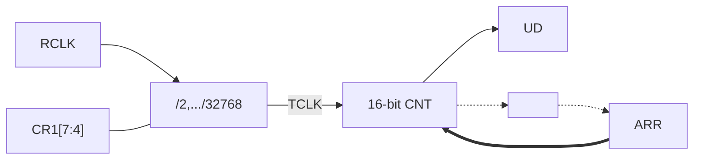

图 10-3 通用低功耗定时器场景工作框图

定时器计数值从 ARR 减计数，当计数到 0 后产生下溢出，如果使能中断会产生下溢出中断，计数周期为 ARR+1。

定时器每溢出一次 TOG 输出电平翻转一次；用户可通过 GPIO 的端口复用功能将 TOG 信号输出到管脚用于驱动外部电路。

# 10.4 操作示例

## 10.4.1 RC48M 时钟自动校准示例

### 操作步骤

步骤 1. 参考《端口控制器（GPIO）》章节管脚数字复用功能的相关描述，配置相应管脚功能为 CTRIM.ETR，并向其提供 2kHz 的方波。

步骤 2. 设置 CTRIM_CR1.MD 为 0，选择 RC48M 时钟校准模式。

步骤 3. 设置 CTRIM_CR0.SRC 为 0，外部 ETR 管脚输入信号作 RCLK。

步骤 4. 设置 CTRIM_CR1.PRS 为 1，对 RCLK 进行 2 分频，GCLK 频率为 1kHz。

步骤 5. 配置 CTRIM_ARR 为 47999，一个 GCLK 的计数周期内目标计数值为 48000。

> >  **说明**
> > ETR 管脚输入信号为 2kHz 方波，GCLK 的周期为 1ms。1ms 内误差计数器对 RC48M 输出频率的理论计数值应为 48000。

步骤 6. 设置 CTRIM_FLIM 为 240，选择 RC48M 校正精度为 0.5%。
48000*0.005=240。

步骤 7. 设置 CTRIM_CR0.STEP 为 0，选择初始校准步长为 16。

步骤 8. 设置 CTRIM_CR1.AUTO 为 1，使能自动校准。

步骤 9. 设置 CTRIM_CR1.EN 为 1，启动时钟校准。

步骤 10. 等待 CTRIM_ISR.END 为 1，自动校准完成。

## 10.4.2 RCL 时钟自动校准示例

### 操作步骤

步骤 1. 参考《端口控制器（GPIO）》章节管脚数字复用功能的相关描述，配置相应管脚功能为 CTRIM.ETR，并向其提供 1MHz 的方波。

步骤 2. 设置 CTRIM_CR1.MD 为 1，选择 RCL 时钟校准模式。

步骤 3. 设置 CTRIM_CR0.SRC 为 0，外部 ETR 管脚输入信号作 TCLK。

步骤 4. 设置 CTRIM_CR1.PRS 为 0x0A，对 RCLK（RCL 输出频率）进行 1024 分频，GCLK 目标频率为 32Hz。

步骤 5. 配置 CTRIM_ARR 为 31249，一个 GCLK 的计数周期内目标计数值为 31250。

> >  **说明**
> > GCLK 的目标周期为 31.25ms，该时间内误差计数器对 TCLK（1MHz）的理论计数值应为 31250。

步骤 6. 设置 CTRIM_FLIM 为 156，选择 RCL 校正精度为 0.5%。
31250*0.005=156。

步骤 7. 设置 CTRIM_CR0.STEP 为 0，选择初始校准步长为 16。

步骤 8. 设置 CTRIM_CR1.AUTO 为 1，使能自动校准。

步骤 9. 设置 CTRIM_CR1.EN 为 1，启动时钟校准。

步骤 10. 等待 CTRIM_ISR.END 为 1，自动校准完成。

# 10.5 寄存器

## 10.5.1 寄存器总表

**基地址**：0x40009000

表 10-1 时钟校准模块（CTRIM）寄存器偏移地址


<table>
  <thead>
    <tr>
        <th>偏移地址</th>
        <th>寄存器</th>
        <th>描述</th>
    </tr>
  </thead>
  <tbody>
    <tr>
        <td>0x00</td>
        <td>CTRIM_ARR</td>
        <td>自动装载寄存器</td>
    </tr>
    <tr>
        <td>0x04</td>
        <td>CTRIM_CNT</td>
        <td>误差计数器寄存器</td>
    </tr>
    <tr>
        <td>0x0C</td>
        <td>CTRIM_CR0</td>
        <td>控制寄存器 0</td>
    </tr>
    <tr>
        <td>0x10</td>
        <td>CTRIM_CR1</td>
        <td>控制寄存器 1</td>
    </tr>
    <tr>
        <td>0x14</td>
        <td>CTRIM_IER</td>
        <td>中断使能控制寄存器</td>
    </tr>
    <tr>
        <td>0x18</td>
        <td>CTRIM_ISR</td>
        <td>中断及状态寄存器</td>
    </tr>
    <tr>
        <td>0x1C</td>
        <td>CTRIM_ICR</td>
        <td>中断标志清除寄存器</td>
    </tr>
    <tr>
        <td>0x20</td>
        <td>CTRIM_FCAP</td>
        <td>误差结果寄存器，GCLK 周期结束时计数器的值</td>
    </tr>
    <tr>
        <td>0x24</td>
        <td>CTRIM_TVAL</td>
        <td>TRIM 结果寄存器</td>
    </tr>
    <tr>
        <td>0x28</td>
        <td>CTRIM_FLIM</td>
        <td>误差允许值</td>
    </tr>
  </tbody>
</table>

## 10.5.2 自动装载寄存器（CTRIM_ARR）


<table>
  <thead>
    <tr>
        <th>Offset</th>
        <th colspan="32">Bit Position</th>
    </tr>
    <tr>
        <th>0x00</th>
        <th>31</th>
        <th>30</th>
        <th>29</th>
        <th>28</th>
        <th>27</th>
        <th>26</th>
        <th>25</th>
        <th>24</th>
        <th>23</th>
        <th>22</th>
        <th>21</th>
        <th>20</th>
        <th>19</th>
        <th>18</th>
        <th>17</th>
        <th>16</th>
        <th>15</th>
        <th>14</th>
        <th>13</th>
        <th>12</th>
        <th>11</th>
        <th>10</th>
        <th>9</th>
        <th>8</th>
        <th>7</th>
        <th>6</th>
        <th>5</th>
        <th>4</th>
        <th>3</th>
        <th>2</th>
        <th>1</th>
        <th>0</th>
    </tr>
    <tr>
        <th>Reset</th>
        <th colspan="32">0x0000FFFF</th>
    </tr>
    <tr>
        <th>Name</th>
        <th colspan="16">Reserved</th>
        <th colspan="16">ARR</th>
    </tr>
    <tr>
        <th>Access</th>
        <th colspan="16"> </th>
        <th colspan="16">RW</th>
    </tr>
  </thead>
</table>
<table>
  <thead>
    <tr>
        <th>位/位域</th>
        <th>标记</th>
        <th>位名</th>
        <th>功能描述</th>
        <th>读写</th>
    </tr>
  </thead>
  <tbody>
    <tr>
        <td>31:16</td>
        <td>Reserved</td>
        <td>保留</td>
        <td>-</td>
        <td>-</td>
    </tr>
    <tr>
        <td>15:0</td>
        <td>ARR</td>
        <td>误差计数器重载值</td>
        <td>-</td>
        <td>RW</td>
    </tr>
  </tbody>
</table>

## 10.5.3 误差计数器寄存器（CTRIM_CNT）


<table>
  <thead>
    <tr>
        <th>Offset</th>
        <th colspan="32">Bit Position</th>
    </tr>
    <tr>
        <th>0x04</th>
        <th>31</th>
        <th>30</th>
        <th>29</th>
        <th>28</th>
        <th>27</th>
        <th>26</th>
        <th>25</th>
        <th>24</th>
        <th>23</th>
        <th>22</th>
        <th>21</th>
        <th>20</th>
        <th>19</th>
        <th>18</th>
        <th>17</th>
        <th>16</th>
        <th>15</th>
        <th>14</th>
        <th>13</th>
        <th>12</th>
        <th>11</th>
        <th>10</th>
        <th>9</th>
        <th>8</th>
        <th>7</th>
        <th>6</th>
        <th>5</th>
        <th>4</th>
        <th>3</th>
        <th>2</th>
        <th>1</th>
        <th>0</th>
    </tr>
    <tr>
        <th>Reset</th>
        <th colspan="32">0x00000000</th>
    </tr>
    <tr>
        <th>Name</th>
        <th colspan="16">Reserved</th>
        <th colspan="16">CNT</th>
    </tr>
    <tr>
        <th>Access</th>
        <th colspan="16"> </th>
        <th colspan="16">RO</th>
    </tr>
  </thead>
</table>
<table>
  <thead>
    <tr>
        <th>位/位域</th>
        <th>标记</th>
        <th>位名</th>
        <th>功能描述</th>
        <th>读写</th>
    </tr>
  </thead>
  <tbody>
    <tr>
        <td>31:16</td>
        <td>Reserved</td>
        <td>保留</td>
        <td>-</td>
        <td>-</td>
    </tr>
    <tr>
        <td>15:0</td>
        <td>CNT</td>
        <td>误差计数器计数值</td>
        <td>-</td>
        <td>RO</td>
    </tr>
  </tbody>
</table>

### 10.5.4 控制寄存器 0（CTRIM_CR0）


**说明**
该寄存器只有在 CTRIM_CR1.EN 为 0 时才可以更改。


<table>
  <thead>
    <tr>
        <th>Offset</th>
        <th colspan="32">Bit Position</th>
    </tr>
    <tr>
        <th>0x0C</th>
        <th>31</th>
        <th>30</th>
        <th>29</th>
        <th>28</th>
        <th>27</th>
        <th>26</th>
        <th>25</th>
        <th>24</th>
        <th>23</th>
        <th>22</th>
        <th>21</th>
        <th>20</th>
        <th>19</th>
        <th>18</th>
        <th>17</th>
        <th>16</th>
        <th>15</th>
        <th>14</th>
        <th>13</th>
        <th>12</th>
        <th>11</th>
        <th>10</th>
        <th>9</th>
        <th>8</th>
        <th>7</th>
        <th>6</th>
        <th>5</th>
        <th>4</th>
        <th>3</th>
        <th>2</th>
        <th>1</th>
        <th>0</th>
    </tr>
    <tr>
        <th>Reset</th>
        <th colspan="32">0x00000000</th>
    </tr>
    <tr>
        <th>Name</th>
        <th colspan="21">Reserved</th>
        <th colspan="3">SRC</th>
        <th>Reserved</th>
        <th colspan="3">ETRFLT</th>
        <th>Reserved</th>
        <th colspan="3">STEP</th>
    </tr>
    <tr>
        <th>Access</th>
        <th colspan="21"> </th>
        <th colspan="3">RW</th>
        <th> </th>
        <th colspan="3">RW</th>
        <th> </th>
        <th colspan="3">RW</th>
    </tr>
  </thead>
</table>
<table>
  <thead>
    <tr>
        <th>位/位域</th>
        <th>标记</th>
        <th>位名</th>
        <th>功能描述</th>
        <th>读写</th>
    </tr>
  </thead>
  <tbody>
    <tr>
        <td>31:11</td>
        <td>Reserved</td>
        <td>保留</td>
        <td>-</td>
        <td>-</td>
    </tr>
    <tr>
        <td>10:8</td>
        <td>SRC</td>
        <td>时钟来源选择</td>
        <td>● 0b000：ETR<br/>● 0b001：禁止设置<br/>● 0b010：XTL<br/>● 0b011：PCLK<br/>● 0b100：RCL<br/>● 0b101：RC48M<br/>● 0b110：禁止设置<br/>● 0b111：禁止设置</td>
        <td>RW</td>
    </tr>
    <tr>
        <td>7</td>
        <td>Reserved</td>
        <td>保留</td>
        <td>-</td>
        <td>-</td>
    </tr>
    <tr>
        <td>6:4</td>
        <td>ETRFLT</td>
        <td>外部输入管脚（ETR）滤波配置</td>
        <td>● 0b000：无滤波<br/>● 0b001：F<sub>sample</sub>=PCLK，N=2<br/>● 0b010：F<sub>sample</sub>=PCLK，N=4<br/>● 0b011：F<sub>sample</sub>=PCLK，N=6<br/>● 0b100：F<sub>sample</sub>=PCLK/4，N=4<br/>● 0b101：F<sub>sample</sub>=PCLK/4，N=6<br/>● 0b110：F<sub>sample</sub>=PCLK/8，N=4<br/>● 0b111：F<sub>sample</sub>=PCLK/8，N=6</td>
        <td>RW</td>
    </tr>
    <tr>
        <td>3</td>
        <td>Reserved</td>
        <td>保留</td>
        <td>-</td>
        <td>-</td>
    </tr>
    <tr>
        <td>2:0</td>
        <td>STEP</td>
        <td>TRIM 初始步进量配置</td>
        <td>● 0b000：0x10<br/>● 0b001：0x02<br/>● 0b010：0x08<br/>● 0b011：0x20<br/>● 0b100：0x80<br/>● 0b101：0x100<br/>● 0b110：0x200<br/>● 0b111：0x400</td>
        <td>RW</td>
    </tr>
  </tbody>
</table>

## 10.5.5 控制寄存器 1（CTRIM_CR1）

>  **说明**
> 该寄存器只有在 CTRIM_CR1.EN 为 0 时才可以更改。


<table>
  <thead>
    <tr>
        <th>Offset</th>
        <th colspan="32">Bit Position</th>
    </tr>
    <tr>
        <th>0x10</th>
        <th>31</th>
        <th>30</th>
        <th>29</th>
        <th>28</th>
        <th>27</th>
        <th>26</th>
        <th>25</th>
        <th>24</th>
        <th>23</th>
        <th>22</th>
        <th>21</th>
        <th>20</th>
        <th>19</th>
        <th>18</th>
        <th>17</th>
        <th>16</th>
        <th>15</th>
        <th>14</th>
        <th>13</th>
        <th>12</th>
        <th>11</th>
        <th>10</th>
        <th>9</th>
        <th>8</th>
        <th>7</th>
        <th>6</th>
        <th>5</th>
        <th>4</th>
        <th>3</th>
        <th>2</th>
        <th>1</th>
        <th>0</th>
    </tr>
    <tr>
        <th>Reset</th>
        <th colspan="32">0x00000000</th>
    </tr>
    <tr>
        <th>Name</th>
        <th colspan="23">Reserved</th>
        <th>OST</th>
        <th colspan="4">PRS</th>
        <th>AUTO</th>
        <th colspan="2">MD</th>
        <th>EN</th>
    </tr>
    <tr>
        <th>Access</th>
        <th colspan="23"> </th>
        <th>RW</th>
        <th colspan="4">RW</th>
        <th>RW</th>
        <th colspan="2">RW</th>
        <th>RW</th>
    </tr>
  </thead>
</table>
<table>
  <thead>
    <tr>
        <th>位/位域</th>
        <th>标记</th>
        <th>位名</th>
        <th>功能描述</th>
        <th>读写</th>
    </tr>
  </thead>
  <tbody>
    <tr>
        <td>31:9</td>
        <td>Reserved</td>
        <td>保留</td>
        <td>-</td>
        <td>-</td>
    </tr>
    <tr>
        <td>8</td>
        <td>OST</td>
        <td>校准模式配置</td>
        <td>● 0b0：实时校准模式，TRIM 过程持续进行<br/>● 0b1：单次校准模式，STEP 变为 1 时结束</td>
        <td>RW</td>
    </tr>
    <tr>
        <td>7:4</td>
        <td>PRS</td>
        <td>参考时钟预分频配置</td>
        <td>● 0b0000：禁止设置<br/>● 0b0001：2 分频<br/>● 0b0010：4 分频<br/>● 0b0011：8 分频<br/>● 0b0100：16 分频<br/>● 0b0101：32 分频<br/>● 0b0110：64 分频<br/>● 0b0111：128 分频<br/>● 0b1000：256 分频<br/>● 0b1001：512 分频<br/>● 0b1010：1024 分频<br/>● 0b1011：2048 分频<br/>● 0b1100：4096 分频<br/>● 0b1101：8192 分频<br/>● 0b1110：16384 分频<br/>● 0b1111：32768 分频</td>
        <td>RW</td>
    </tr>
    <tr>
        <td>3</td>
        <td>AUTO</td>
        <td>RC48M/RCL 自动 TRIM 使能配置</td>
        <td>● 0b0：禁止<br/>● 0b1：使能<br/>&gt; **说明**<br/>&gt; 实时校准模式下，该位禁止配置为 0。</td>
        <td>RW</td>
    </tr>
    <tr>
        <td>2:1</td>
        <td>MD</td>
        <td>工作模式配置</td>
        <td>● 0b00：RC48M 校准模式，CR0.SRC 需选择低速精准时钟<br/>● 0b01：RCL 校准模式，CR0.SRC 需选择高速精准时钟<br/>● 0b10：禁止设置<br/>● 0b11：定时器模式</td>
        <td>RW</td>
    </tr>
    <tr>
        <td>0</td>
        <td>EN</td>
        <td>定时器使能控制</td>
        <td>● 0b0：禁止<br/>● 0b1：使能</td>
        <td>RW</td>
    </tr>
  </tbody>
</table>

### 10.5.6 中断使能寄存器（CTRIM_IER）


<table>
  <thead>
    <tr>
        <th>Offset</th>
        <th colspan="32">Bit Position</th>
    </tr>
    <tr>
        <th>0x14</th>
        <th>31</th>
        <th>30</th>
        <th>29</th>
        <th>28</th>
        <th>27</th>
        <th>26</th>
        <th>25</th>
        <th>24</th>
        <th>23</th>
        <th>22</th>
        <th>21</th>
        <th>20</th>
        <th>19</th>
        <th>18</th>
        <th>17</th>
        <th>16</th>
        <th>15</th>
        <th>14</th>
        <th>13</th>
        <th>12</th>
        <th>11</th>
        <th>10</th>
        <th>9</th>
        <th>8</th>
        <th>7</th>
        <th>6</th>
        <th>5</th>
        <th>4</th>
        <th>3</th>
        <th>2</th>
        <th>1</th>
        <th>0</th>
    </tr>
    <tr>
        <th>Reset</th>
        <th colspan="32">0x00000000</th>
    </tr>
    <tr>
        <th>Name</th>
        <th colspan="26">Reserved</th>
        <th>OK</th>
        <th>OV</th>
        <th>MISS</th>
        <th>PS</th>
        <th>END</th>
        <th>UD</th>
    </tr>
    <tr>
        <th>Access</th>
        <th colspan="26"> </th>
        <th>RW</th>
        <th>RW</th>
        <th>RW</th>
        <th>RW</th>
        <th>RW</th>
        <th>RW</th>
    </tr>
  </thead>
</table>
<table>
  <thead>
    <tr>
        <th>位/位域</th>
        <th>标记</th>
        <th>位名</th>
        <th>功能描述</th>
        <th>读写</th>
    </tr>
  </thead>
  <tbody>
    <tr>
        <td>31:6</td>
        <td>Reserved</td>
        <td>保留</td>
        <td>-</td>
        <td>-</td>
    </tr>
    <tr>
        <td>5</td>
        <td>OK</td>
        <td>自动 Trim 结果在范围内中断使能</td>
        <td>● 0b0：禁止<br/>● 0b1：使能</td>
        <td>RW</td>
    </tr>
    <tr>
        <td>4</td>
        <td>OV</td>
        <td>TrimCode 溢出中断使能</td>
        <td>● 0b0：禁止<br/>● 0b1：使能</td>
        <td>RW</td>
    </tr>
    <tr>
        <td>3</td>
        <td>MISS</td>
        <td>计数失败中断使能</td>
        <td>● 0b0：禁止<br/>● 0b1：使能</td>
        <td>RW</td>
    </tr>
    <tr>
        <td>2</td>
        <td>PS</td>
        <td>误差计数器完成中断使能</td>
        <td>● 0b0：禁止<br/>● 0b1：使能</td>
        <td>RW</td>
    </tr>
    <tr>
        <td>1</td>
        <td>END</td>
        <td>自动 Trim 结束中断使能</td>
        <td>● 0b0：禁止<br/>● 0b1：使能</td>
        <td>RW</td>
    </tr>
    <tr>
        <td>0</td>
        <td>UD</td>
        <td>误差计数器下溢中断使能</td>
        <td>● 0b0：禁止<br/>● 0b1：使能</td>
        <td>RW</td>
    </tr>
  </tbody>
</table>

### 10.5.7 中断和状态寄存器（CTRIM_ISR）


<table>
  <thead>
    <tr>
        <th>Offset</th>
        <th colspan="32">Bit Position</th>
    </tr>
    <tr>
        <th>0x18</th>
        <th>31</th>
        <th>30</th>
        <th>29</th>
        <th>28</th>
        <th>27</th>
        <th>26</th>
        <th>25</th>
        <th>24</th>
        <th>23</th>
        <th>22</th>
        <th>21</th>
        <th>20</th>
        <th>19</th>
        <th>18</th>
        <th>17</th>
        <th>16</th>
        <th>15</th>
        <th>14</th>
        <th>13</th>
        <th>12</th>
        <th>11</th>
        <th>10</th>
        <th>9</th>
        <th>8</th>
        <th>7</th>
        <th>6</th>
        <th>5</th>
        <th>4</th>
        <th>3</th>
        <th>2</th>
        <th>1</th>
        <th>0</th>
    </tr>
    <tr>
        <th>Reset</th>
        <th colspan="32">0x00000000</th>
    </tr>
    <tr>
        <th>Name</th>
        <th colspan="25">Reserved</th>
        <th>DIR</th>
        <th>OK</th>
        <th>OV</th>
        <th>MISS</th>
        <th>PS</th>
        <th>END</th>
        <th>UD</th>
    </tr>
    <tr>
        <th>Access</th>
        <th colspan="25">RO</th>
        <th>RO</th>
        <th>RO</th>
        <th>RO</th>
        <th>RO</th>
        <th>RO</th>
        <th>RO</th>
        <th>RO</th>
    </tr>
  </thead>
</table>
<table>
  <thead>
    <tr>
        <th>位/位域</th>
        <th>标记</th>
        <th>位名</th>
        <th>功能描述</th>
        <th>读写</th>
    </tr>
  </thead>
  <tbody>
    <tr>
        <td>31:7</td>
        <td>Reserved</td>
        <td>保留</td>
        <td>-</td>
        <td>-</td>
    </tr>
    <tr>
        <td>6</td>
        <td>DIR</td>
        <td>误差计数器计数方向</td>
        <td>● 0b0：递增计数，RC48M 输出频率高于目标频率，RCL 输出频率低于目标频率<br/>● 0b1：递减计数，RC48M 输出频率低于目标频率，RCL 输出频率高于目标频率</td>
        <td>RO</td>
    </tr>
    <tr>
        <td>5</td>
        <td>OK</td>
        <td>Trim 精度标志</td>
        <td>● 0b0：Trim 完成时精度不满足 FLIM 要求<br/>● 0b1：Trim 完成时精度满足 FLIM 要求</td>
        <td>RO</td>
    </tr>
    <tr>
        <td>4</td>
        <td>OV</td>
        <td>TrimCode 溢出标志</td>
        <td>● 0b0：RC48M/RCL 的 TrimCode 不为 0x000 或 0x1FF<br/>● 0b1：RC48M/RCL 的 TrimCode 已调整为 0x000 或 0x1FF</td>
        <td>RO</td>
    </tr>
    <tr>
        <td>3</td>
        <td>MISS</td>
        <td>计数失败标志</td>
        <td>● 0b0：在 GCLK 的一个周期内，误差计数器未计数到 ARR<br/>● 0b1：在 GCLK 的一个周期内，误差计数器已计数到 ARR</td>
        <td>RO</td>
    </tr>
    <tr>
        <td>2</td>
        <td>PS</td>
        <td>误差计数器完成标志</td>
        <td>● 0b0：误差计数器正在计数中<br/>● 0b1：误差计数器已完成一次计数并停止</td>
        <td>RO</td>
    </tr>
    <tr>
        <td>1</td>
        <td>END</td>
        <td>自动 Trim 结束标志</td>
        <td>● 0b0：自动 Trim 进行中<br/>● 0b1：自动 Trim 已完成</td>
        <td>RO</td>
    </tr>
    <tr>
        <td>0</td>
        <td>UD</td>
        <td>误差计数器下溢标志</td>
        <td>● 0b0：误差计数器未计数到 0<br/>● 0b1：误差计数器已计数到 0</td>
        <td>RO</td>
    </tr>
  </tbody>
</table>

### 10.5.8 中断状态清除寄存器（CTRIM_ICR）


<table>
  <thead>
    <tr>
        <th>Offset</th>
        <th colspan="32">Bit Position</th>
    </tr>
    <tr>
        <th>0x1C</th>
        <th>31</th>
        <th>30</th>
        <th>29</th>
        <th>28</th>
        <th>27</th>
        <th>26</th>
        <th>25</th>
        <th>24</th>
        <th>23</th>
        <th>22</th>
        <th>21</th>
        <th>20</th>
        <th>19</th>
        <th>18</th>
        <th>17</th>
        <th>16</th>
        <th>15</th>
        <th>14</th>
        <th>13</th>
        <th>12</th>
        <th>11</th>
        <th>10</th>
        <th>9</th>
        <th>8</th>
        <th>7</th>
        <th>6</th>
        <th>5</th>
        <th>4</th>
        <th>3</th>
        <th>2</th>
        <th>1</th>
        <th>0</th>
    </tr>
    <tr>
        <th>Reset</th>
        <th colspan="32">0x0000003F</th>
    </tr>
    <tr>
        <th>Name</th>
        <th colspan="26">Reserved</th>
        <th>OK</th>
        <th>OV</th>
        <th>MISS</th>
        <th>PS</th>
        <th>END</th>
        <th>UD</th>
    </tr>
    <tr>
        <th>Access</th>
        <th colspan="26"> </th>
        <th>WO</th>
        <th>WO</th>
        <th>WO</th>
        <th>WO</th>
        <th>WO</th>
        <th>WO</th>
    </tr>
  </thead>
</table>
<table>
  <thead>
    <tr>
        <th>位/位域</th>
        <th>标记</th>
        <th>位名</th>
        <th>功能描述</th>
        <th>读写</th>
    </tr>
  </thead>
  <tbody>
    <tr>
        <td>31:6</td>
        <td>Reserved</td>
        <td>保留</td>
        <td>-</td>
        <td>-</td>
    </tr>
    <tr>
        <td>5</td>
        <td>OK</td>
        <td>清除校准成功<br/>OK 标志</td>
        <td>写 0 清除标志，写 1 无效；读出恒为 1</td>
        <td>WO</td>
    </tr>
    <tr>
        <td>4</td>
        <td>OV</td>
        <td>清除 TrimCode<br/>溢出标志</td>
        <td>写 0 清除标志，写 1 无效；读出恒为 1</td>
        <td>WO</td>
    </tr>
    <tr>
        <td>3</td>
        <td>MISS</td>
        <td>清除计数失败标志</td>
        <td>写 0 清除标志，写 1 无效；读出恒为 1</td>
        <td>WO</td>
    </tr>
    <tr>
        <td>2</td>
        <td>PS</td>
        <td>清除误差计数器<br/>完成标志</td>
        <td>写 0 清除标志，写 1 无效；读出恒为 1</td>
        <td>WO</td>
    </tr>
    <tr>
        <td>1</td>
        <td>END</td>
        <td>清除自动 Trim 结束标志</td>
        <td>写 0 清除标志，写 1 无效；读出恒为 1</td>
        <td>WO</td>
    </tr>
    <tr>
        <td>0</td>
        <td>UD</td>
        <td>清除误差计数器<br/>下溢标志</td>
        <td>写 0 清除标志，写 1 无效；读出恒为 1</td>
        <td>WO</td>
    </tr>
  </tbody>
</table>

### 10.5.9 误差结果寄存器（CTRIM_FCAP）


<table>
  <thead>
    <tr>
        <th>Offset</th>
        <th colspan="32">Bit Position</th>
    </tr>
    <tr>
        <th>0x20</th>
        <th>31</th>
        <th>30</th>
        <th>29</th>
        <th>28</th>
        <th>27</th>
        <th>26</th>
        <th>25</th>
        <th>24</th>
        <th>23</th>
        <th>22</th>
        <th>21</th>
        <th>20</th>
        <th>19</th>
        <th>18</th>
        <th>17</th>
        <th>16</th>
        <th>15</th>
        <th>14</th>
        <th>13</th>
        <th>12</th>
        <th>11</th>
        <th>10</th>
        <th>9</th>
        <th>8</th>
        <th>7</th>
        <th>6</th>
        <th>5</th>
        <th>4</th>
        <th>3</th>
        <th>2</th>
        <th>1</th>
        <th>0</th>
    </tr>
    <tr>
        <th>Reset</th>
        <th colspan="32">0x0000FFFF</th>
    </tr>
    <tr>
        <th>Name</th>
        <th colspan="16">Reserved</th>
        <th colspan="16">FCAP</th>
    </tr>
    <tr>
        <th>Access</th>
        <th colspan="16"> </th>
        <th colspan="16">RO</th>
    </tr>
  </thead>
</table>
<table>
  <thead>
    <tr>
        <th>位/位域</th>
        <th>标记</th>
        <th>位名</th>
        <th>功能描述</th>
        <th>读写</th>
    </tr>
  </thead>
  <tbody>
    <tr>
        <td>31:16</td>
        <td>Reserved</td>
        <td>保留</td>
        <td>-</td>
        <td>-</td>
    </tr>
    <tr>
        <td>15:0</td>
        <td>FCAP</td>
        <td>频率误差捕获值</td>
        <td>频率误差捕获值</td>
        <td>RO</td>
    </tr>
  </tbody>
</table>

### 10.5.10 TRIM 结果寄存器（CTRIM_TVAL）


<table>
  <thead>
    <tr>
        <th>Offset</th>
        <th colspan="32">Bit Position</th>
    </tr>
    <tr>
        <th>0x24</th>
        <th>31</th>
        <th>30</th>
        <th>29</th>
        <th>28</th>
        <th>27</th>
        <th>26</th>
        <th>25</th>
        <th>24</th>
        <th>23</th>
        <th>22</th>
        <th>21</th>
        <th>20</th>
        <th>19</th>
        <th>18</th>
        <th>17</th>
        <th>16</th>
        <th>15</th>
        <th>14</th>
        <th>13</th>
        <th>12</th>
        <th>11</th>
        <th>10</th>
        <th>9</th>
        <th>8</th>
        <th>7</th>
        <th>6</th>
        <th>5</th>
        <th>4</th>
        <th>3</th>
        <th>2</th>
        <th>1</th>
        <th>0</th>
    </tr>
    <tr>
        <th>Reset</th>
        <th colspan="32">0x00000100</th>
    </tr>
    <tr>
        <th>Name</th>
        <th colspan="16">Reserved</th>
        <th colspan="16">TVAL</th>
    </tr>
    <tr>
        <th>Access</th>
        <th colspan="16"> </th>
        <th colspan="16">RO</th>
    </tr>
  </thead>
</table>
<table>
  <thead>
    <tr>
        <th>位/位域</th>
        <th>标记</th>
        <th>位名</th>
        <th>功能描述</th>
        <th>读写</th>
    </tr>
  </thead>
  <tbody>
    <tr>
        <td>31:16</td>
        <td>Reserved</td>
        <td>保留</td>
        <td>-</td>
        <td>-</td>
    </tr>
    <tr>
        <td>15:0</td>
        <td>TVAL</td>
        <td>自动 TRIM 结果</td>
        <td>自动 TRIM 结果<br/> **说明**<br/>1. 自动 TRIM 结束需要将 TVAL 的值写入相应的 TRIM 寄存器中。<br/>2. 如在 TRIM 过程中软件读，需要读两次相同有效。</td>
        <td>RO</td>
    </tr>
  </tbody>
</table>

### 10.5.11 误差上限寄存器（CTRIM_FLIM）


<table>
  <thead>
    <tr>
        <th>Offset</th>
        <th colspan="32">Bit Position</th>
    </tr>
    <tr>
        <th>0x28</th>
        <th>31</th>
        <th>30</th>
        <th>29</th>
        <th>28</th>
        <th>27</th>
        <th>26</th>
        <th>25</th>
        <th>24</th>
        <th>23</th>
        <th>22</th>
        <th>21</th>
        <th>20</th>
        <th>19</th>
        <th>18</th>
        <th>17</th>
        <th>16</th>
        <th>15</th>
        <th>14</th>
        <th>13</th>
        <th>12</th>
        <th>11</th>
        <th>10</th>
        <th>9</th>
        <th>8</th>
        <th>7</th>
        <th>6</th>
        <th>5</th>
        <th>4</th>
        <th>3</th>
        <th>2</th>
        <th>1</th>
        <th>0</th>
    </tr>
    <tr>
        <th>Reset</th>
        <th colspan="32">0x00000010</th>
    </tr>
    <tr>
        <th>Name</th>
        <th colspan="20">Reserved</th>
        <th colspan="12">FLIM</th>
    </tr>
    <tr>
        <th>Access</th>
        <th colspan="20"> </th>
        <th colspan="12">RW</th>
    </tr>
  </thead>
</table>
<table>
  <thead>
    <tr>
        <th>位/位域</th>
        <th>标记</th>
        <th>位名</th>
        <th>功能描述</th>
        <th>读写</th>
    </tr>
  </thead>
  <tbody>
    <tr>
        <td>31:12</td>
        <td>Reserved</td>
        <td>保留</td>
        <td>-</td>
        <td>-</td>
    </tr>
    <tr>
        <td>11:0</td>
        <td>FLIM</td>
        <td>误差允许值</td>
        <td>-</td>
        <td>RW</td>
    </tr>
  </tbody>
</table>

# 11 复合定时器（CTIM）

## 11.1 简介

CTIM 是一个复合定时器，可以配置为一个带有 4 组比较捕获功能的通用定时器 GTIM，也可以配置为一组（三个）只有定时功能的基本定时器 BTIM。通过 SYSCTRL1.CTIMERx_FUN_SEL 控制，该位为 1 时 BTIM 有效，该位为 0 时 GTIM 有效。本产品每个 CTIM 可以独立灵活配置为 GTIM 或 BTIM。

* BTIM 是一组具有基本定时功能的定时计数器，每组包含 3 个 16 位的具有重载功能的定时器。本产品最多可配置 6 个基本定时器：BTIM0~5。

* GTIM 是一个可具有 4 路比较捕获功能的 16 位定时器。本产品最多可配置 2 个通用定时器：GTIM0~1。

表 11-1 管脚功能与定时器功能对照表


<table>
  <thead>
    <tr>
        <th>CTIM(x=0,1)</th>
        <th>GTIM(x=0,1)</th>
        <th>BTIM(y=0,3)</th>
    </tr>
  </thead>
  <tbody>
    <tr>
        <td>CTIMx_ETR</td>
        <td>GTIMx_ETR</td>
        <td>BTIMy_ETR</td>
    </tr>
    <tr>
        <td>CTIMx_TOG</td>
        <td>GTIMx_TOG</td>
        <td>BTIMy+0_TOG</td>
    </tr>
    <tr>
        <td>CTIMx_TOGN</td>
        <td>GTIMx_TOGN</td>
        <td>BTIMy+0_TOGN</td>
    </tr>
    <tr>
        <td>CTIMx_CH0</td>
        <td>GTIMx_CH0</td>
        <td>BTIMy+1_TOG</td>
    </tr>
    <tr>
        <td>CTIMx_CH1</td>
        <td>GTIMx_CH1</td>
        <td>BTIMy+1_TOGN</td>
    </tr>
    <tr>
        <td>CTIMx_CH2</td>
        <td>GTIMx_CH2</td>
        <td>BTIMy+2_TOG</td>
    </tr>
    <tr>
        <td>CTIMx_CH3</td>
        <td>GTIMx_CH3</td>
        <td>BTIMy+2_TOGN</td>
    </tr>
  </tbody>
</table>

 **说明**

* BTIM0/1/2 共用 CTIM0_ETR；BTIM3/4/5 共用 CTIM1_ETR。
* 当 x=0 时，y=0；当 x=1 时，y=3。

## 11.2 主要特性

### 11.2.1 BTIM 主要特性

* 3 个 16-bit 定时器
* 每个定时器 2 个翻转输出
* 单脉冲模式
* 外部输入计数功能
* 门控功能
* 外部触发功能
* 级联功能

### 11.2.2 GTIM 主要特性

* 16-bit 定时器
* 2 个翻转输出
* 单脉冲模式
* 外部输入计数功能
* 门控功能
* 外部触发功能
* 4 路独立 PWM 输出，调整范围 0% ~ 100%
* 4 路独立捕获
* 级联功能

# 11.3 功能说明

## 11.3.1 BTIM 功能描述

### 11.3.1.1 功能框图


图 11-1 BTIM 框图

###  说明

* ● 一组 3 个 BTIM，共用一个 ETR。
* ● ITR 信号来源详见“定时器级联”章节。

### 11.3.1.2 滤波单元

外部管脚输入的 ETR 信号经滤波、极性选择、边沿检测后，输出门控信号及边沿信号供计数单元及触发单元使用。由于 ETR 信号采用 PCLK 进行同步滤波，故输入的 ETR 信号的频率应低于 PCLK 的频率的二分之一。


图 11-2 BTIM 滤波单元示意图

### 11.3.1.3 计数单元

在每个 TCLKD 信号的上升沿，内部计数器 CNT 自动加 1。计数到 ARR 后产生溢出信号 OV（宽度为一个 PCLK），并复位内部计数值为 0 并再次开始加计数。计数器的计数范围为 0 至 ARR，计数单元的计数周期为 ARR+1。

定时器支持 2 种计数模式，One-Shot 模式与连续计数模式。

* ● 当设置 BTIMx_CR.OST 为 1 时，定时器工作于 One-Shot 模式；发生溢出后定时器立即停止计数，硬件自动清除 CEN。
* ● 当设置 BTIMx_CR.OST 为 0 时，定时器工作于连续计数模式；只要 BTIMx_CR.CEN 为 1，定时器会一直进行计数。

每次溢出时，BTIMx_IFR.UI 会被硬件置 1，若使能相应中断则可以产生溢出中断，用户应在中断服务程序中清除该溢出标志。

若 BTIMx_CR.TOGEN 为 1，则每溢出一次 TOG/TOGN 输出电平翻转一次；用户可通过 GPIO 的复用功能将 TOG/TOGN 信号输出到管脚用于驱动外部电路。


<table>
  <thead>
    <tr>
        <th>Signal</th>
        <th>T0</th>
        <th>T1</th>
        <th>T2</th>
        <th>T3</th>
        <th>T4</th>
        <th>T5</th>
    </tr>
  </thead>
  <tbody>
    <tr>
        <td>CNT</td>
        <td>INI</td>
        <td>INI -&gt; ARR</td>
        <td>0x0000 -&gt; ARR</td>
        <td>0x0000 -&gt; ARR</td>
        <td>0x0000 -&gt; ARR</td>
        <td>0x0000 -&gt; INI</td>
    </tr>
    <tr>
        <td>CR.CEN</td>
        <td>Low</td>
        <td>High</td>
        <td>High</td>
        <td>High</td>
        <td>High</td>
        <td>Low</td>
    </tr>
    <tr>
        <td>OV</td>
        <td>Low</td>
        <td>Pulse</td>
        <td>Pulse</td>
        <td>Pulse</td>
        <td>Pulse</td>
        <td>Low</td>
    </tr>
    <tr>
        <td>TOGEN</td>
        <td>Low</td>
        <td>Low -&gt; High</td>
        <td>High</td>
        <td>High</td>
        <td>High</td>
        <td>High</td>
    </tr>
    <tr>
        <td>TOG</td>
        <td>High</td>
        <td>High -&gt; Low</td>
        <td>Low -&gt; High</td>
        <td>High -&gt; Low</td>
        <td>Low -&gt; High</td>
        <td>High</td>
    </tr>
    <tr>
        <td>TOGN</td>
        <td>Low</td>
        <td>Low -&gt; High</td>
        <td>High -&gt; Low</td>
        <td>Low -&gt; High</td>
        <td>High -&gt; Low</td>
        <td>Low</td>
    </tr>
    <tr>
        <td>IFR.UI</td>
        <td>Low</td>
        <td>High</td>
        <td>High</td>
        <td>High</td>
        <td>High</td>
        <td>High</td>
    </tr>
    <tr>
        <td>Annotation</td>
        <td> </td>
        <td>Write ICR.UI=0</td>
        <td> </td>
        <td>Write ICR.UI=0</td>
        <td> </td>
        <td>Write ICR.UI=0</td>
    </tr>
  </tbody>
</table>
图 11-3 BTIM 计数器波形

### 11.3.1.4 定时器模式

当设置 BTIMx_CR.MD 为 0x00 时，BTIMx 工作于定时器模式。在该模式下，计数时钟为 PCLK 分频后的时钟 TCLKD，当设置 BTIMx_CR.CEN 为 1 后，定时器即从初值开始加计数，计数到 ARR 后产生溢出并重新从 0 开始计数。


图 11-4 BTIM 定时模式框图

### 11.3.1.5 计数器模式

当设置 BTIMx_CR.MD 为 0x01 时，BTIMx 工作于计数器模式。在该模式下，计数时钟为分频后的 ITR 或 ETR 管脚输入的信号。当设置 BTIMx_CR.CEN 为 1 后，计数器即从初值开始加计数，计数到 ARR 后产生溢出并重新从 0 开始计数。

通过 BTIMx_CR.TRS 可以选择计数时钟源为 ITR 或 ETR；通过 BTIMx_CR.ETP 可以选择对 ETR 管脚输入信号的上升沿或下降沿进行计数。


图 11-5 BTIM 计数器模式框图

### 11.3.1.6 触发启动模式

当设置 BTIMx_CR.MD 为 0x02 时，BTIMx 工作于触发启动模式，计数时钟为 PCLK 分频后的时钟 TCLKD。该模式下定时器具有两种启动方法：设置 BTIMx_CR.CEN 为 1 或 TRS 信号上出现符合预期的电平变化。

启动后，计数器即从初值开始加计数，计数到 ARR 后产生溢出并重新从 0 开始计数；在任意时刻设置 BTIMx_CR.CEN 为 0，则可以停止定时器。

通过 BTIMx_CR.TRS 选择 TRS 信号来源为 ETR 或 ITR。

通过 BTIMx_CR.ETP 可以选择 ETR 管脚输入信号的上升沿或下降沿启动定时器。

每次检测到符合预期的触发信号时，BTIMx_IFR.TI 会被硬件置 1，若使能相应中断则可以产生触发中断，用户应在中断服务程序中清除该触发标志。


图 11-6 BTIM 触发启动器模式框图

<table>
  <tbody>
    <tr>
        <td>Time</td>
        <td>CNT</td>
        <td>ETR</td>
        <td>CR.CEN</td>
        <td>Note</td>
    </tr>
    <tr>
        <td>T0</td>
        <td>INI</td>
        <td>Low</td>
        <td>Low</td>
        <td> </td>
    </tr>
    <tr>
        <td>T1</td>
        <td>INI</td>
        <td>High</td>
        <td>Low</td>
        <td>ETR pulse starts</td>
    </tr>
    <tr>
        <td>T2</td>
        <td>INI</td>
        <td>Low</td>
        <td>High</td>
        <td>CR.CEN set by ETR edge</td>
    </tr>
    <tr>
        <td>T3</td>
        <td>Rising to ARR</td>
        <td>Low</td>
        <td>High</td>
        <td>Counting</td>
    </tr>
    <tr>
        <td>T4</td>
        <td>0x0000</td>
        <td>Low</td>
        <td>High</td>
        <td>Overflow</td>
    </tr>
    <tr>
        <td>T5</td>
        <td>Rising to INI</td>
        <td>Low</td>
        <td>High</td>
        <td>Counting</td>
    </tr>
    <tr>
        <td>T6</td>
        <td>INI</td>
        <td>Low</td>
        <td>Low</td>
        <td>Write CR.CEN=0</td>
    </tr>
  </tbody>
</table>
图 11-7 BTIM 触发启动模式计数示意图

### 11.3.1.7 门控模式

当设置 BTIMx_CR.MD 为 0x03 时，BTIMx 工作于门控模式，计数时钟为 PCLK 分频后的时钟 TCLKD。该模式下定时器需要满足两个条件才会进行计数：BTIMx_CR.CEN 为 1、ETR 管脚上的电平符合预期。定时器运行时，计数器从初值开始加计数，计数到 ARR 后产生溢出并重新从 0 开始计数。

通过 BTIMx_CR.ETP 可以选择 ETR 管脚输入信号的高电平或低电平为计数电平。


图 11-8 BTIM 门控模式框图


<table>
  <tbody>
    <tr>
        <td>Time</td>
        <td>CNT</td>
        <td>CR.CEN</td>
        <td>ETR</td>
        <td>Note</td>
    </tr>
    <tr>
        <td>T0</td>
        <td>INI</td>
        <td>Low</td>
        <td>High</td>
        <td> </td>
    </tr>
    <tr>
        <td>T1</td>
        <td>INI</td>
        <td>High</td>
        <td>High</td>
        <td>CR.CEN enabled</td>
    </tr>
    <tr>
        <td>T2</td>
        <td>Rising</td>
        <td>High</td>
        <td>High</td>
        <td>Counting (ETR is high)</td>
    </tr>
    <tr>
        <td>T3</td>
        <td>Hold</td>
        <td>High</td>
        <td>Low</td>
        <td>Paused (ETR is low)</td>
    </tr>
    <tr>
        <td>T4</td>
        <td>Rising</td>
        <td>High</td>
        <td>High</td>
        <td>Resume counting</td>
    </tr>
    <tr>
        <td>T5</td>
        <td>0x0000</td>
        <td>High</td>
        <td>High</td>
        <td>Overflow</td>
    </tr>
    <tr>
        <td>T6</td>
        <td>Rising</td>
        <td>High</td>
        <td>High</td>
        <td>Counting</td>
    </tr>
  </tbody>
</table>
图 11-9 BTIM 门控模式计数示意图

### 11.3.1.8 定时器级联

通过适当的配置 BTIM 可以级联使用，如将两个 16 位的定时器组合成一个 32 位的定时器。级联使用时，第一级定时器的计数时钟可以是 PCLK 或来自 ETR 管脚的输入信号，后级定时器的计数时钟为前级定时器的溢出信号。信号级联已在芯片内固化，其级联方式如下所示。

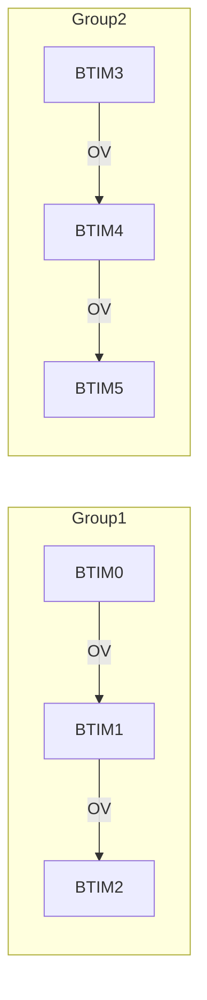

图 11-10 BTIM 定时器级联示意图

### 11.3.1.9 中断

表 11-2 BTIM 定时器中断


<table>
  <thead>
    <tr>
        <th>中断</th>
        <th>说明</th>
    </tr>
  </thead>
  <tbody>
    <tr>
        <td>BTIMn</td>
        <td>溢出/触发中断</td>
    </tr>
    <tr>
        <td>BTIMn+1</td>
        <td>溢出/触发中断</td>
    </tr>
    <tr>
        <td>BTIMn+2</td>
        <td>溢出/触发中断</td>
    </tr>
  </tbody>
</table>

>  **说明**
> n 取值为 0 和 3。

### 11.3.2 GTIM 功能描述

#### 11.3.2.1 功能框图


图 11-11 GTIM 框图

>  **说明**
>
> > ITR 信号来源详见“片内外设互联”章节。

#### 11.3.2.2 滤波单元

外部管脚输入的 ETR 信号经同步滤波、极性选择、边沿检测后，输出门控信号及边沿信号供计数单元及触发单元使用。由于 ETR 信号采用滤波时钟进行同步滤波，故输入的 ETR 信号的频率应低于滤波时钟的频率的二分之一。


图 11-12 GTIM 滤波单元示意图

#### 11.3.2.3 计数单元

在每个 TCLKD 信号的上升沿，内部计数器 CNT 自动加 1。计数到 ARR 后产生溢出信号 OV（宽度为一个 PCLK），并复位内部计数值为 0 并再次开始加计数。计数器的计数范围为 0 至 ARR，计数单元的计数周期为 ARR+1。

定时器支持 2 种计数模式：One-Shot 模式与连续计数模式。

* 当设置 GTIM_CR0.OST 为 1 时，定时器工作于 One-Shot 模式；发生溢出后定时器立即停止计数，硬件自动清除 CEN。

* 当设置 GTIM_CR0.OST 为 0 时，定时器工作于连续计数模式；只要 GTIM_CR0.CEN 为 1，定时器会一直进行计数。

每次溢出时，GTIM_IFR.UI 会被硬件置 1，若使能相应中断则可以产生溢出中断，用户应在中断服务程序中清除该溢出标志。

若 GTIM_CR0.TOGEN 为 1，则每溢出一次 TOG/TOGN 输出电平翻转一次；用户可通过 GPIO 的复用功能将 TOG/TOGN 信号输出到管脚用于驱动外部电路。


<table>
  <tbody>
    <tr>
        <td>Time</td>
        <td>Start</td>
        <td>Overflow 1</td>
        <td>Overflow 2</td>
        <td>Stop</td>
    </tr>
    <tr>
        <td>Counter</td>
        <td>INI -&gt; ARR</td>
        <td>0 -&gt; ARR</td>
        <td>0 -&gt; ARR</td>
        <td>0 -&gt; Stop</td>
    </tr>
    <tr>
        <td>CR0.CEN</td>
        <td>High</td>
        <td>High</td>
        <td>High</td>
        <td>Low</td>
    </tr>
    <tr>
        <td>OV</td>
        <td>Low</td>
        <td>Pulse</td>
        <td>Pulse</td>
        <td>Pulse</td>
    </tr>
    <tr>
        <td>TOGEN</td>
        <td>Low</td>
        <td>High</td>
        <td>High</td>
        <td>High</td>
    </tr>
    <tr>
        <td>TOG</td>
        <td>Low</td>
        <td>High</td>
        <td>Low</td>
        <td>High</td>
    </tr>
    <tr>
        <td>TOGN</td>
        <td>High</td>
        <td>Low</td>
        <td>High</td>
        <td>Low</td>
    </tr>
    <tr>
        <td>IFR.UI</td>
        <td>Low</td>
        <td>High (Write ICR.UI=0)</td>
        <td>High (Write ICR.UI=0)</td>
        <td>High (Write ICR.UI=0)</td>
    </tr>
  </tbody>
</table>

图 11-13 GTIM 计数器波形

### 11.3.2.4 定时器模式

当设置 GTIM_CR0.MD 为 0x00 时，GTIM 工作于定时器模式。在该模式下，计数时钟为 PCLK 分频后的 TCLKD，当设置 GTIM_CR0.CEN 为 1 后，定时器即从初值开始加计数，计数到 ARR 后产生溢出并重新从 0 开始计数。


图 11-14 GTIM 定时模式框图

### 11.3.2.5 计数器模式

当设置 GTIM_CR0.MD 为 0x01 时，GTIM 工作于计数器模式。在该模式下，计数时钟为分频后的 ITR 或 ETR 管脚输入的信号。当设置 GTIM_CR0.CEN 为 1 后，计数器即从初值开始加计数，计数到 ARR 后产生溢出并重新从 0 开始计数。

通过 GTIM_CR0.TRS 可以选择计数时钟源为 ITR 或 ETR；通过 GTIM_CR0.ETP 可以选择对 ETR 管脚输入信号的上升沿或下降沿进行计数。


图 11-15 GTIM 计数器模式框图

### 11.3.2.6 触发启动模式

当设置 GTIM_CR0.MD 为 0x02 时，GTIM 工作于触发启动模式，计数时钟为 PCLK 分频后的 TCLKD。该模式下定时器具有两种启动方法：设置 GTIM_CR0.CEN 为 1 或 TRS 信号上符合预期的电平变化。

启动后，计数器即从初值开始加计数，计数到 ARR 后产生溢出并重新从 0 开始计数；在任意时刻设置 GTIM_CR0.CEN 为 0，则可以停止定时器。

通过 GTIM_CR0.TRS 选择 TRS 信号来源为 ETR 或 ITR。

通过 GTIM_CR0.ETP 可以选择 ETR 管脚输入信号的上升沿或下降沿启动定时器。

每次检测到符合预期的触发信号时，GTIM_IFR.TI 会被硬件置 1，若使能相应中断则可以产生触发中断，用户应在中断服务程序中清除该触发标志。


图 11-16 GTIM 触发启动器模式框图

<table>
  <tbody>
    <tr>
        <td>Time</td>
        <td>CNT</td>
        <td>ETR</td>
        <td>CR0.CEN</td>
        <td>Note</td>
    </tr>
    <tr>
        <td>T1</td>
        <td>INI</td>
        <td>Low</td>
        <td>Low</td>
        <td> </td>
    </tr>
    <tr>
        <td>T2</td>
        <td>INI</td>
        <td>High</td>
        <td>High</td>
        <td>Trigger start</td>
    </tr>
    <tr>
        <td>T3</td>
        <td>ARR</td>
        <td>Low</td>
        <td>High</td>
        <td>Overflow to 0x0000</td>
    </tr>
    <tr>
        <td>T4</td>
        <td>0x0000</td>
        <td>Low</td>
        <td>High</td>
        <td> </td>
    </tr>
    <tr>
        <td>T5</td>
        <td>Intermediate</td>
        <td>Low</td>
        <td>Low</td>
        <td>Write CR0.CEN=0</td>
    </tr>
    <tr>
        <td>T6</td>
        <td>Intermediate</td>
        <td>High</td>
        <td>High</td>
        <td>Restart</td>
    </tr>
    <tr>
        <td>T7</td>
        <td>Intermediate</td>
        <td>Low</td>
        <td>Low</td>
        <td>Write CR0.CEN=0</td>
    </tr>
  </tbody>
</table>

图 11-17 GTIM 触发启动模式计数示意图

### 11.3.2.7 门控模式

当设置 GTIM_CR0.MD 为 0x03 时，GTIM 工作于门控模式，计数时钟为 PCLK 分频后的 TCLKD。该模式下定时器需要满足两个条件才会进行计数：GTIM_CR0.CEN 为 1、ETR 管脚上的电平符合预期。定时器运行时，计数器从初值开始加计数，计数到 ARR 后产生溢出并重新从 0 开始计数。

通过 GTIM_CR0.ETP 可以选择 ETR 管脚输入信号的高电平或低电平为计数电平。


图 11-18 GTIM 门控模式框图


<table>
  <tbody>
    <tr>
        <td>Time</td>
        <td>CNT</td>
        <td>CR0.CEN</td>
        <td>ETR</td>
        <td>Note</td>
    </tr>
    <tr>
        <td>T1</td>
        <td>INI</td>
        <td>Low</td>
        <td>High</td>
        <td> </td>
    </tr>
    <tr>
        <td>T2</td>
        <td>INI</td>
        <td>High</td>
        <td>High</td>
        <td>CEN set, ETR high -&gt; Counting starts</td>
    </tr>
    <tr>
        <td>T3</td>
        <td>Intermediate</td>
        <td>High</td>
        <td>Low</td>
        <td>ETR low -&gt; Counting pauses</td>
    </tr>
    <tr>
        <td>T4</td>
        <td>Intermediate</td>
        <td>High</td>
        <td>High</td>
        <td>ETR high -&gt; Counting resumes</td>
    </tr>
    <tr>
        <td>T5</td>
        <td>ARR</td>
        <td>High</td>
        <td>High</td>
        <td>Overflow to 0x0000</td>
    </tr>
    <tr>
        <td>T6</td>
        <td>Intermediate</td>
        <td>Low</td>
        <td>High</td>
        <td>CEN cleared -&gt; Counting stops</td>
    </tr>
  </tbody>
</table>

图 11-19 GTIM 门控模式计数示意图

### 11.3.2.8 比较捕获功能

GTIM 具有 4 路比较捕获通道，CH0~CH3。

#### 11.3.2.8.1 捕获功能

当配置 CMMR.CCyM（y=0~3）为 1~3 时，CHy 工作于捕获模式，支持三种捕获方法：

* 0b001：上升沿捕获
* 0b010：下降沿捕获
* 0b011：上升下降沿同时捕获

当 CHy 通道上出现所期望的脉冲边沿时，硬件自动将当前的记数值写入 CCRy 寄存器并置位 IFR.CCy；若使能相应通道的中断，则产生比较捕获中断，用户应在中断服务程序中清除该中断标志。

下图给出了两个通道进行输入捕获时的示意。其中 CH0 在上升沿进行捕获；CH1 上升沿和下降沿同时进行捕获。


<table>
  <thead>
    <tr>
        <th>Signal</th>
        <th>T0</th>
        <th>T1</th>
        <th>T2</th>
        <th>T3</th>
        <th>T4</th>
        <th>T5</th>
        <th>T6</th>
    </tr>
  </thead>
  <tbody>
    <tr>
        <td>CNT</td>
        <td>0x0000</td>
        <td>Rising</td>
        <td>INI</td>
        <td>Rising</td>
        <td>ARR</td>
        <td>Falling</td>
        <td>0x0000</td>
    </tr>
    <tr>
        <td>CR0.CEN</td>
        <td>Low</td>
        <td>High</td>
        <td>High</td>
        <td>High</td>
        <td>High</td>
        <td>High</td>
        <td>High</td>
    </tr>
    <tr>
        <td>CH0</td>
        <td>Low</td>
        <td>Pulse</td>
        <td>Low</td>
        <td>Low</td>
        <td>Low</td>
        <td>Low</td>
        <td>Low</td>
    </tr>
    <tr>
        <td>CH1</td>
        <td>Low</td>
        <td>Low</td>
        <td>Pulse (High)</td>
        <td>Pulse (Low)</td>
        <td>Low</td>
        <td>Low</td>
        <td>Low</td>
    </tr>
    <tr>
        <td>CCR0</td>
        <td> </td>
        <td>Capture</td>
        <td> </td>
        <td> </td>
        <td> </td>
        <td> </td>
        <td> </td>
    </tr>
    <tr>
        <td>CCR1</td>
        <td> </td>
        <td> </td>
        <td>Capture</td>
        <td>Capture</td>
        <td> </td>
        <td> </td>
        <td> </td>
    </tr>
    <tr>
        <td>IFR.CC0</td>
        <td>Low</td>
        <td>Pulse</td>
        <td>Low</td>
        <td>Low</td>
        <td>Low</td>
        <td>Low</td>
        <td>Low</td>
    </tr>
    <tr>
        <td>IFR.CC1</td>
        <td>Low</td>
        <td>Low</td>
        <td>Pulse</td>
        <td>Pulse</td>
        <td>Low</td>
        <td>Low</td>
        <td>Low</td>
    </tr>
  </tbody>
</table>

图 11-20 GTIM 捕获功能示意图

#### 11.3.2.8.2 比较功能

当配置 CMMR.CCyM（y=0~3）为 4~7 时，CHy 工作于比较模式，可以较出四种波形：

* 0b100：强制输出低电平
* 0b101：强制输出高电平
* 0b110：PWM 正向输出（CNT≥CCRy 输出高电平）
* 0b111：PWM 反向输出（CNT<CCRy 输出高电平）

> >  **说明**
> > 当 ARR 值不为 0xFFFF 时，可以实现 PWM 调整范围为 0%~100%
> > 比如在正向输出模式 ARR 为 99 时，CCR 为 0~100 对应的占空比为 100%~0%

下图给出了两个通道进行比较输出时的示意。其中 CH0 采用 PWM 正向输出；CH1 采用 PWM 反向输出。


图 11-21 GTIM 比较功能示意图

## 11.3.2.9 片内外设互联

触发互连信息如下：

表 11-3 GTIM TRS 触发源列表


<table>
  <thead>
    <tr>
        <th>CR0.TRS</th>
        <th>0b00</th>
        <th>0b01</th>
        <th>0b10</th>
        <th>0b11</th>
    </tr>
  </thead>
  <tbody>
    <tr>
        <td>GTIM0</td>
        <td>GTIM0_ETR</td>
        <td>GTIM1_OV</td>
        <td>-</td>
        <td>ATIM3_TRGO</td>
    </tr>
    <tr>
        <td>GTIM1</td>
        <td>GTIM1_ETR</td>
        <td>GTIM0_OV</td>
        <td>-</td>
        <td>ATIM3_TRGO</td>
    </tr>
  </tbody>
</table>

GTIM0 的 CH0 输入可以从端口输入，也可通过端口功能寄存器选择可以连通到其他模块或端口。具体配置参考《端口控制器（GPIO）》章节寄存器“端口辅助功能定时器捕获输入选择（GPIO_TIMCPS）”相关描述。

GTIM0 的 ETR 输入可以从端口输入，也可通过端口功能寄存器选择可以连通到其他模块或端口。具体配置参考《端口控制器（GPIO）》章节寄存器“端口辅助功能定时器 ETR 选择（GPIO_TIMES）”相关描述。

## 11.3.2.10 中断

计数溢出，外部触发，通道的捕获比较都可以产生中断，通过相应的中断使能可以选择相应的中断。

# 11.4 寄存器

## 11.4.1 寄存器总表

* **BTIM0 基地址**：0x40001800
* **BTIM1 基地址**：0x40001900
* **BTIM2 基地址**：0x40001A00
* **BTIM3 基地址**：0x40001C00
* **BTIM4 基地址**：0x40001D00
* **BTIM5 基地址**：0x40001E00

> >  **说明**
> > BTIM 在 SYSCTRL1.CTIMERx_FUN_SEL 为 1 时有效。

表 11-4 BTIM 寄存器偏移地址


<table>
  <thead>
    <tr>
        <th>偏移地址</th>
        <th>寄存器</th>
        <th>描述</th>
    </tr>
  </thead>
  <tbody>
    <tr>
        <td>0x00</td>
        <td>BTIM_ARR</td>
        <td>重载寄存器</td>
    </tr>
    <tr>
        <td>0x04</td>
        <td>BTIM_CNT</td>
        <td>计数器寄存器</td>
    </tr>
    <tr>
        <td>0x10</td>
        <td>BTIM_CR</td>
        <td>控制寄存器</td>
    </tr>
    <tr>
        <td>0x14</td>
        <td>BTIM_IER</td>
        <td>中断使能控制寄存器</td>
    </tr>
    <tr>
        <td>0x18</td>
        <td>BTIM_IFR</td>
        <td>中断标志寄存器</td>
    </tr>
    <tr>
        <td>0x1C</td>
        <td>BTIM_ICR</td>
        <td>中断清除寄存器</td>
    </tr>
    <tr>
        <td>0x48</td>
        <td>BTIM_AIFR</td>
        <td>复合中断标志寄存器</td>
    </tr>
    <tr>
        <td>0x4C</td>
        <td>BTIM_AICR</td>
        <td>复合中断清除寄存器</td>
    </tr>
  </tbody>
</table>

* **GTIM0 基地址**：0x40001800
* **GTIM1 基地址**：0x40001C00

> >  **说明**
> > GTIM 在 SYSCTRL1.CTIMERx_FUN_SEL 为 0 时有效。

表 11-5 GTIM 寄存器偏移地址


<table>
  <thead>
    <tr>
        <th>偏移地址</th>
        <th>寄存器</th>
        <th>描述</th>
    </tr>
  </thead>
  <tbody>
    <tr>
        <td>0x300</td>
        <td>GTIM_ARR</td>
        <td>重载寄存器</td>
    </tr>
    <tr>
        <td>0x304</td>
        <td>GTIM_CNT</td>
        <td>计数寄存器</td>
    </tr>
    <tr>
        <td>0x308</td>
        <td>GTIM_CMMR</td>
        <td>比较捕获控制寄存器</td>
    </tr>
    <tr>
        <td>0x30C</td>
        <td>GTIM_CR1</td>
        <td>控制寄存器 1</td>
    </tr>
    <tr>
        <td>0x310</td>
        <td>GTIM_CR0</td>
        <td>控制寄存器 0</td>
    </tr>
    <tr>
        <td>0x314</td>
        <td>GTIM_IER</td>
        <td>中断使能控制寄存器</td>
    </tr>
  </tbody>
</table>

<table>
  <thead>
    <tr>
        <th>偏移地址</th>
        <th>寄存器</th>
        <th>描述</th>
    </tr>
  </thead>
  <tbody>
    <tr>
        <td>0x318</td>
        <td>GTIM_IFR</td>
        <td>中断标志寄存器</td>
    </tr>
    <tr>
        <td>0x31C</td>
        <td>GTIM_ICR</td>
        <td>中断标志清除寄存器</td>
    </tr>
    <tr>
        <td>0x320+0x4*y</td>
        <td>GTIM_CCRy</td>
        <td>CHy 比较/捕获寄存器 (y=0~3)</td>
    </tr>
  </tbody>
</table>

### 11.4.2 BTIM 寄存器

#### 11.4.2.1 重载寄存器（BTIM_ARR）


<table>
  <thead>
    <tr>
        <th>Offset</th>
        <th colspan="32">Bit Position</th>
    </tr>
    <tr>
        <th>0x00</th>
        <th>31</th>
        <th>30</th>
        <th>29</th>
        <th>28</th>
        <th>27</th>
        <th>26</th>
        <th>25</th>
        <th>24</th>
        <th>23</th>
        <th>22</th>
        <th>21</th>
        <th>20</th>
        <th>19</th>
        <th>18</th>
        <th>17</th>
        <th>16</th>
        <th>15</th>
        <th>14</th>
        <th>13</th>
        <th>12</th>
        <th>11</th>
        <th>10</th>
        <th>9</th>
        <th>8</th>
        <th>7</th>
        <th>6</th>
        <th>5</th>
        <th>4</th>
        <th>3</th>
        <th>2</th>
        <th>1</th>
        <th>0</th>
    </tr>
    <tr>
        <th>Reset</th>
        <th colspan="32">0x0000FFFF</th>
    </tr>
    <tr>
        <th>Name</th>
        <th colspan="16">Reserved</th>
        <th colspan="16">ARR</th>
    </tr>
    <tr>
        <th>Access</th>
        <th colspan="16"> </th>
        <th colspan="16">RW</th>
    </tr>
  </thead>
</table>
<table>
  <thead>
    <tr>
        <th>位/位域</th>
        <th>标记</th>
        <th>位名</th>
        <th>功能描述</th>
        <th>读写</th>
    </tr>
  </thead>
  <tbody>
    <tr>
        <td>31:16</td>
        <td>Reserved</td>
        <td>保留</td>
        <td>-</td>
        <td>-</td>
    </tr>
    <tr>
        <td>15:0</td>
        <td>ARR</td>
        <td>定时器重载值</td>
        <td>-</td>
        <td>RW</td>
    </tr>
  </tbody>
</table>

#### 11.4.2.2 计数寄存器（BTIM_CNT）


<table>
  <thead>
    <tr>
        <th>Offset</th>
        <th colspan="32">Bit Position</th>
    </tr>
    <tr>
        <th>0x04</th>
        <th>31</th>
        <th>30</th>
        <th>29</th>
        <th>28</th>
        <th>27</th>
        <th>26</th>
        <th>25</th>
        <th>24</th>
        <th>23</th>
        <th>22</th>
        <th>21</th>
        <th>20</th>
        <th>19</th>
        <th>18</th>
        <th>17</th>
        <th>16</th>
        <th>15</th>
        <th>14</th>
        <th>13</th>
        <th>12</th>
        <th>11</th>
        <th>10</th>
        <th>9</th>
        <th>8</th>
        <th>7</th>
        <th>6</th>
        <th>5</th>
        <th>4</th>
        <th>3</th>
        <th>2</th>
        <th>1</th>
        <th>0</th>
    </tr>
    <tr>
        <th>Reset</th>
        <th colspan="32">0x00000000</th>
    </tr>
    <tr>
        <th>Name</th>
        <th colspan="16">Reserved</th>
        <th colspan="16">CNT</th>
    </tr>
    <tr>
        <th>Access</th>
        <th colspan="16"> </th>
        <th colspan="16">RW</th>
    </tr>
  </thead>
</table>
<table>
  <thead>
    <tr>
        <th>位/位域</th>
        <th>标记</th>
        <th>位名</th>
        <th>功能描述</th>
        <th>读写</th>
    </tr>
  </thead>
  <tbody>
    <tr>
        <td>31:16</td>
        <td>Reserved</td>
        <td>保留</td>
        <td>-</td>
        <td>-</td>
    </tr>
    <tr>
        <td>15:0</td>
        <td>CNT</td>
        <td>定时器计数值</td>
        <td>-</td>
        <td>RW</td>
    </tr>
  </tbody>
</table>

### 11.4.2.3 控制寄存器（BTIM_CR）


<table>
  <thead>
    <tr>
        <th>Offset</th>
        <th colspan="32">Bit Position</th>
    </tr>
    <tr>
        <th>0x10</th>
        <th>31</th>
        <th>30</th>
        <th>29</th>
        <th>28</th>
        <th>27</th>
        <th>26</th>
        <th>25</th>
        <th>24</th>
        <th>23</th>
        <th>22</th>
        <th>21</th>
        <th>20</th>
        <th>19</th>
        <th>18</th>
        <th>17</th>
        <th>16</th>
        <th>15</th>
        <th>14</th>
        <th>13</th>
        <th>12</th>
        <th>11</th>
        <th>10</th>
        <th>9</th>
        <th>8</th>
        <th>7</th>
        <th>6</th>
        <th>5</th>
        <th>4</th>
        <th>3</th>
        <th>2</th>
        <th>1</th>
        <th>0</th>
    </tr>
    <tr>
        <th>Reset</th>
        <th colspan="32">0x00000000</th>
    </tr>
    <tr>
        <th>Name</th>
        <th colspan="20">Reserved</th>
        <th>ETP</th>
        <th colspan="2">TRS</th>
        <th>OST</th>
        <th colspan="4">PRS</th>
        <th>TOGEN</th>
        <th>MD</th>
        <th colspan="2">CEN</th>
    </tr>
    <tr>
        <th>Access</th>
        <th colspan="20"> </th>
        <th>RW</th>
        <th colspan="2">RW</th>
        <th>RW</th>
        <th colspan="4">RW</th>
        <th>RW</th>
        <th>RW</th>
        <th colspan="2">RW</th>
    </tr>
  </thead>
</table>
<table>
  <thead>
    <tr>
        <th>位/位域</th>
        <th>标记</th>
        <th>位名</th>
        <th>功能描述</th>
        <th>读写</th>
    </tr>
  </thead>
  <tbody>
    <tr>
        <td>31:12</td>
        <td>Reserved</td>
        <td>保留</td>
        <td>-</td>
        <td>-</td>
    </tr>
    <tr>
        <td>11</td>
        <td>ETP</td>
        <td>外部管脚输入的 ETR 信号极性选择</td>
        <td>● 0b0：ETR 正向（触发模式上升沿有效，门控模式高电平有效）<br/>● 0b1：ETR 反向（触发模式下降沿有效，门控模式低电平有效）</td>
        <td>RW</td>
    </tr>
    <tr>
        <td>10:9</td>
        <td>TRS</td>
        <td>触发源选择</td>
        <td>● 0b00：ETR 管脚输入的信号<br/>● 0b01：ITR，详见“定时器级联”章节<br/>● 其他：禁止设置<br/>&gt; 说明<br/>BTIM0~2 共用一个 ETR 管脚；BTIM3~5 共用另一个 ETR 管脚。</td>
        <td>RW</td>
    </tr>
    <tr>
        <td>8</td>
        <td>OST</td>
        <td>单次/连续计数模式控制</td>
        <td>● 0b0：连续计数模式<br/>● 0b1：单次计数模式</td>
        <td>RW</td>
    </tr>
    <tr>
        <td>7:4</td>
        <td>PRS</td>
        <td>预分频器分频系数配置</td>
        <td>● 0b0000：DIV1<br/>● 0b0001：DIV2<br/>● 0b0010：DIV4<br/>● 0b0011：DIV8<br/>● 0b0100：DIV16<br/>● 0b0101：DIV32<br/>● 0b0110：DIV64<br/>● 0b0111：DIV128<br/>● 0b1000：DIV256<br/>● 0b1001：DIV512<br/>● 0b1010：DIV1024<br/>● 0b1011：DIV2048<br/>● 0b1100：DIV4096<br/>● 0b1101：DIV8192<br/>● 0b1110：DIV16384<br/>● 0b1111：DIV32768</td>
        <td>RW</td>
    </tr>
    <tr>
        <td>3</td>
        <td>TOGEN</td>
        <td>TOG 管脚输出使能控制</td>
        <td>● 0b0：TOG、TOGN 输出电平均为 0<br/>● 0b1：TOG、TOGN 输出电平相反的信号</td>
        <td>RW</td>
    </tr>
  </tbody>
</table>

<table>
  <thead>
    <tr>
        <th>位/位域</th>
        <th>标记</th>
        <th>位名</th>
        <th>功能描述</th>
        <th>读写</th>
    </tr>
  </thead>
  <tbody>
    <tr>
        <td>2:1</td>
        <td>MD</td>
        <td>定时器工作模式配置</td>
        <td>● 0b00：定时器模式，计数时钟为 PCLK<br/>● 0b01：计数器模式，计数时钟为 TRS 信号<br/>● 0b10：触发启动模式，计数时钟为 PCLK，TRS 信号触发计数器启动<br/>● 0b11：门控模式，计数时钟为 PCLK，ETR 管脚输入信号作为门控</td>
        <td>RW</td>
    </tr>
    <tr>
        <td>0</td>
        <td>CEN</td>
        <td>定时器使能控制</td>
        <td>● 0b0：定时器停止<br/>● 0b1：定时器使能<br/>&gt; 说明<br/>&gt; 触发启动模式触发后，CEN 由硬件置 1。</td>
        <td>RW</td>
    </tr>
  </tbody>
</table>

### 11.4.2.4 中断使能控制寄存器（BTIM_IER）


<table>
  <thead>
    <tr>
        <th>Offset</th>
        <th colspan="32">Bit Position</th>
    </tr>
    <tr>
        <th>0x14</th>
        <th>31</th>
        <th>30</th>
        <th>29</th>
        <th>28</th>
        <th>27</th>
        <th>26</th>
        <th>25</th>
        <th>24</th>
        <th>23</th>
        <th>22</th>
        <th>21</th>
        <th>20</th>
        <th>19</th>
        <th>18</th>
        <th>17</th>
        <th>16</th>
        <th>15</th>
        <th>14</th>
        <th>13</th>
        <th>12</th>
        <th>11</th>
        <th>10</th>
        <th>9</th>
        <th>8</th>
        <th>7</th>
        <th>6</th>
        <th>5</th>
        <th>4</th>
        <th>3</th>
        <th>2</th>
        <th>1</th>
        <th>0</th>
    </tr>
  </thead>
  <tbody>
    <tr>
        <td>Reset</td>
        <td colspan="32">0x00000000</td>
    </tr>
    <tr>
        <td>Name</td>
        <td colspan="30">Reserved</td>
        <td>TI</td>
        <td>UI</td>
    </tr>
    <tr>
        <td>Access</td>
        <td colspan="30"> </td>
        <td>RW</td>
        <td>RW</td>
    </tr>
  </tbody>
</table>
<table>
  <thead>
    <tr>
        <th>位/位域</th>
        <th>标记</th>
        <th>位名</th>
        <th>功能描述</th>
        <th>读写</th>
    </tr>
  </thead>
  <tbody>
    <tr>
        <td>31:2</td>
        <td>Reserved</td>
        <td>保留</td>
        <td>-</td>
        <td>-</td>
    </tr>
    <tr>
        <td>1</td>
        <td>TI</td>
        <td>触发中断使能控制</td>
        <td>● 0b0：禁止触发中断<br/>● 0b1：使能触发中断</td>
        <td>RW</td>
    </tr>
    <tr>
        <td>0</td>
        <td>UI</td>
        <td>溢出中断使能控制</td>
        <td>● 0b0：禁止溢出中断<br/>● 0b1：使能溢出中断</td>
        <td>RW</td>
    </tr>
  </tbody>
</table>

### 11.4.2.5 中断标志寄存器（BTIM_IFR）


<table>
  <thead>
    <tr>
        <th>Offset</th>
        <th colspan="32">Bit Position</th>
    </tr>
    <tr>
        <th>0x18</th>
        <th>31</th>
        <th>30</th>
        <th>29</th>
        <th>28</th>
        <th>27</th>
        <th>26</th>
        <th>25</th>
        <th>24</th>
        <th>23</th>
        <th>22</th>
        <th>21</th>
        <th>20</th>
        <th>19</th>
        <th>18</th>
        <th>17</th>
        <th>16</th>
        <th>15</th>
        <th>14</th>
        <th>13</th>
        <th>12</th>
        <th>11</th>
        <th>10</th>
        <th>9</th>
        <th>8</th>
        <th>7</th>
        <th>6</th>
        <th>5</th>
        <th>4</th>
        <th>3</th>
        <th>2</th>
        <th>1</th>
        <th>0</th>
    </tr>
    <tr>
        <th>Reset</th>
        <th colspan="32">0x00000000</th>
    </tr>
    <tr>
        <th>Name</th>
        <th colspan="30">Reserved</th>
        <th>TI</th>
        <th>UI</th>
    </tr>
    <tr>
        <th>Access</th>
        <th colspan="30"> </th>
        <th>RO</th>
        <th>RO</th>
    </tr>
  </thead>
</table>
<table>
  <thead>
    <tr>
        <th>位/位域</th>
        <th>标记</th>
        <th>位名</th>
        <th>功能描述</th>
        <th>读写</th>
    </tr>
  </thead>
  <tbody>
    <tr>
        <td>31:2</td>
        <td>Reserved</td>
        <td>保留</td>
        <td>-</td>
        <td>-</td>
    </tr>
    <tr>
        <td>1</td>
        <td>TI</td>
        <td>触发标志</td>
        <td>● 0b0：未发生触发事件<br/>● 0b1：已发生触发事件</td>
        <td>RO</td>
    </tr>
    <tr>
        <td>0</td>
        <td>UI</td>
        <td>计数器溢出标志</td>
        <td>● 0b0：计数器未溢出<br/>● 0b1：计数器已溢出</td>
        <td>RO</td>
    </tr>
  </tbody>
</table>

### 11.4.2.6 中断标志清除寄存器（BTIM_ICR）


<table>
  <thead>
    <tr>
        <th>Offset</th>
        <th colspan="32">Bit Position</th>
    </tr>
    <tr>
        <th>0x1C</th>
        <th>31</th>
        <th>30</th>
        <th>29</th>
        <th>28</th>
        <th>27</th>
        <th>26</th>
        <th>25</th>
        <th>24</th>
        <th>23</th>
        <th>22</th>
        <th>21</th>
        <th>20</th>
        <th>19</th>
        <th>18</th>
        <th>17</th>
        <th>16</th>
        <th>15</th>
        <th>14</th>
        <th>13</th>
        <th>12</th>
        <th>11</th>
        <th>10</th>
        <th>9</th>
        <th>8</th>
        <th>7</th>
        <th>6</th>
        <th>5</th>
        <th>4</th>
        <th>3</th>
        <th>2</th>
        <th>1</th>
        <th>0</th>
    </tr>
    <tr>
        <th>Reset</th>
        <th colspan="32">0x00000003</th>
    </tr>
    <tr>
        <th>Name</th>
        <th colspan="30">Reserved</th>
        <th>TI</th>
        <th>UI</th>
    </tr>
    <tr>
        <th>Access</th>
        <th colspan="30"> </th>
        <th>WO</th>
        <th>WO</th>
    </tr>
  </thead>
</table>
<table>
  <thead>
    <tr>
        <th>位/位域</th>
        <th>标记</th>
        <th>位名</th>
        <th>功能描述</th>
        <th>读写</th>
    </tr>
  </thead>
  <tbody>
    <tr>
        <td>31:2</td>
        <td>Reserved</td>
        <td>保留</td>
        <td>-</td>
        <td>-</td>
    </tr>
    <tr>
        <td>1</td>
        <td>TI</td>
        <td>触发标志清除</td>
        <td>写 0 清除标志，写 1 无效；读出恒为 1</td>
        <td>WO</td>
    </tr>
    <tr>
        <td>0</td>
        <td>UI</td>
        <td>计数器溢出标志清除</td>
        <td>写 0 清除标志，写 1 无效；读出恒为 1</td>
        <td>WO</td>
    </tr>
  </tbody>
</table>

### 11.4.2.7 复合中断标志寄存器（BTIM_AIFR）


<table>
  <thead>
    <tr>
        <th>Offset</th>
        <th colspan="32">Bit Position</th>
    </tr>
    <tr>
        <th>0x48</th>
        <th>31</th>
        <th>30</th>
        <th>29</th>
        <th>28</th>
        <th>27</th>
        <th>26</th>
        <th>25</th>
        <th>24</th>
        <th>23</th>
        <th>22</th>
        <th>21</th>
        <th>20</th>
        <th>19</th>
        <th>18</th>
        <th>17</th>
        <th>16</th>
        <th>15</th>
        <th>14</th>
        <th>13</th>
        <th>12</th>
        <th>11</th>
        <th>10</th>
        <th>9</th>
        <th>8</th>
        <th>7</th>
        <th>6</th>
        <th>5</th>
        <th>4</th>
        <th>3</th>
        <th>2</th>
        <th>1</th>
        <th>0</th>
    </tr>
    <tr>
        <th>Reset</th>
        <th colspan="32">0x00000000</th>
    </tr>
    <tr>
        <th>Name</th>
        <th colspan="26">Reserved</th>
        <th>TI25</th>
        <th>UI25</th>
        <th>TI14</th>
        <th>UI14</th>
        <th>TI03</th>
        <th>UI03</th>
    </tr>
    <tr>
        <th>Access</th>
        <th> </th>
        <th> </th>
        <th> </th>
        <th> </th>
        <th> </th>
        <th> </th>
        <th> </th>
        <th> </th>
        <th> </th>
        <th> </th>
        <th> </th>
        <th> </th>
        <th> </th>
        <th> </th>
        <th> </th>
        <th> </th>
        <th> </th>
        <th> </th>
        <th> </th>
        <th> </th>
        <th> </th>
        <th> </th>
        <th> </th>
        <th> </th>
        <th> </th>
        <th> </th>
        <th>RO</th>
        <th>RO</th>
        <th>RO</th>
        <th>RO</th>
        <th>RO</th>
        <th>RO</th>
    </tr>
  </thead>
</table>
<table>
  <thead>
    <tr>
        <th>位/位域</th>
        <th>标记</th>
        <th>位名</th>
        <th>功能描述</th>
        <th>读写</th>
    </tr>
  </thead>
  <tbody>
    <tr>
        <td>31:6</td>
        <td>Reserved</td>
        <td>保留</td>
        <td>-</td>
        <td>-</td>
    </tr>
    <tr>
        <td>5</td>
        <td>TI25</td>
        <td>BTIM2/5 触发标志</td>
        <td>● 0b0：未发生触发事件<br/>● 0b1：已发生触发事件</td>
        <td>RO</td>
    </tr>
    <tr>
        <td>4</td>
        <td>UI25</td>
        <td>BTIM2/5 溢出标志</td>
        <td>● 0b0：计数器未溢出<br/>● 0b1：计数器已溢出</td>
        <td>RO</td>
    </tr>
    <tr>
        <td>3</td>
        <td>TI14</td>
        <td>BTIM1/4 触发标志</td>
        <td>● 0b0：未发生触发事件<br/>● 0b1：已发生触发事件</td>
        <td>RO</td>
    </tr>
    <tr>
        <td>2</td>
        <td>UI14</td>
        <td>BTIM1/4 溢出标志</td>
        <td>● 0b0：计数器未溢出<br/>● 0b1：计数器已溢出</td>
        <td>RO</td>
    </tr>
    <tr>
        <td>1</td>
        <td>TI03</td>
        <td>BTIM0/3 触发标志</td>
        <td>● 0b0：未发生触发事件<br/>● 0b1：已发生触发事件</td>
        <td>RO</td>
    </tr>
    <tr>
        <td>0</td>
        <td>UI03</td>
        <td>BTIM0/3 溢出标志</td>
        <td>● 0b0：计数器未溢出<br/>● 0b1：计数器已溢出</td>
        <td>RO</td>
    </tr>
  </tbody>
</table>

### 11.4.2.8 复合中断标志清除寄存器（BTIM_AICR）


<table>
  <thead>
    <tr>
        <th>Offset</th>
        <th colspan="32">Bit Position</th>
    </tr>
    <tr>
        <th>0x4C</th>
        <th>31</th>
        <th>30</th>
        <th>29</th>
        <th>28</th>
        <th>27</th>
        <th>26</th>
        <th>25</th>
        <th>24</th>
        <th>23</th>
        <th>22</th>
        <th>21</th>
        <th>20</th>
        <th>19</th>
        <th>18</th>
        <th>17</th>
        <th>16</th>
        <th>15</th>
        <th>14</th>
        <th>13</th>
        <th>12</th>
        <th>11</th>
        <th>10</th>
        <th>9</th>
        <th>8</th>
        <th>7</th>
        <th>6</th>
        <th>5</th>
        <th>4</th>
        <th>3</th>
        <th>2</th>
        <th>1</th>
        <th>0</th>
    </tr>
    <tr>
        <th>Reset</th>
        <th colspan="32">0x0000003F</th>
    </tr>
    <tr>
        <th>Name</th>
        <th colspan="26">Reserved</th>
        <th>TI25</th>
        <th>UI25</th>
        <th>TI14</th>
        <th>UI14</th>
        <th>TI03</th>
        <th>UI03</th>
    </tr>
    <tr>
        <th>Access</th>
        <th colspan="26"> </th>
        <th>WO</th>
        <th>WO</th>
        <th>WO</th>
        <th>WO</th>
        <th>WO</th>
        <th>WO</th>
    </tr>
  </thead>
</table>
<table>
  <thead>
    <tr>
        <th>位/位域</th>
        <th>标记</th>
        <th>位名</th>
        <th>功能描述</th>
        <th>读写</th>
    </tr>
  </thead>
  <tbody>
    <tr>
        <td>31:6</td>
        <td>Reserved</td>
        <td>保留</td>
        <td>-</td>
        <td>-</td>
    </tr>
    <tr>
        <td>5</td>
        <td>TI25</td>
        <td>BTIM2/5 触发标志清除</td>
        <td>写 0 清除标志，写 1 无效；读出恒为 1</td>
        <td>WO</td>
    </tr>
    <tr>
        <td>4</td>
        <td>UI25</td>
        <td>BTIM2/5 溢出标志清除</td>
        <td>写 0 清除标志，写 1 无效；读出恒为 1</td>
        <td>WO</td>
    </tr>
    <tr>
        <td>3</td>
        <td>TI14</td>
        <td>BTIM1/4 触发标志清除</td>
        <td>写 0 清除标志，写 1 无效；读出恒为 1</td>
        <td>WO</td>
    </tr>
    <tr>
        <td>2</td>
        <td>UI14</td>
        <td>BTIM1/4 溢出标志清除</td>
        <td>写 0 清除标志，写 1 无效；读出恒为 1</td>
        <td>WO</td>
    </tr>
    <tr>
        <td>1</td>
        <td>TI03</td>
        <td>BTIM0/3 触发标志清除</td>
        <td>写 0 清除标志，写 1 无效；读出恒为 1</td>
        <td>WO</td>
    </tr>
    <tr>
        <td>0</td>
        <td>UI03</td>
        <td>BTIM0/3 溢出标志清除</td>
        <td>写 0 清除标志，写 1 无效；读出恒为 1</td>
        <td>WO</td>
    </tr>
  </tbody>
</table>

### 11.4.3 GTIM 寄存器

#### 11.4.3.1 重载寄存器（GTIM_ARR）


<table>
  <thead>
    <tr>
        <th>Offset</th>
        <th colspan="32">Bit Position</th>
    </tr>
  </thead>
  <tbody>
    <tr>
        <td>0x300</td>
        <td>31</td>
        <td>30</td>
        <td>29</td>
        <td>28</td>
        <td>27</td>
        <td>26</td>
        <td>25</td>
        <td>24</td>
        <td>23</td>
        <td>22</td>
        <td>21</td>
        <td>20</td>
        <td>19</td>
        <td>18</td>
        <td>17</td>
        <td>16</td>
        <td>15</td>
        <td>14</td>
        <td>13</td>
        <td>12</td>
        <td>11</td>
        <td>10</td>
        <td>9</td>
        <td>8</td>
        <td>7</td>
        <td>6</td>
        <td>5</td>
        <td>4</td>
        <td>3</td>
        <td>2</td>
        <td>1</td>
        <td>0</td>
    </tr>
    <tr>
        <td>Reset</td>
        <td colspan="32">0x0000FFFF</td>
    </tr>
    <tr>
        <td>Name</td>
        <td colspan="16">Reserved</td>
        <td colspan="16">ARR</td>
    </tr>
    <tr>
        <td>Access</td>
        <td colspan="16"> </td>
        <td colspan="16">RW</td>
    </tr>
  </tbody>
</table>
<table>
  <thead>
    <tr>
        <th>位/位域</th>
        <th>标记</th>
        <th>位名</th>
        <th>功能描述</th>
        <th>读写</th>
    </tr>
  </thead>
  <tbody>
    <tr>
        <td>31:16</td>
        <td>Reserved</td>
        <td>保留</td>
        <td>-</td>
        <td>-</td>
    </tr>
    <tr>
        <td>15:0</td>
        <td>ARR</td>
        <td>定时器重载值</td>
        <td>-</td>
        <td>RW</td>
    </tr>
  </tbody>
</table>

#### 11.4.3.2 计数寄存器（GTIM_CNT）


<table>
  <thead>
    <tr>
        <th>Offset</th>
        <th colspan="32">Bit Position</th>
    </tr>
  </thead>
  <tbody>
    <tr>
        <td>0x304</td>
        <td>31</td>
        <td>30</td>
        <td>29</td>
        <td>28</td>
        <td>27</td>
        <td>26</td>
        <td>25</td>
        <td>24</td>
        <td>23</td>
        <td>22</td>
        <td>21</td>
        <td>20</td>
        <td>19</td>
        <td>18</td>
        <td>17</td>
        <td>16</td>
        <td>15</td>
        <td>14</td>
        <td>13</td>
        <td>12</td>
        <td>11</td>
        <td>10</td>
        <td>9</td>
        <td>8</td>
        <td>7</td>
        <td>6</td>
        <td>5</td>
        <td>4</td>
        <td>3</td>
        <td>2</td>
        <td>1</td>
        <td>0</td>
    </tr>
    <tr>
        <td>Reset</td>
        <td colspan="32">0x00000000</td>
    </tr>
    <tr>
        <td>Name</td>
        <td colspan="16">Reserved</td>
        <td colspan="16">CNT</td>
    </tr>
    <tr>
        <td>Access</td>
        <td colspan="16"> </td>
        <td colspan="16">RW</td>
    </tr>
  </tbody>
</table>
<table>
  <thead>
    <tr>
        <th>位/位域</th>
        <th>标记</th>
        <th>位名</th>
        <th>功能描述</th>
        <th>读写</th>
    </tr>
  </thead>
  <tbody>
    <tr>
        <td>31:16</td>
        <td>Reserved</td>
        <td>保留</td>
        <td>-</td>
        <td>-</td>
    </tr>
    <tr>
        <td>15:0</td>
        <td>CNT</td>
        <td>定时器计数值</td>
        <td>-</td>
        <td>RW</td>
    </tr>
  </tbody>
</table>

### 11.4.3.3 控制寄存器 1（GTIM_CR1）


<table>
  <thead>
    <tr>
        <th>Offset</th>
        <th colspan="32">Bit Position</th>
    </tr>
    <tr>
        <th>0x30C</th>
        <th>31</th>
        <th>30</th>
        <th>29</th>
        <th>28</th>
        <th>27</th>
        <th>26</th>
        <th>25</th>
        <th>24</th>
        <th>23</th>
        <th>22</th>
        <th>21</th>
        <th>20</th>
        <th>19</th>
        <th>18</th>
        <th>17</th>
        <th>16</th>
        <th>15</th>
        <th>14</th>
        <th>13</th>
        <th>12</th>
        <th>11</th>
        <th>10</th>
        <th>9</th>
        <th>8</th>
        <th>7</th>
        <th>6</th>
        <th>5</th>
        <th>4</th>
        <th>3</th>
        <th>2</th>
        <th>1</th>
        <th>0</th>
    </tr>
    <tr>
        <th>Reset</th>
        <th colspan="32">0x00000000</th>
    </tr>
    <tr>
        <th>Name</th>
        <th colspan="23">Reserved</th>
        <th> </th>
        <th> </th>
        <th colspan="3">ETRFLT</th>
        <th colspan="4">Reserved</th>
    </tr>
    <tr>
        <th>Access</th>
        <th colspan="23"> </th>
        <th> </th>
        <th> </th>
        <th colspan="3">RW</th>
        <th colspan="4"> </th>
    </tr>
  </thead>
</table>
<table>
  <thead>
    <tr>
        <th>位/位域</th>
        <th>标记</th>
        <th>位名</th>
        <th>功能描述</th>
        <th>读写</th>
    </tr>
  </thead>
  <tbody>
    <tr>
        <td>31:9</td>
        <td>Reserved</td>
        <td>保留</td>
        <td>-</td>
        <td>-</td>
    </tr>
    <tr>
        <td>8:7</td>
        <td>Reserved</td>
        <td>保留</td>
        <td>所有位读出为 0，写入时必须写 0</td>
        <td>-</td>
    </tr>
    <tr>
        <td>6:4</td>
        <td>ETRFLT</td>
        <td>ETR 管脚输入信号滤波配置</td>
        <td>采样时钟为 PCLK 或 PCLK 分频，采样点个数为 N<br/>● 0b000：无滤波<br/>● 0b001：F<sub>sample</sub>=PCLK，N=2<br/>● 0b010：F<sub>sample</sub>=PCLK，N=4<br/>● 0b011：F<sub>sample</sub>=PCLK，N=6<br/>● 0b100：F<sub>sample</sub>=PCLK/4，N=4<br/>● 0b101：F<sub>sample</sub>=PCLK/4，N=6<br/>● 0b110：F<sub>sample</sub>=PCLK/8，N=4<br/>● 0b111：F<sub>sample</sub>=PCLK/8，N=6</td>
        <td>RW</td>
    </tr>
    <tr>
        <td>3:0</td>
        <td>Reserved</td>
        <td>保留</td>
        <td>-</td>
        <td>-</td>
    </tr>
  </tbody>
</table>

## 11.4.3.4 控制寄存器 0（GTIM_CR0）


<table>
  <thead>
    <tr>
        <th>Offset</th>
        <th colspan="32">Bit Position</th>
    </tr>
    <tr>
        <th>0x310</th>
        <th>31</th>
        <th>30</th>
        <th>29</th>
        <th>28</th>
        <th>27</th>
        <th>26</th>
        <th>25</th>
        <th>24</th>
        <th>23</th>
        <th>22</th>
        <th>21</th>
        <th>20</th>
        <th>19</th>
        <th>18</th>
        <th>17</th>
        <th>16</th>
        <th>15</th>
        <th>14</th>
        <th>13</th>
        <th>12</th>
        <th>11</th>
        <th>10</th>
        <th>9</th>
        <th>8</th>
        <th>7</th>
        <th>6</th>
        <th>5</th>
        <th>4</th>
        <th>3</th>
        <th>2</th>
        <th>1</th>
        <th>0</th>
    </tr>
    <tr>
        <th>Reset</th>
        <th colspan="32">0x00000000</th>
    </tr>
    <tr>
        <th>Name</th>
        <th colspan="20">Reserved</th>
        <th>ETP</th>
        <th colspan="2">TRS</th>
        <th>OST</th>
        <th colspan="4">PRS</th>
        <th>TOGEN</th>
        <th>MD</th>
        <th colspan="2">CEN</th>
    </tr>
    <tr>
        <th>Access</th>
        <th colspan="20"> </th>
        <th>RW</th>
        <th colspan="2">RW</th>
        <th>RW</th>
        <th colspan="4">RW</th>
        <th>RW</th>
        <th>RW</th>
        <th colspan="2">RW</th>
    </tr>
  </thead>
</table>
<table>
  <thead>
    <tr>
        <th>位/位域</th>
        <th>标记</th>
        <th>位名</th>
        <th>功能描述</th>
        <th>读写</th>
    </tr>
  </thead>
  <tbody>
    <tr>
        <td>31:12</td>
        <td>Reserved</td>
        <td>保留</td>
        <td>-</td>
        <td>-</td>
    </tr>
    <tr>
        <td>11</td>
        <td>ETP</td>
        <td>外部管脚输入的 ETR 信号极性选择</td>
        <td>● 0b0：ETR 正向（触发模式上升沿有效，门控模式高电平有效）<br/>● 0b1：ETR 反向（触发模式下降沿有效，门控模式低电平有效）</td>
        <td>RW</td>
    </tr>
    <tr>
        <td>10:9</td>
        <td>TRS</td>
        <td>触发源选择</td>
        <td>● 0b00：ETR 管脚输入的信号<br/>● 0b01：内部互联 1<br/>● 0b10：内部互联 2<br/>● 0b11：内部互联 3<br/> **说明**<br/>内部互联详见“片内外设互联”章节相关描述。</td>
        <td>RW</td>
    </tr>
    <tr>
        <td>8</td>
        <td>OST</td>
        <td>单次/连续计数模式控制</td>
        <td>● 0b0：连续计数模式<br/>● 0b1：单次计数模式</td>
        <td>RW</td>
    </tr>
    <tr>
        <td>7:4</td>
        <td>PRS</td>
        <td>预分频器分频系数配置</td>
        <td>● 0b0000：DIV1<br/>● 0b0001：DIV2<br/>● 0b0010：DIV4<br/>● 0b0011：DIV8<br/>● 0b0100：DIV16<br/>● 0b0101：DIV32<br/>● 0b0110：DIV64<br/>● 0b0111：DIV128<br/>● 0b1000：DIV256<br/>● 0b1001：DIV512<br/>● 0b1010：DIV1024<br/>● 0b1011：DIV2048<br/>● 0b1100：DIV4096<br/>● 0b1101：DIV8192<br/>● 0b1110：DIV16384<br/>● 0b1111：DIV32768</td>
        <td>RW</td>
    </tr>
    <tr>
        <td>3</td>
        <td>TOGEN</td>
        <td>TOG 管脚输出使能控制</td>
        <td>● 0b0：TOG、TOGN 输出电平均为 0<br/>● 0b1：TOG、TOGN 输出电平相反的信号</td>
        <td>RW</td>
    </tr>
  </tbody>
</table>

<table>
  <thead>
    <tr>
        <th>位/位域</th>
        <th>标记</th>
        <th>位名</th>
        <th>功能描述</th>
        <th>读写</th>
    </tr>
  </thead>
  <tbody>
    <tr>
        <td>2:1</td>
        <td>MD</td>
        <td>定时器工作模式配置</td>
        <td>● 0b00：定时器模式，计数时钟为 PCLK<br/>● 0b01：计数器模式，计数时钟来自 TRS 选择信号<br/>● 0b10：触发启动模式，计数时钟为 PCLK，TRS 信号触发计数器启动<br/>● 0b11：门控模式，计数时钟为 PCLK，ETR 管脚输入信号作为门控</td>
        <td>RW</td>
    </tr>
    <tr>
        <td>0</td>
        <td>CEN</td>
        <td>定时器使能控制</td>
        <td>● 0b0：定时器停止<br/>● 0b1：定时器使能<br/>&gt; **说明**<br/>&gt; 触发启动模式触发后，CEN 由硬件置 1。</td>
        <td>RW</td>
    </tr>
  </tbody>
</table>

### 11.4.3.5 中断使能控制寄存器（GTIM_IER）


<table>
  <thead>
    <tr>
        <th>Offset</th>
        <th colspan="32">Bit Position</th>
    </tr>
    <tr>
        <th>0x314</th>
        <th>31</th>
        <th>30</th>
        <th>29</th>
        <th>28</th>
        <th>27</th>
        <th>26</th>
        <th>25</th>
        <th>24</th>
        <th>23</th>
        <th>22</th>
        <th>21</th>
        <th>20</th>
        <th>19</th>
        <th>18</th>
        <th>17</th>
        <th>16</th>
        <th>15</th>
        <th>14</th>
        <th>13</th>
        <th>12</th>
        <th>11</th>
        <th>10</th>
        <th>9</th>
        <th>8</th>
        <th>7</th>
        <th>6</th>
        <th>5</th>
        <th>4</th>
        <th>3</th>
        <th>2</th>
        <th>1</th>
        <th>0</th>
    </tr>
    <tr>
        <th>Reset</th>
        <th colspan="32">0x00000000</th>
    </tr>
    <tr>
        <th>Name</th>
        <th colspan="20">Reserved</th>
        <th>C0TRAD</th>
        <th>OVTRAD</th>
        <th colspan="4">Reserved</th>
        <th>CC3</th>
        <th>CC2</th>
        <th>CC1</th>
        <th>CC0</th>
        <th>TI</th>
        <th>UI</th>
    </tr>
    <tr>
        <th>Access</th>
        <th colspan="20"> </th>
        <th>RW</th>
        <th>RW</th>
        <th colspan="4"> </th>
        <th>RW</th>
        <th>RW</th>
        <th>RW</th>
        <th>RW</th>
        <th>RW</th>
        <th>RW</th>
    </tr>
  </thead>
</table>
<table>
  <thead>
    <tr>
        <th>位/位域</th>
        <th>标记</th>
        <th>位名</th>
        <th>功能描述</th>
        <th>读写</th>
    </tr>
  </thead>
  <tbody>
    <tr>
        <td>31:12</td>
        <td>Reserved</td>
        <td>保留</td>
        <td>-</td>
        <td>-</td>
    </tr>
    <tr>
        <td>11</td>
        <td>C0TRAD</td>
        <td>比较捕获 0 触发 ADC 使能控制</td>
        <td>● 0b0：禁止<br/>● 0b1：使能</td>
        <td>RW</td>
    </tr>
    <tr>
        <td>10</td>
        <td>OVTRAD</td>
        <td>溢出触发 ADC 使能控制</td>
        <td>● 0b0：禁止<br/>● 0b1：使能</td>
        <td>RW</td>
    </tr>
    <tr>
        <td>9:6</td>
        <td>Reserved</td>
        <td>保留</td>
        <td>-</td>
        <td>-</td>
    </tr>
    <tr>
        <td>5</td>
        <td>CC3</td>
        <td>CH3 捕获比较中断使能控制</td>
        <td>● 0b0：禁止<br/>● 0b1：使能</td>
        <td>RW</td>
    </tr>
    <tr>
        <td>4</td>
        <td>CC2</td>
        <td>CH2 捕获比较中断使能控制</td>
        <td>● 0b0：禁止<br/>● 0b1：使能</td>
        <td>RW</td>
    </tr>
    <tr>
        <td>3</td>
        <td>CC1</td>
        <td>CH1 捕获比较中断使能控制</td>
        <td>● 0b0：禁止<br/>● 0b1：使能</td>
        <td>RW</td>
    </tr>
    <tr>
        <td>2</td>
        <td>CC0</td>
        <td>CH0 捕获比较中断使能控制</td>
        <td>● 0b0：禁止<br/>● 0b1：使能</td>
        <td>RW</td>
    </tr>
    <tr>
        <td>1</td>
        <td>TI</td>
        <td>触发中断使能控制</td>
        <td>● 0b0：禁止<br/>● 0b1：使能</td>
        <td>RW</td>
    </tr>
    <tr>
        <td>0</td>
        <td>UI</td>
        <td>溢出中断使能控制</td>
        <td>● 0b0：禁止<br/>● 0b1：使能</td>
        <td>RW</td>
    </tr>
  </tbody>
</table>

### 11.4.3.6 中断标志寄存器（GTIM_IFR）


<table>
  <thead>
    <tr>
        <th>Offset</th>
        <th colspan="32">Bit Position</th>
    </tr>
    <tr>
        <th>0x318</th>
        <th>31</th>
        <th>30</th>
        <th>29</th>
        <th>28</th>
        <th>27</th>
        <th>26</th>
        <th>25</th>
        <th>24</th>
        <th>23</th>
        <th>22</th>
        <th>21</th>
        <th>20</th>
        <th>19</th>
        <th>18</th>
        <th>17</th>
        <th>16</th>
        <th>15</th>
        <th>14</th>
        <th>13</th>
        <th>12</th>
        <th>11</th>
        <th>10</th>
        <th>9</th>
        <th>8</th>
        <th>7</th>
        <th>6</th>
        <th>5</th>
        <th>4</th>
        <th>3</th>
        <th>2</th>
        <th>1</th>
        <th>0</th>
    </tr>
    <tr>
        <th>Reset</th>
        <th colspan="32">0x00000000</th>
    </tr>
    <tr>
        <th>Name</th>
        <th colspan="26">Reserved</th>
        <th>CC3</th>
        <th>CC2</th>
        <th>CC1</th>
        <th>CC0</th>
        <th>TI</th>
        <th>UI</th>
    </tr>
    <tr>
        <th>Access</th>
        <th colspan="26"> </th>
        <th>RO</th>
        <th>RO</th>
        <th>RO</th>
        <th>RO</th>
        <th>RO</th>
        <th>RO</th>
    </tr>
  </thead>
</table>
<table>
  <thead>
    <tr>
        <th>位/位域</th>
        <th>标记</th>
        <th>位名</th>
        <th>功能描述</th>
        <th>读写</th>
    </tr>
  </thead>
  <tbody>
    <tr>
        <td>31:6</td>
        <td>Reserved</td>
        <td>保留</td>
        <td>-</td>
        <td>-</td>
    </tr>
    <tr>
        <td>5</td>
        <td>CC3</td>
        <td>CH3 比较捕获中断标志</td>
        <td>● 0b0：未发生比较捕获事件<br/>● 0b1：已发生比较捕获事件</td>
        <td>RO</td>
    </tr>
    <tr>
        <td>4</td>
        <td>CC2</td>
        <td>CH2 比较捕获中断标志</td>
        <td>● 0b0：未发生比较捕获事件<br/>● 0b1：已发生比较捕获事件</td>
        <td>RO</td>
    </tr>
    <tr>
        <td>3</td>
        <td>CC1</td>
        <td>CH1 比较捕获中断标志</td>
        <td>● 0b0：未发生比较捕获事件<br/>● 0b1：已发生比较捕获事件</td>
        <td>RO</td>
    </tr>
    <tr>
        <td>2</td>
        <td>CC0</td>
        <td>CH0 比较捕获中断标志</td>
        <td>● 0b0：未发生比较捕获事件<br/>● 0b1：已发生比较捕获事件</td>
        <td>RO</td>
    </tr>
    <tr>
        <td>1</td>
        <td>TI</td>
        <td>触发中断标志</td>
        <td>● 0b0：未发生触发事件<br/>● 0b1：已发生触发事件</td>
        <td>RO</td>
    </tr>
    <tr>
        <td>0</td>
        <td>UI</td>
        <td>溢出中断标志</td>
        <td>● 0b0：计数器未溢出<br/>● 0b1：计数器已溢出</td>
        <td>RO</td>
    </tr>
  </tbody>
</table>

### 11.4.3.7 中断标志清除寄存器（GTIM_ICR）


<table>
  <thead>
    <tr>
        <th>Offset</th>
        <th colspan="32">Bit Position</th>
    </tr>
    <tr>
        <th>0x31C</th>
        <th>31</th>
        <th>30</th>
        <th>29</th>
        <th>28</th>
        <th>27</th>
        <th>26</th>
        <th>25</th>
        <th>24</th>
        <th>23</th>
        <th>22</th>
        <th>21</th>
        <th>20</th>
        <th>19</th>
        <th>18</th>
        <th>17</th>
        <th>16</th>
        <th>15</th>
        <th>14</th>
        <th>13</th>
        <th>12</th>
        <th>11</th>
        <th>10</th>
        <th>9</th>
        <th>8</th>
        <th>7</th>
        <th>6</th>
        <th>5</th>
        <th>4</th>
        <th>3</th>
        <th>2</th>
        <th>1</th>
        <th>0</th>
    </tr>
    <tr>
        <th>Reset</th>
        <th colspan="32">0x0000003F</th>
    </tr>
    <tr>
        <th>Name</th>
        <th colspan="26">Reserved</th>
        <th>CC3</th>
        <th>CC2</th>
        <th>CC1</th>
        <th>CC0</th>
        <th>TI</th>
        <th>UI</th>
    </tr>
    <tr>
        <th>Access</th>
        <th colspan="26"> </th>
        <th>WO</th>
        <th>WO</th>
        <th>WO</th>
        <th>WO</th>
        <th>WO</th>
        <th>WO</th>
    </tr>
  </thead>
</table>
<table>
  <thead>
    <tr>
        <th>位/位域</th>
        <th>标记</th>
        <th>位名</th>
        <th>功能描述</th>
        <th>读写</th>
    </tr>
  </thead>
  <tbody>
    <tr>
        <td>31:6</td>
        <td>Reserved</td>
        <td>保留</td>
        <td>-</td>
        <td>-</td>
    </tr>
    <tr>
        <td>5</td>
        <td>CC3</td>
        <td>CH3 比较捕获中断标志清除</td>
        <td>写 0 清除标志，写 1 无效；读出恒为 1</td>
        <td>WO</td>
    </tr>
    <tr>
        <td>4</td>
        <td>CC2</td>
        <td>CH2 比较捕获中断标志清除</td>
        <td>写 0 清除标志，写 1 无效；读出恒为 1</td>
        <td>WO</td>
    </tr>
    <tr>
        <td>3</td>
        <td>CC1</td>
        <td>CH1 比较捕获中断标志清除</td>
        <td>写 0 清除标志，写 1 无效；读出恒为 1</td>
        <td>WO</td>
    </tr>
    <tr>
        <td>2</td>
        <td>CC0</td>
        <td>CH0 比较捕获中断标志清除</td>
        <td>写 0 清除标志，写 1 无效；读出恒为 1</td>
        <td>WO</td>
    </tr>
    <tr>
        <td>1</td>
        <td>TI</td>
        <td>触发中断标志清除</td>
        <td>写 0 清除标志，写 1 无效；读出恒为 1</td>
        <td>WO</td>
    </tr>
    <tr>
        <td>0</td>
        <td>UI</td>
        <td>溢出中断标志清除</td>
        <td>写 0 清除标志，写 1 无效；读出恒为 1</td>
        <td>WO</td>
    </tr>
  </tbody>
</table>

### 11.4.3.8 比较捕获控制寄存器（GTIM_CMMR）


<table>
  <thead>
    <tr>
        <th>Offset</th>
        <th colspan="32">Bit Position</th>
    </tr>
    <tr>
        <th>0x308</th>
        <th>31</th>
        <th>30</th>
        <th>29</th>
        <th>28</th>
        <th>27</th>
        <th>26</th>
        <th>25</th>
        <th>24</th>
        <th>23</th>
        <th>22</th>
        <th>21</th>
        <th>20</th>
        <th>19</th>
        <th>18</th>
        <th>17</th>
        <th>16</th>
        <th>15</th>
        <th>14</th>
        <th>13</th>
        <th>12</th>
        <th>11</th>
        <th>10</th>
        <th>9</th>
        <th>8</th>
        <th>7</th>
        <th>6</th>
        <th>5</th>
        <th>4</th>
        <th>3</th>
        <th>2</th>
        <th>1</th>
        <th>0</th>
    </tr>
    <tr>
        <th>Reset</th>
        <th colspan="32">0x00000000</th>
    </tr>
    <tr>
        <th>Name</th>
        <th colspan="17">Reserved</th>
        <th colspan="3">CC3M</th>
        <th>Reserved</th>
        <th colspan="3">CC2M</th>
        <th>Reserved</th>
        <th colspan="3">CC1M</th>
        <th>Reserved</th>
        <th colspan="3">CC0M</th>
    </tr>
    <tr>
        <th>Access</th>
        <th colspan="17"> </th>
        <th colspan="3">RW</th>
        <th> </th>
        <th colspan="3">RW</th>
        <th> </th>
        <th colspan="3">RW</th>
        <th> </th>
        <th colspan="3">RW</th>
    </tr>
  </thead>
</table>
<table>
  <thead>
    <tr>
        <th>位/位域</th>
        <th>标记</th>
        <th>位名</th>
        <th>功能描述</th>
        <th>读写</th>
    </tr>
  </thead>
  <tbody>
    <tr>
        <td>31:15</td>
        <td>Reserved</td>
        <td>保留</td>
        <td>-</td>
        <td>-</td>
    </tr>
    <tr>
        <td>14:12</td>
        <td>CC3M</td>
        <td>CH3 捕获比较模式配置</td>
        <td>功能描述详见 CC0M</td>
        <td>RW</td>
    </tr>
    <tr>
        <td>11</td>
        <td>Reserved</td>
        <td>保留</td>
        <td>-</td>
        <td>-</td>
    </tr>
    <tr>
        <td>10:8</td>
        <td>CC2M</td>
        <td>CH2 捕获比较模式配置</td>
        <td>功能描述详见 CC0M</td>
        <td>RW</td>
    </tr>
    <tr>
        <td>7</td>
        <td>Reserved</td>
        <td>保留</td>
        <td>-</td>
        <td>-</td>
    </tr>
    <tr>
        <td>6:4</td>
        <td>CC1M</td>
        <td>CH1 捕获比较模式配置</td>
        <td>功能描述详见 CC0M</td>
        <td>RW</td>
    </tr>
    <tr>
        <td>3</td>
        <td>Reserved</td>
        <td>保留</td>
        <td>-</td>
        <td>-</td>
    </tr>
    <tr>
        <td>2:0</td>
        <td>CC0M</td>
        <td>CH0 捕获比较模式配置</td>
        <td>● 0b000：无功能<br/>● 0b001：上升沿捕获<br/>● 0b010：下降沿捕获<br/>● 0b011：上升下降沿同时捕获<br/>● 0b100：强制输出低电平<br/>● 0b101：强制输出高电平<br/>● 0b110：PWM 正向输出（CNT≥CCR0 输出高电平）<br/>● 0b111：PWM 反向输出（CNT&lt;CCR0 输出高电平）</td>
        <td>RW</td>
    </tr>
  </tbody>
</table>

### 11.4.3.9 比较捕获寄存器（GTIM_CCRy）（y=0~3）

**偏移地址（Offset）**：0x320+0x4*y


<table>
  <thead>
    <tr>
        <th>Offset</th>
        <th colspan="32">Bit Position</th>
    </tr>
    <tr>
        <th>-</th>
        <th>31</th>
        <th>30</th>
        <th>29</th>
        <th>28</th>
        <th>27</th>
        <th>26</th>
        <th>25</th>
        <th>24</th>
        <th>23</th>
        <th>22</th>
        <th>21</th>
        <th>20</th>
        <th>19</th>
        <th>18</th>
        <th>17</th>
        <th>16</th>
        <th>15</th>
        <th>14</th>
        <th>13</th>
        <th>12</th>
        <th>11</th>
        <th>10</th>
        <th>9</th>
        <th>8</th>
        <th>7</th>
        <th>6</th>
        <th>5</th>
        <th>4</th>
        <th>3</th>
        <th>2</th>
        <th>1</th>
        <th>0</th>
    </tr>
  </thead>
  <tbody>
    <tr>
        <td>Reset</td>
        <td colspan="32">0x0000FFFF(GTIM_CCR0/GTIM_CCR2);0x00000000(GTIM_CCR1/GTIM_CCR3)</td>
    </tr>
    <tr>
        <td>Name</td>
        <td colspan="16">Reserved</td>
        <td colspan="16">CCR</td>
    </tr>
    <tr>
        <td>Access</td>
        <td colspan="16"> </td>
        <td colspan="16">RW</td>
    </tr>
  </tbody>
</table>
<table>
  <thead>
    <tr>
        <th>位/位域</th>
        <th>标记</th>
        <th>位名</th>
        <th>功能描述</th>
        <th>读写</th>
    </tr>
  </thead>
  <tbody>
    <tr>
        <td>31:16</td>
        <td>Reserved</td>
        <td>保留</td>
        <td>-</td>
        <td>-</td>
    </tr>
    <tr>
        <td>15:0</td>
        <td>CCR</td>
        <td>16 位比较捕获寄存器</td>
        <td>-</td>
        <td>RW</td>
    </tr>
  </tbody>
</table>

# 12 高级定时器（ATIM3）

## 12.1 简介

ATIM3 是由 1 个计数单元和 6 个比较单元组成的定时器，支持 6 个独立 PWM 输出或 3 对互补 PWM 输出，支持 6 个捕获输入。

使用定时器预分频、系统预分频器和系统时钟选择，可灵活的调整脉冲宽度和波形周期；可以方便的测量脉冲宽度。

## 12.2 主要特性

* 6 路独立 PWM 输出 CH0A、CH0B、CH1A、CH1B、CH2A、CH2B
* 3 路互补 PWM 输出（CHxA、CHxB）
* 最多 6 路捕获输入
* 脉冲宽度测量
* 正交编码计数功能
* 单脉冲模式
* 外部输入计数功能
* 死区控制
* 刹车控制
* 边沿对齐、对称中心对齐与非对称中心对齐 PWM 输出

<page_header>
12 高级定时器（ATIM3）
</page_header>


图 12-1 ATIM3 框图

# 12.3 功能说明

## 12.3.1 定时器时钟

定时器使用 PCLK 作为定时器时钟，下文定时器时钟使用 TCLK 标示。

## 12.3.2 定时计数器

高级定时器的主要模块是一个 16 位计数器及其相关的自动重载寄存器。计数器可递增计数、递减计数或交替进行递增和递减计数。计数器的时钟可通过预分频器进行分频。

计数器、自动重载寄存器和预分频器寄存器可通过软件进行读写。即使在计数器运行时也可执行读写操作。

## 12.3.3 定时器预分频

使用 TCLK 做为 Timer 定时器时钟时，可以使用预分频。预分频设置如下：


<table>
  <thead>
    <tr>
        <th>PRS</th>
        <th>0b000</th>
        <th>0b001</th>
        <th>0b010</th>
        <th>0b011</th>
        <th>0b100</th>
        <th>0b101</th>
        <th>0b110</th>
        <th>0b111</th>
    </tr>
  </thead>
  <tbody>
    <tr>
        <td>分频比</td>
        <td>1</td>
        <td>2</td>
        <td>4</td>
        <td>8</td>
        <td>16</td>
        <td>32</td>
        <td>64</td>
        <td>256</td>
    </tr>
  </tbody>
</table>

预分频器没有预装载缓存，因此对预分频进行更改，预分频将会立刻生效。

### 12.3.4 模式 0 计数定时器功能

该模式计数器向上计数。计数器支持两种计数模式，重载模式与自由计数模式，可以选择外部时钟 ETR 计数或系统时钟计数。门控 Gate 可以控制计数屏蔽。计数到最大值溢出产生中断。翻转输出信号 TOG/TOGN 由端口 CHA/CHB 输出。

重载模式计数范围从 ARR 向上计数到 0xFFFF 溢出，然后从 ARR 再开始计数，计数周期为 0xFFFF-ARR+1；自由计数模式从设置计数值计数到 0xFFFFFFFF 后溢出，溢出后计数值从 0x0 重新开始计数。

#### 功能框图

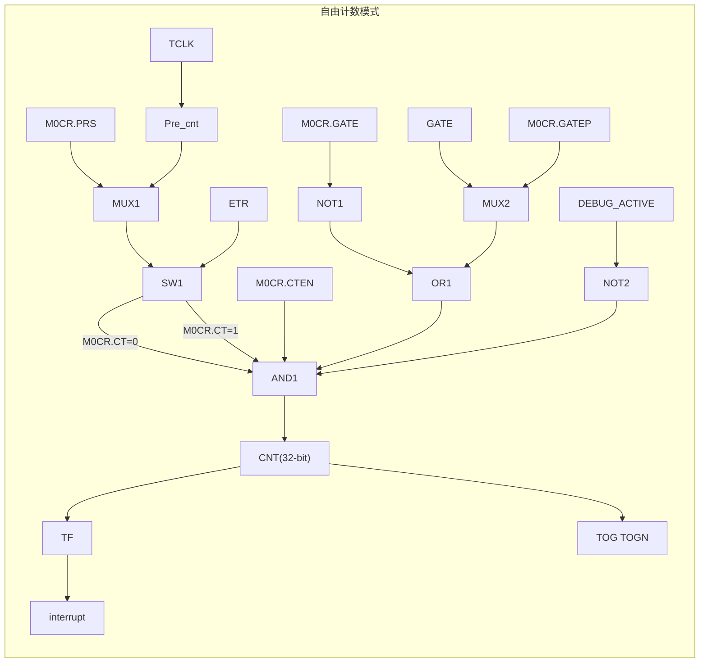

图 12-2 模式 0 计数定时器自由计数框图

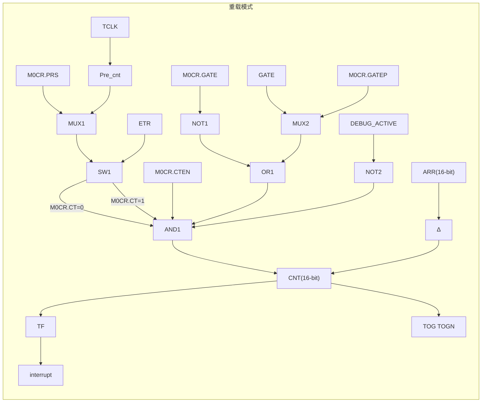

图 12-3 模式 0 计数定时器重载计数框图

# 计数波形


<table>
  <thead>
    <tr>
        <th>Signal</th>
        <th>Value/State</th>
    </tr>
  </thead>
  <tbody>
    <tr>
        <td>CNT[15:0]</td>
        <td>0xFFFF</td>
    </tr>
    <tr>
        <td>CNT[15:0]</td>
        <td>ARR</td>
    </tr>
    <tr>
        <td>CNT[15:0]</td>
        <td>0x0000</td>
    </tr>
    <tr>
        <td>CTEN</td>
        <td>High/Low</td>
    </tr>
  </tbody>
</table>
图 12-4 模式 0 计数定时器 16 位重载计数波形


<table>
  <thead>
    <tr>
        <th>Signal</th>
        <th>Value/State</th>
    </tr>
  </thead>
  <tbody>
    <tr>
        <td>CNT32[31:0]</td>
        <td>0xFFFFFFFF</td>
    </tr>
    <tr>
        <td>CNT32[31:0]</td>
        <td>0x00000000</td>
    </tr>
    <tr>
        <td>CTEN</td>
        <td>High/Low</td>
    </tr>
  </tbody>
</table>
图 12-5 模式 0 计数定时器 32 位自由计数波形

# 计数功能

计数功能用于测定某个事件发生的次数。在计数功能中，计数器在每个相应的输入时钟的下降沿累加一次。输入信号被内部的 TCLK 采样，因此外部输入时钟频率不能超过系统的 TCLK 时钟。计数到最大值会溢出并且产生中断。中断标志需要软件清除。

# 定时功能

定时功能用于产生间隔定时。在定时功能中，定时器有预除频，定时器在每个预除频的一个时钟累加一次，计数到最大值会溢出并且产生中断。中断标志需要软件清除。

# 时序图

自由计数(max=0xFFFFFFFF)


图 12-6 模式 0 计数定时器自由计数时序图

重载计数(max=0xFFFF)


图 12-7 模式 0 计数定时器重载计数时序图（预分频设置为 2）

### Buzzer 功能

通过定时器的翻转输出功能可以实现驱动 Buzzer 的功能。使用 toggle 输出需要使能 DTR.MOE 控制位。设置 M0CR.TOGEN 为 0 可以同时设置端口 CHA、CHB 输出为 0。在计数时钟为 4MHz 情况下 Buzzer 输出不同频率的 timer 重载模式配置如下：


<table>
  <thead>
    <tr>
        <th>Buzzer 频率</th>
        <th>计数器周期</th>
        <th>计数器计数值</th>
        <th>计数器重载值</th>
        <th>CNT 初始值</th>
        <th>ARR 重载值</th>
    </tr>
  </thead>
  <tbody>
    <tr>
        <td>1000Hz</td>
        <td>0.5ms</td>
        <td>2000</td>
        <td>63536</td>
        <td>0xF830</td>
        <td>0xF830</td>
    </tr>
    <tr>
        <td>2000Hz</td>
        <td>0.25ms</td>
        <td>1000</td>
        <td>64536</td>
        <td>0xFC18</td>
        <td>0xFC18</td>
    </tr>
    <tr>
        <td>4000Hz</td>
        <td>0.125ms</td>
        <td>500</td>
        <td>65036</td>
        <td>0xFE0C</td>
        <td>0xFE0C</td>
    </tr>
  </tbody>
</table>

### 12.3.5 模式 1 脉宽测量 PWC

这种模式下可以自动测量输入脉冲的高电平低电平或者周期宽度。

第一个有效边沿计数器初始化为 0x0001，第二个有效边沿将停止计数，并将当前计数值存入 CCR0A，并且产生捕获中断 CA0F，如果计数器发生溢出，会产生溢出标志。设置溢出中断使能会产生溢出中断。


<table>
  <thead>
    <tr>
        <th>M1CR.EDG1ST</th>
        <th>0</th>
        <th>0</th>
        <th>1</th>
        <th>1</th>
    </tr>
    <tr>
        <th>M1CR.EDG2ND</th>
        <th>0</th>
        <th>1</th>
        <th>0</th>
        <th>1</th>
    </tr>
    <tr>
        <th>脉宽测量</th>
        <th>上沿~上沿<br/>周期宽度</th>
        <th>上沿~下沿<br/>高电平宽度</th>
        <th>下沿~上沿<br/>低电平宽度</th>
        <th>下沿~下沿<br/>周期宽度</th>
    </tr>
  </thead>
</table>

周期测量时，会间隔一个周期测量一个周期。

#### PWC 功能框图


图 12-8 模式 1 脉宽测量 PWC 功能框图

通过寄存 MSCR.TS 选择测量信号源。


<table>
  <thead>
    <tr>
        <th>触发选择</th>
        <th>取值</th>
        <th>信号源</th>
    </tr>
  </thead>
  <tbody>
    <tr>
        <td rowspan="8">MSCR.TS</td>
        <td>0b000</td>
        <td>ETFP：ETR 外部输入滤波后的相位选择信号，可选择外部滤波与输入反向</td>
    </tr>
    <tr>
        <td>0b001</td>
        <td>ITR0：Timer 内部互联信号 0，其他 timer 的 TRGO 输出</td>
    </tr>
    <tr>
        <td>0b010</td>
        <td>ITR1：Timer 内部互联信号 1，其他 timer 的 TRGO 输出</td>
    </tr>
    <tr>
        <td>0b011</td>
        <td>ITR2：Timer 内部互联信号 2，其他 timer 的 TRGO 输出</td>
    </tr>
    <tr>
        <td>0b100</td>
        <td>ITR3：Timer 内部互联信号 3，其他 timer 的 TRGO 输出</td>
    </tr>
    <tr>
        <td>0b101</td>
        <td>IA0ED：无效</td>
    </tr>
    <tr>
        <td>0b110</td>
        <td>IAFP：CH0A 外部输入滤波后的相位选择信号，可选择外部滤波与输入反向（极性选择在脉宽测量模式下无效）</td>
    </tr>
    <tr>
        <td>0b111</td>
        <td>IBFP：CH0B 外部输入滤波后的相位选择信号，可选择外部滤波与输入反向（极性选择在脉宽测量模式下无效）</td>
    </tr>
  </tbody>
</table>

关于 TRGO 输出请参见寄存器 MSCR 描述。


<table>
  <thead>
    <tr>
        <th>定时器</th>
        <th>ITR0</th>
        <th>ITR1</th>
        <th>ITR2</th>
        <th>ITR3</th>
    </tr>
  </thead>
  <tbody>
    <tr>
        <td>ATIM3</td>
        <td>-</td>
        <td>-</td>
        <td>GTIM_OV</td>
        <td>-</td>
    </tr>
  </tbody>
</table>

PWC 波形测量时序图


<table>
  <tbody>
    <tr>
        <td>Series</td>
        <td>T0</td>
        <td>T1</td>
        <td>T2</td>
        <td>T3</td>
        <td>T4</td>
        <td>T5</td>
    </tr>
    <tr>
        <td>CNT[15:0]</td>
        <td>0x0001</td>
        <td>0x0001</td>
        <td>0xFFFF</td>
        <td>0x0001</td>
        <td>0x0001</td>
        <td>0x8000</td>
    </tr>
    <tr>
        <td>CTEN</td>
        <td>Low</td>
        <td>High</td>
        <td>High</td>
        <td>High</td>
        <td>High</td>
        <td>High</td>
    </tr>
    <tr>
        <td>IN</td>
        <td>Low</td>
        <td>Low</td>
        <td>High</td>
        <td>Low</td>
        <td>Low</td>
        <td>High</td>
    </tr>
    <tr>
        <td>UIF</td>
        <td>Low</td>
        <td>Low</td>
        <td>Low</td>
        <td>High</td>
        <td>High</td>
        <td>High</td>
    </tr>
    <tr>
        <td>CA0F</td>
        <td>Low</td>
        <td>Low</td>
        <td>Low</td>
        <td>Low</td>
        <td>High</td>
        <td>High</td>
    </tr>
  </tbody>
</table>
图 12-9 模式 1 脉宽测量 PWC 高电平脉冲宽度测量

<table>
  <thead>
    <tr>
        <th>Time Point</th>
        <th>CNT[15:0]</th>
        <th>CTEN</th>
        <th>IN</th>
        <th>UIF</th>
        <th>CA0F</th>
    </tr>
  </thead>
  <tbody>
    <tr>
        <td>Start</td>
        <td>0x0001</td>
        <td>Low</td>
        <td>High</td>
        <td>Low</td>
        <td>Low</td>
    </tr>
    <tr>
        <td>CTEN High</td>
        <td>0x0001</td>
        <td>High</td>
        <td>High</td>
        <td>Low</td>
        <td>Low</td>
    </tr>
    <tr>
        <td>1st Falling Edge</td>
        <td>Ramp Start</td>
        <td>High</td>
        <td>Low</td>
        <td>Low</td>
        <td>Low</td>
    </tr>
    <tr>
        <td>Ramp Peak</td>
        <td>0xFFFF</td>
        <td>High</td>
        <td>Low</td>
        <td>Low</td>
        <td>Low</td>
    </tr>
    <tr>
        <td>Overflow/Reset</td>
        <td>0x0001</td>
        <td>High</td>
        <td>Low</td>
        <td>High</td>
        <td>Low</td>
    </tr>
    <tr>
        <td>2nd Falling Edge</td>
        <td>Capture</td>
        <td>High</td>
        <td>Low</td>
        <td>High</td>
        <td>High</td>
    </tr>
    <tr>
        <td>End</td>
        <td>Hold</td>
        <td>High</td>
        <td>High</td>
        <td>High</td>
        <td>High</td>
    </tr>
  </tbody>
</table>
图 12-10 模式 1 脉宽测量 PWC 下降沿到下降沿周期测量


<table>
  <thead>
    <tr>
        <th>Time Point</th>
        <th>CNT[15:0]</th>
        <th>CTEN</th>
        <th>IN</th>
        <th>UIF</th>
        <th>CA0F</th>
    </tr>
  </thead>
  <tbody>
    <tr>
        <td>Start</td>
        <td>0x0001</td>
        <td>Low</td>
        <td>Low</td>
        <td>Low</td>
        <td>Low</td>
    </tr>
    <tr>
        <td>CTEN High</td>
        <td>0x0001</td>
        <td>High</td>
        <td>Low</td>
        <td>Low</td>
        <td>Low</td>
    </tr>
    <tr>
        <td>1st Rising Edge</td>
        <td>Ramp Start</td>
        <td>High</td>
        <td>High</td>
        <td>Low</td>
        <td>Low</td>
    </tr>
    <tr>
        <td>Ramp Peak 1</td>
        <td>0xFFFF</td>
        <td>High</td>
        <td>High</td>
        <td>Low</td>
        <td>Low</td>
    </tr>
    <tr>
        <td>Overflow 1</td>
        <td>0x0001</td>
        <td>High</td>
        <td>High</td>
        <td>High</td>
        <td>Low</td>
    </tr>
    <tr>
        <td>2nd Rising Edge</td>
        <td>Capture</td>
        <td>High</td>
        <td>High</td>
        <td>High</td>
        <td>High</td>
    </tr>
    <tr>
        <td>Ramp Peak 2</td>
        <td>0xFFFF</td>
        <td>High</td>
        <td>High</td>
        <td>High</td>
        <td>High</td>
    </tr>
    <tr>
        <td>Overflow 2</td>
        <td>0x0001</td>
        <td>High</td>
        <td>High</td>
        <td>High</td>
        <td>High</td>
    </tr>
  </tbody>
</table>
图 12-11 模式 1 脉宽测量 PWC 上升沿到上升沿周期测量

## PWC 单次触发模式

设置 M1CR.ONESHOT=1 可以设置 PWC 单次测量，测量完成后 CTEN 将被清除。


<table>
  <thead>
    <tr>
        <th>Time Point</th>
        <th>CNT[15:0]</th>
        <th>CTEN</th>
        <th>IN</th>
        <th>UIF</th>
        <th>CA0F</th>
    </tr>
  </thead>
  <tbody>
    <tr>
        <td>Start</td>
        <td>0x0001</td>
        <td>Low</td>
        <td>Low</td>
        <td>Low</td>
        <td>Low</td>
    </tr>
    <tr>
        <td>CTEN High</td>
        <td>0x0001</td>
        <td>High</td>
        <td>Low</td>
        <td>Low</td>
        <td>Low</td>
    </tr>
    <tr>
        <td>1st Rising Edge</td>
        <td>Ramp Start</td>
        <td>High</td>
        <td>High</td>
        <td>Low</td>
        <td>Low</td>
    </tr>
    <tr>
        <td>Ramp Peak</td>
        <td>0xFFFF</td>
        <td>High</td>
        <td>High</td>
        <td>Low</td>
        <td>Low</td>
    </tr>
    <tr>
        <td>Overflow</td>
        <td>0x0001</td>
        <td>High</td>
        <td>High</td>
        <td>High</td>
        <td>Low</td>
    </tr>
    <tr>
        <td>2nd Rising Edge</td>
        <td>Capture</td>
        <td>Low</td>
        <td>High</td>
        <td>High</td>
        <td>High</td>
    </tr>
    <tr>
        <td>End</td>
        <td>Hold</td>
        <td>Low</td>
        <td>Low</td>
        <td>High</td>
        <td>High</td>
    </tr>
  </tbody>
</table>
图 12-12 模式 1 脉宽测量 PWC 上升沿到上升沿周期测量单次模式

# 12.3.6 模式 2/3 比较捕获模式

## 12.3.6.1 计数器

计数器主要部分是一个 16 位计数器与相关的自动装载寄存器。这个计数器可以向上计数（模式 2），向下计数（模式 2）或向上向下双向计数（模式 3）。计数器的时钟可以由预分频器 PRS 分频得到，也可以选择 ETR 输入外部时钟或者通过 MSCR.TS 选择的外部输入信号和内部互联信号。

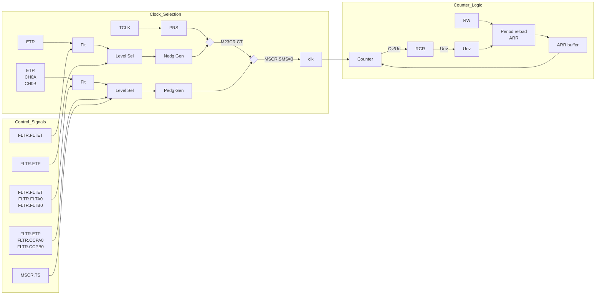

图 12-13 模式 2/3 比较捕获模式计数器框图

计数器基本单元包括：

* 计数器寄存器 CNT
* 预分频寄存器 M23CR.PRS
* 自动装载寄存器 ARR
* 重复次数寄存器 RCR
* 时钟选择控制寄存器 FLTR、M23CR、MSCR

自动装载寄存器具有缓存功能，计数器产生事件更新后重载值从缓存寄存器更新到计数器。当计数器停止状态或者缓存功能关闭状态，自动装载寄存器立刻更新到缓存寄存器。当定时器处于运行状态并行缓存功能有效时，写入到自动装载寄存器的值不会立刻更新到缓存寄存器，当事件更新后才有自动装载寄存器更新到缓存寄存器。

时钟选择及门控功能，触发功能，复位功能请参见模式 2/3 从模式章节相关描述。

## 12.3.6.2 计数器波形

### 模式 2 锯齿波计数波形

模式 2 为锯齿波计数波形，通过设置 M23CR.DIR 可以更改计数方向。

设置 M23CR.DIR 为 0 时，计数器为递增计数模式，这种模式下，计数器从 0 计数到自动重载值（ATIM3_ARR），然后重新从 0 开始计数并生成计数器上溢事件。如果使用重复计数器，则当递增计数的重复次数达到重复计数器寄存器中编程的次数加一次（ATIM3_RCR+1）后，将生成更新事件（UEV）。否则，将在每次计数器上溢时产生更新事件。

将 M23CR.UG 位置 1（通过软件或使用从模式控制器）时，也将产生更新事件。

发生更新事件时，将更新所有寄存器且将更新标志（ATIM3_IFR 寄存器中的 UIF 位）置 1（取决于 M23CR.URS 位）：

* 自动重载缓存值将以 ARR 寄存器值进行更新
* 比较缓存值将以比较寄存器 CCRxy 进行更新

以下几张图为 ARR=0x2C 时不同计数方向的计数器波形，计数溢出周期时钟个数为 ARR+1。


<table>
  <thead>
    <tr>
        <th>Signal</th>
        <th>T1</th>
        <th>T2</th>
        <th>T3</th>
        <th>T4</th>
        <th>T5</th>
        <th>T6</th>
        <th>T7</th>
        <th>T8</th>
        <th>T9</th>
        <th>T10</th>
        <th>T11</th>
    </tr>
  </thead>
  <tbody>
    <tr>
        <td>clk</td>
        <td>Pulse</td>
        <td>Pulse</td>
        <td>Pulse</td>
        <td>Pulse</td>
        <td>Pulse</td>
        <td>Pulse</td>
        <td>Pulse</td>
        <td>Pulse</td>
        <td>Pulse</td>
        <td>Pulse</td>
        <td>Pulse</td>
    </tr>
    <tr>
        <td>cten</td>
        <td>High</td>
        <td>High</td>
        <td>High</td>
        <td>High</td>
        <td>High</td>
        <td>High</td>
        <td>High</td>
        <td>High</td>
        <td>High</td>
        <td>High</td>
        <td>High</td>
    </tr>
    <tr>
        <td>count</td>
        <td>29</td>
        <td>2A</td>
        <td>2B</td>
        <td>2C</td>
        <td>0</td>
        <td>1</td>
        <td>2</td>
        <td>3</td>
        <td>4</td>
        <td>5</td>
        <td> </td>
    </tr>
    <tr>
        <td>overflow</td>
        <td>Low</td>
        <td>Low</td>
        <td>Low</td>
        <td>High</td>
        <td>Low</td>
        <td>Low</td>
        <td>Low</td>
        <td>Low</td>
        <td>Low</td>
        <td>Low</td>
        <td>Low</td>
    </tr>
    <tr>
        <td>uev</td>
        <td>Low</td>
        <td>Low</td>
        <td>Low</td>
        <td>High</td>
        <td>Low</td>
        <td>Low</td>
        <td>Low</td>
        <td>Low</td>
        <td>Low</td>
        <td>Low</td>
        <td>Low</td>
    </tr>
    <tr>
        <td>UIF</td>
        <td>Low</td>
        <td>Low</td>
        <td>Low</td>
        <td>Low</td>
        <td>High</td>
        <td>High</td>
        <td>High</td>
        <td>High</td>
        <td>High</td>
        <td>High</td>
        <td>High</td>
    </tr>
  </tbody>
</table>
图 12-14 模式 2 比较捕获模式无预分频的向上计数


<table>
  <thead>
    <tr>
        <th>Signal</th>
        <th>T1</th>
        <th>T2</th>
        <th>T3</th>
        <th>T4</th>
        <th>T5</th>
        <th>T6</th>
        <th>T7</th>
        <th>T8</th>
        <th>T9</th>
    </tr>
  </thead>
  <tbody>
    <tr>
        <td>clk</td>
        <td>Pulse</td>
        <td>Pulse</td>
        <td>Pulse</td>
        <td>Pulse</td>
        <td>Pulse</td>
        <td>Pulse</td>
        <td>Pulse</td>
        <td>Pulse</td>
        <td>Pulse</td>
    </tr>
    <tr>
        <td>cten</td>
        <td>High</td>
        <td>High</td>
        <td>High</td>
        <td>High</td>
        <td>High</td>
        <td>High</td>
        <td>High</td>
        <td>High</td>
        <td>High</td>
    </tr>
    <tr>
        <td>count</td>
        <td>2A</td>
        <td> </td>
        <td>2B</td>
        <td> </td>
        <td>2C</td>
        <td> </td>
        <td>0</td>
        <td> </td>
        <td>1</td>
    </tr>
    <tr>
        <td>overflow</td>
        <td>Low</td>
        <td>Low</td>
        <td>Low</td>
        <td>Low</td>
        <td>High</td>
        <td>High</td>
        <td>Low</td>
        <td>Low</td>
        <td>Low</td>
    </tr>
    <tr>
        <td>uev</td>
        <td>Low</td>
        <td>Low</td>
        <td>Low</td>
        <td>Low</td>
        <td>High</td>
        <td>High</td>
        <td>Low</td>
        <td>Low</td>
        <td>Low</td>
    </tr>
    <tr>
        <td>UIF</td>
        <td>Low</td>
        <td>Low</td>
        <td>Low</td>
        <td>Low</td>
        <td>Low</td>
        <td>Low</td>
        <td>High</td>
        <td>High</td>
        <td>High</td>
    </tr>
  </tbody>
</table>
图 12-15 模式 2 比较捕获模式带预分频的向上计数


<table>
  <thead>
    <tr>
        <th>Signal</th>
        <th>T1</th>
        <th>T2</th>
        <th>T3</th>
        <th>T4</th>
        <th>T5</th>
        <th>T6</th>
        <th>T7</th>
        <th>T8</th>
        <th>T9</th>
        <th>T10</th>
        <th>T11</th>
    </tr>
  </thead>
  <tbody>
    <tr>
        <td>clk</td>
        <td>Pulse</td>
        <td>Pulse</td>
        <td>Pulse</td>
        <td>Pulse</td>
        <td>Pulse</td>
        <td>Pulse</td>
        <td>Pulse</td>
        <td>Pulse</td>
        <td>Pulse</td>
        <td>Pulse</td>
        <td>Pulse</td>
    </tr>
    <tr>
        <td>cten</td>
        <td>High</td>
        <td>High</td>
        <td>High</td>
        <td>High</td>
        <td>High</td>
        <td>High</td>
        <td>High</td>
        <td>High</td>
        <td>High</td>
        <td>High</td>
        <td>High</td>
    </tr>
    <tr>
        <td>count</td>
        <td>3</td>
        <td>2</td>
        <td>1</td>
        <td>0</td>
        <td>2C</td>
        <td>2B</td>
        <td>2A</td>
        <td>29</td>
        <td>28</td>
        <td>27</td>
        <td> </td>
    </tr>
    <tr>
        <td>underflow</td>
        <td>Low</td>
        <td>Low</td>
        <td>Low</td>
        <td>High</td>
        <td>Low</td>
        <td>Low</td>
        <td>Low</td>
        <td>Low</td>
        <td>Low</td>
        <td>Low</td>
        <td>Low</td>
    </tr>
    <tr>
        <td>uev</td>
        <td>Low</td>
        <td>Low</td>
        <td>Low</td>
        <td>High</td>
        <td>Low</td>
        <td>Low</td>
        <td>Low</td>
        <td>Low</td>
        <td>Low</td>
        <td>Low</td>
        <td>Low</td>
    </tr>
    <tr>
        <td>UIF</td>
        <td>Low</td>
        <td>Low</td>
        <td>Low</td>
        <td>Low</td>
        <td>High</td>
        <td>High</td>
        <td>High</td>
        <td>High</td>
        <td>High</td>
        <td>High</td>
        <td>High</td>
    </tr>
  </tbody>
</table>
图 12-16 模式 2 比较捕获模式无预分频的向下计数


<table>
  <thead>
    <tr>
        <th>Signal</th>
        <th>T1</th>
        <th>T2</th>
        <th>T3</th>
        <th>T4</th>
        <th>T5</th>
        <th>T6</th>
        <th>T7</th>
        <th>T8</th>
        <th>T9</th>
    </tr>
  </thead>
  <tbody>
    <tr>
        <td>clk</td>
        <td>Pulse</td>
        <td>Pulse</td>
        <td>Pulse</td>
        <td>Pulse</td>
        <td>Pulse</td>
        <td>Pulse</td>
        <td>Pulse</td>
        <td>Pulse</td>
        <td>Pulse</td>
    </tr>
    <tr>
        <td>cten</td>
        <td>High</td>
        <td>High</td>
        <td>High</td>
        <td>High</td>
        <td>High</td>
        <td>High</td>
        <td>High</td>
        <td>High</td>
        <td>High</td>
    </tr>
    <tr>
        <td>count</td>
        <td>2</td>
        <td> </td>
        <td>1</td>
        <td> </td>
        <td>0</td>
        <td> </td>
        <td>2C</td>
        <td> </td>
        <td>2B</td>
    </tr>
    <tr>
        <td>underflow</td>
        <td>Low</td>
        <td>Low</td>
        <td>Low</td>
        <td>Low</td>
        <td>High</td>
        <td>High</td>
        <td>Low</td>
        <td>Low</td>
        <td>Low</td>
    </tr>
    <tr>
        <td>uev</td>
        <td>Low</td>
        <td>Low</td>
        <td>Low</td>
        <td>Low</td>
        <td>High</td>
        <td>High</td>
        <td>Low</td>
        <td>Low</td>
        <td>Low</td>
    </tr>
    <tr>
        <td>UIF</td>
        <td>Low</td>
        <td>Low</td>
        <td>Low</td>
        <td>Low</td>
        <td>Low</td>
        <td>Low</td>
        <td>High</td>
        <td>High</td>
        <td>High</td>
    </tr>
  </tbody>
</table>
图 12-17 模式 2 比较捕获模式带预分频的向下计数

模式 2 的计数波形如下图所示：


图 12-18 模式 2 边沿对齐计时器波形(M23CR.DIR=0)


图 12-19 模式 2 边沿对齐计时器波形(M23CR.DIR=1)

## 模式 3 三角波计数波形

模式 3 为三角波计数波形，计数方向控制位只读，不可以更改计数方向。

中心对齐（三角波）模式下 M23CR.DIR 方向位是只读的，写值无效。从其他模式切换到中心对齐模式 DIR 自动清 0。软件事件更新和从模式外部触发复位模式 DIR 自动清零。


图 12-20 模式 3 比较捕获模式带预分频的上下计数

模式 3 的计数波形如下图所示：


图 12-21 模式 3 中心对齐计数器波形

### 12.3.6.3 重复计数

重复计数器使用计数器的溢出进行向下计数。计数到 0 时，即计数器发生重复寄存器设置的值加一次溢出时。当缓存寄存器使能时，周期重载寄存器更新到周期缓存寄存器。比较模式下比较寄存器的值更新到比较缓存寄存器中。

重复计数器在下面条件成立时递减：

* 上计数模式下每次计数器溢出时
* 下计数模式下每次计数器下溢时
* 三角波模式下每次上溢出和每次下溢出时


图 12-22 重复计数器产生更新时序（RCR.OV=0，RCR.UND=0）

RCR.OV 为重复计数控制上溢屏蔽功能位，如果 RCR.OV 为 1，则在执行重复计数时候，会忽略上溢事件。


图 12-23 上溢屏蔽时候重复计数器产生更新时序（RCR.OV=1，RCR.UND=0）

RCR.UND 为重复计数控制下溢屏蔽功能位，如果 RCR.UND 为 1，则在执行重复计数时候，会忽略下溢事件。


图 12-24 下溢屏蔽时候重复计数器产生更新时序（RCR.OV=0，RCR.UND=1）

除了上下溢出通过重复计数器可以产生事件更新 UEV 外，还可以通过写寄存器 M23CR.UG 产生软件及从模式复位事件更新 UEV；这时需要配置 M23CR.URS。

### 12.3.6.4 数据缓存

自动重载数据 ARR 与比较寄存器 CCRxy 都可以配置缓存功能，当缓存功能有效时，当发生 UEV 事件更新时，写入的周期值 ARR 与比较值 CCRxy 才会生效。

自动重载值在不同计数模式下的更新时序图如下：


<table>
  <thead>
    <tr>
        <th>Time Point</th>
        <th>CTEN</th>
        <th>UEV</th>
        <th>ARR</th>
        <th>ARRBUF</th>
    </tr>
  </thead>
  <tbody>
    <tr>
        <td>T1</td>
        <td>High</td>
        <td>Low</td>
        <td>0x800</td>
        <td>0x800</td>
    </tr>
    <tr>
        <td>T2 (Update)</td>
        <td>High</td>
        <td>Pulse</td>
        <td>0xA00</td>
        <td>0x800</td>
    </tr>
    <tr>
        <td>T3 (Update)</td>
        <td>High</td>
        <td>Pulse</td>
        <td>0x600</td>
        <td>0xA00</td>
    </tr>
    <tr>
        <td>T4 (Update)</td>
        <td>High</td>
        <td>Pulse</td>
        <td> </td>
        <td>0x600</td>
    </tr>
  </tbody>
</table>

图 12-25 模式 3 三角波模式缓存使能


<table>
  <thead>
    <tr>
        <th>Time Point</th>
        <th>CTEN</th>
        <th>UEV</th>
        <th>ARR</th>
        <th>ARRBUF</th>
    </tr>
  </thead>
  <tbody>
    <tr>
        <td>T1</td>
        <td>High</td>
        <td>Low</td>
        <td>0x800</td>
        <td>0x800</td>
    </tr>
    <tr>
        <td>T2 (Write)</td>
        <td>High</td>
        <td>Low</td>
        <td>0xA00</td>
        <td>0xA00</td>
    </tr>
    <tr>
        <td>T3 (Update)</td>
        <td>High</td>
        <td>Pulse</td>
        <td>0xA00</td>
        <td>0xA00</td>
    </tr>
    <tr>
        <td>T4 (Write)</td>
        <td>High</td>
        <td>Low</td>
        <td>0x600</td>
        <td>0x600</td>
    </tr>
  </tbody>
</table>

图 12-26 模式 3 三角波模式缓存无效

<page_header>
12 高级定时器（ATIM3）
</page_header>


<table>
  <thead>
    <tr>
        <th>Time Point</th>
        <th>Counter</th>
        <th>CTEN</th>
        <th>UEV</th>
        <th>ARR</th>
        <th>ARRBUF</th>
    </tr>
  </thead>
  <tbody>
    <tr>
        <td>T1</td>
        <td>0x800</td>
        <td>High</td>
        <td>Pulse</td>
        <td>0x800</td>
        <td>0x800</td>
    </tr>
    <tr>
        <td>T2</td>
        <td>0xA00</td>
        <td>High</td>
        <td>Pulse</td>
        <td>0xA00</td>
        <td>0xA00</td>
    </tr>
    <tr>
        <td>T3</td>
        <td>0x600</td>
        <td>High</td>
        <td>Pulse</td>
        <td>0x600</td>
        <td>0x600</td>
    </tr>
  </tbody>
</table>

图 12-27 模式 2 锯齿波模式上计数缓存使能


<table>
  <thead>
    <tr>
        <th>Time Point</th>
        <th>Counter</th>
        <th>CTEN</th>
        <th>UEV</th>
        <th>ARR</th>
        <th>ARRBUF</th>
    </tr>
  </thead>
  <tbody>
    <tr>
        <td>T1</td>
        <td>0x800</td>
        <td>High</td>
        <td>Pulse</td>
        <td>0x800</td>
        <td>0x800</td>
    </tr>
    <tr>
        <td>T2</td>
        <td>0xA00</td>
        <td>High</td>
        <td>Pulse</td>
        <td>0xA00</td>
        <td>0xA00</td>
    </tr>
    <tr>
        <td>T3</td>
        <td>0x600</td>
        <td>High</td>
        <td>Pulse</td>
        <td>0x600</td>
        <td>0x600</td>
    </tr>
  </tbody>
</table>

图 12-28 模式 2 锯齿波模式上计数缓存无效


<table>
  <thead>
    <tr>
        <th>Time Point</th>
        <th>Counter</th>
        <th>CTEN</th>
        <th>UEV</th>
        <th>ARR</th>
        <th>ARRBUF</th>
    </tr>
  </thead>
  <tbody>
    <tr>
        <td>T1</td>
        <td>0x800</td>
        <td>High</td>
        <td>Pulse</td>
        <td>0x800</td>
        <td>0x800</td>
    </tr>
    <tr>
        <td>T2</td>
        <td>0xA00</td>
        <td>High</td>
        <td>Pulse</td>
        <td>0xA00</td>
        <td>0xA00</td>
    </tr>
    <tr>
        <td>T3</td>
        <td>0x600</td>
        <td>High</td>
        <td>Pulse</td>
        <td>0x600</td>
        <td>0x600</td>
    </tr>
  </tbody>
</table>

图 12-29 模式 2 锯齿波模式下计数缓存使能


<page_footer>
143
</page_footer>

<table>
  <thead>
    <tr>
        <th>Signal</th>
        <th>Period 1</th>
        <th>Period 2</th>
        <th>Period 3</th>
    </tr>
  </thead>
  <tbody>
    <tr>
        <td>Counter</td>
        <td>0x800 -&gt; 0</td>
        <td>0xA00 -&gt; 0</td>
        <td>0x600 -&gt; 0</td>
    </tr>
    <tr>
        <td>CTEN</td>
        <td>High</td>
        <td>High</td>
        <td>High</td>
    </tr>
    <tr>
        <td>UEV</td>
        <td>Pulse at 0</td>
        <td>Pulse at 0</td>
        <td>Pulse at 0</td>
    </tr>
    <tr>
        <td>ARR</td>
        <td>0x800</td>
        <td>0xA00</td>
        <td>0x600</td>
    </tr>
    <tr>
        <td>ARRBUF</td>
        <td>0x800</td>
        <td>0xA00</td>
        <td>0x600</td>
    </tr>
  </tbody>
</table>
图 12-30 模式 2 锯齿波模式下计数缓存无效

###  说明

在三角波模式与锯齿波上计数模式时，如果缓存不使能，更改的 ARR 时，当前计数器的值要小于要更改的 ARR 周期值，否则当前周期会计数到 0xFFFF。

比较缓存与周期缓存更新状态一致，这里不一一列出时序图。


<table>
  <thead>
    <tr>
        <th>Signal</th>
        <th>Period 1</th>
        <th>Period 2</th>
        <th>Period 3</th>
    </tr>
  </thead>
  <tbody>
    <tr>
        <td>Counter</td>
        <td>0x800 -&gt; 0</td>
        <td>0x800 -&gt; 0</td>
        <td>0x800 -&gt; 0</td>
    </tr>
    <tr>
        <td>CTEN</td>
        <td>High</td>
        <td>High</td>
        <td>High</td>
    </tr>
    <tr>
        <td>UEV</td>
        <td>Pulse at 0</td>
        <td>Pulse at 0</td>
        <td>Pulse at 0</td>
    </tr>
    <tr>
        <td>ARR</td>
        <td>0x800</td>
        <td>0x800</td>
        <td>0x800</td>
    </tr>
    <tr>
        <td>CCR</td>
        <td>0x600</td>
        <td>0x400</td>
        <td>0x600</td>
    </tr>
    <tr>
        <td>CCRBUF</td>
        <td>0x600</td>
        <td>0x400</td>
        <td>0x600</td>
    </tr>
    <tr>
        <td>OCREF</td>
        <td>High (when Counter &gt; CCR)</td>
        <td>High (when Counter &gt; CCR)</td>
        <td>High (when Counter &gt; CCR)</td>
    </tr>
  </tbody>
</table>
图 12-31 模式 2 锯齿波模式下计数比较缓存使能

#### 12.3.6.5 比较输出 OCREF

比较输出 OCREFA 可以配置为单点比较，使用比较寄存器 CCRA 控制 OCREFA 的输出；OCREFA 的比较输出也可以配置为双点比较，使用比较寄存器 CCRA、CCRB 一起控制 OCREFA 的比较输出。

OCREFB 的比较输出只能使用单点比较，使用比较寄存器 CCRB 控制 OCREFB 的比较输出。

<page_header>
12 高级定时器 (ATIM3)
</page_header>


图 12-32 OCREF 输出框图

OCREF 输出使用 ATIM3_FLTR.OCMyx 选择：

*   **0b000**: 强制为 0
*   **0b001**: 强制为 1
*   **0b010**: 比较匹配时强制为 0
*   **0b011**: 比较匹配时强制为 1
*   **0b100**: 比较匹配时翻转
*   **0b101**: 比较匹配时输出一个计数周期的高电平
*   **0b110**: PWM 模式 1

- 单点比较
上计数时 CNT<CCRxy 输出为高电平，下计数时 CNT>CCRxy 输出为低电平
- 双点比较
- 锯齿波上计数 CCRxA<CNT≤CCRxB 输出为低电平
- 锯齿波下计数 CCRxA<CNT≤CCRxB 输出为低电平
- 三角波上计数 CNT<CCRxA 输出为高电平，下计数 CNT>CCRxB 输出为低电平

*   **0b111**: PWM 模式 2

- 单点比较
上计数时 CNT<CCRxy 输出为低电平，下计数时 CNT>CCRxy 输出为高电平
- 双点比较
- 锯齿波上计数 CCRxA≤CNT<CCRxB 输出为高电平
- 锯齿波下计数 CCRxA≤CNT<CCRxB 输出为低电平
- 三角波上计数 CNT<CCRxA 输出为低电平，下计数 CNT>CCRxB 输出为高电平

###  说明

强制输出有高优先级，当强制输出有效时，互补输出控制无效。


<page_footer>
145
</page_footer>

<table>
  <thead>
    <tr>
        <th>Time Point</th>
        <th>CNT[15:0]</th>
        <th>OCREFA</th>
        <th>OCREFB</th>
    </tr>
  </thead>
  <tbody>
    <tr>
        <td>1</td>
        <td>0x0000</td>
        <td>Low</td>
        <td>Low</td>
    </tr>
    <tr>
        <td>2</td>
        <td>CCRA</td>
        <td>Low</td>
        <td>Low</td>
    </tr>
    <tr>
        <td>3</td>
        <td>CCRA+</td>
        <td>High</td>
        <td>Low</td>
    </tr>
    <tr>
        <td>4</td>
        <td>CCRB</td>
        <td>High</td>
        <td>Low</td>
    </tr>
    <tr>
        <td>5</td>
        <td>CCRB+</td>
        <td>High</td>
        <td>High</td>
    </tr>
    <tr>
        <td>6</td>
        <td>ARR</td>
        <td>High</td>
        <td>High</td>
    </tr>
    <tr>
        <td>7</td>
        <td>0x0000 (Reset)</td>
        <td>Low</td>
        <td>Low</td>
    </tr>
    <tr>
        <td>8</td>
        <td>CCRA</td>
        <td>Low</td>
        <td>Low</td>
    </tr>
    <tr>
        <td>9</td>
        <td>CCRA+</td>
        <td>High</td>
        <td>Low</td>
    </tr>
    <tr>
        <td>10</td>
        <td>CCRB</td>
        <td>High</td>
        <td>Low</td>
    </tr>
    <tr>
        <td>11</td>
        <td>CCRB+</td>
        <td>High</td>
        <td>High</td>
    </tr>
    <tr>
        <td>12</td>
        <td>ARR</td>
        <td>High</td>
        <td>High</td>
    </tr>
    <tr>
        <td>13</td>
        <td>0x0000 (Reset)</td>
        <td>Low</td>
        <td>Low</td>
    </tr>
  </tbody>
</table>
图 12-33 锯齿波计数单点比较 OCREF 输出波形（OCMyx=0b111）


<table>
  <thead>
    <tr>
        <th>Time Point</th>
        <th>CNT[15:0]</th>
        <th>OCREFA</th>
        <th>OCREFB</th>
    </tr>
  </thead>
  <tbody>
    <tr>
        <td>1</td>
        <td>0x0000</td>
        <td>Low</td>
        <td>Low</td>
    </tr>
    <tr>
        <td>2</td>
        <td>CCRA (Up)</td>
        <td>High</td>
        <td>Low</td>
    </tr>
    <tr>
        <td>3</td>
        <td>CCRB (Up)</td>
        <td>High</td>
        <td>High</td>
    </tr>
    <tr>
        <td>4</td>
        <td>ARR</td>
        <td>High</td>
        <td>High</td>
    </tr>
    <tr>
        <td>5</td>
        <td>CCRB (Down)</td>
        <td>High</td>
        <td>Low</td>
    </tr>
    <tr>
        <td>6</td>
        <td>CCRA (Down)</td>
        <td>Low</td>
        <td>Low</td>
    </tr>
    <tr>
        <td>7</td>
        <td>0x0000</td>
        <td>Low</td>
        <td>Low</td>
    </tr>
    <tr>
        <td>8</td>
        <td>CCRA (Up)</td>
        <td>High</td>
        <td>Low</td>
    </tr>
    <tr>
        <td>9</td>
        <td>CCRB (Up)</td>
        <td>High</td>
        <td>High</td>
    </tr>
    <tr>
        <td>10</td>
        <td>ARR</td>
        <td>High</td>
        <td>High</td>
    </tr>
    <tr>
        <td>11</td>
        <td>CCRB (Down)</td>
        <td>High</td>
        <td>Low</td>
    </tr>
    <tr>
        <td>12</td>
        <td>CCRA (Down)</td>
        <td>Low</td>
        <td>Low</td>
    </tr>
    <tr>
        <td>13</td>
        <td>0x0000</td>
        <td>Low</td>
        <td>Low</td>
    </tr>
    <tr>
        <td>14</td>
        <td>CCRA (Up)</td>
        <td>High</td>
        <td>Low</td>
    </tr>
    <tr>
        <td>15</td>
        <td>CCRB (Up)</td>
        <td>High</td>
        <td>High</td>
    </tr>
    <tr>
        <td>16</td>
        <td>ARR</td>
        <td>High</td>
        <td>High</td>
    </tr>
    <tr>
        <td>17</td>
        <td>CCRB (Down)</td>
        <td>High</td>
        <td>Low</td>
    </tr>
  </tbody>
</table>
图 12-34 三角波计数单点比较 OCREF 输出波形（OCMyx=0b111）


<table>
  <thead>
    <tr>
        <th>Time Point</th>
        <th>CNT[15:0]</th>
        <th>OCREFA</th>
        <th>OCREFB</th>
    </tr>
  </thead>
  <tbody>
    <tr>
        <td>1</td>
        <td>0x0000</td>
        <td>Low</td>
        <td>Low</td>
    </tr>
    <tr>
        <td>2</td>
        <td>CCRA</td>
        <td>High</td>
        <td>Low</td>
    </tr>
    <tr>
        <td>3</td>
        <td>CCRB</td>
        <td>Low</td>
        <td>High</td>
    </tr>
    <tr>
        <td>4</td>
        <td>ARR</td>
        <td>Low</td>
        <td>Low</td>
    </tr>
    <tr>
        <td>5</td>
        <td>0x0000 (Reset)</td>
        <td>Low</td>
        <td>Low</td>
    </tr>
    <tr>
        <td>6</td>
        <td>CCRA</td>
        <td>High</td>
        <td>Low</td>
    </tr>
    <tr>
        <td>7</td>
        <td>CCRB</td>
        <td>Low</td>
        <td>High</td>
    </tr>
    <tr>
        <td>8</td>
        <td>ARR</td>
        <td>Low</td>
        <td>Low</td>
    </tr>
    <tr>
        <td>9</td>
        <td>0x0000 (Reset)</td>
        <td>Low</td>
        <td>Low</td>
    </tr>
    <tr>
        <td>10</td>
        <td>CCRA</td>
        <td>High</td>
        <td>Low</td>
    </tr>
    <tr>
        <td>11</td>
        <td>CCRB</td>
        <td>Low</td>
        <td>High</td>
    </tr>
    <tr>
        <td>12</td>
        <td>ARR</td>
        <td>Low</td>
        <td>Low</td>
    </tr>
    <tr>
        <td>13</td>
        <td>0x0000 (Reset)</td>
        <td>Low</td>
        <td>Low</td>
    </tr>
  </tbody>
</table>
图 12-35 锯齿波计数双点比较 OCREF 输出（OCMyx=0b111）


<table>
  <thead>
    <tr>
        <th>Time Point</th>
        <th>CNT[15:0]</th>
        <th>OCREFA</th>
        <th>OCREFB</th>
    </tr>
  </thead>
  <tbody>
    <tr>
        <td>1</td>
        <td>0x0000</td>
        <td>Low</td>
        <td>Low</td>
    </tr>
    <tr>
        <td>2</td>
        <td>CCRA (Up)</td>
        <td>High</td>
        <td>Low</td>
    </tr>
    <tr>
        <td>3</td>
        <td>CCRB (Up)</td>
        <td>Low</td>
        <td>High</td>
    </tr>
    <tr>
        <td>4</td>
        <td>ARR</td>
        <td>Low</td>
        <td>Low</td>
    </tr>
    <tr>
        <td>5</td>
        <td>CCRB (Down)</td>
        <td>Low</td>
        <td>High</td>
    </tr>
    <tr>
        <td>6</td>
        <td>CCRA (Down)</td>
        <td>High</td>
        <td>Low</td>
    </tr>
    <tr>
        <td>7</td>
        <td>0x0000</td>
        <td>Low</td>
        <td>Low</td>
    </tr>
    <tr>
        <td>8</td>
        <td>CCRA (Up)</td>
        <td>High</td>
        <td>Low</td>
    </tr>
    <tr>
        <td>9</td>
        <td>CCRB (Up)</td>
        <td>Low</td>
        <td>High</td>
    </tr>
    <tr>
        <td>10</td>
        <td>ARR</td>
        <td>Low</td>
        <td>Low</td>
    </tr>
    <tr>
        <td>11</td>
        <td>CCRB (Down)</td>
        <td>Low</td>
        <td>High</td>
    </tr>
    <tr>
        <td>12</td>
        <td>CCRA (Down)</td>
        <td>High</td>
        <td>Low</td>
    </tr>
    <tr>
        <td>13</td>
        <td>0x0000</td>
        <td>Low</td>
        <td>Low</td>
    </tr>
    <tr>
        <td>14</td>
        <td>CCRA (Up)</td>
        <td>High</td>
        <td>Low</td>
    </tr>
    <tr>
        <td>15</td>
        <td>CCRB (Up)</td>
        <td>Low</td>
        <td>High</td>
    </tr>
    <tr>
        <td>16</td>
        <td>ARR</td>
        <td>Low</td>
        <td>Low</td>
    </tr>
    <tr>
        <td>17</td>
        <td>CCRB (Down)</td>
        <td>Low</td>
        <td>High</td>
    </tr>
  </tbody>
</table>
图 12-36 三角波计数双点比较 OCREF 输出（OCMyx=0b111）

### 12.3.6.6 独立 PWM 输出

由 OCREFA 控制 CHA 的输出，OCREFB 控制 CHB 的输出。通过 FLTR.CCPA、FLTR.CCPB 可以控制 CHA、CHB 输出的反向。

```mermaid
graph LR
    subgraph Input_A
        M23CR.OCCS_A[M23CR.OCCS] --> MUX_A1[MUX]
        REFCLR_A[REFCLR] --> MUX_A1
        ETFP_A[ETFP] --> MUX_A1
        
        CNT_CCRA1[CNT>CCRA] --> MUX_A2[MUX]
        CNT_CCRA2[CNT=CCRA] --> MUX_A2
        CNT_CCRB1[CNT>CCRB] --> MUX_A2
        CNT_CCRB2[CNT=CCRB] --> MUX_A2
        
        MUX_A1 --> OM_CTRL_A[Output mode ctrl]
        MUX_A2 --> OM_CTRL_A
        FLTR.OCMA --> OM_CTRL_A
    end

    subgraph Input_B
        M23CR.OCCS_B[M23CR.OCCS] --> MUX_B1[MUX]
        REFCLR_B[REFCLR] --> MUX_B1
        ETFP_B[ETFP] --> MUX_B1
        
        CNT_CCRB3[CNT>CCRB] --> MUX_B2[MUX]
        CNT_CCRB4[CNT=CCRB] --> MUX_B2
        
        MUX_B1 --> OM_CTRL_B[Output mode ctrl]
        MUX_B2 --> OM_CTRL_B
        FLTR.OCMB --> OM_CTRL_B
    end

    OM_CTRL_A -- OCREFA --> Logic_Box
    OM_CTRL_B -- OCREFB --> Logic_Box

    subgraph Logic_Box [ ]
        direction TB
        Comp_Dead[Comp& Dead-time generate]
        M23CR.PWM2S --- Comp_Dead
        
        ForceA --> MUX_L1[MUX]
        OCREFA --> MUX_L1
        Comp_Dead --> MUX_L1
        
        MUX_L1 --> MUX_L2[MUX]
        M23CR.COMP --> MUX_L2
        
        MUX_L2 --> MUX_L3[MUX]
        NOT_A[NOT] --- MUX_L3
        FLTR.CCPA --> MUX_L3
        
        MUX_L3 --> Brake_A[Brake ctrl] --> CHA

        ForceB --> MUX_L4[MUX]
        OCREFB --> MUX_L4
        Comp_Dead --> MUX_L4
        
        MUX_L4 --> MUX_L5[MUX]
        NOT_B[NOT] --- MUX_L5
        FLTR.CCPB --> MUX_L5
        
        MUX_L5 --> Brake_B[Brake ctrl] --> CHB
    end

    Note[OCMyx=0b000/0b001时为强制输出 (Forcex)<br/>(y=A/B,x=0/1/2)]
```

图 12-37 独立 PWM 输出框图

PWM 输出与 OCREF 关系如下图所示：


图 12-38 CCPy=0 时 PWM 输出波形

图 12-39 CCPy=1 时 PWM 输出波形

<page_header>
12 高级定时器 (ATIM3)
</page_header>

### 12.3.6.7 互补 PWM 输出

由 OCREFA 控制 CHA 的输出，OCREFA 同时控制 CHB 的输出。比较寄存器 CCRxB 可以作为专用比较控制 ADC 触发。

```mermaid
graph LR
    subgraph Input_A
        M23CR.OCCS_A[M23CR.OCCS] --> MUX_A1[MUX]
        REFCLR_A[REFCLR] --> MUX_A1
        ETFP_A[ETFP] --> MUX_A1
        MUX_A1 --> OM_CTRL_A[Output mode ctrl]
        CNT_GT_CCRA[CNT>CCRA] --> OM_CTRL_A
        CNT_EQ_CCRA[CNT=CCRA] --> OM_CTRL_A
        CNT_GT_CCRB_A[CNT>CCRB] --> OM_CTRL_A
        CNT_EQ_CCRB_A[CNT=CCRB] --> OM_CTRL_A
        FLTR.OCMA[FLTR.OCMA] --> OM_CTRL_A
        M23CR.PWM2S_A[M23CR.PWM2S] --> OM_CTRL_A
    end

    subgraph Input_B
        M23CR.OCCS_B[M23CR.OCCS] --> MUX_B1[MUX]
        REFCLR_B[REFCLR] --> MUX_B1
        ETFP_B[ETFP] --> MUX_B1
        MUX_B1 --> OM_CTRL_B[Output mode ctrl]
        CNT_GT_CCRB_B[CNT>CCRB] --> OM_CTRL_B
        CNT_EQ_CCRB_B[CNT=CCRB] --> OM_CTRL_B
        FLTR.OCMB[FLTR.OCMB] --> OM_CTRL_B
    end

    OM_CTRL_A -- OCREFA --> CDG[Comp& Dead-time generate]
    OM_CTRL_B -- OCREFB -.-> CDG

    subgraph Output_Logic
        CDG --> MUX_CHA1[MUX]
        ForceA[ForceA] --> MUX_CHA1
        MUX_CHA1 --> MUX_CHA2[MUX]
        M23CR.COMP --> MUX_CHA2
        MUX_CHA2 --> Logic_A{ }
        FLTR.CCPA[FLTR.CCPA] --> Logic_A
        Logic_A --> MUX_CHA3[MUX]
        MUX_CHA3 --> Brake_A[Brake ctrl]
        Brake_A --> CHA[CHA]

        CDG --> MUX_CHB1[MUX]
        ForceB[ForceB] --> MUX_CHB1
        MUX_CHB1 --> MUX_CHB2[MUX]
        M23CR.COMP --> MUX_CHB2
        MUX_CHB2 --> Logic_B{ }
        FLTR.CCPB[FLTR.CCPB] --> Logic_B
        Logic_B --> MUX_CHB3[MUX]
        MUX_CHB3 --> Brake_B[Brake ctrl]
        Brake_B --> CHB[CHB]
    end

    Note[OCMyx=0b000/0b001时为强制输出 (Forcex)<br/>(y=A/B,x=0/1/2)]
```

图 12-40 互补 PWM 输出框图


<table>
  <thead>
    <tr>
        <th>Time</th>
        <th>OCREFA</th>
        <th>CHA</th>
        <th>CHB</th>
    </tr>
  </thead>
  <tbody>
    <tr>
        <td>T1</td>
        <td>Low</td>
        <td>Low</td>
        <td>High</td>
    </tr>
    <tr>
        <td>T2</td>
        <td>High</td>
        <td>High</td>
        <td>Low</td>
    </tr>
    <tr>
        <td>T3</td>
        <td>Low</td>
        <td>Low</td>
        <td>High</td>
    </tr>
    <tr>
        <td>T4</td>
        <td>High</td>
        <td>High</td>
        <td>Low</td>
    </tr>
    <tr>
        <td>T5</td>
        <td>Low</td>
        <td>Low</td>
        <td>High</td>
    </tr>
    <tr>
        <td>T6</td>
        <td>High</td>
        <td>High</td>
        <td>Low</td>
    </tr>
    <tr>
        <td>T7</td>
        <td>Low</td>
        <td>Low</td>
        <td>High</td>
    </tr>
    <tr>
        <td>T8</td>
        <td>High</td>
        <td>High</td>
        <td>Low</td>
    </tr>
    <tr>
        <td>T9</td>
        <td>Low</td>
        <td>Low</td>
        <td>High</td>
    </tr>
  </tbody>
</table>

图 12-41 互补 PWM 输出波形图


<page_footer>
148
</page_footer>

### 12.3.6.8 有死区的 PWM 输出

在互补 PWM 输出模式下可以设置死区功能。


图 12-42 互补 PWM 输出波形图（有死区）

死区时间使用 8 位 DTR 控制，死区时间 dt 与 DTR 的关系如下：


<table>
  <thead>
    <tr>
        <th>DTR</th>
        <th>T</th>
        <th>dt</th>
        <th>step</th>
    </tr>
  </thead>
  <tbody>
    <tr>
        <td>DTR[7]=0b0</td>
        <td>DTR[6:0]+2</td>
        <td>2~129</td>
        <td>1</td>
    </tr>
    <tr>
        <td>DTR[7:6]=0b10</td>
        <td>{DTR[5:0]+64}*2 +2</td>
        <td>130~256</td>
        <td>2</td>
    </tr>
    <tr>
        <td>DTR[7:5]=0b110</td>
        <td>{DTR[4:0]+32}*8 +2</td>
        <td>258~506</td>
        <td>8</td>
    </tr>
    <tr>
        <td>DTR[7:5]=0b111</td>
        <td>{DTR[4:0]+32}*16 +2</td>
        <td>514~1010</td>
        <td>16</td>
    </tr>
  </tbody>
</table>
<table>
  <tbody>
    <tr>
        <td>DTR</td>
        <td>T</td>
    </tr>
    <tr>
        <td>0</td>
        <td>2</td>
    </tr>
    <tr>
        <td>0x7F</td>
        <td>129</td>
    </tr>
    <tr>
        <td>0xBF</td>
        <td>256</td>
    </tr>
    <tr>
        <td>0xDF</td>
        <td>506</td>
    </tr>
    <tr>
        <td>0xFF</td>
        <td>1010</td>
    </tr>
  </tbody>
</table>

图 12-43 死区时间

####  说明

当 TCLK 为 48MHz 且 M23CR.PRS 设置为 0 的时候，死区时间由 5.33μs 调整为 21.04μs。

<page_header>
12 高级定时器 (ATIM3)
</page_header>

### 12.3.6.9 单脉冲输出

单脉冲模式 (ONESHOT) 是上述 PWM 模式的一个特例。在这种模式下，计数器可以在一个激励信号的触发下启动，并可在一段可编程的延时后产生一个脉宽可编程的脉冲。

可以通过从模式控制器启动计数器。可以在输出比较模式或 PWM 模式下生成波形。将 ATIM3_M23CR 寄存器中的 ONESHOT 位置 1，即可选择单脉冲模式。这样，发生下一更新事件 UEV 时，计数器将自动停止。

单脉冲模式在锯齿波下计数模式计数器初值不要设置为 0，上计数模式计数值不要设置到大于等于 ARR。

只有当比较值与计数器初始值不同时，才能正确产生输出脉冲。启动前（定时器等待触发时），必须进行如下配置：

*   递增计数时：CNT < CCRxy ≤ ARR (特别注意 CCRxy > 0)

*   递减计数时：CNT > CCRxy


<table>
  <thead>
    <tr>
        <th>Time</th>
        <th>Counter</th>
        <th>CTEN</th>
        <th>UEV</th>
        <th>RCR</th>
        <th>ARRBUF</th>
    </tr>
  </thead>
  <tbody>
    <tr>
        <td>T1</td>
        <td>0</td>
        <td>0</td>
        <td>0</td>
        <td>1</td>
        <td>0x800</td>
    </tr>
    <tr>
        <td>T2</td>
        <td>0x800</td>
        <td>1</td>
        <td>0</td>
        <td>1</td>
        <td>0x800</td>
    </tr>
    <tr>
        <td>T3</td>
        <td>0x600</td>
        <td>1</td>
        <td>1</td>
        <td>0</td>
        <td>0x600</td>
    </tr>
  </tbody>
</table>

图 12-44 三角波模式单脉冲计数


<table>
  <thead>
    <tr>
        <th>Time</th>
        <th>Counter</th>
        <th>CTEN</th>
        <th>UEV</th>
        <th>RCR</th>
        <th>ARRBUF</th>
    </tr>
  </thead>
  <tbody>
    <tr>
        <td>T1</td>
        <td>0</td>
        <td>0</td>
        <td>0</td>
        <td>1</td>
        <td>0x800</td>
    </tr>
    <tr>
        <td>T2</td>
        <td>0x800</td>
        <td>1</td>
        <td>1</td>
        <td>1</td>
        <td>0x800</td>
    </tr>
    <tr>
        <td>T3</td>
        <td>0x600</td>
        <td>1</td>
        <td>1</td>
        <td>2</td>
        <td>0x600</td>
    </tr>
  </tbody>
</table>

图 12-45 锯齿波上计数单脉冲模式


<table>
  <thead>
    <tr>
        <th>Time</th>
        <th>Counter</th>
        <th>CTEN</th>
        <th>UEV</th>
        <th>RCR</th>
        <th>ARRBUF</th>
    </tr>
  </thead>
  <tbody>
    <tr>
        <td>T1</td>
        <td>0x800</td>
        <td>0</td>
        <td>0</td>
        <td>0</td>
        <td>0x800</td>
    </tr>
    <tr>
        <td>T2</td>
        <td>0x800</td>
        <td>1</td>
        <td>0</td>
        <td>0</td>
        <td>0x800</td>
    </tr>
    <tr>
        <td>T3</td>
        <td>0x600</td>
        <td>1</td>
        <td>1</td>
        <td>0</td>
        <td>0x600</td>
    </tr>
  </tbody>
</table>

图 12-46 锯齿波下计数单脉冲模式

### 12.3.6.10 比较中断

锯齿波比较匹配会将 IFR 寄存器相应的标志置 1，如果中断使能 CRCHx.CIEy（x=0/1/2;y=A/B）将会触发中断。

三角波比较匹配可单独选择上升计数比较匹配，下降计数比较匹配或者两者比较都匹配。

比较 A 比较匹配当计数值与 CCRxA 相等时，统一使用 M23CR.CIS 控制：

* M23CR.CIS=0b00 时，比较匹配无输出
* M23CR.CIS=0b01 时，上计数时比较匹配
* M23CR.CIS=0b10 时，下计数时比较匹配
* M23CR.CIS=0b11 时，上下计数时比较都匹配

比较 B 比较匹配当计数值与 CCRxB 相等时，不同通道可以使用 CRCHx.CISB 单独控制：

* CRCHx.CISB=0b00 时，通道 x 比较匹配无输出
* CRCHx.CISB=0b01 时，通道 x 上计数时比较匹配
* CRCHx.CISB=0b10 时，通道 x 下计数时比较匹配
* CRCHx.CISB=0b11 时，通道 x 上下计数时比较都匹配

B 通道比较匹配单独控制为了更灵活的触发 ADC。更多信息请参见 Timer 触发 ADC 章节相关描述。


<table>
  <tbody>
    <tr>
        <td>Event</td>
        <td>M23CR.CIS / CRCHx.CISB Setting</td>
        <td>IFR.CAxF</td>
        <td>IFR.CBxF</td>
    </tr>
    <tr>
        <td>CNT = CCRA (Up-counting)</td>
        <td>M23CR.CIS=0b11 / CRCHx.CISB=0b01</td>
        <td>Pulse</td>
        <td>Pulse</td>
    </tr>
    <tr>
        <td>CNT = CCRB (Up-counting)</td>
        <td>M23CR.CIS=0b11 / CRCHx.CISB=0b01</td>
        <td> </td>
        <td>Pulse</td>
    </tr>
    <tr>
        <td>CNT = CCRB (Down-counting)</td>
        <td>M23CR.CIS=0b11 / CRCHx.CISB=0b01</td>
        <td> </td>
        <td> </td>
    </tr>
    <tr>
        <td>CNT = CCRA (Down-counting)</td>
        <td>M23CR.CIS=0b11 / CRCHx.CISB=0b01</td>
        <td>Pulse</td>
        <td> </td>
    </tr>
    <tr>
        <td>CNT = CCRA (Up-counting)</td>
        <td>M23CR.CIS=0b00 / CRCHx.CISB=0b10</td>
        <td> </td>
        <td> </td>
    </tr>
    <tr>
        <td>CNT = CCRB (Up-counting)</td>
        <td>M23CR.CIS=0b00 / CRCHx.CISB=0b10</td>
        <td> </td>
        <td> </td>
    </tr>
    <tr>
        <td>CNT = CCRB (Down-counting)</td>
        <td>M23CR.CIS=0b00 / CRCHx.CISB=0b10</td>
        <td> </td>
        <td>Pulse</td>
    </tr>
    <tr>
        <td>CNT = CCRA (Down-counting)</td>
        <td>M23CR.CIS=0b00 / CRCHx.CISB=0b10</td>
        <td> </td>
        <td> </td>
    </tr>
  </tbody>
</table>

图 12-47 比较中断示意图

### 12.3.6.11 捕获输入

在三角波计数或者锯齿波计数模式下都可以设置捕获功能（M23CR.MODE=2/3），可以设置捕获的电平边沿，当发生捕获时捕获的值存入比较捕获寄存器并产出捕获中断。

每个通道的比较捕获功能可以单独设置，通过寄存器 CRCHx.CSA/CSB 选择。每个通道的捕获边沿可以单独设置，通过寄存器 CRCHx.CFy/CRy（x=0/1/2;y=A/B）选择捕获触发的边沿。

当捕获发生后捕获标志未清除前再次发生捕获动作，会产生捕获数据覆盖标志。定时器未启动时如果有效的捕获边沿也会产生捕获标志及捕获动作。

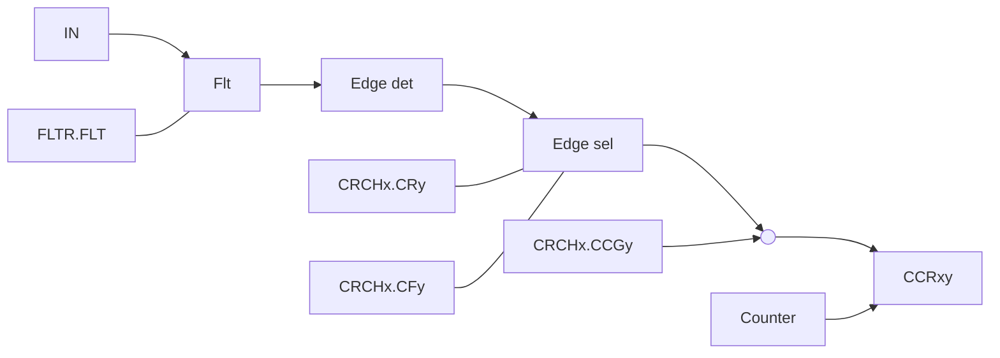

图 12-48 捕获功能框图


图 12-49 捕获时序图

### CH0A 的捕获输入

CH0A 的捕获输入信号如下表所示。

表 12-7 CH0A 捕获输入信号


<table>
  <thead>
    <tr>
        <th>MSCR.IA0S</th>
        <th>ATIM3</th>
    </tr>
  </thead>
  <tbody>
    <tr>
        <td>0b0</td>
        <td>CH0A</td>
    </tr>
    <tr>
        <td>0b1</td>
        <td>CH0A CH1A CH2A 异或输入</td>
    </tr>
  </tbody>
</table>

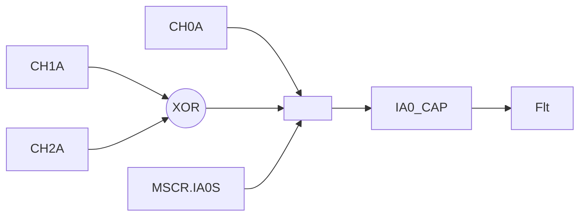

图 12-50 ATIM3 CH0A 捕获输入端口选择

# CH0B 的捕获输入

CH0B 的捕获输入信号如下表所示。


<table>
  <thead>
    <tr>
        <th>MSCR.IB0S</th>
        <th>ATIM3</th>
    </tr>
  </thead>
  <tbody>
    <tr>
        <td>0b0</td>
        <td>CH0B</td>
    </tr>
    <tr>
        <td rowspan="10">0b1</td>
        <td>内部触发 MSCR.TS 选择信号</td>
    </tr>
    <tr>
        <th>MSCR.TS 取值</th>
        <th>通道 B 捕获输入</th>
    </tr>
    <tr>
        <td>0b000</td>
        <td>ETR 滤波相位选择输出信号，滤波相位选择可配</td>
    </tr>
    <tr>
        <td>0b001</td>
        <td>内部互联 ITR0</td>
    </tr>
    <tr>
        <td>0b010</td>
        <td>内部互联 ITR1</td>
    </tr>
    <tr>
        <td>0b011</td>
        <td>内部互联 ITR2</td>
    </tr>
    <tr>
        <td>0b100</td>
        <td>内部互联 ITR3</td>
    </tr>
    <tr>
        <td>0b101</td>
        <td>CH0A 边沿</td>
    </tr>
    <tr>
        <td>0b110</td>
        <td>CH0A 滤波输出信号，滤波功能可配</td>
    </tr>
    <tr>
        <td>0b111</td>
        <td>CH0B 滤波输出信号，滤波功能可配</td>
    </tr>
  </tbody>
</table>


图 12-51 CH0B 捕获输入端口选择

## 12.3.7 模式 2/3 从模式

定时器能够在多种模式下和一个外部的触发同步：复位模式、门控模式和触发模式。


图 12-52 模式 2/3 从模式示意图

从模式功能选择通过 MSCR.SMS 选择：

<table>
  <thead>
    <tr>
        <th> </th>
        <th>取值</th>
        <th>说明</th>
    </tr>
  </thead>
  <tbody>
    <tr>
        <td rowspan="3">MSCR.SMS</td>
        <td>0b001</td>
        <td>从模式功能选择复位模式</td>
    </tr>
    <tr>
        <td>0b010</td>
        <td>从模式功能选择触发模式</td>
    </tr>
    <tr>
        <td>0b111</td>
        <td>从模式功能选择门控模式</td>
    </tr>
    <tr>
        <td rowspan="8">MSCR.TS</td>
        <td>0b000</td>
        <td>端口 ETR 的滤波相位选择后的信号 ETFP，滤波功能可配置</td>
    </tr>
    <tr>
        <td>0b001</td>
        <td>内部互联信号 ITR0</td>
    </tr>
    <tr>
        <td>0b010</td>
        <td>内部互联信号 ITR1</td>
    </tr>
    <tr>
        <td>0b011</td>
        <td>内部互联信号 ITR2</td>
    </tr>
    <tr>
        <td>0b100</td>
        <td>内部互联信号 ITR3</td>
    </tr>
    <tr>
        <td>0b101</td>
        <td>端口 CH0A 的边沿信号</td>
    </tr>
    <tr>
        <td>0b110</td>
        <td>端口 CH0A 的滤波相位选择后的信号 IAFP，滤波功能可配置</td>
    </tr>
    <tr>
        <td>0b111</td>
        <td>端口 CH0B 的滤波相位选择后的信号 IBFP，滤波功能可配置</td>
    </tr>
  </tbody>
</table>

# 门控计数

按照选中的输入端电平使能计数器。在如下的例子中，计数器只在 CH0A 为低电平时向上计数：

* 配置通道 CH0A 以检测 CH0A 上的低电平。配置输入滤波器带宽（本例中不需要滤波，所以保持 FLTR.FLTA0=0b000）。置 FLTR 寄存器中 CCPA0=1 以确定极性（只检测低电平）。

* 置 MSCR 寄存器中 SMS=0b111，配置定时器为门控模式；置 MSCR 寄存器中 TS=0b110，选择 CH0A 作为输入源。

* 置 M23CR 寄存器中 CTEN=1，启动计数器。在门控模式下，如果 CTEN=0，则计数器不能启动，不论触发输入电平如何。只要 CH0A 为低，计数器开始依据内部时钟计数，一旦 CH0A 变高则停止计数。

>  **说明**
> 门控输入不能是脉冲信号。当门控计数时，TS 不能配置为 0b101；当 TS 配置为 0b001/0b010/0b011/0b100 时，需要注意 ITR 是否为脉冲信号。


图 12-53 模式 2/3 从模式门控功能

# 触发功能

使用外部触发（CH0A、CH0B、ETR）可以使定时器同步启动，使用定时器内部互联信号结合 MSCR.MSM 也可以配置定时器同步启动。触发信号为输入信号的上升沿。也可以使用软件写 M23CR.TG 启动软件触发功能。

输入端上选中的事件使能计数器。在下面的例子中，计数器在 CH0B 输入的上升沿开始向上计数：

* 配置通道 CH0B 检测 CH0B 的上升沿。配置输入滤波器带宽（本例中，不需要任何滤波器，保持 FLTR.FLTB0=0b000）。设 FLTR 寄存器中 CCPB0=0 以确定极性（不反向）。

* 置 MSCR 寄存器中 SMS=0b010，配置定时器为触发模式；置 MSCR 寄存器中 TS=0b111，选择 CH0B 作为输入源。当 CH0B 出现一个上升沿时，计数器开始在内部时钟驱动下计数，同时设置 TIF 标志。CH0B 上升沿和计数器启动计数之间的延时，取决于 CH0B 输入端的同步电路。

 **说明**

如果使用下降沿触发，先选择触发极性，然后再选择模式，否则会产生误触发。

### 复位计数

在发生一个触发输入事件时，计数器和它的预分频器能够重新被初始化；同时，如果 CR 寄存器的 URS 位为低，还产生一个更新事件 UEV；然后所有的预装载寄存器（ARR，CCRxy）都被更新了。


图 12-54 模式 2/3 从模式触发和复位功能

### 12.3.8 正交编码计数功能

MSCR.SMS=4/5/6，对应正交编码模式的模式 1/2/3。这时计数器根据 IAFP 和 IBFP 的相位关系进行编码计数。IAFP、IBFP 为端口输入 CH0A、CH0B 的滤波相位选择的信号。

模式 1 使用 CH0A 的边沿计数。模式 2 使用 CH0B 的边沿计数。模式 3 使用 CH0A 和 CH0B 的边沿都计数。为了保证计数相位的正确性，需要保证 A/B 输入的相位大于一个脉冲宽度的相位差，A/B 输入脉冲宽度需要大于两个脉冲宽度。

如下表所示，IAFP 边沿条件对应 IBFP 电平信号；IBFP 边沿条件对应 IAFP 电平信号。例如 MOD1，当 IBFP 为高电平时候，IAFP 被检测到上升沿，则计数器向下计数；当 IBFP 为高电平的时候，IAFP 被检测到下降沿，则计数器向上计数。


<table>
  <thead>
    <tr>
        <th rowspan="2">模式</th>
        <th colspan="2">正交信号电平条件</th>
        <th colspan="2">正交信号 IAFP 边沿条件</th>
        <th colspan="2">正交信号 IBFP 边沿条件</th>
    </tr>
    <tr>
        <th>IBFP</th>
        <th>IAFP</th>
        <th>上升沿</th>
        <th>下降沿</th>
        <th>上升沿</th>
        <th>下降沿</th>
    </tr>
  </thead>
  <tbody>
    <tr>
        <td rowspan="2">MOD1</td>
        <td>高电平</td>
        <td>-</td>
        <td>向下计数</td>
        <td>向上计数</td>
        <td>-</td>
        <td>-</td>
    </tr>
    <tr>
        <td>低电平</td>
        <td>-</td>
        <td>向上计数</td>
        <td>向下计数</td>
        <td>-</td>
        <td>-</td>
    </tr>
    <tr>
        <td rowspan="2">MOD2</td>
        <td>-</td>
        <td>高电平</td>
        <td>-</td>
        <td>-</td>
        <td>向上计数</td>
        <td>向下计数</td>
    </tr>
    <tr>
        <td>-</td>
        <td>低电平</td>
        <td>-</td>
        <td>-</td>
        <td>向下计数</td>
        <td>向上计数</td>
    </tr>
    <tr>
        <td rowspan="4">MOD3</td>
        <td>高电平</td>
        <td>-</td>
        <td>向下计数</td>
        <td>向上计数</td>
        <td>-</td>
        <td>-</td>
    </tr>
    <tr>
        <td>低电平</td>
        <td>-</td>
        <td>向上计数</td>
        <td>向下计数</td>
        <td>-</td>
        <td>-</td>
    </tr>
    <tr>
        <td>-</td>
        <td>高电平</td>
        <td>-</td>
        <td>-</td>
        <td>向上计数</td>
        <td>向下计数</td>
    </tr>
    <tr>
        <td>-</td>
        <td>低电平</td>
        <td>-</td>
        <td>-</td>
        <td>向下计数</td>
        <td>向上计数</td>
    </tr>
  </tbody>
</table>

CHAF/CHBF 为端口 CH0A/CH0B 滤波的信号，IAFP/IBFP 为端口滤波相位选择后的信号。


<table>
  <thead>
    <tr>
        <th>Direction</th>
        <th>A</th>
        <th>B</th>
        <th>CNT</th>
    </tr>
  </thead>
  <tbody>
    <tr>
        <td>forward</td>
        <td>High</td>
        <td>Low</td>
        <td>0</td>
    </tr>
    <tr>
        <td>forward</td>
        <td>High</td>
        <td>High</td>
        <td>1</td>
    </tr>
    <tr>
        <td>forward</td>
        <td>Low</td>
        <td>High</td>
        <td>2</td>
    </tr>
    <tr>
        <td>forward</td>
        <td>Low</td>
        <td>Low</td>
        <td>3</td>
    </tr>
    <tr>
        <td>jitter</td>
        <td>High</td>
        <td>Low</td>
        <td>2</td>
    </tr>
    <tr>
        <td>jitter</td>
        <td>Low</td>
        <td>Low</td>
        <td>3</td>
    </tr>
    <tr>
        <td>backward</td>
        <td>Low</td>
        <td>High</td>
        <td>2</td>
    </tr>
    <tr>
        <td>backward</td>
        <td>High</td>
        <td>High</td>
        <td>1</td>
    </tr>
    <tr>
        <td>backward</td>
        <td>High</td>
        <td>Low</td>
        <td>0</td>
    </tr>
    <tr>
        <td>backward</td>
        <td>Low</td>
        <td>Low</td>
        <td>-1</td>
    </tr>
    <tr>
        <td>jitter</td>
        <td>Low</td>
        <td>High</td>
        <td>0</td>
    </tr>
    <tr>
        <td>jitter</td>
        <td>Low</td>
        <td>Low</td>
        <td>-1</td>
    </tr>
    <tr>
        <td>forward</td>
        <td>High</td>
        <td>Low</td>
        <td>0</td>
    </tr>
    <tr>
        <td>forward</td>
        <td>High</td>
        <td>High</td>
        <td>1</td>
    </tr>
    <tr>
        <td>forward</td>
        <td>Low</td>
        <td>High</td>
        <td>2</td>
    </tr>
  </tbody>
</table>
图 12-56 正交编码计数模式 3 计数示意图

### 12.3.9 Timer 触发 ADC

#### UEV 触发 ADC

当产生事件更新 UEV，且 ADTR.UEVE 和 ADTR.ADTE 使能，可以向 ADC 输出触发请求。

#### 比较匹配触发 ADC

CCR0A、CCR1A、CCR2A 比较匹配可以配置触发 ADC：

* 模式 3：通过控制寄存器 M23CR.CIS 统一控制 CHxA 通道的比较匹配条件：可以选择上计数比较匹配、下计数比较匹配或上下计数都比较匹配触发。

* 模式 2：不需要设置 M23CR.CIS。

CCR0B、CCR1B、CCR2B 比较匹配可以配置触发 ADC：

* 模式 3：通过寄存器 CRCHx.CISB 分别控制 CHxB 通道的比较匹配条件：可以选择上计数比较匹配、下计数比较匹配或上下计数都比较匹配触发。

* 模式 2：不需要设置 CRCHx.CISB。

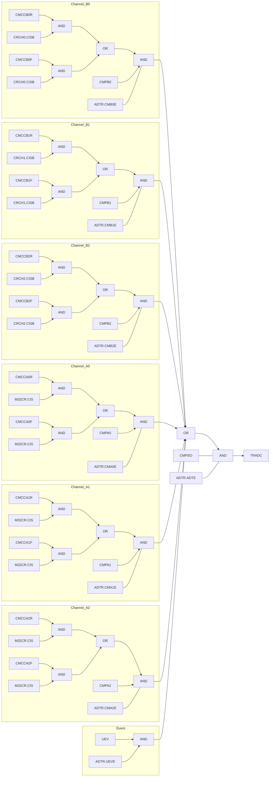

图 12-57 Timer 触发 ADC

### 12.3.10 刹车控制

外部 BK 端口输入可控制刹车，系统 fail 可以控制刹车功能。通过 M23CR.BG 可以实现软件刹车功能，控制输出端口到设定的状态。

### 12.3.11 中断

表 12-12 ATIM3 中断列表


<table>
  <thead>
    <tr>
        <th>中断控制寄存器</th>
        <th>中断名</th>
    </tr>
  </thead>
  <tbody>
    <tr>
        <td>MxCR.UIE(x=0/1/23)</td>
        <td>溢出中断/事件更新中断</td>
    </tr>
    <tr>
        <td>CRCHx.CIEA(x=0/1/2)</td>
        <td>通道（0/1/2）A 比较捕获中断</td>
    </tr>
    <tr>
        <td>CRCHx.CIEB(x=0/1/2)</td>
        <td>通道（0/1/2）B 比较捕获中断</td>
    </tr>
    <tr>
        <td>M23CR.BIE</td>
        <td>刹车中断</td>
    </tr>
    <tr>
        <td>M23CR.TIE</td>
        <td>触发中断</td>
    </tr>
    <tr>
        <td>M23CR.OVE</td>
        <td>上溢中断</td>
    </tr>
    <tr>
        <td>M23CR.UNDE</td>
        <td>下溢中断</td>
    </tr>
  </tbody>
</table>

### 12.3.12 Timer 互联

TRGO 输出信号可以连接到其他定时器的 ITR 信号。连接关系如下：

# 表 12-13 定时器互联信号列表


<table>
  <thead>
    <tr>
        <th> </th>
        <th>ITR0</th>
        <th>ITR1</th>
        <th>ITR2</th>
        <th>ITR3</th>
    </tr>
  </thead>
  <tbody>
    <tr>
        <td>CTIM0</td>
        <td>-</td>
        <td>CTIM1_OV</td>
        <td>-</td>
        <td>ATIM3_TRGO</td>
    </tr>
    <tr>
        <td>CTIM1</td>
        <td>-</td>
        <td>CTIM0_OV</td>
        <td>-</td>
        <td>ATIM3_TRGO</td>
    </tr>
    <tr>
        <td>ATIM3</td>
        <td>CTIM0_OV</td>
        <td>CTIM1_OV</td>
        <td>CTRIM_TOG</td>
        <td>-</td>
    </tr>
  </tbody>
</table>

 **说明**

CTIM0_OV 和 CTIM1_OV 是单周期信号，不能作为门控模式的输入。

### 12.3.13 输入互联

ATIM3 的 ETR 输入可以从端口输入，也可通过端口功能寄存器选择可以连通到其他模块或端口。具体配置参考《端口控制器（GPIO）》章节寄存器“端口辅助功能定时器 ETR 选择（GPIO_TIMES）”相关描述。

ATIM3 的 CH0A 输入可以从端口输入，也可通过端口功能寄存器选择可以连通到其他模块或端口。具体配置参考《端口控制器（GPIO）》章节寄存器“端口辅助功能定时器捕获输入选择（GPIO_TIMCPS）”相关描述。

## 12.4 操作示例

### 12.4.1 模式 0 计数定时器功能设置示例

#### 操作步骤

* **重载定时器设置**
        - 步骤 1. 设置定时器模式 M0CR.MODE=0；
        - 步骤 2. 设置装载值 ARR；
        - 步骤 3. 设置计数器初值 CNT；
        - 步骤 4. 清除中断标志；
        - 步骤 5. 使能中断 M0CR.UIE；
        - 步骤 6. 使能重载模式 M0CR.MD；
        - 步骤 7. 开启定时器 M0CR.CTEN。

* **BUZZER 输出控制**
        - 步骤 1. 根据输出频率设置合适的 ARR 值 ；
        - 步骤 2. 设置定时器为重载模式，参考重载定时器设置；
        - 步骤 3. 使能输出使能 DTR.MOE；
        - 步骤 4. 启动另外一个定时器控制 M0CR.TOGEN 实现频率的间隔输出。

### 12.4.2 模式 1 脉宽测量 PWC 设置示例

#### 操作步骤

* **脉冲低电平测量设置**
        - 步骤 1. 设置为脉冲测量模式 M1CR.MODE=1；
        - 步骤 2. 设置 MSCR.TS 选择测量的信号，再依据 MSCR.TS 设置，配置 MSCR.IA0S/IB0S（IB0S 不可配置为 1），选择需要测量的通道；
        - 步骤 3. 设置 M1CR.EDG2ND=0，M1CR.EDG1ST=1 选择测量低电平；
        - 步骤 4. 清除中断标志；
        - 步骤 5. 使能溢出中断 M1CR.UIE；
        - 步骤 6. 使能测量结束中断 CR0.CIEA；

步骤 7. 使能定时器 M1CR.CTEN；

步骤 8. 中断服务程序中读取 CCR0A 及溢出次数并清除中断标志；

步骤 9. 等待下次测量。

● 脉冲高电平单次测量设置

步骤 1. 设置为脉冲测量模式 M1CR.MODE=1；

步骤 2. 设置 MSCR.TS 选择测量的信号，再依据 MSCR.TS 设置，配置 MSCR.IA0S/IB0S（IB0S 不可配置为 1），选择需要测量的通道；

步骤 3. 设置脉冲单次测量模式 M1CR.ONESHOT=1；

步骤 4. 设置 M1CR.EDG2ND=1，M1CR.EDG1ST=0 选择测量高电平；

步骤 5. 清除中断标志；

步骤 6. 使能溢出中断 M1CR.UIE；

步骤 7. 使能测量结束中断 CR0.CIEA；

步骤 8. 使能定时器 M1CR.CTEN；

步骤 9. 中断服务程序中读取 CCR0A 及溢出次数并清除中断标志；

步骤 10. 测量结束。

### 12.4.3 模式 2/3 比较捕获模式设置示例

#### 操作步骤

● 边沿对齐独立 PWM 输出设置

步骤 1. 设置模式 M23CR.MODE=2；

步骤 2. 设置锯齿波计数方向 M23CR.DIR；

步骤 3. 设置 PWM 周期值 ARR；

步骤 4. 设置计数器初值（初值必须小于周期值）；

步骤 5. 设置 PWM 比较值 CCRxA、CCRxB；

步骤 6. 设置 PWM 输出比较模式 FLTR.OCMAx、FLTR.OCMBx 为 6 或 7；

步骤 7. 清除相关中断标志；

步骤 8. 使能相应的中断；

步骤 9. 设置输出极性 FLTR.CCPAx、FLTR.CCPBx；

步骤 10. 使能输出 DTR.MOE；

步骤 11. 使能定时器 M23CR.CTEN。

● 中心对齐互补 PWM 输出设置

步骤 1. 设置模式 M23CR.MODE=3；

步骤 2. 设置互补输出 M23CR.COMP；

步骤 3. 设置 PWM 周期值 ARR；

步骤 4. 设置计数器初值（初值必须小于周期值）；

步骤 5. 设置 PWM 比较值 CCRxA（CCRxB 不需要设置，PWM 输出与这个寄存器无关）；

步骤 6. 设置 PWM 输出比较模式 FLTR.OCMAx、FLTR.OCMBx 为 6 或 7；

步骤 7. 清除相关中断标志；

步骤 8. 使能相应的中断；

步骤 9. 设置输出极性 FLTR.CCPAx、FLTR.CCPBx；

步骤 10. 使能输出 DTR.MOE；

步骤 11. 使能定时器 M23CR.CTEN。

● 非对称中心对齐带死区互补 PWM 输出设置

步骤 1. 设置模式 M23CR.MODE=3；

步骤 2. 设置互补输出 M23CR.COMP；

步骤 3. 设置双点比较使能 M23CR.PWM2S；

步骤 4. 设置 PWM 周期值 ARR；

步骤 5. 设置计数器初值（初值必须小于周期值）；

步骤 6. 设置 PWM 比较值 CCRxA、CCRxB（上计数比较点为 CCRxA，下计数比较点为 CCRxB）；

步骤 7. 设置 PWM 输出比较模式 FLTR.OCMAx、FLTR.OCMBx 为 6 或 7；

步骤 8. 清除相关中断标志；

步骤 9. 使能相应的中断；

步骤 10. 设置输出极性 FLTR.CCPAx、FLTR.CCPBx；

步骤 11. 设置死区使能 DTR.DTEN；

步骤 12. 设置死区时间 DTR.DTR；

步骤 13. 使能输出 DTR.MOE；

步骤 14. 使能定时器 M23CR.CTEN。

● 捕获功能设置，设置 CH0B 为上升沿捕获功能

步骤 1. 选择计数器计数方式，设置 M23CR.MODE=2；

步骤 2. 选择 CH0B 为捕获模式 CRCH0.CSB=1；

步骤 3. 根据需要选择输入滤波 FLTR.FLTB0；

步骤 4. 选择捕获的边沿 CRCH0.CRB=1；

步骤 5. 设置 ARR 改变周期值；

步骤 6. 清除相关中断标志；

步骤 7. 清除捕获标志，使能相应中断；

步骤 8. 启动定时器 M23CR.CTEN；

步骤 9. 查询到捕获标志后，读取 CCR0B 获得捕获值。

> >  **说明**
> > 定时器未启动时如果有效的捕获边沿也会产生捕获标志及捕获动作。

## 12.4.4 互补 PWM 输出时 B 比较作为 ADC 触发功能

**操作步骤**

步骤 1. 设置为 PWM 互补输出模式，相关步骤参考中心对齐互补 PWM 输出设置

步骤 2. 设置 CCRxB 设置 ADC 触发比较点

步骤 3. 设置 CRCHx.CISB 选择上计数下计数比较匹配（锯齿波不需要选择）

步骤 4. 选择 ADC 触发比较的源 ADTR

步骤 5. 使能 ADC 触发 ADTR.ADTE

# 12.5 寄存器

## 12.5.1 寄存器总表

**ATIM3 基地址**: 0x40009800

表 12-14 模式 0 定时器寄存器偏移地址


<table>
  <thead>
    <tr>
        <th>偏移地址</th>
        <th>寄存器</th>
        <th>描述</th>
    </tr>
  </thead>
  <tbody>
    <tr>
        <td>0x000</td>
        <td>ATIM3_ARR</td>
        <td>重载寄存器/周期</td>
    </tr>
    <tr>
        <td>0x004</td>
        <td>ATIM3_CNT</td>
        <td>16 位模式计数寄存器</td>
    </tr>
    <tr>
        <td>0x008</td>
        <td>ATIM3_CNT32</td>
        <td>32 位模式计数寄存器<br/><br/>**说明**<br/>ATIM3_CNT32 是 ATIM3_ARR 与 ATIM3_CNT 的重映射寄存器。为了方便 32 位定时器写操作。</td>
    </tr>
    <tr>
        <td>0x00C</td>
        <td>ATIM3_M0CR</td>
        <td>模式 0 控制寄存器</td>
    </tr>
    <tr>
        <td>0x010</td>
        <td>ATIM3_IFR</td>
        <td>中断标志寄存器</td>
    </tr>
    <tr>
        <td>0x014</td>
        <td>ATIM3_ICLR</td>
        <td>中断清除寄存器</td>
    </tr>
    <tr>
        <td>0x030</td>
        <td>ATIM3_DTR</td>
        <td>死区时间寄存器</td>
    </tr>
  </tbody>
</table>

表 12-15 模式 1 脉宽测量 PWC 寄存器偏移地址


<table>
  <thead>
    <tr>
        <th>偏移地址</th>
        <th>寄存器</th>
        <th>描述</th>
    </tr>
  </thead>
  <tbody>
    <tr>
        <td>0x004</td>
        <td>ATIM3_CNT</td>
        <td>16 位模式计数寄存器</td>
    </tr>
    <tr>
        <td>0x00C</td>
        <td>ATIM3_M1CR</td>
        <td>模式 1 控制寄存器</td>
    </tr>
    <tr>
        <td>0x010</td>
        <td>ATIM3_IFR</td>
        <td>中断标志寄存器</td>
    </tr>
    <tr>
        <td>0x014</td>
        <td>ATIM3_ICLR</td>
        <td>中断清除寄存器</td>
    </tr>
    <tr>
        <td>0x018</td>
        <td>ATIM3_MSCR</td>
        <td>主从模式控制寄存器</td>
    </tr>
    <tr>
        <td>0x01C</td>
        <td>ATIM3_FLTR</td>
        <td>输入滤波寄存器</td>
    </tr>
    <tr>
        <td>0x024</td>
        <td>ATIM3_CR0</td>
        <td>控制寄存器</td>
    </tr>
    <tr>
        <td>0x03C</td>
        <td>ATIM3_CCR0A</td>
        <td>比较捕获寄存器</td>
    </tr>
  </tbody>
</table>

表 12-16 模式 2/3 比较捕获模式寄存器偏移地址


<table>
  <thead>
    <tr>
        <th>偏移地址</th>
        <th>寄存器</th>
        <th>描述</th>
    </tr>
  </thead>
  <tbody>
    <tr>
        <td>0x000</td>
        <td>ATIM3_ARR</td>
        <td>重载寄存器/周期</td>
    </tr>
    <tr>
        <td>0x004</td>
        <td>ATIM3_CNT</td>
        <td>16 位模式计数寄存器</td>
    </tr>
    <tr>
        <td>0x00C</td>
        <td>ATIM3_M23CR</td>
        <td>模式 23 控制寄存器</td>
    </tr>
  </tbody>
</table>

<table>
  <thead>
    <tr>
        <th>偏移地址</th>
        <th>寄存器</th>
        <th>描述</th>
    </tr>
  </thead>
  <tbody>
    <tr>
        <td>0x010</td>
        <td>ATIM3_IFR</td>
        <td>中断标志寄存器</td>
    </tr>
    <tr>
        <td>0x014</td>
        <td>ATIM3_ICLR</td>
        <td>中断清除寄存器</td>
    </tr>
    <tr>
        <td>0x018</td>
        <td>ATIM3_MSCR</td>
        <td>主从模式控制寄存器</td>
    </tr>
    <tr>
        <td>0x01C</td>
        <td>ATIM3_FLTR</td>
        <td>输出控制/输入滤波寄存器</td>
    </tr>
    <tr>
        <td>0x020</td>
        <td>ATIM3_ADTR</td>
        <td>ADC 触发控制寄存器</td>
    </tr>
    <tr>
        <td>0x024</td>
        <td>ATIM3_CRCH0</td>
        <td>通道 0 控制寄存器</td>
    </tr>
    <tr>
        <td>0x028</td>
        <td>ATIM3_CRCH1</td>
        <td>通道 1 控制寄存器</td>
    </tr>
    <tr>
        <td>0x02C</td>
        <td>ATIM3_CRCH2</td>
        <td>通道 2 控制寄存器</td>
    </tr>
    <tr>
        <td>0x030</td>
        <td>ATIM3_DTR</td>
        <td>死区时间寄存器</td>
    </tr>
    <tr>
        <td>0x034</td>
        <td>ATIM3_RCR</td>
        <td>重复周期设置寄存器</td>
    </tr>
    <tr>
        <td>0x03C</td>
        <td>ATIM3_CCR0A</td>
        <td>通道 0A 比较捕获寄存器</td>
    </tr>
    <tr>
        <td>0x040</td>
        <td>ATIM3_CCR0B</td>
        <td>通道 0B 比较捕获寄存器</td>
    </tr>
    <tr>
        <td>0x044</td>
        <td>ATIM3_CCR1A</td>
        <td>通道 1A 比较捕获寄存器</td>
    </tr>
    <tr>
        <td>0x048</td>
        <td>ATIM3_CCR1B</td>
        <td>通道 1B 比较捕获寄存器</td>
    </tr>
    <tr>
        <td>0x04C</td>
        <td>ATIM3_CCR2A</td>
        <td>通道 2A 比较捕获寄存器</td>
    </tr>
    <tr>
        <td>0x050</td>
        <td>ATIM3_CCR2B</td>
        <td>通道 2B 比较捕获寄存器</td>
    </tr>
  </tbody>
</table>

## 12.5.2 模式 0 计数定时器寄存器

### 12.5.2.1 16 位模式重载寄存器（ATIM3_ARR）


<table>
  <thead>
    <tr>
        <th>Offset</th>
        <th colspan="32">Bit Position</th>
    </tr>
    <tr>
        <th>0x000</th>
        <th>31</th>
        <th>30</th>
        <th>29</th>
        <th>28</th>
        <th>27</th>
        <th>26</th>
        <th>25</th>
        <th>24</th>
        <th>23</th>
        <th>22</th>
        <th>21</th>
        <th>20</th>
        <th>19</th>
        <th>18</th>
        <th>17</th>
        <th>16</th>
        <th>15</th>
        <th>14</th>
        <th>13</th>
        <th>12</th>
        <th>11</th>
        <th>10</th>
        <th>9</th>
        <th>8</th>
        <th>7</th>
        <th>6</th>
        <th>5</th>
        <th>4</th>
        <th>3</th>
        <th>2</th>
        <th>1</th>
        <th>0</th>
    </tr>
    <tr>
        <th>Reset</th>
        <th colspan="32">0x00000000</th>
    </tr>
    <tr>
        <th>Name</th>
        <th colspan="16">Reserved</th>
        <th colspan="16">ARR</th>
    </tr>
    <tr>
        <th>Access</th>
        <th colspan="16"> </th>
        <th colspan="16">RW</th>
    </tr>
  </thead>
</table>
<table>
  <thead>
    <tr>
        <th>位/位域</th>
        <th>标记</th>
        <th>位名</th>
        <th>功能描述</th>
        <th>读写</th>
    </tr>
  </thead>
  <tbody>
    <tr>
        <td>31:16</td>
        <td>Reserved</td>
        <td>保留</td>
        <td>-</td>
        <td>-</td>
    </tr>
    <tr>
        <td>15:0</td>
        <td>ARR</td>
        <td>16 位重载定时器<br/>重载值寄存器</td>
        <td>-</td>
        <td>RW</td>
    </tr>
  </tbody>
</table>

### 12.5.2.2 16 位模式计数寄存器（ATIM3_CNT）


<table>
  <thead>
    <tr>
        <th>Offset</th>
        <th colspan="32">Bit Position</th>
    </tr>
    <tr>
        <th>0x004</th>
        <th>31</th>
        <th>30</th>
        <th>29</th>
        <th>28</th>
        <th>27</th>
        <th>26</th>
        <th>25</th>
        <th>24</th>
        <th>23</th>
        <th>22</th>
        <th>21</th>
        <th>20</th>
        <th>19</th>
        <th>18</th>
        <th>17</th>
        <th>16</th>
        <th>15</th>
        <th>14</th>
        <th>13</th>
        <th>12</th>
        <th>11</th>
        <th>10</th>
        <th>9</th>
        <th>8</th>
        <th>7</th>
        <th>6</th>
        <th>5</th>
        <th>4</th>
        <th>3</th>
        <th>2</th>
        <th>1</th>
        <th>0</th>
    </tr>
    <tr>
        <th>Reset</th>
        <th colspan="32">0x00000000</th>
    </tr>
    <tr>
        <th>Name</th>
        <th colspan="16">Reserved</th>
        <th colspan="16">CNT</th>
    </tr>
    <tr>
        <th>Access</th>
        <th colspan="16"> </th>
        <th colspan="16">RW</th>
    </tr>
  </thead>
</table>
<table>
  <thead>
    <tr>
        <th>位/位域</th>
        <th>标记</th>
        <th>位名</th>
        <th>功能描述</th>
        <th>读写</th>
    </tr>
  </thead>
  <tbody>
    <tr>
        <td>31:16</td>
        <td>Reserved</td>
        <td>保留</td>
        <td>-</td>
        <td>-</td>
    </tr>
    <tr>
        <td>15:0</td>
        <td>CNT</td>
        <td>16 位重载定时器<br/>计数值寄存器</td>
        <td>-</td>
        <td>RW</td>
    </tr>
  </tbody>
</table>

### 12.5.2.3 32 位模式计数寄存器（ATIM3_CNT32）


<table>
  <thead>
    <tr>
        <th>Offset</th>
        <th colspan="32">Bit Position</th>
    </tr>
    <tr>
        <th>0x008</th>
        <th>31</th>
        <th>30</th>
        <th>29</th>
        <th>28</th>
        <th>27</th>
        <th>26</th>
        <th>25</th>
        <th>24</th>
        <th>23</th>
        <th>22</th>
        <th>21</th>
        <th>20</th>
        <th>19</th>
        <th>18</th>
        <th>17</th>
        <th>16</th>
        <th>15</th>
        <th>14</th>
        <th>13</th>
        <th>12</th>
        <th>11</th>
        <th>10</th>
        <th>9</th>
        <th>8</th>
        <th>7</th>
        <th>6</th>
        <th>5</th>
        <th>4</th>
        <th>3</th>
        <th>2</th>
        <th>1</th>
        <th>0</th>
    </tr>
    <tr>
        <th>Reset</th>
        <th colspan="32">0x00000000</th>
    </tr>
    <tr>
        <th>Name</th>
        <th colspan="32">CNT32</th>
    </tr>
    <tr>
        <th>Access</th>
        <th colspan="32">RW</th>
    </tr>
  </thead>
</table>
<table>
  <thead>
    <tr>
        <th>位/位域</th>
        <th>标记</th>
        <th>位名</th>
        <th>功能描述</th>
        <th>读写</th>
    </tr>
  </thead>
  <tbody>
    <tr>
        <td>31:0</td>
        <td>CNT32</td>
        <td>32 位定时器计数<br/>值寄存器</td>
        <td>仅在模式 0 32 位定时器自由计数模式下有效，其他模式禁止写该寄存器</td>
        <td>RW</td>
    </tr>
  </tbody>
</table>

## 12.5.2.4 控制寄存器（ATIM3_M0CR）


<table>
  <thead>
    <tr>
        <th>Offset</th>
        <th colspan="32">Bit Position</th>
    </tr>
    <tr>
        <th>0x00C</th>
        <th>31</th>
        <th>30</th>
        <th>29</th>
        <th>28</th>
        <th>27</th>
        <th>26</th>
        <th>25</th>
        <th>24</th>
        <th>23</th>
        <th>22</th>
        <th>21</th>
        <th>20</th>
        <th>19</th>
        <th>18</th>
        <th>17</th>
        <th>16</th>
        <th>15</th>
        <th>14</th>
        <th>13</th>
        <th>12</th>
        <th>11</th>
        <th>10</th>
        <th>9</th>
        <th>8</th>
        <th>7</th>
        <th>6</th>
        <th>5</th>
        <th>4</th>
        <th>3</th>
        <th>2</th>
        <th>1</th>
        <th>0</th>
    </tr>
    <tr>
        <th>Reset</th>
        <th colspan="32">0x00600008</th>
    </tr>
    <tr>
        <th>Name</th>
        <th colspan="18">Reserved</th>
        <th colspan="2">MODE</th>
        <th>Reserved</th>
        <th>UIE</th>
        <th>GATEP</th>
        <th>GATE</th>
        <th>Reserved</th>
        <th colspan="3">PRS</th>
        <th>TOGEN</th>
        <th>CT</th>
        <th>MD</th>
        <th>CTEN</th>
    </tr>
    <tr>
        <th>Access</th>
        <th> </th>
        <th> </th>
        <th> </th>
        <th> </th>
        <th> </th>
        <th> </th>
        <th> </th>
        <th> </th>
        <th> </th>
        <th> </th>
        <th> </th>
        <th> </th>
        <th> </th>
        <th> </th>
        <th> </th>
        <th> </th>
        <th> </th>
        <th> </th>
        <th colspan="2">RW</th>
        <th> </th>
        <th>RW</th>
        <th>RW</th>
        <th>RW</th>
        <th> </th>
        <th colspan="3">RW</th>
        <th>RW</th>
        <th>RW</th>
        <th>RW</th>
        <th>RW</th>
    </tr>
  </thead>
</table>
<table>
  <thead>
    <tr>
        <th>位/位域</th>
        <th>标记</th>
        <th>位名</th>
        <th>功能描述</th>
        <th>读写</th>
    </tr>
  </thead>
  <tbody>
    <tr>
        <td>31:14</td>
        <td>Reserved</td>
        <td>保留</td>
        <td>-</td>
        <td>-</td>
    </tr>
    <tr>
        <td>13:12</td>
        <td>MODE</td>
        <td>工作模式</td>
        <td>● 0b00：定时器模式 0<br/>● 0b01：PWC 模式<br/>● 0b10：锯齿波模式<br/>● 0b11：三角波模式</td>
        <td>RW</td>
    </tr>
    <tr>
        <td>11</td>
        <td>Reserved</td>
        <td>保留</td>
        <td>-</td>
        <td>-</td>
    </tr>
    <tr>
        <td>10</td>
        <td>UIE</td>
        <td>中断使能控制</td>
        <td>● 0b0：禁止<br/>● 0b1：使能</td>
        <td>RW</td>
    </tr>
    <tr>
        <td>9</td>
        <td>GATEP</td>
        <td>端口 GATE 极性控制</td>
        <td>● 0b0：端口 GATE 高电平有效<br/>● 0b1：端口 GATE 低电平有效</td>
        <td>RW</td>
    </tr>
    <tr>
        <td>8</td>
        <td>GATE</td>
        <td>定时器门控使能</td>
        <td>● 0b0：无门控，CTEN=1 时定时器工作<br/>● 0b1：门控使能，端口 GATE 有效并且 CTEN=1 时定时器才工作</td>
        <td>RW</td>
    </tr>
    <tr>
        <td>7</td>
        <td>Reserved</td>
        <td>保留</td>
        <td>-</td>
        <td>-</td>
    </tr>
    <tr>
        <td>6:4</td>
        <td>PRS</td>
        <td>内部时钟分频选择</td>
        <td>● 0b000：1<br/>● 0b001：2<br/>● 0b010：4<br/>● 0b011：8<br/>● 0b100：16<br/>● 0b101：32<br/>● 0b110：64<br/>● 0b111：256</td>
        <td>RW</td>
    </tr>
    <tr>
        <td>3</td>
        <td>TOGEN</td>
        <td>模式 0 下翻转输出使能</td>
        <td>● 0b0：翻转输出关闭，CHA、CHB 输出为低电平<br/>● 0b1：翻转输出使能</td>
        <td>RW</td>
    </tr>
    <tr>
        <td>2</td>
        <td>CT</td>
        <td>计数时钟选择</td>
        <td>● 0b0：内部计数时钟 TCLK<br/>● 0b1：外部计数时钟 ETR<br/>&gt; **说明**<br/>&gt; 配置外部时钟模式，该时钟选择无效。</td>
        <td>RW</td>
    </tr>
    <tr>
        <td>1</td>
        <td>MD</td>
        <td>模式选择 32 定时/16 定时模式选择</td>
        <td>● 0b0：32 位自由计数<br/>● 0b1：16 位重载计数</td>
        <td>RW</td>
    </tr>
    <tr>
        <td>0</td>
        <td>CTEN</td>
        <td>定时器使能</td>
        <td>● 0b0：禁止<br/>● 0b1：使能</td>
        <td>RW</td>
    </tr>
  </tbody>
</table>

### 12.5.2.5 中断标志寄存器（ATIM3_IFR）


<table>
  <thead>
    <tr>
        <th rowspan="2">Offset</th>
        <th colspan="32">Bit Position</th>
    </tr>
    <tr>
        <th>31</th>
        <th>30</th>
        <th>29</th>
        <th>28</th>
        <th>27</th>
        <th>26</th>
        <th>25</th>
        <th>24</th>
        <th>23</th>
        <th>22</th>
        <th>21</th>
        <th>20</th>
        <th>19</th>
        <th>18</th>
        <th>17</th>
        <th>16</th>
        <th>15</th>
        <th>14</th>
        <th>13</th>
        <th>12</th>
        <th>11</th>
        <th>10</th>
        <th>9</th>
        <th>8</th>
        <th>7</th>
        <th>6</th>
        <th>5</th>
        <th>4</th>
        <th>3</th>
        <th>2</th>
        <th>1</th>
        <th>0</th>
    </tr>
  </thead>
  <tbody>
    <tr>
        <td>0x010</td>
        <td colspan="32">0x00000000</td>
    </tr>
    <tr>
        <td>Name</td>
        <td colspan="31">Reserved</td>
        <td>UIF</td>
    </tr>
    <tr>
        <td>Access</td>
        <td colspan="31"> </td>
        <td>RO</td>
    </tr>
  </tbody>
</table>
<table>
  <thead>
    <tr>
        <th>位/位域</th>
        <th>标记</th>
        <th>位名</th>
        <th>功能描述</th>
        <th>读写</th>
    </tr>
  </thead>
  <tbody>
    <tr>
        <td>31:1</td>
        <td>Reserved</td>
        <td>保留</td>
        <td>-</td>
        <td>-</td>
    </tr>
    <tr>
        <td>0</td>
        <td>UIF</td>
        <td>溢出中断</td>
        <td>● 0b0：计数器未溢出<br/>● 0b1：计数器已溢出</td>
        <td>RO</td>
    </tr>
  </tbody>
</table>

### 12.5.2.6 中断标志清除寄存器（ATIM3_ICLR）


<table>
  <thead>
    <tr>
        <th rowspan="2">Offset</th>
        <th colspan="32">Bit Position</th>
    </tr>
    <tr>
        <th>31</th>
        <th>30</th>
        <th>29</th>
        <th>28</th>
        <th>27</th>
        <th>26</th>
        <th>25</th>
        <th>24</th>
        <th>23</th>
        <th>22</th>
        <th>21</th>
        <th>20</th>
        <th>19</th>
        <th>18</th>
        <th>17</th>
        <th>16</th>
        <th>15</th>
        <th>14</th>
        <th>13</th>
        <th>12</th>
        <th>11</th>
        <th>10</th>
        <th>9</th>
        <th>8</th>
        <th>7</th>
        <th>6</th>
        <th>5</th>
        <th>4</th>
        <th>3</th>
        <th>2</th>
        <th>1</th>
        <th>0</th>
    </tr>
  </thead>
  <tbody>
    <tr>
        <td>0x014</td>
        <td colspan="32">0x000FFFFF</td>
    </tr>
    <tr>
        <td>Name</td>
        <td colspan="31">Reserved</td>
        <td>UIF</td>
    </tr>
    <tr>
        <td>Access</td>
        <td colspan="31"> </td>
        <td>WO</td>
    </tr>
  </tbody>
</table>
<table>
  <thead>
    <tr>
        <th>位/位域</th>
        <th>标记</th>
        <th>位名</th>
        <th>功能描述</th>
        <th>读写</th>
    </tr>
  </thead>
  <tbody>
    <tr>
        <td>31:1</td>
        <td>Reserved</td>
        <td>保留</td>
        <td>-</td>
        <td>-</td>
    </tr>
    <tr>
        <td>0</td>
        <td>UIF</td>
        <td>溢出中断清除</td>
        <td>写 0 清除标志，写 1 无效；读出恒为 1</td>
        <td>WO</td>
    </tr>
  </tbody>
</table>

### 12.5.2.7 死区时间寄存器（ATIM3_DTR）


<table>
  <thead>
    <tr>
        <th rowspan="2">Offset</th>
        <th colspan="32">Bit Position</th>
    </tr>
    <tr>
        <th>31</th>
        <th>30</th>
        <th>29</th>
        <th>28</th>
        <th>27</th>
        <th>26</th>
        <th>25</th>
        <th>24</th>
        <th>23</th>
        <th>22</th>
        <th>21</th>
        <th>20</th>
        <th>19</th>
        <th>18</th>
        <th>17</th>
        <th>16</th>
        <th>15</th>
        <th>14</th>
        <th>13</th>
        <th>12</th>
        <th>11</th>
        <th>10</th>
        <th>9</th>
        <th>8</th>
        <th>7</th>
        <th>6</th>
        <th>5</th>
        <th>4</th>
        <th>3</th>
        <th>2</th>
        <th>1</th>
        <th>0</th>
    </tr>
  </thead>
  <tbody>
    <tr>
        <td>0x030</td>
        <td colspan="32">0x00000000</td>
    </tr>
    <tr>
        <td>Name</td>
        <td colspan="19">Reserved</td>
        <td>MOE</td>
        <td colspan="12">Reserved</td>
    </tr>
    <tr>
        <td>Access</td>
        <td colspan="19"> </td>
        <td>RW</td>
        <td colspan="12"> </td>
    </tr>
  </tbody>
</table>
<table>
  <thead>
    <tr>
        <th>位/位域</th>
        <th>标记</th>
        <th>位名</th>
        <th>功能描述</th>
        <th>读写</th>
    </tr>
  </thead>
  <tbody>
    <tr>
        <td>31:13</td>
        <td>Reserved</td>
        <td>保留</td>
        <td>-</td>
        <td>-</td>
    </tr>
    <tr>
        <td>12</td>
        <td>MOE</td>
        <td>翻转输出使能</td>
        <td>● 0b0：翻转输出为输入状态<br/>● 0b1：翻转端口为输出状态</td>
        <td>RW</td>
    </tr>
    <tr>
        <td>11:0</td>
        <td>Reserved</td>
        <td>保留</td>
        <td>-</td>
        <td>-</td>
    </tr>
  </tbody>
</table>

### 12.5.3 模式 1 脉宽测量 PWC 寄存器

#### 12.5.3.1 16 位模式计数寄存器（ATIM3_CNT）


<table>
  <thead>
    <tr>
        <th>Offset</th>
        <th colspan="32">Bit Position</th>
    </tr>
    <tr>
        <th>0x004</th>
        <th>31</th>
        <th>30</th>
        <th>29</th>
        <th>28</th>
        <th>27</th>
        <th>26</th>
        <th>25</th>
        <th>24</th>
        <th>23</th>
        <th>22</th>
        <th>21</th>
        <th>20</th>
        <th>19</th>
        <th>18</th>
        <th>17</th>
        <th>16</th>
        <th>15</th>
        <th>14</th>
        <th>13</th>
        <th>12</th>
        <th>11</th>
        <th>10</th>
        <th>9</th>
        <th>8</th>
        <th>7</th>
        <th>6</th>
        <th>5</th>
        <th>4</th>
        <th>3</th>
        <th>2</th>
        <th>1</th>
        <th>0</th>
    </tr>
  </thead>
  <tbody>
    <tr>
        <td>Reset</td>
        <td colspan="32">0x00000000</td>
    </tr>
    <tr>
        <td>Name</td>
        <td colspan="16">Reserved</td>
        <td colspan="16">CNT</td>
    </tr>
    <tr>
        <td>Access</td>
        <td colspan="16"> </td>
        <td colspan="16">RW CNT</td>
    </tr>
  </tbody>
</table>
<table>
  <thead>
    <tr>
        <th>位/位域</th>
        <th>标记</th>
        <th>位名</th>
        <th>功能描述</th>
        <th>读写</th>
    </tr>
  </thead>
  <tbody>
    <tr>
        <td>31:16</td>
        <td>Reserved</td>
        <td>保留</td>
        <td>-</td>
        <td>-</td>
    </tr>
    <tr>
        <td>15:0</td>
        <td>CNT</td>
        <td>计数值寄存器</td>
        <td>-</td>
        <td>RW</td>
    </tr>
  </tbody>
</table>

### 12.5.3.2 控制寄存器（ATIM3_M1CR）


<table>
  <thead>
    <tr>
        <th>Offset</th>
        <th colspan="32">Bit Position</th>
    </tr>
    <tr>
        <th>0x00C</th>
        <th>31</th>
        <th>30</th>
        <th>29</th>
        <th>28</th>
        <th>27</th>
        <th>26</th>
        <th>25</th>
        <th>24</th>
        <th>23</th>
        <th>22</th>
        <th>21</th>
        <th>20</th>
        <th>19</th>
        <th>18</th>
        <th>17</th>
        <th>16</th>
        <th>15</th>
        <th>14</th>
        <th>13</th>
        <th>12</th>
        <th>11</th>
        <th>10</th>
        <th>9</th>
        <th>8</th>
        <th>7</th>
        <th>6</th>
        <th>5</th>
        <th>4</th>
        <th>3</th>
        <th>2</th>
        <th>1</th>
        <th>0</th>
    </tr>
    <tr>
        <th>Reset</th>
        <th colspan="32">0x00600008</th>
    </tr>
    <tr>
        <th>Name</th>
        <th colspan="17">Reserved</th>
        <th>ONESHOT</th>
        <th>MODE</th>
        <th>Reserved</th>
        <th>UIE</th>
        <th>EDG2ND</th>
        <th>EDG1ST</th>
        <th>Reserved</th>
        <th>PRS</th>
        <th>Reserved</th>
        <th>CT</th>
        <th>Reserved</th>
        <th colspan="4">CTEN</th>
    </tr>
    <tr>
        <th>Access</th>
        <th colspan="17"> </th>
        <th>RW</th>
        <th>RW</th>
        <th> </th>
        <th>RW</th>
        <th>RW</th>
        <th>RW</th>
        <th> </th>
        <th>RW</th>
        <th> </th>
        <th>RW</th>
        <th> </th>
        <th colspan="4">RW</th>
    </tr>
  </thead>
</table>
<table>
  <thead>
    <tr>
        <th>位/位域</th>
        <th>标记</th>
        <th>位名</th>
        <th>功能描述</th>
        <th>读写</th>
    </tr>
  </thead>
  <tbody>
    <tr>
        <td>31:15</td>
        <td>Reserved</td>
        <td>保留</td>
        <td>-</td>
        <td>-</td>
    </tr>
    <tr>
        <td>14</td>
        <td>ONESHOT</td>
        <td>单次触发模式选择</td>
        <td>● 0b0：循环测量<br/>● 0b1：完成一次脉冲测量自动结束，再次测量需要重新使能 CTEN</td>
        <td>RW</td>
    </tr>
    <tr>
        <td>13:12</td>
        <td>MODE</td>
        <td>工作模式</td>
        <td>● 0b00：定时器模式 0<br/>● 0b01：PWC 模式<br/>● 0b10：锯齿波模式<br/>● 0b11：三角波模式</td>
        <td>RW</td>
    </tr>
    <tr>
        <td>11</td>
        <td>Reserved</td>
        <td>保留</td>
        <td>-</td>
        <td>-</td>
    </tr>
    <tr>
        <td>10</td>
        <td>UIE</td>
        <td>中断使能控制</td>
        <td>计数到 0xFFFF 才会溢出并产生溢出标志<br/>● 0b0：禁止<br/>● 0b1：使能</td>
        <td>RW</td>
    </tr>
    <tr>
        <td>9</td>
        <td>EDG2ND</td>
        <td>脉冲宽度测量结束边沿选择</td>
        <td>详见 EDG1ST 功能描述</td>
        <td>RW</td>
    </tr>
    <tr>
        <td>8</td>
        <td>EDG1ST</td>
        <td>脉冲宽度测量开始边沿选择</td>
        <td colspan="2"></td>
    </tr>
  </tbody>
</table>tsv<br/>EDG2ND	EDG1ST	测量<br/>0b0	0b0	上沿-上沿周期<br/>0b0	0b1	低电平宽度<br/>0b1	0b0	高电平宽度<br/>0b1	0b1	下沿-下沿周期<br/><table>
  <tbody>
    <tr>
        <td>7</td>
        <td>Reserved</td>
        <td>保留</td>
        <td>-</td>
        <td>-</td>
    </tr>
    <tr>
        <td>6:4</td>
        <td>PRS</td>
        <td>内部时钟分频选择</td>
        <td>● 0b000：1<br/>● 0b001：2<br/>● 0b010：4<br/>● 0b011：8<br/>● 0b100：16<br/>● 0b101：32<br/>● 0b110：64<br/>● 0b111：256</td>
        <td>RW</td>
    </tr>
    <tr>
        <td>3</td>
        <td>Reserved</td>
        <td>保留</td>
        <td>-</td>
        <td>-</td>
    </tr>
    <tr>
        <td>2</td>
        <td>CT</td>
        <td>计数时钟选择</td>
        <td>● 0b0：内部计数时钟 TCLK<br/>● 0b1：外部计数时钟 ETR</td>
        <td>RW</td>
    </tr>
    <tr>
        <td>1</td>
        <td>Reserved</td>
        <td>保留</td>
        <td>-</td>
        <td>-</td>
    </tr>
  </tbody>
</table>

<table>
  <thead>
    <tr>
        <th>位/位域</th>
        <th>标记</th>
        <th>位名</th>
        <th>功能描述</th>
        <th>读写</th>
    </tr>
  </thead>
  <tbody>
    <tr>
        <td>0</td>
        <td>CTEN</td>
        <td>脉冲宽度测量使能</td>
        <td>● 0b0：禁止<br/>● 0b1：使能</td>
        <td>RW</td>
    </tr>
  </tbody>
</table>

### 12.5.3.3 中断标志寄存器（ATIM3_IFR）


<table>
  <thead>
    <tr>
        <th>Offset</th>
        <th colspan="32">Bit Position</th>
    </tr>
    <tr>
        <th>0x010</th>
        <th>31</th>
        <th>30</th>
        <th>29</th>
        <th>28</th>
        <th>27</th>
        <th>26</th>
        <th>25</th>
        <th>24</th>
        <th>23</th>
        <th>22</th>
        <th>21</th>
        <th>20</th>
        <th>19</th>
        <th>18</th>
        <th>17</th>
        <th>16</th>
        <th>15</th>
        <th>14</th>
        <th>13</th>
        <th>12</th>
        <th>11</th>
        <th>10</th>
        <th>9</th>
        <th>8</th>
        <th>7</th>
        <th>6</th>
        <th>5</th>
        <th>4</th>
        <th>3</th>
        <th>2</th>
        <th>1</th>
        <th>0</th>
    </tr>
    <tr>
        <th>Reset</th>
        <th colspan="32">0x00000000</th>
    </tr>
    <tr>
        <th>Name</th>
        <th colspan="29">Reserved</th>
        <th>CA0F</th>
        <th>Reserved</th>
        <th>UIF</th>
    </tr>
    <tr>
        <th>Access</th>
        <th colspan="29">RO</th>
        <th>RO</th>
        <th>RO</th>
        <th>RO</th>
    </tr>
  </thead>
</table>
<table>
  <thead>
    <tr>
        <th>位/位域</th>
        <th>标记</th>
        <th>位名</th>
        <th>功能描述</th>
        <th>读写</th>
    </tr>
  </thead>
  <tbody>
    <tr>
        <td>31:3</td>
        <td>Reserved</td>
        <td>保留</td>
        <td>-</td>
        <td>-</td>
    </tr>
    <tr>
        <td>2</td>
        <td>CA0F</td>
        <td>脉冲宽度测量中断标志</td>
        <td>● 0b0：脉冲宽度测量未完成<br/>● 0b1：脉冲宽度测量已完成</td>
        <td>RO</td>
    </tr>
    <tr>
        <td>1</td>
        <td>Reserved</td>
        <td>保留</td>
        <td>-</td>
        <td>-</td>
    </tr>
    <tr>
        <td>0</td>
        <td>UIF</td>
        <td>溢出中断标志</td>
        <td>● 0b0：计数器未溢出<br/>● 0b1：计数器已溢出</td>
        <td>RO</td>
    </tr>
  </tbody>
</table>

### 12.5.3.4 中断标志清除寄存器（ATIM3_ICLR）


<table>
  <thead>
    <tr>
        <th>Offset</th>
        <th colspan="32">Bit Position</th>
    </tr>
    <tr>
        <th>0x014</th>
        <th>31</th>
        <th>30</th>
        <th>29</th>
        <th>28</th>
        <th>27</th>
        <th>26</th>
        <th>25</th>
        <th>24</th>
        <th>23</th>
        <th>22</th>
        <th>21</th>
        <th>20</th>
        <th>19</th>
        <th>18</th>
        <th>17</th>
        <th>16</th>
        <th>15</th>
        <th>14</th>
        <th>13</th>
        <th>12</th>
        <th>11</th>
        <th>10</th>
        <th>9</th>
        <th>8</th>
        <th>7</th>
        <th>6</th>
        <th>5</th>
        <th>4</th>
        <th>3</th>
        <th>2</th>
        <th>1</th>
        <th>0</th>
    </tr>
    <tr>
        <th>Reset</th>
        <th colspan="32">0x000FFFFF</th>
    </tr>
    <tr>
        <th>Name</th>
        <th colspan="29">Reserved</th>
        <th>CA0F</th>
        <th>Reserved</th>
        <th>UIF</th>
    </tr>
    <tr>
        <th>Access</th>
        <th colspan="29">WO</th>
        <th>WO</th>
        <th>WO</th>
        <th>WO</th>
    </tr>
  </thead>
</table>
<table>
  <thead>
    <tr>
        <th>位/位域</th>
        <th>标记</th>
        <th>位名</th>
        <th>功能描述</th>
        <th>读写</th>
    </tr>
  </thead>
  <tbody>
    <tr>
        <td>31:3</td>
        <td>Reserved</td>
        <td>保留</td>
        <td>-</td>
        <td>-</td>
    </tr>
    <tr>
        <td>2</td>
        <td>CA0F</td>
        <td>脉冲宽度测量中断标志清除</td>
        <td>写 0 清除标志，写 1 无效；读出恒为 1</td>
        <td>WO</td>
    </tr>
    <tr>
        <td>1</td>
        <td>Reserved</td>
        <td>保留</td>
        <td>-</td>
        <td>-</td>
    </tr>
    <tr>
        <td>0</td>
        <td>UIF</td>
        <td>溢出中断清除</td>
        <td>写 0 清除标志，写 1 无效；读出恒为 1</td>
        <td>WO</td>
    </tr>
  </tbody>
</table>

### 12.5.3.5 主从模式控制寄存器（ATIM3_MSCR）


<table>
  <thead>
    <tr>
        <th>Offset</th>
        <th colspan="32">Bit Position</th>
    </tr>
    <tr>
        <th>0x018</th>
        <th>31</th>
        <th>30</th>
        <th>29</th>
        <th>28</th>
        <th>27</th>
        <th>26</th>
        <th>25</th>
        <th>24</th>
        <th>23</th>
        <th>22</th>
        <th>21</th>
        <th>20</th>
        <th>19</th>
        <th>18</th>
        <th>17</th>
        <th>16</th>
        <th>15</th>
        <th>14</th>
        <th>13</th>
        <th>12</th>
        <th>11</th>
        <th>10</th>
        <th>9</th>
        <th>8</th>
        <th>7</th>
        <th>6</th>
        <th>5</th>
        <th>4</th>
        <th>3</th>
        <th>2</th>
        <th>1</th>
        <th>0</th>
    </tr>
    <tr>
        <th>Reset</th>
        <th colspan="32">0x00000000</th>
    </tr>
    <tr>
        <th>Name</th>
        <th colspan="19">Reserved</th>
        <th>IB0S</th>
        <th>IA0S</th>
        <th colspan="3">Reserved</th>
        <th colspan="3">TS</th>
        <th colspan="5">Reserved</th>
    </tr>
    <tr>
        <th>Access</th>
        <th colspan="19"> </th>
        <th>RW</th>
        <th>RW</th>
        <th colspan="3"> </th>
        <th colspan="3">RW</th>
        <th colspan="5"> </th>
    </tr>
  </thead>
</table>
<table>
  <thead>
    <tr>
        <th>位/位域</th>
        <th>标记</th>
        <th>位名</th>
        <th>功能描述</th>
        <th>读写</th>
    </tr>
  </thead>
  <tbody>
    <tr>
        <td>31:13</td>
        <td>Reserved</td>
        <td>保留</td>
        <td>-</td>
        <td>-</td>
    </tr>
    <tr>
        <td>12</td>
        <td>IB0S</td>
        <td>CH0B 输入选择</td>
        <td>● 0b0：CH0B<br/>● 0b1：内部触发 TS 选择信号</td>
        <td>RW</td>
    </tr>
    <tr>
        <td>11</td>
        <td>IA0S</td>
        <td>IA0 输入选择</td>
        <td>● 0b0：CH0A<br/>● 0b1：CH0A CH1A CH2A XOR<br/>&gt; **说明**<br/>&gt; 设置为 1 后端口的任意一个端口变化将导致输入变化。</td>
        <td>RW</td>
    </tr>
    <tr>
        <td>10:8</td>
        <td>Reserved</td>
        <td>保留</td>
        <td>-</td>
        <td>-</td>
    </tr>
    <tr>
        <td>7:5</td>
        <td>TS</td>
        <td>触发选择</td>
        <td>● 0b000：端口 ETR 的滤波相位选择后的信号 ETFP<br/>● 0b001：内部互联信号 ITR0<br/>● 0b010：内部互联信号 ITR1<br/>● 0b011：内部互联信号 ITR2<br/>● 0b100：内部互联信号 ITR3<br/>● 0b101：禁止设置<br/>● 0b110：端口 CH0A 的滤波相位选择后的信号 IAFP<br/>● 0b111：端口 CH0B 的滤波相位选择后的信号 IBFP</td>
        <td>RW</td>
    </tr>
    <tr>
        <td>4:0</td>
        <td>Reserved</td>
        <td>保留</td>
        <td>-</td>
        <td>-</td>
    </tr>
  </tbody>
</table>

### 12.5.3.6 输入滤波寄存器（ATIM3_FLTR）


<table>
  <thead>
    <tr>
        <th rowspan="2">Offset</th>
        <th colspan="32">Bit Position</th>
    </tr>
    <tr>
        <th>31</th>
        <th>30</th>
        <th>29</th>
        <th>28</th>
        <th>27</th>
        <th>26</th>
        <th>25</th>
        <th>24</th>
        <th>23</th>
        <th>22</th>
        <th>21</th>
        <th>20</th>
        <th>19</th>
        <th>18</th>
        <th>17</th>
        <th>16</th>
        <th>15</th>
        <th>14</th>
        <th>13</th>
        <th>12</th>
        <th>11</th>
        <th>10</th>
        <th>9</th>
        <th>8</th>
        <th>7</th>
        <th>6</th>
        <th>5</th>
        <th>4</th>
        <th>3</th>
        <th>2</th>
        <th>1</th>
        <th>0</th>
    </tr>
  </thead>
  <tbody>
    <tr>
        <th>0x01C</th>
        <th>31</th>
        <th>30</th>
        <th>29</th>
        <th>28</th>
        <th>27</th>
        <th>26</th>
        <th>25</th>
        <th>24</th>
        <th>23</th>
        <th>22</th>
        <th>21</th>
        <th>20</th>
        <th>19</th>
        <th>18</th>
        <th>17</th>
        <th>16</th>
        <th>15</th>
        <th>14</th>
        <th>13</th>
        <th>12</th>
        <th>11</th>
        <th>10</th>
        <th>9</th>
        <th>8</th>
        <th>7</th>
        <th>6</th>
        <th>5</th>
        <th>4</th>
        <th>3</th>
        <th>2</th>
        <th>1</th>
        <th>0</th>
    </tr>
    <tr>
        <th>Reset</th>
        <th colspan="32">0x00000000</th>
    </tr>
    <tr>
        <th>Name</th>
        <th rowspan="2">ETP</th>
        <th colspan="3" rowspan="2">FLTET</th>
        <th colspan="21" rowspan="2">Reserved</th>
        <th colspan="3" rowspan="2">FLTB0</th>
        <th rowspan="2">Reserved</th>
        <th colspan="3" rowspan="2">FLTA0</th>
    </tr>
    <tr>
        <th>Access</th>
    </tr>
    <tr>
        <td> </td>
        <td>RW</td>
        <td colspan="3">RW</td>
        <td colspan="21"> </td>
        <td colspan="3">RW</td>
        <td> </td>
        <td colspan="3">RW</td>
    </tr>
  </tbody>
</table>
<table>
  <thead>
    <tr>
        <th>位/位域</th>
        <th>标记</th>
        <th>位名</th>
        <th>功能描述</th>
        <th>读写</th>
    </tr>
  </thead>
  <tbody>
    <tr>
        <td>31</td>
        <td>ETP</td>
        <td>ETR 输入相位选择</td>
        <td>● 0b0：同相位<br/>● 0b1：反向输入</td>
        <td>RW</td>
    </tr>
    <tr>
        <td>30:28</td>
        <td>FLTET</td>
        <td>ETR 滤波控制</td>
        <td>采样时钟为 PCLK 或 PCLK 分频，采样点个数为 N<br/>● 0b000：无滤波<br/>● 0b001：F<sub>sample</sub>=PCLK，N=2<br/>● 0b010：F<sub>sample</sub>=PCLK，N=4<br/>● 0b011：F<sub>sample</sub>=PCLK，N=6<br/>● 0b100：F<sub>sample</sub>=PCLK/4，N=4<br/>● 0b101：F<sub>sample</sub>=PCLK/4，N=6<br/>● 0b110：F<sub>sample</sub>=PCLK/8，N=4<br/>● 0b111：F<sub>sample</sub>=PCLK/8，N=6</td>
        <td>RW</td>
    </tr>
    <tr>
        <td>27:7</td>
        <td>Reserved</td>
        <td>保留</td>
        <td>-</td>
        <td>-</td>
    </tr>
    <tr>
        <td>6:4</td>
        <td>FLTB0</td>
        <td>CHB 输入滤波控制</td>
        <td>采样时钟为 PCLK 或 PCLK 分频，采样点个数为 N<br/>● 0b000：无滤波<br/>● 0b001：F<sub>sample</sub>=PCLK，N=2<br/>● 0b010：F<sub>sample</sub>=PCLK，N=4<br/>● 0b011：F<sub>sample</sub>=PCLK，N=6<br/>● 0b100：F<sub>sample</sub>=PCLK/4，N=4<br/>● 0b101：F<sub>sample</sub>=PCLK/4，N=6<br/>● 0b110：F<sub>sample</sub>=PCLK/8，N=4<br/>● 0b111：F<sub>sample</sub>=PCLK/8，N=6<br/> **说明**<br/>需要配置 CR0.CSB 为 1。</td>
        <td>RW</td>
    </tr>
    <tr>
        <td>3</td>
        <td>Reserved</td>
        <td>保留</td>
        <td>-</td>
        <td>-</td>
    </tr>
    <tr>
        <td>2:0</td>
        <td>FLTA0</td>
        <td>CHA 输入滤波控制</td>
        <td>采样时钟为 PCLK 或 PCLK 分频，采样点个数为 N<br/>● 0b000：无滤波<br/>● 0b001：F<sub>sample</sub>=PCLK，N=2<br/>● 0b010：F<sub>sample</sub>=PCLK，N=4<br/>● 0b011：F<sub>sample</sub>=PCLK，N=6<br/>● 0b100：F<sub>sample</sub>=PCLK/4，N=4<br/>● 0b101：F<sub>sample</sub>=PCLK/4，N=6</td>
        <td>RW</td>
    </tr>
  </tbody>
</table>

<table>
  <thead>
    <tr>
        <th>位/位域</th>
        <th>标记</th>
        <th>位名</th>
        <th>功能描述</th>
        <th>读写</th>
    </tr>
  </thead>
  <tbody>
    <tr>
        <td>2:0</td>
        <td>FLTA0</td>
        <td>CHA 输入滤波控制</td>
        <td>● 0b110：F<sub>sample</sub>=PCLK/8，N=4<br/>● 0b111：F<sub>sample</sub>=PCLK/8，N=6<br/> **说明**<br/>需要配置 CR0.CSA 为 1。</td>
        <td>RW</td>
    </tr>
  </tbody>
</table>

### 12.5.3.7 控制寄存器（ATIM3_CR0）


<table>
  <thead>
    <tr>
        <th>Offset</th>
        <th colspan="32">Bit Position</th>
    </tr>
    <tr>
        <th>0x024</th>
        <th>31</th>
        <th>30</th>
        <th>29</th>
        <th>28</th>
        <th>27</th>
        <th>26</th>
        <th>25</th>
        <th>24</th>
        <th>23</th>
        <th>22</th>
        <th>21</th>
        <th>20</th>
        <th>19</th>
        <th>18</th>
        <th>17</th>
        <th>16</th>
        <th>15</th>
        <th>14</th>
        <th>13</th>
        <th>12</th>
        <th>11</th>
        <th>10</th>
        <th>9</th>
        <th>8</th>
        <th>7</th>
        <th>6</th>
        <th>5</th>
        <th>4</th>
        <th>3</th>
        <th>2</th>
        <th>1</th>
        <th>0</th>
    </tr>
    <tr>
        <th>Reset</th>
        <th colspan="32">0x00003000</th>
    </tr>
    <tr>
        <th>Name</th>
        <th colspan="23">Reserved</th>
        <th>CIEA</th>
        <th colspan="2">Reserved</th>
        <th>CSB</th>
        <th>CSA</th>
        <th colspan="4">Reserved</th>
    </tr>
    <tr>
        <th>Access</th>
        <th colspan="23"> </th>
        <th>RW</th>
        <th colspan="2"> </th>
        <th>RW</th>
        <th>RW</th>
        <th colspan="4"> </th>
    </tr>
  </thead>
</table>
<table>
  <thead>
    <tr>
        <th>位/位域</th>
        <th>标记</th>
        <th>位名</th>
        <th>功能描述</th>
        <th>读写</th>
    </tr>
  </thead>
  <tbody>
    <tr>
        <td>31:9</td>
        <td>Reserved</td>
        <td>保留</td>
        <td>-</td>
        <td>-</td>
    </tr>
    <tr>
        <td>8</td>
        <td>CIEA</td>
        <td>脉冲宽度测量完成中断使能</td>
        <td>● 0b0：禁止<br/>● 0b1：使能</td>
        <td>RW</td>
    </tr>
    <tr>
        <td>7:6</td>
        <td>Reserved</td>
        <td>保留</td>
        <td>-</td>
        <td>-</td>
    </tr>
    <tr>
        <td>5</td>
        <td>CSB</td>
        <td>B 通道捕获/比较功能选择</td>
        <td>当脉冲宽度测量使用通道 B 滤波时，需要设置 CSB 为 1<br/>● 0b0：比较模式<br/>● 0b1：捕获模式</td>
        <td>RW</td>
    </tr>
    <tr>
        <td>4</td>
        <td>CSA</td>
        <td>A 通道捕获/比较功能选择</td>
        <td>当脉冲宽度测量使用通道 A 滤波时，需要设置 CSA 为 1<br/>● 0b0：比较模式<br/>● 0b1：捕获模式</td>
        <td>RW</td>
    </tr>
    <tr>
        <td>3:0</td>
        <td>Reserved</td>
        <td>保留</td>
        <td>-</td>
        <td>-</td>
    </tr>
  </tbody>
</table>

### 12.5.3.8 比较捕获寄存（ATIM3_CCR0A）


<table>
  <thead>
    <tr>
        <th>Offset</th>
        <th colspan="32">Bit Position</th>
    </tr>
    <tr>
        <th>0x03C</th>
        <th>31</th>
        <th>30</th>
        <th>29</th>
        <th>28</th>
        <th>27</th>
        <th>26</th>
        <th>25</th>
        <th>24</th>
        <th>23</th>
        <th>22</th>
        <th>21</th>
        <th>20</th>
        <th>19</th>
        <th>18</th>
        <th>17</th>
        <th>16</th>
        <th>15</th>
        <th>14</th>
        <th>13</th>
        <th>12</th>
        <th>11</th>
        <th>10</th>
        <th>9</th>
        <th>8</th>
        <th>7</th>
        <th>6</th>
        <th>5</th>
        <th>4</th>
        <th>3</th>
        <th>2</th>
        <th>1</th>
        <th>0</th>
    </tr>
    <tr>
        <th>Reset</th>
        <th colspan="32">0x00000000</th>
    </tr>
    <tr>
        <th>Name</th>
        <th colspan="16">Reserved</th>
        <th colspan="16">CCR0A</th>
    </tr>
    <tr>
        <th>Access</th>
        <th colspan="16"> </th>
        <th colspan="16">RO</th>
    </tr>
  </thead>
</table>
<table>
  <thead>
    <tr>
        <th>位/位域</th>
        <th>标记</th>
        <th>位名</th>
        <th>功能描述</th>
        <th>读写</th>
    </tr>
  </thead>
  <tbody>
    <tr>
        <td>31:16</td>
        <td>Reserved</td>
        <td>保留</td>
        <td>-</td>
        <td>-</td>
    </tr>
    <tr>
        <td>15:0</td>
        <td>CCR0A</td>
        <td>脉冲宽度测量结果</td>
        <td>-</td>
        <td>RO</td>
    </tr>
  </tbody>
</table>

## 12.5.4 模式 2/3 比较捕获模式寄存器

### 12.5.4.1 16 位模式重载寄存器（ATIM3_ARR）


<table>
  <thead>
    <tr>
        <th>Offset</th>
        <th colspan="32">Bit Position</th>
    </tr>
    <tr>
        <th>0x000</th>
        <th>31</th>
        <th>30</th>
        <th>29</th>
        <th>28</th>
        <th>27</th>
        <th>26</th>
        <th>25</th>
        <th>24</th>
        <th>23</th>
        <th>22</th>
        <th>21</th>
        <th>20</th>
        <th>19</th>
        <th>18</th>
        <th>17</th>
        <th>16</th>
        <th>15</th>
        <th>14</th>
        <th>13</th>
        <th>12</th>
        <th>11</th>
        <th>10</th>
        <th>9</th>
        <th>8</th>
        <th>7</th>
        <th>6</th>
        <th>5</th>
        <th>4</th>
        <th>3</th>
        <th>2</th>
        <th>1</th>
        <th>0</th>
    </tr>
    <tr>
        <th>Reset</th>
        <th colspan="32">0x00000000</th>
    </tr>
    <tr>
        <th>Name</th>
        <th colspan="16">Reserved</th>
        <th colspan="16">ARR</th>
    </tr>
    <tr>
        <th>Access</th>
        <th colspan="16"> </th>
        <th colspan="16">RW</th>
    </tr>
  </thead>
</table>
<table>
  <thead>
    <tr>
        <th>位/位域</th>
        <th>标记</th>
        <th>位名</th>
        <th>功能描述</th>
        <th>读写</th>
    </tr>
  </thead>
  <tbody>
    <tr>
        <td>31:16</td>
        <td>Reserved</td>
        <td>保留</td>
        <td>-</td>
        <td>-</td>
    </tr>
    <tr>
        <td>15:0</td>
        <td>ARR</td>
        <td>重载寄存器/周期寄存器</td>
        <td>具有缓存功能，在计数器未使能或者缓存没有使能时，缓存寄存器可以立刻更新</td>
        <td>RW</td>
    </tr>
  </tbody>
</table>

### 12.5.4.2 16 位模式计数寄存器（ATIM3_CNT）


<table>
  <thead>
    <tr>
        <th>Offset</th>
        <th colspan="32">Bit Position</th>
    </tr>
    <tr>
        <th>0x004</th>
        <th>31</th>
        <th>30</th>
        <th>29</th>
        <th>28</th>
        <th>27</th>
        <th>26</th>
        <th>25</th>
        <th>24</th>
        <th>23</th>
        <th>22</th>
        <th>21</th>
        <th>20</th>
        <th>19</th>
        <th>18</th>
        <th>17</th>
        <th>16</th>
        <th>15</th>
        <th>14</th>
        <th>13</th>
        <th>12</th>
        <th>11</th>
        <th>10</th>
        <th>9</th>
        <th>8</th>
        <th>7</th>
        <th>6</th>
        <th>5</th>
        <th>4</th>
        <th>3</th>
        <th>2</th>
        <th>1</th>
        <th>0</th>
    </tr>
    <tr>
        <th>Reset</th>
        <th colspan="32">0x00000000</th>
    </tr>
    <tr>
        <th>Name</th>
        <th colspan="16">Reserved</th>
        <th colspan="16">CNT</th>
    </tr>
    <tr>
        <th>Access</th>
        <th colspan="16"> </th>
        <th colspan="16">RW</th>
    </tr>
  </thead>
</table>
<table>
  <thead>
    <tr>
        <th>位/位域</th>
        <th>标记</th>
        <th>位名</th>
        <th>功能描述</th>
        <th>读写</th>
    </tr>
  </thead>
  <tbody>
    <tr>
        <td>31:16</td>
        <td>Reserved</td>
        <td>保留</td>
        <td>-</td>
        <td>-</td>
    </tr>
    <tr>
        <td>15:0</td>
        <td>CNT</td>
        <td>重载定时器计数值寄存器</td>
        <td>使用 PWM 比较输出，三角波模式或者锯齿波模式上计数时，初始化 CNT 值需要小于 ARR 的值</td>
        <td>RW</td>
    </tr>
  </tbody>
</table>

### 12.5.4.3 控制寄存器（ATIM3_M23CR）


<table>
  <thead>
    <tr>
        <th>Offset</th>
        <th colspan="32">Bit Position</th>
    </tr>
    <tr>
        <th>0x00C</th>
        <th>31</th>
        <th>30</th>
        <th>29</th>
        <th>28</th>
        <th>27</th>
        <th>26</th>
        <th>25</th>
        <th>24</th>
        <th>23</th>
        <th>22</th>
        <th>21</th>
        <th>20</th>
        <th>19</th>
        <th>18</th>
        <th>17</th>
        <th>16</th>
        <th>15</th>
        <th>14</th>
        <th>13</th>
        <th>12</th>
        <th>11</th>
        <th>10</th>
        <th>9</th>
        <th>8</th>
        <th>7</th>
        <th>6</th>
        <th>5</th>
        <th>4</th>
        <th>3</th>
        <th>2</th>
        <th>1</th>
        <th>0</th>
    </tr>
    <tr>
        <th>Reset</th>
        <th colspan="32">0x00600008</th>
    </tr>
    <tr>
        <th>Name</th>
        <th colspan="2">Reserved</th>
        <th>UNDE</th>
        <th>OVE</th>
        <th>DIR</th>
        <th>BG</th>
        <th>UG</th>
        <th>TG</th>
        <th>OCCE</th>
        <th colspan="2">CIS</th>
        <th>BIE</th>
        <th>TIE</th>
        <th>TDE</th>
        <th>URS</th>
        <th>OCCS</th>
        <th>CSG</th>
        <th>ONESHOT</th>
        <th colspan="2">MODE</th>
        <th>UDE</th>
        <th>UIE</th>
        <th>CFG</th>
        <th>CRG</th>
        <th>BUFPEN</th>
        <th colspan="2">PRS</th>
        <th>PWM2S</th>
        <th>CT</th>
        <th>COMP</th>
        <th colspan="2">CTEN</th>
    </tr>
    <tr>
        <th>Access</th>
        <th> </th>
        <th> </th>
        <th>RW</th>
        <th>RW</th>
        <th>RW/RO</th>
        <th>WO</th>
        <th>WO</th>
        <th>WO</th>
        <th>RW</th>
        <th>RW</th>
        <th>RW</th>
        <th>RW</th>
        <th>RW</th>
        <th>RW</th>
        <th>RW</th>
        <th>RW</th>
        <th>RW</th>
        <th>RW</th>
        <th>RW</th>
        <th>RW</th>
        <th>RW</th>
        <th>RW</th>
        <th>RW</th>
        <th>RW</th>
        <th>RW</th>
        <th>RW</th>
        <th>RW</th>
        <th>RW</th>
        <th>RW</th>
        <th>RW</th>
        <th>RW</th>
        <th>RW</th>
    </tr>
  </thead>
</table>
<table>
  <thead>
    <tr>
        <th>位/位域</th>
        <th>标记</th>
        <th>位名</th>
        <th>功能描述</th>
        <th>读写</th>
    </tr>
  </thead>
  <tbody>
    <tr>
        <td>31:30</td>
        <td>Reserved</td>
        <td>保留</td>
        <td>-</td>
        <td>-</td>
    </tr>
    <tr>
        <td>29</td>
        <td>UNDE</td>
        <td>下溢出中断使能</td>
        <td>● 0b0：禁止<br/>● 0b1：使能</td>
        <td>RW</td>
    </tr>
    <tr>
        <td>28</td>
        <td>OVE</td>
        <td>上溢出中断使能</td>
        <td>● 0b0：禁止<br/>● 0b1：使能</td>
        <td>RW</td>
    </tr>
    <tr>
        <td>27</td>
        <td>DIR</td>
        <td>计数方向</td>
        <td>只有在锯齿波模式下可以写。其他模式下只读，写无效<br/>● 0b0：上计数<br/>● 0b1：下计数<br/>&gt; 说明<br/>从其他模式切换到中心对齐模式 DIR 自动清零。软件事件更新和从模式外部触发复位模式 DIR 自动清零。</td>
        <td>RW/RO</td>
    </tr>
    <tr>
        <td>26</td>
        <td>BG</td>
        <td>软件刹车</td>
        <td>自动清零，写 1 产生软件刹车，写 0 无效</td>
        <td>WO</td>
    </tr>
    <tr>
        <td>25</td>
        <td>UG</td>
        <td>软件更新</td>
        <td>自动清零，写 1 产生软件更新，写 0 无效<br/>初始化计数器并更新缓存寄存器到相应寄存器（缓存使能），PRS 位也会被清零。</td>
        <td>WO</td>
    </tr>
    <tr>
        <td>24</td>
        <td>TG</td>
        <td>软件触发</td>
        <td>自动清零，写 1 产生软件触发，写 0 无效<br/>在触发模式 SMS=2 且 mode=2/3 下都可以触发</td>
        <td>WO</td>
    </tr>
    <tr>
        <td>23</td>
        <td>OCCE</td>
        <td>OCREF 清除使能</td>
        <td>● 0b0：OCREF 输出不受 OCREF_CLR 影响<br/>● 0b1：OCREF_CLR 信号可以清除 OCREF 输出</td>
        <td>RW</td>
    </tr>
    <tr>
        <td>22:21</td>
        <td>CIS</td>
        <td>通道 A 比较匹配模式</td>
        <td>● 0b00：无匹配<br/>● 0b01：上计数时比较匹配<br/>● 0b10：下计数时比较匹配<br/>● 0b11：上/下计数时比较都匹配<br/>&gt; 说明<br/>通道 B 比较匹配模式由 CRCHx 寄存器 CISB 位控制。</td>
        <td>RW</td>
    </tr>
    <tr>
        <td>20</td>
        <td>BIE</td>
        <td>刹车中断使能</td>
        <td>● 0b0：禁止<br/>● 0b1：使能</td>
        <td>RW</td>
    </tr>
    <tr>
        <td>19</td>
        <td>TIE</td>
        <td>触发中断使能</td>
        <td>● 0b0：禁止<br/>● 0b1：使能</td>
        <td>RW</td>
    </tr>
    <tr>
        <td>18</td>
        <td>TDE</td>
        <td>保留</td>
        <td>-</td>
        <td>RW</td>
    </tr>
  </tbody>
</table>

<table>
  <thead>
    <tr>
        <th>位/位域</th>
        <th>标记</th>
        <th>位名</th>
        <th>功能描述</th>
        <th>读写</th>
    </tr>
  </thead>
  <tbody>
    <tr>
        <td>17</td>
        <td>URS</td>
        <td>更新源</td>
        <td>● 0b0：上溢出/下溢出/软件更新 UG/从模式复位<br/>● 0b1：上溢出/下溢出</td>
        <td>RW</td>
    </tr>
    <tr>
        <td>16</td>
        <td>OCCS</td>
        <td>OCREF_CLR 信号源选择</td>
        <td>● 0b0：电压比较器 VC 输出，VC 选择在 VCx_CR2 寄存器设置<br/>● 0b1：ETR 端口滤波相位选择后的信号<br/>当 OCCE 有效时，OCREF_CLR 可以将 OCREF 的比较输出信号清零（当 OCMyx&gt;1 时有效），下一个 uev 事件后继续比较输出</td>
        <td>RW</td>
    </tr>
    <tr>
        <td>15</td>
        <td>CSG</td>
        <td>GATE 在 PWM 互补模式下捕获/比较选择</td>
        <td>只有在 PWM 互补输出时有效，使用 CCR0B 作为 GATE 的比较或捕获通道<br/>● 0b0：比较<br/>● 0b1：捕获</td>
        <td>RW</td>
    </tr>
    <tr>
        <td>14</td>
        <td>ONESHOT</td>
        <td>单次触发模式选择</td>
        <td>● 0b0：循环计数<br/>● 0b1：发生事件更新后定时器停止</td>
        <td>RW</td>
    </tr>
    <tr>
        <td>13:12</td>
        <td>MODE</td>
        <td>工作模式</td>
        <td>● 0b00：定时器模式 0<br/>● 0b01：PWC 模式<br/>● 0b10：锯齿波模式<br/>● 0b11：三角波模式</td>
        <td>RW</td>
    </tr>
    <tr>
        <td>11</td>
        <td>UDE</td>
        <td>*保留*</td>
        <td>-</td>
        <td>RW</td>
    </tr>
    <tr>
        <td>10</td>
        <td>UIE</td>
        <td>更新中断使能</td>
        <td>● 0b0：禁止<br/>● 0b1：使能</td>
        <td>RW</td>
    </tr>
    <tr>
        <td>9</td>
        <td>CFG</td>
        <td>GATE 作为捕获输入时，下沿捕获有效控制</td>
        <td>只有在 PWM 互补输出时有效<br/>● 0b0：下沿捕获无效<br/>● 0b1：下沿捕获有效</td>
        <td>RW</td>
    </tr>
    <tr>
        <td>8</td>
        <td>CRG</td>
        <td>GATE 作为捕获输入时，上沿捕获有效控制</td>
        <td>只有在 PWM 互补输出时有效<br/>● 0b0：上沿捕获无效<br/>● 0b1：上沿捕获有效</td>
        <td>RW</td>
    </tr>
    <tr>
        <td>7</td>
        <td>BUFPEN</td>
        <td>自动重载 ARR 缓存使能</td>
        <td>● 0b0：周期缓存无效，写入后立刻影响周期值<br/>● 0b1：周期缓存使能，写入后下个事件更新后才影响到周期值</td>
        <td>RW</td>
    </tr>
    <tr>
        <td>6:4</td>
        <td>PRS</td>
        <td>内部时钟分频选择</td>
        <td>● 0b000：1<br/>● 0b001：2<br/>● 0b010：4<br/>● 0b011：8<br/>● 0b100：16<br/>● 0b101：32<br/>● 0b110：64<br/>● 0b111：256</td>
        <td>RW</td>
    </tr>
    <tr>
        <td>3</td>
        <td>PWM2S</td>
        <td>OCREFA 双点比较选择</td>
        <td>● 0b0：双点比较使能，使用 CCRA、CCRB 比较控制 OCREFA 输出<br/>● 0b1：单点比较使能，只使用 CCRA 比较控制 OCREFA 输出（缺省值）<br/>&gt; **说明**<br/>OCREFB 不受影响，仍然使用 CCRB 控制 OCREFB 输出。</td>
        <td>RW</td>
    </tr>
  </tbody>
</table>


<table>
  <thead>
    <tr>
        <th>位/位域</th>
        <th>标记</th>
        <th>位名</th>
        <th>功能描述</th>
        <th>读写</th>
    </tr>
  </thead>
  <tbody>
    <tr>
        <td>2</td>
        <td>CT</td>
        <td>计数时钟选择</td>
        <td>● 0b0：内部计数时钟 TCLK<br/>● 0b1：外部计数时钟 ETR</td>
        <td>RW</td>
    </tr>
    <tr>
        <td>1</td>
        <td>COMP</td>
        <td>PWM 互补输出<br/>模式选择</td>
        <td>● 0b0：独立 PWM 输出<br/>● 0b1：互补 PWM 输出</td>
        <td>RW</td>
    </tr>
    <tr>
        <td>0</td>
        <td>CTEN</td>
        <td>定时器使能</td>
        <td>● 0b0：禁止<br/>● 0b1：使能<br/>可以外部触发使能，在 ONESHOT 模式下结束时该位自动清零</td>
        <td>RW</td>
    </tr>
  </tbody>
</table>

### 12.5.4.4 中断标志寄存器（ATIM3_IFR）


<table>
  <thead>
    <tr>
        <th>Offset</th>
        <th colspan="32">Bit Position</th>
    </tr>
    <tr>
        <th>0x010</th>
        <th>31</th>
        <th>30</th>
        <th>29</th>
        <th>28</th>
        <th>27</th>
        <th>26</th>
        <th>25</th>
        <th>24</th>
        <th>23</th>
        <th>22</th>
        <th>21</th>
        <th>20</th>
        <th>19</th>
        <th>18</th>
        <th>17</th>
        <th>16</th>
        <th>15</th>
        <th>14</th>
        <th>13</th>
        <th>12</th>
        <th>11</th>
        <th>10</th>
        <th>9</th>
        <th>8</th>
        <th>7</th>
        <th>6</th>
        <th>5</th>
        <th>4</th>
        <th>3</th>
        <th>2</th>
        <th>1</th>
        <th>0</th>
    </tr>
    <tr>
        <th>Reset</th>
        <th colspan="32">0x00000000</th>
    </tr>
    <tr>
        <th>Name</th>
        <th colspan="14">Reserved</th>
        <th>UNDF</th>
        <th>OVF</th>
        <th>TIF</th>
        <th>BIF</th>
        <th>CB2E</th>
        <th>CB1E</th>
        <th>CB0E</th>
        <th>CA2E</th>
        <th>CA1E</th>
        <th>CA0E</th>
        <th>CB2F</th>
        <th>CB1F</th>
        <th>CB0F</th>
        <th>CA2F</th>
        <th>CA1F</th>
        <th>CA0F</th>
        <th>Reserved</th>
        <th>UIF</th>
    </tr>
    <tr>
        <th>Access</th>
        <th> </th>
        <th> </th>
        <th> </th>
        <th> </th>
        <th> </th>
        <th> </th>
        <th> </th>
        <th> </th>
        <th> </th>
        <th> </th>
        <th> </th>
        <th> </th>
        <th> </th>
        <th> </th>
        <th>RO</th>
        <th>RO</th>
        <th>RO</th>
        <th>RO</th>
        <th>RO</th>
        <th>RO</th>
        <th>RO</th>
        <th>RO</th>
        <th>RO</th>
        <th>RO</th>
        <th>RO</th>
        <th>RO</th>
        <th>RO</th>
        <th>RO</th>
        <th>RO</th>
        <th>RO</th>
        <th> </th>
        <th>RO</th>
    </tr>
  </thead>
</table>
<table>
  <thead>
    <tr>
        <th>位/位域</th>
        <th>标记</th>
        <th>位名</th>
        <th>功能描述</th>
        <th>读写</th>
    </tr>
  </thead>
  <tbody>
    <tr>
        <td>31:18</td>
        <td>Reserved</td>
        <td>保留</td>
        <td>-</td>
        <td>-</td>
    </tr>
    <tr>
        <td>17</td>
        <td>UNDF</td>
        <td>下溢出中断标志</td>
        <td>● 0b0：没有发生<br/>● 0b1：发生</td>
        <td>RO</td>
    </tr>
    <tr>
        <td>16</td>
        <td>OVF</td>
        <td>上溢出中断标志</td>
        <td>● 0b0：没有发生<br/>● 0b1：发生</td>
        <td>RO</td>
    </tr>
    <tr>
        <td>15</td>
        <td>TIF</td>
        <td>触发中断标志</td>
        <td>● 0b0：没有发生<br/>● 0b1：发生</td>
        <td>RO</td>
    </tr>
    <tr>
        <td>14</td>
        <td>BIF</td>
        <td>刹车中断标志</td>
        <td>● 0b0：没有发生<br/>● 0b1：发生</td>
        <td>RO</td>
    </tr>
    <tr>
        <td>13</td>
        <td>CB2E</td>
        <td>通道 CH2B 捕获数据丢失标志</td>
        <td>● 0b0：无数据丢失<br/>● 0b1：数据丢失</td>
        <td>RO</td>
    </tr>
    <tr>
        <td>12</td>
        <td>CB1E</td>
        <td>通道 CH1B 捕获数据丢失标志</td>
        <td>● 0b0：无数据丢失<br/>● 0b1：数据丢失</td>
        <td>RO</td>
    </tr>
    <tr>
        <td>11</td>
        <td>CB0E</td>
        <td>通道 CH0B 捕获数据丢失标志</td>
        <td>● 0b0：无数据丢失<br/>● 0b1：数据丢失</td>
        <td>RO</td>
    </tr>
    <tr>
        <td>10</td>
        <td>CA2E</td>
        <td>通道 CH2A 捕获数据丢失标志</td>
        <td>● 0b0：无数据丢失<br/>● 0b1：数据丢失</td>
        <td>RO</td>
    </tr>
    <tr>
        <td>9</td>
        <td>CA1E</td>
        <td>通道 CH1A 捕获数据丢失标志</td>
        <td>● 0b0：无数据丢失<br/>● 0b1：数据丢失</td>
        <td>RO</td>
    </tr>
    <tr>
        <td>8</td>
        <td>CA0E</td>
        <td>通道 CH0A 捕获数据丢失标志</td>
        <td>● 0b0：无数据丢失<br/>● 0b1：数据丢失</td>
        <td>RO</td>
    </tr>
    <tr>
        <td>7</td>
        <td>CB2F</td>
        <td>通道 CH2B 发生捕获/比较匹配标志</td>
        <td>● 0b0：没有发生<br/>● 0b1：发生</td>
        <td>RO</td>
    </tr>
    <tr>
        <td>6</td>
        <td>CB1F</td>
        <td>通道 CH1B 发生捕获/比较匹配标志</td>
        <td>● 0b0：没有发生<br/>● 0b1：发生</td>
        <td>RO</td>
    </tr>
    <tr>
        <td>5</td>
        <td>CB0F</td>
        <td>通道 CH0B 发生捕获/比较匹配标志</td>
        <td>● 0b0：没有发生<br/>● 0b1：发生</td>
        <td>RO</td>
    </tr>
    <tr>
        <td>4</td>
        <td>CA2F</td>
        <td>通道 CH2A 发生捕获/比较匹配标志</td>
        <td>● 0b0：没有发生<br/>● 0b1：发生</td>
        <td>RO</td>
    </tr>
  </tbody>
</table>


<table>
  <thead>
    <tr>
        <th>位/位域</th>
        <th>标记</th>
        <th>位名</th>
        <th>功能描述</th>
        <th>读写</th>
    </tr>
  </thead>
  <tbody>
    <tr>
        <td>3</td>
        <td>CA1F</td>
        <td>通道 CH1A 发生捕获/比较匹配标志</td>
        <td>● 0b0：没有发生<br/>● 0b1：发生</td>
        <td>RO</td>
    </tr>
    <tr>
        <td>2</td>
        <td>CA0F</td>
        <td>通道 CH0A 发生捕获/比较匹配标志</td>
        <td>● 0b0：没有发生<br/>● 0b1：发生</td>
        <td>RO</td>
    </tr>
    <tr>
        <td>*1*</td>
        <td>*Reserved*</td>
        <td>*保留*</td>
        <td>-</td>
        <td>-</td>
    </tr>
    <tr>
        <td>0</td>
        <td>UIF</td>
        <td>事件更新中断标志</td>
        <td>● 0b0：没有发生<br/>● 0b1：发生</td>
        <td>RO</td>
    </tr>
  </tbody>
</table>

### 12.5.4.5 中断标志清除寄存器（ATIM3_ICLR）


<table>
  <thead>
    <tr>
        <th>Offset</th>
        <th colspan="32">Bit Position</th>
    </tr>
    <tr>
        <th>0x014</th>
        <th>31</th>
        <th>30</th>
        <th>29</th>
        <th>28</th>
        <th>27</th>
        <th>26</th>
        <th>25</th>
        <th>24</th>
        <th>23</th>
        <th>22</th>
        <th>21</th>
        <th>20</th>
        <th>19</th>
        <th>18</th>
        <th>17</th>
        <th>16</th>
        <th>15</th>
        <th>14</th>
        <th>13</th>
        <th>12</th>
        <th>11</th>
        <th>10</th>
        <th>9</th>
        <th>8</th>
        <th>7</th>
        <th>6</th>
        <th>5</th>
        <th>4</th>
        <th>3</th>
        <th>2</th>
        <th>1</th>
        <th>0</th>
    </tr>
    <tr>
        <th>Reset</th>
        <th colspan="32">0x000FFFFF</th>
    </tr>
    <tr>
        <th>Name</th>
        <th colspan="14">Reserved</th>
        <th>UNDF</th>
        <th>OVF</th>
        <th>TIF</th>
        <th>BIF</th>
        <th>CB2E</th>
        <th>CB1E</th>
        <th>CB0E</th>
        <th>CA2E</th>
        <th>CA1E</th>
        <th>CA0E</th>
        <th>CB2F</th>
        <th>CB1F</th>
        <th>CB0F</th>
        <th>CA2F</th>
        <th>CA1F</th>
        <th>CA0F</th>
        <th>Reserved</th>
        <th>UIF</th>
    </tr>
    <tr>
        <th>Access</th>
        <th colspan="14"> </th>
        <th>WO</th>
        <th>WO</th>
        <th>WO</th>
        <th>WO</th>
        <th>WO</th>
        <th>WO</th>
        <th>WO</th>
        <th>WO</th>
        <th>WO</th>
        <th>WO</th>
        <th>WO</th>
        <th>WO</th>
        <th>WO</th>
        <th>WO</th>
        <th>WO</th>
        <th>WO</th>
        <th> </th>
        <th>WO</th>
    </tr>
  </thead>
</table>
<table>
  <thead>
    <tr>
        <th>位/位域</th>
        <th>标记</th>
        <th>位名</th>
        <th>功能描述</th>
        <th>读写</th>
    </tr>
  </thead>
  <tbody>
    <tr>
        <td>31:18</td>
        <td>Reserved</td>
        <td>保留</td>
        <td>-</td>
        <td>-</td>
    </tr>
    <tr>
        <td>17</td>
        <td>UNDF</td>
        <td>下溢出中断标志清除</td>
        <td>写 0 清除标志，写 1 无效；读出恒为 1</td>
        <td>WO</td>
    </tr>
    <tr>
        <td>16</td>
        <td>OVF</td>
        <td>上溢出中断标志清除</td>
        <td>写 0 清除标志，写 1 无效；读出恒为 1</td>
        <td>WO</td>
    </tr>
    <tr>
        <td>15</td>
        <td>TIF</td>
        <td>触发中断标志清除</td>
        <td>写 0 清除标志，写 1 无效；读出恒为 1</td>
        <td>WO</td>
    </tr>
    <tr>
        <td>14</td>
        <td>BIF</td>
        <td>刹车中断标志清除</td>
        <td>写 0 清除标志，写 1 无效；读出恒为 1</td>
        <td>WO</td>
    </tr>
    <tr>
        <td>13</td>
        <td>CB2E</td>
        <td>通道 CH2B 捕获数据丢失标志清除</td>
        <td>写 0 清除标志，写 1 无效；读出恒为 1</td>
        <td>WO</td>
    </tr>
    <tr>
        <td>12</td>
        <td>CB1E</td>
        <td>通道 CH1B 捕获数据丢失标志清除</td>
        <td>写 0 清除标志，写 1 无效；读出恒为 1</td>
        <td>WO</td>
    </tr>
    <tr>
        <td>11</td>
        <td>CB0E</td>
        <td>通道 CH0B 捕获数据丢失标志清除</td>
        <td>写 0 清除标志，写 1 无效；读出恒为 1</td>
        <td>WO</td>
    </tr>
    <tr>
        <td>10</td>
        <td>CA2E</td>
        <td>通道 CH2A 捕获数据丢失标志清除</td>
        <td>写 0 清除标志，写 1 无效；读出恒为 1</td>
        <td>WO</td>
    </tr>
    <tr>
        <td>9</td>
        <td>CA1E</td>
        <td>通道 CH1A 捕获数据丢失标志清除</td>
        <td>写 0 清除标志，写 1 无效；读出恒为 1</td>
        <td>WO</td>
    </tr>
    <tr>
        <td>8</td>
        <td>CA0E</td>
        <td>通道 CH0A 捕获数据丢失标志清除</td>
        <td>写 0 清除标志，写 1 无效；读出恒为 1</td>
        <td>WO</td>
    </tr>
    <tr>
        <td>7</td>
        <td>CB2F</td>
        <td>通道 CH2B 捕获/比较匹配标志清除</td>
        <td>写 0 清除标志，写 1 无效；读出恒为 1</td>
        <td>WO</td>
    </tr>
    <tr>
        <td>6</td>
        <td>CB1F</td>
        <td>通道 CH1B 捕获/比较匹配标志清除</td>
        <td>写 0 清除标志，写 1 无效；读出恒为 1</td>
        <td>WO</td>
    </tr>
    <tr>
        <td>5</td>
        <td>CB0F</td>
        <td>通道 CH0B 捕获/比较匹配标志清除</td>
        <td>写 0 清除标志，写 1 无效；读出恒为 1</td>
        <td>WO</td>
    </tr>
    <tr>
        <td>4</td>
        <td>CA2F</td>
        <td>通道 CH2A 捕获/比较匹配标志清除</td>
        <td>写 0 清除标志，写 1 无效；读出恒为 1</td>
        <td>WO</td>
    </tr>
    <tr>
        <td>3</td>
        <td>CA1F</td>
        <td>通道 CH1A 捕获/比较匹配标志清除</td>
        <td>写 0 清除标志，写 1 无效；读出恒为 1</td>
        <td>WO</td>
    </tr>
    <tr>
        <td>2</td>
        <td>CA0F</td>
        <td>通道 CH0A 捕获/比较匹配标志清除</td>
        <td>写 0 清除标志，写 1 无效；读出恒为 1</td>
        <td>WO</td>
    </tr>
    <tr>
        <td>1</td>
        <td>Reserved</td>
        <td>保留</td>
        <td>-</td>
        <td>-</td>
    </tr>
    <tr>
        <td>0</td>
        <td>UIF</td>
        <td>事件更新中断标志清除</td>
        <td>写 0 清除标志，写 1 无效；读出恒为 1</td>
        <td>WO</td>
    </tr>
  </tbody>
</table>

<page_header>
12 高级定时器（ATIM3）
</page_header>

# 12.5.4.6 主从模式控制寄存器（ATIM3_MSCR）


<table>
  <thead>
    <tr>
        <th>Offset</th>
        <th colspan="32">Bit Position</th>
    </tr>
    <tr>
        <th>0x018</th>
        <th>31</th>
        <th>30</th>
        <th>29</th>
        <th>28</th>
        <th>27</th>
        <th>26</th>
        <th>25</th>
        <th>24</th>
        <th>23</th>
        <th>22</th>
        <th>21</th>
        <th>20</th>
        <th>19</th>
        <th>18</th>
        <th>17</th>
        <th>16</th>
        <th>15</th>
        <th>14</th>
        <th>13</th>
        <th>12</th>
        <th>11</th>
        <th>10</th>
        <th>9</th>
        <th>8</th>
        <th>7</th>
        <th>6</th>
        <th>5</th>
        <th>4</th>
        <th>3</th>
        <th>2</th>
        <th>1</th>
        <th>0</th>
    </tr>
    <tr>
        <th>Reset</th>
        <th colspan="32">0x00000000</th>
    </tr>
    <tr>
        <th>Name</th>
        <th colspan="19">Reserved</th>
        <th>IB0S</th>
        <th>IA0S</th>
        <th colspan="3">SMS</th>
        <th colspan="3">TS</th>
        <th>MSM</th>
        <th>CCDS</th>
        <th colspan="3">MMS</th>
    </tr>
    <tr>
        <th>Access</th>
        <th colspan="19"> </th>
        <th>RW</th>
        <th>RW</th>
        <th colspan="3">RW</th>
        <th colspan="3">RW</th>
        <th>RW</th>
        <th>RW</th>
        <th colspan="3">RW</th>
    </tr>
  </thead>
</table>
<table>
  <thead>
    <tr>
        <th>位/位域</th>
        <th>标记</th>
        <th>位名</th>
        <th>功能描述</th>
        <th>读写</th>
    </tr>
  </thead>
  <tbody>
    <tr>
        <td>31:13</td>
        <td>Reserved</td>
        <td>保留</td>
        <td>-</td>
        <td>-</td>
    </tr>
    <tr>
        <td>12</td>
        <td>IB0S</td>
        <td>CH0B 输入选择</td>
        <td>● 0b0：CH0B<br/>● 0b1：内部触发 TS 选择信号</td>
        <td>RW</td>
    </tr>
    <tr>
        <td>11</td>
        <td>IA0S</td>
        <td>IA0 输入选择</td>
        <td>● 0b0：CH0A<br/>● 0b1：CH0A CH1A CH2A XOR<br/>&gt; **说明**<br/>&gt; 设置为 1 后端口的任意一个端口变化将导致输入变化。</td>
        <td>RW</td>
    </tr>
    <tr>
        <td>10:8</td>
        <td>SMS</td>
        <td>从模式功能选择</td>
        <td>● 0b000：使用内部时钟<br/>● 0b001：复位功能<br/>● 0b010：触发模式<br/>● 0b011：外部时钟模式<br/>● 0b100：正交编码计数模式 1<br/>● 0b101：正交编码计数模式 2<br/>● 0b110：正交编码计数模式 3<br/>● 0b111：门控功能</td>
        <td>RW</td>
    </tr>
    <tr>
        <td>7:5</td>
        <td>TS</td>
        <td>触发选择</td>
        <td>● 0b000：端口 ETR 的滤波相位选择后的信号 ETFP<br/>● 0b001：内部互联信号 ITR0<br/>● 0b010：内部互联信号 ITR1<br/>● 0b011：内部互联信号 ITR2<br/>● 0b100：内部互联信号 ITR3<br/>● 0b101：端口 CH0A 的边沿信号<br/>● 0b110：端口 CH0A 的滤波相位选择后的信号 IAFP<br/>● 0b111：端口 CH0B 的滤波相位选择后的信号 IBFP</td>
        <td>RW</td>
    </tr>
    <tr>
        <td>4</td>
        <td>MSM</td>
        <td>主从选择</td>
        <td>● 0b0：无延时<br/>● 0b1：延时使能，使主从计数器同时启动<br/>&gt; **说明**<br/>&gt; 使用触发模式时，从模式设置为 0，主模式设置为 1，可以使主从计数同时启动。</td>
        <td>RW</td>
    </tr>
    <tr>
        <td>3</td>
        <td>CCDS</td>
        <td>保留</td>
        <td>-</td>
        <td>RW</td>
    </tr>
  </tbody>
</table>


<page_footer>
180
</page_footer>

<table>
  <thead>
    <tr>
        <th>位/位域</th>
        <th>标记</th>
        <th>位名</th>
        <th>功能描述</th>
        <th>读写</th>
    </tr>
  </thead>
  <tbody>
    <tr>
        <td>2:0</td>
        <td>MMS</td>
        <td>主模式输出选择</td>
        <td>用于内部互联，连接到其他定时器的 ITRx<br/>● 0b000：软件更新 UG，写 M23CR.UG<br/>● 0b001：定时器使能 CTEN<br/>● 0b010：定时器事件更新 UEV<br/>● 0b011：比较匹配选择输出 CMPSO<br/>● 0b100：定时器比较参数输出 OCREF0A<br/>● 0b101：定时器比较参数输出 OCREF1A<br/>● 0b110：定时器比较参数输出 OCREF2A<br/>● 0b111：定时器比较参数输出 OCREF0B<br/>**说明**<br/>配置 MMS 为 0b000/0b010/0b011 时，输出为脉冲信号。</td>
        <td>RW</td>
    </tr>
  </tbody>
</table>

### 12.5.4.7 输出控制/输入滤波寄存器（ATIM3_FLTR）


<table>
  <thead>
    <tr>
        <th>Offset</th>
        <th colspan="32">Bit Position</th>
    </tr>
    <tr>
        <th>0x01C</th>
        <th>31</th>
        <th>30</th>
        <th>29</th>
        <th>28</th>
        <th>27</th>
        <th>26</th>
        <th>25</th>
        <th>24</th>
        <th>23</th>
        <th>22</th>
        <th>21</th>
        <th>20</th>
        <th>19</th>
        <th>18</th>
        <th>17</th>
        <th>16</th>
        <th>15</th>
        <th>14</th>
        <th>13</th>
        <th>12</th>
        <th>11</th>
        <th>10</th>
        <th>9</th>
        <th>8</th>
        <th>7</th>
        <th>6</th>
        <th>5</th>
        <th>4</th>
        <th>3</th>
        <th>2</th>
        <th>1</th>
        <th>0</th>
    </tr>
    <tr>
        <th>Reset</th>
        <th colspan="32">0x00000000</th>
    </tr>
    <tr>
        <th>Name</th>
        <th>ETP</th>
        <th colspan="3">FLTET</th>
        <th>BKP</th>
        <th colspan="3">FLTBK</th>
        <th>CCPB2</th>
        <th colspan="3">OCMB2/FLTB2</th>
        <th>CCPA2</th>
        <th colspan="3">OCMA2/FLTA2</th>
        <th>CCPB1</th>
        <th colspan="3">OCMB1/FLTB1</th>
        <th>CCPA1</th>
        <th colspan="3">OCMA1/FLTA1</th>
        <th>CCPB0/CCPB0</th>
        <th colspan="3">OCMB0/FLTB0</th>
        <th>CCPA0/CCPA0</th>
        <th colspan="3">OCMA0/FLTA0</th>
    </tr>
    <tr>
        <th>Access</th>
        <th>RW</th>
        <th colspan="3">RW</th>
        <th>RW</th>
        <th colspan="3">RW</th>
        <th>RW</th>
        <th colspan="3">RW</th>
        <th>RW</th>
        <th colspan="3">RW</th>
        <th>RW</th>
        <th colspan="3">RW</th>
        <th>RW</th>
        <th colspan="3">RW</th>
        <th>RW</th>
        <th colspan="3">RW</th>
        <th>RW</th>
        <th colspan="3">RW</th>
    </tr>
  </thead>
</table>
<table>
  <thead>
    <tr>
        <th>位/位域</th>
        <th>标记</th>
        <th>位名</th>
        <th>功能描述</th>
        <th>读写</th>
    </tr>
  </thead>
  <tbody>
    <tr>
        <td>31</td>
        <td>ETP</td>
        <td>ETR 输入相位选择</td>
        <td>● 0b0：同相位<br/>● 0b1：反向输入</td>
        <td>RW</td>
    </tr>
    <tr>
        <td>30:28</td>
        <td>FLTET</td>
        <td>ETR 滤波控制</td>
        <td>采样时钟为 PCLK 或 PCLK 分频，采样点个数为 N<br/>● 0b000：无滤波<br/>● 0b001：Fsample=PCLK，N=2<br/>● 0b010：Fsample=PCLK，N=4<br/>● 0b011：Fsample=PCLK，N=6<br/>● 0b100：Fsample=PCLK/4，N=4<br/>● 0b101：Fsample=PCLK/4，N=6<br/>● 0b110：Fsample=PCLK/8，N=4<br/>● 0b111：Fsample=PCLK/8，N=6</td>
        <td>RW</td>
    </tr>
    <tr>
        <td>27</td>
        <td>BKP</td>
        <td>刹车 BK 输入相位选择</td>
        <td>● 0b0：同相位<br/>● 0b1：反向输入</td>
        <td>RW</td>
    </tr>
    <tr>
        <td>26:24</td>
        <td>FLTBK</td>
        <td>刹车输入滤波控制</td>
        <td>采样时钟为 PCLK 或 PCLK 分频，采样点个数为 N<br/>● 0b000：无滤波<br/>● 0b001：Fsample=PCLK，N=2<br/>● 0b010：Fsample=PCLK，N=4<br/>● 0b011：Fsample=PCLK，N=6<br/>● 0b100：Fsample=PCLK/4，N=4<br/>● 0b101：Fsample=PCLK/4，N=6<br/>● 0b110：Fsample=PCLK/8，N=4<br/>● 0b111：Fsample=PCLK/8，N=6</td>
        <td>RW</td>
    </tr>
    <tr>
        <td>23</td>
        <td>CCPB2</td>
        <td>比较功能：CH2B 通道比较输出相位控制</td>
        <td>● 0b0：正常输出<br/>● 0b1：反向输出</td>
        <td>RW</td>
    </tr>
    <tr>
        <td rowspan="2">22:20</td>
        <td>OCMB2</td>
        <td>比较功能：CH2B 通道比较控制</td>
        <td>参考 OCMB0 设置</td>
        <td>RW</td>
    </tr>
    <tr>
        <td>FLTB2</td>
        <td>捕获功能：CH2B 输入通道滤波设置</td>
        <td>参考 FLTBK 设置</td>
        <td>RW</td>
    </tr>
  </tbody>
</table>

<table>
  <thead>
    <tr>
        <th>位/位域</th>
        <th>标记</th>
        <th>位名</th>
        <th>功能描述</th>
        <th>读写</th>
    </tr>
  </thead>
  <tbody>
    <tr>
        <td>19</td>
        <td>CCPA2</td>
        <td>比较功能：CH2A 通道比较输出相位控制</td>
        <td>● 0b0：正常输出<br/>● 0b1：反向输出</td>
        <td>RW</td>
    </tr>
    <tr>
        <td rowspan="2">18:16</td>
        <td>OCMA2</td>
        <td>比较功能：CH2A 通道比较控制</td>
        <td>参考 OCMB0 设置</td>
        <td>RW</td>
    </tr>
    <tr>
        <td>FLTA2</td>
        <td>捕获功能：CH2A 输入通道滤波设置</td>
        <td>参考 FLTBK 设置</td>
        <td>RW</td>
    </tr>
    <tr>
        <td>15</td>
        <td>CCPB1</td>
        <td>比较功能：CH1B 通道比较输出相位控制</td>
        <td>● 0b0：正常输出<br/>● 0b1：反向输出</td>
        <td>RW</td>
    </tr>
    <tr>
        <td rowspan="2">14:12</td>
        <td>OCMB1</td>
        <td>比较功能：CH1B 通道比较控制</td>
        <td>参考 OCMB0 设置</td>
        <td>RW</td>
    </tr>
    <tr>
        <td>FLTB1</td>
        <td>捕获功能：CH1B 输入通道滤波设置</td>
        <td>参考 FLTBK 设置</td>
        <td>RW</td>
    </tr>
    <tr>
        <td>11</td>
        <td>CCPA1</td>
        <td>比较功能：CH1A 通道比较输出相位控制</td>
        <td>● 0b0：正常输出<br/>● 0b1：反向输出</td>
        <td>RW</td>
    </tr>
    <tr>
        <td rowspan="2">10:8</td>
        <td>OCMA1</td>
        <td>比较功能：CH1A 通道比较控制</td>
        <td>参考 OCMB0 设置</td>
        <td>RW</td>
    </tr>
    <tr>
        <td>FLTA1</td>
        <td>捕获功能：CH1A 输入通道滤波设置</td>
        <td>参考 FLTBK 设置</td>
        <td>RW</td>
    </tr>
    <tr>
        <td rowspan="2">7</td>
        <td>CCPB0</td>
        <td>比较功能：输出比较模式</td>
        <td>CCPBx 比较输出 CHBx 端口极性控制<br/>● 0b0：正常输出<br/>● 0b1：反向输出</td>
        <td>RW</td>
    </tr>
    <tr>
        <td>CCPB0</td>
        <td>编码计数与从模式门控功能：输入相位控制</td>
        <td>CCPB0 从模式门控，复位，外部触发，外部时钟使用 CH0B 端口输入极性控制<br/>● 0b0：正常输入<br/>● 0b1：反向输入</td>
        <td>RW</td>
    </tr>
    <tr>
        <td>6:4</td>
        <td>OCMB0</td>
        <td>比较功能：CH0B 通道比较控制</td>
        <td>● 0b000：强制为 0<br/>● 0b001：强制为 1<br/>● 0b010：比较匹配时强制为 0<br/>● 0b011：比较匹配时强制为 1<br/>● 0b100：比较匹配时翻转<br/>● 0b101：比较匹配时输出一个计数周期的高电平<br/>● 0b110：PWM 模式 1<br/>▶ 单点比较<br/>上计数时 CNT&lt;CCRxy 输出为高电平，下计数时 CNT&gt;CCRxy 输出为低电平<br/>▶ 双点比较<br/>◆ 锯齿波上计数 CCRxA&lt;CNT≤CCRxB 输出为低电平<br/>◆ 锯齿波下计数 CCRxA&lt;CNT≤CCRxB 输出为高电平<br/>◆ 三角波上计数 CNT&lt;CCRxA 输出为高电平，下计数 CNT&gt;CCRxB 输出为低电平<br/>● 0b111：PWM 模式 2</td>
        <td>RW</td>
    </tr>
  </tbody>
</table>

<page_header>
12 高级定时器 (ATIM3)
</page_header>


<table>
  <thead>
    <tr>
        <th>位/域</th>
        <th>标记</th>
        <th>位名</th>
        <th>功能描述</th>
        <th>读写</th>
    </tr>
  </thead>
  <tbody>
    <tr>
        <td rowspan="2">6:4</td>
        <td>OCMB0</td>
        <td>比较功能：CH0B 通道比较控制</td>
        <td>▶ 单点比较<br/>上计数时 CNT&lt;CCRxy 输出为低电平，<br/>下计数时 CNT&gt;CCRxy 输出为高电平<br/>▶ 双点比较<br/>◆ 锯齿波上计数 CCRxA≤CNT&lt;CCRxB 输出为高电平<br/>◆ 锯齿波下计数 CCRxA≤CNT&lt;CCRxB 输出为低电平<br/>◆ 三角波上计数 CNT&lt;CCRxA 输出为低电平，下计数 CNT&gt;CCRxB 输出为高电平</td>
        <td> </td>
    </tr>
    <tr>
        <td>FLTB0</td>
        <td>捕获功能：CH0B 输入通道滤波设置</td>
        <td>参考 FLTBK 设置</td>
        <td>RW</td>
    </tr>
    <tr>
        <td rowspan="2">3</td>
        <td>CCPA0</td>
        <td>比较功能：输出比较模式</td>
        <td>CCPAx 比较输出 CHAx 端口极性控制<br/>● 0b0：正常输出<br/>● 0b1：反向输出</td>
        <td>RW</td>
    </tr>
    <tr>
        <td>CCPA0</td>
        <td>编码计数与从模式门控功能：输入相位控制</td>
        <td>CCPA0 从模式门控，复位，外部触发，外部时钟使用 CH0A 端口输入极性控制<br/>● 0b0：正常输入<br/>● 0b1：反向输入</td>
        <td>RW</td>
    </tr>
    <tr>
        <td rowspan="2">2:0</td>
        <td>OCMA0</td>
        <td>比较功能：A 通道比较控制</td>
        <td>参考 OCMB0 设置</td>
        <td>RW</td>
    </tr>
    <tr>
        <td>FLTA0</td>
        <td>捕获功能：CH0A 输入通道滤波设置</td>
        <td>参考 FLTBK 设置</td>
        <td>RW</td>
    </tr>
  </tbody>
</table>


<page_footer>
184
</page_footer>

### 12.5.4.8 ADC 触发控制寄存器（ATIM3_ADTR）


<table>
  <thead>
    <tr>
        <th>Offset</th>
        <th colspan="32">Bit Position</th>
    </tr>
    <tr>
        <th>0x020</th>
        <th>31</th>
        <th>30</th>
        <th>29</th>
        <th>28</th>
        <th>27</th>
        <th>26</th>
        <th>25</th>
        <th>24</th>
        <th>23</th>
        <th>22</th>
        <th>21</th>
        <th>20</th>
        <th>19</th>
        <th>18</th>
        <th>17</th>
        <th>16</th>
        <th>15</th>
        <th>14</th>
        <th>13</th>
        <th>12</th>
        <th>11</th>
        <th>10</th>
        <th>9</th>
        <th>8</th>
        <th>7</th>
        <th>6</th>
        <th>5</th>
        <th>4</th>
        <th>3</th>
        <th>2</th>
        <th>1</th>
        <th>0</th>
    </tr>
    <tr>
        <th>Reset</th>
        <th colspan="32">0x00000000</th>
    </tr>
    <tr>
        <th>Name</th>
        <th colspan="24">Reserved</th>
        <th>ADTE</th>
        <th>CMB2E</th>
        <th>CMB1E</th>
        <th>CMB0E</th>
        <th>CMA2E</th>
        <th>CMA1E</th>
        <th>CMA0E</th>
        <th>UEVE</th>
    </tr>
    <tr>
        <th>Access</th>
        <th colspan="24"> </th>
        <th>RW</th>
        <th>RW</th>
        <th>RW</th>
        <th>RW</th>
        <th>RW</th>
        <th>RW</th>
        <th>RW</th>
        <th>RW</th>
    </tr>
  </thead>
</table>
<table>
  <thead>
    <tr>
        <th>位/位域</th>
        <th>标记</th>
        <th>位名</th>
        <th>功能描述</th>
        <th>读写</th>
    </tr>
  </thead>
  <tbody>
    <tr>
        <td>31:16</td>
        <td>Reserved</td>
        <td>保留</td>
        <td>-</td>
        <td>-</td>
    </tr>
    <tr>
        <td>7</td>
        <td>ADTE</td>
        <td>使能 ADC 触发全局控制</td>
        <td>● 0b0：禁止<br/>● 0b1：使能</td>
        <td>RW</td>
    </tr>
    <tr>
        <td>6</td>
        <td>CMB2E</td>
        <td>通道 2B 比较匹配触发 ADC 使能</td>
        <td>● 0b0：禁止<br/>● 0b1：使能</td>
        <td>RW</td>
    </tr>
    <tr>
        <td>5</td>
        <td>CMB1E</td>
        <td>通道 1B 比较匹配触发 ADC 使能</td>
        <td>● 0b0：禁止<br/>● 0b1：使能</td>
        <td>RW</td>
    </tr>
    <tr>
        <td>4</td>
        <td>CMB0E</td>
        <td>通道 0B 比较匹配触发 ADC 使能</td>
        <td>● 0b0：禁止<br/>● 0b1：使能</td>
        <td>RW</td>
    </tr>
    <tr>
        <td>3</td>
        <td>CMA2E</td>
        <td>通道 2A 比较匹配触发 ADC 使能</td>
        <td>● 0b0：禁止<br/>● 0b1：使能</td>
        <td>RW</td>
    </tr>
    <tr>
        <td>2</td>
        <td>CMA1E</td>
        <td>通道 1A 比较匹配触发 ADC 使能</td>
        <td>● 0b0：禁止<br/>● 0b1：使能</td>
        <td>RW</td>
    </tr>
    <tr>
        <td>1</td>
        <td>CMA0E</td>
        <td>通道 0A 比较匹配触发 ADC 使能</td>
        <td>● 0b0：禁止<br/>● 0b1：使能</td>
        <td>RW</td>
    </tr>
    <tr>
        <td>0</td>
        <td>UEVE</td>
        <td>事件更新触发 ADC 使能</td>
        <td>● 0b0：禁止<br/>● 0b1：使能</td>
        <td>RW</td>
    </tr>
  </tbody>
</table>

### 12.5.4.9 通道 x 控制寄存器（ATIM3_CRCHx）（x=0/1/2）

偏移地址（Offset）：0x024（CRCH0），0x028（CRCH1），0x02C（CRCH2）


<table>
  <thead>
    <tr>
        <th>Offset</th>
        <th colspan="32">Bit Position</th>
    </tr>
    <tr>
        <th>-</th>
        <th>31</th>
        <th>30</th>
        <th>29</th>
        <th>28</th>
        <th>27</th>
        <th>26</th>
        <th>25</th>
        <th>24</th>
        <th>23</th>
        <th>22</th>
        <th>21</th>
        <th>20</th>
        <th>19</th>
        <th>18</th>
        <th>17</th>
        <th>16</th>
        <th>15</th>
        <th>14</th>
        <th>13</th>
        <th>12</th>
        <th>11</th>
        <th>10</th>
        <th>9</th>
        <th>8</th>
        <th>7</th>
        <th>6</th>
        <th>5</th>
        <th>4</th>
        <th>3</th>
        <th>2</th>
        <th>1</th>
        <th>0</th>
    </tr>
    <tr>
        <th>Reset</th>
        <th colspan="32">0x00003000</th>
    </tr>
    <tr>
        <th>Name</th>
        <th colspan="16">Reserved</th>
        <th>CCGB</th>
        <th>CCGA</th>
        <th colspan="2">CISB</th>
        <th colspan="2">Reserved</th>
        <th>CIEB</th>
        <th>CIEA</th>
        <th>BUFEB</th>
        <th>BUFEA</th>
        <th>CSB</th>
        <th>CSA</th>
        <th>CFB_CRB/BKSB</th>
        <th colspan="3">CFA_CRA/BKSA</th>
    </tr>
    <tr>
        <th>Access</th>
        <th colspan="16"> </th>
        <th>WO</th>
        <th>WO</th>
        <th colspan="2">RW</th>
        <th colspan="2"> </th>
        <th>RW</th>
        <th>RW</th>
        <th>RW</th>
        <th>RW</th>
        <th>RW</th>
        <th>RW</th>
        <th>RW</th>
        <th colspan="3">RW</th>
    </tr>
  </thead>
</table>
<table>
  <thead>
    <tr>
        <th>位/位域</th>
        <th>标记</th>
        <th>位名</th>
        <th>功能描述</th>
        <th>读写</th>
    </tr>
  </thead>
  <tbody>
    <tr>
        <td>31:16</td>
        <td>Reserved</td>
        <td>保留</td>
        <td>-</td>
        <td>-</td>
    </tr>
    <tr>
        <td>15</td>
        <td>CCGB</td>
        <td>捕获比较 B 软件触发</td>
        <td>硬件自动清零，写 1 产生下述动作，写 0 无效<br/>● 在比较模式下只产生中断<br/>● 在捕获模式下产生中断并且捕获计数器的值到捕获寄存器中</td>
        <td>WO</td>
    </tr>
    <tr>
        <td>14</td>
        <td>CCGA</td>
        <td>捕获比较 A 软件触发</td>
        <td>硬件自动清零，写 1 产生下述动作，写 0 无效<br/>● 在比较模式下只产生中断<br/>● 在捕获模式下产生中断并且捕获计数器的值到捕获寄存器中</td>
        <td>WO</td>
    </tr>
    <tr>
        <td>13:12</td>
        <td>CISB</td>
        <td>B 通道比较匹配设置</td>
        <td>● 0b00：无匹配<br/>● 0b01：上计数时比较匹配<br/>● 0b10：下计数时比较匹配<br/>● 0b11：上/下计数时比较都匹配</td>
        <td>RW</td>
    </tr>
    <tr>
        <td>11:10</td>
        <td>Reserved</td>
        <td>保留</td>
        <td>-</td>
        <td>-</td>
    </tr>
    <tr>
        <td>9</td>
        <td>CIEB</td>
        <td>B 捕获比较触发中断使能</td>
        <td>● 0b0：禁止<br/>● 0b1：使能</td>
        <td>RW</td>
    </tr>
    <tr>
        <td>8</td>
        <td>CIEA</td>
        <td>A 捕获比较触发中断使能</td>
        <td>● 0b0：禁止<br/>● 0b1：使能</td>
        <td>RW</td>
    </tr>
    <tr>
        <td>7</td>
        <td>BUFEB</td>
        <td>比较功能：B 比较缓存使能控制</td>
        <td>● 0b0：禁止<br/>● 0b1：使能</td>
        <td>RW</td>
    </tr>
    <tr>
        <td>6</td>
        <td>BUFEA</td>
        <td>比较功能：A 比较缓存使能控制</td>
        <td>● 0b0：禁止<br/>● 0b1：使能</td>
        <td>RW</td>
    </tr>
    <tr>
        <td>5</td>
        <td>CSB</td>
        <td>B 通道捕获/比较功能选择</td>
        <td>● 0b0：比较模式<br/>● 0b1：捕获模式</td>
        <td>RW</td>
    </tr>
    <tr>
        <td>4</td>
        <td>CSA</td>
        <td>A 通道捕获/比较功能选择</td>
        <td>● 0b0：比较模式<br/>● 0b1：捕获模式</td>
        <td>RW</td>
    </tr>
  </tbody>
</table>


<table>
  <thead>
    <tr>
        <th>位/位域</th>
        <th>标记</th>
        <th>位名</th>
        <th>功能描述</th>
        <th colspan="2">读写</th>
    </tr>
  </thead>
  <tbody>
    <tr>
        <td rowspan="2">3:2</td>
        <td>CFB_CRB</td>
        <td>捕获功能：B 通道上升下降沿捕获使能</td>
        <td>● 0b00：禁止<br/>● 0b01：上升沿捕获<br/>● 0b10：下降沿捕获<br/>● 0b11：上升沿下降沿均捕获</td>
        <td>RW</td>
        <td></td>
    </tr>
    <tr>
        <td>BKSB</td>
        <td>比较功能：B 通道输出刹车电平控制</td>
        <td>● 0b00：高阻输出<br/>● 0b01：对输出无影响<br/>● 0b10：强制输出低电平<br/>● 0b11：强制输出高电平<br/></td>
        <td colspan="2"> **说明**<br/>无 DEBUG_STOP 模式。</td>
        <td>RW</td>
    </tr>
    <tr>
        <td rowspan="2">1:0</td>
        <td>CFA_CRA</td>
        <td>捕获功能：A 通道上升下降沿捕获使能</td>
        <td>● 0b00：禁止<br/>● 0b01：上升沿捕获<br/>● 0b10：下降沿捕获<br/>● 0b11：上升沿下降沿均捕获</td>
        <td>RW</td>
        <td></td>
    </tr>
    <tr>
        <td>BKSA</td>
        <td>比较功能：A 通道输出刹车电平控制</td>
        <td>● 0b00：高阻输出<br/>● 0b01：对输出无影响<br/>● 0b10：强制输出低电平<br/>● 0b11：强制输出高电平<br/></td>
        <td colspan="2"> **说明**<br/>DEBUG_STOP 模式下，A 和 B 通道的刹车电平控制都由 BKSA 来控制。</td>
        <td>RW</td>
    </tr>
  </tbody>
</table>

### 12.5.4.10 死区时间寄存器（ATIM3_DTR）


<table>
  <thead>
    <tr>
        <th>Offset</th>
        <th colspan="32">Bit Position</th>
    </tr>
    <tr>
        <th>0x030</th>
        <th>31</th>
        <th>30</th>
        <th>29</th>
        <th>28</th>
        <th>27</th>
        <th>26</th>
        <th>25</th>
        <th>24</th>
        <th>23</th>
        <th>22</th>
        <th>21</th>
        <th>20</th>
        <th>19</th>
        <th>18</th>
        <th>17</th>
        <th>16</th>
        <th>15</th>
        <th>14</th>
        <th>13</th>
        <th>12</th>
        <th>11</th>
        <th>10</th>
        <th>9</th>
        <th>8</th>
        <th>7</th>
        <th>6</th>
        <th>5</th>
        <th>4</th>
        <th>3</th>
        <th>2</th>
        <th>1</th>
        <th>0</th>
    </tr>
    <tr>
        <th>Reset</th>
        <th colspan="32">0x00000000</th>
    </tr>
    <tr>
        <th>Name</th>
        <th colspan="17">Reserved</th>
        <th rowspan="2">VCE</th>
        <th rowspan="2">SAFEEN</th>
        <th rowspan="2">MOE</th>
        <th rowspan="2">AOE</th>
        <th rowspan="2">BKE</th>
        <th rowspan="2">DTEN</th>
        <th rowspan="2">BKSEL</th>
        <th colspan="8" rowspan="2">DTR</th>
    </tr>
    <tr>
        <th>Access</th>
        <th> </th>
        <th> </th>
        <th> </th>
        <th> </th>
        <th> </th>
        <th> </th>
        <th> </th>
        <th> </th>
        <th> </th>
        <th> </th>
        <th> </th>
        <th> </th>
        <th> </th>
        <th> </th>
        <th> </th>
        <th> </th>
        <th> </th>
    </tr>
    <tr>
        <th> </th>
        <th> </th>
        <th> </th>
        <th> </th>
        <th> </th>
        <th> </th>
        <th> </th>
        <th> </th>
        <th> </th>
        <th> </th>
        <th> </th>
        <th> </th>
        <th> </th>
        <th> </th>
        <th> </th>
        <th> </th>
        <th> </th>
        <th> </th>
        <th>RW</th>
        <th>RW</th>
        <th>RW</th>
        <th>RW</th>
        <th>RW</th>
        <th>RW</th>
        <th>RW</th>
        <th colspan="8">RW</th>
    </tr>
  </thead>
</table>
<table>
  <thead>
    <tr>
        <th>位/位域</th>
        <th>标记</th>
        <th>位名</th>
        <th>功能描述</th>
        <th>读写</th>
    </tr>
  </thead>
  <tbody>
    <tr>
        <td>31:15</td>
        <td>Reserved</td>
        <td>保留</td>
        <td>-</td>
        <td>-</td>
    </tr>
    <tr>
        <td>14</td>
        <td>VCE</td>
        <td>VC 刹车使能</td>
        <td>● 0b0：禁止<br/>● 0b1：使能</td>
        <td>RW</td>
    </tr>
    <tr>
        <td>13</td>
        <td>SAFEEN</td>
        <td>Safety 刹车使能 (lockup)</td>
        <td>● 0b0：禁止<br/>● 0b1：使能</td>
        <td>RW</td>
    </tr>
    <tr>
        <td>12</td>
        <td>MOE</td>
        <td>PWM 输出使能</td>
        <td>● 0b0：禁止<br/>● 0b1：使能</td>
        <td>RW</td>
    </tr>
    <tr>
        <td>11</td>
        <td>AOE</td>
        <td>PWM 输出自动使能</td>
        <td>● 0b0：禁止<br/>● 0b1：使能</td>
        <td>RW</td>
    </tr>
    <tr>
        <td>10</td>
        <td>BKE</td>
        <td>端口刹车使能</td>
        <td>● 0b0：禁止<br/>● 0b1：使能</td>
        <td>RW</td>
    </tr>
    <tr>
        <td>9</td>
        <td>DTEN</td>
        <td>死区控制使能</td>
        <td>● 0b0：禁止<br/>● 0b1：使能</td>
        <td>RW</td>
    </tr>
    <tr>
        <td>8</td>
        <td>BKSEL</td>
        <td>保留</td>
        <td>-</td>
        <td>RW</td>
    </tr>
    <tr>
        <td>7:0</td>
        <td>DTR</td>
        <td>死区时间</td>
        <td colspan="2"></td>
    </tr>
  </tbody>
</table>tsv<br/>DTR	T	dt	step<br/>DTR[7]=0b0	DTR[6:0]+2	2~129	1<br/>DTR[7:6]=0b10	{DTR[5:0]+64}*2 +2	130~256	2<br/>DTR[7:5]=0b110	{DTR[4:0]+32}*8 +2	258~506	8<br/>DTR[7:5]=0b111	{DTR[4:0]+32}*16 +2	514~1010	16<br/>```	RW
```

### 12.5.4.11 重复周期设置值（ATIM3_RCR）


<table>
  <thead>
    <tr>
        <th>Offset</th>
        <th colspan="32">Bit Position</th>
    </tr>
    <tr>
        <th>0x034</th>
        <th>31</th>
        <th>30</th>
        <th>29</th>
        <th>28</th>
        <th>27</th>
        <th>26</th>
        <th>25</th>
        <th>24</th>
        <th>23</th>
        <th>22</th>
        <th>21</th>
        <th>20</th>
        <th>19</th>
        <th>18</th>
        <th>17</th>
        <th>16</th>
        <th>15</th>
        <th>14</th>
        <th>13</th>
        <th>12</th>
        <th>11</th>
        <th>10</th>
        <th>9</th>
        <th>8</th>
        <th>7</th>
        <th>6</th>
        <th>5</th>
        <th>4</th>
        <th>3</th>
        <th>2</th>
        <th>1</th>
        <th>0</th>
    </tr>
    <tr>
        <th>Reset</th>
        <th colspan="32">0x00000000</th>
    </tr>
    <tr>
        <th>Name</th>
        <th colspan="22">Reserved</th>
        <th>UND</th>
        <th>OV</th>
        <th colspan="8">RCR</th>
    </tr>
    <tr>
        <th>Access</th>
        <th colspan="22"> </th>
        <th>RW</th>
        <th>RW</th>
        <th colspan="8">RW</th>
    </tr>
  </thead>
</table>
<table>
  <thead>
    <tr>
        <th>位/位域</th>
        <th>标记</th>
        <th>位名</th>
        <th>功能描述</th>
        <th>读写</th>
    </tr>
  </thead>
  <tbody>
    <tr>
        <td>31:10</td>
        <td>Reserved</td>
        <td>保留</td>
        <td>-</td>
        <td>-</td>
    </tr>
    <tr>
        <td>9</td>
        <td>UND</td>
        <td>重复计数控制的下溢出屏蔽</td>
        <td>● 0b0：下计数溢出使能<br/>● 0b1：下计数溢出屏蔽</td>
        <td>RW</td>
    </tr>
    <tr>
        <td>8</td>
        <td>OV</td>
        <td>重复计数控制的上溢出屏蔽</td>
        <td>● 0b0：上计数溢出使能<br/>● 0b1：上计数溢出屏蔽</td>
        <td>RW</td>
    </tr>
    <tr>
        <td>7:0</td>
        <td>RCR</td>
        <td>重复周期计数值</td>
        <td>设置 RCR+1 个周期，由[9:8]控制的溢出产生事件更新，计数器上溢出或下溢出时内部 RCR_CNT 减 1，当计数到零后 RCR_CNT 重载 RCR 的值，并且产生事件更新 UEV 信号</td>
        <td>RW</td>
    </tr>
  </tbody>
</table>

## 12.5.4.12 通道 x 比较捕获寄存器（ATIM3_CCRxy）（x=0/1/2，y=A/B）

偏移地址（Offset）：0x03C（CCR0A），0x040（CCR0B），0x044（CCR1A），0x048（CCR1B），0x04C（CCR2A），0x050（CCR2B）


<table>
  <thead>
    <tr>
        <th>Offset</th>
        <th colspan="32">Bit Position</th>
    </tr>
    <tr>
        <th>-</th>
        <th>31</th>
        <th>30</th>
        <th>29</th>
        <th>28</th>
        <th>27</th>
        <th>26</th>
        <th>25</th>
        <th>24</th>
        <th>23</th>
        <th>22</th>
        <th>21</th>
        <th>20</th>
        <th>19</th>
        <th>18</th>
        <th>17</th>
        <th>16</th>
        <th>15</th>
        <th>14</th>
        <th>13</th>
        <th>12</th>
        <th>11</th>
        <th>10</th>
        <th>9</th>
        <th>8</th>
        <th>7</th>
        <th>6</th>
        <th>5</th>
        <th>4</th>
        <th>3</th>
        <th>2</th>
        <th>1</th>
        <th>0</th>
    </tr>
  </thead>
  <tbody>
    <tr>
        <td>Reset</td>
        <td colspan="32">0x00000000</td>
    </tr>
    <tr>
        <td>Name</td>
        <td colspan="16">Reserved</td>
        <td colspan="16">CCRxy</td>
    </tr>
    <tr>
        <td>Access</td>
        <td colspan="16"> </td>
        <td colspan="16">RW</td>
    </tr>
  </tbody>
</table>
<table>
  <thead>
    <tr>
        <th>位/位域</th>
        <th>标记</th>
        <th>位名</th>
        <th>功能描述</th>
        <th>读写</th>
    </tr>
  </thead>
  <tbody>
    <tr>
        <td>31:16</td>
        <td>Reserved</td>
        <td>保留</td>
        <td>-</td>
        <td>-</td>
    </tr>
    <tr>
        <td>15:0</td>
        <td>CCRxy</td>
        <td>比较捕获寄存器</td>
        <td>比较具有缓存功能</td>
        <td>RW</td>
    </tr>
  </tbody>
</table>

# 13 实时时钟（RTC）

## 13.1 简介

实时时钟/日历提供秒、分、时、日、周、月、年的信息，每月的天数和闰年的天数可自动调整。时钟操作可通过 RTC_CR0.AMPM 寄存器位，决定采用 24 或 12 小时格式。

## 13.2 主要特性

表 13-1 RTC 的基本特性


<table>
  <thead>
    <tr>
        <th>基本特性</th>
        <th>说明</th>
    </tr>
  </thead>
  <tbody>
    <tr>
        <td rowspan="2">时钟源</td>
        <td>片外低速晶振 XTL（32.768kHz）</td>
    </tr>
    <tr>
        <td>片内低速振荡器 RCL</td>
    </tr>
    <tr>
        <td rowspan="8">基本功能</td>
        <td>可计算 00~99 年之间的秒、分、时、日、周、月、年</td>
    </tr>
    <tr>
        <td>可自动进行闰年调整</td>
    </tr>
    <tr>
        <td>可配置为 24 或 12 小时格式</td>
    </tr>
    <tr>
        <td>可程序控制启动或停止</td>
    </tr>
    <tr>
        <td>具有两组闹钟功能</td>
    </tr>
    <tr>
        <td>具有高精度 1Hz 方波信号输出</td>
    </tr>
    <tr>
        <td>可配置的唤醒定时器</td>
    </tr>
    <tr>
        <td>时间戳功能</td>
    </tr>
    <tr>
        <td rowspan="4">中断</td>
        <td>具有 0.5~32s 可配置的周期中断</td>
    </tr>
    <tr>
        <td>具有精确到秒的闹钟中断 A/B</td>
    </tr>
    <tr>
        <td>60μs~145Hour 唤醒定时器中断</td>
    </tr>
    <tr>
        <td>时间戳中断</td>
    </tr>
  </tbody>
</table>

## 13.3 功能说明

实时时钟的时钟源可配置为外部低速晶振，内部低速时钟 RCL；默认使用外部低速晶振。RTC_SEC、RTC_MIN、RTC_HOUR、RTC_DAY、RTC_WEEK、RTC_MON、RTC_YEAR、RTC_ALMA、RTC_ALMB 寄存器上电状态不定，上电后需要初始化，寄存器值不受任何复位影响。其他寄存器只受上电复位与模块复位控制，其他复位源不能复位这些寄存器。

所有软件写入和读取的日期时间值都为 BCD 码，无须十六进制转换为十进制。
任何无效的日期时间将无法写入，比如 32 日、25 时、70 秒、B 月等。

### 13.3.1 功能框图

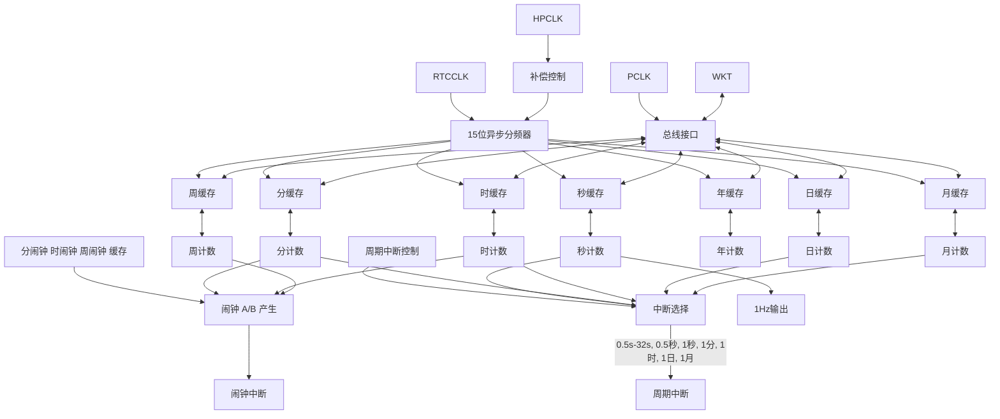

图 13-1 RTC 框图

### 13.3.2 上电设定

RTC 在上电之后复位一次，在系统不掉电的情况下，外部各种复位请求都不能复位 RTC，RTC 会一直处于计数状态。在上电之后，设定日历初始值、闹钟设置、误差补偿、中断等之后，启动 RTC。

### 13.3.3 时钟误差补偿

由于外部晶振存在误差，在需要得到高精度的计数结果时，需要对该误差进行补偿。补偿方法分为两种：第一种，基于自身时钟的误差补偿（0.96ppm 或 0.06ppm 精度）；第二种，基于高速时钟的误差补偿。

#### 基于自身时钟的误差补偿原理与计算（0.96ppm）

由于计数器采用 32.768kHz 的时钟计数，如果需要对每秒精度进行补偿时，只能按照 32.768kHz 的整数周期补偿，则每秒补偿的最小单位为（1/32768）✕10⁶=30.5ppm，无法满足高精度的要求。

那么要在 32.768kHz 的计数时钟下实现精度较高的时钟补偿时，需要在算法上做调整，将最大补偿周期扩大 32 倍。即在只能补偿的最小单位为 30.5ppm 的情况下，平均到每秒的补偿单位变为 30.5ppm/32=0.96ppm。为了满足精度较高的时钟补偿要求，且补偿发生在每 32 秒内比较均匀的范围内，该寄存器中引入了 5 位小数的设定。

举个例子：当默认状态下直接输出 1Hz 时钟，通过测定该时钟的精度，计算补偿目标值。
假设实际测定值为 0.9999888Hz，则：

```
实际发振频率 = 32768 ✕ 0.9999888 ≈ 32767.63
补偿目标值 =（实际发振频率 - 目标频率） / 目标频率 ✕ 10⁶
           =（32767.63 - 32768） / 32768 ✕ 10⁶
           = -11.29ppm
```

根据公式：

$$ CR[8:0] = \left( \frac{\text{补偿目标值 [ppm]} \times 2^{15}}{10^6} \right)_{\text{取2的补码}} + 0001.00000B $$

如果补偿目标值为-11.29ppm，计算相应的寄存器值如下：

$$ \begin{aligned} CR[8:0] &= (-11.29 \times 2^{15} / 10^6)_{\text{取 2 的补码}} + 0001.00000B \\ &= (-0.37)_{\text{取 2 的补码}} + 0001.00000B \\ &= 1111.10101B + 0001.00000B \\ &= 0000.10101B \end{aligned} $$

#### 基于自身时钟的误差补偿原理与计算（0.06ppm）

实现 0.06ppm 补偿精度需要将最大补偿周期扩大 512 倍。则在只能补偿的最小单位为 30.5ppm 的情况下，平均到每秒的补偿单位变为 30.5ppm/512=0.06ppm。满足了精度较高的时钟补偿要求。而且补偿发生在每 512 秒内比较均匀的范围内。所以，该寄存器中引入了 9 位小数的设定。

举个例子：当默认状态下直接输出 1Hz 时钟，通过测定该时钟的精度，计算补偿目标值。
假设实际测定值为 0.9999888Hz，则：

```
实际发振频率 = 32768 ✕ 0.9999888 ≈ 32767.63
补偿目标值 =（实际发振频率 - 目标频率） / 目标频率 ✕ 10⁶
           =（32767.63 - 32768） / 32768 ✕ 10⁶
           = -11.29ppm
```

根据公式：

$$ CR[12:0] = \left( \frac{\text{补偿目标值 [ppm]} \times 2^{15}}{10^6} \right)_{\text{取2的补码}} + 0001.000000000B $$

如果补偿目标值为-11.29ppm，计算相应的寄存器值如下：

$$ \begin{aligned} CR[12:0] &= (-11.29 \times 2^{15} / 10^6)_{\text{取 2 的补码}} + 0001.000000000B \\ &= (-0.37)_{\text{取 2 的补码}} + 0001.000000000B \end{aligned} $$

= 1111.101000011B + 0001.000000000B

= 0000.101000011B

### 基于高速时钟的误差补偿原理与计算

该方式的计算方法与基于自身时钟的误差补偿相同。由于引入了高速时钟，本来需要在最多 32 秒内累计的 1/32768 秒误差可分散到每 1 秒，针对每 1 秒进行的补偿，实现平均的每秒高精度 1Hz 时钟输出。

需要根据频率设定正确的高速补偿参数值 RTC_HCOMP.PARA。

RTC_HCOMP.PARA = f/32768/32

f 为补偿频率，建议配置为 32.768kHz 的整数倍：

* 0.06ppm 补偿精度：f 取值范围是 16~48MHz。

* 0.96ppm 补偿精度：f 取值范围是 4~48MHz。

### 13.3.4 时间戳功能

将 RTC_CR2 寄存器的 TSE 位置 1 可使能时间戳。

当在 RTC_TS 引脚上检测到时间戳事件时，日历会保存到时间戳寄存器（RTC_TSTR 和 RTC_TSDR）中。

发生时间戳事件时，RTC_IFR 寄存器中的时间戳标志位（TS）将置 1。

通过将 RTC_IER 寄存器中的 TS 位置 1，可在发生入侵检测事件时生成中断。

如果在时间戳标志（TS）已置 1 的条件下检测到新的时间戳事件，则时间戳上溢标志（TSOV）将置 1，而时间戳寄存器（RTC_TSTR 和 RTC_TSDR）将保持上一事件的结果。

### 13.3.5 唤醒定时器

周期性唤醒标志由 16 位可编程自动重载递减计数器生成。可通过 RTC_CR2 寄存器中的 WUTE 位来使能此唤醒功能。

唤醒定时器的时钟输入可以是：

* 2、4、8 或 16 分频的 RTC 时钟（RTCCLK）。

* 1、2、4 或 8 分频的秒脉冲。

完成初始化后，定时器开始递减计数。在低功耗模式下使能唤醒功能时，递减计数保持有效。此外，当计数器计数到 0 时，RTC_IFR 寄存器的 WU 标志会置 1，并且唤醒寄存器会使用 RTC_WUTR 寄存器的值自动重载。

之后必须用软件清零 WU 标志。

暂停唤醒定时器不会产生重载动作，需要重新定时需要对 RTC_WUTR 寄存器产生一个写动作。

通过将 RTC_IER 寄存器中的 WU 位置 1 来使能周期性唤醒中断时，它会使器件退出低功耗模式。

系统复位以及低功耗模式（睡眠、停机和待机）对唤醒定时器没有任何影响。

在 RTC 计数开始后，如果系统要进入低功耗模式，需要确保已经将寄存器的信息同步到 RTC，请执行下列任意一种确认后再进行模式切换。

* 在配置完 RTC 寄存器后，经过 2 个以上的 RTC 计数时钟后再进行模式切换。

* 在配置完 RTC 寄存器后，设定 RTC_CR1.WAIT=1，查询 RTC_CR1.WAITF=1。再设定 RTC_CR1.WAIT=0，查询 RTC_CR1.WAITF=0 后再进行模式切换。

### 13.3.6 RTC 中断

RTC 支持 4 种中断类型。闹钟 A/B 中断、周期中断、时间戳中断与唤醒定时器中断。

#### 闹钟 A/B 中断

当 RTC_IER.ALMx=1 时，若当前日历时间与闹钟寄存器相等时，触发闹钟中断。通过设置 MSK 相关位可以屏蔽相应闹钟时间位的比较。

# 周期中断
当 RTC_IER.PRD=1 时，选择的周期发生后，触发定周期中断，由于共用中断，通过标志寄存器位来区分。

# 唤醒定时器中断
当 RTC_IER.WU=1 时，唤醒定时器计数器计数到零，触发中断，由于共用中断，通过标志寄存器位来区分。

# 时间戳中断
当 RTC_IER.TS=1 时，发生时间戳触发时，产生中断，由于共用中断，通过标志寄存器位来区分。

## 13.4 操作示例
### 13.4.1 RTC 计数开始设置
#### 操作步骤
步骤 1. 设置 RTC_CR0.START=0，计数停止。
步骤 2. 设置 RTC_CR0.AMPM 和 RTC_CR0.PRDS，RTC_CR0.PRDX 配置时制和中断周期。
步骤 3. 设置 RTC_CR1.CKSEL 选择 RTC 的计时时钟。
步骤 4. 设置秒、分、时、周、日、月、年的日历计数寄存器。
步骤 5. 需要进行时钟误差补偿时，设置计数时钟误差补偿寄存器 RTC_COMPEN。
步骤 6. 清除中断标志位寄存器 RTC_IFR，并使能中断。
步骤 7. 设置 RTC_CR0.START=1，计数开始。

### 13.4.2 读出计数寄存器
#### 背景信息
有三种读取计数寄存器的方法。
#### 操作步骤
* ● 任意时刻读取方式 1
  步骤 1. 设置 RTC_CR1.WAIT=1，停止日历寄存器计数，进入读写模式。
  步骤 2. 查询直到 RTC_CR1.WAITF=1。
  步骤 3. 读出秒、分、时、周、日、月、年计数寄存器值。
  步骤 4. 设置 RTC_CR1.WAIT=0，计数器计数。
  步骤 5. 查询直到 RTC_CR1.WAITF=0。
* ● 任意时刻读取方式 2
  步骤 1. 读出分、时、周、日、月、年计数寄存器值。
  步骤 2. 读出秒计数寄存器值。
  步骤 3. 再次读出秒计数寄存器值。
  步骤 4. 判断两次秒的读出值是否相同，不同重新从第一步开始，相同读取结束。
* ● 中断读取方式
  在 RTC 周期中断服务中读取秒、分、时、周、日、月、年计数寄存器值。因为中断发生后到下次数据改变至少 0.5s 的时间。

### 13.4.3 写入计数寄存器
#### 背景信息
在计数模式下更改秒寄存器会复位秒计数，写分、时、周、日、月、年计数寄存器值不会影响 RTC 计数。

> >  **说明**
> > RTC 寄存器带有写保护，参考 RTC_WPR 寄存器解除写保护后才可以写入。
> > 在 RTC 未启动模式下写秒、分、时、周、日、月、年计数寄存器不需要等 WAIT。

# 操作步骤

**步骤 1.** 设定 RTC_CR1.WAIT=1，停止日历寄存器计数，进入读写模式。

**步骤 2.** 查询直到 RTC_CR1.WAITF=1。

**步骤 3.** 写入秒、分、时、周、日、月、年计数寄存器值。

> >  **注意**
> > 必须在 1 秒内完成所有写操作。

**步骤 4.** 设定 RTC_CR1.WAIT=0，计数器重新开始计数。

**步骤 5.** 查询直到 RTC_CR1.WAITF=0。

## 13.4.4 闹钟设定

### 操作步骤

**步骤 1.** 设定 RTC_CR2.ALMxE=0，闹钟禁止。

**步骤 2.** 设定 RTC_IER.ALMx=1，闹钟中断许可。

**步骤 3.** 闹钟 RTC_ALMx 设定，根据需要配置闹钟时间。

**步骤 4.** 设定 RTC_CR2.ALMxE=1，闹钟许可。

**步骤 5.** 等待发生中断。

**步骤 6.** 由于闹钟中断和定周期中断共用中断请求信号，则当 RTC_IFR.ALMx=1 时，进入闹钟中断处理；否则进入定周期中断处理。

## 13.4.5 1Hz 输出

### 背景信息

RTC 可选择输出一般精度，较高精度和高精度 3 种 1Hz 时钟。当时钟误差补偿功能有效时输出较高精度的 1Hz 时钟；当使用不同频率的 PCLK 时输出高精度的 1Hz 时钟。需要根据 PCLK 频率配置系统控制寄存器，三种 1Hz 输出方法如下：

### 操作步骤

* 一般精度的 1Hz 输出（无时钟补偿）
        - **步骤 1.** 设定 RTC_CR0.START=0，计数停止。
        - **步骤 2.** RTC 输出引脚设定。
        - **步骤 3.** 设定 RTC_CR0.HZ1OE=1，时钟输出许可。
        - **步骤 4.** 设定 RTC_CR0.START=1，计数开始。
        - **步骤 5.** 等待 2 个计数周期以上。
        - **步骤 6.** 1Hz 输出开始。

* 较高精度的 1Hz 输出（低速补偿）
        - **步骤 1.** 设定 RTC_CR0.START=0，计数停止。
        - **步骤 2.** RTC 输出引脚设定。
        - **步骤 3.** 设定 RTC_CR0.HZ1OE=1，时钟输出许可。
        - **步骤 4.** 配置 RTC_COMPEN.CR，设定补偿数。
        - **步骤 5.** 设定 RTC_COMPEN.EN=1，误差补偿有效。
        - **步骤 6.** 设定 RTC_CR0.START=1，计数开始。
        - **步骤 7.** 等待 2 个计数周期以上。
        - **步骤 8.** 1Hz 输出开始。

* 高精度的 1Hz 输出（在较高精度输出的基础上，为 RTC 提供高速 PCLK 时钟）
        - **步骤 1.** 设定 RTC_CR0.START=0，计数停止。
        - **步骤 2.** RTC 输出引脚设定。

**步骤 3.** 设定 RTC_CR0.HZ1OE=1，时钟输出许可。

**步骤 4.** 设定 RTC_CR0.HZ1SEL=1，选择输出高精度 1Hz 时钟。

**步骤 5.** 根据配置的频率设定高速补偿参数 RTC_HCOMP.PARA。

**步骤 6.** 配置 RTC_COMPEN.CR[12:0]，设定补偿数。

**步骤 7.** 设定 RTC_COMPEN.EN=1，误差补偿有效。

**步骤 8.** 设定 RTC_COMPEN.CSTEPS=0，0.96ppm 精度补偿有效；或设定 RTC_COMPEN.CSTEPS=1，0.06ppm 精度补偿有效。

**步骤 9.** 设定 RTC_CR0.START=1，计数开始。

**步骤 10.** 等待 2 个计数周期以上。

**步骤 11.** 1Hz 输出开始。

# 13.5 寄存器

## 13.5.1 寄存器总表

**基地址**：0x40001400

表 13-2 实时时钟（RTC）寄存器偏移地址


<table>
  <thead>
    <tr>
        <th>偏移地址</th>
        <th>寄存器</th>
        <th>描述</th>
    </tr>
  </thead>
  <tbody>
    <tr>
        <td>0x000</td>
        <td>RTC_CR0</td>
        <td>控制寄存器 0</td>
    </tr>
    <tr>
        <td>0x004</td>
        <td>RTC_CR1</td>
        <td>控制寄存器 1</td>
    </tr>
    <tr>
        <td>0x008</td>
        <td>RTC_SEC</td>
        <td>秒计数寄存器</td>
    </tr>
    <tr>
        <td>0x00C</td>
        <td>RTC_MIN</td>
        <td>分计数寄存器</td>
    </tr>
    <tr>
        <td>0x010</td>
        <td>RTC_HOUR</td>
        <td>时计数寄存器</td>
    </tr>
    <tr>
        <td>0x014</td>
        <td>RTC_WEEK</td>
        <td>周计数寄存器</td>
    </tr>
    <tr>
        <td>0x018</td>
        <td>RTC_DAY</td>
        <td>日计数寄存器</td>
    </tr>
    <tr>
        <td>0x01C</td>
        <td>RTC_MON</td>
        <td>月计数寄存器</td>
    </tr>
    <tr>
        <td>0x020</td>
        <td>RTC_YEAR</td>
        <td>年计数寄存器</td>
    </tr>
    <tr>
        <td>0x030</td>
        <td>RTC_COMPEN</td>
        <td>时钟误差补偿寄存器</td>
    </tr>
    <tr>
        <td>0x034</td>
        <td>RTC_HCOMP</td>
        <td>高速补偿精度参数寄存器</td>
    </tr>
    <tr>
        <td>0x03C</td>
        <td>RTC_CR2</td>
        <td>控制寄存器 2</td>
    </tr>
    <tr>
        <td>0x040</td>
        <td>RTC_ALMA</td>
        <td>闹钟 A 寄存器</td>
    </tr>
    <tr>
        <td>0x044</td>
        <td>RTC_ALMB</td>
        <td>闹钟 B 寄存器</td>
    </tr>
    <tr>
        <td>0x048</td>
        <td>RTC_TSTR</td>
        <td>时间戳时间寄存器</td>
    </tr>
    <tr>
        <td>0x04C</td>
        <td>RTC_TSDR</td>
        <td>时间戳日期寄存器</td>
    </tr>
    <tr>
        <td>0x050</td>
        <td>RTC_WUTR</td>
        <td>唤醒定时器寄存器</td>
    </tr>
    <tr>
        <td>0x054</td>
        <td>RTC_IER</td>
        <td>中断使能寄存器</td>
    </tr>
    <tr>
        <td>0x058</td>
        <td>RTC_IFR</td>
        <td>中断标志寄存器</td>
    </tr>
    <tr>
        <td>0x05C</td>
        <td>RTC_ICR</td>
        <td>中断清除寄存器</td>
    </tr>
    <tr>
        <td>0x060</td>
        <td>RTC_WPR</td>
        <td>保护寄存器</td>
    </tr>
  </tbody>
</table>

## 13.5.2 控制寄存器 0（RTC_CR0）


<table>
  <thead>
    <tr>
        <th>Offset</th>
        <th colspan="32">Bit Position</th>
    </tr>
    <tr>
        <th>0x000</th>
        <th>31</th>
        <th>30</th>
        <th>29</th>
        <th>28</th>
        <th>27</th>
        <th>26</th>
        <th>25</th>
        <th>24</th>
        <th>23</th>
        <th>22</th>
        <th>21</th>
        <th>20</th>
        <th>19</th>
        <th>18</th>
        <th>17</th>
        <th>16</th>
        <th>15</th>
        <th>14</th>
        <th>13</th>
        <th>12</th>
        <th>11</th>
        <th>10</th>
        <th>9</th>
        <th>8</th>
        <th>7</th>
        <th>6</th>
        <th>5</th>
        <th>4</th>
        <th>3</th>
        <th>2</th>
        <th>1</th>
        <th>0</th>
    </tr>
    <tr>
        <th>Reset</th>
        <th colspan="32">0x00000000（只有上电与模块复位对该寄存器复位有效）</th>
    </tr>
    <tr>
        <th>Name</th>
        <th colspan="17">Reserved</th>
        <th>PRDSEL</th>
        <th colspan="6">PRDX</th>
        <th>START</th>
        <th>HZ1SEL</th>
        <th>HZ1OE</th>
        <th>Reserved</th>
        <th>AMPM</th>
        <th colspan="3">PRDS</th>
    </tr>
    <tr>
        <th>Access</th>
        <th colspan="17"> </th>
        <th>RW</th>
        <th colspan="6">RW</th>
        <th>RW</th>
        <th>RW</th>
        <th>RW</th>
        <th> </th>
        <th>RW</th>
        <th colspan="3">RW</th>
    </tr>
  </thead>
</table>
<table>
  <thead>
    <tr>
        <th>位/位域</th>
        <th>标记</th>
        <th>位名</th>
        <th>功能描述</th>
        <th>读写</th>
    </tr>
  </thead>
  <tbody>
    <tr>
        <td>31:15</td>
        <td>Reserved</td>
        <td>保留</td>
        <td>-</td>
        <td>-</td>
    </tr>
    <tr>
        <td>14</td>
        <td>PRDSEL</td>
        <td>周期中断源选择</td>
        <td>● 0b0：使用 PRDS 所设定的周期中断时间间隔<br/>● 0b1：使用 PRDX 所设定的周期中断时间间隔</td>
        <td>RW</td>
    </tr>
    <tr>
        <td>13:8</td>
        <td>PRDX</td>
        <td>设置产生周期中断的时间间隔</td>
        <td>可设定的范围为 0.5 秒到 32 秒，步进为 0.5 秒。<br/>● 0b000000：0.5 秒<br/>● 0b000001：1 秒<br/>● ……<br/>● 0b111110：31.5 秒<br/>● 0b111111：32 秒</td>
        <td>RW</td>
    </tr>
    <tr>
        <td>7</td>
        <td>START</td>
        <td>RTC 计数使能</td>
        <td>● 0b0：停止 RTC 计数器<br/>● 0b1：使能 RTC 计数器</td>
        <td>RW</td>
    </tr>
    <tr>
        <td>6</td>
        <td>HZ1SEL</td>
        <td>1Hz 输出选择</td>
        <td>● 0b0：普通精度 1Hz 输出<br/>● 0b1：高精度 1Hz 输出</td>
        <td>RW</td>
    </tr>
    <tr>
        <td>5</td>
        <td>HZ1OE</td>
        <td>1Hz 输出使能</td>
        <td>● 0b0：禁止 1Hz 输出<br/>● 0b1：使能 1Hz 输出</td>
        <td>RW</td>
    </tr>
    <tr>
        <td>4</td>
        <td>Reserved</td>
        <td>保留</td>
        <td>-</td>
        <td>-</td>
    </tr>
    <tr>
        <td>3</td>
        <td>AMPM</td>
        <td>时制选择</td>
        <td>● 0b0：12 小时制<br/>● 0b1：24 小时制</td>
        <td>RW</td>
    </tr>
    <tr>
        <td>2:0</td>
        <td>PRDS</td>
        <td>设置产生中断的时间间隔</td>
        <td>● 0b000：不产生周期中断<br/>● 0b001：0.5 秒<br/>● 0b010：1 秒<br/>● 0b011：1 分钟<br/>● 0b100：1 小时<br/>● 0b101：1 天<br/>● 0b110/0b111：1 月<br/>⚠️ **注意**<br/>如需要在 START=1 时写入更改周期中断的时间间隔，操作步骤如下：<br/>1. 在 NVIC 中关闭 RTC 中断；<br/>2. 更改周期中断的时间间隔；<br/>3. 清除 RTC 中断标志；<br/>4. 使能 RTC 中断。</td>
        <td>RW</td>
    </tr>
  </tbody>
</table>

### 13.5.3 控制寄存器 1（RTC_CR1）


<table>
  <thead>
    <tr>
        <th>Offset</th>
        <th colspan="32">Bit Position</th>
    </tr>
    <tr>
        <th>0x004</th>
        <th>31</th>
        <th>30</th>
        <th>29</th>
        <th>28</th>
        <th>27</th>
        <th>26</th>
        <th>25</th>
        <th>24</th>
        <th>23</th>
        <th>22</th>
        <th>21</th>
        <th>20</th>
        <th>19</th>
        <th>18</th>
        <th>17</th>
        <th>16</th>
        <th>15</th>
        <th>14</th>
        <th>13</th>
        <th>12</th>
        <th>11</th>
        <th>10</th>
        <th>9</th>
        <th>8</th>
        <th>7</th>
        <th>6</th>
        <th>5</th>
        <th>4</th>
        <th>3</th>
        <th>2</th>
        <th>1</th>
        <th>0</th>
    </tr>
    <tr>
        <th>Reset</th>
        <th colspan="32">0x00000000（只有上电与模块复位对该寄存器复位有效）</th>
    </tr>
    <tr>
        <th>Name</th>
        <th colspan="21">Reserved</th>
        <th colspan="3">CKSEL</th>
        <th colspan="6">Reserved</th>
        <th>WAITF</th>
        <th>WAIT</th>
    </tr>
    <tr>
        <th>Access</th>
        <th colspan="21"> </th>
        <th colspan="3">RW</th>
        <th colspan="6"> </th>
        <th>RO</th>
        <th>RW</th>
    </tr>
  </thead>
</table>
<table>
  <thead>
    <tr>
        <th>位/位域</th>
        <th>标记</th>
        <th>位名</th>
        <th>功能描述</th>
        <th>读写</th>
    </tr>
  </thead>
  <tbody>
    <tr>
        <td>31:11</td>
        <td>Reserved</td>
        <td>保留</td>
        <td>-</td>
        <td>-</td>
    </tr>
    <tr>
        <td>10:8</td>
        <td>CKSEL</td>
        <td>RTC 时钟选择</td>
        <td>● 0b000/0b001：XTL 32.768k<br/>● 0b010/0b011：RCL 32k<br/>● 其他：禁止设置</td>
        <td>RW</td>
    </tr>
    <tr>
        <td>7:2</td>
        <td>Reserved</td>
        <td>保留</td>
        <td>-</td>
        <td>-</td>
    </tr>
    <tr>
        <td>1</td>
        <td>WAITF</td>
        <td>读写等待有效标志</td>
        <td>● 0b0：非写入/读出状态<br/>● 0b1：写入/读出状态<br/>**注意**<br/>WAIT 位设定是否有效标志。在写入/读出前请确认该位是否为“1”。计数过程中，在 WAIT 位清“0”后等待写入完成后该位才清“0”。</td>
        <td>RO</td>
    </tr>
    <tr>
        <td>0</td>
        <td>WAIT</td>
        <td>读写等待设定</td>
        <td>● 0b0：正常计数模式<br/>● 0b1：写入/读出模式<br/>**注意**<br/>在写入/读出时请将该位置“1”，由于计数器在连续计数，请在 1 秒的时间内完成写入/读出操作并将该位清“0”。</td>
        <td>RW</td>
    </tr>
  </tbody>
</table>

### 13.5.4 秒计数寄存器（RTC_SEC）


<table>
  <thead>
    <tr>
        <th>Offset</th>
        <th colspan="32">Bit Position</th>
    </tr>
    <tr>
        <th rowspan="4">0x008</th>
        <th>31</th>
        <th>30</th>
        <th>29</th>
        <th>28</th>
        <th>27</th>
        <th>26</th>
        <th>25</th>
        <th>24</th>
        <th>23</th>
        <th>22</th>
        <th>21</th>
        <th>20</th>
        <th>19</th>
        <th>18</th>
        <th>17</th>
        <th>16</th>
        <th>15</th>
        <th>14</th>
        <th>13</th>
        <th>12</th>
        <th>11</th>
        <th>10</th>
        <th>9</th>
        <th>8</th>
        <th>7</th>
        <th>6</th>
        <th>5</th>
        <th>4</th>
        <th>3</th>
        <th>2</th>
        <th>1</th>
        <th>0</th>
    </tr>
    <tr>
        <th colspan="32">0xXXXXXXXX</th>
    </tr>
    <tr>
        <th colspan="25">Reserved</th>
        <th colspan="3">SECH</th>
        <th colspan="4">SECL</th>
    </tr>
    <tr>
        <th colspan="3">RW</th>
        <th colspan="4">RW</th>
        <th colspan="25"></th>
    </tr>
  </thead>
</table>
<table>
  <thead>
    <tr>
        <th>位/位域</th>
        <th>标记</th>
        <th>位名</th>
        <th>功能描述</th>
        <th>读写</th>
    </tr>
  </thead>
  <tbody>
    <tr>
        <td>31:7</td>
        <td>Reserved</td>
        <td>保留</td>
        <td>-</td>
        <td>-</td>
    </tr>
    <tr>
        <td>6:4</td>
        <td>SECH</td>
        <td>秒计数十位值</td>
        <td>秒十位计数值 BCD 码</td>
        <td>RW</td>
    </tr>
    <tr>
        <td>3:0</td>
        <td>SECL</td>
        <td>秒计数个位值</td>
        <td>秒个位计数值 BCD 码</td>
        <td>RW</td>
    </tr>
  </tbody>
</table>

表示 0~59 秒，采用十进制计数。请写入十进制 0~59 的 BCD 码，写入超出范围的值将被忽略。

### 13.5.5 分计数寄存器（RTC_MIN）


<table>
  <thead>
    <tr>
        <th>Offset</th>
        <th colspan="32">Bit Position</th>
    </tr>
    <tr>
        <th rowspan="4">0x00C</th>
        <th>31</th>
        <th>30</th>
        <th>29</th>
        <th>28</th>
        <th>27</th>
        <th>26</th>
        <th>25</th>
        <th>24</th>
        <th>23</th>
        <th>22</th>
        <th>21</th>
        <th>20</th>
        <th>19</th>
        <th>18</th>
        <th>17</th>
        <th>16</th>
        <th>15</th>
        <th>14</th>
        <th>13</th>
        <th>12</th>
        <th>11</th>
        <th>10</th>
        <th>9</th>
        <th>8</th>
        <th>7</th>
        <th>6</th>
        <th>5</th>
        <th>4</th>
        <th>3</th>
        <th>2</th>
        <th>1</th>
        <th>0</th>
    </tr>
    <tr>
        <th colspan="32">0xXXXXXXXX</th>
    </tr>
    <tr>
        <th colspan="25">Reserved</th>
        <th colspan="3">MINH</th>
        <th colspan="4">MINL</th>
    </tr>
    <tr>
        <th colspan="3">RW</th>
        <th colspan="4">RW</th>
        <th colspan="25"></th>
    </tr>
  </thead>
</table>
<table>
  <thead>
    <tr>
        <th>位/位域</th>
        <th>标记</th>
        <th>位名</th>
        <th>功能描述</th>
        <th>读写</th>
    </tr>
  </thead>
  <tbody>
    <tr>
        <td>31:7</td>
        <td>Reserved</td>
        <td>保留</td>
        <td>-</td>
        <td>-</td>
    </tr>
    <tr>
        <td>6:4</td>
        <td>MINH</td>
        <td>分计数十位值</td>
        <td>分十位计数值 BCD 码</td>
        <td>RW</td>
    </tr>
    <tr>
        <td>3:0</td>
        <td>MINL</td>
        <td>分计数个位值</td>
        <td>分个位计数值 BCD 码</td>
        <td>RW</td>
    </tr>
  </tbody>
</table>

表示 0~59 分，采用十进制计数。请写入十进制 0~59 的 BCD 码，写入超出范围的值将被忽略。

### 13.5.6 时计数寄存器（RTC_HOUR）


<table>
  <thead>
    <tr>
        <th>Offset</th>
        <th colspan="32">Bit Position</th>
    </tr>
    <tr>
        <th>0x010</th>
        <th>31</th>
        <th>30</th>
        <th>29</th>
        <th>28</th>
        <th>27</th>
        <th>26</th>
        <th>25</th>
        <th>24</th>
        <th>23</th>
        <th>22</th>
        <th>21</th>
        <th>20</th>
        <th>19</th>
        <th>18</th>
        <th>17</th>
        <th>16</th>
        <th>15</th>
        <th>14</th>
        <th>13</th>
        <th>12</th>
        <th>11</th>
        <th>10</th>
        <th>9</th>
        <th>8</th>
        <th>7</th>
        <th>6</th>
        <th>5</th>
        <th>4</th>
        <th>3</th>
        <th>2</th>
        <th>1</th>
        <th>0</th>
    </tr>
    <tr>
        <th>Reset</th>
        <th colspan="32">0xXXXXXXXX</th>
    </tr>
    <tr>
        <th>Name</th>
        <th colspan="26">Reserved</th>
        <th colspan="2">HOURH</th>
        <th colspan="4">HOURL</th>
    </tr>
    <tr>
        <th>Access</th>
        <th colspan="26"> </th>
        <th colspan="2">RW</th>
        <th colspan="4">RW</th>
    </tr>
  </thead>
</table>
<table>
  <thead>
    <tr>
        <th>位/位域</th>
        <th>标记</th>
        <th>位名</th>
        <th>功能描述</th>
        <th>读写</th>
    </tr>
  </thead>
  <tbody>
    <tr>
        <td>31:6</td>
        <td>Reserved</td>
        <td>保留</td>
        <td>-</td>
        <td>-</td>
    </tr>
    <tr>
        <td>5:4</td>
        <td>HOURH</td>
        <td>时计数十位值</td>
        <td>时十位计数值 BCD 码</td>
        <td>RW</td>
    </tr>
    <tr>
        <td>3:0</td>
        <td>HOURL</td>
        <td>时计数个位值</td>
        <td>时个位计数值 BCD 码</td>
        <td>RW</td>
    </tr>
  </tbody>
</table>

24 小时时制时，表示 0~23 小时。

12 小时时制时，表示 0~12 小时。Bit5=0 表示 AM，则 01~12 表示上午；Bit5=1 表示 PM，则 21~32 表示下午。

请根据控制位 RTC_CR0.AMPM 的值，设定正确的十进制的 BCD 码，写入超出范围的值将被忽略。
具体时间取值可参考下表：


<table>
  <thead>
    <tr>
        <th colspan="2">24 小时时制（AMPM=1）</th>
        <th colspan="2">12 小时时制（AMPM=0）</th>
    </tr>
    <tr>
        <th>时间</th>
        <th>寄存器值</th>
        <th>时间</th>
        <th>寄存器值</th>
    </tr>
  </thead>
  <tbody>
    <tr>
        <td>00 时</td>
        <td>0x00</td>
        <td>AM 12 时</td>
        <td>0x12</td>
    </tr>
    <tr>
        <td>01 时</td>
        <td>0x01</td>
        <td>AM 01 时</td>
        <td>0x01</td>
    </tr>
    <tr>
        <td>02 时</td>
        <td>0x02</td>
        <td>AM 02 时</td>
        <td>0x02</td>
    </tr>
    <tr>
        <td>03 时</td>
        <td>0x03</td>
        <td>AM 03 时</td>
        <td>0x03</td>
    </tr>
    <tr>
        <td>04 时</td>
        <td>0x04</td>
        <td>AM 04 时</td>
        <td>0x04</td>
    </tr>
    <tr>
        <td>05 时</td>
        <td>0x05</td>
        <td>AM 05 时</td>
        <td>0x05</td>
    </tr>
    <tr>
        <td>06 时</td>
        <td>0x06</td>
        <td>AM 06 时</td>
        <td>0x06</td>
    </tr>
    <tr>
        <td>07 时</td>
        <td>0x07</td>
        <td>AM 07 时</td>
        <td>0x07</td>
    </tr>
    <tr>
        <td>08 时</td>
        <td>0x08</td>
        <td>AM 08 时</td>
        <td>0x08</td>
    </tr>
    <tr>
        <td>09 时</td>
        <td>0x09</td>
        <td>AM 09 时</td>
        <td>0x09</td>
    </tr>
    <tr>
        <td>10 时</td>
        <td>0x10</td>
        <td>AM 10 时</td>
        <td>0x10</td>
    </tr>
    <tr>
        <td>11 时</td>
        <td>0x11</td>
        <td>AM 11 时</td>
        <td>0x11</td>
    </tr>
    <tr>
        <td>12 时</td>
        <td>0x12</td>
        <td>PM 12 时</td>
        <td>0x32</td>
    </tr>
    <tr>
        <td>13 时</td>
        <td>0x13</td>
        <td>PM 01 时</td>
        <td>0x21</td>
    </tr>
    <tr>
        <td>14 时</td>
        <td>0x14</td>
        <td>PM 02 时</td>
        <td>0x22</td>
    </tr>
    <tr>
        <td>15 时</td>
        <td>0x15</td>
        <td>PM 03 时</td>
        <td>0x23</td>
    </tr>
    <tr>
        <td>16 时</td>
        <td>0x16</td>
        <td>PM 04 时</td>
        <td>0x24</td>
    </tr>
    <tr>
        <td>17 时</td>
        <td>0x17</td>
        <td>PM 05 时</td>
        <td>0x25</td>
    </tr>
    <tr>
        <td>18 时</td>
        <td>0x18</td>
        <td>PM 06 时</td>
        <td>0x26</td>
    </tr>
    <tr>
        <td>19 时</td>
        <td>0x19</td>
        <td>PM 07 时</td>
        <td>0x27</td>
    </tr>
  </tbody>
</table>

<table>
  <thead>
    <tr>
        <th colspan="2">24 小时时制（AMPM=1）</th>
    </tr>
    <tr>
        <th>时间</th>
        <th>寄存器值</th>
    </tr>
  </thead>
  <tbody>
    <tr>
        <td>20 时</td>
        <td>0x20</td>
    </tr>
    <tr>
        <td>21 时</td>
        <td>0x21</td>
    </tr>
    <tr>
        <td>22 时</td>
        <td>0x22</td>
    </tr>
    <tr>
        <td>23 时</td>
        <td>0x23</td>
    </tr>
  </tbody>
</table>
<table>
  <thead>
    <tr>
        <th colspan="2">12 小时时制（AMPM=0）</th>
    </tr>
    <tr>
        <th>时间</th>
        <th>寄存器值</th>
    </tr>
  </thead>
  <tbody>
    <tr>
        <td>PM 08 时</td>
        <td>0x28</td>
    </tr>
    <tr>
        <td>PM 09 时</td>
        <td>0x29</td>
    </tr>
    <tr>
        <td>PM 10 时</td>
        <td>0x30</td>
    </tr>
    <tr>
        <td>PM 11 时</td>
        <td>0x31</td>
    </tr>
  </tbody>
</table>

### 13.5.7 日计数寄存器（RTC_DAY）


<table>
  <thead>
    <tr>
        <th>Offset</th>
        <th colspan="32">Bit Position</th>
    </tr>
    <tr>
        <th>0x018</th>
        <th>31</th>
        <th>30</th>
        <th>29</th>
        <th>28</th>
        <th>27</th>
        <th>26</th>
        <th>25</th>
        <th>24</th>
        <th>23</th>
        <th>22</th>
        <th>21</th>
        <th>20</th>
        <th>19</th>
        <th>18</th>
        <th>17</th>
        <th>16</th>
        <th>15</th>
        <th>14</th>
        <th>13</th>
        <th>12</th>
        <th>11</th>
        <th>10</th>
        <th>9</th>
        <th>8</th>
        <th>7</th>
        <th>6</th>
        <th>5</th>
        <th>4</th>
        <th>3</th>
        <th>2</th>
        <th>1</th>
        <th>0</th>
    </tr>
    <tr>
        <th>Reset</th>
        <th colspan="32">0xXXXXXXXX</th>
    </tr>
    <tr>
        <th>Name</th>
        <th colspan="26">Reserved</th>
        <th colspan="2">DAYH</th>
        <th colspan="4">DAYL</th>
    </tr>
    <tr>
        <th>Access</th>
        <th colspan="26"> </th>
        <th colspan="2">RW</th>
        <th colspan="4">RW</th>
    </tr>
  </thead>
</table>
<table>
  <thead>
    <tr>
        <th>位/位域</th>
        <th>标记</th>
        <th>位名</th>
        <th>功能描述</th>
        <th>读写</th>
    </tr>
  </thead>
  <tbody>
    <tr>
        <td>31:6</td>
        <td>Reserved</td>
        <td>保留</td>
        <td>-</td>
        <td>-</td>
    </tr>
    <tr>
        <td>5:4</td>
        <td>DAYH</td>
        <td>日计数十位值</td>
        <td>日十位计数值 BCD 码</td>
        <td>RW</td>
    </tr>
    <tr>
        <td>3:0</td>
        <td>DAYL</td>
        <td>日计数个位值</td>
        <td>日个位计数值 BCD 码</td>
        <td>RW</td>
    </tr>
  </tbody>
</table>

表示 1~31 日，采用十进制计数，自动计算闰年和月份。请写入十进制 1~31 的 BCD 码，写入超出范围的值将被忽略。

具体日计数取值可参考下表：


<table>
  <thead>
    <tr>
        <th>月份</th>
        <th>日计数值</th>
    </tr>
  </thead>
  <tbody>
    <tr>
        <td>2 月（普通年）</td>
        <td>01~28</td>
    </tr>
    <tr>
        <td>2 月（闰年）</td>
        <td>01~29</td>
    </tr>
    <tr>
        <td>4、6、9、11 月</td>
        <td>01~30</td>
    </tr>
    <tr>
        <td>1、3、5、7、8、10、12 月</td>
        <td>01~31</td>
    </tr>
  </tbody>
</table>

### 13.5.8 周计数寄存器（RTC_WEEK）


<table>
  <thead>
    <tr>
        <th>Offset</th>
        <th colspan="32">Bit Position</th>
    </tr>
    <tr>
        <th>0x014</th>
        <th>31</th>
        <th>30</th>
        <th>29</th>
        <th>28</th>
        <th>27</th>
        <th>26</th>
        <th>25</th>
        <th>24</th>
        <th>23</th>
        <th>22</th>
        <th>21</th>
        <th>20</th>
        <th>19</th>
        <th>18</th>
        <th>17</th>
        <th>16</th>
        <th>15</th>
        <th>14</th>
        <th>13</th>
        <th>12</th>
        <th>11</th>
        <th>10</th>
        <th>9</th>
        <th>8</th>
        <th>7</th>
        <th>6</th>
        <th>5</th>
        <th>4</th>
        <th>3</th>
        <th>2</th>
        <th>1</th>
        <th>0</th>
    </tr>
    <tr>
        <th>Reset</th>
        <th colspan="32">0xXXXXXXXX</th>
    </tr>
    <tr>
        <th>Name</th>
        <th colspan="29">Reserved</th>
        <th colspan="3">WEEK</th>
    </tr>
    <tr>
        <th>Access</th>
        <th colspan="29"> </th>
        <th colspan="3">RW</th>
    </tr>
  </thead>
</table>
<table>
  <thead>
    <tr>
        <th>位/位域</th>
        <th>标记</th>
        <th>位名</th>
        <th>功能描述</th>
        <th>读写</th>
    </tr>
  </thead>
  <tbody>
    <tr>
        <td>31:3</td>
        <td>Reserved</td>
        <td>保留</td>
        <td>-</td>
        <td>-</td>
    </tr>
    <tr>
        <td>2:0</td>
        <td>WEEK</td>
        <td>周计数值</td>
        <td>周计数值 BCD 码</td>
        <td>RW</td>
    </tr>
  </tbody>
</table>

十进制 0~6 表示周日~周六。请写入十进制 0~6 的 BCD 码，写入超出范围的值将被忽略。
具体周计数取值可参考下表：


<table>
  <thead>
    <tr>
        <th>周</th>
        <th>周计数值</th>
    </tr>
  </thead>
  <tbody>
    <tr>
        <td>周日</td>
        <td>0x00</td>
    </tr>
    <tr>
        <td>周一</td>
        <td>0x01</td>
    </tr>
    <tr>
        <td>周二</td>
        <td>0x02</td>
    </tr>
    <tr>
        <td>周三</td>
        <td>0x03</td>
    </tr>
    <tr>
        <td>周四</td>
        <td>0x04</td>
    </tr>
    <tr>
        <td>周五</td>
        <td>0x05</td>
    </tr>
    <tr>
        <td>周六</td>
        <td>0x06</td>
    </tr>
  </tbody>
</table>

### 13.5.9 月计数寄存器（RTC_MON）


<table>
  <thead>
    <tr>
        <th>Offset</th>
        <th colspan="32">Bit Position</th>
    </tr>
    <tr>
        <th>0x01C</th>
        <th>31</th>
        <th>30</th>
        <th>29</th>
        <th>28</th>
        <th>27</th>
        <th>26</th>
        <th>25</th>
        <th>24</th>
        <th>23</th>
        <th>22</th>
        <th>21</th>
        <th>20</th>
        <th>19</th>
        <th>18</th>
        <th>17</th>
        <th>16</th>
        <th>15</th>
        <th>14</th>
        <th>13</th>
        <th>12</th>
        <th>11</th>
        <th>10</th>
        <th>9</th>
        <th>8</th>
        <th>7</th>
        <th>6</th>
        <th>5</th>
        <th>4</th>
        <th>3</th>
        <th>2</th>
        <th>1</th>
        <th>0</th>
    </tr>
    <tr>
        <th>Reset</th>
        <th colspan="32">0xXXXXXXXX</th>
    </tr>
    <tr>
        <th>Name</th>
        <th colspan="27">Reserved</th>
        <th colspan="5">MON</th>
    </tr>
    <tr>
        <th>Access</th>
        <th colspan="27"> </th>
        <th colspan="5">RW</th>
    </tr>
  </thead>
</table>
<table>
  <thead>
    <tr>
        <th>位/位域</th>
        <th>标记</th>
        <th>位名</th>
        <th>功能描述</th>
        <th>读写</th>
    </tr>
  </thead>
  <tbody>
    <tr>
        <td>31:5</td>
        <td>Reserved</td>
        <td>保留</td>
        <td>-</td>
        <td>-</td>
    </tr>
    <tr>
        <td>4:0</td>
        <td>MON</td>
        <td>月计数值</td>
        <td>月计数值 BCD 码</td>
        <td>RW</td>
    </tr>
  </tbody>
</table>

表示 1~12 月，采用十进制计数。请写入十进制 1~12 的 BCD 码，写入超出范围的值将被忽略。

### 13.5.10 年计数寄存器（RTC_YEAR）


<table>
  <thead>
    <tr>
        <th>Offset</th>
        <th colspan="32">Bit Position</th>
    </tr>
    <tr>
        <th>0x020</th>
        <th>31</th>
        <th>30</th>
        <th>29</th>
        <th>28</th>
        <th>27</th>
        <th>26</th>
        <th>25</th>
        <th>24</th>
        <th>23</th>
        <th>22</th>
        <th>21</th>
        <th>20</th>
        <th>19</th>
        <th>18</th>
        <th>17</th>
        <th>16</th>
        <th>15</th>
        <th>14</th>
        <th>13</th>
        <th>12</th>
        <th>11</th>
        <th>10</th>
        <th>9</th>
        <th>8</th>
        <th>7</th>
        <th>6</th>
        <th>5</th>
        <th>4</th>
        <th>3</th>
        <th>2</th>
        <th>1</th>
        <th>0</th>
    </tr>
    <tr>
        <th>Reset</th>
        <th colspan="32">0xXXXXXXXX</th>
    </tr>
    <tr>
        <th>Name</th>
        <th colspan="24">Reserved</th>
        <th colspan="4">YEARH</th>
        <th colspan="4">YEARL</th>
    </tr>
    <tr>
        <th>Access</th>
        <th colspan="24"> </th>
        <th colspan="4">RW</th>
        <th colspan="4">RW</th>
    </tr>
  </thead>
</table>
<table>
  <thead>
    <tr>
        <th>位/位域</th>
        <th>标记</th>
        <th>位名</th>
        <th>功能描述</th>
        <th>读写</th>
    </tr>
  </thead>
  <tbody>
    <tr>
        <td>31:8</td>
        <td>Reserved</td>
        <td>保留</td>
        <td>-</td>
        <td>-</td>
    </tr>
    <tr>
        <td>7:4</td>
        <td>YEARH</td>
        <td>年计数十位值</td>
        <td>年十位计数值 BCD 码</td>
        <td>RW</td>
    </tr>
    <tr>
        <td>3:0</td>
        <td>YEARL</td>
        <td>年计数个位值</td>
        <td>年个位计数值 BCD 码</td>
        <td>RW</td>
    </tr>
  </tbody>
</table>

表示 0~99 年，采用十进制计数，根据月进位计数。自动计算闰年如：00、04、08、…、92、96 等。请写入十进制 0~99 的 BCD 码，写入超出范围的值将被忽略。

### 13.5.11 时钟误差补偿寄存器（RTC_COMPEN）


<table>
  <thead>
    <tr>
        <th>Offset</th>
        <th colspan="32">Bit Position</th>
    </tr>
    <tr>
        <th>0x030</th>
        <th>31</th>
        <th>30</th>
        <th>29</th>
        <th>28</th>
        <th>27</th>
        <th>26</th>
        <th>25</th>
        <th>24</th>
        <th>23</th>
        <th>22</th>
        <th>21</th>
        <th>20</th>
        <th>19</th>
        <th>18</th>
        <th>17</th>
        <th>16</th>
        <th>15</th>
        <th>14</th>
        <th>13</th>
        <th>12</th>
        <th>11</th>
        <th>10</th>
        <th>9</th>
        <th>8</th>
        <th>7</th>
        <th>6</th>
        <th>5</th>
        <th>4</th>
        <th>3</th>
        <th>2</th>
        <th>1</th>
        <th>0</th>
    </tr>
    <tr>
        <th>Reset</th>
        <th colspan="32">0x00000020（只有上电与模块复位对该寄存器复位有效）</th>
    </tr>
    <tr>
        <th>Name</th>
        <th colspan="16">Reserved</th>
        <th>EN</th>
        <th>CSTEPS</th>
        <th>Reserved</th>
        <th colspan="13">CR</th>
    </tr>
    <tr>
        <th>Access</th>
        <th colspan="16"> </th>
        <th>RW</th>
        <th>RW</th>
        <th> </th>
        <th colspan="13">RW</th>
    </tr>
  </thead>
</table>
<table>
  <thead>
    <tr>
        <th>位/位域</th>
        <th>标记</th>
        <th>位名</th>
        <th>功能描述</th>
        <th>读写</th>
    </tr>
  </thead>
  <tbody>
    <tr>
        <td>31:16</td>
        <td>Reserved</td>
        <td>保留</td>
        <td>-</td>
        <td>-</td>
    </tr>
    <tr>
        <td>15</td>
        <td>EN</td>
        <td>补偿使能</td>
        <td>● 0b0：禁止时钟误差补偿<br/>● 0b1：使能时钟误差补偿</td>
        <td>RW</td>
    </tr>
    <tr>
        <td>14</td>
        <td>CSTEPS</td>
        <td>补偿精度</td>
        <td>● 0b0：补偿精度 0.96ppm<br/>● 0b1：补偿精度 0.06ppm</td>
        <td>RW</td>
    </tr>
    <tr>
        <td>13</td>
        <td>Reserved</td>
        <td>保留</td>
        <td>-</td>
        <td>-</td>
    </tr>
    <tr>
        <td>12:0</td>
        <td>CR</td>
        <td>补偿值</td>
        <td>CSTEPS=0b0：<br/>通过补偿值设定，可针对每秒进行±0.96ppm 的精度补偿。补偿值为 9 位带小数点的 2 的补码，后 5 位为小数部分。可补偿范围 274.6ppm~212.6ppm，最小微分误差±0.48ppm，最小分辨率 0.96ppm。<br/>CSTEPS=0b1：<br/>通过补偿值设定，可针对每秒进行±0.05960ppm 的精度补偿。补偿值为 9 位带小数点的 2 的补码，后 9 位为小数部分。可补偿范围 274.65820ppm~213.56344ppm，最小微分误差±0.0298ppm，最小分辨率 0.05960ppm。</td>
        <td>RW</td>
    </tr>
  </tbody>
</table>

0.96ppm 具体补偿精度请参考下表：


<table>
  <thead>
    <tr>
        <th colspan="11">补偿值设定</th>
        <th colspan="11" rowspan="2">补偿值</th>
    </tr>
    <tr>
        <th rowspan="2">EN</th>
        <th colspan="20" rowspan="2">CR[8:0]</th>
    </tr>
    <tr>
        <th rowspan="8">1</th>
        <th>1</th>
        <th>0</th>
        <th>0</th>
        <th>0</th>
        <th>0</th>
        <th>0</th>
        <th>0</th>
        <th>0</th>
        <th>0</th>
        <th>-274.6ppm</th>
    </tr>
    <tr>
        <th>1</th>
        <th>0</th>
        <th>0</th>
        <th>0</th>
        <th>0</th>
        <th>0</th>
        <th>0</th>
        <th>0</th>
        <th>1</th>
        <th>-273.7ppm</th>
        <th colspan="11"></th>
    </tr>
    <tr>
        <th colspan="9">...</th>
        <th>...</th>
        <th colspan="11"></th>
    </tr>
    <tr>
        <th>0</th>
        <th>0</th>
        <th>0</th>
        <th>0</th>
        <th>1</th>
        <th>1</th>
        <th>1</th>
        <th>1</th>
        <th>1</th>
        <th>-0.96ppm</th>
        <th colspan="11"></th>
    </tr>
    <tr>
        <th>0</th>
        <th>0</th>
        <th>0</th>
        <th>1</th>
        <th>0</th>
        <th>0</th>
        <th>0</th>
        <th>0</th>
        <th>0</th>
        <th>0ppm</th>
        <th colspan="11"></th>
    </tr>
    <tr>
        <th colspan="9">...</th>
        <th>...</th>
        <th colspan="11"></th>
    </tr>
    <tr>
        <th>0</th>
        <th>1</th>
        <th>1</th>
        <th>1</th>
        <th>1</th>
        <th>1</th>
        <th>1</th>
        <th>1</th>
        <th>0</th>
        <th>+211.7ppm</th>
        <th colspan="11"></th>
    </tr>
    <tr>
        <th>0</th>
        <th>1</th>
        <th>1</th>
        <th>1</th>
        <th>1</th>
        <th>1</th>
        <th>1</th>
        <th>1</th>
        <th>1</th>
        <th>+212.6ppm</th>
        <th colspan="11"></th>
    </tr>
  </thead>
  <tbody>
    <tr>
        <td>0</td>
        <td>X</td>
        <td>X</td>
        <td>X</td>
        <td>X</td>
        <td>X</td>
        <td>X</td>
        <td>X</td>
        <td>X</td>
        <td>X</td>
        <td>无补偿</td>
        <td colspan="11"></td>
    </tr>
  </tbody>
</table>


0.06ppm 具体补偿精度请参考下表：


<table>
  <thead>
    <tr>
        <th colspan="14">补偿值设定</th>
        <th rowspan="2">补偿值</th>
    </tr>
    <tr>
        <th>EN&amp;CSTEPS</th>
        <th colspan="13">CR[12:0]</th>
    </tr>
  </thead>
  <tbody>
    <tr>
        <td rowspan="8">1</td>
        <td>1</td>
        <td>0</td>
        <td>0</td>
        <td>0</td>
        <td>0</td>
        <td>0</td>
        <td>0</td>
        <td>0</td>
        <td>0</td>
        <td>0</td>
        <td>0</td>
        <td>0</td>
        <td>0</td>
        <td>-274.65820ppm</td>
    </tr>
    <tr>
        <td>1</td>
        <td>0</td>
        <td>0</td>
        <td>0</td>
        <td>0</td>
        <td>0</td>
        <td>0</td>
        <td>0</td>
        <td>0</td>
        <td>0</td>
        <td>0</td>
        <td>0</td>
        <td>1</td>
        <td>-274.59859ppm</td>
    </tr>
    <tr>
        <td> </td>
        <td> </td>
        <td> </td>
        <td> </td>
        <td> </td>
        <td>...</td>
        <td> </td>
        <td> </td>
        <td> </td>
        <td> </td>
        <td> </td>
        <td> </td>
        <td>...</td>
        <td></td>
    </tr>
    <tr>
        <td>0</td>
        <td>0</td>
        <td>0</td>
        <td>0</td>
        <td>1</td>
        <td>1</td>
        <td>1</td>
        <td>1</td>
        <td>1</td>
        <td>1</td>
        <td>1</td>
        <td>1</td>
        <td>1</td>
        <td>-0.05960ppm</td>
    </tr>
    <tr>
        <td>0</td>
        <td>0</td>
        <td>0</td>
        <td>1</td>
        <td>0</td>
        <td>0</td>
        <td>0</td>
        <td>0</td>
        <td>0</td>
        <td>0</td>
        <td>0</td>
        <td>0</td>
        <td>0</td>
        <td>0ppm</td>
    </tr>
    <tr>
        <td> </td>
        <td> </td>
        <td> </td>
        <td> </td>
        <td> </td>
        <td>...</td>
        <td> </td>
        <td> </td>
        <td> </td>
        <td> </td>
        <td> </td>
        <td> </td>
        <td>...</td>
        <td></td>
    </tr>
    <tr>
        <td>0</td>
        <td>1</td>
        <td>1</td>
        <td>1</td>
        <td>1</td>
        <td>1</td>
        <td>1</td>
        <td>1</td>
        <td>1</td>
        <td>1</td>
        <td>1</td>
        <td>1</td>
        <td>0</td>
        <td>+213.50383ppm</td>
    </tr>
    <tr>
        <td>0</td>
        <td>1</td>
        <td>1</td>
        <td>1</td>
        <td>1</td>
        <td>1</td>
        <td>1</td>
        <td>1</td>
        <td>1</td>
        <td>1</td>
        <td>1</td>
        <td>1</td>
        <td>1</td>
        <td>+213.56344ppm</td>
    </tr>
    <tr>
        <td>0</td>
        <td>X</td>
        <td>X</td>
        <td>X</td>
        <td>X</td>
        <td>X</td>
        <td>X</td>
        <td>X</td>
        <td>X</td>
        <td>X</td>
        <td>X</td>
        <td>X</td>
        <td>X</td>
        <td>X</td>
        <td>无补偿</td>
    </tr>
  </tbody>
</table>

### 13.5.12 高速补偿精度参数寄存器（RTC_HCOMP）


<table>
  <thead>
    <tr>
        <th>Offset</th>
        <th colspan="32">Bit Position</th>
    </tr>
    <tr>
        <th>0x034</th>
        <th>31</th>
        <th>30</th>
        <th>29</th>
        <th>28</th>
        <th>27</th>
        <th>26</th>
        <th>25</th>
        <th>24</th>
        <th>23</th>
        <th>22</th>
        <th>21</th>
        <th>20</th>
        <th>19</th>
        <th>18</th>
        <th>17</th>
        <th>16</th>
        <th>15</th>
        <th>14</th>
        <th>13</th>
        <th>12</th>
        <th>11</th>
        <th>10</th>
        <th>9</th>
        <th>8</th>
        <th>7</th>
        <th>6</th>
        <th>5</th>
        <th>4</th>
        <th>3</th>
        <th>2</th>
        <th>1</th>
        <th>0</th>
    </tr>
  </thead>
  <tbody>
    <tr>
        <td>Reset</td>
        <td colspan="32">0x00000000（只有上电与模块复位对该寄存器复位有效）</td>
    </tr>
    <tr>
        <td>Name</td>
        <td colspan="26">Reserved</td>
        <td colspan="6">PARA</td>
    </tr>
    <tr>
        <td>Access</td>
        <td colspan="26">RW</td>
        <td colspan="6">RW PARA</td>
    </tr>
  </tbody>
</table>
<table>
  <thead>
    <tr>
        <th>位/位域</th>
        <th>标记</th>
        <th>位名</th>
        <th>功能描述</th>
        <th>读写</th>
    </tr>
  </thead>
  <tbody>
    <tr>
        <td>31:6</td>
        <td>Reserved</td>
        <td>保留</td>
        <td>-</td>
        <td>-</td>
    </tr>
    <tr>
        <td>5:0</td>
        <td>PARA</td>
        <td>补偿参数</td>
        <td>根据频率设定对应的高速补偿参数<br/>RTC_HCOMP.PARA = f/32768/32<br/>f 为补偿频率，建议配置为 32.768kHz 的整数倍：<br/>● 0.06ppm 补偿精度：f 取值范围是 16~48MHz。<br/>● 0.96ppm 补偿精度：f 取值范围是 4~48MHz。</td>
        <td>RW</td>
    </tr>
  </tbody>
</table>

具体高速补偿参数请参考下表：


<table>
  <thead>
    <tr>
        <th>补偿频率 f（MHz）</th>
        <th>补偿参数 PARA</th>
    </tr>
  </thead>
  <tbody>
    <tr>
        <td>4</td>
        <td>0b000100</td>
    </tr>
    <tr>
        <td>6</td>
        <td>0b000110</td>
    </tr>
    <tr>
        <td>8</td>
        <td>0b001000</td>
    </tr>
    <tr>
        <td>12</td>
        <td>0b001100</td>
    </tr>
    <tr>
        <td>16</td>
        <td>0b001111</td>
    </tr>
    <tr>
        <td>20</td>
        <td>0b010011</td>
    </tr>
    <tr>
        <td>24</td>
        <td>0b010111</td>
    </tr>
    <tr>
        <td>32</td>
        <td>0b011111</td>
    </tr>
    <tr>
        <td>48</td>
        <td>0b101110</td>
    </tr>
  </tbody>
</table>

### 13.5.13 控制寄存器 2（RTC_CR2）


<table>
  <thead>
    <tr>
        <th>Offset</th>
        <th colspan="32">Bit Position</th>
    </tr>
    <tr>
        <th>0x03C</th>
        <th>31</th>
        <th>30</th>
        <th>29</th>
        <th>28</th>
        <th>27</th>
        <th>26</th>
        <th>25</th>
        <th>24</th>
        <th>23</th>
        <th>22</th>
        <th>21</th>
        <th>20</th>
        <th>19</th>
        <th>18</th>
        <th>17</th>
        <th>16</th>
        <th>15</th>
        <th>14</th>
        <th>13</th>
        <th>12</th>
        <th>11</th>
        <th>10</th>
        <th>9</th>
        <th>8</th>
        <th>7</th>
        <th>6</th>
        <th>5</th>
        <th>4</th>
        <th>3</th>
        <th>2</th>
        <th>1</th>
        <th>0</th>
    </tr>
    <tr>
        <th>Reset</th>
        <th colspan="32">0x00000000（只有上电与模块复位对该寄存器复位有效）</th>
    </tr>
    <tr>
        <th>Name</th>
        <th colspan="21">Reserved</th>
        <th>ALMBE</th>
        <th>ALMAE</th>
        <th>Reserved</th>
        <th>WUTE</th>
        <th>TSE</th>
        <th colspan="2">Reserved</th>
        <th>TSEDG</th>
        <th colspan="3">WUCKSEL</th>
    </tr>
    <tr>
        <th>Access</th>
        <th colspan="21"> </th>
        <th>RW</th>
        <th>RW</th>
        <th> </th>
        <th>RW</th>
        <th>RW</th>
        <th colspan="2"> </th>
        <th>RW</th>
        <th colspan="3">RW</th>
    </tr>
  </thead>
</table>
<table>
  <thead>
    <tr>
        <th>位/位域</th>
        <th>标记</th>
        <th>位名</th>
        <th>功能描述</th>
        <th>读写</th>
    </tr>
  </thead>
  <tbody>
    <tr>
        <td>31:11</td>
        <td>Reserved</td>
        <td>保留</td>
        <td>-</td>
        <td>-</td>
    </tr>
    <tr>
        <td>10</td>
        <td>ALMBE</td>
        <td>闹钟 B 使能</td>
        <td>● 0b0：禁止<br/>● 0b1：使能</td>
        <td>RW</td>
    </tr>
    <tr>
        <td>9</td>
        <td>ALMAE</td>
        <td>闹钟 A 使能</td>
        <td>● 0b0：禁止<br/>● 0b1：使能</td>
        <td>RW</td>
    </tr>
    <tr>
        <td>8</td>
        <td>Reserved</td>
        <td>保留</td>
        <td>-</td>
        <td>-</td>
    </tr>
    <tr>
        <td>7</td>
        <td>WUTE</td>
        <td>唤醒定时器使能</td>
        <td>● 0b0：禁止<br/>● 0b1：使能</td>
        <td>RW</td>
    </tr>
    <tr>
        <td>6</td>
        <td>TSE</td>
        <td>时间戳使能</td>
        <td>● 0b0：禁止<br/>● 0b1：使能</td>
        <td>RW</td>
    </tr>
    <tr>
        <td>5:4</td>
        <td>Reserved</td>
        <td>保留</td>
        <td>-</td>
        <td>-</td>
    </tr>
    <tr>
        <td>3</td>
        <td>TSEDG</td>
        <td>时间戳边沿选择</td>
        <td>● 0b0：上升沿<br/>● 0b1：下降沿</td>
        <td>RW</td>
    </tr>
    <tr>
        <td>2:0</td>
        <td>WUCKSEL</td>
        <td>唤醒定时器时钟源选择</td>
        <td>● 0b000：RTC/2<br/>● 0b001：RTC/4<br/>● 0b010：RTC/8<br/>● 0b011：RTC/16<br/>● 0b100：RTC_Sec/1<br/>● 0b101：RTC_Sec/2<br/>● 0b110：RTC_Sec/4<br/>● 0b111：RTC_Sec/8</td>
        <td>RW</td>
    </tr>
  </tbody>
</table>

# 13.5.14 闹钟 A 寄存器（RTC_ALMA）


<table>
  <thead>
    <tr>
        <th>Offset</th>
        <th colspan="32">Bit Position</th>
    </tr>
    <tr>
        <th>0x040</th>
        <th>31</th>
        <th>30</th>
        <th>29</th>
        <th>28</th>
        <th>27</th>
        <th>26</th>
        <th>25</th>
        <th>24</th>
        <th>23</th>
        <th>22</th>
        <th>21</th>
        <th>20</th>
        <th>19</th>
        <th>18</th>
        <th>17</th>
        <th>16</th>
        <th>15</th>
        <th>14</th>
        <th>13</th>
        <th>12</th>
        <th>11</th>
        <th>10</th>
        <th>9</th>
        <th>8</th>
        <th>7</th>
        <th>6</th>
        <th>5</th>
        <th>4</th>
        <th>3</th>
        <th>2</th>
        <th>1</th>
        <th>0</th>
    </tr>
    <tr>
        <th>Reset</th>
        <th colspan="32">0xXXXXXXXX</th>
    </tr>
    <tr>
        <th>Name</th>
        <th rowspan="2">Reserved</th>
        <th colspan="7" rowspan="2">WEEK</th>
        <th rowspan="2">MSKH</th>
        <th rowspan="2">Reserved</th>
        <th colspan="2" rowspan="2">HOURH</th>
        <th colspan="4" rowspan="2">HOURL</th>
        <th rowspan="2">MSKM</th>
        <th colspan="3" rowspan="2">MINH</th>
        <th colspan="4" rowspan="2">MINL</th>
        <th rowspan="2">MSKS</th>
        <th colspan="3" rowspan="2">SECH</th>
        <th colspan="4" rowspan="2">SECL</th>
    </tr>
    <tr>
        <th>Access</th>
    </tr>
  </thead>
</table>
<table>
  <thead>
    <tr>
        <th>位/位域</th>
        <th>标记</th>
        <th>位名</th>
        <th>功能描述</th>
        <th>读写</th>
    </tr>
  </thead>
  <tbody>
    <tr>
        <td>31</td>
        <td>Reserved</td>
        <td>保留</td>
        <td>-</td>
        <td>-</td>
    </tr>
    <tr>
        <td>30:24</td>
        <td>WEEK</td>
        <td>闹钟星期位</td>
        <td>Bit24~Bit30 分别对应周日~周六：<br/>对应位值为 1 时，代表每周该日闹钟有效。<br/>例如：<br/>● 设置为 0b0000001 代表周日闹钟设定有效。<br/>● 设置为 0b0000011 代表周日、周一闹钟设定有效。<br/>● 设置为 0b1000000 代表周六闹钟设定有效。</td>
        <td>RW</td>
    </tr>
    <tr>
        <td>23</td>
        <td>MSKH</td>
        <td>闹钟时位屏蔽位</td>
        <td>● 0b0：时位匹配才会产生闹钟 A<br/>● 0b1：闹钟 A 中时位无关</td>
        <td>RW</td>
    </tr>
    <tr>
        <td>22</td>
        <td>Reserved</td>
        <td>保留</td>
        <td>-</td>
        <td>-</td>
    </tr>
    <tr>
        <td>21:20</td>
        <td>HOURH</td>
        <td>闹钟时十位值</td>
        <td>闹钟时十位值 BCD 码</td>
        <td>RW</td>
    </tr>
    <tr>
        <td>19:16</td>
        <td>HOURL</td>
        <td>闹钟时个位值</td>
        <td>闹钟时个位值 BCD 码</td>
        <td>RW</td>
    </tr>
    <tr>
        <td>15</td>
        <td>MSKM</td>
        <td>闹钟分位屏蔽位</td>
        <td>● 0b0：分位匹配才会产生闹钟 A<br/>● 0b1：闹钟 A 中分位无关</td>
        <td>RW</td>
    </tr>
    <tr>
        <td>14:12</td>
        <td>MINH</td>
        <td>闹钟分十位值</td>
        <td>闹钟分十位值 BCD 码</td>
        <td>RW</td>
    </tr>
    <tr>
        <td>11:8</td>
        <td>MINL</td>
        <td>闹钟分个位值</td>
        <td>闹钟分个位值 BCD 码</td>
        <td>RW</td>
    </tr>
    <tr>
        <td>7</td>
        <td>MSKS</td>
        <td>闹钟秒位屏蔽位</td>
        <td>● 0b0：秒位匹配才会产生闹钟 A<br/>● 0b1：闹钟 A 中秒位无关</td>
        <td>RW</td>
    </tr>
    <tr>
        <td>6:4</td>
        <td>SECH</td>
        <td>闹钟秒十位值</td>
        <td>闹钟秒十位值 BCD 码</td>
        <td>RW</td>
    </tr>
    <tr>
        <td>3:0</td>
        <td>SECL</td>
        <td>闹钟秒个位值</td>
        <td>闹钟秒个位值 BCD 码</td>
        <td>RW</td>
    </tr>
  </tbody>
</table>

 **说明**

位域操作时需注意，当配置 12 小时制时，HOURL 寄存器不能写入 0。

### 13.5.15 闹钟 B 寄存器（RTC_ALMB）


<table>
  <thead>
    <tr>
        <th>Offset</th>
        <th colspan="32">Bit Position</th>
    </tr>
    <tr>
        <th>0x044</th>
        <th>31</th>
        <th>30</th>
        <th>29</th>
        <th>28</th>
        <th>27</th>
        <th>26</th>
        <th>25</th>
        <th>24</th>
        <th>23</th>
        <th>22</th>
        <th>21</th>
        <th>20</th>
        <th>19</th>
        <th>18</th>
        <th>17</th>
        <th>16</th>
        <th>15</th>
        <th>14</th>
        <th>13</th>
        <th>12</th>
        <th>11</th>
        <th>10</th>
        <th>9</th>
        <th>8</th>
        <th>7</th>
        <th>6</th>
        <th>5</th>
        <th>4</th>
        <th>3</th>
        <th>2</th>
        <th>1</th>
        <th>0</th>
    </tr>
    <tr>
        <th>Reset</th>
        <th colspan="32">0xXXXXXXXX</th>
    </tr>
    <tr>
        <th>Name</th>
        <th rowspan="2">Reserved</th>
        <th colspan="7" rowspan="2">WEEK</th>
        <th rowspan="2">MSKH</th>
        <th rowspan="2">Reserved</th>
        <th colspan="2" rowspan="2">HOURH</th>
        <th colspan="4" rowspan="2">HOURL</th>
        <th rowspan="2">MSKM</th>
        <th colspan="3" rowspan="2">MINH</th>
        <th colspan="4" rowspan="2">MINL</th>
        <th rowspan="2">MSKS</th>
        <th colspan="3" rowspan="2">SECH</th>
        <th colspan="4" rowspan="2">SECL</th>
    </tr>
    <tr>
        <th>Access</th>
        <th colspan="7">RW</th>
        <th>RW</th>
        <th> </th>
        <th colspan="2">RW</th>
        <th colspan="4">RW</th>
        <th>RW</th>
        <th colspan="3">RW</th>
        <th colspan="4">RW</th>
        <th>RW</th>
        <th colspan="3">RW</th>
        <th colspan="4">RW</th>
    </tr>
  </thead>
</table>
<table>
  <thead>
    <tr>
        <th>位/位域</th>
        <th>标记</th>
        <th>位名</th>
        <th>功能描述</th>
        <th>读写</th>
    </tr>
  </thead>
  <tbody>
    <tr>
        <td>31</td>
        <td>Reserved</td>
        <td>保留</td>
        <td>-</td>
        <td>-</td>
    </tr>
    <tr>
        <td>30:24</td>
        <td>WEEK</td>
        <td>闹钟星期位</td>
        <td>Bit24~Bit30 分别对应周日~周六：<br/>对应位值为 1 时，代表每周该日闹钟有效。<br/>例如：<br/>● 设置为 0b0000001 代表周日闹钟设定有效。<br/>● 设置为 0b0000011 代表周日、周一闹钟设定有效。<br/>● 设置为 0b1000000 代表周六闹钟设定有效。</td>
        <td>RW</td>
    </tr>
    <tr>
        <td>23</td>
        <td>MSKH</td>
        <td>闹钟时位屏蔽位</td>
        <td>● 0b0：时位匹配才会产生闹钟 B<br/>● 0b1：闹钟 B 中时位无关</td>
        <td>RW</td>
    </tr>
    <tr>
        <td>22</td>
        <td>Reserved</td>
        <td>保留</td>
        <td>-</td>
        <td>-</td>
    </tr>
    <tr>
        <td>21:20</td>
        <td>HOURH</td>
        <td>闹钟时十位值</td>
        <td>闹钟时十位值 BCD 码</td>
        <td>RW</td>
    </tr>
    <tr>
        <td>19:16</td>
        <td>HOURL</td>
        <td>闹钟时个位值</td>
        <td>闹钟时个位值 BCD 码</td>
        <td>RW</td>
    </tr>
    <tr>
        <td>15</td>
        <td>MSKM</td>
        <td>闹钟分位屏蔽位</td>
        <td>● 0b0：分位匹配才会产生闹钟 B<br/>● 0b1：闹钟 B 中分位无关</td>
        <td>RW</td>
    </tr>
    <tr>
        <td>14:12</td>
        <td>MINH</td>
        <td>闹钟分十位值</td>
        <td>闹钟分十位值 BCD 码</td>
        <td>RW</td>
    </tr>
    <tr>
        <td>11:8</td>
        <td>MINL</td>
        <td>闹钟分个位值</td>
        <td>闹钟分个位值 BCD 码</td>
        <td>RW</td>
    </tr>
    <tr>
        <td>7</td>
        <td>MSKS</td>
        <td>闹钟秒位屏蔽位</td>
        <td>● 0b0：秒位匹配才会产生闹钟 B<br/>● 0b1：闹钟 B 中秒位无关</td>
        <td>RW</td>
    </tr>
    <tr>
        <td>6:4</td>
        <td>SECH</td>
        <td>闹钟秒十位值</td>
        <td>闹钟秒十位值 BCD 码</td>
        <td>RW</td>
    </tr>
    <tr>
        <td>3:0</td>
        <td>SECL</td>
        <td>闹钟秒个位值</td>
        <td>闹钟秒个位值 BCD 码</td>
        <td>RW</td>
    </tr>
  </tbody>
</table>

 **说明**

位域操作时需注意，当配置 12 小时制时，HOURL 寄存器不能写入 0。

### 13.5.16 时间戳时间寄存器（RTC_TSTR）


<table>
  <thead>
    <tr>
        <th>Offset</th>
        <th colspan="32">Bit Position</th>
    </tr>
    <tr>
        <th>0x048</th>
        <th>31</th>
        <th>30</th>
        <th>29</th>
        <th>28</th>
        <th>27</th>
        <th>26</th>
        <th>25</th>
        <th>24</th>
        <th>23</th>
        <th>22</th>
        <th>21</th>
        <th>20</th>
        <th>19</th>
        <th>18</th>
        <th>17</th>
        <th>16</th>
        <th>15</th>
        <th>14</th>
        <th>13</th>
        <th>12</th>
        <th>11</th>
        <th>10</th>
        <th>9</th>
        <th>8</th>
        <th>7</th>
        <th>6</th>
        <th>5</th>
        <th>4</th>
        <th>3</th>
        <th>2</th>
        <th>1</th>
        <th>0</th>
    </tr>
    <tr>
        <th>Reset</th>
        <th colspan="32">0x00000000（只有上电与模块复位对该寄存器复位有效）</th>
    </tr>
    <tr>
        <th>Name</th>
        <th colspan="10">Reserved</th>
        <th colspan="2">HOURH</th>
        <th colspan="4">HOURL</th>
        <th>Reserved</th>
        <th colspan="3">MINH</th>
        <th colspan="4">MINL</th>
        <th>Reserved</th>
        <th colspan="3">SECH</th>
        <th colspan="4">SECL</th>
    </tr>
    <tr>
        <th>Access</th>
        <th colspan="10"> </th>
        <th colspan="2">RO</th>
        <th colspan="4">RO</th>
        <th> </th>
        <th colspan="3">RO</th>
        <th colspan="4">RO</th>
        <th> </th>
        <th colspan="3">RO</th>
        <th colspan="4">RO</th>
    </tr>
  </thead>
</table>
<table>
  <thead>
    <tr>
        <th>位/位域</th>
        <th>标记</th>
        <th>位名</th>
        <th>功能描述</th>
        <th>读写</th>
    </tr>
  </thead>
  <tbody>
    <tr>
        <td>31:22</td>
        <td>Reserved</td>
        <td>保留</td>
        <td>-</td>
        <td>-</td>
    </tr>
    <tr>
        <td>21:20</td>
        <td>HOURH</td>
        <td>时计数十位值</td>
        <td>时计数十位值 BCD 码</td>
        <td>RO</td>
    </tr>
    <tr>
        <td>19:16</td>
        <td>HOURL</td>
        <td>时计数个位值</td>
        <td>时计数个位值 BCD 码</td>
        <td>RO</td>
    </tr>
    <tr>
        <td>15</td>
        <td>Reserved</td>
        <td>保留</td>
        <td>-</td>
        <td>-</td>
    </tr>
    <tr>
        <td>14:12</td>
        <td>MINH</td>
        <td>分计数十位值</td>
        <td>分计数十位值 BCD 码</td>
        <td>RO</td>
    </tr>
    <tr>
        <td>11:8</td>
        <td>MINL</td>
        <td>分计数个位值</td>
        <td>分计数个位值 BCD 码</td>
        <td>RO</td>
    </tr>
    <tr>
        <td>7</td>
        <td>Reserved</td>
        <td>保留</td>
        <td>-</td>
        <td>-</td>
    </tr>
    <tr>
        <td>6:4</td>
        <td>SECH</td>
        <td>秒计数十位值</td>
        <td>秒计数十位值 BCD 码</td>
        <td>RO</td>
    </tr>
    <tr>
        <td>3:0</td>
        <td>SECL</td>
        <td>秒计数个位值</td>
        <td>秒计数个位值 BCD 码</td>
        <td>RO</td>
    </tr>
  </tbody>
</table>

### 13.5.17 时间戳日期寄存器（RTC_TSDR）


<table>
  <thead>
    <tr>
        <th>Offset</th>
        <th colspan="32">Bit Position</th>
    </tr>
    <tr>
        <th>0x04C</th>
        <th>31</th>
        <th>30</th>
        <th>29</th>
        <th>28</th>
        <th>27</th>
        <th>26</th>
        <th>25</th>
        <th>24</th>
        <th>23</th>
        <th>22</th>
        <th>21</th>
        <th>20</th>
        <th>19</th>
        <th>18</th>
        <th>17</th>
        <th>16</th>
        <th>15</th>
        <th>14</th>
        <th>13</th>
        <th>12</th>
        <th>11</th>
        <th>10</th>
        <th>9</th>
        <th>8</th>
        <th>7</th>
        <th>6</th>
        <th>5</th>
        <th>4</th>
        <th>3</th>
        <th>2</th>
        <th>1</th>
        <th>0</th>
    </tr>
    <tr>
        <th>Reset</th>
        <th colspan="32">0x00000000（只有上电与模块复位对该寄存器复位有效）</th>
    </tr>
    <tr>
        <th>Name</th>
        <th colspan="16">Reserved</th>
        <th colspan="3">WEEK</th>
        <th colspan="5">MON</th>
        <th colspan="2">Reserved</th>
        <th colspan="2">DAYH</th>
        <th colspan="4">DAYL</th>
    </tr>
    <tr>
        <th>Access</th>
        <th colspan="16"> </th>
        <th colspan="3">RO</th>
        <th colspan="5">RO</th>
        <th colspan="2"> </th>
        <th colspan="2">RO</th>
        <th colspan="4">RO</th>
    </tr>
  </thead>
</table>
<table>
  <thead>
    <tr>
        <th>位/位域</th>
        <th>标记</th>
        <th>位名</th>
        <th>功能描述</th>
        <th>读写</th>
    </tr>
  </thead>
  <tbody>
    <tr>
        <td>31:16</td>
        <td>Reserved</td>
        <td>保留</td>
        <td>-</td>
        <td>-</td>
    </tr>
    <tr>
        <td>15:13</td>
        <td>WEEK</td>
        <td>周计数值</td>
        <td>周计数值，格式同 RTC_WEEK</td>
        <td>RO</td>
    </tr>
    <tr>
        <td>12:8</td>
        <td>MON</td>
        <td>月计数值</td>
        <td>月计数值，格式同 RTC_MON</td>
        <td>RO</td>
    </tr>
    <tr>
        <td>7:6</td>
        <td>Reserved</td>
        <td>保留</td>
        <td>-</td>
        <td>-</td>
    </tr>
    <tr>
        <td>5:4</td>
        <td>DAYH</td>
        <td>日计数十位值</td>
        <td>日计数十位值 BCD 码</td>
        <td>RO</td>
    </tr>
    <tr>
        <td>3:0</td>
        <td>DAYL</td>
        <td>日计数个位值</td>
        <td>日计数个位值 BCD 码</td>
        <td>RO</td>
    </tr>
  </tbody>
</table>

### 13.5.18 唤醒定时器寄存器（RTC_WUTR）


<table>
  <thead>
    <tr>
        <th colspan="2">Offset</th>
        <th colspan="32">Bit Position</th>
    </tr>
    <tr>
        <th colspan="2">0x050</th>
        <th>31</th>
        <th>30</th>
        <th>29</th>
        <th>28</th>
        <th>27</th>
        <th>26</th>
        <th>25</th>
        <th>24</th>
        <th>23</th>
        <th>22</th>
        <th>21</th>
        <th>20</th>
        <th>19</th>
        <th>18</th>
        <th>17</th>
        <th>16</th>
        <th>15</th>
        <th>14</th>
        <th>13</th>
        <th>12</th>
        <th>11</th>
        <th>10</th>
        <th>9</th>
        <th>8</th>
        <th>7</th>
        <th>6</th>
        <th>5</th>
        <th>4</th>
        <th>3</th>
        <th>2</th>
        <th>1</th>
        <th>0</th>
    </tr>
    <tr>
        <th colspan="2">Reset</th>
        <th colspan="32">0x0000FFFF（只有上电与模块复位对该寄存器复位有效）</th>
    </tr>
    <tr>
        <th colspan="2">Name</th>
        <th colspan="16">Reserved</th>
        <th colspan="16">ARR</th>
    </tr>
    <tr>
        <th colspan="2">Access</th>
        <th colspan="16"> </th>
        <th colspan="16">RW</th>
    </tr>
  </thead>
</table>
<table>
  <thead>
    <tr>
        <th>位/位域</th>
        <th>标记</th>
        <th>位名</th>
        <th>功能描述</th>
        <th>读写</th>
    </tr>
  </thead>
  <tbody>
    <tr>
        <td>31:16</td>
        <td>Reserved</td>
        <td>保留</td>
        <td>-</td>
        <td>-</td>
    </tr>
    <tr>
        <td>15:0</td>
        <td>ARR</td>
        <td>唤醒定时器周期值</td>
        <td>-</td>
        <td>RW</td>
    </tr>
  </tbody>
</table>

### 13.5.19 中断使能寄存器（RTC_IER）


<table>
  <thead>
    <tr>
        <th colspan="2">Offset</th>
        <th colspan="32">Bit Position</th>
    </tr>
    <tr>
        <th colspan="2">0x054</th>
        <th>31</th>
        <th>30</th>
        <th>29</th>
        <th>28</th>
        <th>27</th>
        <th>26</th>
        <th>25</th>
        <th>24</th>
        <th>23</th>
        <th>22</th>
        <th>21</th>
        <th>20</th>
        <th>19</th>
        <th>18</th>
        <th>17</th>
        <th>16</th>
        <th>15</th>
        <th>14</th>
        <th>13</th>
        <th>12</th>
        <th>11</th>
        <th>10</th>
        <th>9</th>
        <th>8</th>
        <th>7</th>
        <th>6</th>
        <th>5</th>
        <th>4</th>
        <th>3</th>
        <th>2</th>
        <th>1</th>
        <th>0</th>
    </tr>
    <tr>
        <th colspan="2">Reset</th>
        <th colspan="32">0x00000000（只有上电与模块复位对该寄存器复位有效）</th>
    </tr>
    <tr>
        <th colspan="2">Name</th>
        <th colspan="25">Reserved</th>
        <th>PRD</th>
        <th>Reserved</th>
        <th>TSOV</th>
        <th>TS</th>
        <th>WU</th>
        <th>ALMB</th>
        <th>ALMA</th>
    </tr>
    <tr>
        <th colspan="2">Access</th>
        <th colspan="25"> </th>
        <th>RW</th>
        <th> </th>
        <th>RW</th>
        <th>RW</th>
        <th>RW</th>
        <th>RW</th>
        <th>RW</th>
    </tr>
  </thead>
</table>
<table>
  <thead>
    <tr>
        <th>位/位域</th>
        <th>标记</th>
        <th>位名</th>
        <th>功能描述</th>
        <th>读写</th>
    </tr>
  </thead>
  <tbody>
    <tr>
        <td>31:7</td>
        <td>Reserved</td>
        <td>保留</td>
        <td>-</td>
        <td>-</td>
    </tr>
    <tr>
        <td>6</td>
        <td>PRD</td>
        <td>周期中断使能</td>
        <td>● 0b0：禁止<br/>● 0b1：使能</td>
        <td>RW</td>
    </tr>
    <tr>
        <td>5</td>
        <td>Reserved</td>
        <td>保留</td>
        <td>-</td>
        <td>-</td>
    </tr>
    <tr>
        <td>4</td>
        <td>TSOV</td>
        <td>时间戳溢出中断使能</td>
        <td>● 0b0：禁止<br/>● 0b1：使能</td>
        <td>RW</td>
    </tr>
    <tr>
        <td>3</td>
        <td>TS</td>
        <td>时间戳中断使能</td>
        <td>● 0b0：禁止<br/>● 0b1：使能</td>
        <td>RW</td>
    </tr>
    <tr>
        <td>2</td>
        <td>WU</td>
        <td>定时中断使能</td>
        <td>● 0b0：禁止<br/>● 0b1：使能</td>
        <td>RW</td>
    </tr>
    <tr>
        <td>1</td>
        <td>ALMB</td>
        <td>闹钟 B 中断使能</td>
        <td>● 0b0：禁止<br/>● 0b1：使能</td>
        <td>RW</td>
    </tr>
    <tr>
        <td>0</td>
        <td>ALMA</td>
        <td>闹钟 A 中断使能</td>
        <td>● 0b0：禁止<br/>● 0b1：使能</td>
        <td>RW</td>
    </tr>
  </tbody>
</table>

### 13.5.20 中断标志寄存器（RTC_IFR）


<table>
  <thead>
    <tr>
        <th>Offset</th>
        <th colspan="32">Bit Position</th>
    </tr>
    <tr>
        <th>0x058</th>
        <th>31</th>
        <th>30</th>
        <th>29</th>
        <th>28</th>
        <th>27</th>
        <th>26</th>
        <th>25</th>
        <th>24</th>
        <th>23</th>
        <th>22</th>
        <th>21</th>
        <th>20</th>
        <th>19</th>
        <th>18</th>
        <th>17</th>
        <th>16</th>
        <th>15</th>
        <th>14</th>
        <th>13</th>
        <th>12</th>
        <th>11</th>
        <th>10</th>
        <th>9</th>
        <th>8</th>
        <th>7</th>
        <th>6</th>
        <th>5</th>
        <th>4</th>
        <th>3</th>
        <th>2</th>
        <th>1</th>
        <th>0</th>
    </tr>
    <tr>
        <th>Reset</th>
        <th colspan="32">0x00000000（只有上电与模块复位对该寄存器复位有效）</th>
    </tr>
    <tr>
        <th>Name</th>
        <th colspan="25">Reserved</th>
        <th>PRD</th>
        <th>Reserved</th>
        <th>TSOV</th>
        <th>TS</th>
        <th>WU</th>
        <th>ALMB</th>
        <th>ALMA</th>
    </tr>
    <tr>
        <th>Access</th>
        <th colspan="25"> </th>
        <th>RO</th>
        <th> </th>
        <th>RO</th>
        <th>RO</th>
        <th>RO</th>
        <th>RO</th>
        <th>RO</th>
    </tr>
  </thead>
</table>
<table>
  <thead>
    <tr>
        <th>位/位域</th>
        <th>标记</th>
        <th>位名</th>
        <th>功能描述</th>
        <th>读写</th>
    </tr>
  </thead>
  <tbody>
    <tr>
        <td>31:7</td>
        <td>Reserved</td>
        <td>保留</td>
        <td>-</td>
        <td>-</td>
    </tr>
    <tr>
        <td>6</td>
        <td>PRD</td>
        <td>周期中断标志</td>
        <td>● 0b0：未发生中断<br/>● 0b1：已发生中断</td>
        <td>RO</td>
    </tr>
    <tr>
        <td>5</td>
        <td>Reserved</td>
        <td>保留</td>
        <td>-</td>
        <td>-</td>
    </tr>
    <tr>
        <td>4</td>
        <td>TSOV</td>
        <td>时间戳溢出中断标志</td>
        <td>● 0b0：未发生中断<br/>● 0b1：已发生中断</td>
        <td>RO</td>
    </tr>
    <tr>
        <td>3</td>
        <td>TS</td>
        <td>时间戳中断标志</td>
        <td>● 0b0：未发生中断<br/>● 0b1：已发生中断</td>
        <td>RO</td>
    </tr>
    <tr>
        <td>2</td>
        <td>WU</td>
        <td>定时中断标志</td>
        <td>● 0b0：未发生中断<br/>● 0b1：已发生中断</td>
        <td>RO</td>
    </tr>
    <tr>
        <td>1</td>
        <td>ALMB</td>
        <td>闹钟 B 中断标志</td>
        <td>● 0b0：未发生中断<br/>● 0b1：已发生中断</td>
        <td>RO</td>
    </tr>
    <tr>
        <td>0</td>
        <td>ALMA</td>
        <td>闹钟 A 中断标志</td>
        <td>● 0b0：未发生中断<br/>● 0b1：已发生中断</td>
        <td>RO</td>
    </tr>
  </tbody>
</table>

### 13.5.21 中断清除寄存器（RTC_ICR）


<table>
  <thead>
    <tr>
        <th>Offset</th>
        <th colspan="32">Bit Position</th>
    </tr>
    <tr>
        <th>0x05C</th>
        <th>31</th>
        <th>30</th>
        <th>29</th>
        <th>28</th>
        <th>27</th>
        <th>26</th>
        <th>25</th>
        <th>24</th>
        <th>23</th>
        <th>22</th>
        <th>21</th>
        <th>20</th>
        <th>19</th>
        <th>18</th>
        <th>17</th>
        <th>16</th>
        <th>15</th>
        <th>14</th>
        <th>13</th>
        <th>12</th>
        <th>11</th>
        <th>10</th>
        <th>9</th>
        <th>8</th>
        <th>7</th>
        <th>6</th>
        <th>5</th>
        <th>4</th>
        <th>3</th>
        <th>2</th>
        <th>1</th>
        <th>0</th>
    </tr>
    <tr>
        <th>Reset</th>
        <th colspan="32">0x000003FF</th>
    </tr>
    <tr>
        <th>Name</th>
        <th colspan="25">Reserved</th>
        <th>PRD</th>
        <th>Reserved</th>
        <th>TSOV</th>
        <th>TS</th>
        <th>WU</th>
        <th>ALMB</th>
        <th>ALMA</th>
    </tr>
    <tr>
        <th>Access</th>
        <th colspan="25"> </th>
        <th>WO</th>
        <th> </th>
        <th>WO</th>
        <th>WO</th>
        <th>WO</th>
        <th>WO</th>
        <th>WO</th>
    </tr>
  </thead>
</table>
<table>
  <thead>
    <tr>
        <th>位/位域</th>
        <th>标记</th>
        <th>位名</th>
        <th>功能描述</th>
        <th>读写</th>
    </tr>
  </thead>
  <tbody>
    <tr>
        <td>31:7</td>
        <td>Reserved</td>
        <td>保留</td>
        <td>-</td>
        <td>-</td>
    </tr>
    <tr>
        <td>6</td>
        <td>PRD</td>
        <td>周期中断标志清除</td>
        <td>写 0 清除标志，写 1 无效；读出恒为 1</td>
        <td>WO</td>
    </tr>
    <tr>
        <td>5</td>
        <td>Reserved</td>
        <td>保留</td>
        <td>-</td>
        <td>-</td>
    </tr>
    <tr>
        <td>4</td>
        <td>TSOV</td>
        <td>时间戳溢出中断标志清除</td>
        <td>写 0 清除标志，写 1 无效；读出恒为 1</td>
        <td>WO</td>
    </tr>
    <tr>
        <td>3</td>
        <td>TS</td>
        <td>时间戳中断标志清除</td>
        <td>写 0 清除标志，写 1 无效；读出恒为 1</td>
        <td>WO</td>
    </tr>
    <tr>
        <td>2</td>
        <td>WU</td>
        <td>定时中断标志清除</td>
        <td>写 0 清除标志，写 1 无效；读出恒为 1</td>
        <td>WO</td>
    </tr>
    <tr>
        <td>1</td>
        <td>ALMB</td>
        <td>闹钟 B 中断标志清除</td>
        <td>写 0 清除标志，写 1 无效；读出恒为 1</td>
        <td>WO</td>
    </tr>
    <tr>
        <td>0</td>
        <td>ALMA</td>
        <td>闹钟 A 中断标志清除</td>
        <td>写 0 清除标志，写 1 无效；读出恒为 1</td>
        <td>WO</td>
    </tr>
  </tbody>
</table>

### 13.5.22 保护寄存器（RTC_WPR）


<table>
  <thead>
    <tr>
        <th>Offset</th>
        <th colspan="32">Bit Position</th>
    </tr>
    <tr>
        <th>0x060</th>
        <th>31</th>
        <th>30</th>
        <th>29</th>
        <th>28</th>
        <th>27</th>
        <th>26</th>
        <th>25</th>
        <th>24</th>
        <th>23</th>
        <th>22</th>
        <th>21</th>
        <th>20</th>
        <th>19</th>
        <th>18</th>
        <th>17</th>
        <th>16</th>
        <th>15</th>
        <th>14</th>
        <th>13</th>
        <th>12</th>
        <th>11</th>
        <th>10</th>
        <th>9</th>
        <th>8</th>
        <th>7</th>
        <th>6</th>
        <th>5</th>
        <th>4</th>
        <th>3</th>
        <th>2</th>
        <th>1</th>
        <th>0</th>
    </tr>
    <tr>
        <th>Reset</th>
        <th colspan="32">0x00000000</th>
    </tr>
    <tr>
        <th>Name</th>
        <th colspan="24">Reserved</th>
        <th colspan="8">WPR</th>
    </tr>
    <tr>
        <th>Access</th>
        <th colspan="24"> </th>
        <th colspan="8">WO</th>
    </tr>
  </thead>
</table>
<table>
  <thead>
    <tr>
        <th>位/位域</th>
        <th>标记</th>
        <th>位名</th>
        <th>功能描述</th>
        <th>读写</th>
    </tr>
  </thead>
  <tbody>
    <tr>
        <td>31:8</td>
        <td>Reserved</td>
        <td>保留</td>
        <td>-</td>
        <td>-</td>
    </tr>
    <tr>
        <td>7:0</td>
        <td>WPR</td>
        <td>保护序列</td>
        <td>对 WPR 先写 0xCA，再写 0x53，解除 RTC 寄存器写保护；对 WPR 先写 0xCA，再写 0xXX（不等于 0x53），开启 RTC 寄存器写保护。<br/>除了 WPR 与 ICR，RTC 寄存器所有寄存器处于写保护状态，上电默认不可以写。</td>
        <td>WO</td>
    </tr>
  </tbody>
</table>

# 14 独立看门狗（IWDT）

## 14.1 简介

本产品具有一个嵌入式独立看门狗外设，具有安全性高和使用灵活的优点。此独立看门狗可检测并解决由软件错误导致的故障，在其计数值达到设定的超时值时触发中断或复位。该看门狗由内部低速时钟（RC10K）驱动，即使主时钟发生故障时仍可正常工作。

## 14.2 主要特性

* 独立的 RC 振荡器
* 溢出时触发中断或复位
* 通过特定写序列，可以停止正在运行的看门狗
* DeepSleep 模式时可配置为自动暂停计数

## 14.3 功能说明

### 14.3.1 功能框图

```mermaid
graph LR
    RC10K[RC10K] --> MUX{MUX}
    DeepSleep[DeepSleep] --> AND1(( ))
    AND1 --> MUX
    CR6[CR[6]] --> MUX
    MUX -- 1 --> DIV[/4, ... /512]
    MUX -- 0 --> DIV
    CR30[CR[3:0]] --> DIV
    DIV --> CNT[CNT<br/>12-bit]
    ARR[ARR] -- Reload --> CNT
    CNT -- IDWT OV --> AND2(( ))
    CNT -- IDWT OV --> AND3(( ))
    CR5[CR[5]] --> AND2
    CR4[CR[4]] --> AND3
    AND2 --> Interrupt[IWDT Interrupt]
    AND3 --> Reset[IWDT Reset]
```

图 14-1 IWDT 功能框图

启动看门狗后，计数器从 0xFFF 开始递减计数。每当向 IWDT_KR 寄存器写入 0xAAAA 时，IWDT_ARR 的值就会被重载到计数器。当计数值递减到 0x000 时，看门狗会产生溢出信号；当对计数器进行重载时计数值大于 IWDT_WINR 寄存器的值也会产生溢出信号。配置 IWDT_CR 相应控制位可使看门狗溢出后产生复位或中断。通过配置 IWDT_CR 相应控制位可使看门狗在 DeepSleep 时自动暂停计数。

### 14.3.2 窗口看门狗模式

配置 IWDT_WINR 寄存器的值小于 IWDT_ARR 时，IWDT 工作于窗口看门狗模式。在该模式下，有两种条件触发看门狗溢出：计数值递减到 0x000、在计数值大于窗口值时对看门狗进行重载。更改 IWDT_WINR 寄存器值时，硬件会自动对看门狗进行重载操作，将递减计数器值复位为 IWDT_ARR。用户程序应当在计数值小于等于 IWDT_WINR 寄存器数值且计数值递减到 0x000 前对看门狗进行重载操作。

### 14.3.3 独立看门狗模式

配置 IWDT_WINR 寄存器的值大于等于 IWDT_ARR 时，IWDT 工作于独立看门狗模式。在该模式下，仅有一种条件会触发看门狗溢出：计数值递减到 0x000。用户程序应当在计数值递减到 0x000 前对看门狗进行重载操作。

### 14.3.4 看门狗溢出处理

看门狗的溢出信号，可以触发中断也可以触发复位。当设置 IWDT_CR.ACTION 为 0 时，看门狗的溢出信号会复位 MCU；当设置 IWDT_CR.ACTION 为 1 且 IWDT_CR.IE 为 1 时，看门狗的溢出信号会触发中断，通过向 IWDT_SR 寄存器写 0，可以将 IWDT_SR.OV 标志位清 0。

### 14.3.5 看门狗暂停

若设置 IWDT_CR.PAUSE 为 1，则 MCU 进入 DeepSleep 时看门狗自动暂停运行；MCU 退出 DeepSleep 时，看门狗继续运行。使用该特性，则 MCU 在低功耗状态时不用频繁唤醒以喂狗，可实现更低的待机功耗。

### 14.3.6 看门狗停止及再次运行

向 IWDT_KR 寄存器依次写入 0x1234、0x5678 可以停止正在运行的看门狗。

向 IWDT_KR 寄存器写入 0xCCCC 即可使看门狗重新运行，其配置保持不变。

### 14.3.7 寄存器写保护

IWDT_CR、IWDT_ARR 和 IWDT_WINR 寄存器具有写保护。若需修改这三个寄存器，应在看门狗启动后向 IWDT_KR 寄存器写入 0x5555 以解除这些寄存器的写保护；向 IWDT_KR 寄存器写入其它值则会使能这些寄存器的写保护。

## 14.4 操作示例

### 14.4.1 配置 IWDT 为窗口看门狗

步骤 1. 向 IWDT_KR 寄存器写入 0xCCCC，使能 IWDT。

步骤 2. 向 IWDT_KR 寄存器写入 0x5555，解除寄存器写保护。

步骤 3. 配置 IWDT_CR，选择看门狗的计数时钟频率、溢出后动作、DeepSleep 特性。

步骤 4. 配置 IWDT_ARR，选择看门狗的溢出周期。

步骤 5. 等待 IWDT_SR.ARRF 为 0。

步骤 6. 向 IWDT_WINR 写入需要的数值，配置窗口大小。

步骤 7. 等待 IWDT_SR.WINRF 变为 0，自动刷新计数器值为 IWDT_ARR。

步骤 8. 在计数值小于等于 IWDT_WINR 寄存器数值且计数值递减到 0 前，向 IWDT_KR 寄存器写入 0xAAAA，对 IWDT 进行重载。

### 14.4.2 配置 IWDT 为独立看门狗

步骤 1. 向 IWDT_KR 寄存器写入 0xCCCC，使能 IWDT。

步骤 2. 向 IWDT_KR 寄存器写入 0x5555，解除寄存器写保护。

步骤 3. 配置 IWDT_CR，选择看门狗的计数时钟频率、溢出后动作、DeepSleep 特性。

步骤 4. 配置 IWDT_ARR，选择看门狗的溢出周期。

步骤 5. 等待 IWDT_SR.ARRF 为 0。

步骤 6. 刷新计数器值为 IWDT_ARR 的值（IWDT_KR=0x0000AAAA）。

步骤 7. 在计数值递减到 0 前，向 IWDT_KR 寄存器写入 0xAAAA，对 IWDT 进行重载。

### 14.4.3 看门狗超时时间（10kHz 的独立时钟）

表 14-1 IWDT 超时时间（10kHz 的独立时钟）


<table>
  <thead>
    <tr>
        <th>预分频系数</th>
        <th>PRS[2:0]位</th>
        <th>最短时间 (ms)<br/>ARR[11:0]=0x000</th>
        <th>最长时间 (ms)<br/>ARR[11:0]=0xFFF</th>
    </tr>
  </thead>
  <tbody>
    <tr>
        <td>4 分频</td>
        <td>0b000</td>
        <td>0.1*4=0.4</td>
        <td>0.1*4*4096=1638.4</td>
    </tr>
    <tr>
        <td>8 分频</td>
        <td>0b001</td>
        <td>0.1*8=0.8</td>
        <td>0.1*8*4096=3276.8</td>
    </tr>
    <tr>
        <td>16 分频</td>
        <td>0b010</td>
        <td>0.1*16=1.6</td>
        <td>0.1*16*4096=6553.6</td>
    </tr>
    <tr>
        <td>32 分频</td>
        <td>0b011</td>
        <td>0.1*32=3.2</td>
        <td>0.1*32*4096=13107.2</td>
    </tr>
    <tr>
        <td>64 分频</td>
        <td>0b100</td>
        <td>0.1*64=6.4</td>
        <td>0.1*64*4096=26214.4</td>
    </tr>
    <tr>
        <td>128 分频</td>
        <td>0b101</td>
        <td>0.1*128=12.8</td>
        <td>0.1*128*4096=52428.8</td>
    </tr>
    <tr>
        <td>256 分频</td>
        <td>0b110</td>
        <td>0.1*256=25.6</td>
        <td>0.1*256*4096=104857.6</td>
    </tr>
    <tr>
        <td>512 分频</td>
        <td>0b111</td>
        <td>0.1*512=51.2</td>
        <td>0.1*512*4096=209715.2</td>
    </tr>
  </tbody>
</table>

# 14.5 寄存器

## 14.5.1 寄存器总表

基地址：0x40001000

表 14-2 独立看门狗（IWDT）寄存器偏移地址


<table>
  <thead>
    <tr>
        <th>偏移地址</th>
        <th>寄存器</th>
        <th>描述</th>
    </tr>
  </thead>
  <tbody>
    <tr>
        <td>0x80</td>
        <td>IWDT_KR</td>
        <td>键值寄存器</td>
    </tr>
    <tr>
        <td>0x84</td>
        <td>IWDT_CR</td>
        <td>控制寄存器</td>
    </tr>
    <tr>
        <td>0x88</td>
        <td>IWDT_ARR</td>
        <td>重载寄存器</td>
    </tr>
    <tr>
        <td>0x8C</td>
        <td>IWDT_SR</td>
        <td>状态寄存器</td>
    </tr>
    <tr>
        <td>0x90</td>
        <td>IWDT_WINR</td>
        <td>窗口寄存器</td>
    </tr>
  </tbody>
</table>

### 14.5.2 键值寄存器（IWDT_KR）


<table>
  <thead>
    <tr>
        <th>Offset</th>
        <th colspan="32">Bit Position</th>
    </tr>
    <tr>
        <th>0x80</th>
        <th>31</th>
        <th>30</th>
        <th>29</th>
        <th>28</th>
        <th>27</th>
        <th>26</th>
        <th>25</th>
        <th>24</th>
        <th>23</th>
        <th>22</th>
        <th>21</th>
        <th>20</th>
        <th>19</th>
        <th>18</th>
        <th>17</th>
        <th>16</th>
        <th>15</th>
        <th>14</th>
        <th>13</th>
        <th>12</th>
        <th>11</th>
        <th>10</th>
        <th>9</th>
        <th>8</th>
        <th>7</th>
        <th>6</th>
        <th>5</th>
        <th>4</th>
        <th>3</th>
        <th>2</th>
        <th>1</th>
        <th>0</th>
    </tr>
  </thead>
  <tbody>
    <tr>
        <td>Reset</td>
        <td colspan="32">0x00000000</td>
    </tr>
    <tr>
        <td>Name</td>
        <td colspan="16">Reserved</td>
        <td colspan="16">KR</td>
    </tr>
    <tr>
        <td>Access</td>
        <td colspan="16"> </td>
        <td colspan="16">WO</td>
    </tr>
  </tbody>
</table>
<table>
  <thead>
    <tr>
        <th>位/位域</th>
        <th>标记</th>
        <th>位名</th>
        <th>功能描述</th>
        <th>读写</th>
    </tr>
  </thead>
  <tbody>
    <tr>
        <td>31:16</td>
        <td>Reserved</td>
        <td>保留</td>
        <td>-</td>
        <td>-</td>
    </tr>
    <tr>
        <td>15:0</td>
        <td>KR</td>
        <td>IWDT 键值</td>
        <td>● 写入 0xCCCC：启动 IWDT 计数器<br/>● 写入 0xAAAA：重载 IWDT 计数值<br/>● 依次写入 0x1234、0x5678：停止看门狗<br/>● 写入 0x5555：解除 IWDT_ARR、IWDT_WINR、IWDT_CR 的写保护<br/>● 写入非 0x5555：使能 IWDT_ARR、IWDT_WINR、IWDT_CR 的写保护</td>
        <td>WO</td>
    </tr>
  </tbody>
</table>

### 14.5.3 控制寄存器（IWDT_CR）

 **说明**

需要向 IWDT_KR 寄存器写入 0x5555 后，才可修改本寄存器。


<table>
  <thead>
    <tr>
        <th>Offset</th>
        <th colspan="32">Bit Position</th>
    </tr>
    <tr>
        <th>0x84</th>
        <th>31</th>
        <th>30</th>
        <th>29</th>
        <th>28</th>
        <th>27</th>
        <th>26</th>
        <th>25</th>
        <th>24</th>
        <th>23</th>
        <th>22</th>
        <th>21</th>
        <th>20</th>
        <th>19</th>
        <th>18</th>
        <th>17</th>
        <th>16</th>
        <th>15</th>
        <th>14</th>
        <th>13</th>
        <th>12</th>
        <th>11</th>
        <th>10</th>
        <th>9</th>
        <th>8</th>
        <th>7</th>
        <th>6</th>
        <th>5</th>
        <th>4</th>
        <th>3</th>
        <th>2</th>
        <th>1</th>
        <th>0</th>
    </tr>
    <tr>
        <th>Reset</th>
        <th colspan="32">0x00000000</th>
    </tr>
    <tr>
        <th>Name</th>
        <th colspan="25">Reserved</th>
        <th>PAUSE</th>
        <th>ACTION</th>
        <th>IE</th>
        <th>Reserved</th>
        <th colspan="3">PRS</th>
    </tr>
    <tr>
        <th>Access</th>
        <th colspan="25"> </th>
        <th>RW</th>
        <th>RW</th>
        <th>RW</th>
        <th> </th>
        <th colspan="3">RW</th>
    </tr>
  </thead>
</table>
<table>
  <thead>
    <tr>
        <th>位/位域</th>
        <th>标记</th>
        <th>位名</th>
        <th>功能描述</th>
        <th>读写</th>
    </tr>
  </thead>
  <tbody>
    <tr>
        <td>31:7</td>
        <td>Reserved</td>
        <td>保留</td>
        <td>-</td>
        <td>-</td>
    </tr>
    <tr>
        <td>6</td>
        <td>PAUSE</td>
        <td>Deepsleep 模式下 WDT 暂停控制</td>
        <td>● 0b0：DeepSleep 模式下 IWDT 继续运行<br/>● 0b1：DeepSleep 模式下 IWDT 自动暂停</td>
        <td>RW</td>
    </tr>
    <tr>
        <td>5</td>
        <td>ACTION</td>
        <td>IWDT 溢出后动作配置</td>
        <td>● 0b0：看门狗溢出后产生复位<br/>● 0b1：看门狗溢出后产生中断</td>
        <td>RW</td>
    </tr>
    <tr>
        <td>4</td>
        <td>IE</td>
        <td>IWDT 中断使能控制</td>
        <td>● 0b0：禁止看门狗中断<br/>● 0b1：使能看门狗中断</td>
        <td>RW</td>
    </tr>
    <tr>
        <td>3</td>
        <td>Reserved</td>
        <td>保留</td>
        <td>-</td>
        <td>-</td>
    </tr>
    <tr>
        <td>2:0</td>
        <td>PRS</td>
        <td>配置看门狗计数时钟与 RC10K 振荡器的分频比</td>
        <td>● 0b000：4 分频<br/>● 0b001：8 分频<br/>● 0b010：16 分频<br/>● 0b011：32 分频<br/>● 0b100：64 分频<br/>● 0b101：128 分频<br/>● 0b110：256 分频<br/>● 0b111：512 分频<br/> **说明**<br/>IWDT_SR.PRSF 为 0 时，才可修改 IWDT_CR.PRS。</td>
        <td>RW</td>
    </tr>
  </tbody>
</table>

### 14.5.4 重载寄存器（IWDT_ARR）

 **说明**

● 向 IWDT_KR 寄存器写入 0x5555 后，才可修改本寄存器。

● IWDT_SR.ARRF 为 0，才可修改本寄存器。


<table>
  <thead>
    <tr>
        <th>Offset</th>
        <th colspan="32">Bit Position</th>
    </tr>
    <tr>
        <th rowspan="4">0x88</th>
        <th>31</th>
        <th>30</th>
        <th>29</th>
        <th>28</th>
        <th>27</th>
        <th>26</th>
        <th>25</th>
        <th>24</th>
        <th>23</th>
        <th>22</th>
        <th>21</th>
        <th>20</th>
        <th>19</th>
        <th>18</th>
        <th>17</th>
        <th>16</th>
        <th>15</th>
        <th>14</th>
        <th>13</th>
        <th>12</th>
        <th>11</th>
        <th>10</th>
        <th>9</th>
        <th>8</th>
        <th>7</th>
        <th>6</th>
        <th>5</th>
        <th>4</th>
        <th>3</th>
        <th>2</th>
        <th>1</th>
        <th>0</th>
    </tr>
    <tr>
        <th>Reset</th>
        <th colspan="32">0x00000FFF</th>
    </tr>
    <tr>
        <th>Name</th>
        <th colspan="20">Reserved</th>
        <th colspan="12">ARR</th>
    </tr>
    <tr>
        <th>Access</th>
        <th colspan="20"> </th>
        <th colspan="12">RW</th>
    </tr>
  </thead>
</table>
<table>
  <thead>
    <tr>
        <th>位/位域</th>
        <th>标记</th>
        <th>位名</th>
        <th>功能描述</th>
        <th>读写</th>
    </tr>
  </thead>
  <tbody>
    <tr>
        <td>31:12</td>
        <td>Reserved</td>
        <td>保留</td>
        <td>-</td>
        <td>-</td>
    </tr>
    <tr>
        <td>11:0</td>
        <td>ARR</td>
        <td>IWDT 重载值</td>
        <td>-</td>
        <td>RW</td>
    </tr>
  </tbody>
</table>

### 14.5.5 状态寄存器（IWDT_SR）

####  说明

向该寄存器写 0，可以将 IWDT_SR.OV 标志位清 0。


<table>
  <thead>
    <tr>
        <th>Offset</th>
        <th colspan="32">Bit Position</th>
    </tr>
    <tr>
        <th>0x8C</th>
        <th>31</th>
        <th>30</th>
        <th>29</th>
        <th>28</th>
        <th>27</th>
        <th>26</th>
        <th>25</th>
        <th>24</th>
        <th>23</th>
        <th>22</th>
        <th>21</th>
        <th>20</th>
        <th>19</th>
        <th>18</th>
        <th>17</th>
        <th>16</th>
        <th>15</th>
        <th>14</th>
        <th>13</th>
        <th>12</th>
        <th>11</th>
        <th>10</th>
        <th>9</th>
        <th>8</th>
        <th>7</th>
        <th>6</th>
        <th>5</th>
        <th>4</th>
        <th>3</th>
        <th>2</th>
        <th>1</th>
        <th>0</th>
    </tr>
    <tr>
        <th>Reset</th>
        <th colspan="32">0x00000000</th>
    </tr>
    <tr>
        <th>Name</th>
        <th colspan="27">Reserved</th>
        <th>RUN</th>
        <th>OV</th>
        <th>WINRF</th>
        <th>ARRF</th>
        <th>PRSF</th>
    </tr>
    <tr>
        <th>Access</th>
        <th colspan="27"> </th>
        <th>RO</th>
        <th>RW</th>
        <th>RO</th>
        <th>RO</th>
        <th>RO</th>
    </tr>
  </thead>
</table>
<table>
  <thead>
    <tr>
        <th>位/位域</th>
        <th>标记</th>
        <th>位名</th>
        <th>功能描述</th>
        <th>读写</th>
    </tr>
  </thead>
  <tbody>
    <tr>
        <td>31:5</td>
        <td>Reserved</td>
        <td>保留</td>
        <td>-</td>
        <td>-</td>
    </tr>
    <tr>
        <td>4</td>
        <td>RUN</td>
        <td>WDT 运行标志</td>
        <td>● 0b0：WDT 未运行<br/>● 0b1：WDT 正在运行</td>
        <td>RO</td>
    </tr>
    <tr>
        <td>3</td>
        <td>OV</td>
        <td>WDT 溢出标志</td>
        <td>写 0 清除溢出标志，写 1 对该位的值无影响<br/>读取：<br/>● 0b0：WDT 未发生溢出<br/>● 0b1：WDT 发生溢出</td>
        <td>RW</td>
    </tr>
    <tr>
        <td>2</td>
        <td>WINRF</td>
        <td>WINR 寄存器更新标志</td>
        <td>● 0b0：WINR 寄存器更新完成<br/>● 0b1：WINR 寄存器正在更新<br/> **注意**<br/>只有 WINRF 为 0 时才可以更新 WINR 寄存器。</td>
        <td>RO</td>
    </tr>
    <tr>
        <td>1</td>
        <td>ARRF</td>
        <td>ARR 寄存器更新标志</td>
        <td>● 0b0：ARR 寄存器更新完成<br/>● 0b1：ARR 寄存器正在更新<br/> **注意**<br/>只有 ARRF 为 0 时才可以更新 ARR 寄存器。</td>
        <td>RO</td>
    </tr>
    <tr>
        <td>0</td>
        <td>PRSF</td>
        <td>IWDT_CR.PRS 更新标志</td>
        <td>● 0b0：IWDT_CR.PRS 更新完成<br/>● 0b1：IWDT_CR.PRS 正在更新<br/> **注意**<br/>只有 PRSF 为 0 时才可以更新 IWDT_CR.PRS。</td>
        <td>RO</td>
    </tr>
  </tbody>
</table>

### 14.5.6 窗口寄存器（IWDT_WINR）

####  说明

* 向 IWDT_KR 寄存器写入 0x5555 后，才可修改本寄存器。

* IWDT_SR.WINRF 为 0，才可修改本寄存器。


<table>
  <thead>
    <tr>
        <th>Offset</th>
        <th colspan="32">Bit Position</th>
    </tr>
    <tr>
        <th>0x90</th>
        <th>31</th>
        <th>30</th>
        <th>29</th>
        <th>28</th>
        <th>27</th>
        <th>26</th>
        <th>25</th>
        <th>24</th>
        <th>23</th>
        <th>22</th>
        <th>21</th>
        <th>20</th>
        <th>19</th>
        <th>18</th>
        <th>17</th>
        <th>16</th>
        <th>15</th>
        <th>14</th>
        <th>13</th>
        <th>12</th>
        <th>11</th>
        <th>10</th>
        <th>9</th>
        <th>8</th>
        <th>7</th>
        <th>6</th>
        <th>5</th>
        <th>4</th>
        <th>3</th>
        <th>2</th>
        <th>1</th>
        <th>0</th>
    </tr>
  </thead>
  <tbody>
    <tr>
        <td>Reset</td>
        <td colspan="32">0x00000FFF</td>
    </tr>
    <tr>
        <td>Name</td>
        <td colspan="20">Reserved</td>
        <td colspan="12">WINR</td>
    </tr>
    <tr>
        <td>Access</td>
        <td colspan="20"> </td>
        <td colspan="12">RW</td>
    </tr>
  </tbody>
</table>
<table>
  <thead>
    <tr>
        <th>位/位域</th>
        <th>标记</th>
        <th>位名</th>
        <th>功能描述</th>
        <th>读写</th>
    </tr>
  </thead>
  <tbody>
    <tr>
        <td>31:12</td>
        <td>Reserved</td>
        <td>保留</td>
        <td>-</td>
        <td>-</td>
    </tr>
    <tr>
        <td>11:0</td>
        <td>WINR</td>
        <td>窗口比较器比较值</td>
        <td>-</td>
        <td>RW</td>
    </tr>
  </tbody>
</table>

# 15 低功耗同步异步收发器（LPUART）

## 15.1 简介

低功耗同步异步接收器（LPUART）是一种允许在微控制器低功耗模式下进行全双工通信的 UART。当微控制器处于 DeepSleep 模式时，LPUART 也可以正常接收 UART 数据帧，通过接收完成中断唤醒微控制器。

## 15.2 主要特性

* 配置时钟 PCLK
* 传输时钟 SCLK（SCLK 可选择 XTL、RCL 以及 PCLK）
* 支持同步半双工、异步全双工、单线半双工传输
* 可编程串行通信功能
    - 两种字符长度：8 比特、9 比特
    - 三种校验方式：无检验、奇校验、偶校验
    - 三种停止长度：1 比特、1.5 比特、2 比特
* 支持低功耗模式下收发数据
* 16-bit 波特率计数器
* 支持硬件流控（RTS、CTS）
* 支持多机通讯、自动地址识别

# 15.3 功能说明

## 15.3.1 功能框图

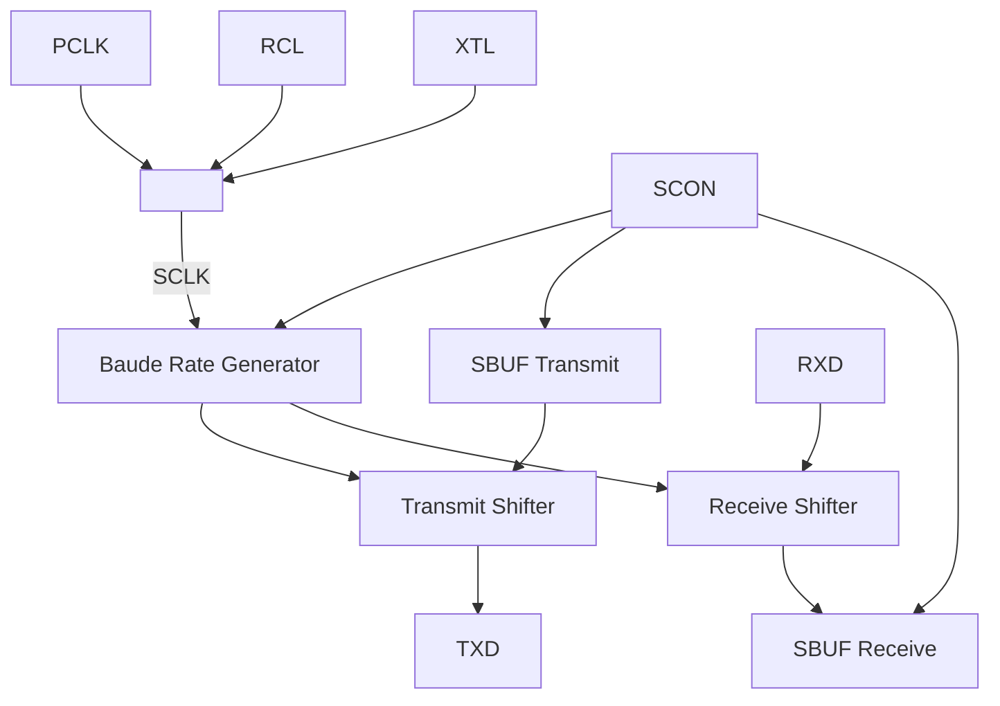

图 15-1 LPUART 功能框图

## 15.3.2 时钟说明

LPUART 模块有两个时钟：

* 配置时钟 PCLK

配置时钟用于系统 APB 总线对 LPUART 模块进行寄存器配置，配置时钟固定为 APB 总线时钟 PCLK。当系统进入深度休眠（DeepSleep）模式，PCLK 时钟将会停止。

* 传输时钟 SCLK

传输时钟用于 LPUART 数据收发逻辑工作，其时钟来源可选择外部低速晶振时钟（XTL）、内部低速时钟（RCL）以及 PCLK 时钟。

当系统进入深度休眠（DeepSleep）模式，如果 SCLK 选择外部低速晶振时钟（XTL）或者内部低速时钟（RCL），LPUART 仍旧可以进行正常的数据收发，而不受系统深度休眠（DeepSleep）模式的影响。

## 15.3.3 工作模式

LPUART 支持多种工作模式：同步半双工模式、异步全双工模式、单线半双工模式。

通过 LPUART_SCON.SM 和 LPUART_SCON.HDSEL 搭配，即可配置出所需要的各种工作模式。

### 15.3.3.1 Mode0~Mode3 功能对比

配置 LPUART_SCON.SM 可选择不同的传输模式：Mode0~Mode3。这四种工作模式的主要功能对比如下表所示：

表 15-1 LPUART Mode0/1/2/3 数据结构


<table>
  <thead>
    <tr>
        <th>工作模式</th>
        <th>传输位宽</th>
        <th>数据组成</th>
        <th>波特率</th>
    </tr>
  </thead>
  <tbody>
    <tr>
        <td>Mode0 同步半双工模式</td>
        <td>8-bit</td>
        <td>Data(8bits)</td>
        <td>BaudRate = $$ \frac{f_{SCLK}}{12} $$</td>
    </tr>
    <tr>
        <td>Mode1 异步全双工模式</td>
        <td>10~11-bit</td>
        <td>Start(1bit) + Data(8bits) + Stop(1~2bits)</td>
        <td>BaudRate = $$ \frac{f_{SCLK}}{OVER \times SCNT} $$</td>
    </tr>
    <tr>
        <td>Mode2 异步全双工模式</td>
        <td>11~12-bit</td>
        <td>Start(1bit) + Data(8bits) + B8(1bit) + Stop(1~2bits)</td>
        <td>BaudRate = $$ \frac{f_{SCLK}}{OVER} $$</td>
    </tr>
    <tr>
        <td>Mode3 异步全双工模式</td>
        <td>11~12-bit</td>
        <td>Start(1bit) + Data(8bits) + B8(1bit) + Stop(1~2bits)</td>
        <td>BaudRate = $$ \frac{f_{SCLK}}{OVER \times SCNT} $$</td>
    </tr>
  </tbody>
</table>

 **说明**

* 当 SCLK 选择 XTL（频率 32.768kHz）时，Mode1/2/3 可以支持 9600/4800 波特率，波特率的产生详见寄存器 LPUART_BSEL/ LPUART_MODU。

* Mode0 只能作为主机发送 LPUART 同步移位时钟，不可以作为从机接收外部输入的 LPUART 同步移位时钟。

* f<sub>SCLK</sub> 为 SCLK 的时钟频率。

* OVER 取值：

    * LPUART_SCON.OVER=0b00 时，Mode1/3 模式 OVER 取值为 16；Mode2 模式 OVER 取值为 32。

    * LPUART_SCON.OVER=0b01 时，Mode1/3 模式 OVER 取值为 8；Mode2 模式 OVER 取值为 16。

    * LPUART_SCON.OVER=0b10 时，Mode1/3 模式 OVER 取值为 4；Mode2 模式 OVER 取值为 8。

* SCNT 的定义详见寄存器 LPUART_SCNT 介绍。

* B8 数据位比较特殊，在不同应用下具有不同的含义，请参考以下表格：

表 15-2 B8 数据含义


<table>
  <thead>
    <tr>
        <th>应用场景</th>
        <th>LPUART_SCON.ADRDET</th>
        <th>LPUART_SCON.B8CONT[1:0]</th>
        <th>B8 数据含义</th>
    </tr>
  </thead>
  <tbody>
    <tr>
        <td>奇偶校验</td>
        <td>-</td>
        <td>0b01/0b10</td>
        <td>接收时，B8 是所收到的 8bits 数据的奇偶校验位。<br/>发送时，B8 是所发送的 8bits 数据的奇偶校验位。</td>
    </tr>
    <tr>
        <td>多机通讯</td>
        <td>0b1</td>
        <td>-</td>
        <td>B8=1，代表当前是地址帧。<br/>B8=0，代表当前是数据帧。</td>
    </tr>
    <tr>
        <td>其他</td>
        <td>0b0</td>
        <td>0b00/0b11</td>
        <td>接收/发送数据 Bit8。</td>
    </tr>
  </tbody>
</table>

当开启多机通讯模式，接收数据奇偶校验自动关闭；发送数据奇偶校验仍受 B8CONT 控制。

### 15.3.3.2 Mode0 数据收发

#### ● Mode0 发送数据

当设置 LPUART_SCON.REN 为 0 时 LPUART 工作于发送状态，将待发送的数据写入 LPUART_SBUF 寄存器中，则数据将从 RXD 输出（低位在先，高位在后），同步移位时钟从 TXD 输出。


图 15-2 Mode0 发送数据

#### ● Mode0 接收数据

当设置 LPUART_SCON.REN 为 1 时 LPUART 工作于接收状态。每当 LPUART_ISR.RC 标志为 0 时，TXD 管脚会输出 8 个同步移位时钟，数据将从 RXD 输入（低位在先，高位在后）。每次将 LPUART_ISR.RC 标志清零即可接收下一个字节。


图 15-3 Mode0 接收数据

### 15.3.3.3 Mode1 数据收发

#### ● Mode1 发送数据

无论 LPUART_SCON.REN 为 0 或 1，都可以正常发送数据。

将数据写入 LPUART_SBUF，硬件自动将数据加载到发送移位寄存器并从 TXD 管脚移位输出（低位在先，高位在后），LPUART_ISR.TXE 标志硬件置 1。

用户查询到 LPUART_ISR.TXE 标志为 1 时，即可向 LPUART_SBUF 寄存器写入下一个待发送的数据。每当 TXD 管脚发送完成一帧数据时，LPUART_ISR.TC 标志会被硬件置 1 以指示当前的发送进展。


图 15-4 Mode1 发送数据

● Mode1 接收数据

接收数据时，将 LPUART_SCON.REN 设置为 1，并将 LPUART_ISR.RC 位清 0。

当一帧数据接收完成，LPUART_ISR.RC 标志会被硬件置 1，接收到的数据从 LPUART_SBUF 寄存器中读出。


图 15-5 Mode1 接收数据

### 15.3.3.4 Mode2/Mode3 数据收发

● Mode2/3 发送数据

无论 LPUART_SCON.REN 为 0 或 1，都可以正常发送数据。

将数据写入 LPUART_SBUF，硬件自动将数据加载到发送移位寄存器并从 TXD 管脚移位输出（低位在先，高位在后），LPUART_ISR.TXE 标志硬件置 1。

用户查询到 LPUART_ISR.TXE 标志为 1 时，即可向 LPUART_SBUF 寄存器写入下一个待发送的数据。

每当 TXD 管脚发送完成一帧数据时，LPUART_ISR.TC 标志会被硬件置 1 以指示当前的发送进展。


图 15-6 Mode2/Mode3 发送数据

● Mode2/3 接收数据

接收数据时，需要将 LPUART_SCON.REN 设置为 1，并将 LPUART_ISR.RC 位清 0。
每当一帧数据接收完成，LPUART_ISR.RC 标志会被硬件置 1，接收到的数据可以从 LPUART_SBUF 寄存器中读出。


图 15-7 Mode2/Mode3 接收数据

### 15.3.3.5 单线半双工数据收发

当 LPUART_SCON.HDSEL=0b1，可进入单线半双工传输模式：

● TX 与 RX 信号线在模块内部相连。

* RX 信号不再使用，接收发送的数据都经由 TX 信号完成。TX 信号的方向控制由硬件逻辑完成，无需软件控制。
* 当发送缓存为空时，TX 信号始终为输入（接收状态）。一旦向发送缓存填入一个数据，TX 信号变为输出（发送状态）。当发送完成，发送缓存变为空，TX 信号又回到输入（接收状态）。
* 无数据传输时，TXD 引脚始终处于输入状态。用户程序需配置该引脚为开漏输出并外接上拉电阻。

###  注意

1. 即使模块处于接收过程中，只要发送缓存被填入数据，TX 信号立即变为输出（发送状态）。接收过程将被打断，并得到一个错误的接收数据。
2. 单线半双工模式与 Mode0 模式的异同：
    * 同：两者都是用一根信号分时复用地完成了数据收发。
    * 异：Mode0 为同步传输，有同步时钟。而单线半双工模式为异步传输，所有的波特率计算还是遵照 Mode1~Mode3 的波特率公式，仅仅是收发功能复用到了 TX 这一根信号上面。

### 15.3.4 波特率生成

Mode0~Mode3 生成波特率的公式如下所示：

* Mode0 波特率生成公式： $$ BaudRate = \frac{f_{SCLK}}{12} $$
* Mode1 波特率生成公式： $$ BaudRate = \frac{f_{SCLK}}{OVER \times SCNT} $$
* Mode2 波特率生成公式： $$ BaudRate = \frac{f_{SCLK}}{OVER} $$
* Mode3 波特率生成公式： $$ BaudRate = \frac{f_{SCLK}}{OVER \times SCNT} $$

###  说明

* $f_{SCLK}$ 为 SCLK 的时钟频率。
* OVER 取值：
    * LPUART_SCON.OVER=0b00 时，Mode1/3 模式 OVER 取值为 16；Mode2 模式 OVER 取值为 32。
    * LPUART_SCON.OVER=0b01 时，Mode1/3 模式 OVER 取值为 8；Mode2 模式 OVER 取值为 16。
    * LPUART_SCON.OVER=0b10 时，Mode1/3 模式 OVER 取值为 4；Mode2 模式 OVER 取值为 8。
* SCNT 的定义详见寄存器 LPUART_SCNT 介绍。

### Mode1/Mode3 波特率设置示例

表 15-3 SCLK=4MHz 波特率计算表


<table>
<thead>
<tr>
<th rowspan="3">波特率</th>
<th colspan="9">SCLK=4MHz</th>
</tr>
<tr>
<th colspan="3">OVER=4</th>
<th colspan="3">OVER=8</th>
<th colspan="3">OVER=16</th>
</tr>
<tr>
<th>SCNT</th>
<th>实际波特率</th>
<th>误差%</th>
<th>SCNT</th>
<th>实际波特率</th>
<th>误差%</th>
<th>SCNT</th>
<th>实际波特率</th>
<th>误差%</th>
</tr>
</thead>
<tbody>
<tr>
<td>2400</td>
<td>417</td>
<td>2398.08</td>
<td>-0.08%</td>
<td>208</td>
<td>2403.85</td>
<td>0.16%</td>
<td>104</td>
<td>2403.85</td>
<td>0.16%</td>
</tr>
<tr>
<td>4800</td>
<td>208</td>
<td>4807.69</td>
<td>0.16%</td>
<td>104</td>
<td>4807.69</td>
<td>0.16%</td>
<td>52</td>
<td>4807.69</td>
<td>0.16%</td>
</tr>
<tr>
<td>9600</td>
<td>104</td>
<td>9615.38</td>
<td>0.16%</td>
<td>52</td>
<td>9615.38</td>
<td>0.16%</td>
<td>26</td>
<td>9615.38</td>
<td>0.16%</td>
</tr><tr>
<td>19200</td>
<td>52</td>
<td>19230.77</td>
<td>0.16%</td>
<td>26</td>
<td>19230.77</td>
<td>0.16%</td>
<td>13</td>
<td>19230.77</td>
<td>0.16%</td>
</tr><tr>
<td>38400</td>
<td>26</td>
<td>38461.54</td>
<td>0.16%</td>
<td>13</td>
<td>38461.54</td>
<td>0.16%</td>
<td>7</td>
<td>35714.29</td>
<td>-6.99%</td>
</tr><tr>
<td>57600</td>
<td>17</td>
<td>58823.53</td>
<td>2.12%</td>
<td>9</td>
<td>55555.56</td>
<td>-3.55%</td>
<td>4</td>
<td>62500.00</td>
<td>8.51%</td>
</tr><tr>
<td>76800</td>
<td>13</td>
<td>76923.08</td>
<td>0.16%</td>
<td>7</td>
<td>71428.57</td>
<td>-6.99%</td>
<td>3</td>
<td>83333.33</td>
<td>8.51%</td>
</tr><tr>
<td>115200</td>
<td>9</td>
<td>111111.11</td>
<td>-3.55%</td>
<td>4</td>
<td>125000.00</td>
<td>8.51%</td>
<td>2</td>
<td>125000.00</td>
<td>8.51%</td>
</tr>
<tr>
<td>128000</td>
<td>8</td>
<td>125000.00</td>
<td>-2.34%</td>
<td>4</td>
<td>125000.00</td>
<td>-2.34%</td>
<td>2</td>
<td>125000.00</td>
<td>-2.34%</td>
</tr>
<tr>
<td>256000</td>
<td>4</td>
<td>250000.00</td>
<td>-2.34%</td>
<td>2</td>
<td>250000.00</td>
<td>-2.34%</td>
<td>1</td>
<td>250000.00</td>
<td>-2.34%</td>
</tr>
<tr>
<td>1000000</td>
<td>1</td>
<td>1000000.00</td>
<td>0.00%</td>
<td>1</td>
<td>/</td>
<td>/</td>
<td>0</td>
<td>/</td>
<td>/</td>
</tr>
</tbody>
</table>

表 15-4 SCLK=8MHz 波特率计算表


<table>
  <thead>
    <tr>
        <th rowspan="3">波特率</th>
        <th colspan="9">SCLK=8MHz</th>
    </tr>
    <tr>
        <th colspan="3">OVER=4</th>
        <th colspan="3">OVER=8</th>
        <th colspan="3">OVER=16</th>
    </tr>
    <tr>
        <th>SCNT</th>
        <th>实际波特率</th>
        <th>误差%</th>
        <th>SCNT</th>
        <th>实际波特率</th>
        <th>误差%</th>
        <th>SCNT</th>
        <th>实际波特率</th>
        <th>误差%</th>
    </tr>
  </thead>
  <tbody>
    <tr>
        <td>2400</td>
        <td>833</td>
        <td>2400.96</td>
        <td>0.04%</td>
        <td>417</td>
        <td>2398.08</td>
        <td>-0.08%</td>
        <td>208</td>
        <td>2403.85</td>
        <td>0.16%</td>
    </tr>
    <tr>
        <td>4800</td>
        <td>417</td>
        <td>4796.16</td>
        <td>-0.08%</td>
        <td>208</td>
        <td>4807.69</td>
        <td>0.16%</td>
        <td>104</td>
        <td>4807.69</td>
        <td>0.16%</td>
    </tr>
    <tr>
        <td>9600</td>
        <td>208</td>
        <td>9615.38</td>
        <td>0.16%</td>
        <td>104</td>
        <td>9615.38</td>
        <td>0.16%</td>
        <td>52</td>
        <td>9615.38</td>
        <td>0.16%</td>
    </tr>
    <tr>
        <td>19200</td>
        <td>104</td>
        <td>19230.77</td>
        <td>0.16%</td>
        <td>52</td>
        <td>19230.77</td>
        <td>0.16%</td>
        <td>26</td>
        <td>19230.77</td>
        <td>0.16%</td>
    </tr>
    <tr>
        <td>38400</td>
        <td>52</td>
        <td>38461.54</td>
        <td>0.16%</td>
        <td>26</td>
        <td>38461.54</td>
        <td>0.16%</td>
        <td>13</td>
        <td>38461.54</td>
        <td>0.16%</td>
    </tr>
    <tr>
        <td>57600</td>
        <td>35</td>
        <td>57142.86</td>
        <td>-0.79%</td>
        <td>17</td>
        <td>58823.53</td>
        <td>2.12%</td>
        <td>9</td>
        <td>55555.56</td>
        <td>-3.55%</td>
    </tr>
    <tr>
        <td>76800</td>
        <td>26</td>
        <td>76923.08</td>
        <td>0.16%</td>
        <td>13</td>
        <td>76923.08</td>
        <td>0.16%</td>
        <td>7</td>
        <td>71428.57</td>
        <td>-6.99%</td>
    </tr>
    <tr>
        <td>115200</td>
        <td>17</td>
        <td>117647.06</td>
        <td>2.12%</td>
        <td>9</td>
        <td>111111.11</td>
        <td>-3.55%</td>
        <td>4</td>
        <td>125000.00</td>
        <td>8.51%</td>
    </tr>
    <tr>
        <td>128000</td>
        <td>16</td>
        <td>125000.00</td>
        <td>-2.34%</td>
        <td>8</td>
        <td>125000.00</td>
        <td>-2.34%</td>
        <td>4</td>
        <td>125000.00</td>
        <td>-2.34%</td>
    </tr>
    <tr>
        <td>256000</td>
        <td>8</td>
        <td>250000.00</td>
        <td>-2.34%</td>
        <td>4</td>
        <td>250000.00</td>
        <td>-2.34%</td>
        <td>2</td>
        <td>250000.00</td>
        <td>-2.34%</td>
    </tr>
    <tr>
        <td>1000000</td>
        <td>2</td>
        <td>1000000.00</td>
        <td>0.00%</td>
        <td>1</td>
        <td>1000000.00</td>
        <td>0.00%</td>
        <td>1</td>
        <td>/</td>
        <td>/</td>
    </tr>
    <tr>
        <td>2000000</td>
        <td>1</td>
        <td>2000000.00</td>
        <td>0.00%</td>
        <td>1</td>
        <td>/</td>
        <td>/</td>
        <td>0</td>
        <td>/</td>
        <td>/</td>
    </tr>
  </tbody>
</table>

表 15-5 SCLK=16MHz 波特率计算表


<table>
  <thead>
    <tr>
        <th rowspan="3">波特率</th>
        <th colspan="9">SCLK=16MHz</th>
    </tr>
    <tr>
        <th colspan="3">OVER=4</th>
        <th colspan="3">OVER=8</th>
        <th colspan="3">OVER=16</th>
    </tr>
    <tr>
        <th>SCNT</th>
        <th>实际波特率</th>
        <th>误差%</th>
        <th>SCNT</th>
        <th>实际波特率</th>
        <th>误差%</th>
        <th>SCNT</th>
        <th>实际波特率</th>
        <th>误差%</th>
    </tr>
  </thead>
  <tbody>
    <tr>
        <td>2400</td>
        <td>1667</td>
        <td>2399.52</td>
        <td>-0.02%</td>
        <td>833</td>
        <td>2400.96</td>
        <td>0.04%</td>
        <td>417</td>
        <td>2398.08</td>
        <td>-0.08%</td>
    </tr>
    <tr>
        <td>4800</td>
        <td>833</td>
        <td>4801.92</td>
        <td>0.04%</td>
        <td>417</td>
        <td>4796.16</td>
        <td>-0.08%</td>
        <td>208</td>
        <td>4807.69</td>
        <td>0.16%</td>
    </tr>
    <tr>
        <td>9600</td>
        <td>417</td>
        <td>9592.33</td>
        <td>-0.08%</td>
        <td>208</td>
        <td>9615.38</td>
        <td>0.16%</td>
        <td>104</td>
        <td>9615.38</td>
        <td>0.16%</td>
    </tr>
    <tr>
        <td>19200</td>
        <td>208</td>
        <td>19230.77</td>
        <td>0.16%</td>
        <td>104</td>
        <td>19230.77</td>
        <td>0.16%</td>
        <td>52</td>
        <td>19230.77</td>
        <td>0.16%</td>
    </tr>
    <tr>
        <td>38400</td>
        <td>104</td>
        <td>38461.54</td>
        <td>0.16%</td>
        <td>52</td>
        <td>38461.54</td>
        <td>0.16%</td>
        <td>26</td>
        <td>38461.54</td>
        <td>0.16%</td>
    </tr>
    <tr>
        <td>57600</td>
        <td>69</td>
        <td>57971.01</td>
        <td>0.64%</td>
        <td>35</td>
        <td>57142.86</td>
        <td>-0.79%</td>
        <td>17</td>
        <td>58823.53</td>
        <td>2.12%</td>
    </tr>
    <tr>
        <td>76800</td>
        <td>52</td>
        <td>76923.08</td>
        <td>0.16%</td>
        <td>26</td>
        <td>76923.08</td>
        <td>0.16%</td>
        <td>13</td>
        <td>76923.08</td>
        <td>0.16%</td>
    </tr>
    <tr>
        <td>115200</td>
        <td>35</td>
        <td>114285.71</td>
        <td>-0.79%</td>
        <td>17</td>
        <td>117647.06</td>
        <td>2.12%</td>
        <td>9</td>
        <td>111111.11</td>
        <td>-3.55%</td>
    </tr>
    <tr>
        <td>128000</td>
        <td>31</td>
        <td>129032.26</td>
        <td>0.81%</td>
        <td>16</td>
        <td>125000.00</td>
        <td>-2.34%</td>
        <td>8</td>
        <td>125000.00</td>
        <td>-2.34%</td>
    </tr>
    <tr>
        <td>256000</td>
        <td>16</td>
        <td>250000.00</td>
        <td>-2.34%</td>
        <td>8</td>
        <td>250000.00</td>
        <td>-2.34%</td>
        <td>4</td>
        <td>250000.00</td>
        <td>-2.34%</td>
    </tr>
    <tr>
        <td>1000000</td>
        <td>4</td>
        <td>1000000.00</td>
        <td>0.00%</td>
        <td>2</td>
        <td>1000000.00</td>
        <td>0.00%</td>
        <td>1</td>
        <td>1000000.00</td>
        <td>0.00%</td>
    </tr>
    <tr>
        <td>2000000</td>
        <td>2</td>
        <td>2000000.00</td>
        <td>0.00%</td>
        <td>1</td>
        <td>2000000.00</td>
        <td>0.00%</td>
        <td>1</td>
        <td>/</td>
        <td>/</td>
    </tr>
    <tr>
        <td>4000000</td>
        <td>1</td>
        <td>4000000.00</td>
        <td>0.00%</td>
        <td>1</td>
        <td>/</td>
        <td>/</td>
        <td>0</td>
        <td>/</td>
        <td>/</td>
    </tr>
  </tbody>
</table>

表 15-6 SCLK=24MHz 波特率计算表


<table>
  <thead>
    <tr>
        <th rowspan="3">波特率</th>
        <th colspan="9">SCLK=24MHz</th>
    </tr>
    <tr>
        <th colspan="3">OVER=4</th>
        <th colspan="3">OVER=8</th>
        <th colspan="3">OVER=16</th>
    </tr>
    <tr>
        <th>SCNT</th>
        <th>实际波特率</th>
        <th>误差%</th>
        <th>SCNT</th>
        <th>实际波特率</th>
        <th>误差%</th>
        <th>SCNT</th>
        <th>实际波特率</th>
        <th>误差%</th>
    </tr>
  </thead>
  <tbody>
    <tr>
        <td>2400</td>
        <td>2500</td>
        <td>2400.00</td>
        <td>0.00%</td>
        <td>1250</td>
        <td>2400.00</td>
        <td>0.00%</td>
        <td>625</td>
        <td>2400.00</td>
        <td>0.00%</td>
    </tr>
    <tr>
        <td>4800</td>
        <td>1250</td>
        <td>4800.00</td>
        <td>0.00%</td>
        <td>625</td>
        <td>4800.00</td>
        <td>0.00%</td>
        <td>313</td>
        <td>4792.33</td>
        <td>-0.16%</td>
    </tr>
    <tr>
        <td>9600</td>
        <td>625</td>
        <td>9600.00</td>
        <td>0.00%</td>
        <td>313</td>
        <td>9584.66</td>
        <td>-0.16%</td>
        <td>156</td>
        <td>9615.38</td>
        <td>0.16%</td>
    </tr>
    <tr>
        <td>19200</td>
        <td>313</td>
        <td>19169.33</td>
        <td>-0.16%</td>
        <td>156</td>
        <td>19230.77</td>
        <td>0.16%</td>
        <td>78</td>
        <td>19230.77</td>
        <td>0.16%</td>
    </tr>
    <tr>
        <td>38400</td>
        <td>156</td>
        <td>38461.54</td>
        <td>0.16%</td>
        <td>78</td>
        <td>38461.54</td>
        <td>0.16%</td>
        <td>39</td>
        <td>38461.54</td>
        <td>0.16%</td>
    </tr>
    <tr>
        <td>57600</td>
        <td>104</td>
        <td>57692.31</td>
        <td>0.16%</td>
        <td>52</td>
        <td>57692.31</td>
        <td>0.16%</td>
        <td>26</td>
        <td>57692.31</td>
        <td>0.16%</td>
    </tr>
    <tr>
        <td>76800</td>
        <td>78</td>
        <td>76923.08</td>
        <td>0.16%</td>
        <td>39</td>
        <td>76923.08</td>
        <td>0.16%</td>
        <td>20</td>
        <td>75000.00</td>
        <td>-2.34%</td>
    </tr>
    <tr>
        <td>115200</td>
        <td>52</td>
        <td>115384.62</td>
        <td>0.16%</td>
        <td>26</td>
        <td>115384.62</td>
        <td>0.16%</td>
        <td>13</td>
        <td>115384.62</td>
        <td>0.16%</td>
    </tr>
  </tbody>
</table>

<table>
  <thead>
    <tr>
        <th rowspan="3">波特率</th>
        <th colspan="9">SCLK=24MHz</th>
    </tr>
    <tr>
        <th colspan="3">OVER=4</th>
        <th colspan="3">OVER=8</th>
        <th colspan="3">OVER=16</th>
    </tr>
    <tr>
        <th>SCNT</th>
        <th>实际波特率</th>
        <th>误差%</th>
        <th>SCNT</th>
        <th>实际波特率</th>
        <th>误差%</th>
        <th>SCNT</th>
        <th>实际波特率</th>
        <th>误差%</th>
    </tr>
  </thead>
  <tbody>
    <tr>
        <td>128000</td>
        <td>47</td>
        <td>127659.57</td>
        <td>-0.27%</td>
        <td>23</td>
        <td>130434.78</td>
        <td>1.90%</td>
        <td>12</td>
        <td>125000.00</td>
        <td>-2.34%</td>
    </tr>
    <tr>
        <td>256000</td>
        <td>23</td>
        <td>260869.57</td>
        <td>1.90%</td>
        <td>12</td>
        <td>250000.00</td>
        <td>-2.34%</td>
        <td>6</td>
        <td>250000.00</td>
        <td>-2.34%</td>
    </tr>
    <tr>
        <td>1000000</td>
        <td>6</td>
        <td>1000000.00</td>
        <td>0.00%</td>
        <td>3</td>
        <td>1000000.00</td>
        <td>0.00%</td>
        <td>2</td>
        <td>/</td>
        <td>/</td>
    </tr>
    <tr>
        <td>2000000</td>
        <td>3</td>
        <td>2000000.00</td>
        <td>0.00%</td>
        <td>2</td>
        <td>/</td>
        <td>/</td>
        <td>1</td>
        <td>/</td>
        <td>/</td>
    </tr>
    <tr>
        <td>6000000</td>
        <td>1</td>
        <td>6000000.00</td>
        <td>0.00%</td>
        <td>1</td>
        <td>/</td>
        <td>/</td>
        <td>0</td>
        <td>/</td>
        <td>/</td>
    </tr>
  </tbody>
</table>

表 15-7 SCLK=32MHz 波特率计算表


<table>
  <thead>
    <tr>
        <th rowspan="3">波特率</th>
        <th colspan="9">SCLK=32MHz</th>
    </tr>
    <tr>
        <th colspan="3">OVER=4</th>
        <th colspan="3">OVER=8</th>
        <th colspan="3">OVER=16</th>
    </tr>
    <tr>
        <th>SCNT</th>
        <th>实际波特率</th>
        <th>误差%</th>
        <th>SCNT</th>
        <th>实际波特率</th>
        <th>误差%</th>
        <th>SCNT</th>
        <th>实际波特率</th>
        <th>误差%</th>
    </tr>
  </thead>
  <tbody>
    <tr>
        <td>2400</td>
        <td>3333</td>
        <td>2400.24</td>
        <td>0.01%</td>
        <td>1667</td>
        <td>2399.52</td>
        <td>-0.02%</td>
        <td>833</td>
        <td>2400.96</td>
        <td>0.04%</td>
    </tr>
    <tr>
        <td>4800</td>
        <td>1667</td>
        <td>4799.04</td>
        <td>-0.02%</td>
        <td>833</td>
        <td>4801.92</td>
        <td>0.04%</td>
        <td>417</td>
        <td>4796.16</td>
        <td>-0.08%</td>
    </tr>
    <tr>
        <td>9600</td>
        <td>833</td>
        <td>9603.84</td>
        <td>0.04%</td>
        <td>417</td>
        <td>9592.33</td>
        <td>-0.08%</td>
        <td>208</td>
        <td>9615.38</td>
        <td>0.16%</td>
    </tr>
    <tr>
        <td>19200</td>
        <td>417</td>
        <td>19184.65</td>
        <td>-0.08%</td>
        <td>208</td>
        <td>19230.77</td>
        <td>0.16%</td>
        <td>104</td>
        <td>19230.77</td>
        <td>0.16%</td>
    </tr>
    <tr>
        <td>38400</td>
        <td>208</td>
        <td>38461.54</td>
        <td>0.16%</td>
        <td>104</td>
        <td>38461.54</td>
        <td>0.16%</td>
        <td>52</td>
        <td>38461.54</td>
        <td>0.16%</td>
    </tr>
    <tr>
        <td>57600</td>
        <td>139</td>
        <td>57553.96</td>
        <td>-0.08%</td>
        <td>69</td>
        <td>57971.01</td>
        <td>0.64%</td>
        <td>35</td>
        <td>57142.86</td>
        <td>-0.79%</td>
    </tr>
    <tr>
        <td>76800</td>
        <td>104</td>
        <td>76923.08</td>
        <td>0.16%</td>
        <td>52</td>
        <td>76923.08</td>
        <td>0.16%</td>
        <td>26</td>
        <td>76923.08</td>
        <td>0.16%</td>
    </tr>
    <tr>
        <td>115200</td>
        <td>69</td>
        <td>115942.03</td>
        <td>0.64%</td>
        <td>35</td>
        <td>114285.71</td>
        <td>-0.79%</td>
        <td>17</td>
        <td>117647.06</td>
        <td>2.12%</td>
    </tr>
    <tr>
        <td>128000</td>
        <td>63</td>
        <td>126984.13</td>
        <td>-0.79%</td>
        <td>31</td>
        <td>129032.26</td>
        <td>0.81%</td>
        <td>16</td>
        <td>125000.00</td>
        <td>-2.34%</td>
    </tr>
    <tr>
        <td>256000</td>
        <td>31</td>
        <td>258064.52</td>
        <td>0.81%</td>
        <td>16</td>
        <td>250000.00</td>
        <td>-2.34%</td>
        <td>8</td>
        <td>250000.00</td>
        <td>-2.34%</td>
    </tr>
    <tr>
        <td>1000000</td>
        <td>8</td>
        <td>1000000.00</td>
        <td>0.00%</td>
        <td>4</td>
        <td>1000000.00</td>
        <td>0.00%</td>
        <td>2</td>
        <td>1000000.00</td>
        <td>0.00%</td>
    </tr>
    <tr>
        <td>2000000</td>
        <td>4</td>
        <td>2000000.00</td>
        <td>0.00%</td>
        <td>2</td>
        <td>2000000.00</td>
        <td>0.00%</td>
        <td>1</td>
        <td>2000000.00</td>
        <td>0.00%</td>
    </tr>
    <tr>
        <td>4000000</td>
        <td>2</td>
        <td>4000000.00</td>
        <td>0.00%</td>
        <td>1</td>
        <td>4000000.00</td>
        <td>0.00%</td>
        <td>1</td>
        <td>/</td>
        <td>/</td>
    </tr>
    <tr>
        <td>8000000</td>
        <td>1</td>
        <td>8000000.00</td>
        <td>0.00%</td>
        <td>1</td>
        <td>/</td>
        <td>/</td>
        <td>0</td>
        <td>/</td>
        <td>/</td>
    </tr>
  </tbody>
</table>

表 15-8 SCLK=48MHz 波特率计算表


<table>
  <thead>
    <tr>
        <th rowspan="3">波特率</th>
        <th colspan="9">SCLK=48MHz</th>
    </tr>
    <tr>
        <th colspan="3">OVER=4</th>
        <th colspan="3">OVER=8</th>
        <th colspan="3">OVER=16</th>
    </tr>
    <tr>
        <th>SCNT</th>
        <th>实际波特率</th>
        <th>误差%</th>
        <th>SCNT</th>
        <th>实际波特率</th>
        <th>误差%</th>
        <th>SCNT</th>
        <th>实际波特率</th>
        <th>误差%</th>
    </tr>
  </thead>
  <tbody>
    <tr>
        <td>2400</td>
        <td>5000</td>
        <td>2400.00</td>
        <td>0.00%</td>
        <td>2500</td>
        <td>2400.00</td>
        <td>0.00%</td>
        <td>1250</td>
        <td>2400.00</td>
        <td>0.00%</td>
    </tr>
    <tr>
        <td>4800</td>
        <td>2500</td>
        <td>4800.00</td>
        <td>0.00%</td>
        <td>1250</td>
        <td>4800.00</td>
        <td>0.00%</td>
        <td>625</td>
        <td>4800.00</td>
        <td>0.00%</td>
    </tr>
    <tr>
        <td>9600</td>
        <td>1250</td>
        <td>9600.00</td>
        <td>0.00%</td>
        <td>625</td>
        <td>9600.00</td>
        <td>0.00%</td>
        <td>313</td>
        <td>9584.66</td>
        <td>-0.16%</td>
    </tr>
    <tr>
        <td>19200</td>
        <td>625</td>
        <td>19200.00</td>
        <td>0.00%</td>
        <td>313</td>
        <td>19169.33</td>
        <td>-0.16%</td>
        <td>156</td>
        <td>19230.77</td>
        <td>0.16%</td>
    </tr>
    <tr>
        <td>38400</td>
        <td>313</td>
        <td>38338.66</td>
        <td>-0.16%</td>
        <td>156</td>
        <td>38461.54</td>
        <td>0.16%</td>
        <td>78</td>
        <td>38461.54</td>
        <td>0.16%</td>
    </tr>
    <tr>
        <td>57600</td>
        <td>208</td>
        <td>57692.31</td>
        <td>0.16%</td>
        <td>104</td>
        <td>57692.31</td>
        <td>0.16%</td>
        <td>52</td>
        <td>57692.31</td>
        <td>0.16%</td>
    </tr>
    <tr>
        <td>76800</td>
        <td>156</td>
        <td>76923.08</td>
        <td>0.16%</td>
        <td>78</td>
        <td>76923.08</td>
        <td>0.16%</td>
        <td>39</td>
        <td>76923.08</td>
        <td>0.16%</td>
    </tr>
    <tr>
        <td>115200</td>
        <td>104</td>
        <td>115384.62</td>
        <td>0.16%</td>
        <td>52</td>
        <td>115384.62</td>
        <td>0.16%</td>
        <td>26</td>
        <td>115384.62</td>
        <td>0.16%</td>
    </tr>
    <tr>
        <td>128000</td>
        <td>94</td>
        <td>127659.57</td>
        <td>-0.27%</td>
        <td>47</td>
        <td>127659.57</td>
        <td>-0.27%</td>
        <td>23</td>
        <td>130434.78</td>
        <td>1.90%</td>
    </tr>
    <tr>
        <td>256000</td>
        <td>47</td>
        <td>255319.15</td>
        <td>-0.27%</td>
        <td>23</td>
        <td>260869.57</td>
        <td>1.90%</td>
        <td>12</td>
        <td>250000.00</td>
        <td>-2.34%</td>
    </tr>
    <tr>
        <td>1000000</td>
        <td>12</td>
        <td>1000000.00</td>
        <td>0.00%</td>
        <td>6</td>
        <td>1000000.00</td>
        <td>0.00%</td>
        <td>3</td>
        <td>1000000.00</td>
        <td>0.00%</td>
    </tr>
    <tr>
        <td>2000000</td>
        <td>6</td>
        <td>2000000.00</td>
        <td>0.00%</td>
        <td>3</td>
        <td>2000000.00</td>
        <td>0.00%</td>
        <td>2</td>
        <td>1500000.00</td>
        <td>-25.00%</td>
    </tr>
    <tr>
        <td>4000000</td>
        <td>4</td>
        <td>3000000.00</td>
        <td>0.00%</td>
        <td>2</td>
        <td>3000000.00</td>
        <td>0.00%</td>
        <td>1</td>
        <td>3000000.00</td>
        <td>0.00%</td>
    </tr>
    <tr>
        <td>6000000</td>
        <td>3</td>
        <td>4000000.00</td>
        <td>0.00%</td>
        <td>2</td>
        <td>/</td>
        <td>/</td>
        <td>1</td>
        <td>/</td>
        <td>/</td>
    </tr>
    <tr>
        <td>12000000</td>
        <td>1</td>
        <td>12000000.00</td>
        <td>0.00%</td>
        <td>1</td>
        <td>/</td>
        <td>/</td>
        <td>0</td>
        <td>/</td>
        <td>/</td>
    </tr>
  </tbody>
</table>

### 15.3.5 帧错误检测

当 LPUART 工作在 Mode1/2/3 时，具有帧错误检测功能：

* 在接收数据时，若未在预期时间内识别出停止位，即为帧错误。

* 检测到帧错误时，LPUART_ISR.FE 会被硬件置 1，用户程序应及时清除该标志。

### 15.3.6 多机通讯

当工作在 Mode2/3 时，将 LPUART_SCON.ADRDET 设置为 1，可开启多机通讯地址自动识别功能。主机可以发送地址帧及数据帧，从机可以在收到匹配的地址帧后才接收数据帧。

#### 主机发送地址帧及数据帧

当 LPUART_SBUF.DATA8 为 1 则发送地址帧，LPUART_SBUF.DATA 为目标从机的地址。

当 LPUART_SBUF.DATA8 为 0 则发送数据帧，LPUART_SBUF.DATA 为待发送的数据。

#### 从机接收地址帧及数据帧

当 LPUART_SCON.ADRDET 为 1 时，从机只接收与自己地址相匹配的地址帧，忽略数据帧及不匹配的地址帧。当从机从 RXD 接收到地址帧时，硬件自动对比地址帧内的地址与本机地址，只有两者匹配时才会将收到的地址存入 LPUART_SBUF 寄存器并置位 LPUART_ISR.RC。

当 LPUART_SCON.ADRDET 为 0 时，从机只接收数据帧并忽略地址帧。用户程序应当在地址匹配后才设置 LPUART_SCON.ADRDET 为 0 以接收主机后继发送的数据帧。

#### 从机地址配置

从机地址由广播地址和用户配置地址组成：

* 广播地址：0xFF

* 用户配置地址：LPUART_SADDR & LPUART_SADEN

收到地址帧时，检测到从总线收到的地址与 LPUART_SADEN 的值相与后值与用户配置地址相同，则认为收到了与从机地址相匹配的地址帧。

例：LPUART_SADDR=0x55，LPUART_SADEN=0xF0，则从机可以匹配的地址为 0xFF（广播地址）、0x50~0x5F（用户配置地址）。

### 15.3.7 硬件流控

通过增加 CTS 和 RTS 信号可以实现硬件流控的功能，LPUART 模块会根据 CTS 和 RTS 的高低电平自动控制数据的收发，而无需通过软件来判断。

两个 LPUART 模块之间的硬件流控示意图如下所示：


图 15-8 LPUART 硬件流控

#### RTS 流控

当 RTS 流控使能时（LPUART_SCON.RTSEN 为 1），RTS 管脚指示本模块的接收状态：

* 接收缓存空时，RTS 管脚变为低电平，通知发送端发送下一帧数据。

* 接收缓存满时，RTS 管脚变为高电平，通知发送端暂停发送下一帧数据。


图 15-9 RTS 硬件流控信号

### CTS 流控

当 TS 流控使能时（LPUART_SCON.CTSEN 设置为 1），CTS 管脚指示本模块下一帧数据的发送：

* 若 CTS 低电平，LPUART 发送下一帧数据。

* 若 CTS 高电平，LPUART 发送完当前帧后，等待 CTS 变成低电平再进行下一帧的发送。

当 CTS 电平发生变化，LPUART_ISR.CTSIF 自动置 1，读 LPUART_ISR.CTS 获取当前 CTS 管脚的电平值。


图 15-10 CTS 硬件流控信号

### 15.3.8 收发端缓存

#### 接收缓存

LPUART 模块接收端有一个帧（8bits/9bits）的接收缓存，即保持接受的数据帧直至下一帧数据的 Stop 位被接才更新该数据帧。


<table>
  <thead>
    <tr>
        <th>Signal</th>
        <th>Event 1</th>
        <th>Event 2</th>
        <th>Event 3</th>
        <th>Event 4</th>
    </tr>
  </thead>
  <tbody>
    <tr>
        <td>RX</td>
        <td>start Frame0 stop</td>
        <td>start Frame1 stop</td>
        <td> </td>
        <td> </td>
    </tr>
    <tr>
        <td>SBUF</td>
        <td> </td>
        <td>Frame0</td>
        <td>Frame1</td>
        <td> </td>
    </tr>
    <tr>
        <td>RC</td>
        <td> </td>
        <td>High Level</td>
        <td>High Level</td>
        <td> </td>
    </tr>
    <tr>
        <td>Read SBUF</td>
        <td> </td>
        <td> </td>
        <td> </td>
        <td>Pulse</td>
    </tr>
  </tbody>
</table>

图 15-11 接收缓存

#### 发送缓存

LPUART 模块发送端有一个帧（8bits/9bits）的发送缓存，当 LPUART 在发送当前帧时，下一个发送数据软件写入 LPUART_SBUF。

* 当 LPUART_ISR.TXE=0 时，表明当前发送缓存满，LPUART_SBUF 不能写入下一个发送数据。

* 当 LPUART_ISR.TXE=1 时，表明当前发送缓存空，LPUART_SBUF 可以写入下一个发送数据，在完成当前数据传输后，硬件自动把发送缓存中的数据装载入移位寄存器中发送出去。


图 15-12 发送缓存

# 15.4 操作示例

## 15.4.1 发送数据示例

### 操作步骤

步骤 1. 参考《端口控制器（GPIO）》章节端口数字复用功能的相关描述，将 TXD 映射到需要的管脚；并配置 TXD 为 CMOS 输出。

步骤 2. 配置 SYSCTRL 模块寄存器 PERI_CLKEN0.LPUARTx 为 1，使能 LPUART 配置时钟及工作时钟。

步骤 3. 配置 LPUART_SCON.SCLKSEL，选择 LPUART 的传输时钟来源。

步骤 4. 配置 LPUART_SCON.SM，选择 LPUART 的工作模式。

步骤 5. 配置 LPUART_SCON.OVER 及 LPUART_SCNT 寄存器，配置通信波特率。

步骤 6. 配置 LPUART_SCON.STOPBIT、LPUART_SCON.B8CONT，配置 LPUART 的 STOP 长度，奇偶校验方式。

步骤 7. 向 ICR 寄存器写入 0x00，清除所有状态标志。

步骤 8. 当查询到 ISR.TXE 为 1，向 LPUART_SBUF 寄存器写入一帧待发送的数据。

步骤 9. 查询等待 ISR.TC 变为 1，本次写入的数据帧发送完成。

步骤 10. 向 ICR.TCCF 写入 0x00，清除发送完成标志。

步骤 11. 如待发送的数据未完成，则跳转到步骤 8。

## 15.4.2 接收数据示例

### 操作步骤

步骤 1. 参考《端口控制器（GPIO）》章节端口数字复用功能的相关描述，将 RXD 映射到需要的管脚；并配置 RXD 为输入并使能上拉电阻。

步骤 2. 配置 SYSCTRL 模块寄存器 PERI_CLKEN0.LPUARTx 为 1，使能 LPUART 配置时钟及工作时钟。

步骤 3. 配置 LPUART_SCON.SCLKSEL，选择 LPUART 的传输时钟来源。

步骤 4. 配置 LPUART_SCON.SM，选择 LPUART 的工作模式。

步骤 5. 配置 LPUART_SCON.OVER 及 LPUART_SCNT 寄存器，配置通信波特率。

步骤 6. 配置 LPUART_SCON.STOPBIT、LPUART_SCON.B8CONT，配置 LPUART 的 STOP 长度，奇偶校验方式。

步骤 7. 向 ICR 寄存器写入 0x00，清除所有状态标志。

步骤 8. 设置 LPUART_SCON.REN 为 1，使能 RXD 数据接收。

步骤 9. 查询等待 ISR.RC 变为 1，接收完成一帧数据。

步骤 10. 查询 ISR.PE 和 ISR.FE，以确认接收到的数据帧是否有效。若无效则进行出错处理；若有效则从 LPUART_SBUF 寄存器读出数据并保存。

步骤 11. 向 ICR.RCCF 写入 0x00，清除接收完成标志。

步骤 12. 如待接收的数据未完成，则跳转到步骤 9。

# 15.5 寄存器

## 15.5.1 寄存器总表

* LPUART0 基地址：0x40000000
* LPUART1 基地址：0x40008000

表 15-9 低功耗同步异步收发器（LPUART）寄存器偏移地址


<table>
  <thead>
    <tr>
        <th>偏移地址</th>
        <th>寄存器</th>
        <th>描述</th>
    </tr>
  </thead>
  <tbody>
    <tr>
        <td>0x00</td>
        <td>LPUART_SBUF</td>
        <td>数据寄存器</td>
    </tr>
    <tr>
        <td>0x04</td>
        <td>LPUART_SCON</td>
        <td>控制寄存器</td>
    </tr>
    <tr>
        <td>0x08</td>
        <td>LPUART_SADDR</td>
        <td>地址寄存器</td>
    </tr>
    <tr>
        <td>0x0C</td>
        <td>LPUART_SADEN</td>
        <td>地址掩码寄存器</td>
    </tr>
    <tr>
        <td>0x10</td>
        <td>LPUART_ISR</td>
        <td>中断标志位寄存器</td>
    </tr>
    <tr>
        <td>0x14</td>
        <td>LPUART_ICR</td>
        <td>中断标志位清除寄存器</td>
    </tr>
    <tr>
        <td>0x18</td>
        <td>LPUART_SCNT</td>
        <td>波特率寄存器</td>
    </tr>
    <tr>
        <td>0x1C</td>
        <td>LPUART_BSEL</td>
        <td>波特率产生寄存器</td>
    </tr>
    <tr>
        <td>0x20</td>
        <td>LPUART_MODU</td>
        <td>9600/4800 波特率调制器寄存器</td>
    </tr>
  </tbody>
</table>

### 15.5.2 数据寄存器（LPUART_SBUF）


<table>
  <thead>
    <tr>
        <th>Offset</th>
        <th colspan="32">Bit Position</th>
    </tr>
    <tr>
        <th>0x00</th>
        <th>31</th>
        <th>30</th>
        <th>29</th>
        <th>28</th>
        <th>27</th>
        <th>26</th>
        <th>25</th>
        <th>24</th>
        <th>23</th>
        <th>22</th>
        <th>21</th>
        <th>20</th>
        <th>19</th>
        <th>18</th>
        <th>17</th>
        <th>16</th>
        <th>15</th>
        <th>14</th>
        <th>13</th>
        <th>12</th>
        <th>11</th>
        <th>10</th>
        <th>9</th>
        <th>8</th>
        <th>7</th>
        <th>6</th>
        <th>5</th>
        <th>4</th>
        <th>3</th>
        <th>2</th>
        <th>1</th>
        <th>0</th>
    </tr>
    <tr>
        <th>Reset</th>
        <th colspan="32">0x00000000</th>
    </tr>
    <tr>
        <th>Name</th>
        <th colspan="23">Reserved</th>
        <th>DATA8</th>
        <th colspan="8">DATA</th>
    </tr>
    <tr>
        <th>Access</th>
        <th colspan="23"> </th>
        <th>RW</th>
        <th colspan="8">RW</th>
    </tr>
  </thead>
</table>
<table>
  <thead>
    <tr>
        <th>位/位域</th>
        <th>标记</th>
        <th>位名</th>
        <th>功能描述</th>
        <th>读写</th>
    </tr>
  </thead>
  <tbody>
    <tr>
        <td>31:9</td>
        <td>Reserved</td>
        <td>保留</td>
        <td>-</td>
        <td>-</td>
    </tr>
    <tr>
        <td>8</td>
        <td>DATA8</td>
        <td>Bit8 数据位</td>
        <td>● 在 Mode0/1 下，读取该位为 0，写入该位无效<br/>● 在 Mode2/3 下，分以下情况：<br/>▶ 当硬件奇偶校验位开启时，接收时该位为接收数据奇偶校验位，校验由硬件进行，如校验出错，校验错误标志位 PE 置 1；发送时该位无效，发送数据奇偶校验位由硬件计算并发送。<br/>▶ 当硬件奇偶校验位关闭时，接收时该位为接收数据 Bit8；发送时该位为发送数据 Bit8。<br/>说明<br/>当开启多机通讯模式，接收数据奇偶校验自动关闭；发送数据奇偶校验仍受 B8CONT 控制。</td>
        <td>RW</td>
    </tr>
    <tr>
        <td>7:0</td>
        <td>DATA</td>
        <td>数据</td>
        <td>发送数据时，将待发送数据写入该寄存器；接收数据时，从该寄存器读出已收到的数据</td>
        <td>RW</td>
    </tr>
  </tbody>
</table>

### 15.5.3 控制寄存器（LPUART_SCON）


<table>
  <thead>
    <tr>
        <th>Offset</th>
        <th colspan="32">Bit Position</th>
    </tr>
    <tr>
        <th>0x04</th>
        <th>31</th>
        <th>30</th>
        <th>29</th>
        <th>28</th>
        <th>27</th>
        <th>26</th>
        <th>25</th>
        <th>24</th>
        <th>23</th>
        <th>22</th>
        <th>21</th>
        <th>20</th>
        <th>19</th>
        <th>18</th>
        <th>17</th>
        <th>16</th>
        <th>15</th>
        <th>14</th>
        <th>13</th>
        <th>12</th>
        <th>11</th>
        <th>10</th>
        <th>9</th>
        <th>8</th>
        <th>7</th>
        <th>6</th>
        <th>5</th>
        <th>4</th>
        <th>3</th>
        <th>2</th>
        <th>1</th>
        <th>0</th>
    </tr>
    <tr>
        <th>Reset</th>
        <th colspan="32">0x00000000</th>
    </tr>
    <tr>
        <th>Name</th>
        <th colspan="9">Reserved</th>
        <th>HDSEL</th>
        <th>FEIE</th>
        <th>CTSIE</th>
        <th>CTSEN</th>
        <th>RTSEN</th>
        <th colspan="2">Reserved</th>
        <th colspan="2">STOPBIT</th>
        <th>PEIE</th>
        <th colspan="2">SCLKSEL</th>
        <th colspan="2">OVER</th>
        <th>TXEIE</th>
        <th>SM</th>
        <th>ADRDET</th>
        <th>REN</th>
        <th>B8CONT</th>
        <th>TCIE</th>
        <th colspan="3">RCIE</th>
    </tr>
    <tr>
        <th>Access</th>
        <th> </th>
        <th> </th>
        <th> </th>
        <th> </th>
        <th> </th>
        <th> </th>
        <th> </th>
        <th> </th>
        <th> </th>
        <th>RW</th>
        <th>RW</th>
        <th>RW</th>
        <th>RW</th>
        <th>RW</th>
        <th> </th>
        <th> </th>
        <th>RW</th>
        <th>RW</th>
        <th>RW</th>
        <th>RW</th>
        <th>RW</th>
        <th>RW</th>
        <th>RW</th>
        <th>RW</th>
        <th>RW</th>
        <th>RW</th>
        <th>RW</th>
        <th>RW</th>
        <th>RW</th>
        <th colspan="3">RW</th>
    </tr>
  </thead>
</table>
<table>
  <thead>
    <tr>
        <th>位/位域</th>
        <th>标记</th>
        <th>位名</th>
        <th>功能描述</th>
        <th>读写</th>
    </tr>
  </thead>
  <tbody>
    <tr>
        <td>31:23</td>
        <td>Reserved</td>
        <td>保留</td>
        <td>-</td>
        <td>-</td>
    </tr>
    <tr>
        <td>22</td>
        <td>HDSEL</td>
        <td>单线半双工功能使能</td>
        <td>● 0b0：禁止<br/>● 0b1：使能</td>
        <td>RW</td>
    </tr>
    <tr>
        <td>21</td>
        <td>FEIE</td>
        <td>帧错误中断使能</td>
        <td>● 0b0：禁止<br/>● 0b1：使能</td>
        <td>RW</td>
    </tr>
    <tr>
        <td>20</td>
        <td>CTSIE</td>
        <td>CTS 信号翻转中断使能</td>
        <td>● 0b0：禁止<br/>● 0b1：使能</td>
        <td>RW</td>
    </tr>
    <tr>
        <td>19</td>
        <td>CTSEN</td>
        <td>CTS 信号使能控制</td>
        <td>● 0b0：禁止<br/>● 0b1：使能</td>
        <td>RW</td>
    </tr>
    <tr>
        <td>18</td>
        <td>RTSEN</td>
        <td>RTS 信号使能控制</td>
        <td>● 0b0：禁止<br/>● 0b1：使能</td>
        <td>RW</td>
    </tr>
    <tr>
        <td>17:16</td>
        <td>Reserved</td>
        <td>保留</td>
        <td>-</td>
        <td>-</td>
    </tr>
    <tr>
        <td>15:14</td>
        <td>STOPBIT</td>
        <td>STOPBIT 位持续时间配置</td>
        <td>● 0b00：1-bit<br/>● 0b01：1.5-bit<br/>● 0b10：2-bit<br/>● 0b11：禁止设置<br/>&gt; **注意**<br/>&gt; Mode0 时必须将该位设置为 0b00。</td>
        <td>RW</td>
    </tr>
    <tr>
        <td>13</td>
        <td>PEIE</td>
        <td>奇偶校验错误中断使能</td>
        <td>● 0b0：禁止<br/>● 0b1：使能</td>
        <td>RW</td>
    </tr>
    <tr>
        <td>12:11</td>
        <td>SCLKSEL</td>
        <td>传输时钟 SCLK 来源选择</td>
        <td>● 0b00：PCLK<br/>● 0b01：PCLK<br/>● 0b10：XTL<br/>● 0b11：RCL</td>
        <td>RW</td>
    </tr>
    <tr>
        <td>10:9</td>
        <td>OVER</td>
        <td>过采样控制</td>
        <td>● Mode0：无效<br/>● Mode1/3：<br/>▶ 0b00：16 采样分频<br/>▶ 0b01：8 采样分频<br/>▶ 0b10：4 采样分频<br/>▶ 0b11：禁止设置<br/>● Mode2：<br/>▶ 0b00：32 采样分频<br/>▶ 0b01：16 采样分频</td>
        <td>RW</td>
    </tr>
  </tbody>
</table>

<table>
  <thead>
    <tr>
        <th>位/位域</th>
        <th>标记</th>
        <th>位名</th>
        <th>功能描述</th>
        <th>读写</th>
    </tr>
  </thead>
  <tbody>
    <tr>
        <td>10:9</td>
        <td>OVER</td>
        <td>过采样控制</td>
        <td>▶ 0b10：8 采样分频<br/>▶ 0b11：禁止设置</td>
        <td>RW</td>
    </tr>
    <tr>
        <td>8</td>
        <td>TXEIE</td>
        <td>TX Buf 空中断使能</td>
        <td>● 0b0：禁止<br/>● 0b1：使能</td>
        <td>RW</td>
    </tr>
    <tr>
        <td>7:6</td>
        <td>SM</td>
        <td>工作模式</td>
        <td>● 0b00：Mode0，同步半双工，Data(8bits)<br/>● 0b01：Mode1，异步全双工，Start(1bit) + Data(8bits) + Stop(1~2bits)<br/>● 0b10：Mode2，异步全双工，Start(1bit) + Data(8bits) + B8(1bit) + Stop(1~2bits)<br/>● 0b11：Mode3，异步全双工，Start(1bit) + Data(8bits) + B8(1bit) + Stop(1~2bits)</td>
        <td>RW</td>
    </tr>
    <tr>
        <td>5</td>
        <td>ADRDET</td>
        <td>多机通讯地址自动识别使能</td>
        <td>● 0b0：禁止<br/>● 0b1：使能</td>
        <td>RW</td>
    </tr>
    <tr>
        <td>4</td>
        <td>REN</td>
        <td>接收使能</td>
        <td>● Mode0：<br/>▶ 0b0：发送<br/>▶ 0b1：接收<br/>● Mode1/2/3：<br/>▶ 0b0：发送<br/>▶ 0b1：接收/发送</td>
        <td>RW</td>
    </tr>
    <tr>
        <td>3:2</td>
        <td>B8CONT</td>
        <td>DATA8 数据位功能配置</td>
        <td>● 0b00：由软件读写 LPUART_SBUF.DATA8 来决定<br/>● 0b01：硬件偶校验<br/>● 0b10：硬件奇校验<br/>● 0b11：禁止设置</td>
        <td>RW</td>
    </tr>
    <tr>
        <td>1</td>
        <td>TCIE</td>
        <td>发送完成中断使能</td>
        <td>● 0b0：禁止<br/>● 0b1：使能</td>
        <td>RW</td>
    </tr>
    <tr>
        <td>0</td>
        <td>RCIE</td>
        <td>接收完成中断使能</td>
        <td>● 0b0：禁止<br/>● 0b1：使能</td>
        <td>RW</td>
    </tr>
  </tbody>
</table>

### 15.5.4 地址寄存器（LPUART_SADDR）


<table>
  <thead>
    <tr>
        <th>Offset</th>
        <th colspan="32">Bit Position</th>
    </tr>
    <tr>
        <th>0x08</th>
        <th>31</th>
        <th>30</th>
        <th>29</th>
        <th>28</th>
        <th>27</th>
        <th>26</th>
        <th>25</th>
        <th>24</th>
        <th>23</th>
        <th>22</th>
        <th>21</th>
        <th>20</th>
        <th>19</th>
        <th>18</th>
        <th>17</th>
        <th>16</th>
        <th>15</th>
        <th>14</th>
        <th>13</th>
        <th>12</th>
        <th>11</th>
        <th>10</th>
        <th>9</th>
        <th>8</th>
        <th>7</th>
        <th>6</th>
        <th>5</th>
        <th>4</th>
        <th>3</th>
        <th>2</th>
        <th>1</th>
        <th>0</th>
    </tr>
    <tr>
        <th>Reset</th>
        <th colspan="32">0x00000000</th>
    </tr>
    <tr>
        <th>Name</th>
        <th colspan="24">Reserved</th>
        <th colspan="8">SADDR</th>
    </tr>
    <tr>
        <th>Access</th>
        <th colspan="24"> </th>
        <th colspan="8">RW</th>
    </tr>
  </thead>
</table>
<table>
  <thead>
    <tr>
        <th>位/位域</th>
        <th>标记</th>
        <th>位名</th>
        <th>功能描述</th>
        <th>读写</th>
    </tr>
  </thead>
  <tbody>
    <tr>
        <td>31:8</td>
        <td>Reserved</td>
        <td>保留</td>
        <td>-</td>
        <td>-</td>
    </tr>
    <tr>
        <td>7:0</td>
        <td>SADDR</td>
        <td>从机设备地址寄存器</td>
        <td>-</td>
        <td>RW</td>
    </tr>
  </tbody>
</table>

### 15.5.5 地址掩码寄存器（LPUART_SADEN）


<table>
  <thead>
    <tr>
        <th>Offset</th>
        <th colspan="32">Bit Position</th>
    </tr>
    <tr>
        <th>0x0C</th>
        <th>31</th>
        <th>30</th>
        <th>29</th>
        <th>28</th>
        <th>27</th>
        <th>26</th>
        <th>25</th>
        <th>24</th>
        <th>23</th>
        <th>22</th>
        <th>21</th>
        <th>20</th>
        <th>19</th>
        <th>18</th>
        <th>17</th>
        <th>16</th>
        <th>15</th>
        <th>14</th>
        <th>13</th>
        <th>12</th>
        <th>11</th>
        <th>10</th>
        <th>9</th>
        <th>8</th>
        <th>7</th>
        <th>6</th>
        <th>5</th>
        <th>4</th>
        <th>3</th>
        <th>2</th>
        <th>1</th>
        <th>0</th>
    </tr>
    <tr>
        <th>Reset</th>
        <th colspan="32">0x00000000</th>
    </tr>
    <tr>
        <th>Name</th>
        <th colspan="24">Reserved</th>
        <th colspan="8">SADEN</th>
    </tr>
    <tr>
        <th>Access</th>
        <th colspan="24"> </th>
        <th colspan="8">RW</th>
    </tr>
  </thead>
</table>
<table>
  <thead>
    <tr>
        <th>位/位域</th>
        <th>标记</th>
        <th>位名</th>
        <th>功能描述</th>
        <th>读写</th>
    </tr>
  </thead>
  <tbody>
    <tr>
        <td>31:8</td>
        <td>Reserved</td>
        <td>保留</td>
        <td>-</td>
        <td>-</td>
    </tr>
    <tr>
        <td>7:0</td>
        <td>SADEN</td>
        <td>从机设备地址掩码寄存器</td>
        <td>-</td>
        <td>RW</td>
    </tr>
  </tbody>
</table>

### 15.5.6 标志位寄存器（LPUART_ISR）


<table>
  <thead>
    <tr>
        <th>Offset</th>
        <th colspan="32">Bit Position</th>
    </tr>
    <tr>
        <th>0x10</th>
        <th>31</th>
        <th>30</th>
        <th>29</th>
        <th>28</th>
        <th>27</th>
        <th>26</th>
        <th>25</th>
        <th>24</th>
        <th>23</th>
        <th>22</th>
        <th>21</th>
        <th>20</th>
        <th>19</th>
        <th>18</th>
        <th>17</th>
        <th>16</th>
        <th>15</th>
        <th>14</th>
        <th>13</th>
        <th>12</th>
        <th>11</th>
        <th>10</th>
        <th>9</th>
        <th>8</th>
        <th>7</th>
        <th>6</th>
        <th>5</th>
        <th>4</th>
        <th>3</th>
        <th>2</th>
        <th>1</th>
        <th>0</th>
    </tr>
    <tr>
        <th>Reset</th>
        <th colspan="32">0x00000008</th>
    </tr>
    <tr>
        <th>Name</th>
        <th colspan="25">Reserved</th>
        <th>CTS</th>
        <th>CTSIF</th>
        <th>PE</th>
        <th>TXE</th>
        <th>FE</th>
        <th>TC</th>
        <th>RC</th>
    </tr>
    <tr>
        <th>Access</th>
        <th colspan="25"> </th>
        <th>RO</th>
        <th>RO</th>
        <th>RO</th>
        <th>RO</th>
        <th>RO</th>
        <th>RO</th>
        <th>RO</th>
    </tr>
  </thead>
</table>
<table>
  <thead>
    <tr>
        <th>位/位域</th>
        <th>标记</th>
        <th>位名</th>
        <th>功能描述</th>
        <th>读写</th>
    </tr>
  </thead>
  <tbody>
    <tr>
        <td>31:7</td>
        <td>Reserved</td>
        <td>保留</td>
        <td>-</td>
        <td>-</td>
    </tr>
    <tr>
        <td>6</td>
        <td>CTS</td>
        <td>CTS 信号标志</td>
        <td>只能通过硬件清零<br/>● 0b0：CTS 信号为低电平<br/>● 0b1：CTS 信号为高电平</td>
        <td>RO</td>
    </tr>
    <tr>
        <td>5</td>
        <td>CTSIF</td>
        <td>CTS 中断标志</td>
        <td>● 0b0：CTS 信号没有发生反转<br/>● 0b1：CTS 信号发生反转</td>
        <td>RO</td>
    </tr>
    <tr>
        <td>4</td>
        <td>PE</td>
        <td>奇偶校验错误标志</td>
        <td>● 0b0：无奇偶校验错误<br/>● 0b1：奇偶校验错误</td>
        <td>RO</td>
    </tr>
    <tr>
        <td>3</td>
        <td>TXE</td>
        <td>Tx Buffer 空标志</td>
        <td>只能通过硬件清零<br/>● 0b0：Tx Buffer 非空<br/>● 0b1：Tx Buffer 空</td>
        <td>RO</td>
    </tr>
    <tr>
        <td>2</td>
        <td>FE</td>
        <td>帧错误标志</td>
        <td>● 0b0：未发生错误<br/>● 0b1：已发生错误</td>
        <td>RO</td>
    </tr>
    <tr>
        <td>1</td>
        <td>TC</td>
        <td>发送完成标志</td>
        <td>● 0b0：发送未完成<br/>● 0b1：发送完成</td>
        <td>RO</td>
    </tr>
    <tr>
        <td>0</td>
        <td>RC</td>
        <td>接收完成标志</td>
        <td>● 0b0：接收未完成<br/>● 0b1：接收完成</td>
        <td>RO</td>
    </tr>
  </tbody>
</table>

### 15.5.7 标志位清除寄存器（LPUART_ICR）


<table>
  <thead>
    <tr>
        <th>Offset</th>
        <th colspan="32">Bit Position</th>
    </tr>
    <tr>
        <th>0x14</th>
        <th>31</th>
        <th>30</th>
        <th>29</th>
        <th>28</th>
        <th>27</th>
        <th>26</th>
        <th>25</th>
        <th>24</th>
        <th>23</th>
        <th>22</th>
        <th>21</th>
        <th>20</th>
        <th>19</th>
        <th>18</th>
        <th>17</th>
        <th>16</th>
        <th>15</th>
        <th>14</th>
        <th>13</th>
        <th>12</th>
        <th>11</th>
        <th>10</th>
        <th>9</th>
        <th>8</th>
        <th>7</th>
        <th>6</th>
        <th>5</th>
        <th>4</th>
        <th>3</th>
        <th>2</th>
        <th>1</th>
        <th>0</th>
    </tr>
    <tr>
        <th>Reset</th>
        <th colspan="32">0x00000037</th>
    </tr>
    <tr>
        <th>Name</th>
        <th colspan="26">Reserved</th>
        <th>CTSIFCF</th>
        <th>PECF</th>
        <th>Reserved</th>
        <th>FECF</th>
        <th>TCCF</th>
        <th>RCCF</th>
    </tr>
    <tr>
        <th>Access</th>
        <th colspan="26"> </th>
        <th>WO</th>
        <th>WO</th>
        <th> </th>
        <th>WO</th>
        <th>WO</th>
        <th>WO</th>
    </tr>
  </thead>
</table>
<table>
  <thead>
    <tr>
        <th>位/位域</th>
        <th>标记</th>
        <th>位名</th>
        <th>功能描述</th>
        <th>读写</th>
    </tr>
  </thead>
  <tbody>
    <tr>
        <td>31:6</td>
        <td>Reserved</td>
        <td>保留</td>
        <td>-</td>
        <td>-</td>
    </tr>
    <tr>
        <td>5</td>
        <td>CTSIFCF</td>
        <td>ISR.CTSIF 标志<br/>清除</td>
        <td>写 0 清除标志，写 1 无效；读出恒为 1</td>
        <td>WO</td>
    </tr>
    <tr>
        <td>4</td>
        <td>PECF</td>
        <td>ISR.PE 标志清除</td>
        <td>写 0 清除标志，写 1 无效；读出恒为 1</td>
        <td>WO</td>
    </tr>
    <tr>
        <td>3</td>
        <td>Reserved</td>
        <td>保留</td>
        <td>-</td>
        <td>-</td>
    </tr>
    <tr>
        <td>2</td>
        <td>FECF</td>
        <td>ISR.FE 标志清除</td>
        <td>写 0 清除标志，写 1 无效；读出恒为 1</td>
        <td>WO</td>
    </tr>
    <tr>
        <td>1</td>
        <td>TCCF</td>
        <td>ISR.TC 标志清除</td>
        <td>写 0 清除标志，写 1 无效；读出恒为 1</td>
        <td>WO</td>
    </tr>
    <tr>
        <td>0</td>
        <td>RCCF</td>
        <td>ISR.RC 标志清除</td>
        <td>写 0 清除标志，写 1 无效；读出恒为 1</td>
        <td>WO</td>
    </tr>
  </tbody>
</table>

### 15.5.8 波特率寄存器（LPUART_SCNT）


<table>
  <thead>
    <tr>
        <th>Offset</th>
        <th colspan="32">Bit Position</th>
    </tr>
    <tr>
        <th>0x18</th>
        <th>31</th>
        <th>30</th>
        <th>29</th>
        <th>28</th>
        <th>27</th>
        <th>26</th>
        <th>25</th>
        <th>24</th>
        <th>23</th>
        <th>22</th>
        <th>21</th>
        <th>20</th>
        <th>19</th>
        <th>18</th>
        <th>17</th>
        <th>16</th>
        <th>15</th>
        <th>14</th>
        <th>13</th>
        <th>12</th>
        <th>11</th>
        <th>10</th>
        <th>9</th>
        <th>8</th>
        <th>7</th>
        <th>6</th>
        <th>5</th>
        <th>4</th>
        <th>3</th>
        <th>2</th>
        <th>1</th>
        <th>0</th>
    </tr>
    <tr>
        <th>Reset</th>
        <th colspan="32">0x00000000</th>
    </tr>
    <tr>
        <th>Name</th>
        <th colspan="16">Reserved</th>
        <th colspan="16">SCNT</th>
    </tr>
    <tr>
        <th>Access</th>
        <th colspan="16"> </th>
        <th colspan="16">RW</th>
    </tr>
  </thead>
</table>
<table>
  <thead>
    <tr>
        <th>位/位域</th>
        <th>标记</th>
        <th>位名</th>
        <th>功能描述</th>
        <th>读写</th>
    </tr>
  </thead>
  <tbody>
    <tr>
        <td>31:16</td>
        <td>Reserved</td>
        <td>保留</td>
        <td>-</td>
        <td>-</td>
    </tr>
    <tr>
        <td>15:0</td>
        <td>SCNT</td>
        <td>波特率计数器</td>
        <td>-</td>
        <td>RW</td>
    </tr>
  </tbody>
</table>

### 15.5.9 波特率产生寄存器（LPUART_BSEL）


<table>
  <thead>
    <tr>
        <th>Offset</th>
        <th colspan="32">Bit Position</th>
    </tr>
    <tr>
        <th>0x1C</th>
        <th>31</th>
        <th>30</th>
        <th>29</th>
        <th>28</th>
        <th>27</th>
        <th>26</th>
        <th>25</th>
        <th>24</th>
        <th>23</th>
        <th>22</th>
        <th>21</th>
        <th>20</th>
        <th>19</th>
        <th>18</th>
        <th>17</th>
        <th>16</th>
        <th>15</th>
        <th>14</th>
        <th>13</th>
        <th>12</th>
        <th>11</th>
        <th>10</th>
        <th>9</th>
        <th>8</th>
        <th>7</th>
        <th>6</th>
        <th>5</th>
        <th>4</th>
        <th>3</th>
        <th>2</th>
        <th>1</th>
        <th>0</th>
    </tr>
  </thead>
  <tbody>
    <tr>
        <td>Reset</td>
        <td colspan="32">0x00000000</td>
    </tr>
    <tr>
        <td>Name</td>
        <td colspan="30">Reserved</td>
        <td colspan="2">BSEL</td>
    </tr>
    <tr>
        <td>Access</td>
        <td colspan="30"> </td>
        <td colspan="2">RW</td>
    </tr>
  </tbody>
</table>
<table>
  <thead>
    <tr>
        <th>位/位域</th>
        <th>标记</th>
        <th>位名</th>
        <th>功能描述</th>
        <th>读写</th>
    </tr>
  </thead>
  <tbody>
    <tr>
        <td>31:2</td>
        <td>Reserved</td>
        <td>保留</td>
        <td>-</td>
        <td>-</td>
    </tr>
    <tr>
        <td>1:0</td>
        <td>BSEL</td>
        <td>波特率产生方式</td>
        <td>● 0b00-0b01：用 OVER 和 SCNT 产生波特率（即和之前一样）<br/>● 0b10：当 SCON.SCLKSEL=0b10，即 SCLK 选择 XTL 时，用调制方式产生 9600 波特率<br/>● 0b11：当 SCON.SCLKSEL=0b10，即 SCLK 选择 XTL 时，用调制方式产生 4800 波特率</td>
        <td>RW</td>
    </tr>
  </tbody>
</table>

### 15.5.10 9600/4800 波特率调制器寄存器（LPUART_MODU）


<table>
  <thead>
    <tr>
        <th>Offset</th>
        <th>31</th>
        <th>30</th>
        <th>29</th>
        <th>28</th>
        <th>27</th>
        <th>26</th>
        <th>25</th>
        <th>24</th>
        <th>23</th>
        <th>22</th>
        <th>21</th>
        <th>20</th>
        <th>19</th>
        <th>18</th>
        <th>17</th>
        <th>16</th>
        <th>15</th>
        <th>14</th>
        <th>13</th>
        <th>12</th>
        <th>11</th>
        <th>10</th>
        <th>9</th>
        <th>8</th>
        <th>7</th>
        <th>6</th>
        <th>5</th>
        <th>4</th>
        <th>3</th>
        <th>2</th>
        <th>1</th>
        <th>0</th>
    </tr>
    <tr>
        <th>0x20</th>
        <th colspan="32">Bit Position</th>
    </tr>
    <tr>
        <th>Reset</th>
        <th colspan="32">0x0000054A</th>
    </tr>
    <tr>
        <th>Name</th>
        <th colspan="20">Reserved</th>
        <th colspan="12">MODU</th>
    </tr>
    <tr>
        <th>Access</th>
        <th colspan="20"> </th>
        <th colspan="12">RW</th>
    </tr>
  </thead>
</table>
<table>
  <thead>
    <tr>
        <th>位/位域</th>
        <th>标记</th>
        <th>位名</th>
        <th>功能描述</th>
        <th>读写</th>
    </tr>
  </thead>
  <tbody>
    <tr>
        <td>31:12</td>
        <td>Reserved</td>
        <td>保留</td>
        <td>-</td>
        <td>-</td>
    </tr>
    <tr>
        <td>11:0</td>
        <td>MODU</td>
        <td>9600/4800 波特率调制器</td>
        <td>当 SCON.SCLKSEL=0b10，并且 BSEL.BSEL=0b10/0b11 时，该寄存器有效：<br/>● BSEL.BSEL=0b10 时，产生 9600 波特率所需的调制器设置，需配此寄存器的值为 0x54A。<br/>● BSEL.BSEL=0b11 时，产生 4800 波特率所需的调制器设置，需配此寄存器的值为 0xEFB。</td>
        <td>RW</td>
    </tr>
  </tbody>
</table>

#### 产生 9600 波特率原理

SCON.SCLKSEL=0b10 即 SCLK 选择 XTL，SCLK 频率为 32768，LPUART 波特率为 9600（BSEL.BSEL=0b10），每一位需要 32768/9600=3.413 个 SCLK，如果每一位 3 个 SCLK 则每位的误差为-0.413 个 SCLK，如果每一位 4 个 SCLK 则每位的误差为+0.587 个 SCLK。


<table>
  <thead>
    <tr>
        <th>Bit</th>
        <th>Name</th>
        <th>Number of SCLK</th>
        <th>LPUART_MODU</th>
        <th>Final inaccuracy (number of SCLK)</th>
    </tr>
  </thead>
  <tbody>
    <tr>
        <td>0</td>
        <td>Start</td>
        <td>3</td>
        <td>0</td>
        <td>-0.413</td>
    </tr>
    <tr>
        <td>1</td>
        <td>DATA[0]</td>
        <td>4</td>
        <td>1</td>
        <td>+0.174(=-0.413+0.587)</td>
    </tr>
    <tr>
        <td>2</td>
        <td>DATA[1]</td>
        <td>3</td>
        <td>0</td>
        <td>-0.239(=+0.174-0.413)</td>
    </tr>
    <tr>
        <td>3</td>
        <td>DATA[2]</td>
        <td>4</td>
        <td>1</td>
        <td>+0.348(=-0.239+0.587)</td>
    </tr>
    <tr>
        <td>4</td>
        <td>DATA[3]</td>
        <td>3</td>
        <td>0</td>
        <td>-0.065(=+0.348-0.413)</td>
    </tr>
    <tr>
        <td>5</td>
        <td>DATA[4]</td>
        <td>3</td>
        <td>0</td>
        <td>-0.478(=-0.065-0.413)</td>
    </tr>
    <tr>
        <td>6</td>
        <td>DATA[5]</td>
        <td>4</td>
        <td>1</td>
        <td>+0.109(=-0.478+0.587)</td>
    </tr>
    <tr>
        <td>7</td>
        <td>DATA[6]</td>
        <td>3</td>
        <td>0</td>
        <td>-0.304(=+0.109-0.413)</td>
    </tr>
    <tr>
        <td>8</td>
        <td>DATA[7]</td>
        <td>4</td>
        <td>1</td>
        <td>+0.283(=-0.304+0.587)</td>
    </tr>
    <tr>
        <td>9</td>
        <td>Parity/stop1</td>
        <td>3</td>
        <td>0</td>
        <td>-0.130(=+0.283-0.413)</td>
    </tr>
    <tr>
        <td>10</td>
        <td>Stop1/stop2</td>
        <td>4</td>
        <td>1</td>
        <td>+0.457(=-0.13+0.587)</td>
    </tr>
    <tr>
        <td>11</td>
        <td>Stop2</td>
        <td>3</td>
        <td>0</td>
        <td>+0.044(=+0.457-0.413)</td>
    </tr>
  </tbody>
</table>

#### 产生 4800 波特率原理

SCON.SCLKSEL=0b10 即 SCLK 选择 XTL，SCLK 频率为 32768，LPUART 波特率为 4800（BSEL.BSEL=0b11），每一位需要 32768/4800=6.827 个 SCLK，如果每一位 6 个 SCLK 则每位的误差为-0.827 个 SCLK，如果每一位 7 个 SCLK 则每位的误差为+0.173 个 SCLK。


<table>
  <thead>
    <tr>
        <th>Bit</th>
        <th>Name</th>
        <th>Number of SCLK</th>
        <th>LPUART_MODU</th>
        <th>Final inaccuracy (number of SCLK)</th>
    </tr>
  </thead>
  <tbody>
    <tr>
        <td>0</td>
        <td>Start</td>
        <td>7</td>
        <td>1</td>
        <td>+0.173</td>
    </tr>
    <tr>
        <td>1</td>
        <td>DATA[0]</td>
        <td>7</td>
        <td>1</td>
        <td>+0.346(=+0.173+0.173)</td>
    </tr>
  </tbody>
</table>

<table>
<thead>
<tr>
<th>Bit</th>
<th>Name</th>
<th>Number of SCLK</th>
<th>LPUART_MODU</th>
<th>Final inaccuracy (number of SCLK)</th>
</tr>
</thead>
<tbody>
<tr>
<td>2</td>
<td>DATA[1]</td>
<td>6</td>
<td>0</td>
<td>-0.481(=+0.346-0.827)</td>
</tr>
<tr>
<td>3</td>
<td>DATA[2]</td>
<td>7</td>
<td>1</td>
<td>-0.308(=-0.481+0.173)</td>
</tr><tr>
<td>4</td>
<td>DATA[3]</td>
<td>7</td>
<td>1</td>
<td>-0.135(=-0.308+0.173)</td>
</tr><tr>
<td>5</td>
<td>DATA[4]</td>
<td>7</td>
<td>1</td>
<td>+0.038(=-0.135+0.173)</td>
</tr><tr>
<td>6</td>
<td>DATA[5]</td>
<td>7</td>
<td>1</td>
<td>+0.211(=+0.038+0.173)</td>
</tr><tr>
<td>7</td>
<td>DATA[6]</td>
<td>7</td>
<td>1</td>
<td>+0.384(=+0.211+0.173)</td>
</tr><tr>
<td>8</td>
<td>DATA[7]</td>
<td>6</td>
<td>0</td>
<td>-0.443(=+0.384-0.827)</td>
</tr>
<tr>
<td>9</td>
<td>Parity/stop1</td>
<td>7</td>
<td>1</td>
<td>-0.270(=-0.443+0.173)</td>
</tr>
<tr>
<td>10</td>
<td>Stop1/stop2</td>
<td>7</td>
<td>1</td>
<td>-0.097(=-0.270+0.173)</td>
</tr>
<tr>
<td>11</td>
<td>Stop2</td>
<td>7</td>
<td>1</td>
<td>+0.076(=-0.097+0.173)</td>
</tr>
</tbody>
</table>

# 16 串行外设接口（SPI）

## 16.1 简介

串行外设接口（SPI）在主从模式下均提供了符合 SPI 通信协议的数据传输功能，可用于 MCU 和外部器件之间进行同步串行通信，本模块支持全双工、单线半双工及单工通信。

## 16.2 主要特性

* 可配置为主机或者从机，支持多机模式
* 主机模式最大分频系数为 PCLK/2
* 从机模式最大分频系数为 PCLK/4
* 多种通信模式：全双工、单线半双工、单工
* 两种传输顺序：先收发 MSB 或先收发 LSB
* 多种数据帧长度：4bits~16bits
* 两种 NSS 方式：硬件控制、软件控制
* 可配置的串行时钟极性和相位
* 支持主机模式延后采样

## 16.3 功能说明

### 16.3.1 功能框图

```mermaid
graph TD
    APB[32位APB总线]
    TX_BUF[发送缓冲]
    RX_BUF[接收缓冲]
    SHIFT_REG[移位寄存器]
    CLK_GEN[串行时钟发生器]
    NSS_PROC[从机选择处理]
    CTRL_LOGIC[控制逻辑]

    APB <--> TX_BUF
    APB <--> RX_BUF
    TX_BUF --> SHIFT_REG
    RX_BUF <-- SHIFT_REG
    
    MOSI_MISO((MOSI<br/>MISO)) <--> SHIFT_REG
    SCK((SCK)) <--> CLK_GEN
    NSS((NSS)) <--> NSS_PROC

    CTRL_LOGIC <--> APB
    CTRL_LOGIC <--> SHIFT_REG
    CTRL_LOGIC <--> CLK_GEN
    CTRL_LOGIC <--> NSS_PROC
```

图 16-1 SPI 框图

### 16.3.2 通信格式和时序

SPI 串行帧格式取决于串行时钟极性 CPOL、串行时钟相位 CPHA 和数据帧格式。SPI 接口正常通信要求所有的主机和从机必须配置为相同的通信格式。

时钟极性 CPOL 是指 SPI 不传输数据的空闲状态下串行时钟的电平状态，当 SPI_CR0.CPOL 为 0 时，串行时钟 SCK 在空闲时为低电平；当 SPI_CR0.CPOL 为 1 时，串行时钟 SCK 在空闲时为高电平。

时钟相位 CPHA 是指 SPI 的主从机根据串行时钟 SCK 进行采样和移位的先后顺序，当 SPI_CR0.CPHA 为 0 时，主从机在前边沿采样数据，后边沿移位数据；当 SPI_CR0.CPHA 为 1 时，主从机在前边沿移位数据，后边沿采样数据。

通过设置 SPI_CR0.WIDTH 可配置每帧数据的宽度为 4bits 到 16bits。
通过设置 SPI_CR0.LSBF 可配置每帧数据的传输顺序为先传输 LSB 或先传 MSB。


图 16-2 SPI 通信格式时序图

### 16.3.3 从机选择管脚配置

本模块提供了多种从机选择方式以适配不同的应用场景。


图 16-3 从机选择 NSS 管脚配置

* 当 SPI 工作于主机模式且 SPI_CR0.SSM 为 0 时，从机选择 NSS 是输入，其状态由 NSS 管脚的电平决定。

* 当 SPI 工作于主机模式且 SPI_CR0.SSM 为 1 时，从机选择 NSS 是输出，NSS 管脚的输出电平由内部寄存器 SPI_SSI.SSI 决定。当 SPI_SSI.SSI 为 0 时，NSS 管脚输出低电平；当 SPI_SSI.SSI 为 1 时，NSS 管脚输出高电平。

* 当 SPI 工作于从机模式且 SPI_CR0.SSM 为 0 时，NSS 管脚的低电平可选中本模块。

* 当 SPI 工作于从机模式且 SPI_CR0.SSM 为 1 时，NSS 管脚不再具有片选功能，寄存器 SPI_SSI.SSI 为 0 时可选中本模块。

### 16.3.4 全双工通信

全双工通信的方式，允许主从机依托两根单向的数据线进行同时收发的双向的通信。该模式下，主机通过 SCK 脚提供时钟信号来同步数据的输入与输出。主从机 MOSI 脚相互连接，MISO 脚相互连接。主机通过 MOSI 脚把数据发送给从机，从机通过 MISO 管脚回传数据。每当用户向 SPI_DR 寄存器写入数据时，SPI 主机会通过 SCK、MOSI 将数据发送到 SPI 从机；并通过 SCK、MISO 接收来自从机的数据。


图 16-4 SPI 全双工通信

### 16.3.5 单线半双工通信

单线半双工通信的方式，允许主从机依托一根双向的数据线进行分时收发的双向的通信。作为主机时使用的管脚是 MOSI，作为从机时使用的管脚是 MISO。数据传输方向由 SPI_HDOE.HDOE 决定，当 SPI_HDOE.HDOE 为 1 时，数据线进行发送。未用到的管脚不参与 SPI 通信，可供其他功能使用。当主机工作于接收状态时，需要向 SPI_DR 寄存器写入任意数据以触发 SPI 主机发送 SCK 进行数据传输。

当主从机之间进行单线半双工通信时，由于收发的切换可能不同步，它们对于双向的共用数据线可能出现驱动冲突。为避免此类情况对器件可能产生的损害，建议在数据线上串入限流电阻以保护芯片管脚。


图 16-5 SPI 单线半双工通信

### 16.3.6 单工通信

单工通信的方式，允许主从机依托一根单向的数据线进行固定接收或固定发送的单向的通信，通过设置 SPI_CR0.CM 选择单工只发或单工只收模式。未用到的管脚不参与 SPI 通信，可供其他功能使用。

当主机工作于发送状态，从机工作于接收状态时，主机向 SPI_DR 寄存器写入数据以触发 SPI 主机发送 SCK 进行数据传输。


图 16-6 SPI 单工发送通信示意

当主机工作于接收状态，从机工作于发送状态时，也需要主机向 SPI_DR 寄存器写入任意数据以触发 SPI 主机发送 SCK 进行数据传输。


图 16-7 SPI 单工接收通信示意


### 说明

* NSS 管脚可用于在主器件和从器件之间提供硬件控制流。外设也可选择不使用这些管脚。之后，必须在内部为主器件和从器件处理硬件控制流。
* 该配置下，两个闲置的管脚（MOSI 或者 MISO）均可用作 GPIO。

### 16.3.7 多机通信

多机通信的系统中，主机的从机选择 NSS 管脚配置为硬件输入（SPI_CR0.SSM 为 0），由 GPIO 负责输出从机选择信号，且主机的 NSS 输入都由另一台主机的 GPIO 驱动。主机的从机选择 NSS 管脚一旦被其他主机的 GPIO 拉低选中，就会产生模式错误 MODF，会造成本模块 SPI 强制返回未使能状态（即 SPI_CR0.EN 被清零），且主从模式选择寄存器（SPI_CR0.MSTR）也会被清零（即切换到从机模式），当系统需要再次使用 SPI 通信的时候，需要重新复位并初始化该模块。因此，当主机再次尝试获取 SPI 总线控制权时，需要检测 NSS 输入是否为高，若为高且没有 MODF 的情况下，可以成功获取总线控制权。多个从机的系统中，每台从机共享串行时钟和数据线，但是需要各自独立的从机选择信号，这就要求主机通过不同的 GPIO 向每个从机输出对应的从机选择信号。


图 16-8 SPI 多机系统

### 16.3.8 主机模式延后采样

在 SPI 通信中，由于存在以下因素：

* 从机从收到串行时钟 SCK 的移位沿到 MISO 发出数据所需的时间；

● 数据从从机数据输出 MISO 到主机数据输入 MISO 所经历的传播时间。

主机收到有效数据的时刻，相比于串行时钟的移位沿，有一定的延时。在传统的 SPI 协议中，主机要在移位沿之后半个 SCK 周期的采样沿对 MISO 数据进行采样，这就要求上述的延时必须小于半个 SCK 周期，且半个 SCK 周期与该延时的差值要满足 MISO 建立时间的需求。因此，当上述的延时较为明显时，SPI 通信的速率会被制约，速率较高会出现数据错误。

本模块提供了主机模式延后采样的功能，能有效缓解上述问题带来的通信速率瓶颈问题。通过将寄存器 SPI_CR0.SMP 置 1，开启主机模式延后采样。此时，本模块作为 SPI 主机，会以传统 SPI 标准的采样沿为基准，延后半个 SCK 周期进行采样。这样既为整个系统提供了更高的对延迟的容忍度，又不会影响下一个比特的数据传输，从而达到更高的通信速率。

> >  **说明**
>
> > 1. 此功能仅在主机模式下有效，从机模式下无此功能。
>
> > 2. SPI_CR0.SMP 的值并不影响主机和从机的通信格式配置——无论是否开启本功能，主机和从机都要按照常规 SPI 的要求，配置成相同的 CPOL 和 CPHA。

### 16.3.9 状态标志和错误标志

SPI 提供多种状态标志位来指示当前的工作状态，包括一般状态标志和错误标志。

#### 从机选择输入（NSS）状态

从机选择输入状态指示当前输入的从机选择信号的电平，对应寄存器 SPI_SR.SSLVL。当 SPI_SR.SSLVL 为 0 时，从机选择输入是低电平；当 SPI_SR.SSLVL 为 1 时，从机选择输入是高电平。

#### 总线忙标志位

总线忙标志位指示当前 SPI 接口处于忙碌还是空闲状态，对应寄存器 SPI_SR.BUSY。当 SPI_SR.BUSY 为 0 时，SPI 接口处于空闲状态，当前没有数据传输；当 SPI_SR.BUSY 为 1 时，SPI 接口处于忙碌状态，当前正在准备进行或正在进行数据传输。

#### 从机选择输入上升沿标志位

从机选择输入上升沿标志位指示当前输入的从机选择信号是否出现了上升沿，对应寄存器 SPI_SR.SSR。当 SPI_SR.SSR 为 0 时，从机选择输入未出现上升沿；当 SPI_SR.SSR 为 1 时，从机选择输入出现了上升沿。

#### 从机选择输入下降沿标志位

从机选择输入下降沿标志位指示当前输入的从机选择信号是否出现了下降沿，对应寄存器 SPI_SR.SSF。当 SPI_SR.SSF 为 0 时，从机选择输入未出现下降沿；当 SPI_SR.SSF 为 1 时，从机选择输入出现了下降沿。

#### 发送缓冲空标志位

发送缓冲空标志位指示当前 SPI 的发送缓冲是否已装载待发送数据，对应寄存器 SPI_SR.TXE。当 SPI_SR.TXE 为 0 时，SPI 的发送缓冲已装载待发送数据；当 SPI_SR.TXE 为 1 时，SPI 的发送缓冲处于空状态，可以将下一个待发送的数据写入。

#### 接收缓冲非空标志位

接收缓冲非空标志位指示当前 SPI 的接收缓冲是否存在已接收的数据，对应寄存器 SPI_SR.RXNE。当 SPI_SR.RXNE 为 0 时，SPI 的接收缓冲尚未装载有效的接收数据；当 SPI_SR.RXNE 为 1 时，SPI 的接收缓冲装载了已接收的数据，可供读出。

#### 从机模式下的从机选择错误标志位

当 SPI 工作于从机模式且正在进行有效的数据传输时，输入的从机选择信号要保持选中状态（低电平）来保证正常的通信，如果从机选择在此期间被拉高，就会发生从机选择错误，对应的寄存器 SPI_SR.SSERR 会置位。

发生从机选择错误，会造成对应的数据传输出错，SPI 接口也会因从机选择的拉高而进入未选中状态。从机选择错误发生后，对应的错误标志位置位并不阻止随后进行正常的数据传输，但是错误标志位会保持置位状态直到用户程序将其清除或 SPI 被系统控制模块复位。

需要注意的是，从机选择错误 SSERR 是只出现于从机模式下的错误，且仅当有效数据尚在传输时从机选择被拉高才会触发，帧与帧之间没有有效数据传输时正常的从机选择拉高并不触发该错误。

## 接收缓冲上溢错误标志位

SPI 的接收缓冲器的大小为一帧，当接收缓冲中的数据没有被读出且新一帧的数据已经接收完成时，发生的就是接收缓冲上溢错误，对应的寄存器 SPI_SR.OVF 会置位。

发生接收缓冲上溢错误，缓冲器中原有数据会被新接收的数据覆盖，造成数据的丢失。接收缓冲上溢错误发生后，对应的错误标志位置位并不阻止随后进行正常的数据传输，但是错误标志位会保持置位状态直到用户程序将其清除或 SPI 被系统控制模块复位。

## 从机模式下的发送缓冲下溢错误标志位

SPI 的发送缓冲器的大小为一帧，当从机模式下发送缓冲已空且新一帧的传输开始时，发生的就是发送缓冲下溢错误，对应的寄存器 SPI_SR.UDF 会置位。

发生从机模式下发送缓冲下溢错误，意味着发送缓冲器中没有及时填入数据，错过了给主机发送数据。从机模式下缓冲下溢错误发生后，对应的错误标志位置位并不阻止随后进行正常的数据传输，但是错误标志位会保持置位状态直到用户程序将其清除或 SPI 被系统控制模块复位。

## 主机模式下的模式错误标志位

当 SPI 工作于主机模式且从机选择管脚被配置为输入时，输入的从机选择信号要一直保持非选中状态（高电平）来保证正常的通信，如果从机选择被拉低，就会发生模式错误，对应的寄存器 SPI_SR.MODF 会置位。发生模式错误，会造成 SPI 强制返回未使能状态（即 SPI_CR0.EN 被清零），主从模式选择寄存器

（SPI_CR0.MSTR）也会被清零（即切换到从机模式）。模式错误发生后，对应的错误标志位置位并不阻止用户程序重新使能 SPI 并进行正常的数据传输，但是错误标志位会保持置位状态直到用户程序将其清除或 SPI 被系统控制模块复位。

需要注意的是，模式错误 MODF 是只出现于主机模式特定配置下的错误，仅当从机选择被配置为输入且被拉低才会触发，其他情况不会触发该错误。

### CPOL=1.CPHA=1时的主模式示例


图 16-9 SPI 主机模式一般标志位说明图

## CPOL=1.CPHA=1时的从模式示例


图 16-10 SPI 从机模式一般标志位说明图

### 16.3.10 中断的产生和清除

SPI 支持从不同的事件产生中断请求，具体信息如下：

表 16-1 SPI 中断


<table>
  <thead>
    <tr>
        <th>中断事件</th>
        <th>对应标志位<br/>(SPI_SR)</th>
        <th>对应中断使能<br/>(SPI_CR1)</th>
        <th>清除中断标志的方法</th>
    </tr>
  </thead>
  <tbody>
    <tr>
        <td>从机选择输入上升沿</td>
        <td>SSR</td>
        <td>SSRIE</td>
        <td>向 SPI_ICR.SSR 写 0</td>
    </tr>
    <tr>
        <td>从机选择输入下降沿</td>
        <td>SSF</td>
        <td>SSFIE</td>
        <td>向 SPI_ICR.SSF 写 0</td>
    </tr>
    <tr>
        <td>发送缓冲空</td>
        <td>TXE</td>
        <td>TXEIE</td>
        <td>向数据寄存器 DR 中写数据</td>
    </tr>
    <tr>
        <td>接收缓冲非空</td>
        <td>RXNE</td>
        <td>RXNEIE</td>
        <td>从数据寄存器 DR 中读数据或向<br/>SPI_ICR.RXNE 写 0</td>
    </tr>
    <tr>
        <td>从机模式下从机选择错误</td>
        <td>SSERR</td>
        <td>SSERRIE</td>
        <td>向 SPI_ICR.SSERR 写 0</td>
    </tr>
    <tr>
        <td>接收缓冲上溢错误</td>
        <td>OVF</td>
        <td>OVFIE</td>
        <td>向 SPI_ICR.OVF 写 0</td>
    </tr>
    <tr>
        <td>从机模式发送缓冲下溢错误</td>
        <td>UDF</td>
        <td>UDFIE</td>
        <td>向 SPI_ICR.UDF 写 0</td>
    </tr>
    <tr>
        <td>主机模式下模式错误</td>
        <td>MODF</td>
        <td>MODFIE</td>
        <td>向 SPI_ICR.MODF 写 0</td>
    </tr>
  </tbody>
</table>

如上表，每种中断事件都有独立的中断使能控制，其中由错误事件产生的中断也都有独立的中断清除寄存器。对于上述的中断事件（或者请求），无论中断是否使能，都可以使用表中所述的方法来清除中断标志。

# 16.4 操作示例

## 16.4.1 主机全双工收发数据示例

步骤 1. 按《端口控制器（GPIO）》章节管脚数字复用功能的相关描述，将 NSS、SCK、MOSI、MISO 映射到需要的管脚。

步骤 2. 设置 SYSCTRL 模块寄存器 PERI_CLKEN0.SPIx 为 1，使能 SPIx 配置时钟及工作时钟。

步骤 3. 设置 CR0.MSTR 为 1，选择主机模式。

步骤 4. 设置 CR0.BRR，配置通信波特率。

步骤 5. 设置 CR0.CM 为 0，选择全双工通信方式。

步骤 6. 设置 CR0.SSM 为 1，配置从机选择模式。

步骤 7. 设置 CR0.CPOL、CR0.CPHA，选择串行时钟极性与相位。

步骤 8. 设置 CR0.WIDTH，配置每帧的数据宽度。

步骤 9. 设置 CR0.LSBF，配置收发数据时的数据序列顺序。

步骤 10. 设置 CR0.EN 为 1，使能 SPI 模块。

步骤 11. 设置 SSI.SSI 为 0，选中对应的从机。

步骤 12. 将待发送数据写入 DR 寄存器，SPI 自动开始数据传输。

步骤 13. 查询等待 SR.RXNE 变为 1，完成一帧数据的发送与接收。

步骤 14. 从 DR 寄存器中读出接收到的数据并保存。

步骤 15. 若待发送与接收的数据未完成，则跳转到步骤 12 继续执行。

## 16.4.2 从机全双工收发数据示例

步骤 1. 按《端口控制器（GPIO）》章节管脚数字复用功能的相关描述，将 NSS、SCK、MOSI、MISO 映射到需要的管脚。

步骤 2. 设置 SYSCTRL 模块寄存器 PERI_CLKEN0.SPIx 为 1，使能 SPIx 配置时钟及工作时钟。

步骤 3. 设置 CR0.MSTR 为 0，选择从机模式。

步骤 4. 设置 CR0.CM 为 0，选择全双工通信方式。

步骤 5. 设置 CR0.SSM，配置从机选择模式。

步骤 6. 设置 CR0.CPOL、CR0.CPHA，选择串行时钟极性与相位。

步骤 7. 设置 CR0.WIDTH，配置每帧的数据宽度。

步骤 8. 设置 CR0.LSBF，配置收发数据时的数据序列顺序。

步骤 9. 设置 CR0.EN 为 1，使能 SPI 模块。

步骤 10. 设置 ICR.TXE 为 0，清空发送缓冲区。

步骤 11. 查询等待 SR.SSLVL 变为 0，SPI 主机选中本模块。

步骤 12. 将待发送的数据写入 DR 寄存器，准备好待发送的数据。

步骤 13. 查询等待 SR.RXNE 变为 1，完成一帧数据的发送与接收。

步骤 14. 从 DR 寄存器中读出接收到的数据并保存。

步骤 15. 若待发送与接收的数据未完成，则跳转到步骤 12 继续执行。

步骤 16. 等待 SR.SSLVL 变为 1，完成本次通信。

## 16.4.3 单线半双工发送接收数据示例

步骤 1. 按《端口控制器（GPIO）》章节管脚数字复用功能的相关描述，将主机的 NSS、SCK、MOSI 和从机的 NSS、SCK、MISO 映射到需要的管脚。

步骤 2. 设置 SYSCTRL 模块寄存器 PERI_CLKEN0.SPIx 为 1，使能 SPIx 配置时钟及工作时钟。

步骤 3. 主机设置 CR0.MSTR 为 1，从机设置 CR0.MSTR 为 0。

步骤 4. 主机设置 CR0.BRR，配置通信波特率。

步骤 5. 设置 CR0.CM 为 0b11，选择单线半双工通信方式。

步骤 6. 配置 CR0.SSM，配置从机选择模式。

步骤 7. 配置 CR0.CPOL、CR0.CPHA，选择串行时钟极性与相位。

步骤 8. 配置 CR0.WIDTH，配置每帧的数据宽度。

步骤 9. 配置 CR0.LSBF，配置发送数据时的数据序列顺序。

步骤 10. 设置 CR0.EN 为 1，使能 SPI 模块。

步骤 11. 主机设置 SSI.SSI 为 0，选中对应的从机；从机等待 SR.SSLVL 变为 0 选中本模块。

步骤 12. 主机设置 HDOE.HDOE 为 1，切换至发送模式；从机设置 HDOE.HDOE 为 0，切换至接收模式。

步骤 13. 主机将待发送数据写入 DR 寄存器，SPI 自动开始数据传输。

步骤 14. 主机查询等待 SR.BUSY 变为 0，完成一帧数据的发送；从机查询等待 SR.RXNE 变为 1，完成一帧数据的接收。

步骤 15. 从机从 DR 寄存器中读出接收到的数据并保存。

步骤 16. 若主机待发送的数据未完成，则跳转到步骤 13 继续执行。

步骤 17. 主机设置 HDOE.HDOE 为 0，切换至接收模式；从机设置 HDOE.HDOE 为 1，切换至发送模式。

步骤 18. 从机查询等待 SR.TXE 变为 1，发送缓存空闲。

步骤 19. 若从机待发送的数据未完成，则向 DR 寄存器写入一帧数据。

步骤 20. 主机向 DR 寄存器写入任意数据，SPI 主机发送 SCK 以进行数据传输。

步骤 21. 主机查询等待 SR.RXNE 变为 1，完成一帧数据的接收。

步骤 22. 主机从 DR 寄存器中读出接收到的数据并保存。

步骤 23. 若从机待发送的数据未完成，则跳转到步骤 18 继续执行。

步骤 24. 从机等待 SR.SSLVL 变为 1，设置 HDOE.HDOE 为 0，完成本次通信。

# 16.5 寄存器

## 16.5.1 寄存器总表

SPI 基地址：0x40000800

表 16-2 串行外设接口（SPI）寄存器偏移地址


<table>
  <thead>
    <tr>
        <th>偏移地址</th>
        <th>寄存器</th>
        <th>描述</th>
    </tr>
  </thead>
  <tbody>
    <tr>
        <td>0x00</td>
        <td>SPI_CR0</td>
        <td>SPI 控制寄存器 0</td>
    </tr>
    <tr>
        <td>0x04</td>
        <td>SPI_CR1</td>
        <td>SPI 控制寄存器 1</td>
    </tr>
    <tr>
        <td>0x08</td>
        <td>SPI_HDOE</td>
        <td>SPI 单线半双工输出使能寄存器</td>
    </tr>
    <tr>
        <td>0x0C</td>
        <td>SPI_SSI</td>
        <td>SPI 内部从机选择寄存器</td>
    </tr>
    <tr>
        <td>0x10</td>
        <td>SPI_SR</td>
        <td>SPI 状态寄存器</td>
    </tr>
    <tr>
        <td>0x14</td>
        <td>SPI_ICR</td>
        <td>SPI 中断清除寄存器</td>
    </tr>
    <tr>
        <td>0x18</td>
        <td>SPI_DR</td>
        <td>SPI 数据寄存器</td>
    </tr>
  </tbody>
</table>

### 16.5.2 SPI 控制寄存器 0（SPI_CR0）


<table>
  <thead>
    <tr>
        <th rowspan="2">Offset</th>
        <th colspan="32">Bit Position</th>
    </tr>
    <tr>
        <th>31</th>
        <th>30</th>
        <th>29</th>
        <th>28</th>
        <th>27</th>
        <th>26</th>
        <th>25</th>
        <th>24</th>
        <th>23</th>
        <th>22</th>
        <th>21</th>
        <th>20</th>
        <th>19</th>
        <th>18</th>
        <th>17</th>
        <th>16</th>
        <th>15</th>
        <th>14</th>
        <th>13</th>
        <th>12</th>
        <th>11</th>
        <th>10</th>
        <th>9</th>
        <th>8</th>
        <th>7</th>
        <th>6</th>
        <th>5</th>
        <th>4</th>
        <th>3</th>
        <th>2</th>
        <th>1</th>
        <th>0</th>
    </tr>
  </thead>
  <tbody>
    <tr>
        <td>0x00</td>
        <td colspan="32">0x00000700</td>
    </tr>
    <tr>
        <td>Name</td>
        <td colspan="16">Reserved</td>
        <td>SMP</td>
        <td colspan="2">CM</td>
        <td>SSM</td>
        <td colspan="4">WIDTH</td>
        <td>LSBF</td>
        <td>MSTR</td>
        <td>CPOL</td>
        <td>CPHA</td>
        <td colspan="3">BRR</td>
        <td>EN</td>
    </tr>
    <tr>
        <td>Access</td>
        <td> </td>
        <td> </td>
        <td> </td>
        <td> </td>
        <td> </td>
        <td> </td>
        <td> </td>
        <td> </td>
        <td> </td>
        <td> </td>
        <td> </td>
        <td> </td>
        <td> </td>
        <td> </td>
        <td> </td>
        <td> </td>
        <td>RW</td>
        <td colspan="2">RW</td>
        <td>RW</td>
        <td colspan="4">RW</td>
        <td>RW</td>
        <td>RW</td>
        <td>RW</td>
        <td>RW</td>
        <td colspan="3">RW</td>
        <td>RW</td>
    </tr>
  </tbody>
</table>
<table>
  <thead>
    <tr>
        <th>位/位域</th>
        <th>标记</th>
        <th>位名</th>
        <th>功能描述</th>
        <th>读写</th>
    </tr>
  </thead>
  <tbody>
    <tr>
        <td>31:16</td>
        <td>Reserved</td>
        <td>保留</td>
        <td>-</td>
        <td>-</td>
    </tr>
    <tr>
        <td>15</td>
        <td>SMP</td>
        <td>主机模式延后采样位</td>
        <td>● 0b0：SPI 传统方式，主机接收数据按照 CPOL 和 CPHA 的设定进行采样<br/>● 0b1：延后采样方式，采样时刻相比传统方式延后半个 SCK 周期</td>
        <td>RW</td>
    </tr>
    <tr>
        <td>14:13</td>
        <td>CM</td>
        <td>通信方式配置</td>
        <td>● 0b00：全双工双向<br/>● 0b01：单工只发<br/>● 0b10：单工只收<br/>● 0b11：单线半双工</td>
        <td>RW</td>
    </tr>
    <tr>
        <td>12</td>
        <td>SSM</td>
        <td>从机选择配置</td>
        <td>主机模式：<br/>● 0b0：NSS 管脚决定从机选择输入值<br/>● 0b1：SSI 寄存器决定从机选择输出值<br/>从机模式：<br/>● 0b0：NSS 管脚决定从机选择输入值<br/>● 0b1：SSI 寄存器决定从机选择输入值</td>
        <td>RW</td>
    </tr>
    <tr>
        <td>11:8</td>
        <td>WIDTH</td>
        <td>帧数据宽度配置</td>
        <td>● 0b0011：4-bit<br/>● 0b0100：5-bit<br/>● ......<br/>● 0b1110：15-bit<br/>● 0b1111：16-bit<br/>● 其他：禁止设置</td>
        <td>RW</td>
    </tr>
    <tr>
        <td>7</td>
        <td>LSBF</td>
        <td>数据帧高低位顺序选择</td>
        <td>● 0b0：最高有效位 MSB 收发在前<br/>● 0b1：最低有效位 LSB 收发在前</td>
        <td>RW</td>
    </tr>
    <tr>
        <td>6</td>
        <td>MSTR</td>
        <td>工作模式配置</td>
        <td>● 0b0：从机模式<br/>● 0b1：主机模式</td>
        <td>RW</td>
    </tr>
    <tr>
        <td>5</td>
        <td>CPOL</td>
        <td>串行时钟极性配置</td>
        <td>● 0b0：待机时低电平<br/>● 0b1：待机时高电平</td>
        <td>RW</td>
    </tr>
    <tr>
        <td>4</td>
        <td>CPHA</td>
        <td>串行时钟相位配置</td>
        <td>● 0b0：前边沿采样/后边沿移位<br/>● 0b1：前边沿移位/后边沿采样</td>
        <td>RW</td>
    </tr>
    <tr>
        <td>3:1</td>
        <td>BRR</td>
        <td>主机模式波特率配置</td>
        <td>● 0b000：PCLK/2<br/>● 0b001：PCLK/4<br/>● 0b010：PCLK/8<br/>● 0b011：PCLK/16<br/>● ...</td>
        <td>RW</td>
    </tr>
    <tr>
        <td>0</td>
        <td>EN</td>
        <td>SPI 使能控制</td>
        <td>● 0b0：禁止 SPI<br/>● 0b1：使能 SPI</td>
        <td>RW</td>
    </tr>
  </tbody>
</table>

<page_header>
16 串行外设接口（SPI）
</page_header>


<table>
  <thead>
    <tr>
        <th>位/位域</th>
        <th>标记</th>
        <th>位名</th>
        <th>功能描述</th>
        <th>读写</th>
    </tr>
  </thead>
  <tbody>
    <tr>
        <td>3:1</td>
        <td>BRR</td>
        <td>主机模式波特率<br/>配置</td>
        <td>● 0b110：PCLK/128<br/>● 0b111：禁止设置</td>
        <td>RW</td>
    </tr>
    <tr>
        <td>0</td>
        <td>EN</td>
        <td>使能控制</td>
        <td>● 0b0：禁止 SPI 模块<br/>● 0b1：使能 SPI 模块</td>
        <td>RW</td>
    </tr>
  </tbody>
</table>

### 16.5.3 SPI 控制寄存器 1（SPI_CR1）


<table>
  <thead>
    <tr>
        <th>Offset</th>
        <th colspan="32">Bit Position</th>
    </tr>
    <tr>
        <th>0x04</th>
        <th>31</th>
        <th>30</th>
        <th>29</th>
        <th>28</th>
        <th>27</th>
        <th>26</th>
        <th>25</th>
        <th>24</th>
        <th>23</th>
        <th>22</th>
        <th>21</th>
        <th>20</th>
        <th>19</th>
        <th>18</th>
        <th>17</th>
        <th>16</th>
        <th>15</th>
        <th>14</th>
        <th>13</th>
        <th>12</th>
        <th>11</th>
        <th>10</th>
        <th>9</th>
        <th>8</th>
        <th>7</th>
        <th>6</th>
        <th>5</th>
        <th>4</th>
        <th>3</th>
        <th>2</th>
        <th>1</th>
        <th>0</th>
    </tr>
    <tr>
        <th>Reset</th>
        <th colspan="32">0x00000000</th>
    </tr>
    <tr>
        <th>Name</th>
        <th colspan="24">Reserved</th>
        <th>MODFIE</th>
        <th>SSERRIE</th>
        <th>OVFIE</th>
        <th>UDFIE</th>
        <th>SSRIE</th>
        <th>SSFIE</th>
        <th>RXNEIE</th>
        <th>TXEIE</th>
    </tr>
    <tr>
        <th>Access</th>
        <th colspan="24"> </th>
        <th>RW</th>
        <th>RW</th>
        <th>RW</th>
        <th>RW</th>
        <th>RW</th>
        <th>RW</th>
        <th>RW</th>
        <th>RW</th>
    </tr>
  </thead>
</table>
<table>
  <thead>
    <tr>
        <th>位/位域</th>
        <th>标记</th>
        <th>位名</th>
        <th>功能描述</th>
        <th>读写</th>
    </tr>
  </thead>
  <tbody>
    <tr>
        <td>31:8</td>
        <td>Reserved</td>
        <td>保留</td>
        <td>-</td>
        <td>-</td>
    </tr>
    <tr>
        <td>7</td>
        <td>MODFIE</td>
        <td>模式错误中断使能控制</td>
        <td>● 0b0：禁止<br/>● 0b1：使能</td>
        <td>RW</td>
    </tr>
    <tr>
        <td>6</td>
        <td>SSERRIE</td>
        <td>从机模式下的从机选择错误中断使能控制</td>
        <td>● 0b0：禁止<br/>● 0b1：使能</td>
        <td>RW</td>
    </tr>
    <tr>
        <td>5</td>
        <td>OVFIE</td>
        <td>接收缓冲上溢错误中断使能控制</td>
        <td>● 0b0：禁止<br/>● 0b1：使能</td>
        <td>RW</td>
    </tr>
    <tr>
        <td>4</td>
        <td>UDFIE</td>
        <td>从机模式下发送缓冲下溢错误中断使能控制</td>
        <td>● 0b0：禁止<br/>● 0b1：使能</td>
        <td>RW</td>
    </tr>
    <tr>
        <td>3</td>
        <td>SSRIE</td>
        <td>从机选择输入上升沿中断使能控制</td>
        <td>● 0b0：禁止<br/>● 0b1：使能</td>
        <td>RW</td>
    </tr>
    <tr>
        <td>2</td>
        <td>SSFIE</td>
        <td>从机选择输入下降沿中断使能控制</td>
        <td>● 0b0：禁止<br/>● 0b1：使能</td>
        <td>RW</td>
    </tr>
    <tr>
        <td>1</td>
        <td>RXNEIE</td>
        <td>接收缓冲非空中断使能控制</td>
        <td>● 0b0：禁止<br/>● 0b1：使能</td>
        <td>RW</td>
    </tr>
    <tr>
        <td>0</td>
        <td>TXEIE</td>
        <td>发送缓冲空中断使能控制</td>
        <td>● 0b0：禁止<br/>● 0b1：使能</td>
        <td>RW</td>
    </tr>
  </tbody>
</table>


<page_footer>
258
</page_footer>

### 16.5.4 SPI 单线半双工输出使能寄存器 (SPI_HDOE)


<table>
  <thead>
    <tr>
        <th>Offset</th>
        <th colspan="32">Bit Position</th>
    </tr>
    <tr>
        <th>0x08</th>
        <th>31</th>
        <th>30</th>
        <th>29</th>
        <th>28</th>
        <th>27</th>
        <th>26</th>
        <th>25</th>
        <th>24</th>
        <th>23</th>
        <th>22</th>
        <th>21</th>
        <th>20</th>
        <th>19</th>
        <th>18</th>
        <th>17</th>
        <th>16</th>
        <th>15</th>
        <th>14</th>
        <th>13</th>
        <th>12</th>
        <th>11</th>
        <th>10</th>
        <th>9</th>
        <th>8</th>
        <th>7</th>
        <th>6</th>
        <th>5</th>
        <th>4</th>
        <th>3</th>
        <th>2</th>
        <th>1</th>
        <th>0</th>
    </tr>
    <tr>
        <th>Reset</th>
        <th colspan="32">0x00000000</th>
    </tr>
    <tr>
        <th>Name</th>
        <th colspan="31">Reserved</th>
        <th>HDOE</th>
    </tr>
    <tr>
        <th>Access</th>
        <th colspan="31"> </th>
        <th>RW</th>
    </tr>
  </thead>
</table>
<table>
  <thead>
    <tr>
        <th>位/位域</th>
        <th>标记</th>
        <th>位名</th>
        <th>功能描述</th>
        <th>读写</th>
    </tr>
  </thead>
  <tbody>
    <tr>
        <td>31:1</td>
        <td>Reserved</td>
        <td>保留</td>
        <td>-</td>
        <td>-</td>
    </tr>
    <tr>
        <td>0</td>
        <td>HDOE</td>
        <td>MOSI/MISO 收发切换控制</td>
        <td>● 0b0：只收<br/>● 0b1：只发<br/> **说明**<br/>仅在单线半双工通信时有效。</td>
        <td>RW</td>
    </tr>
  </tbody>
</table>

### 16.5.5 SPI 内部从机选择寄存器 (SPI_SSI)


<table>
  <thead>
    <tr>
        <th>Offset</th>
        <th colspan="32">Bit Position</th>
    </tr>
    <tr>
        <th>0x0C</th>
        <th>31</th>
        <th>30</th>
        <th>29</th>
        <th>28</th>
        <th>27</th>
        <th>26</th>
        <th>25</th>
        <th>24</th>
        <th>23</th>
        <th>22</th>
        <th>21</th>
        <th>20</th>
        <th>19</th>
        <th>18</th>
        <th>17</th>
        <th>16</th>
        <th>15</th>
        <th>14</th>
        <th>13</th>
        <th>12</th>
        <th>11</th>
        <th>10</th>
        <th>9</th>
        <th>8</th>
        <th>7</th>
        <th>6</th>
        <th>5</th>
        <th>4</th>
        <th>3</th>
        <th>2</th>
        <th>1</th>
        <th>0</th>
    </tr>
    <tr>
        <th>Reset</th>
        <th colspan="32">0x00000001</th>
    </tr>
    <tr>
        <th>Name</th>
        <th colspan="31">Reserved</th>
        <th>SSI</th>
    </tr>
    <tr>
        <th>Access</th>
        <th colspan="31"> </th>
        <th>RW</th>
    </tr>
  </thead>
</table>
<table>
  <thead>
    <tr>
        <th>位/位域</th>
        <th>标记</th>
        <th>位名</th>
        <th>功能描述</th>
        <th>读写</th>
    </tr>
  </thead>
  <tbody>
    <tr>
        <td>31:1</td>
        <td>Reserved</td>
        <td>保留</td>
        <td>-</td>
        <td>-</td>
    </tr>
    <tr>
        <td>0</td>
        <td>SSI</td>
        <td>内部从机选择</td>
        <td>主机模式下寄存器决定从机选择输出值<br/>从机模式下寄存器决定从机选择输入值<br/> **说明**<br/>当 SPI_CR0.SSM 寄存器为 1 时有效。</td>
        <td>RW</td>
    </tr>
  </tbody>
</table>

### 16.5.6 SPI 状态寄存器（SPI_SR）


<table>
  <thead>
    <tr>
        <th>Offset</th>
        <th colspan="32">Bit Position</th>
    </tr>
    <tr>
        <th>0x10</th>
        <th>31</th>
        <th>30</th>
        <th>29</th>
        <th>28</th>
        <th>27</th>
        <th>26</th>
        <th>25</th>
        <th>24</th>
        <th>23</th>
        <th>22</th>
        <th>21</th>
        <th>20</th>
        <th>19</th>
        <th>18</th>
        <th>17</th>
        <th>16</th>
        <th>15</th>
        <th>14</th>
        <th>13</th>
        <th>12</th>
        <th>11</th>
        <th>10</th>
        <th>9</th>
        <th>8</th>
        <th>7</th>
        <th>6</th>
        <th>5</th>
        <th>4</th>
        <th>3</th>
        <th>2</th>
        <th>1</th>
        <th>0</th>
    </tr>
    <tr>
        <th>Reset</th>
        <th colspan="32">0x00000201</th>
    </tr>
    <tr>
        <th>Name</th>
        <th colspan="22">Reserved</th>
        <th>SSLVL</th>
        <th>BUSY</th>
        <th>MODF</th>
        <th>SSERR</th>
        <th>OVF</th>
        <th>UDF</th>
        <th>SSR</th>
        <th>SSF</th>
        <th>RXNE</th>
        <th>TXE</th>
    </tr>
    <tr>
        <th>Access</th>
        <th colspan="22"> </th>
        <th>RO</th>
        <th>RO</th>
        <th>RO</th>
        <th>RO</th>
        <th>RO</th>
        <th>RO</th>
        <th>RO</th>
        <th>RO</th>
        <th>RO</th>
        <th>RO</th>
    </tr>
  </thead>
</table>
<table>
  <thead>
    <tr>
        <th>位/位域</th>
        <th>标记</th>
        <th>位名</th>
        <th>功能描述</th>
        <th>读写</th>
    </tr>
  </thead>
  <tbody>
    <tr>
        <td>31:10</td>
        <td>Reserved</td>
        <td>保留</td>
        <td>-</td>
        <td>-</td>
    </tr>
    <tr>
        <td>9</td>
        <td>SSLVL</td>
        <td>从机选择输入的状态</td>
        <td>● 0b0：从机选择输入是低电平<br/>● 0b1：从机选择输入是高电平<br/> **说明**<br/>当主机模式且 SPI_CR0.SSM=1 时，该位设置无效。</td>
        <td>RO</td>
    </tr>
    <tr>
        <td>8</td>
        <td>BUSY</td>
        <td>总线忙标志位</td>
        <td>● 0b0：总线空闲<br/>● 0b1：总线忙</td>
        <td>RO</td>
    </tr>
    <tr>
        <td>7</td>
        <td>MODF</td>
        <td>模式错误标志位</td>
        <td>● 0b0：正常<br/>● 0b1：出错<br/> **说明**<br/>主机模式下从机选择输入为低则触发 MODF。</td>
        <td>RO</td>
    </tr>
    <tr>
        <td>6</td>
        <td>SSERR</td>
        <td>从机模式下的从机选择错误标志位</td>
        <td>● 0b0：正常<br/>● 0b1：出错</td>
        <td>RO</td>
    </tr>
    <tr>
        <td>5</td>
        <td>OVF</td>
        <td>接收缓冲上溢错误标志位</td>
        <td>● 0b0：正常<br/>● 0b1：出错</td>
        <td>RO</td>
    </tr>
    <tr>
        <td>4</td>
        <td>UDF</td>
        <td>从机模式下的发送缓冲下溢错误标志位</td>
        <td>● 0b0：正常<br/>● 0b1：出错</td>
        <td>RO</td>
    </tr>
    <tr>
        <td>3</td>
        <td>SSR</td>
        <td>从机选择输入上升沿标志位</td>
        <td>● 0b0：未出现上升沿<br/>● 0b1：出现了上升沿<br/> **说明**<br/>当主机模式且 SPI_CR0.SSM=1 时，该位设置无效。</td>
        <td>RO</td>
    </tr>
    <tr>
        <td>2</td>
        <td>SSF</td>
        <td>从机选择输入下降沿标志位</td>
        <td>● 0b0：未出现下降沿<br/>● 0b1：出现了下降沿<br/> **说明**<br/>当主机模式且 SPI_CR0.SSM=1 时，该位设置无效。</td>
        <td>RO</td>
    </tr>
    <tr>
        <td>1</td>
        <td>RXNE</td>
        <td>接收缓冲非空标志位</td>
        <td>● 0b0：接收缓冲空<br/>● 0b1：接收缓冲非空</td>
        <td>RO</td>
    </tr>
    <tr>
        <td>0</td>
        <td>TXE</td>
        <td>发送缓冲空标志位</td>
        <td>● 0b0：发送缓冲非空<br/>● 0b1：发送缓冲空</td>
        <td>RO</td>
    </tr>
  </tbody>
</table>

### 16.5.7 SPI 中断清除寄存器（SPI_ICR）


<table>
  <thead>
    <tr>
        <th>Offset</th>
        <th colspan="32">Bit Position</th>
    </tr>
    <tr>
        <th>0x14</th>
        <th>31</th>
        <th>30</th>
        <th>29</th>
        <th>28</th>
        <th>27</th>
        <th>26</th>
        <th>25</th>
        <th>24</th>
        <th>23</th>
        <th>22</th>
        <th>21</th>
        <th>20</th>
        <th>19</th>
        <th>18</th>
        <th>17</th>
        <th>16</th>
        <th>15</th>
        <th>14</th>
        <th>13</th>
        <th>12</th>
        <th>11</th>
        <th>10</th>
        <th>9</th>
        <th>8</th>
        <th>7</th>
        <th>6</th>
        <th>5</th>
        <th>4</th>
        <th>3</th>
        <th>2</th>
        <th>1</th>
        <th>0</th>
    </tr>
    <tr>
        <th>Reset</th>
        <th colspan="32">0x000000FF</th>
    </tr>
    <tr>
        <th>Name</th>
        <th colspan="24">Reserved</th>
        <th>MODF</th>
        <th>SSERR</th>
        <th>OVF</th>
        <th>UDF</th>
        <th>SSR</th>
        <th>SSF</th>
        <th>RXNE</th>
        <th>TXE</th>
    </tr>
    <tr>
        <th>Access</th>
        <th colspan="24"> </th>
        <th>WO</th>
        <th>WO</th>
        <th>WO</th>
        <th>WO</th>
        <th>WO</th>
        <th>WO</th>
        <th>WO</th>
        <th>WO</th>
    </tr>
  </thead>
</table>
<table>
  <thead>
    <tr>
        <th>位/位域</th>
        <th>标记</th>
        <th>位名</th>
        <th>功能描述</th>
        <th>读写</th>
    </tr>
  </thead>
  <tbody>
    <tr>
        <td>31:8</td>
        <td>Reserved</td>
        <td>保留</td>
        <td>-</td>
        <td>-</td>
    </tr>
    <tr>
        <td>7</td>
        <td>MODF</td>
        <td>SR.MODF 标志清除位</td>
        <td>写 0 清除标志，写 1 无效；读出恒为 1</td>
        <td>WO</td>
    </tr>
    <tr>
        <td>6</td>
        <td>SSERR</td>
        <td>SR.SSERR 标志清除位</td>
        <td>写 0 清除标志，写 1 无效；读出恒为 1</td>
        <td>WO</td>
    </tr>
    <tr>
        <td>5</td>
        <td>OVF</td>
        <td>SR.OVF 标志清除位</td>
        <td>写 0 清除标志，写 1 无效；读出恒为 1</td>
        <td>WO</td>
    </tr>
    <tr>
        <td>4</td>
        <td>UDF</td>
        <td>SR.UDF 标志清除位</td>
        <td>写 0 清除标志，写 1 无效；读出恒为 1</td>
        <td>WO</td>
    </tr>
    <tr>
        <td>3</td>
        <td>SSR</td>
        <td>SR.SSR 标志清除位</td>
        <td>写 0 清除标志，写 1 无效；读出恒为 1</td>
        <td>WO</td>
    </tr>
    <tr>
        <td>2</td>
        <td>SSF</td>
        <td>SR.SSF 标志清除位</td>
        <td>写 0 清除标志，写 1 无效；读出恒为 1</td>
        <td>WO</td>
    </tr>
    <tr>
        <td>1</td>
        <td>RXNE</td>
        <td>SR.RXNE 标志清除位</td>
        <td>写 0 清除标志，写 1 无效；读出恒为 1</td>
        <td>WO</td>
    </tr>
    <tr>
        <td>0</td>
        <td>TXE</td>
        <td>SR.TXE 清除位</td>
        <td>写 0 设置 SR.TXE 标志为 1，写 1 无效；读出恒为 1</td>
        <td>WO</td>
    </tr>
  </tbody>
</table>

### 16.5.8 SPI 数据寄存器（SPI_DR）


<table>
  <thead>
    <tr>
        <th>Offset</th>
        <th colspan="32">Bit Position</th>
    </tr>
    <tr>
        <th>0x18</th>
        <th>31</th>
        <th>30</th>
        <th>29</th>
        <th>28</th>
        <th>27</th>
        <th>26</th>
        <th>25</th>
        <th>24</th>
        <th>23</th>
        <th>22</th>
        <th>21</th>
        <th>20</th>
        <th>19</th>
        <th>18</th>
        <th>17</th>
        <th>16</th>
        <th>15</th>
        <th>14</th>
        <th>13</th>
        <th>12</th>
        <th>11</th>
        <th>10</th>
        <th>9</th>
        <th>8</th>
        <th>7</th>
        <th>6</th>
        <th>5</th>
        <th>4</th>
        <th>3</th>
        <th>2</th>
        <th>1</th>
        <th>0</th>
    </tr>
    <tr>
        <th>Reset</th>
        <th colspan="32">0x00000000</th>
    </tr>
    <tr>
        <th>Name</th>
        <th colspan="16">Reserved</th>
        <th colspan="16">DR</th>
    </tr>
    <tr>
        <th>Access</th>
        <th colspan="16"> </th>
        <th colspan="16">RW</th>
    </tr>
  </thead>
</table>
<table>
  <thead>
    <tr>
        <th>位/位域</th>
        <th>标记</th>
        <th>位名</th>
        <th>功能描述</th>
        <th>读写</th>
    </tr>
  </thead>
  <tbody>
    <tr>
        <td>31:16</td>
        <td>Reserved</td>
        <td>保留</td>
        <td>-</td>
        <td>-</td>
    </tr>
    <tr>
        <td>15:0</td>
        <td>DR</td>
        <td>SPI 数据位</td>
        <td>发送数据时，将待发送数据写入该寄存器<br/>接收数据时，从该寄存器读出已收到的数据</td>
        <td>RW</td>
    </tr>
  </tbody>
</table>

# 17 高速集成电路总线（HSI2C）

## 17.1 简介

I2C 是双线双向的同步串行总线，它利用一根时钟线和一根数据线在连接总线的两个器件之间进行信息的传递，为设备之间数据交换提供了一种简单高效的方法。每个连接到总线上的器件都有唯一的地址，任何器件既可以作为主机也可以作为从机，但同一时刻只允许有一个主机。I2C 标准是一个具有冲突检测机制和仲裁机制的真正意义上的多主机总线，它能在多个主机同时请求控制总线时利用仲裁机制避免数据冲突并保护数据。

本 I2C 模块符合 SMBus 总线规范（Version 3）。SMBus 是一种单端简易双线总线，通常用于低带宽通信。

## 17.2 主要特性

### HSI2C 支持：

* 支持标准、快速、高速模式。
* 从机模式下的高速模式（Hs-mode）。
* 支持多主机，包括同步和仲裁。多主机意味着可以存在任意数量的主机。此外，主机模式和从机模式可以在传输间隙切换（在发送 STOP 后）。
* 支持 7 位和 10 位寻址。
* 支持软件复位、START 字节和设备 ID（也需要软件支持）。

### HSI2C 主机支持：

* 一个字的命令/发送缓冲区（8 位发送数据+3 位命令），一个字的接收缓冲区（8 位接收数据）。
* 命令缓冲区将在启动传输之前等待空闲的 I2C 总线。
* 命令缓冲区可以初始化（重复）START 和 STOP 条件以及一个或多个主机接收传输。
* STOP 条件可以从命令缓冲区生成，也可以在发送缓冲区为空时自动生成。
* 灵活的接收数据匹配功能，可以在数据匹配时产生中断或丢弃不需要的数据。
* 标志和可选中断，用于表示重复 START 条件、STOP 条件、仲裁失败、NACK 和命令字错误。
* 支持可配置的总线空闲超时和引脚拉低超时。

### HSI2C 从机支持：

* 独立的 I2C 从机寄存器，以最大限度地减少主/从机之间切换带来的软件额外开销。
* 支持 SMBus 报警地址和广播地址。
* 支持时钟延展。
* 支持发送数据寄存器中断，支持接收数据寄存器中断。
* 软件可控的 ACK 或 NACK，可配置的 ACK/NACK 位时钟延展。以避免发送缓冲区欠载和接收缓冲区溢出错误。
* 支持数据包末尾、STOP 条件或误码检测的标志和中断。
* 支持超低功耗唤醒模式。

# 17.3 功能说明

## 17.3.1 系统框图

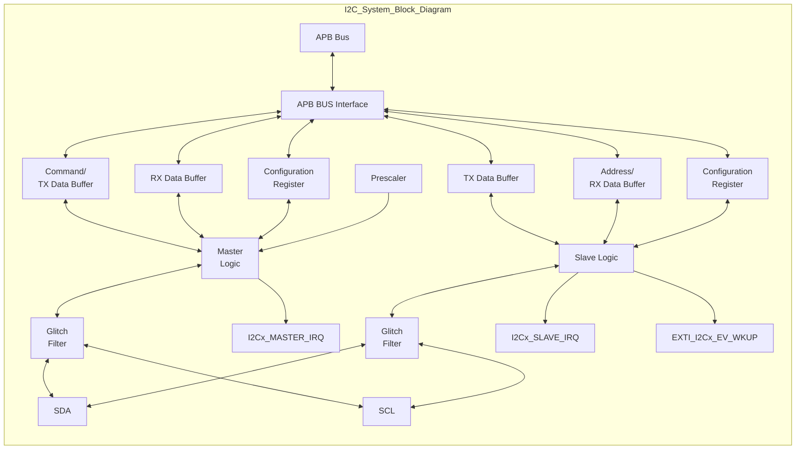

图 17-1 I2C 系统框图

## 17.3.2 协议描述

I2C 总线由一根时钟线（SCL），一根数据线（SDA）构成。所有的连接器件必须是漏极开路输出。SCL 和 SDA 线外接上拉电阻，电阻阻值取决于系统应用。

通常情况下，一个完整的通信过程包括下列 4 部分：

1. START 条件

2. 地址传输

3. 数据传输

4. STOP 条件


图 17-2 I2C 总线的时序图

### 17.3.3 主机模式

#### 17.3.3.1 发送和命令缓冲区命令

发送缓存存储命令数据以启动各种 I2C 操作。只要启用 I2C（设置 MCR.MEN 位），就可以通过发送缓存区中的命令启动以下操作：

* 地址字节和期望 ACK 或 NACK 的 START 或 STOP 条件。
* 发送数据（这是对发送缓冲区进行零扩展字节写入的默认行为）。
* 接收一个字节的数据（也可以配置为丢弃接收数据，不存储在接收缓冲区中）。
* STOP 条件（也可以配置为在发送缓冲区为空时发送 STOP 条件）。

在启动条件和停止条件之间可以插入多个发送和接收命令；发送和接收命令不得交叉。接收数据命令、接收数据和丢弃命令可以交叉，以确保只有所需的接收数据存储在接收缓冲器中。

I2C 主机在接收数据命令的最后一个字节上自动发送 NACK，除非缓冲区中的下一个命令也是接收数据命令。如果在接收数据命令完成时发送缓冲区为空，也会自动发送 NACK。

所有发送完成后，应关闭 I2C 主机使能（MCR.MEN）。

#### 17.3.3.2 主机操作

无论何时启动 I2C，它都会监视 I2C 总线，以检测 I2C 总线何时空闲（MSR.BBF）。如果 SCL 或 SDA 为低电平，则 I2C 总线不再被视为空闲；如果检测到 STOP 条件或总线空闲超时（MCFGR2.BUSIDLE 配置），I2C 总线将变为空闲。在 I2C 总线空闲后，发送缓冲区不为空，然后 I2C 主机在 I2C 总线上发起传输。参考以下步骤：

* 总线空闲等待时间等于（MCCR0.CLKLO+1）乘以预分频器（MCFGR1.PRESCALE）。
* 使用主机时钟配置 0（MCCR0）中的时序配置发送 START 条件和地址字节；如果配置为高速模式，则使用主机时钟配置 1（MCCR1）的时序配置。

根据发送缓冲区的配置，执行主机发送传输或主机接收传输。

* 在主机接收传输的最后一个字节上发送 NACK，除非发送缓冲区中的下一个命令也是接收数据命令，并且发送缓冲区不为空。
* 重复 START 或 STOP 条件的发送由发送缓冲器和/或 MCFGR1.AUTOSTOP 进行配置。重复 START 条件可以更改所使用的时序配置寄存器。

当 I2C 主机被禁用时（MCR.MEN 被清除或模式输入），I2C 会持续清空发送缓冲区，直到 STOP 条件被发送。然而，I2C 将不再暂停 I2C 总线等待发送或接收缓冲区，并且在发送缓冲区为空后，I2C 会自动生成 STOP 条件。

I2C 主机可以在下面的特定条件下停止 I2C 总线；这导致 SCL 在字节的第一位持续拉低，直到条件解除：

* I2C 主设备已启用且正忙，发送缓冲区为空，MCFGR1.AUTOSTOP 被清除。
* I2C 主设备已启用并正在接收数据，接收数据未被丢弃（由于命令或接收数据匹配），接收缓冲区已满。

### 17.3.3.3 接收缓冲区和数据匹配

接收缓冲器用于在主机接收传输期间存储接收数据。接收数据还可以被配置为丢弃接收数据，而不是存储在接收缓冲区中；这是由发送缓冲器中的命令字配置的。

接收数据支持接收数据匹配功能，该功能可以将接收到的数据与两个字节之一或掩码数据字节进行匹配。数据匹配功能还可以被配置为仅比较上次（重复）START 条件以来的前一个或两个接收到的数据字。由于命令字而丢弃的接收数据不会造成数据匹配，并将第一个接收到的数据字上的匹配延迟到接收到丢弃的数据之后。接收器匹配功能还可以配置为丢弃所有接收数据，直到检测到数据匹配为止，使用 MCFGR1.RDMO 控制位。在数据匹配后清除 MCFGR1.RDMO 控制位，在清除 MSR.DMF 之前清除 MCFGR1.RDMO，以允许接收所有后续数据。

### 17.3.3.4 时序参数

I2C 主机可以配置以下时序参数。高速模式（主机时钟配置 1（MCCR1））和其他模式（主机时钟配置 0（MCCR0））的参数可以分别配置。这允许使用常规时序参数发送高速模式主机代码，然后切换到高速模式时序（在重复 START 后），直到下一个 STOP 条件产生。


图 17-3 I2C 总线时序参数图

I2C 主机（Master）的时序参数通常与 I2C 功能时钟周期相关，参数配置需要符合对应模式要求的规格。

表 17-1 主机时序参数


<table>
  <thead>
    <tr>
        <th>参数</th>
        <th>符号</th>
        <th>时序参数（I2C 功能时钟周期）</th>
    </tr>
  </thead>
  <tbody>
    <tr>
        <td>SCL 时钟周期</td>
        <td>t<sub>SCL</sub></td>
        <td>(CLKHI+CLKLO+2+SCL_LATENCY)x2<sup>PRESCALE</sup></td>
    </tr>
    <tr>
        <td>SCL 时钟低时间</td>
        <td>t<sub>LOW</sub></td>
        <td>(CLKLO+1)x2<sup>PRESCALE</sup></td>
    </tr>
    <tr>
        <td>SCL 时钟高时间</td>
        <td>t<sub>HIGH</sub></td>
        <td>(CLKHI+1+SCL_LATENCY)x2<sup>PRESCALE</sup></td>
    </tr>
    <tr>
        <td>（重复）START 条件保持时间</td>
        <td>t<sub>HD:STA</sub></td>
        <td>(SETHOLD+1)x2<sup>PRESCALE</sup></td>
    </tr>
    <tr>
        <td>数据建立时间</td>
        <td>t<sub>SU:DAT</sub></td>
        <td>(SDA_LATENCY+1)x2<sup>PRESCALE</sup></td>
    </tr>
    <tr>
        <td>数据保持时间</td>
        <td>t<sub>HD:DAT</sub></td>
        <td>(DATAVD+1)x2<sup>PRESCALE</sup></td>
    </tr>
    <tr>
        <td>重复 START 条件建立时间</td>
        <td>t<sub>SU:STA</sub></td>
        <td>(SETHOLD+1+SCL_LATENCY)x2<sup>PRESCALE</sup></td>
    </tr>
    <tr>
        <td>STOP 条件建立时间</td>
        <td>t<sub>SU:STO</sub></td>
        <td>(SETHOLD+1+SCL_LATENCY)x2<sup>PRESCALE</sup></td>
    </tr>
    <tr>
        <td>总线空闲（STOP 条件至 START 条件）</td>
        <td>t<sub>BUF</sub></td>
        <td>(CLKLO+1+SDA_LATENCY)x2<sup>PRESCALE</sup></td>
    </tr>
    <tr>
        <td>数据有效时间</td>
        <td>t<sub>VD:DAT</sub></td>
        <td>(DATAVD+1)x2<sup>PRESCALE</sup></td>
    </tr>
    <tr>
        <td>数据应答有效时间</td>
        <td>t<sub>VD:ACK</sub></td>
        <td>(DATAVD+1)x2<sup>PRESCALE</sup></td>
    </tr>
  </tbody>
</table>


下表定义了延迟参数，这些参数假设上升时间小于一个 I2C 功能时钟周期。上升时间取决于多个因素，包括 I/O 传播延迟、I2C 总线负载以及外部上拉电阻的阻值。较大的上升时间会增加信号通过同步器（和毛刺滤波器）所需的时钟周期数，从而增加延迟。

表 17-2 同步延迟


<table>
  <thead>
    <tr>
        <th>参数</th>
        <th>定义</th>
    </tr>
  </thead>
  <tbody>
    <tr>
        <td>SCL_LATENCY</td>
        <td>ROUNDDOWN((2+FILTSCL+SCL_RISETIME)/2<sup>PRESCALE</sup>)</td>
    </tr>
    <tr>
        <td>SDA_LATENCY</td>
        <td>ROUNDDOWN((2+FILTSDA+SDA_RISETIME)/2<sup>PRESCALE</sup>)</td>
    </tr>
  </tbody>
</table>

I2C 配置需要遵循以下时序限制，从而避免 I2C 总线上出现意外 START 或 STOP 条件，同时也可避免 I2C 主机检测到意外的 START 或 STOP 条件。当 SCL 在发送（重复）START 或 STOP 条件之外为高电平时，SDA 不能改变。

表 17-3 I2C 时序参数限制


<table>
  <thead>
    <tr>
        <th>参数</th>
        <th>最小值</th>
        <th>最大值</th>
        <th>说明</th>
    </tr>
  </thead>
  <tbody>
    <tr>
        <td>CLKLO</td>
        <td>0x03</td>
        <td>-</td>
        <td>同时满足 CLKLO&gt;SCL_LATENCY</td>
    </tr>
    <tr>
        <td>CLKHI</td>
        <td>0x01</td>
        <td>-</td>
        <td>配置 CLKHI 以满足 I2C 规范中的占空比要求</td>
    </tr>
    <tr>
        <td>SETHOLD</td>
        <td>0x02</td>
        <td>-</td>
        <td>同时满足 SETHOLD&gt;SDA_LATENCY</td>
    </tr>
    <tr>
        <td>DATAVD</td>
        <td>0x01</td>
        <td>CLKLO-<br/>SDA_LATENCY-1</td>
        <td>配置 DATAVD 以满足 I2C 规范中的数据保持要求</td>
    </tr>
    <tr>
        <td>FILTSCL</td>
        <td>0x00</td>
        <td>[CLKLOx2<sup>PRESCALE</sup>]-3</td>
        <td>FILTCSL 和 FILTSDA 是唯一不乘以 2<sup>PRESCALE</sup> 的参数</td>
    </tr>
    <tr>
        <td>FILTSDA</td>
        <td>FILTSCL</td>
        <td>[CLKLOx2<sup>PRESCALE</sup>]-3</td>
        <td>配置大于 FILTSL 的 FILTSDA 可以延迟 SDA 输入，以补偿板级偏移</td>
    </tr>
    <tr>
        <td>BUSIDLE</td>
        <td>(CLKLO+SETHOLD+2)x2</td>
        <td>-</td>
        <td>同时满足 BUSIDLE&gt;CLKHI+1</td>
    </tr>
  </tbody>
</table>

时序参数必须配置为满足 I2C 规范的要求；这取决于所支持的模式和 I2C 功能时钟频率。当使用不同的时钟配置寄存器在两种模式之间切换时（例如，快速和高速模式），PRESCALE 系数必须在模式之间保持恒定。下面提供了一些示例时序配置。

表 17-4 I2C 示例时序配置


<table>
  <thead>
    <tr>
        <th>I2C 模式</th>
        <th>时钟频率</th>
        <th>波特率</th>
        <th>PRESCALE</th>
        <th>FILTSCL/FILTSDA</th>
        <th>SETHOLD</th>
        <th>CLKO</th>
        <th>CLKHI</th>
        <th>DATAVD</th>
    </tr>
  </thead>
  <tbody>
    <tr>
        <td>Standard</td>
        <td>8MHz</td>
        <td>100kbps</td>
        <td>0x0</td>
        <td>0xD/0xF</td>
        <td>0x37</td>
        <td>0x29</td>
        <td>0x16</td>
        <td>0x0D</td>
    </tr>
    <tr>
        <td>Fast</td>
        <td>8MHz</td>
        <td>400kbps</td>
        <td>0x0</td>
        <td>0x0/0x0</td>
        <td>0x04</td>
        <td>0x0B</td>
        <td>0x05</td>
        <td>0x02</td>
    </tr>
    <tr>
        <td>Fast+</td>
        <td>8MHz</td>
        <td>1Mbps</td>
        <td>0x0</td>
        <td>0x0/0x0</td>
        <td>0x02</td>
        <td>0x03</td>
        <td>0x01</td>
        <td>0x01</td>
    </tr>
    <tr>
        <td>Standard</td>
        <td>48MHz</td>
        <td>100kbps</td>
        <td>0x2</td>
        <td>0x2/0xE</td>
        <td>0x3A</td>
        <td>0x3B</td>
        <td>0x39</td>
        <td>0x0C</td>
    </tr>
    <tr>
        <td>Fast</td>
        <td>48MHz</td>
        <td>400kbps</td>
        <td>0x0</td>
        <td>0x1/0x1</td>
        <td>0x1D</td>
        <td>0x3E</td>
        <td>0x35</td>
        <td>0x0F</td>
    </tr>
    <tr>
        <td>Fast</td>
        <td>48MHz</td>
        <td>400kbps</td>
        <td>0x2</td>
        <td>0x1/0x1</td>
        <td>0x07</td>
        <td>0x11</td>
        <td>0x0B</td>
        <td>0x03</td>
    </tr>
  </tbody>
</table>

<table>
  <thead>
    <tr>
        <th>I2C 模式</th>
        <th>时钟频率</th>
        <th>波特率</th>
        <th>PRESCALE</th>
        <th>FILTSCL/FILTSDA</th>
        <th>SETHOLD</th>
        <th>CLKO</th>
        <th>CLKHI</th>
        <th>DATAVD</th>
    </tr>
  </thead>
  <tbody>
    <tr>
        <td>Fast+</td>
        <td>48MHz</td>
        <td>1Mbps</td>
        <td>0x2</td>
        <td>0x1/0x1</td>
        <td>0x03</td>
        <td>0x06</td>
        <td>0x04</td>
        <td>0x04</td>
    </tr>
    <tr>
        <td>HS 模式</td>
        <td>48MHz</td>
        <td>3.2Mbps</td>
        <td>0x0</td>
        <td>0x0/0x0</td>
        <td>0x07</td>
        <td>0x08</td>
        <td>0x03</td>
        <td>0x01</td>
    </tr>
  </tbody>
</table>

### 17.3.3.5 错误条件说明

I2C 主机在活动时监控错误，以下情况会生成错误标志并阻止发送新的 START 条件，直到该标志被软件清除：

* 检测到 START 或 STOP 条件，且该条件不是由 I2C 主机生成的（MSR.ALF 被置位）。
软件必须响应 MSR.ALF 标志，用于终止现有命令（通过设置 MCR.RST）。

* 在 SDA 上发送数据，但接收到不同的数据（MSR.ALF 被置位）。

* 在发送数据时检测到 NACK，且 MCFGR1.IGNACK 为清除状态（MSR.NDF 被置位）。

* 检测到 NACK，但地址字节的期望响应为 ACK，且 MCFGR1.IGNACK 为清除状态（MSR.NDF 被置位）。

* 检测到 ACK，但地址字节的期望响应为 NACK，且 MCFGR1.IGNACK 为清除状态（MSR.NDF 被置位）。

* 在没有 START 条件的情况下，发送缓冲区正在请求发送或接收数据（MSR.FEF 被置位）。

* SCL（或 SDA，如果设置了 MCFGR1.TIMECFG）在（MCFGR3.PINLOW*256）预分频器周期内为低电平且没有发生引脚状态变化（MSR.PLTF 被置位）。

软件必须响应 MSR.PLTF 标志，用于终止现有命令（通过设置 MCR.RST）。

当 SCL 和 SDA 在（MCFGR2.BUSIDLE+1）预分频器周期内保持高电平时，MCFGR2.BUSIDLE 字段可用于强制将 I2C 总线视为空闲。通常，当 I2C 主设备首次启用时，I2C 总线被认为是空闲的。但是，当

MCFGR2.BUSIDLE 配置为大于零时，SCL 和/或 SDA 必须保持高电平持续（MCFGR2.BUSIDLE+1）个预分频周期后，I2C 总线才会首次被视为空闲。

### 17.3.3.6 中断

下表列出了可以产生 I2C 主机中断的主机模式标志。


<table>
  <thead>
    <tr>
        <th>标志</th>
        <th>说明</th>
        <th>中断</th>
        <th>唤醒</th>
    </tr>
  </thead>
  <tbody>
    <tr>
        <td>TDF</td>
        <td>数据可写入发送缓冲区</td>
        <td>✓</td>
        <td>-</td>
    </tr>
    <tr>
        <td>RDF</td>
        <td>可以从接收缓冲区读取数据</td>
        <td>✓</td>
        <td>-</td>
    </tr>
    <tr>
        <td>EPF</td>
        <td>主机已发送重复 START 或 STOP 条件</td>
        <td>✓</td>
        <td>-</td>
    </tr>
    <tr>
        <td>SDF</td>
        <td>主机已发送 STOP 条件</td>
        <td>✓</td>
        <td>-</td>
    </tr>
    <tr>
        <td>NDF</td>
        <td>● 在地址字节期间，主机预期收到 ACK，但检测到 NACK<br/>● 在地址字节期间，主机预期收到 NACK，但检测到 ACK<br/>● 在主机发送数据字节期间，主机检测到 NACK</td>
        <td>✓</td>
        <td>-</td>
    </tr>
    <tr>
        <td>ALF</td>
        <td>● 在错误的时间检测到 START/STOP 条件，主机失去了仲裁<br/>● 主机正在发送数据，但收到的数据与发送的数据不同</td>
        <td>✓</td>
        <td>-</td>
    </tr>
    <tr>
        <td>FEF</td>
        <td>主机期望命令缓冲区中出现 START 条件，但命令缓冲区的下一个条目不是 START 条件</td>
        <td>✓</td>
        <td>-</td>
    </tr>
    <tr>
        <td>PLTF</td>
        <td>引脚低超时已启用，SCL（或者已配置 SDA）保持低电平时间长于配置的超时时间</td>
        <td>✓</td>
        <td>-</td>
    </tr>
  </tbody>
</table>


<table>
  <thead>
    <tr>
        <th>标志</th>
        <th>说明</th>
        <th>中断</th>
        <th>唤醒</th>
    </tr>
  </thead>
  <tbody>
    <tr>
        <td>DMF</td>
        <td>接收到的数据与配置的数据匹配，由 MTDR.CMD 配置的接收和丢弃的数据不会置位 DMF</td>
        <td>✓</td>
        <td>-</td>
    </tr>
    <tr>
        <td>MBF</td>
        <td>I2C 主机正忙于发送/接收数据</td>
        <td>-</td>
        <td>-</td>
    </tr>
    <tr>
        <td>BBF</td>
        <td>I2C 主机已启用，在 I2C 总线上检测到活动，但未检测到 STOP 条件，也未发生总线空闲超时（如果已启用）</td>
        <td>-</td>
        <td>-</td>
    </tr>
  </tbody>
</table>

### 17.3.4 从机模式

为了在 I2C 总线上执行所有从机模式传输，I2C 从机逻辑独立于 I2C 主机逻辑运行。

#### 17.3.4.1 地址匹配

I2C 从机可以配置：

* 在 7 位或 10 位寻址模式下匹配两个地址之一。
* 在 7 位或 10 位寻址模式下匹配一个地址范围。
* 匹配广播地址，并生成相应的标志。
* 匹配 SMBus 报警地址，并生成相应的标志。
* 检测高速模式主机代码，禁用数字滤波器和输出有效延迟时间，直到检测到下一个 STOP 条件。

在匹配到有效地址后，I2C 从机会自动执行从机发送传输或从机接收传输，直到：

* 检测到 NACK（除非设置了 SCR1.IGNACK）
* 检测到比特错误（I2C 从机正在驱动 SDA，但采样到不同的值）
* 检测到（重复）START 或 STOP 条件

#### 17.3.4.2 发送和接收数据

* 发送和接收数据寄存器是双缓冲的，仅在从机发送传输和从机接收传输期间分别更新。
* 接收到的从机地址可以配置为从机接收数据寄存器（SRDR）或从机地址状态寄存器（SASR）读取。
* 发送数据寄存器可以配置为仅在检测到从机发送传输后请求数据，或者在发送数据寄存器为空时请求新数据。
* 仅当发送数据标志（SSR.TDF）置高时，才能写从机发送数据寄存器（STDR）。
* 仅当接收数据标志（SSR.RDF）置高（或地址有效标志置高且 SCR1.RXCFG=1）时，才能读取从机接收数据寄存器（SRDR）。
* 仅当地址有效标志（SSR.AVF）置高时，才能读取从机地址状态寄存器（SASR）。

#### 17.3.4.3 时钟延展

I2C 从机支持时钟延展。可以配置以下条件来执行时钟延展：

* 在地址字节的第 9 个时钟脉冲期间，地址有效标志（SSR.AVF）置高。
* 在从机发送传输的第 9 个时钟脉冲周期，发送数据标志（SSR.TDF）置高。
* 在从机接收传输的第 9 个时钟脉冲期间，接收数据标志（SSR.RDF）置高。
* 在地址字节或从机接收传输的第 8 个时钟脉冲期间，发送 ACK 标志（SSR.TAF）置高。在高速模式下，此配置被禁用。
* 时钟延展也可以扩展到 SCR2.CLKHOLD 周期，以允许额外的建立时间，从而支持外部对 SDA 引脚进行采样。在高速模式下，此配置被禁用。

除非通过 SCR2.CLKHOLD 配置进行扩展，否则在启用时钟延展时，SDA 更新后，时钟延展将延展一个外设总线时钟周期。

### 17.3.4.4 时序参数

I2C 从机可以配置以下时序参数。当 SCR2.FILTEN 清除时或当 I2C 从机检测到高速模式时，这些参数将被禁用。禁用时，I2C 从机直接从 I2C 总线计时，可能无法满足 I2C 规范的所有时序要求（例如标准/快速模式下的 SDA 最小保持时间）。

* 从 SCL 拉低到 SDA 更新的 SDA 数据有效时间

* 启用时钟延展时的 SCL 保持时间，以增加采样外部 SDA 时的建立时间

* SCL 毛刺过滤时间

* SDA 毛刺过滤时间

I2C 从机对时序参数有以下限制：

* SCR2.FILTSDA 必须配置为大于或等于 SCR2.FILTSCL（除非补偿 SDA 和 SCL 之间的板级偏移）。

* SCR2.DATAVD 的配置必须小于最小 SCL 低电平周期。

### 17.3.4.5 错误条件说明

I2C 从机可以检测以下错误情况：

* 当 I2C 从机驱动 SDA 时，采样值与预期值不同，位错误标志（SSR.BEF）会置高。

* 当发送数据欠载或接收数据溢出时，缓冲区错误标志（SSR.FEF）会置高。为避免发生欠载和溢出，可打开时钟延展功能。

* 当 SCR1.RXCFG 置高时，如地址溢出，缓冲区错误标志（SSR.FEF）会置高，否则不会标记地址溢出。为避免发生溢出的情况，可打开时钟延展功能。

I2C 从机不会因 SCL 和/或 SDA 被拉低而实现超时检测。如果需要检测这种情况，则应使用 I2C 主机逻辑，以便在检测到此类条件时，软件可以复位 I2C 从机。

### 17.3.4.6 中断

下表列出了可以产生 I2C 从机中断的从机模式标志。


<table>
  <thead>
    <tr>
        <th>标志</th>
        <th>说明</th>
        <th>中断</th>
        <th>唤醒</th>
    </tr>
  </thead>
  <tbody>
    <tr>
        <td>TDF</td>
        <td>数据可写入从机发送数据寄存器（STDR）</td>
        <td>✓</td>
        <td>-</td>
    </tr>
    <tr>
        <td>RDF</td>
        <td>可以从从机接收数据寄存器（SRDR）读取数据</td>
        <td>✓</td>
        <td>-</td>
    </tr>
    <tr>
        <td>AVF</td>
        <td>可以从从机地址状态寄存器（SASR）读取地址</td>
        <td>✓</td>
        <td>✓</td>
    </tr>
    <tr>
        <td>TAF</td>
        <td>ACK/NACK 可以写入从机发送 ACK 寄存器（STAR）</td>
        <td>✓</td>
        <td>-</td>
    </tr>
    <tr>
        <td>RSF</td>
        <td>从机检测到地址匹配，随后出现重复 START 条件</td>
        <td>✓</td>
        <td>-</td>
    </tr>
    <tr>
        <td>SDF</td>
        <td>从机检测到地址匹配，随后出现 STOP 条件</td>
        <td>✓</td>
        <td>-</td>
    </tr>
    <tr>
        <td>BEF</td>
        <td>从机正在发送数据，但收到的数据与发送的数据不同</td>
        <td>✓</td>
        <td>-</td>
    </tr>
    <tr>
        <td>FEF</td>
        <td>● 发送数据欠载<br/>● 接收数据溢出<br/>● 地址状态溢出（当接收数据配置 SCR1.RXCFG=1 时）<br/>FEF 标志只能在禁用时钟延展时被置位。</td>
        <td>✓</td>
        <td>-</td>
    </tr>
    <tr>
        <td>AM0F</td>
        <td>从机检测到与 SADDR.ADDR0 的地址匹配</td>
        <td>✓</td>
        <td>-</td>
    </tr>
    <tr>
        <td>AM1F</td>
        <td>从机检测到与 SADDR.ADDR1 的地址匹配或使用地址范围</td>
        <td>✓</td>
        <td>-</td>
    </tr>
    <tr>
        <td>GCF</td>
        <td>从机检测到与广播地址匹配的地址</td>
        <td>✓</td>
        <td>-</td>
    </tr>
  </tbody>
</table>

<table>
  <thead>
    <tr>
        <th>标志</th>
        <th>说明</th>
        <th>中断</th>
        <th>唤醒</th>
    </tr>
  </thead>
  <tbody>
    <tr>
        <td>SARF</td>
        <td>从机检测到与 SMBus 报警地址匹配的地址</td>
        <td>✓</td>
        <td>-</td>
    </tr>
    <tr>
        <td>SBF</td>
        <td>I2C 从机正忙于接收地址字节或正在发送/接收数据</td>
        <td>-</td>
        <td>-</td>
    </tr>
    <tr>
        <td>BBF</td>
        <td>I2C 从机已启用，在 I2C 总线上检测到 START 条件，但未检测到 STOP 条件</td>
        <td>-</td>
        <td>-</td>
    </tr>
  </tbody>
</table>

### 17.3.5 通信电平选择功能

HSI2C 接口支持不同电压下电平信号通信。功能详情参见《端口控制器（GPIO）》章节“HSI2C 通信电平选择功能”相关描述。

## 17.4 操作示例

### 17.4.1 主机发送模式

主机发送模式下的操作流程如下：

**步骤 1.** 使能 I2C 模块时钟，复位 I2C 模块。

**步骤 2.** 配置 I2C 模块 SCL、SDA 管脚。

**步骤 3.** 根据传输波特率配置 I2C 寄存器，使发送的 SCL 的频率和传输波特率一致：

* MCFGR1.PRESCALE
* MCCR0.CLKLO
* MCCR0.CLKHI
* MCCR0.DATAVD
* MCCR0.SETHOLD

**步骤 4.** 设置 MCR.MEN 为 1，使能 I2C 模块。

**步骤 5.** 查询 MSR.BBF 是否为 0，为 0 则继续进行下一步操作。

**步骤 6.** 向 MTDR 寄存器写入 START 指令和地址+写操作，例如 0x4AA。

**步骤 7.** 等待 MSR.TDF 为 1 后将待发送数据写入 MTDR，继续查询 MSR.TDF，等待 MSR.TDF 为 1 后将下一个待发送数据写入 MTDR。循环本步骤操作直到把所有待发送数据写入 MTDR。

**步骤 8.** 继续查询 MSR.TDF，等待 MSR.TDF 为 1 后向 MTDR.CMD 写入停止（STOP）命令，例如 0x2。查询 I2C 主机 MSR.SDF 是否为 1，为 1 表示 STOP 条件已发出，发送操作结束。

### 17.4.2 主机接收模式

主机接收模式下的操作流程如下：

**步骤 1.** 使能 I2C 模块时钟，复位 I2C 模块。

**步骤 2.** 配置 I2C 模块 SCL、SDA 管脚。

**步骤 3.** 根据传输波特率配置 I2C 寄存器，使发送的 SCL 的频率和传输波特率一致：

* MCFGR1.PRESCALE
* MCCR0.CLKLO
* MCCR0.CLKHI
* MCCR0.DATAVD
* MCCR0.SETHOLD

**步骤 4.** 设置 MCR.MEN 为 1，使能 I2C 模块。

**步骤 5.** 查询 MSR.BBF 是否为 0，为 0 则继续进行下一步操作。

步骤 6. 向 MTDR 寄存器写入 START 指令和地址+读操作，例如 0x4AB。

步骤 7. 等待 MSR.TDF 为 1 后将接收数据指令+数据数量（数据数量为实际接收数据数量减 1）写入 MTDR，例如 0x103，表示接收 4 个数据。

步骤 8. 等待 MSR.RDF 为 1 后从 MRDR 读取接收到的数据，继续查询 MSR.RDF，等待 MSR.RDF 为 1 后从 MRDR 读取下一个接收到的数据。循环本步骤操作直到把所有接收到的数据从 MRDR 读出。

步骤 9. 继续查询 MSR.TDF，等待 MSR.TDF 为 1 后向 MTDR.CMD 写入停止（STOP）命令，例如 0x2。查询 I2C 主机 MSR.SDF 是否为 1，为 1 表示 STOP 条件已发出，接收操作结束。

### 17.4.3 从机发送模式

从机发送模式下的操作流程如下：

步骤 1. 使能 I2C 模块时钟，复位 I2C 模块。

步骤 2. 配置 I2C 模块 SCL、SDA 管脚。

步骤 3. 配置 I2C 从机控制 1 寄存器和从机地址寄存器：

* SCR1.ADDRMODE
* SCR1.TXCFG
* SADDR.ADDR0

步骤 4. 设置 SCR0.SEN 为 1，使能 I2C 模块。

步骤 5. 查询 SSR.AVF 是否为 1，为 1 则继续进行下一步操作。

步骤 6. 读取 SASR.RADDR[0]：

* 为 0 表示主机写操作，从机处于接收模式；
* 为 1 表示主机读操作，从机处于发送模式。

步骤 7. 等待 SSR.TDF 为 1 后把待发送数据写入 STDR，继续查询 SSR.TDF，等待 SSR.TDF 为 1 后将下一个待发送数据写入 STDR。循环本步骤操作直到把所有待发送数据写入 STDR。

步骤 8. 查询 SSR.AVF 是否为 0，为 0 表示已读取 I2C 地址状态寄存器 SASR。查询 I2C 从机 SSR.SDF 是否为 1，为 1 表示已检测到 STOP 条件，发送操作结束。

### 17.4.4 从机接收模式

从机接收模式下的操作流程如下：

步骤 1. 使能 I2C 模块时钟，复位 I2C 模块。

步骤 2. 配置 I2C 模块 SCL、SDA 管脚。

步骤 3. 配置 I2C 从机控制 1 寄存器和从机地址寄存器：

* SCR1.ADDRMODE
* SADDR.ADDR0

步骤 4. 设置 SCR0.SEN 为 1，使能 I2C 模块。

步骤 5. 查询 SSR.AVF 是否为 1，为 1 则继续进行下一步操作。

步骤 6. 读取 SASR.RADDR[0]：

* 为 0 表示主机写操作，从机处于接收模式；
* 为 1 表示主机读操作，从机处于发送模式。

步骤 7. 等待 SSR.RDF 为 1 后从 SRDR 读取接收到的数据，继续查询 SSR.RDF，等待 SSR.RDF 为 1 后从 SRDR 读取下一个接收到的数据。循环本步骤操作直到把所有接收到的数据从 SRDR 读出。

步骤 8. 查询 SSR.AVF 是否为 0，为 0 表示已读取 I2C 地址状态寄存器 SASR，查询 I2C 从机 SSR.SDF 是否为 1，为 1 表示已检测到 STOP 条件，接收操作结束。

# 17.5 寄存器

## 17.5.1 寄存器总表

**HSI2C 基地址**：0x4000BC00

表 17-7 高速集成电路总线（HSI2C）寄存器偏移地址


<table>
  <thead>
    <tr>
        <th>偏移地址</th>
        <th>寄存器</th>
        <th>描述</th>
    </tr>
  </thead>
  <tbody>
    <tr>
        <td>0x010</td>
        <td>I2C_MCR</td>
        <td>主机控制寄存器</td>
    </tr>
    <tr>
        <td>0x014</td>
        <td>I2C_MSR</td>
        <td>主机状态寄存器</td>
    </tr>
    <tr>
        <td>0x018</td>
        <td>I2C_MIER</td>
        <td>主机中断使能寄存器</td>
    </tr>
    <tr>
        <td>0x01C</td>
        <td>I2C_MSCR</td>
        <td>主机状态清除寄存器</td>
    </tr>
    <tr>
        <td>0x024</td>
        <td>I2C_MCFGR1</td>
        <td>主机配置 1 寄存器</td>
    </tr>
    <tr>
        <td>0x028</td>
        <td>I2C_MCFGR2</td>
        <td>主机配置 2 寄存器</td>
    </tr>
    <tr>
        <td>0x02C</td>
        <td>I2C_MCFGR3</td>
        <td>主机配置 3 寄存器</td>
    </tr>
    <tr>
        <td>0x030</td>
        <td>I2C_MCCR0</td>
        <td>主机时钟配置 0 寄存器</td>
    </tr>
    <tr>
        <td>0x034</td>
        <td>I2C_MCCR1</td>
        <td>主机时钟配置 1 寄存器</td>
    </tr>
    <tr>
        <td>0x038</td>
        <td>I2C_MTDR</td>
        <td>主机发送数据寄存器</td>
    </tr>
    <tr>
        <td>0x03C</td>
        <td>I2C_MRDR</td>
        <td>主机接收数据寄存器</td>
    </tr>
    <tr>
        <td>0x040</td>
        <td>I2C_MDMR</td>
        <td>主机数据配置寄存器</td>
    </tr>
    <tr>
        <td>0x110</td>
        <td>I2C_SCR0</td>
        <td>从机控制 0 寄存器</td>
    </tr>
    <tr>
        <td>0x114</td>
        <td>I2C_SSR</td>
        <td>从机状态寄存器</td>
    </tr>
    <tr>
        <td>0x118</td>
        <td>I2C_SIER</td>
        <td>从机中断使能寄存器</td>
    </tr>
    <tr>
        <td>0x11C</td>
        <td>I2C_SSCR</td>
        <td>从机状态清除寄存器</td>
    </tr>
    <tr>
        <td>0x120</td>
        <td>I2C_SCR1</td>
        <td>从机控制 1 寄存器</td>
    </tr>
    <tr>
        <td>0x124</td>
        <td>I2C_SCR2</td>
        <td>从机控制 2 寄存器</td>
    </tr>
    <tr>
        <td>0x128</td>
        <td>I2C_STAR</td>
        <td>从机发送 ACK 寄存器</td>
    </tr>
    <tr>
        <td>0x12C</td>
        <td>I2C_STDR</td>
        <td>从机发送数据寄存器</td>
    </tr>
    <tr>
        <td>0x130</td>
        <td>I2C_SRDR</td>
        <td>从机接收数据寄存器</td>
    </tr>
    <tr>
        <td>0x140</td>
        <td>I2C_SADDR</td>
        <td>从机地址寄存器</td>
    </tr>
    <tr>
        <td>0x150</td>
        <td>I2C_SASR</td>
        <td>从机地址状态寄存器</td>
    </tr>
  </tbody>
</table>

## 17.5.2 主机控制寄存器 (I2C_MCR)


<table>
  <thead>
    <tr>
        <th>Offset</th>
        <th colspan="32">Bit Position</th>
    </tr>
    <tr>
        <th>0x010</th>
        <th>31</th>
        <th>30</th>
        <th>29</th>
        <th>28</th>
        <th>27</th>
        <th>26</th>
        <th>25</th>
        <th>24</th>
        <th>23</th>
        <th>22</th>
        <th>21</th>
        <th>20</th>
        <th>19</th>
        <th>18</th>
        <th>17</th>
        <th>16</th>
        <th>15</th>
        <th>14</th>
        <th>13</th>
        <th>12</th>
        <th>11</th>
        <th>10</th>
        <th>9</th>
        <th>8</th>
        <th>7</th>
        <th>6</th>
        <th>5</th>
        <th>4</th>
        <th>3</th>
        <th>2</th>
        <th>1</th>
        <th>0</th>
    </tr>
    <tr>
        <th>Reset</th>
        <th colspan="32">0x00000000</th>
    </tr>
    <tr>
        <th>Name</th>
        <th colspan="28">Reserved</th>
        <th>DBGEN</th>
        <th>Reserved</th>
        <th>RST</th>
        <th>MEN</th>
    </tr>
    <tr>
        <th>Access</th>
        <th colspan="28"> </th>
        <th>RW</th>
        <th> </th>
        <th>RW</th>
        <th>RW</th>
    </tr>
  </thead>
</table>
<table>
  <thead>
    <tr>
        <th>位/位域</th>
        <th>标记</th>
        <th>位名</th>
        <th>功能描述</th>
        <th>读写</th>
    </tr>
  </thead>
  <tbody>
    <tr>
        <td>31:4</td>
        <td>Reserved</td>
        <td>保留</td>
        <td>-</td>
        <td>-</td>
    </tr>
    <tr>
        <td>3</td>
        <td>DBGEN</td>
        <td>调试启用</td>
        <td>在调试模式下启用主机。<br/>● 0b0：在调试模式中禁用主机<br/>● 0b1：在调试模式中启用主机</td>
        <td>RW</td>
    </tr>
    <tr>
        <td>2</td>
        <td>Reserved</td>
        <td>保留</td>
        <td>-</td>
        <td>-</td>
    </tr>
    <tr>
        <td>1</td>
        <td>RST</td>
        <td>软件重置</td>
        <td>● 0b0：主机逻辑不重置<br/>● 0b1：主机逻辑重置<br/>重置所有内部主机逻辑和寄存器，主控制寄存器（MCR）除外。RST 保持置位，直到被软件清除。重置立即生效，并保持置位，直到被软件清除。清除软件重置之前不需要最小延迟。</td>
        <td>RW</td>
    </tr>
    <tr>
        <td>0</td>
        <td>MEN</td>
        <td>主机启用</td>
        <td>● 0b0：禁用主机模式<br/>● 0b1：启用主机模式</td>
        <td>RW</td>
    </tr>
  </tbody>
</table>

### 17.5.3 主机状态寄存器（I2C_MSR）


<table>
  <thead>
    <tr>
        <th>Offset</th>
        <th colspan="34">Bit Position</th>
    </tr>
    <tr>
        <th>0x014</th>
        <th>31</th>
        <th>30</th>
        <th>29</th>
        <th>28</th>
        <th>27</th>
        <th>26</th>
        <th>25</th>
        <th>24</th>
        <th>23</th>
        <th>22</th>
        <th>21</th>
        <th>20</th>
        <th>19</th>
        <th>18</th>
        <th>17</th>
        <th>16</th>
        <th>15</th>
        <th>14</th>
        <th>13</th>
        <th>12</th>
        <th>11</th>
        <th>10</th>
        <th>9</th>
        <th>8</th>
        <th>7</th>
        <th>6</th>
        <th>5</th>
        <th>4</th>
        <th>3</th>
        <th>2</th>
        <th>1</th>
        <th colspan="3">0</th>
    </tr>
    <tr>
        <th>Reset</th>
        <th colspan="34">0x00000001</th>
    </tr>
    <tr>
        <th>Name</th>
        <th colspan="6">Reserved</th>
        <th>BBF</th>
        <th>MBF</th>
        <th colspan="9">Reserved</th>
        <th>DMF</th>
        <th>PLTF</th>
        <th>FEF</th>
        <th>ALF</th>
        <th>NDF</th>
        <th>SDF</th>
        <th>EPF</th>
        <th colspan="8">Reserved</th>
        <th>RDF</th>
        <th>TDF</th>
    </tr>
    <tr>
        <th>Access</th>
        <th colspan="6"> </th>
        <th>RO</th>
        <th>RO</th>
        <th colspan="9"> </th>
        <th>RO</th>
        <th>RO</th>
        <th>RO</th>
        <th>RO</th>
        <th>RO</th>
        <th>RO</th>
        <th>RO</th>
        <th colspan="8"> </th>
        <th>RO</th>
        <th>RO</th>
    </tr>
  </thead>
</table>
<table>
  <thead>
    <tr>
        <th>位/位域</th>
        <th>标记</th>
        <th>位名</th>
        <th>功能描述</th>
        <th>读写</th>
    </tr>
  </thead>
  <tbody>
    <tr>
        <td>31:26</td>
        <td>Reserved</td>
        <td>保留</td>
        <td>-</td>
        <td>-</td>
    </tr>
    <tr>
        <td>25</td>
        <td>BBF</td>
        <td>总线忙标志</td>
        <td>● 0b0：I2C 总线空闲<br/>● 0b1：I2C 总线忙</td>
        <td>RO</td>
    </tr>
    <tr>
        <td>24</td>
        <td>MBF</td>
        <td>主机忙标志</td>
        <td>● 0b0：I2C 主机空闲<br/>● 0b1：I2C 主机忙</td>
        <td>RO</td>
    </tr>
    <tr>
        <td>23:15</td>
        <td>Reserved</td>
        <td>保留</td>
        <td>-</td>
        <td>-</td>
    </tr>
    <tr>
        <td>14</td>
        <td>DMF</td>
        <td>数据匹配标志</td>
        <td>● 0b0：尚未收到匹配数据<br/>● 0b1：已收到匹配数据<br/>表示接收的数据已与 MDMR.MATCH0 和/或 MDMR.MATCH1 字段匹配（由 MCFGR1.MATCFG 配置）。由于 MTDR.CMD 字段而丢弃的接收数据不会导致 DMF 设置。</td>
        <td>RO</td>
    </tr>
    <tr>
        <td>13</td>
        <td>PLTF</td>
        <td>引脚低超时标志</td>
        <td>● 0b0：引脚低电平超时未发生或已禁用<br/>● 0b1：引脚低电平超时已发生<br/>在 SCL 和/或 SDA 输入低超过引脚低周期（引脚低超时，MCFGR3.PINLOW）时设置，即使在 I2C 主机空闲时。<br/>1. 软件负责解决引脚低条件<br/>2. 只要引脚低超时持续，就不能清除 PLTF<br/>3. 在 I2C 可以开始 START 条件之前，必须清除 PLTF。</td>
        <td>RO</td>
    </tr>
    <tr>
        <td>12</td>
        <td>FEF</td>
        <td>缓冲区错误标志</td>
        <td>● 0b0：无错误<br/>● 0b1：在没有 START 条件的情况下发送或接收数据的主机<br/>检测在未首先生成（重复）START 条件的情况下发送或接收数据的尝试。当 MCFGR1.AUTOSTOP=1 时，如果发送缓冲器下溢，则可能发生这种情况。当 FEF 置位时，I2C 主机发送 STOP 条件（如果忙碌），并且在 FEF 被清除之前不会启动新的 START 条件。</td>
        <td>RO</td>
    </tr>
  </tbody>
</table>

<table>
  <thead>
    <tr>
        <th>位/位域</th>
        <th>标记</th>
        <th>位名</th>
        <th>功能描述</th>
        <th>读写</th>
    </tr>
  </thead>
  <tbody>
    <tr>
        <td>11</td>
        <td>ALF</td>
        <td>仲裁丢失标志</td>
        <td>● 0b0：主机未丢失仲裁<br/>● 0b1：主机丢失仲裁<br/>如果存在以下任一条件会置位：<br/>1. I2C 主机发送逻辑 1，并在 I2C 总线上检测逻辑 0<br/>2. I2C 主机在发送数据时检测到 START 或 STOP 条件<br/>当 ALF 置位时，I2C 主机释放 I2C 总线（变为空闲），并且在 ALF 被清除之前，I2C 主机不会启动新的 START 条件。</td>
        <td>RO</td>
    </tr>
    <tr>
        <td>10</td>
        <td>NDF</td>
        <td>NACK 检测标志</td>
        <td>● 0b0：未检测到不期望 NACK<br/>● 0b1：检测到不期望 NACK<br/>如果 I2C 主机在发送地址或数据时检测到它不期望的 NACK 会置位。置位后，在 NDF 被清除之前，主机不会开始新的 START 条件。如果给定地址需要 NACK（由命令字配置），如果未生成 NACK，则 NDF 置位。<br/>NDF 置位时，如果 MCFGR1.AUTOSTOP=1，或发送缓冲区不为空，I2C 主机自动发送 STOP 条件。</td>
        <td>RO</td>
    </tr>
    <tr>
        <td>9</td>
        <td>SDF</td>
        <td>停止检测标志</td>
        <td>● 0b0：主机未生成 STOP 情况<br/>● 0b1：主机已生成 STOP 情况<br/>当 I2C 主机生成 STOP 条件时置位。</td>
        <td>RO</td>
    </tr>
    <tr>
        <td>8</td>
        <td>EPF</td>
        <td>结束数据包标志</td>
        <td>● 0b0：主机未生成 STOP 或重复 START 条件<br/>● 0b1：主机已生成 STOP 和重复 START 条件<br/>当 I2C 主机生成重复的 START 条件或 STOP 条件时置位。主机首次生成 START 条件时不会置位。</td>
        <td>RO</td>
    </tr>
    <tr>
        <td>7:2</td>
        <td>Reserved</td>
        <td>*保留*</td>
        <td>-</td>
        <td>-</td>
    </tr>
    <tr>
        <td>1</td>
        <td>RDF</td>
        <td>接收数据标志</td>
        <td>● 0b0：接收数据未就绪<br/>● 0b1：接收数据就绪<br/>每当接收缓冲区已满时，都会置位接收数据标志 RDF。</td>
        <td>RO</td>
    </tr>
    <tr>
        <td>0</td>
        <td>TDF</td>
        <td>发送数据标志</td>
        <td>● 0b0：发送数据请求未产生<br/>● 0b1：发送数据请求已产生<br/>当发送缓冲区为空时 TDF 置位。</td>
        <td>RO</td>
    </tr>
  </tbody>
</table>

### 17.5.4 主机中断使能寄存器（I2C_MIER）


<table>
  <thead>
    <tr>
        <th>Offset</th>
        <th colspan="32">Bit Position</th>
    </tr>
    <tr>
        <th>0x018</th>
        <th>31</th>
        <th>30</th>
        <th>29</th>
        <th>28</th>
        <th>27</th>
        <th>26</th>
        <th>25</th>
        <th>24</th>
        <th>23</th>
        <th>22</th>
        <th>21</th>
        <th>20</th>
        <th>19</th>
        <th>18</th>
        <th>17</th>
        <th>16</th>
        <th>15</th>
        <th>14</th>
        <th>13</th>
        <th>12</th>
        <th>11</th>
        <th>10</th>
        <th>9</th>
        <th>8</th>
        <th>7</th>
        <th>6</th>
        <th>5</th>
        <th>4</th>
        <th>3</th>
        <th>2</th>
        <th>1</th>
        <th>0</th>
    </tr>
  </thead>
  <tbody>
    <tr>
        <td>Reset</td>
        <td colspan="32">0x00000000</td>
    </tr>
    <tr>
        <td>Name</td>
        <td colspan="17">Reserved</td>
        <td>DMIE</td>
        <td>PLTIE</td>
        <td>FEIE</td>
        <td>ALIE</td>
        <td>NDIE</td>
        <td>SDIE</td>
        <td>EPIE</td>
        <td colspan="6">Reserved</td>
        <td>RDIE</td>
        <td>TDIE</td>
    </tr>
    <tr>
        <td>Access</td>
        <td colspan="17"> </td>
        <td>RW</td>
        <td>RW</td>
        <td>RW</td>
        <td>RW</td>
        <td>RW</td>
        <td>RW</td>
        <td>RW</td>
        <td colspan="6"> </td>
        <td>RW</td>
        <td>RW</td>
    </tr>
  </tbody>
</table>
<table>
  <thead>
    <tr>
        <th>位/位域</th>
        <th>标记</th>
        <th>位名</th>
        <th>功能描述</th>
        <th>读写</th>
    </tr>
  </thead>
  <tbody>
    <tr>
        <td>31:15</td>
        <td>Reserved</td>
        <td>保留</td>
        <td>-</td>
        <td>-</td>
    </tr>
    <tr>
        <td>14</td>
        <td>DMIE</td>
        <td>数据匹配中断使能</td>
        <td>● 0b0：禁用<br/>● 0b1：使能</td>
        <td>RW</td>
    </tr>
    <tr>
        <td>13</td>
        <td>PLTIE</td>
        <td>引脚低超时中断使能</td>
        <td>● 0b0：禁用<br/>● 0b1：使能</td>
        <td>RW</td>
    </tr>
    <tr>
        <td>12</td>
        <td>FEIE</td>
        <td>缓冲区错误中断使能</td>
        <td>● 0b0：禁用<br/>● 0b1：使能</td>
        <td>RW</td>
    </tr>
    <tr>
        <td>11</td>
        <td>ALIE</td>
        <td>仲裁丢失中断使能</td>
        <td>● 0b0：禁用<br/>● 0b1：使能</td>
        <td>RW</td>
    </tr>
    <tr>
        <td>10</td>
        <td>NDIE</td>
        <td>NACK 检测中断使能</td>
        <td>● 0b0：禁用<br/>● 0b1：使能</td>
        <td>RW</td>
    </tr>
    <tr>
        <td>9</td>
        <td>SDIE</td>
        <td>STOP 检测中断使能</td>
        <td>● 0b0：禁用<br/>● 0b1：使能</td>
        <td>RW</td>
    </tr>
    <tr>
        <td>8</td>
        <td>EPIE</td>
        <td>结束数据包中断使能</td>
        <td>● 0b0：禁用<br/>● 0b1：使能</td>
        <td>RW</td>
    </tr>
    <tr>
        <td>7:2</td>
        <td>Reserved</td>
        <td>保留</td>
        <td>-</td>
        <td>-</td>
    </tr>
    <tr>
        <td>1</td>
        <td>RDIE</td>
        <td>接收数据中断使能</td>
        <td>● 0b0：禁用<br/>● 0b1：使能</td>
        <td>RW</td>
    </tr>
    <tr>
        <td>0</td>
        <td>TDIE</td>
        <td>发送数据中断使能</td>
        <td>● 0b0：禁用<br/>● 0b1：使能</td>
        <td>RW</td>
    </tr>
  </tbody>
</table>

## 17.5.5 主机状态清除寄存器 (I2C_MSCR)


<table>
  <thead>
    <tr>
        <th rowspan="2">Offset</th>
        <th colspan="32">Bit Position</th>
    </tr>
    <tr>
        <th>31</th>
        <th>30</th>
        <th>29</th>
        <th>28</th>
        <th>27</th>
        <th>26</th>
        <th>25</th>
        <th>24</th>
        <th>23</th>
        <th>22</th>
        <th>21</th>
        <th>20</th>
        <th>19</th>
        <th>18</th>
        <th>17</th>
        <th>16</th>
        <th>15</th>
        <th>14</th>
        <th>13</th>
        <th>12</th>
        <th>11</th>
        <th>10</th>
        <th>9</th>
        <th>8</th>
        <th>7</th>
        <th>6</th>
        <th>5</th>
        <th>4</th>
        <th>3</th>
        <th>2</th>
        <th>1</th>
        <th>0</th>
    </tr>
  </thead>
  <tbody>
    <tr>
        <th>Reset</th>
        <th colspan="32">0x00000000</th>
    </tr>
    <tr>
        <th>Name</th>
        <th colspan="17">Reserved</th>
        <th>DMC</th>
        <th>PLTC</th>
        <th>FEC</th>
        <th>ALC</th>
        <th>NDC</th>
        <th>SDC</th>
        <th>EPC</th>
        <th colspan="8">Reserved</th>
    </tr>
    <tr>
        <th>Access</th>
        <th colspan="17"> </th>
        <th>WO</th>
        <th>WO</th>
        <th>WO</th>
        <th>WO</th>
        <th>WO</th>
        <th>WO</th>
        <th>WO</th>
        <th colspan="8"> </th>
    </tr>
  </tbody>
</table>
<table>
  <thead>
    <tr>
        <th>位/位域</th>
        <th>标记</th>
        <th>位名</th>
        <th>功能描述</th>
        <th>读写</th>
    </tr>
  </thead>
  <tbody>
    <tr>
        <td>31:15</td>
        <td>Reserved</td>
        <td>保留</td>
        <td>-</td>
        <td>-</td>
    </tr>
    <tr>
        <td>14</td>
        <td>DMC</td>
        <td>数据匹配标志清除</td>
        <td>写 1 清除标志位，写 0 无效</td>
        <td>WO</td>
    </tr>
    <tr>
        <td>13</td>
        <td>PLTC</td>
        <td>引脚低超时标志清除</td>
        <td>写 1 清除标志位，写 0 无效</td>
        <td>WO</td>
    </tr>
    <tr>
        <td>12</td>
        <td>FEC</td>
        <td>缓冲区错误标志清除</td>
        <td>写 1 清除标志位，写 0 无效</td>
        <td>WO</td>
    </tr>
    <tr>
        <td>11</td>
        <td>ALC</td>
        <td>仲裁丢失标志清除</td>
        <td>写 1 清除标志位，写 0 无效</td>
        <td>WO</td>
    </tr>
    <tr>
        <td>10</td>
        <td>NDC</td>
        <td>NACK 检测标志清除</td>
        <td>写 1 清除标志位，写 0 无效</td>
        <td>WO</td>
    </tr>
    <tr>
        <td>9</td>
        <td>SDC</td>
        <td>STOP 检测标志清除</td>
        <td>写 1 清除标志位，写 0 无效</td>
        <td>WO</td>
    </tr>
    <tr>
        <td>8</td>
        <td>EPC</td>
        <td>结束数据包标志清除</td>
        <td>写 1 清除标志位，写 0 无效</td>
        <td>WO</td>
    </tr>
    <tr>
        <td>7:0</td>
        <td>Reserved</td>
        <td>保留</td>
        <td>-</td>
        <td>-</td>
    </tr>
  </tbody>
</table>

## 17.5.6 主机配置 1 寄存器（I2C_MCFGR1）


**说明**
仅当 I2C 主机被禁用时，才可以修改本寄存器。


<table>
  <thead>
    <tr>
        <th rowspan="2">Offset</th>
        <th colspan="34">Bit Position</th>
    </tr>
    <tr>
        <th>31</th>
        <th>30</th>
        <th>29</th>
        <th>28</th>
        <th>27</th>
        <th>26</th>
        <th>25</th>
        <th>24</th>
        <th>23</th>
        <th>22</th>
        <th>21</th>
        <th>20</th>
        <th>19</th>
        <th>18</th>
        <th>17</th>
        <th>16</th>
        <th>15</th>
        <th>14</th>
        <th>13</th>
        <th>12</th>
        <th>11</th>
        <th>10</th>
        <th>9</th>
        <th>8</th>
        <th>7</th>
        <th>6</th>
        <th>5</th>
        <th>4</th>
        <th>3</th>
        <th>2</th>
        <th>1</th>
        <th>0</th>
        <th colspan="2"></th>
    </tr>
  </thead>
  <tbody>
    <tr>
        <th rowspan="3">0x024</th>
        <th rowspan="2">Reset</th>
        <th colspan="33">0x00000000</th>
    </tr>
    <tr>
        <th rowspan="2">Name</th>
        <th colspan="16">Reserved</th>
        <th colspan="3">MATCFG</th>
        <th>RDMO</th>
        <th>Reserved</th>
        <th>TIMECFG</th>
        <th>IGNACK</th>
        <th>AUTOSTOP</th>
        <th colspan="4">Reserved</th>
        <th colspan="4">PRESCALE</th>
    </tr>
    <tr>
        <th>Access</th>
        <th colspan="3">RW</th>
        <th>RW</th>
        <th> </th>
        <th>RW</th>
        <th>RW</th>
        <th>RW</th>
        <th colspan="4"> </th>
        <th colspan="20">RW</th>
    </tr>
  </tbody>
</table>
<table>
  <thead>
    <tr>
        <th>位/位域</th>
        <th>标记</th>
        <th>位名</th>
        <th>功能描述</th>
        <th>读写</th>
    </tr>
  </thead>
  <tbody>
    <tr>
        <td>31:16</td>
        <td>Reserved</td>
        <td>保留</td>
        <td>-</td>
        <td>-</td>
    </tr>
    <tr>
        <td>15:13</td>
        <td>MATCFG</td>
        <td>匹配配置</td>
        <td>配置以下数值会导致 MSR.DMF 被置位。请参阅主机数据配置寄存器（MDMR）。<br/>● 0b000：禁用匹配<br/>● 0b001：禁止设置<br/>● 0b010：启用匹配（第一个数据字等于 MDMR.MATCH0 或 MDMR.MATCH1）<br/>● 0b011：启用匹配（任何数据字等于 MDMR.MATCH0 或 MDMR.MATCH1）<br/>● 0b100：启用匹配（第一个数据字等于 MDMR.MATCH0 并且第二个数据字等于 MDMR.MATCH1）<br/>● 0b101：启用匹配（任何数据字等于 MDMR.MATCH0 并且下一个数据字等于 MDMR.MATCH1）<br/>● 0b110：启用匹配（第一个数据字逻辑与 MDMR.MATCH1 等于 MDMR.MATCH0 逻辑与 MDMR.MATCH1）<br/>● 0b111：启用匹配（任何数据字逻辑与 MDMR.MATCH1 等于 MDMR.MATCH0 逻辑与 MDMR.MATCH1）</td>
        <td>RW</td>
    </tr>
    <tr>
        <td>12</td>
        <td>RDMO</td>
        <td>仅接收数据匹配</td>
        <td>● 0b0：接收的数据存储在接收缓冲器中<br/>● 0b1：除非设置了数据匹配标志（MSR.DMF），否则丢弃接收的数据<br/>启用时，将丢弃不会导致数据匹配标志（MSR.DMF）置位的所有接收数据。MSR.DMF 置位后，RDMO 配置被忽略。禁用 RDMO 时,请在清除 MSR.DMF 之前清除 RDMO，以确保没有接收数据丢失。</td>
        <td>RW</td>
    </tr>
    <tr>
        <td>11</td>
        <td>Reserved</td>
        <td>保留</td>
        <td>-</td>
        <td>-</td>
    </tr>
    <tr>
        <td>10</td>
        <td>TIMECFG</td>
        <td>超时配置</td>
        <td>● 0b0：MSR.PLTF 置位如果 SCL 低电平持续时间超过配置的超时<br/>● 0b1：MSR.PLTF 置位如果 SCL 或 SDA 低电平持续时间超过配置的超时<br/>TIMECFG 配置引脚低电平超时标志字段（MSR.PLTF）的超时置位。</td>
        <td>RW</td>
    </tr>
  </tbody>
</table>


<table>
  <thead>
    <tr>
        <th>位/位域</th>
        <th>标记</th>
        <th>位名</th>
        <th>功能描述</th>
        <th>读写</th>
    </tr>
  </thead>
  <tbody>
    <tr>
        <td>9</td>
        <td>IGNACK</td>
        <td>IGNACK 配置</td>
        <td>● 0b0：I2C 主机正常接收 ACK/NACK<br/>● 0b1：I2C 主机将接收的 NACK 视为 ACK<br/>设置时，接收的 NACK 字段被忽略，并假设为 ACK。<br/>IGNACK 位需要在超快速模式下设置。</td>
        <td>RW</td>
    </tr>
    <tr>
        <td>8</td>
        <td>AUTOSTOP</td>
        <td>自动 STOP 生成</td>
        <td>● 0b0：无效果<br/>● 0b1：每当发送缓冲器为空且 I2C 主机忙时，自动生成 STOP 状态<br/>启用时，每当 I2C 主机忙碌且发送缓冲器为空时，就会生成 STOP 条件；也可以使用发送缓冲器命令生成 STOP 条件。</td>
        <td>RW</td>
    </tr>
    <tr>
        <td>7:3</td>
        <td>*Reserved*</td>
        <td>*保留*</td>
        <td>-</td>
        <td>-</td>
    </tr>
    <tr>
        <td>2:0</td>
        <td>PRESCALE</td>
        <td>预分频器配置</td>
        <td>配置用于所有 I2C 主机的时钟预分频器，数字毛刺滤波器除外。<br/>● 0b000：PCLK 时钟<br/>● 0b001：PCLK 时钟 2 分频<br/>● 0b010：PCLK 时钟 4 分频<br/>● 0b011：PCLK 时钟 8 分频<br/>● 0b100：PCLK 时钟 16 分频<br/>● 0b101：PCLK 时钟 32 分频<br/>● 0b110：PCLK 时钟 64 分频<br/>● 0b111：PCLK 时钟 128 分频</td>
        <td>RW</td>
    </tr>
  </tbody>
</table>

### 17.5.7 主机配置 2 寄存器（I2C_MCFGR2）

####  说明

仅当 I2C 主机被禁用时，才可以修改本寄存器。


<table>
  <thead>
    <tr>
        <th>Offset</th>
        <th colspan="32">Bit Position</th>
    </tr>
    <tr>
        <th>0x028</th>
        <th>31</th>
        <th>30</th>
        <th>29</th>
        <th>28</th>
        <th>27</th>
        <th>26</th>
        <th>25</th>
        <th>24</th>
        <th>23</th>
        <th>22</th>
        <th>21</th>
        <th>20</th>
        <th>19</th>
        <th>18</th>
        <th>17</th>
        <th>16</th>
        <th>15</th>
        <th>14</th>
        <th>13</th>
        <th>12</th>
        <th>11</th>
        <th>10</th>
        <th>9</th>
        <th>8</th>
        <th>7</th>
        <th>6</th>
        <th>5</th>
        <th>4</th>
        <th>3</th>
        <th>2</th>
        <th>1</th>
        <th>0</th>
    </tr>
    <tr>
        <th>Reset</th>
        <th colspan="32">0x80800000</th>
    </tr>
    <tr>
        <th>Name</th>
        <th>FILTBPSDA</th>
        <th colspan="3">Reserved</th>
        <th colspan="4">FILTSDA</th>
        <th>FILTBPSCL</th>
        <th colspan="3">Reserved</th>
        <th colspan="4">FILTSCL</th>
        <th colspan="4">Reserved</th>
        <th colspan="12">BUSIDLE</th>
    </tr>
    <tr>
        <th>Access</th>
        <th>RW</th>
        <th colspan="3"> </th>
        <th colspan="4">RW</th>
        <th>RW</th>
        <th colspan="3"> </th>
        <th colspan="4">RW</th>
        <th colspan="4"> </th>
        <th colspan="12">RW</th>
    </tr>
  </thead>
</table>
<table>
  <thead>
    <tr>
        <th>位/位域</th>
        <th>标记</th>
        <th>位名</th>
        <th>功能描述</th>
        <th>读写</th>
    </tr>
  </thead>
  <tbody>
    <tr>
        <td>31</td>
        <td>FILTBPSDA</td>
        <td>模拟滤波器 SDA 旁路</td>
        <td>● 0b0：SDA 通过模拟滤波器<br/>● 0b1：SDA 旁路模拟滤波器</td>
        <td>RW</td>
    </tr>
    <tr>
        <td>30:28</td>
        <td>Reserved</td>
        <td>保留</td>
        <td>-</td>
        <td>-</td>
    </tr>
    <tr>
        <td>27:24</td>
        <td>FILTSDA</td>
        <td>毛刺滤波器 SDA</td>
        <td>为 SDA 输入配置 I2C 主机数字毛刺滤波器。<br/>1. 配置为 0 将禁用毛刺滤波器<br/>2. 等于或小于 FILTSDA 周期长的毛刺被过滤掉并忽略<br/>3. 通过毛刺滤波器的延迟等于 FILTSDA 周期，并且必须配置为小于最小 SCL 低电平或高电平周期<br/>4. 毛刺滤波器周期计数不受 PRESCALE 配置的影响，并且在高速模式下自动绕过毛刺滤波器周期数</td>
        <td>RW</td>
    </tr>
    <tr>
        <td>23</td>
        <td>FILTBPSCL</td>
        <td>模拟滤波器 SCL 旁路</td>
        <td>● 0b0：SCL 通过模拟滤波器<br/>● 0b1：SCL 旁路模拟滤波器</td>
        <td>RW</td>
    </tr>
    <tr>
        <td>22:20</td>
        <td>Reserved</td>
        <td>保留</td>
        <td>-</td>
        <td>-</td>
    </tr>
    <tr>
        <td>19:16</td>
        <td>FILTSCL</td>
        <td>毛刺滤波器 SCL</td>
        <td>为 SCL 输入配置 I2C 主数字毛刺滤波器。<br/>1. 配置为 0 会禁用毛刺滤波器<br/>2. 等于或小于 FILTSCL 周期的毛刺被过滤掉并忽略。FILTSCL 周期基于功能时钟<br/>3. 通过毛刺滤波器的延迟等于 FILTSCL 周期，并且必须配置为小于最小 SCL 低周期或高周期<br/>4. 毛刺滤波器周期计数不受 PRESCALE 配置的影响，并且在高速模式下自动绕过毛刺滤波器周期计数</td>
        <td>RW</td>
    </tr>
    <tr>
        <td>15:12</td>
        <td>Reserved</td>
        <td>保留</td>
        <td>-</td>
        <td>-</td>
    </tr>
    <tr>
        <td>11:0</td>
        <td>BUSIDLE</td>
        <td>总线空闲超时</td>
        <td>以时钟周期为单位配置总线空闲超时周期。<br/>1. 如果 SCL 和 SDA 的高值持续超过 BUSIDLE 周期，则假设 I2C 总线空闲，并且主机可以生成 START 条件<br/>2. 当总线空闲超时设置为零时，总线空闲超时被禁用</td>
        <td>RW</td>
    </tr>
  </tbody>
</table>

### 17.5.8 主机配置 3 寄存器（I2C_MCFGR3）

 **说明**

仅当 I2C 主机被禁用时，才可以修改本寄存器。


<table>
  <thead>
    <tr>
        <th>Offset</th>
        <th colspan="32">Bit Position</th>
    </tr>
    <tr>
        <th>0x02C</th>
        <th>31</th>
        <th>30</th>
        <th>29</th>
        <th>28</th>
        <th>27</th>
        <th>26</th>
        <th>25</th>
        <th>24</th>
        <th>23</th>
        <th>22</th>
        <th>21</th>
        <th>20</th>
        <th>19</th>
        <th>18</th>
        <th>17</th>
        <th>16</th>
        <th>15</th>
        <th>14</th>
        <th>13</th>
        <th>12</th>
        <th>11</th>
        <th>10</th>
        <th>9</th>
        <th>8</th>
        <th>7</th>
        <th>6</th>
        <th>5</th>
        <th>4</th>
        <th>3</th>
        <th>2</th>
        <th>1</th>
        <th>0</th>
    </tr>
    <tr>
        <th>Reset</th>
        <th colspan="32">0x00000000</th>
    </tr>
    <tr>
        <th>Name</th>
        <th colspan="12">Reserved</th>
        <th colspan="12">PINLOW</th>
        <th colspan="8">Reserved</th>
    </tr>
    <tr>
        <th>Access</th>
        <th colspan="12"> </th>
        <th colspan="12">RW</th>
        <th colspan="8"> </th>
    </tr>
  </thead>
</table>
<table>
  <thead>
    <tr>
        <th>位/位域</th>
        <th>标记</th>
        <th>位名</th>
        <th>功能描述</th>
        <th>读写</th>
    </tr>
  </thead>
  <tbody>
    <tr>
        <td>31:20</td>
        <td>Reserved</td>
        <td>保留</td>
        <td>-</td>
        <td>-</td>
    </tr>
    <tr>
        <td>19:8</td>
        <td>PINLOW</td>
        <td>引脚低超时</td>
        <td>以时钟周期为单位配置引脚低超时标志。<br/>1. 如果 SCL 或 SCL/SDA 二者之一的低电平持续时间超过（PINLOW*256）个周期，则 MSR.PLTF 被置位。<br/>2. 当引脚低超时设置为零时，引脚低超时功能被禁用。</td>
        <td>RW</td>
    </tr>
    <tr>
        <td>7:0</td>
        <td>Reserved</td>
        <td>保留</td>
        <td>-</td>
        <td>-</td>
    </tr>
  </tbody>
</table>

# 17.5.9 主机时钟配置 0 寄存器（I2C_MCCR0）

###  说明

当 I2C 主机启用时，无法更改本寄存器，并用于标准、快速、快速模式加和超快速传输。


<table>
  <thead>
    <tr>
        <th>Offset</th>
        <th colspan="32">Bit Position</th>
    </tr>
    <tr>
        <th>0x030</th>
        <th>31</th>
        <th>30</th>
        <th>29</th>
        <th>28</th>
        <th>27</th>
        <th>26</th>
        <th>25</th>
        <th>24</th>
        <th>23</th>
        <th>22</th>
        <th>21</th>
        <th>20</th>
        <th>19</th>
        <th>18</th>
        <th>17</th>
        <th>16</th>
        <th>15</th>
        <th>14</th>
        <th>13</th>
        <th>12</th>
        <th>11</th>
        <th>10</th>
        <th>9</th>
        <th>8</th>
        <th>7</th>
        <th>6</th>
        <th>5</th>
        <th>4</th>
        <th>3</th>
        <th>2</th>
        <th>1</th>
        <th>0</th>
    </tr>
    <tr>
        <th>Reset</th>
        <th colspan="32">0x00000000</th>
    </tr>
    <tr>
        <th>Name</th>
        <th colspan="2">Reserved</th>
        <th colspan="6">DATAVD</th>
        <th colspan="2">Reserved</th>
        <th colspan="6">SETHOLD</th>
        <th colspan="2">Reserved</th>
        <th colspan="6">CLKHI</th>
        <th colspan="2">Reserved</th>
        <th colspan="6">CLKLO</th>
    </tr>
    <tr>
        <th>Access</th>
        <th> </th>
        <th> </th>
        <th colspan="6">RW</th>
        <th> </th>
        <th> </th>
        <th colspan="6">RW</th>
        <th> </th>
        <th> </th>
        <th colspan="6">RW</th>
        <th> </th>
        <th> </th>
        <th colspan="6">RW</th>
    </tr>
  </thead>
</table>
<table>
  <thead>
    <tr>
        <th>位/位域</th>
        <th>标记</th>
        <th>位名</th>
        <th>功能描述</th>
        <th>读写</th>
    </tr>
  </thead>
  <tbody>
    <tr>
        <td>31:30</td>
        <td>Reserved</td>
        <td>保留</td>
        <td>-</td>
        <td>-</td>
    </tr>
    <tr>
        <td>29:24</td>
        <td>DATAVD</td>
        <td>数据有效延迟</td>
        <td>用作 SDA 数据保持时间的最小周期数（减 1）。配置时间必须小于最小 SCL 低周期。</td>
        <td>RW</td>
    </tr>
    <tr>
        <td>23:22</td>
        <td>Reserved</td>
        <td>保留</td>
        <td>-</td>
        <td>-</td>
    </tr>
    <tr>
        <td>21:16</td>
        <td>SETHOLD</td>
        <td>建立保持延迟</td>
        <td>主机在这些条件下使用的最小周期数（减 1）：<br/>1. START 条件的保持时间<br/>2. 重复 START 条件的建立和保持时间<br/>3. STOP 条件的建立时间<br/>建立时间会延长检测到外部 SCL 引脚上升沿所需的时间。忽略由于外部负载导致的任何额外板延迟，这段时间等于（2+FILTSCL）/ 2<sup>PRESCALE</sup> 个周期。</td>
        <td>RW</td>
    </tr>
    <tr>
        <td>15:14</td>
        <td>Reserved</td>
        <td>保留</td>
        <td>-</td>
        <td>-</td>
    </tr>
    <tr>
        <td>13:8</td>
        <td>CLKHI</td>
        <td>时钟高周期</td>
        <td>SCL 时钟被主机驱动为高电平的最小周期数（减 1）。<br/>SCL 高时间延长为检测外部 SCL 引脚上的上升沿所需的时间。忽略由于外部负载导致的任何额外板延迟，该时间等于（2+FILTSCL）/2<sup>PRESCALE</sup> 周期。</td>
        <td>RW</td>
    </tr>
    <tr>
        <td>7:6</td>
        <td>Reserved</td>
        <td>保留</td>
        <td>-</td>
        <td>-</td>
    </tr>
    <tr>
        <td>5:0</td>
        <td>CLKLO</td>
        <td>时钟低周期</td>
        <td>SCL 时钟被主机驱动为低电平的最小周期数（减 1）。<br/>时钟低周期值也用于 STOP 和 START 条件之间的最小总线空闲时间；这被扩展为检测外部 SCL 引脚上的上升沿所需的时间。忽略由于外部负载导致的任何额外板延迟，该时间等于（2+FILTSCL）/2<sup>PRESCALE</sup> 周期。</td>
        <td>RW</td>
    </tr>
  </tbody>
</table>

### 17.5.10 主机时钟配置 1 寄存器（I2C_MCCR1）

####  说明

当 I2C 主设备启用并用于高速模式传输时，无法更改本寄存器。高速模式的单独时钟配置允许在切换到高速模式（由 MCCR1 配置时序）之前，在快速模式（由主时钟配置 0（MCCR0）配置时序）下进行仲裁。


<table>
  <thead>
    <tr>
        <th>Offset</th>
        <th colspan="32">Bit Position</th>
    </tr>
    <tr>
        <th>0x034</th>
        <th>31</th>
        <th>30</th>
        <th>29</th>
        <th>28</th>
        <th>27</th>
        <th>26</th>
        <th>25</th>
        <th>24</th>
        <th>23</th>
        <th>22</th>
        <th>21</th>
        <th>20</th>
        <th>19</th>
        <th>18</th>
        <th>17</th>
        <th>16</th>
        <th>15</th>
        <th>14</th>
        <th>13</th>
        <th>12</th>
        <th>11</th>
        <th>10</th>
        <th>9</th>
        <th>8</th>
        <th>7</th>
        <th>6</th>
        <th>5</th>
        <th>4</th>
        <th>3</th>
        <th>2</th>
        <th>1</th>
        <th>0</th>
    </tr>
    <tr>
        <th>Reset</th>
        <th colspan="32">0x00000000</th>
    </tr>
    <tr>
        <th>Name</th>
        <th colspan="2">Reserved</th>
        <th colspan="6">DATAVD</th>
        <th colspan="2">Reserved</th>
        <th colspan="6">SETHOLD</th>
        <th colspan="2">Reserved</th>
        <th colspan="6">CLKHI</th>
        <th colspan="2">Reserved</th>
        <th colspan="6">CLKLO</th>
    </tr>
    <tr>
        <th>Access</th>
        <th> </th>
        <th> </th>
        <th colspan="6">RW</th>
        <th> </th>
        <th> </th>
        <th colspan="6">RW</th>
        <th> </th>
        <th> </th>
        <th colspan="6">RW</th>
        <th> </th>
        <th> </th>
        <th colspan="6">RW</th>
    </tr>
  </thead>
</table>
<table>
  <thead>
    <tr>
        <th>位/位域</th>
        <th>标记</th>
        <th>位名</th>
        <th>功能描述</th>
        <th>读写</th>
    </tr>
  </thead>
  <tbody>
    <tr>
        <td>31:30</td>
        <td>Reserved</td>
        <td>保留</td>
        <td>-</td>
        <td>-</td>
    </tr>
    <tr>
        <td>29:24</td>
        <td>DATAVD</td>
        <td>数据有效延迟</td>
        <td>用作 SDA 数据保持时间的最小周期数（减 1）。配置时间必须小于最小 SCL 低周期。</td>
        <td>RW</td>
    </tr>
    <tr>
        <td>23:22</td>
        <td>Reserved</td>
        <td>保留</td>
        <td>-</td>
        <td>-</td>
    </tr>
    <tr>
        <td>21:16</td>
        <td>SETHOLD</td>
        <td>建立保持延迟</td>
        <td>主机在这些条件下使用的最小周期数（减 1）：<br/>1. START 条件的保持时间<br/>2. 重复 START 条件的建立和保持时间<br/>3. STOP 条件的建立时间<br/>建立时间会延长检测到外部 SCL 引脚上升沿所需的时间。忽略由于外部负载导致的任何额外板延迟，这段时间等于（2+FILTSCL）/ 2<sup>PRESCALE</sup> 个周期。</td>
        <td>RW</td>
    </tr>
    <tr>
        <td>15:14</td>
        <td>Reserved</td>
        <td>保留</td>
        <td>-</td>
        <td>-</td>
    </tr>
    <tr>
        <td>13:8</td>
        <td>CLKHI</td>
        <td>时钟高周期</td>
        <td>SCL 时钟被主机驱动为高电平的最小周期数（减 1）。<br/>SCL 高时间延长为检测外部 SCL 引脚上的上升沿所需的时间。忽略由于外部负载导致的任何额外板延迟，该时间等于（2+FILTSCL）/2<sup>PRESCALE</sup> 周期。</td>
        <td>RW</td>
    </tr>
    <tr>
        <td>7:6</td>
        <td>Reserved</td>
        <td>保留</td>
        <td>-</td>
        <td>-</td>
    </tr>
    <tr>
        <td>5:0</td>
        <td>CLKLO</td>
        <td>时钟低周期</td>
        <td>SCL 时钟被主机驱动为低电平的最小周期数（减 1）。<br/>时钟低周期值也用于 STOP 和 START 条件之间的最小总线空闲时间；这被扩展为检测外部 SCL 引脚上的上升沿所需的时间。忽略由于外部负载导致的任何额外板延迟，该时间等于（2+FILTSCL）/2<sup>PRESCALE</sup> 周期。</td>
        <td>RW</td>
    </tr>
  </tbody>
</table>

### 17.5.11 主机发送数据寄存器（I2C_MTDR）


<table>
  <thead>
    <tr>
        <th>Offset</th>
        <th colspan="32">Bit Position</th>
    </tr>
    <tr>
        <th>0x038</th>
        <th>31</th>
        <th>30</th>
        <th>29</th>
        <th>28</th>
        <th>27</th>
        <th>26</th>
        <th>25</th>
        <th>24</th>
        <th>23</th>
        <th>22</th>
        <th>21</th>
        <th>20</th>
        <th>19</th>
        <th>18</th>
        <th>17</th>
        <th>16</th>
        <th>15</th>
        <th>14</th>
        <th>13</th>
        <th>12</th>
        <th>11</th>
        <th>10</th>
        <th>9</th>
        <th>8</th>
        <th>7</th>
        <th>6</th>
        <th>5</th>
        <th>4</th>
        <th>3</th>
        <th>2</th>
        <th>1</th>
        <th>0</th>
    </tr>
    <tr>
        <th>Reset</th>
        <th colspan="32">0x00000000</th>
    </tr>
    <tr>
        <th>Name</th>
        <th colspan="21">Reserved</th>
        <th colspan="3">CMD</th>
        <th colspan="8">DATA</th>
    </tr>
    <tr>
        <th>Access</th>
        <th colspan="21"> </th>
        <th colspan="3">WO</th>
        <th colspan="8">WO</th>
    </tr>
  </thead>
</table>
<table>
  <thead>
    <tr>
        <th>位/位域</th>
        <th>标记</th>
        <th>位名</th>
        <th>功能描述</th>
        <th>读写</th>
    </tr>
  </thead>
  <tbody>
    <tr>
        <td>31:11</td>
        <td>Reserved</td>
        <td>保留</td>
        <td>-</td>
        <td>-</td>
    </tr>
    <tr>
        <td>10:8</td>
        <td>CMD</td>
        <td>命令数据</td>
        <td>● 0b000：发送 DATA[7:0]<br/>● 0b001：接收（DATA[7:0]+1）字节<br/>● 0b010：生成 STOP 条件<br/>● 0b011：接收和丢弃（DATA[7:0]+1）字节<br/>● 0b100：生成（重复）START 和发送地址在 DATA[7:0]<br/>● 0b101：生成（重复）START 和发送地址在 DATA[7:0]。此传输期望返回 NACK<br/>● 0b110：在高速模式生成（重复）START 和发送地址在 DATA[7:0]<br/>● 0b111：在高速模式生成（重复）START 和发送地址在 DATA[7:0]中。此传输期望返回 NACK</td>
        <td>WO</td>
    </tr>
    <tr>
        <td>7:0</td>
        <td>DATA</td>
        <td>发送数据</td>
        <td>对数据执行 8 位写入且零扩展 CMD 字段</td>
        <td>WO</td>
    </tr>
  </tbody>
</table>

### 17.5.12 主机接收数据寄存器（I2C_MRDR）

 **说明**

读取接收数据寄存器会返回 I2C 主机接收的尚未丢弃的数据。


<table>
  <thead>
    <tr>
        <th>Offset</th>
        <th colspan="32">Bit Position</th>
    </tr>
    <tr>
        <th>0x03C</th>
        <th>31</th>
        <th>30</th>
        <th>29</th>
        <th>28</th>
        <th>27</th>
        <th>26</th>
        <th>25</th>
        <th>24</th>
        <th>23</th>
        <th>22</th>
        <th>21</th>
        <th>20</th>
        <th>19</th>
        <th>18</th>
        <th>17</th>
        <th>16</th>
        <th>15</th>
        <th>14</th>
        <th>13</th>
        <th>12</th>
        <th>11</th>
        <th>10</th>
        <th>9</th>
        <th>8</th>
        <th>7</th>
        <th>6</th>
        <th>5</th>
        <th>4</th>
        <th>3</th>
        <th>2</th>
        <th>1</th>
        <th>0</th>
    </tr>
    <tr>
        <th>Reset</th>
        <th colspan="32">0x00004000</th>
    </tr>
    <tr>
        <th>Name</th>
        <th colspan="17">Reserved</th>
        <th>RXEMPTY</th>
        <th colspan="6">Reserved</th>
        <th colspan="8">DATA</th>
    </tr>
    <tr>
        <th>Access</th>
        <th colspan="17"> </th>
        <th>RO</th>
        <th colspan="6"> </th>
        <th colspan="8">RO</th>
    </tr>
  </thead>
</table>
<table>
  <thead>
    <tr>
        <th>位/位域</th>
        <th>标记</th>
        <th>位名</th>
        <th>功能描述</th>
        <th>读写</th>
    </tr>
  </thead>
  <tbody>
    <tr>
        <td>31:15</td>
        <td>Reserved</td>
        <td>保留</td>
        <td>-</td>
        <td>-</td>
    </tr>
    <tr>
        <td>14</td>
        <td>RXEMPTY</td>
        <td>RX 空状态</td>
        <td>RXEMPTY 给出主接收数据缓冲区的空状态<br/>● 0b0：接收缓冲区不为空<br/>● 0b1：接收缓冲区为空</td>
        <td>RO</td>
    </tr>
    <tr>
        <td>13:8</td>
        <td>Reserved</td>
        <td>保留</td>
        <td>-</td>
        <td>-</td>
    </tr>
    <tr>
        <td>7:0</td>
        <td>DATA</td>
        <td>接收数据</td>
        <td>接收数据可以由于 CMD 字段而丢弃，或者可以将主机配置为丢弃不匹配的数据</td>
        <td>RO</td>
    </tr>
  </tbody>
</table>

### 17.5.13 主机数据配置寄存器（I2C_MDMR）

 **说明**

仅当 I2C 主机被禁用或空闲时，才可以修改本寄存器。


<table>
  <thead>
    <tr>
        <th>Offset</th>
        <th colspan="32">Bit Position</th>
    </tr>
    <tr>
        <th>0x040</th>
        <th>31</th>
        <th>30</th>
        <th>29</th>
        <th>28</th>
        <th>27</th>
        <th>26</th>
        <th>25</th>
        <th>24</th>
        <th>23</th>
        <th>22</th>
        <th>21</th>
        <th>20</th>
        <th>19</th>
        <th>18</th>
        <th>17</th>
        <th>16</th>
        <th>15</th>
        <th>14</th>
        <th>13</th>
        <th>12</th>
        <th>11</th>
        <th>10</th>
        <th>9</th>
        <th>8</th>
        <th>7</th>
        <th>6</th>
        <th>5</th>
        <th>4</th>
        <th>3</th>
        <th>2</th>
        <th>1</th>
        <th>0</th>
    </tr>
    <tr>
        <th>Reset</th>
        <th colspan="32">0x00000000</th>
    </tr>
    <tr>
        <th>Name</th>
        <th colspan="8">Reserved</th>
        <th colspan="8">MATCH1</th>
        <th colspan="8">Reserved</th>
        <th colspan="8">MATCH0</th>
    </tr>
    <tr>
        <th>Access</th>
        <th colspan="8"> </th>
        <th colspan="8">RW</th>
        <th colspan="8"> </th>
        <th colspan="8">RW</th>
    </tr>
  </thead>
</table>
<table>
  <thead>
    <tr>
        <th>位/位域</th>
        <th>标记</th>
        <th>位名</th>
        <th>功能描述</th>
        <th>读写</th>
    </tr>
  </thead>
  <tbody>
    <tr>
        <td>31:24</td>
        <td>Reserved</td>
        <td>保留</td>
        <td>-</td>
        <td>-</td>
    </tr>
    <tr>
        <td>23:16</td>
        <td>MATCH1</td>
        <td>匹配 1 值</td>
        <td>启用接收数据匹配时与接收数据进行比较</td>
        <td>RW</td>
    </tr>
    <tr>
        <td>15:8</td>
        <td>Reserved</td>
        <td>保留</td>
        <td>-</td>
        <td>-</td>
    </tr>
    <tr>
        <td>7:0</td>
        <td>MATCH0</td>
        <td>匹配 0 值</td>
        <td>启用接收数据匹配时与接收数据进行比较</td>
        <td>RW</td>
    </tr>
  </tbody>
</table>

## 17.5.14 从机控制 0 寄存器（I2C_SCR0）


<table>
  <thead>
    <tr>
        <th>Offset</th>
        <th colspan="32">Bit Position</th>
    </tr>
    <tr>
        <th>0x110</th>
        <th>31</th>
        <th>30</th>
        <th>29</th>
        <th>28</th>
        <th>27</th>
        <th>26</th>
        <th>25</th>
        <th>24</th>
        <th>23</th>
        <th>22</th>
        <th>21</th>
        <th>20</th>
        <th>19</th>
        <th>18</th>
        <th>17</th>
        <th>16</th>
        <th>15</th>
        <th>14</th>
        <th>13</th>
        <th>12</th>
        <th>11</th>
        <th>10</th>
        <th>9</th>
        <th>8</th>
        <th>7</th>
        <th>6</th>
        <th>5</th>
        <th>4</th>
        <th>3</th>
        <th>2</th>
        <th>1</th>
        <th>0</th>
    </tr>
    <tr>
        <th>Reset</th>
        <th colspan="32">0x00000000</th>
    </tr>
    <tr>
        <th>Name</th>
        <th colspan="30">Reserved</th>
        <th>RST</th>
        <th>SEN</th>
    </tr>
    <tr>
        <th>Access</th>
        <th colspan="30"> </th>
        <th>RW</th>
        <th>RW</th>
    </tr>
  </thead>
</table>
<table>
  <thead>
    <tr>
        <th>位/位域</th>
        <th>标记</th>
        <th>位名</th>
        <th>功能描述</th>
        <th>读写</th>
    </tr>
  </thead>
  <tbody>
    <tr>
        <td>31:2</td>
        <td>Reserved</td>
        <td>保留</td>
        <td>-</td>
        <td>-</td>
    </tr>
    <tr>
        <td>1</td>
        <td>RST</td>
        <td>软件重置</td>
        <td>● 0b0：从机模式逻辑不重置<br/>● 0b1：从机模式逻辑重置<br/>重置立即生效，并保持置位，直到被软件清除。在清除软件重置之前，不需要最小延迟。</td>
        <td>RW</td>
    </tr>
    <tr>
        <td>0</td>
        <td>SEN</td>
        <td>从机启用</td>
        <td>启用 I2C 从机模式<br/>● 0b0：禁用从机模式<br/>● 0b1：启用从机模式</td>
        <td>RW</td>
    </tr>
  </tbody>
</table>

# 17.5.15 从机状态寄存器（I2C_SSR）


<table>
  <thead>
    <tr>
        <th>Offset</th>
        <th colspan="32">Bit Position</th>
    </tr>
    <tr>
        <th>0x114</th>
        <th>31</th>
        <th>30</th>
        <th>29</th>
        <th>28</th>
        <th>27</th>
        <th>26</th>
        <th>25</th>
        <th>24</th>
        <th>23</th>
        <th>22</th>
        <th>21</th>
        <th>20</th>
        <th>19</th>
        <th>18</th>
        <th>17</th>
        <th>16</th>
        <th>15</th>
        <th>14</th>
        <th>13</th>
        <th>12</th>
        <th>11</th>
        <th>10</th>
        <th>9</th>
        <th>8</th>
        <th>7</th>
        <th>6</th>
        <th>5</th>
        <th>4</th>
        <th>3</th>
        <th>2</th>
        <th>1</th>
        <th>0</th>
    </tr>
    <tr>
        <th>Reset</th>
        <th colspan="32">0x00000000</th>
    </tr>
    <tr>
        <th>Name</th>
        <th colspan="6">Reserved</th>
        <th>BBF</th>
        <th>SBF</th>
        <th colspan="8">Reserved</th>
        <th>SARF</th>
        <th>GCF</th>
        <th>AM1F</th>
        <th>AM0F</th>
        <th>FEF</th>
        <th>BEF</th>
        <th>SDF</th>
        <th>RSF</th>
        <th colspan="4">Reserved</th>
        <th>TAF</th>
        <th>AVF</th>
        <th>RDF</th>
        <th>TDF</th>
    </tr>
    <tr>
        <th>Access</th>
        <th colspan="6"> </th>
        <th>RO</th>
        <th>RO</th>
        <th colspan="8"> </th>
        <th>RO</th>
        <th>RO</th>
        <th>RO</th>
        <th>RO</th>
        <th>RO</th>
        <th>RO</th>
        <th>RO</th>
        <th>RO</th>
        <th colspan="4"> </th>
        <th>RO</th>
        <th>RO</th>
        <th>RO</th>
        <th>RO</th>
    </tr>
  </thead>
</table>
<table>
  <thead>
    <tr>
        <th>位/位域</th>
        <th>标记</th>
        <th>位名</th>
        <th>功能描述</th>
        <th>读写</th>
    </tr>
  </thead>
  <tbody>
    <tr>
        <td>31:26</td>
        <td>Reserved</td>
        <td>保留</td>
        <td>-</td>
        <td>-</td>
    </tr>
    <tr>
        <td>25</td>
        <td>BBF</td>
        <td>总线忙标志</td>
        <td>● 0b0：I2C 总线空闲<br/>● 0b1：I2C 总线忙</td>
        <td>RO</td>
    </tr>
    <tr>
        <td>24</td>
        <td>SBF</td>
        <td>从机忙标志</td>
        <td>● 0b0：I2C 从机空闲<br/>● 0b1：I2C 从机忙</td>
        <td>RO</td>
    </tr>
    <tr>
        <td>23:16</td>
        <td>Reserved</td>
        <td>保留</td>
        <td>-</td>
        <td>-</td>
    </tr>
    <tr>
        <td>15</td>
        <td>SARF</td>
        <td>SMBus 报警响应标志</td>
        <td>● 0b0：SMBus 报警响应被禁用或未检测到<br/>● 0b1：SMBus 报警响应被启用并检测到<br/>&gt; **说明**<br/>&gt; 1. 通过读取从机地址状态寄存器（SASR）来清除 SARF。<br/>&gt; 2. SARF 无法生成异步唤醒。</td>
        <td>RO</td>
    </tr>
    <tr>
        <td>14</td>
        <td>GCF</td>
        <td>广播标志</td>
        <td>指示从机是否检测到广播地址。<br/>● 0b0：从机未检测到广播地址或广播地址被禁用<br/>● 0b1：从机检测到广播地址<br/>&gt; **说明**<br/>&gt; 1. 通过读取从机地址状态寄存器（SASR）来清除广播标志。<br/>&gt; 2. 广播标志无法生成异步唤醒。</td>
        <td>RO</td>
    </tr>
    <tr>
        <td>13</td>
        <td>AM1F</td>
        <td>地址匹配 1 标志</td>
        <td>表示所接收的地址已与从机地址寄存器（SADDR）配置的 ADDR1 字段或 ADDR0 到 ADDR1 范围匹配。<br/>● 0b0：尚未收到 ADDR1 或 ADDR0/ADDR1 范围匹配地址<br/>● 0b1：已收到 ADDR1.ADDR0/ADDR1 区域匹配地址<br/>&gt; **说明**<br/>&gt; 1. 读取从地址状态寄存器（SASR）会清除地址匹配 1 标志。<br/>&gt; 2. 地址匹配 1 标志无法生成异步唤醒。<br/>当将 SCR1.ADDRMODE 配置为 0x6 或 0x7 时，请使用地址 ADDR0/ADDR1 区域匹配，如果 ADDR0&gt;ADDR1，AM1F 将为 0。</td>
        <td>RO</td>
    </tr>
  </tbody>
</table>

<table>
  <thead>
    <tr>
        <th>位/位域</th>
        <th>标记</th>
        <th>位名</th>
        <th>功能描述</th>
        <th>读写</th>
    </tr>
  </thead>
  <tbody>
    <tr>
        <td>12</td>
        <td>AM0F</td>
        <td>地址匹配 0 标志</td>
        <td>表示接收的地址已与 SCR1.ADDRMODE 配置的 ADDR0 字段匹配。<br/>● 0b0：尚未接收到 ADDR0 匹配地址<br/>● 0b1：已接收到 ADDR0 匹配地址<br/>&gt; **说明**<br/>&gt; 1. 通过读取从机地址状态寄存器 (SASR) 来清除 AM0F。<br/>&gt; 2. AM0F 无法生成异步唤醒。</td>
        <td>RO</td>
    </tr>
    <tr>
        <td>11</td>
        <td>FEF</td>
        <td>缓冲区错误标志</td>
        <td>FEF 只能在禁用时钟延展时置位。<br/>● 0b0：未检测到缓冲区下溢或上溢<br/>● 0b1：检测到缓冲区下溢或上溢</td>
        <td>RO</td>
    </tr>
    <tr>
        <td>10</td>
        <td>BEF</td>
        <td>位错误标志</td>
        <td>● 0b0：从机未检测到位错误<br/>● 0b1：从机检测到位错误<br/>&gt; **说明**<br/>&gt; 如果 I2C 从机发送逻辑 1 并在 I2C 总线上检测到逻辑 0，则位错误标志 BEF 置位。从机忽略传输的其余部分，直到下一个（重复）START 条件。</td>
        <td>RO</td>
    </tr>
    <tr>
        <td>9</td>
        <td>SDF</td>
        <td>STOP 检测标志</td>
        <td>● 0b0：从机未检测到 STOP<br/>● 0b1：从机检测出 STOP<br/>SDF 在 I2C 从机检测到 STOP 条件且 I2C 从机与最后一个地址字节匹配时置位。</td>
        <td>RO</td>
    </tr>
    <tr>
        <td>8</td>
        <td>RSF</td>
        <td>重复 START 标志</td>
        <td>● 0b0：从机未检测到重复 START 条件<br/>● 0b1：从机检测到重复 START 条件<br/>当 I2C 从机检测到重复 START 条件，并且如果 I2C 从机匹配最后一个地址字节，则置位重复启动标志 RSF。当从机首次检测到 START 条件时，RSF 不置位。</td>
        <td>RO</td>
    </tr>
    <tr>
        <td>7:4</td>
        <td>Reserved</td>
        <td>保留</td>
        <td>-</td>
        <td>-</td>
    </tr>
    <tr>
        <td>3</td>
        <td>TAF</td>
        <td>发送 ACK 标志</td>
        <td>● 0b0：不需要发送 ACK/NACK<br/>● 0b1：需要发送 ACK/NACK<br/>TAF 通过写入从机发送 ACK 寄存器 (STAR) 来清除。</td>
        <td>RO</td>
    </tr>
    <tr>
        <td>2</td>
        <td>AVF</td>
        <td>地址有效标志</td>
        <td>● 0b0：地址状态寄存器无效<br/>● 0b1：地址状态寄存器有效<br/>通过读取从机地址状态寄存器 (SASR) 来清除地址有效标志 AVF。当 SCR1.RXCFG=1 时，SSR.AVF 也通过读取从机接收数据寄存器 (SRDR) 来清除。</td>
        <td>RO</td>
    </tr>
    <tr>
        <td>1</td>
        <td>RDF</td>
        <td>接收数据标志</td>
        <td>● 0b0：接收数据未就绪<br/>● 0b1：接收数据就绪<br/>通过读取从机接收数据寄存器 (SRDR) 来清除接收数据标志 RDF。当 SCR1.RXCFG=1 时，如果 SSR.AVF 被置位，读取从机接收数据寄存器 (SRDR) 时，RDF 不会被清除。</td>
        <td>RO</td>
    </tr>
  </tbody>
</table>

<table>
  <thead>
    <tr>
        <th>位/位域</th>
        <th>标记</th>
        <th>位名</th>
        <th>功能描述</th>
        <th>读写</th>
    </tr>
  </thead>
  <tbody>
    <tr>
        <td>0</td>
        <td>TDF</td>
        <td>发送数据标志</td>
        <td>● 0b0：未请求发送数据<br/>● 0b1：请求发送数据<br/>通过将写入从机发送数据寄存器（STDR）来清除发送数据标志 TDF。当 SCR1.TXCFG=0 时，如果检测到 NACK 或重复 START 或 STOP 条件，则 TDF 也被清除。</td>
        <td>RO</td>
    </tr>
  </tbody>
</table>

## 17.5.16 从机中断使能寄存器（I2C_SIER）


<table>
  <thead>
    <tr>
        <th>Offset</th>
        <th colspan="32">Bit Position</th>
    </tr>
    <tr>
        <th>0x118</th>
        <th>31</th>
        <th>30</th>
        <th>29</th>
        <th>28</th>
        <th>27</th>
        <th>26</th>
        <th>25</th>
        <th>24</th>
        <th>23</th>
        <th>22</th>
        <th>21</th>
        <th>20</th>
        <th>19</th>
        <th>18</th>
        <th>17</th>
        <th>16</th>
        <th>15</th>
        <th>14</th>
        <th>13</th>
        <th>12</th>
        <th>11</th>
        <th>10</th>
        <th>9</th>
        <th>8</th>
        <th>7</th>
        <th>6</th>
        <th>5</th>
        <th>4</th>
        <th>3</th>
        <th>2</th>
        <th>1</th>
        <th>0</th>
    </tr>
    <tr>
        <th>Reset</th>
        <th colspan="32">0x00000000</th>
    </tr>
    <tr>
        <th>Name</th>
        <th colspan="16">Reserved</th>
        <th>SARIE</th>
        <th>GCIE</th>
        <th>AM1IE</th>
        <th>AM0IE</th>
        <th>FEIE</th>
        <th>BEIE</th>
        <th>SDIE</th>
        <th>RSIE</th>
        <th colspan="4">Reserved</th>
        <th>TAIE</th>
        <th>AVIE</th>
        <th>RDIE</th>
        <th>TDIE</th>
    </tr>
    <tr>
        <th>Access</th>
        <th colspan="16"> </th>
        <th>RW</th>
        <th>RW</th>
        <th>RW</th>
        <th>RW</th>
        <th>RW</th>
        <th>RW</th>
        <th>RW</th>
        <th>RW</th>
        <th colspan="4"> </th>
        <th>RW</th>
        <th>RW</th>
        <th>RW</th>
        <th>RW</th>
    </tr>
  </thead>
</table>
<table>
  <thead>
    <tr>
        <th>位/位域</th>
        <th>标记</th>
        <th>位名</th>
        <th>功能描述</th>
        <th>读写</th>
    </tr>
  </thead>
  <tbody>
    <tr>
        <td>31:16</td>
        <td>Reserved</td>
        <td>保留</td>
        <td>-</td>
        <td>-</td>
    </tr>
    <tr>
        <td>15</td>
        <td>SARIE</td>
        <td>SMBus 报警响应中断使能</td>
        <td>● 0b0：禁用<br/>● 0b1：使能</td>
        <td>RW</td>
    </tr>
    <tr>
        <td>14</td>
        <td>GCIE</td>
        <td>广播中断使能</td>
        <td>● 0b0：禁用<br/>● 0b1：使能</td>
        <td>RW</td>
    </tr>
    <tr>
        <td>13</td>
        <td>AM1IE</td>
        <td>地址匹配 1 中断使能</td>
        <td>● 0b0：禁用<br/>● 0b1：使能</td>
        <td>RW</td>
    </tr>
    <tr>
        <td>12</td>
        <td>AM0IE</td>
        <td>地址匹配 0 中断使能</td>
        <td>● 0b0：禁用<br/>● 0b1：使能</td>
        <td>RW</td>
    </tr>
    <tr>
        <td>11</td>
        <td>FEIE</td>
        <td>缓冲错误中断使能</td>
        <td>● 0b0：禁用<br/>● 0b1：使能</td>
        <td>RW</td>
    </tr>
    <tr>
        <td>10</td>
        <td>BEIE</td>
        <td>位错误中断使能</td>
        <td>● 0b0：禁用<br/>● 0b1：使能</td>
        <td>RW</td>
    </tr>
    <tr>
        <td>9</td>
        <td>SDIE</td>
        <td>STOP 检测中断使能</td>
        <td>● 0b0：禁用<br/>● 0b1：使能</td>
        <td>RW</td>
    </tr>
    <tr>
        <td>8</td>
        <td>RSIE</td>
        <td>重复 START 中断使能</td>
        <td>● 0b0：禁用<br/>● 0b1：使能</td>
        <td>RW</td>
    </tr>
    <tr>
        <td>7:4</td>
        <td>Reserved</td>
        <td>保留</td>
        <td>-</td>
        <td>-</td>
    </tr>
    <tr>
        <td>3</td>
        <td>TAIE</td>
        <td>发送 ACK 中断使能</td>
        <td>● 0b0：禁用<br/>● 0b1：使能</td>
        <td>RW</td>
    </tr>
    <tr>
        <td>2</td>
        <td>AVIE</td>
        <td>地址有效中断使能</td>
        <td>● 0b0：禁用<br/>● 0b1：使能</td>
        <td>RW</td>
    </tr>
    <tr>
        <td>1</td>
        <td>RDIE</td>
        <td>接收数据中断使能</td>
        <td>● 0b0：禁用<br/>● 0b1：使能</td>
        <td>RW</td>
    </tr>
    <tr>
        <td>0</td>
        <td>TDIE</td>
        <td>发送数据中断使能</td>
        <td>● 0b0：禁用<br/>● 0b1：使能</td>
        <td>RW</td>
    </tr>
  </tbody>
</table>

### 17.5.17 从机状态清除寄存器（I2C_SSCR）


<table>
  <thead>
    <tr>
        <th rowspan="2">Offset</th>
        <th colspan="32">Bit Position</th>
    </tr>
    <tr>
        <th>31</th>
        <th>30</th>
        <th>29</th>
        <th>28</th>
        <th>27</th>
        <th>26</th>
        <th>25</th>
        <th>24</th>
        <th>23</th>
        <th>22</th>
        <th>21</th>
        <th>20</th>
        <th>19</th>
        <th>18</th>
        <th>17</th>
        <th>16</th>
        <th>15</th>
        <th>14</th>
        <th>13</th>
        <th>12</th>
        <th>11</th>
        <th>10</th>
        <th>9</th>
        <th>8</th>
        <th>7</th>
        <th>6</th>
        <th>5</th>
        <th>4</th>
        <th>3</th>
        <th>2</th>
        <th>1</th>
        <th>0</th>
    </tr>
  </thead>
  <tbody>
    <tr>
        <th>Reset</th>
        <th colspan="32">0x00000000</th>
    </tr>
    <tr>
        <th>Name</th>
        <th colspan="20">Reserved</th>
        <th>FEC</th>
        <th>BEC</th>
        <th>SDC</th>
        <th>RSC</th>
        <th colspan="8">Reserved</th>
    </tr>
    <tr>
        <th>Access</th>
        <th colspan="20"> </th>
        <th>WO</th>
        <th>WO</th>
        <th>WO</th>
        <th>WO</th>
        <th colspan="8"> </th>
    </tr>
  </tbody>
</table>
<table>
  <thead>
    <tr>
        <th>位/位域</th>
        <th>标记</th>
        <th>位名</th>
        <th>功能描述</th>
        <th>读写</th>
    </tr>
  </thead>
  <tbody>
    <tr>
        <td>31:12</td>
        <td>Reserved</td>
        <td>保留</td>
        <td>-</td>
        <td>-</td>
    </tr>
    <tr>
        <td>11</td>
        <td>FEC</td>
        <td>缓冲区错误标志清除</td>
        <td>写 1 清除标志位，写 0 无效</td>
        <td>WO</td>
    </tr>
    <tr>
        <td>10</td>
        <td>BEC</td>
        <td>位错误标志清除</td>
        <td>写 1 清除标志位，写 0 无效</td>
        <td>WO</td>
    </tr>
    <tr>
        <td>9</td>
        <td>SDC</td>
        <td>STOP 检测标志清除</td>
        <td>写 1 清除标志位，写 0 无效</td>
        <td>WO</td>
    </tr>
    <tr>
        <td>8</td>
        <td>RSC</td>
        <td>重复 START 标志清除</td>
        <td>写 1 清除标志位，写 0 无效</td>
        <td>WO</td>
    </tr>
    <tr>
        <td>7:0</td>
        <td>Reserved</td>
        <td>保留</td>
        <td>-</td>
        <td>-</td>
    </tr>
  </tbody>
</table>

# 17.5.18 从机控制 1 寄存器（I2C_SCR1）

###  说明

仅当 I2C 从机被禁用时，才可以修改本寄存器。


<table>
  <thead>
    <tr>
        <th colspan="2">Offset</th>
        <th colspan="32">Bit Position</th>
    </tr>
    <tr>
        <th colspan="2">0x120</th>
        <th>31</th>
        <th>30</th>
        <th>29</th>
        <th>28</th>
        <th>27</th>
        <th>26</th>
        <th>25</th>
        <th>24</th>
        <th>23</th>
        <th>22</th>
        <th>21</th>
        <th>20</th>
        <th>19</th>
        <th>18</th>
        <th>17</th>
        <th>16</th>
        <th>15</th>
        <th>14</th>
        <th>13</th>
        <th>12</th>
        <th>11</th>
        <th>10</th>
        <th>9</th>
        <th>8</th>
        <th>7</th>
        <th>6</th>
        <th>5</th>
        <th>4</th>
        <th>3</th>
        <th>2</th>
        <th>1</th>
        <th>0</th>
    </tr>
    <tr>
        <th colspan="2">Reset</th>
        <th colspan="32">0x00000000</th>
    </tr>
    <tr>
        <th colspan="2">Name</th>
        <th colspan="13">Reserved</th>
        <th colspan="3">ADDRMODE</th>
        <th colspan="2">Reserved</th>
        <th>HSMEN</th>
        <th>IGNACK</th>
        <th>RXCFG</th>
        <th>TXCFG</th>
        <th>SAEN</th>
        <th>GCEN</th>
        <th colspan="4">Reserved</th>
        <th>ACKSTALL</th>
        <th>TXDSTALL</th>
        <th>RXSTALL</th>
        <th>ADRSTALL</th>
    </tr>
    <tr>
        <th colspan="2">Access</th>
        <th colspan="13"> </th>
        <th colspan="3">RW</th>
        <th colspan="2"> </th>
        <th>RW</th>
        <th>RW</th>
        <th>RW</th>
        <th>RW</th>
        <th>RW</th>
        <th>RW</th>
        <th colspan="4"> </th>
        <th>RW</th>
        <th>RW</th>
        <th>RW</th>
        <th>RW</th>
    </tr>
  </thead>
</table>
<table>
  <thead>
    <tr>
        <th>位/位域</th>
        <th>标记</th>
        <th>位名</th>
        <th>功能描述</th>
        <th>读写</th>
    </tr>
  </thead>
  <tbody>
    <tr>
        <td>31:19</td>
        <td>Reserved</td>
        <td>保留</td>
        <td>-</td>
        <td>-</td>
    </tr>
    <tr>
        <td>18:16</td>
        <td>ADDRMODE</td>
        <td>地址模式</td>
        <td>选择导致地址匹配的条件<br/>● 0b000：地址匹配 0（7-bit）<br/>● 0b001：地址匹配 0（10-bit）<br/>● 0b010：地址匹配 0（7-bit）或地址匹配 1（7-bit）<br/>● 0b011：地址匹配 0（10-bit）或地址匹配 1（10-bit）<br/>● 0b100：地址匹配 0（7-bit）或地址匹配 1（10-bit）<br/>● 0b101：地址匹配 0（10-bit）或地址匹配 1（7-bit）<br/>● 0b110：从地址匹配 0（7-bit）到地址匹配 1（7-bit）<br/>● 0b111：从地址匹配 0（10-bit）到地址匹配 1（10-bit）</td>
        <td>RW</td>
    </tr>
    <tr>
        <td>15:14</td>
        <td>Reserved</td>
        <td>保留</td>
        <td>-</td>
        <td>-</td>
    </tr>
    <tr>
        <td>13</td>
        <td>HSMEN</td>
        <td>高速模式启用</td>
        <td>● 0b0：禁用 HS 模式主机代码的检测<br/>● 0b1：启用 HS 模式主机代码的检测<br/>从机地址 0000_1XX 的高速模式主机代码的检测，但不会导致该代码上的地址匹配。当置位并检测到任何 HS 模式主机代码时，SCR2.FILTEN 和 SCR1.ACKSTALL 位被忽略，直到检测到下一个 STOP 条件。</td>
        <td>RW</td>
    </tr>
    <tr>
        <td>12</td>
        <td>IGNACK</td>
        <td>忽略 NACK</td>
        <td>● 0b0：检测到 NACK 时从机结束传输<br/>● 0b1：检测到 NACK 时从机不结束传输<br/>当置位忽略 NACK 时，I2C 从机在检测到 NACK 后继续传输。在超快速模式下需要置位忽略 NACK 位。</td>
        <td>RW</td>
    </tr>
    <tr>
        <td>11</td>
        <td>RXCFG</td>
        <td>接收数据配置</td>
        <td>● 0b0：读取从机接收数据寄存器返回接收的数据并清除接收数据标志（SSR.RDF）<br/>● 0b1：在设置地址有效标志（SSR.AVF）时读取从机接收数据寄存器，返回从机地址状态寄存器并清除地址有效标志。当地址有效标志清除时读取</td>
        <td>RW</td>
    </tr>
  </tbody>
</table>

<page_header>
17 高速集成电路总线 (HSI2C)
</page_header>


<table>
  <thead>
    <tr>
        <th>位/位域</th>
        <th>标记</th>
        <th>位名</th>
        <th>功能描述</th>
        <th>读写</th>
    </tr>
  </thead>
  <tbody>
    <tr>
        <td>11</td>
        <td>RXCFG</td>
        <td>接收数据配置</td>
        <td>从机接收数据寄存器，返回接收的数据并清除接收数据标志 (SSR.RDF)</td>
        <td>RW</td>
    </tr>
    <tr>
        <td>10</td>
        <td>TXCFG</td>
        <td>发送标志配置</td>
        <td>● 0b0：发送数据标志仅在从机发送过程中当从机发送数据寄存器为空时才被置位<br/>● 0b1：每当从机发送数据寄存器为空时，发送数据标志就会被置位<br/>发送数据标志总是在检测到从机传输结束时的 NACK 之前被置位。这可能导致额外的一个字被写入发送数据缓冲区。<br/>1. 当 TXCFG=0 时，当检测到从机发送时，从机发送数据寄存器自动清空。这使得每当检测到从机发送时，发送数据标志置位，并导致发送数据标志在从机发送结束时翻转。<br/>2. 当 TXCFG=1 时，每当从机发送数据寄存器为空，发送数据标志置位，当发送数据寄存器满时，发送数据标志翻转。这允许在检测到从机发送传输之前填充发送数据寄存器，但可以导致在从机发送传输的最后一个字节上检测到 NACK 之前写入发送数据寄存器。</td>
        <td>RW</td>
    </tr>
    <tr>
        <td>9</td>
        <td>SAEN</td>
        <td>SMBus 报警启用</td>
        <td>● 0b0：禁用 SMBus 报警匹配<br/>● 0b1：启用 SMBus 报警匹配</td>
        <td>RW</td>
    </tr>
    <tr>
        <td>8</td>
        <td>GCEN</td>
        <td>广播启用</td>
        <td>● 0b0：广播地址被禁用<br/>● 0b1：广播地址被启用</td>
        <td>RW</td>
    </tr>
    <tr>
        <td>7:4</td>
        <td>Reserved</td>
        <td>保留</td>
        <td>-</td>
        <td>-</td>
    </tr>
    <tr>
        <td>3</td>
        <td>ACKSTALL</td>
        <td>ACK SCL 暂停</td>
        <td>● 0b0：时钟延展禁用<br/>● 0b1：时钟延展启用<br/>在从机发送地址字节和从机接收地址及数据字节期间，启用 SCL 时钟延展，以便软件在发送 ACK 或 NACK 之前写入从机发送 ACK 寄存器 (STAR)。时钟延展发生在发送第 9 位时，因此与高速模式不兼容。当启用 ACKSTALL 时，无需设置 SCR1.RXSTALL 或 SCR1.ADRSTALL。</td>
        <td>RW</td>
    </tr>
    <tr>
        <td>2</td>
        <td>TXDSTALL</td>
        <td>TX Data SCL 暂停</td>
        <td>● 0b0：时钟延展禁用<br/>● 0b1：时钟延展启用<br/>当 SSR.TDF=1 时，在从机发送传输期间启用 SCL 时钟延展。时钟延展发生在第 9 位之后，因此与高速模式兼容。</td>
        <td>RW</td>
    </tr>
    <tr>
        <td>1</td>
        <td>RXSTALL</td>
        <td>RX SCL 暂停</td>
        <td>● 0b0：时钟延展禁用<br/>● 0b1：时钟延展启用<br/>当 SSR.RDF=1 时，在从机接收传输期间启用 SCL 时钟延展。时钟延展发生在第 9 位之后，因此与高速模式兼容。</td>
        <td>RW</td>
    </tr>
    <tr>
        <td>0</td>
        <td>ADRSTALL</td>
        <td>Address SCL 暂停</td>
        <td>● 0b0：时钟延展禁用<br/>● 0b1：时钟延展启用<br/>当 SSR.AVF=1 时启用 SCL 时钟延展。时钟延展仅在第 9 位之后发生，因此与高速模式兼容。</td>
        <td>RW</td>
    </tr>
  </tbody>
</table>


<page_footer>
293
</page_footer>

### 17.5.19 从机控制 2 寄存器（I2C_SCR2）

####  说明

仅当 I2C 从机被禁用时，才可以修改本寄存器。


<table>
  <thead>
    <tr>
        <th>Offset</th>
        <th colspan="32">Bit Position</th>
    </tr>
    <tr>
        <th>0x124</th>
        <th>31</th>
        <th>30</th>
        <th>29</th>
        <th>28</th>
        <th>27</th>
        <th>26</th>
        <th>25</th>
        <th>24</th>
        <th>23</th>
        <th>22</th>
        <th>21</th>
        <th>20</th>
        <th>19</th>
        <th>18</th>
        <th>17</th>
        <th>16</th>
        <th>15</th>
        <th>14</th>
        <th>13</th>
        <th>12</th>
        <th>11</th>
        <th>10</th>
        <th>9</th>
        <th>8</th>
        <th>7</th>
        <th>6</th>
        <th>5</th>
        <th>4</th>
        <th>3</th>
        <th>2</th>
        <th>1</th>
        <th>0</th>
    </tr>
    <tr>
        <th>Reset</th>
        <th colspan="32">0x00000000</th>
    </tr>
    <tr>
        <th>Name</th>
        <th colspan="8">Reserved</th>
        <th colspan="4">FILTSDA</th>
        <th colspan="4">FILTSCL</th>
        <th>Reserved</th>
        <th>FILTEN</th>
        <th colspan="6">DATAVD</th>
        <th colspan="4">Reserved</th>
        <th colspan="4">CLKHOLD</th>
    </tr>
    <tr>
        <th>Access</th>
        <th colspan="8"> </th>
        <th colspan="4">RW</th>
        <th colspan="4">RW</th>
        <th> </th>
        <th>RW</th>
        <th colspan="6">RW</th>
        <th colspan="4"> </th>
        <th colspan="4">RW</th>
    </tr>
  </thead>
</table>
<table>
  <thead>
    <tr>
        <th>位/位域</th>
        <th>标记</th>
        <th>位名</th>
        <th>功能描述</th>
        <th>读写</th>
    </tr>
  </thead>
  <tbody>
    <tr>
        <td>31:24</td>
        <td>Reserved</td>
        <td>保留</td>
        <td>-</td>
        <td>-</td>
    </tr>
    <tr>
        <td>23:20</td>
        <td>FILTSDA</td>
        <td>毛刺滤波器 SDA</td>
        <td>为 SDA 输入配置 I2C 从机数字毛刺滤波器。<br/>1. 配置为 0 禁用毛刺滤波器<br/>2. 等于或少于 FILTSDA 周期的毛刺被过滤掉并忽略<br/>3. 通过毛刺滤波器的延迟等于 FILTSDA+2 个周期，并且必须配置为小于最小的 SCL 低或高周期<br/>4. 毛刺滤波器周期计数不受 PRESCALE 配置的影响，并且在高速模式下禁用毛刺过滤器周期计数</td>
        <td>RW</td>
    </tr>
    <tr>
        <td>19:16</td>
        <td>FILTSCL</td>
        <td>毛刺滤波器 SCL</td>
        <td>为 SCL 输入配置 I2C 从机数字毛刺滤波器。<br/>1. 配置为 0 禁用毛刺滤波器<br/>2. 等于或小于 FILTSCL 周期的毛刺被过滤掉并忽略<br/>3. 通过毛刺滤波器的延迟等于 FILTSCL+2 个周期，并且必须配置为小于最小的 SCL 低或高周期<br/>4. 毛刺过滤周期计数不受 PRESCALE 配置的影响，并且在高速模式下禁用了毛刺过滤周期计数</td>
        <td>RW</td>
    </tr>
    <tr>
        <td>15</td>
        <td>Reserved</td>
        <td>保留</td>
        <td>-</td>
        <td>-</td>
    </tr>
    <tr>
        <td>14</td>
        <td>FILTEN</td>
        <td>过滤器启用</td>
        <td>● 0b0：禁用从机模式的数字滤波器和输出延时计数器<br/>● 0b1：启用从机模式的数字滤波器和输出延时计数器<br/>FILTEN 应该只在 I2C 从机被禁用时更新。</td>
        <td>RW</td>
    </tr>
    <tr>
        <td>13:8</td>
        <td>DATAVD</td>
        <td>数据有效延迟</td>
        <td>为 I2C 从机配置 SDA 数据有效延迟时间，并等于 FILTSCL+DATAVD+2 个周期。<br/>1. 数据有效延迟必须配置为小于最小 SCL 低周期<br/>2. I2C 从机数据有效延迟时间不受 PRESCALE 配置的影响，并且 I2C 从机数据有效延迟时间在高速模式下被禁用</td>
        <td>RW</td>
    </tr>
    <tr>
        <td>7:4</td>
        <td>Reserved</td>
        <td>保留</td>
        <td>-</td>
        <td>-</td>
    </tr>
    <tr>
        <td>3:0</td>
        <td>CLKHOLD</td>
        <td>时钟保持时间</td>
        <td>配置 I2C 从机在启用时钟延展功能时的最小时钟保持时间。<br/>1. 最小保持时间等于 CLKHOLD+3 个周期<br/>2. I2C 从机时钟保持时间不受 PRESCALE 配置的影响，并且在高速模式下禁用 I2C 从机时钟保持时间</td>
        <td>RW</td>
    </tr>
  </tbody>
</table>

## 17.5.20 从机发送 ACK 寄存器（I2C_STAR）


<table>
  <thead>
    <tr>
        <th>Offset</th>
        <th colspan="32">Bit Position</th>
    </tr>
    <tr>
        <th>0x128</th>
        <th>31</th>
        <th>30</th>
        <th>29</th>
        <th>28</th>
        <th>27</th>
        <th>26</th>
        <th>25</th>
        <th>24</th>
        <th>23</th>
        <th>22</th>
        <th>21</th>
        <th>20</th>
        <th>19</th>
        <th>18</th>
        <th>17</th>
        <th>16</th>
        <th>15</th>
        <th>14</th>
        <th>13</th>
        <th>12</th>
        <th>11</th>
        <th>10</th>
        <th>9</th>
        <th>8</th>
        <th>7</th>
        <th>6</th>
        <th>5</th>
        <th>4</th>
        <th>3</th>
        <th>2</th>
        <th>1</th>
        <th>0</th>
    </tr>
    <tr>
        <th>Reset</th>
        <th colspan="32">0x00000000</th>
    </tr>
    <tr>
        <th>Name</th>
        <th colspan="31">Reserved</th>
        <th>TXNACK</th>
    </tr>
    <tr>
        <th>Access</th>
        <th colspan="31"> </th>
        <th>RW</th>
    </tr>
  </thead>
</table>
<table>
  <thead>
    <tr>
        <th>位/位域</th>
        <th>标记</th>
        <th>位名</th>
        <th>功能描述</th>
        <th>读写</th>
    </tr>
  </thead>
  <tbody>
    <tr>
        <td>31:1</td>
        <td>Reserved</td>
        <td>保留</td>
        <td>-</td>
        <td>-</td>
    </tr>
    <tr>
        <td>0</td>
        <td>TXNACK</td>
        <td>发送 NACK</td>
        <td>● 0b0：为每个接收字写入发送 ACK<br/>● 0b1：为每个接收的字写入发送 NACK<br/>在接收到每个字后，软件可以发送 ACK（逻辑 0）或 NACK（逻辑 1）；发送 NACK 选择使用哪个：ACK 或 NACK<br/>1. 当设置 SCR1.ACKSTALL 时，必须为每个匹配的地址字节和每个接收的字写入一次发送 NACK。必须设置 ACKSTALL，因为这会暂停数据传输，直到软件读取接收到的字（并决定是否用 ACK 或 NACK 响应）<br/>2. 要配置默认 ACK/NACK，还可以在 I2C 从机被禁用或空闲时写入发送 NACK</td>
        <td>RW</td>
    </tr>
  </tbody>
</table>

###  说明

STAR 只能在 ACK SCL 暂停位置位（SCR1.ACKSTALL）时写入。SCR1.ACKSTALL 位在 ACK/NACK 位期间启用时钟延展，在此期间，可以通过软件写入 STAR 寄存器。该逻辑确保在 STAR 寄存器更新后，时钟延展至少持续 1 个总线时钟周期。使用时钟保持时间字段（SCR2.CLKHOLD）可以进一步延长该时钟延展时间。

### 17.5.21 从机发送数据寄存器（I2C_STDR）


<table>
  <thead>
    <tr>
        <th>Offset</th>
        <th colspan="32">Bit Position</th>
    </tr>
    <tr>
        <th>0x12C</th>
        <th>31</th>
        <th>30</th>
        <th>29</th>
        <th>28</th>
        <th>27</th>
        <th>26</th>
        <th>25</th>
        <th>24</th>
        <th>23</th>
        <th>22</th>
        <th>21</th>
        <th>20</th>
        <th>19</th>
        <th>18</th>
        <th>17</th>
        <th>16</th>
        <th>15</th>
        <th>14</th>
        <th>13</th>
        <th>12</th>
        <th>11</th>
        <th>10</th>
        <th>9</th>
        <th>8</th>
        <th>7</th>
        <th>6</th>
        <th>5</th>
        <th>4</th>
        <th>3</th>
        <th>2</th>
        <th>1</th>
        <th>0</th>
    </tr>
    <tr>
        <th>Reset</th>
        <th colspan="32">0x00000000</th>
    </tr>
    <tr>
        <th>Name</th>
        <th colspan="24">Reserved</th>
        <th colspan="8">DATA</th>
    </tr>
    <tr>
        <th>Access</th>
        <th colspan="24"> </th>
        <th colspan="8">WO</th>
    </tr>
  </thead>
</table>
<table>
  <thead>
    <tr>
        <th>位/位域</th>
        <th>标记</th>
        <th>位名</th>
        <th>功能描述</th>
        <th>读写</th>
    </tr>
  </thead>
  <tbody>
    <tr>
        <td>31:8</td>
        <td>Reserved</td>
        <td>保留</td>
        <td>-</td>
        <td>-</td>
    </tr>
    <tr>
        <td>7:0</td>
        <td>DATA</td>
        <td>发送数据</td>
        <td>写入从机发送数据寄存器（STDR）将 I2C 从机发送数据存储在从机发送数据寄存器中</td>
        <td>WO</td>
    </tr>
  </tbody>
</table>

####  说明

时钟延展（启用或禁用）会影响传输数据的时间。SCR1.TXDSTALL 位在从机发送传输的第一个数据位期间启用时钟延展。

1. 如果启用时钟延展（SCR1.TXDSTALL=1），则发送数据传输暂停，直到 STDR 更新。在 STDR 更新后，时钟延展被扩展至少 1 个总线时钟周期，并且使用时钟保持时间字段（SCR2.CLKHOLD）延长时间。

2. 如果时钟延展被禁用（SCR1.TXDSTALL=0），则应在从机发送传输开始之前写入发送数据；否则（即，如果在从机发送传输开始之前未写入发送数据）缓冲区错误标志（SSR.FEF）置位。

### 17.5.22 从机接收数据寄存器 (I2C_SRDR)


<table>
  <thead>
    <tr>
        <th>Offset</th>
        <th colspan="32">Bit Position</th>
    </tr>
    <tr>
        <th>0x130</th>
        <th>31</th>
        <th>30</th>
        <th>29</th>
        <th>28</th>
        <th>27</th>
        <th>26</th>
        <th>25</th>
        <th>24</th>
        <th>23</th>
        <th>22</th>
        <th>21</th>
        <th>20</th>
        <th>19</th>
        <th>18</th>
        <th>17</th>
        <th>16</th>
        <th>15</th>
        <th>14</th>
        <th>13</th>
        <th>12</th>
        <th>11</th>
        <th>10</th>
        <th>9</th>
        <th>8</th>
        <th>7</th>
        <th>6</th>
        <th>5</th>
        <th>4</th>
        <th>3</th>
        <th>2</th>
        <th>1</th>
        <th>0</th>
    </tr>
    <tr>
        <th>Reset</th>
        <th colspan="32">0x00004000</th>
    </tr>
    <tr>
        <th>Name</th>
        <th colspan="16">Reserved</th>
        <th>SOF</th>
        <th>REMP</th>
        <th colspan="6">Reserved</th>
        <th colspan="8">DATA</th>
    </tr>
    <tr>
        <th>Access</th>
        <th colspan="16"> </th>
        <th>RO</th>
        <th>RO</th>
        <th colspan="6"> </th>
        <th colspan="8">RO</th>
    </tr>
  </thead>
</table>
<table>
  <thead>
    <tr>
        <th>位/位域</th>
        <th>标记</th>
        <th>位名</th>
        <th>功能描述</th>
        <th>读写</th>
    </tr>
  </thead>
  <tbody>
    <tr>
        <td>31:16</td>
        <td>Reserved</td>
        <td>保留</td>
        <td>-</td>
        <td>-</td>
    </tr>
    <tr>
        <td>15</td>
        <td>SOF</td>
        <td>帧开始</td>
        <td>表示这是否是第一个数据字<br/>● 0b0：表示这不是（重复）START 或 STOP 条件以来的第一个数据字<br/>● 0b1：表示这是自（重复）START 或 STOP 条件之后的第一个数据字</td>
        <td>RO</td>
    </tr>
    <tr>
        <td>14</td>
        <td>REMP</td>
        <td>RX 空</td>
        <td>从机接收数据寄存器的空状态<br/>● 0b0：接收数据寄存器不为空<br/>● 0b1：接收数据寄存器为空</td>
        <td>RO</td>
    </tr>
    <tr>
        <td>13:8</td>
        <td>Reserved</td>
        <td>保留</td>
        <td>-</td>
        <td>-</td>
    </tr>
    <tr>
        <td>7:0</td>
        <td>DATA</td>
        <td>接收数据</td>
        <td>I2C 从机接收的数据</td>
        <td>RO</td>
    </tr>
  </tbody>
</table>

### 17.5.23 从机地址寄存器（I2C_SADDR）

####  说明

仅当 I2C 从机被禁用时，才可以修改本寄存器。


<table>
  <thead>
    <tr>
        <th>Offset</th>
        <th colspan="32">Bit Position</th>
    </tr>
    <tr>
        <th>0x140</th>
        <th>31</th>
        <th>30</th>
        <th>29</th>
        <th>28</th>
        <th>27</th>
        <th>26</th>
        <th>25</th>
        <th>24</th>
        <th>23</th>
        <th>22</th>
        <th>21</th>
        <th>20</th>
        <th>19</th>
        <th>18</th>
        <th>17</th>
        <th>16</th>
        <th>15</th>
        <th>14</th>
        <th>13</th>
        <th>12</th>
        <th>11</th>
        <th>10</th>
        <th>9</th>
        <th>8</th>
        <th>7</th>
        <th>6</th>
        <th>5</th>
        <th>4</th>
        <th>3</th>
        <th>2</th>
        <th>1</th>
        <th>0</th>
    </tr>
    <tr>
        <th>Reset</th>
        <th colspan="32">0x00000000</th>
    </tr>
    <tr>
        <th>Name</th>
        <th colspan="5">Reserved</th>
        <th colspan="10">ADDR1</th>
        <th colspan="6">Reserved</th>
        <th colspan="10">ADDR0</th>
        <th>Reserved</th>
    </tr>
    <tr>
        <th>Access</th>
        <th colspan="5"> </th>
        <th colspan="10">RW</th>
        <th colspan="6"> </th>
        <th colspan="10">RW</th>
        <th> </th>
    </tr>
  </thead>
</table>
<table>
  <thead>
    <tr>
        <th>位/位域</th>
        <th>标记</th>
        <th>位名</th>
        <th>功能描述</th>
        <th>读写</th>
    </tr>
  </thead>
  <tbody>
    <tr>
        <td>31:27</td>
        <td>Reserved</td>
        <td>保留</td>
        <td>-</td>
        <td>-</td>
    </tr>
    <tr>
        <td>26:17</td>
        <td>ADDR1</td>
        <td>地址 1 值</td>
        <td>与接收到的地址进行比较以检测从机地址。<br/>● 在 10 位模式下，将第一地址字节与{11110，ADDR1[26:25]}进行比较，并将第二地址字节与 ADDR1[24:17]进行比较<br/>● 在 7 位模式中，将地址与 ADDR1[23:17]进行比较</td>
        <td>RW</td>
    </tr>
    <tr>
        <td>16:11</td>
        <td>Reserved</td>
        <td>保留</td>
        <td>-</td>
        <td>-</td>
    </tr>
    <tr>
        <td>10:1</td>
        <td>ADDR0</td>
        <td>地址 0 值</td>
        <td>与接收到的地址进行比较以检测从机地址。<br/>● 在 10 位模式下，第一个地址字节与{11110，ADDR0[10:9]}进行比较，第二个地址字节则与 ADDR0[8:1]进行比较<br/>● 在 7 位模式中，地址与 ADDR0[7:1]进行比较</td>
        <td>RW</td>
    </tr>
    <tr>
        <td>0</td>
        <td>Reserved</td>
        <td>保留</td>
        <td>-</td>
        <td>-</td>
    </tr>
  </tbody>
</table>

### 17.5.24 从机地址状态寄存器（I2C_SASR）


<table>
  <thead>
    <tr>
        <th>Offset</th>
        <th colspan="32">Bit Position</th>
    </tr>
    <tr>
        <th>0x150</th>
        <th>31</th>
        <th>30</th>
        <th>29</th>
        <th>28</th>
        <th>27</th>
        <th>26</th>
        <th>25</th>
        <th>24</th>
        <th>23</th>
        <th>22</th>
        <th>21</th>
        <th>20</th>
        <th>19</th>
        <th>18</th>
        <th>17</th>
        <th>16</th>
        <th>15</th>
        <th>14</th>
        <th>13</th>
        <th>12</th>
        <th>11</th>
        <th>10</th>
        <th>9</th>
        <th>8</th>
        <th>7</th>
        <th>6</th>
        <th>5</th>
        <th>4</th>
        <th>3</th>
        <th>2</th>
        <th>1</th>
        <th>0</th>
    </tr>
    <tr>
        <th>Reset</th>
        <th colspan="32">0x00004000</th>
    </tr>
    <tr>
        <th>Name</th>
        <th colspan="17">Reserved</th>
        <th>ANV</th>
        <th colspan="3">Reserved</th>
        <th colspan="11">RADDR</th>
    </tr>
    <tr>
        <th>Access</th>
        <th colspan="17"> </th>
        <th>RO</th>
        <th colspan="3"> </th>
        <th colspan="11">RO</th>
    </tr>
  </thead>
</table>
<table>
  <thead>
    <tr>
        <th>位/位域</th>
        <th>标记</th>
        <th>位名</th>
        <th>功能描述</th>
        <th>读写</th>
    </tr>
  </thead>
  <tbody>
    <tr>
        <td>31:15</td>
        <td>Reserved</td>
        <td>保留</td>
        <td>-</td>
        <td>-</td>
    </tr>
    <tr>
        <td>14</td>
        <td>ANV</td>
        <td>地址无效</td>
        <td>● 0b0：接收地址（RADDR）有效<br/>● 0b1：接收地址（RADDR）无效</td>
        <td>RO</td>
    </tr>
    <tr>
        <td>13:11</td>
        <td>Reserved</td>
        <td>保留</td>
        <td>-</td>
        <td>-</td>
    </tr>
    <tr>
        <td>10:0</td>
        <td>RADDR</td>
        <td>接收地址</td>
        <td>每当设置 AMF 时，接收地址就会更新；通过读取从机地址状态寄存器来清除 AMF。<br/>● 在 7 位模式下，地址字节存储在 RADDR[7:0]<br/>● 在 10 位模式中，第一地址字节为{11110，RADDR[10:9]，RADDR[0]}，第二地址字节为 RADDR[8:1]。因此，R/W 位始终存储在 RADDR[0]中</td>
        <td>RO</td>
    </tr>
  </tbody>
</table>

# 18 模数转换器（ADC）

## 18.1 简介

外部的模拟信号需要转变成数字信号才能由 MCU 进一步处理。本产品内部集成了一个 12 位高精度、高转换速率的逐次逼近型模数转换器（SAR ADC）模块。

## 18.2 主要特性

* 12 位转换精度
* 1Msps 转换速度
* 最多 10 路输入通道，包括 8 路外部管脚输入、2 路内部输入（1/3 AVCC 电压、VCAP）
* 2 种参考源：AVCC 电压、EXVREF 引脚
* ADC 的电压输入范围：0~Vref
* 支持 SQR 扫描转换
* 软件可配置 ADC 的转换速率
* 支持片内外设自动触发 ADC 转换，有效降低芯片功耗并提高转换的实时性

## 18.3 功能说明

### 18.3.1 ADC 框图

```mermaid
graph LR
    subgraph Input_Selection
        AIN0 --- MUX1[MUX]
        DOTS[...] --- MUX1
        AIN7 --- MUX1
        VCAP --- MUX1
        AVCC3[AVCC/3] --- MUX1
    end

    MUX1 -- ADC_SQRO --> Sample[Sample]
    ADC_CR0_SAM[ADC_CR0.SAM] --> Sample

    Sample --> SAR_ADC[SAR ADC]
    ADC_CR0_EN[ADC_CR0.EN] --> SAR_ADC
    ADC_SQRSTART[ADC_SQRSTART] --> SAR_ADC

    SAR_ADC --> ADC_RESULT[ADC_RESULT0~3]

    subgraph Reference_Selection
        EXVREF --- MUX2[MUX]
        AVCC --- MUX2
    end

    MUX2 -- ADCREF --> SAR_ADC
    ADC_CR0_REF[ADC_CR0.REF] --> MUX2

    subgraph Clock_Selection
        PCLK --- MUX3[MUX]
        PCLK2[PCLK/2] --- MUX3
        PCLK4[PCLK/4] --- MUX3
        PCLK8[PCLK/8] --- MUX3
    end

    MUX3 -- ADCCLK --> Sample
    ADC_CR0_CLKDIV[ADC_CR0.CLKDIV] --> MUX3
```

图 18-1 ADC 示意框图

### 18.3.2 转换时序及转换速度

ADC 的转换时序如下图所示：一次完整的 ADC 转换由采样过程及逐次比较过程组成。其中采样过程需要 2~127 个 ADCCLK，由 ADC_CR0.SAM 配置；逐次比较过程需要 12 个 ADCCLK。所以，一次 ADC 转换共需要 14~139 个 ADCCLK。

ADC 转换速度的单位为 sps，即每秒进行多少次 ADC 转换。ADC 转换速度的计算方法为：ADCCLK 的频率/一次 ADC 转换所需要的 ADCCLK 的个数。

```mermaid
timeline
    title 图 18-2 ADC 转换时序图
    ADCCLK : 周期性时钟信号
    ADCEN : 高电平使能
    START : 启动脉冲
    采样 : 采样阶段
    逐次比较 : 转换阶段
```

图 18-2 ADC 转换时序图

ADC 转换速度与 ADC 参考电压及 AVCC 电压相关，最高转换速度如下表所示：


<table>
  <thead>
    <tr>
        <th>ADC 参考电压</th>
        <th>AVCC 电压</th>
        <th>最高转换速度</th>
        <th>最大 ADCCLK 频率</th>
    </tr>
  </thead>
  <tbody>
    <tr>
        <td>AVCC/EXVREF</td>
        <td>1.8~2.4V</td>
        <td>500ksps</td>
        <td>8MHz</td>
    </tr>
    <tr>
        <td>AVCC/EXVREF</td>
        <td>2.4~5.5V</td>
        <td>1Msps</td>
        <td>16MHz</td>
    </tr>
  </tbody>
</table>

### 18.3.3 扫描转换模式

#### SQR 扫描转换模式

SQR 扫描转换模式最多可进行 4 次连续转换，转换的总次数由 ADC_SQR1.CNT 进行配置；可配置所有通道进行转换，待转换通道由 ADC_SQR0.CHxMUX 进行配置。该模式既可通过设置 ADC_SQRSTART.START 位启动也可通过设置 ADC_EXTTRIGGER 的外部触发启动。启动转换后，ADC 模块依次转换 CHxMUX~CH0MUX 中配置的通道直到总转换次数完成。ADC 模块完成总转换次数后，ADC_IFR.SQRIF 位会自动置 1，转换结果保存在转换通道所对应的 ADC_SQRRESULTx~ADC_SQRRESULT0 寄存器中。下图演示了对 AIN0、AIN5、AIN1、AIN2 进行 4 次转换的 SQR 扫描转换过程。其中 SQR 扫描转换通道转换通道 3 配置为 AIN0，转换通道 2 配置为 AIN5，转换通道 1 配置为 AIN1，转换通道 0 配置为 AIN2。ADC_SQRSTART.START 置 1 后，ADC 模块会依次对 SQR 扫描转换通道 3~0 进行转换。

```mermaid
timeline
    title 图 18-3 ADC SQR 扫描转换过程示例
    ADCEN : 使能
    ADC_SQRSTART.START : 启动
    SQR_CNT : 03 -> 02 -> 01 -> 00
    SQR_CHx : 00 -> 05 -> 01 -> 02
    SQRIF : 完成中断标志
    ADC_SQRRESULT3 : 结果0
    ADC_SQRRESULT2 : 结果1
    ADC_SQRRESULT1 : 结果2
    ADC_SQRRESULT0 : 结果3
```

图 18-3 ADC SQR 扫描转换过程示例

### 18.3.4 ADC 转换外部触发源

ADC 转换既可通过软件配置启动，也可通过外部触发启动。
配置 ADC_EXTTRIGGER 寄存器可设置 ADC 转换的外部触发源。
详细信息请参见“<mark>ADC SQR 扫描转换外部中断触发源配置寄存器（ADC_EXTTRIGGER）</mark>”。

### 18.3.5 ADC 中断

ADC 中断请求如下表所示：

表 18-2 ADC 中断


<table>
  <thead>
    <tr>
        <th>中断源</th>
        <th>中断标志</th>
        <th>中断使能</th>
    </tr>
  </thead>
  <tbody>
    <tr>
        <td>ADC SQR 扫描转换完成</td>
        <td>ADC_IFR.SQRIF</td>
        <td>ADC_CR0.IE</td>
    </tr>
  </tbody>
</table>

## 18.4 操作示例

### 18.4.1 通过 ADC_SQRSTART.START 位启动 ADC SQR 扫描转换操作流程

#### 操作步骤

*   **步骤 1.** 配置 PAADS 相应的位，将待转换的 ADC 通道配置为模拟端口。
*   **步骤 2.** 设置 PAADS[2]为 1，将 ADC 外部参考电压引脚配置为模拟端口。

> >  **说明**
> > 如果 ADC 参考电压不选择外部参考电压引脚，则可以略过本步骤。

*   **步骤 3.** 设置 ADC_CR0.EN 为 1，使能 ADC 模块。
*   **步骤 4.** 延迟 $T_{ADCSTART}$ 最大的时间（具体数值请参见《数据手册》“电气特性-工作条件-ADC 特性”章节描述），等待 ADC 模块启动完成。
*   **步骤 5.** 配置 ADC_CR0.REF，选择 ADC 的参考电压。
*   **步骤 6.** 配置 ADC_CR0.SAM 及 ADC_CR0.CLKDIV，设置 ADC 的转换速度。
*   **步骤 7.** 配置 ADC_SQR0.CHxMUX，选择 SQR 扫描转换通道。
*   **步骤 8.** 配置 ADC_SQR1.CNT，选择 SQR 扫描转换的总转换次数。<br/>总转换次数需与步骤 7 中配置的转换通道数保持一致。
*   **步骤 9.** 设置 ADC_ICR.SQRIC 为 0，清除 ADC_IFR.SQRIF 标志。
*   **步骤 10.** 设置 ADC_SQRSTART.START 为 1，启动 ADC SQR 扫描转换。
*   **步骤 11.** 等待 ADC_IFR.SQRIF 变为 1，读取 ADC_SQRRESULTx~ADC_SQRRESULT0 寄存器以获取相应通道的转换结果。
*   **步骤 12.** 如需对其它通道进行转换，重复执行步骤 7~11。
*   **步骤 13.** 设置 ADC_CR0.EN 为 0，关闭 ADC 模块。

### 18.4.2 通过外部触发启动 ADC SQR 扫描转换操作流程

#### 操作步骤

*   **步骤 1.** 配置 PAADS 相应的位，将待转换的 ADC 通道配置为模拟端口。
*   **步骤 2.** 设置 PAADS[2]为 1，将 ADC 外部参考电压引脚配置为模拟端口。

> >  **说明**
> > 如果 ADC 参考电压不选择外部参考电压引脚，则可以略过本步骤。

*   **步骤 3.** 设置 ADC_CR0.EN 为 1，使能 ADC 模块。
*   **步骤 4.** 延迟 $T_{ADCSTART}$ 最大的时间（具体数值请参见《数据手册》“电气特性-工作条件-ADC 特性”章节描述），等待 ADC 模块启动完成。
*   **步骤 5.** 设置 ADC_CR0.IE 为 1，使能 ADC 中断。
*   **步骤 6.** 使能 NVIC 中断向量表中的 ADC 中断。
*   **步骤 7.** 配置 ADC_CR0.REF，选择 ADC 的参考电压。

**步骤 8.** 配置 ADC_CR0.SAM 及 ADC_CR0.CLKDIV，设置 ADC 的转换速度。

**步骤 9.** 配置 ADC_SQR0.CHxMUX，选择 SQR 扫描转换通道。

**步骤 10.** 配置 ADC_SQR1.CNT，选择 SQR 扫描转换的总转换次数。
总转换次数需与步骤 9 中配置的转换通道数保持一致。

**步骤 11.** 设置 ADC_ICR 为 0x0，清除 ADC 中断标志。

**步骤 12.** 配置 ADC_EXTTRIGGER，选择外部触发条件。

**步骤 13.** 当外部触发条件触发 ADC 完成转换时，ADC 模块会产生中断。用户可在 ADC 中断服务程序中读取 ADC_SQRRESULTx~ADC_SQRRESULT0 寄存器以获取相应通道的转换结果。

**步骤 14.** 如需对其它通道进行转换，重复执行步骤 9~13。

**步骤 15.** 设置 ADC_CR0.EN 为 0，关闭 ADC 模块。

# 18.5 寄存器

## 18.5.1 寄存器总表

**基地址**：0x40002400

表 18-3 模数转换器（ADC）寄存器偏移地址


<table>
  <thead>
    <tr>
        <th>偏移地址</th>
        <th>寄存器</th>
        <th>描述</th>
    </tr>
  </thead>
  <tbody>
    <tr>
        <td>0x004</td>
        <td>ADC_CR0</td>
        <td>ADC 基本配置寄存器 0</td>
    </tr>
    <tr>
        <td>0x040</td>
        <td>ADC_SQR0</td>
        <td>ADC SQR 扫描转换通道配置寄存器 0</td>
    </tr>
    <tr>
        <td>0x048</td>
        <td>ADC_SQR1</td>
        <td>ADC SQR 扫描转换通道配置寄存器 1</td>
    </tr>
    <tr>
        <td>0x050</td>
        <td>ADC_SQRRESULT0</td>
        <td>ADC SQR 扫描转换通道 0 转换结果</td>
    </tr>
    <tr>
        <td>0x054</td>
        <td>ADC_SQRRESULT1</td>
        <td>ADC SQR 扫描转换通道 1 转换结果</td>
    </tr>
    <tr>
        <td>0x058</td>
        <td>ADC_SQRRESULT2</td>
        <td>ADC SQR 扫描转换通道 2 转换结果</td>
    </tr>
    <tr>
        <td>0x05C</td>
        <td>ADC_SQRRESULT3</td>
        <td>ADC SQR 扫描转换通道 3 转换结果</td>
    </tr>
    <tr>
        <td>0x0B0</td>
        <td>ADC_IFR</td>
        <td>ADC 中断标志寄存器</td>
    </tr>
    <tr>
        <td>0x0B4</td>
        <td>ADC_ICR</td>
        <td>ADC 中断清除寄存器</td>
    </tr>
    <tr>
        <td>0x0B8</td>
        <td>ADC_EXTTRIGGER</td>
        <td>ADC SQR 扫描转换外部中断触发源配置寄存器</td>
    </tr>
    <tr>
        <td>0x0C4</td>
        <td>ADC_SQRSTART</td>
        <td>ADC SQR 扫描转换启动控制寄存器</td>
    </tr>
  </tbody>
</table>

## 18.5.2 ADC 基本配置寄存器 0（ADC_CR0）


<table>
  <thead>
    <tr>
        <th rowspan="2">Offset</th>
        <th colspan="32">Bit Position</th>
    </tr>
    <tr>
        <th>31</th>
        <th>30</th>
        <th>29</th>
        <th>28</th>
        <th>27</th>
        <th>26</th>
        <th>25</th>
        <th>24</th>
        <th>23</th>
        <th>22</th>
        <th>21</th>
        <th>20</th>
        <th>19</th>
        <th>18</th>
        <th>17</th>
        <th>16</th>
        <th>15</th>
        <th>14</th>
        <th>13</th>
        <th>12</th>
        <th>11</th>
        <th>10</th>
        <th>9</th>
        <th>8</th>
        <th>7</th>
        <th>6</th>
        <th>5</th>
        <th>4</th>
        <th>3</th>
        <th>2</th>
        <th>1</th>
        <th>0</th>
    </tr>
  </thead>
  <tbody>
    <tr>
        <th>Reset</th>
        <th colspan="32">0x00042000</th>
    </tr>
    <tr>
        <th>Name</th>
        <th colspan="11">Reserved</th>
        <th colspan="4">SAM</th>
        <th>Reserved</th>
        <th>IE</th>
        <th>Reserved</th>
        <th colspan="2">IBSEL</th>
        <th colspan="2">Reserved</th>
        <th>REF</th>
        <th colspan="5">Reserved</th>
        <th colspan="2">CLKDIV</th>
        <th>Reserved</th>
        <th>EN</th>
    </tr>
    <tr>
        <th>Access</th>
        <th colspan="11"> </th>
        <th colspan="4">RW</th>
        <th> </th>
        <th>RW</th>
        <th> </th>
        <th colspan="2">RW</th>
        <th colspan="2"> </th>
        <th>RW</th>
        <th colspan="5"> </th>
        <th colspan="2">RW</th>
        <th> </th>
        <th>RW</th>
    </tr>
  </tbody>
</table>
<table>
  <thead>
    <tr>
        <th>位/位域</th>
        <th>标记</th>
        <th>位名</th>
        <th>功能描述</th>
        <th>读写</th>
    </tr>
  </thead>
  <tbody>
    <tr>
        <td>31:21</td>
        <td>Reserved</td>
        <td>保留</td>
        <td>-</td>
        <td>-</td>
    </tr>
    <tr>
        <td>20:17</td>
        <td>SAM</td>
        <td>ADC 采样周期选择</td>
        <td>● 0b0000：2 个 ADCCLK<br/>● 0b0001：3 个 ADCCLK<br/>● 0b0010：4 个 ADCCLK<br/>● 0b0011：6 个 ADCCLK<br/>● 0b0100：8 个 ADCCLK<br/>● 0b0101：10 个 ADCCLK<br/>● 0b0110：12 个 ADCCLK<br/>● 0b0111：16 个 ADCCLK<br/>● 0b1000：20 个 ADCCLK<br/>● 0b1001：28 个 ADCCLK<br/>● 0b1010：36 个 ADCCLK<br/>● 0b1011：48 个 ADCCLK<br/>● 0b1100：64 个 ADCCLK<br/>● 0b1101：72 个 ADCCLK<br/>● 0b1110：96 个 ADCCLK<br/>● 0b1111：127 个 ADCCLK</td>
        <td>RW</td>
    </tr>
    <tr>
        <td>16</td>
        <td>Reserved</td>
        <td>保留</td>
        <td>-</td>
        <td>-</td>
    </tr>
    <tr>
        <td>15</td>
        <td>IE</td>
        <td>ADC 中断控制</td>
        <td>● 0b0：禁止<br/>● 0b1：使能</td>
        <td>RW</td>
    </tr>
    <tr>
        <td>14</td>
        <td>Reserved</td>
        <td>保留</td>
        <td>-</td>
        <td>-</td>
    </tr>
    <tr>
        <td>13:12</td>
        <td>IBSEL</td>
        <td>IBAS 电流选择</td>
        <td>● 0b00：低功耗，低转换速率<br/>● 0b11：高功耗，高转换速率<br/>● 其他：禁止设置</td>
        <td>RW</td>
    </tr>
    <tr>
        <td>11:10</td>
        <td>Reserved</td>
        <td>保留</td>
        <td>-</td>
        <td>-</td>
    </tr>
    <tr>
        <td>9</td>
        <td>REF</td>
        <td>ADC 参考电压选择</td>
        <td>● 0b0：AVCC 电压<br/>● 0b1：外部参考电压 EXVREF（PA02）</td>
        <td>RW</td>
    </tr>
    <tr>
        <td>8:4</td>
        <td>Reserved</td>
        <td>保留</td>
        <td>-</td>
        <td>-</td>
    </tr>
    <tr>
        <td>3:2</td>
        <td>CLKDIV</td>
        <td>ADC 时钟选择</td>
        <td>● 0b00：PCLK 时钟<br/>● 0b01：PCLK 时钟 2 分频<br/>● 0b10：PCLK 时钟 4 分频<br/>● 0b11：PCLK 时钟 8 分频</td>
        <td>RW</td>
    </tr>
  </tbody>
</table>

<table>
  <thead>
    <tr>
        <th>位/位域</th>
        <th>标记</th>
        <th>位名</th>
        <th>功能描述</th>
        <th>读写</th>
    </tr>
  </thead>
  <tbody>
    <tr>
        <td>3:2</td>
        <td>CLKDIV</td>
        <td>ADC 时钟选择</td>
        <td> **注意**<br/>当 HCLK 所选择的系统时钟分频大于 1 分频时，必须将 CLKDIV 的分频设置为大于 1 分频。</td>
        <td>RW</td>
    </tr>
    <tr>
        <td>*1*</td>
        <td>*Reserved*</td>
        <td>*保留*</td>
        <td>-</td>
        <td>-</td>
    </tr>
    <tr>
        <td>0</td>
        <td>EN</td>
        <td>ADC 使能控制</td>
        <td>● 0b0：禁止<br/>● 0b1：使能<br/> **说明**<br/>建议在 ADC 处于空闲状态时禁止使能以避免非预期行为。</td>
        <td>RW</td>
    </tr>
  </tbody>
</table>

### 18.5.3 ADC SQR 扫描转换通道配置寄存器 0（ADC_SQR0）


<table>
  <thead>
    <tr>
        <th rowspan="2">Offset</th>
        <th colspan="32">Bit Position</th>
    </tr>
    <tr>
        <th>31</th>
        <th>30</th>
        <th>29</th>
        <th>28</th>
        <th>27</th>
        <th>26</th>
        <th>25</th>
        <th>24</th>
        <th>23</th>
        <th>22</th>
        <th>21</th>
        <th>20</th>
        <th>19</th>
        <th>18</th>
        <th>17</th>
        <th>16</th>
        <th>15</th>
        <th>14</th>
        <th>13</th>
        <th>12</th>
        <th>11</th>
        <th>10</th>
        <th>9</th>
        <th>8</th>
        <th>7</th>
        <th>6</th>
        <th>5</th>
        <th>4</th>
        <th>3</th>
        <th>2</th>
        <th>1</th>
        <th>0</th>
    </tr>
  </thead>
  <tbody>
    <tr>
        <th>Reset</th>
        <th colspan="32">0x00000000</th>
    </tr>
    <tr>
        <th>Name</th>
        <th colspan="13">Reserved</th>
        <th colspan="4">CH3MUX</th>
        <th>Reserved</th>
        <th colspan="4">CH2MUX</th>
        <th>Reserved</th>
        <th colspan="4">CH1MUX</th>
        <th>Reserved</th>
        <th colspan="4">CH0MUX</th>
    </tr>
    <tr>
        <th>Access</th>
        <th colspan="13"> </th>
        <th colspan="4">RW</th>
        <th> </th>
        <th colspan="4">RW</th>
        <th> </th>
        <th colspan="4">RW</th>
        <th> </th>
        <th colspan="4">RW</th>
    </tr>
  </tbody>
</table>
<table>
  <thead>
    <tr>
        <th>位/位域</th>
        <th>标记</th>
        <th>位名</th>
        <th>功能描述</th>
        <th>读写</th>
    </tr>
  </thead>
  <tbody>
    <tr>
        <td>31:19</td>
        <td>Reserved</td>
        <td>保留</td>
        <td>-</td>
        <td>-</td>
    </tr>
    <tr>
        <td>18:15</td>
        <td>CH3MUX</td>
        <td>SQR 扫描转换通道 3 选择</td>
        <td>设置请参见 CH0MUX</td>
        <td>RW</td>
    </tr>
    <tr>
        <td>14</td>
        <td>Reserved</td>
        <td>保留</td>
        <td>-</td>
        <td>-</td>
    </tr>
    <tr>
        <td>13:10</td>
        <td>CH2MUX</td>
        <td>SQR 扫描转换通道 2 选择</td>
        <td>设置请参见 CH0MUX</td>
        <td>RW</td>
    </tr>
    <tr>
        <td>9</td>
        <td>Reserved</td>
        <td>保留</td>
        <td>-</td>
        <td>-</td>
    </tr>
    <tr>
        <td>8:5</td>
        <td>CH1MUX</td>
        <td>SQR 扫描转换通道 1 选择</td>
        <td>设置请参见 CH0MUX</td>
        <td>RW</td>
    </tr>
    <tr>
        <td>4</td>
        <td>Reserved</td>
        <td>保留</td>
        <td>-</td>
        <td>-</td>
    </tr>
    <tr>
        <td>3:0</td>
        <td>CH0MUX</td>
        <td>SQR 扫描转换通道 0 选择</td>
        <td>● 0b0000：AIN0（PA00）<br/>● 0b0001：AIN1（PA02）<br/>● 0b0010：AIN2（PA03）<br/>● 0b0011：AIN3（PA05）<br/>● 0b0100：AIN4（PA09）<br/>● 0b0101：AIN5（PA10）<br/>● 0b0110：AIN6（PA11）<br/>● 0b0111：AIN7（PA12）<br/>● 0b1000：VCAP（1.6V）<br/>● 0b1001：AVCC/3<br/>● 其他：禁止设置</td>
        <td>RW</td>
    </tr>
  </tbody>
</table>

### 18.5.4 ADC SQR 扫描转换通道配置寄存器 1（ADC_SQR1）


<table>
  <thead>
    <tr>
        <th>Offset</th>
        <th colspan="32">Bit Position</th>
    </tr>
    <tr>
        <th>0x048</th>
        <th>31</th>
        <th>30</th>
        <th>29</th>
        <th>28</th>
        <th>27</th>
        <th>26</th>
        <th>25</th>
        <th>24</th>
        <th>23</th>
        <th>22</th>
        <th>21</th>
        <th>20</th>
        <th>19</th>
        <th>18</th>
        <th>17</th>
        <th>16</th>
        <th>15</th>
        <th>14</th>
        <th>13</th>
        <th>12</th>
        <th>11</th>
        <th>10</th>
        <th>9</th>
        <th>8</th>
        <th>7</th>
        <th>6</th>
        <th>5</th>
        <th>4</th>
        <th>3</th>
        <th>2</th>
        <th>1</th>
        <th>0</th>
    </tr>
    <tr>
        <th>Reset</th>
        <th colspan="32">0x00000000</th>
    </tr>
    <tr>
        <th>Name</th>
        <th colspan="30">Reserved</th>
        <th colspan="2">CNT</th>
    </tr>
    <tr>
        <th>Access</th>
        <th colspan="30"> </th>
        <th colspan="2">RW</th>
    </tr>
  </thead>
</table>
<table>
  <thead>
    <tr>
        <th>位/位域</th>
        <th>标记</th>
        <th>位名</th>
        <th>功能描述</th>
        <th>读写</th>
    </tr>
  </thead>
  <tbody>
    <tr>
        <td>31:2</td>
        <td>Reserved</td>
        <td>保留</td>
        <td>-</td>
        <td>-</td>
    </tr>
    <tr>
        <td>1:0</td>
        <td>CNT</td>
        <td>SQR 扫描转换次数</td>
        <td>实际转换次数为 CNT+1，最大有效配置为 0x3，即 4 次<br/>依次转换 SQR 扫描的 CHxMUX~CH0MUX 选择的通道（x=CNT）</td>
        <td>RW</td>
    </tr>
  </tbody>
</table>

### 18.5.5 ADC SQR 扫描转换通道 x 转换结果（ADC_SQRRESULTx）（x = 0~3）

偏移地址（Offset）：0x050（SQRRESULT0），0x054（SQRRESULT1），0x058（SQRRESULT2），0x05C（SQRRESULT3）


<table>
  <thead>
    <tr>
        <th>Offset</th>
        <th colspan="32">Bit Position</th>
    </tr>
    <tr>
        <th>-</th>
        <th>31</th>
        <th>30</th>
        <th>29</th>
        <th>28</th>
        <th>27</th>
        <th>26</th>
        <th>25</th>
        <th>24</th>
        <th>23</th>
        <th>22</th>
        <th>21</th>
        <th>20</th>
        <th>19</th>
        <th>18</th>
        <th>17</th>
        <th>16</th>
        <th>15</th>
        <th>14</th>
        <th>13</th>
        <th>12</th>
        <th>11</th>
        <th>10</th>
        <th>9</th>
        <th>8</th>
        <th>7</th>
        <th>6</th>
        <th>5</th>
        <th>4</th>
        <th>3</th>
        <th>2</th>
        <th>1</th>
        <th>0</th>
    </tr>
  </thead>
  <tbody>
    <tr>
        <td>Reset</td>
        <td colspan="32">0x00000000</td>
    </tr>
    <tr>
        <td>Name</td>
        <td colspan="20">Reserved</td>
        <td colspan="12">RESULT</td>
    </tr>
    <tr>
        <td>Access</td>
        <td colspan="20">RO</td>
        <td colspan="12">RO RESULT</td>
    </tr>
  </tbody>
</table>
<table>
  <thead>
    <tr>
        <th>位/位域</th>
        <th>标记</th>
        <th>位名</th>
        <th>功能描述</th>
        <th>读写</th>
    </tr>
  </thead>
  <tbody>
    <tr>
        <td>31:12</td>
        <td>Reserved</td>
        <td>保留</td>
        <td>-</td>
        <td>-</td>
    </tr>
    <tr>
        <td>11:0</td>
        <td>RESULT</td>
        <td>ADC SQR 扫描转换通道 x 转换结果</td>
        <td>-</td>
        <td>RO</td>
    </tr>
  </tbody>
</table>

### 18.5.6 ADC 中断标志寄存器（ADC_IFR）


<table>
  <thead>
    <tr>
        <th>Offset</th>
        <th colspan="32">Bit Position</th>
    </tr>
    <tr>
        <th>0x0B0</th>
        <th>31</th>
        <th>30</th>
        <th>29</th>
        <th>28</th>
        <th>27</th>
        <th>26</th>
        <th>25</th>
        <th>24</th>
        <th>23</th>
        <th>22</th>
        <th>21</th>
        <th>20</th>
        <th>19</th>
        <th>18</th>
        <th>17</th>
        <th>16</th>
        <th>15</th>
        <th>14</th>
        <th>13</th>
        <th>12</th>
        <th>11</th>
        <th>10</th>
        <th>9</th>
        <th>8</th>
        <th>7</th>
        <th>6</th>
        <th>5</th>
        <th>4</th>
        <th>3</th>
        <th>2</th>
        <th>1</th>
        <th>0</th>
    </tr>
  </thead>
  <tbody>
    <tr>
        <td>Reset</td>
        <td colspan="32">0x00000000</td>
    </tr>
    <tr>
        <td>Name</td>
        <td colspan="31">Reserved</td>
        <td>SQRIF</td>
    </tr>
    <tr>
        <td>Access</td>
        <td colspan="31">RO</td>
        <td>RO</td>
    </tr>
  </tbody>
</table>
<table>
  <thead>
    <tr>
        <th>位/位域</th>
        <th>标记</th>
        <th>位名</th>
        <th>功能描述</th>
        <th>读写</th>
    </tr>
  </thead>
  <tbody>
    <tr>
        <td>31:1</td>
        <td>Reserved</td>
        <td>保留</td>
        <td>-</td>
        <td>-</td>
    </tr>
    <tr>
        <td>0</td>
        <td>SQRIF</td>
        <td>ADC SQR 扫描转换完成标志</td>
        <td>● 0b0：转换未完成<br/>● 0b1：转换完成</td>
        <td>RO</td>
    </tr>
  </tbody>
</table>

### 18.5.7 ADC 中断清除寄存器（ADC_ICR）


<table>
  <thead>
    <tr>
        <th>Offset</th>
        <th colspan="32">Bit Position</th>
    </tr>
    <tr>
        <th>0x0B4</th>
        <th>31</th>
        <th>30</th>
        <th>29</th>
        <th>28</th>
        <th>27</th>
        <th>26</th>
        <th>25</th>
        <th>24</th>
        <th>23</th>
        <th>22</th>
        <th>21</th>
        <th>20</th>
        <th>19</th>
        <th>18</th>
        <th>17</th>
        <th>16</th>
        <th>15</th>
        <th>14</th>
        <th>13</th>
        <th>12</th>
        <th>11</th>
        <th>10</th>
        <th>9</th>
        <th>8</th>
        <th>7</th>
        <th>6</th>
        <th>5</th>
        <th>4</th>
        <th>3</th>
        <th>2</th>
        <th>1</th>
        <th>0</th>
    </tr>
    <tr>
        <th>Reset</th>
        <th colspan="32">0x00000001</th>
    </tr>
    <tr>
        <th>Name</th>
        <th colspan="31">Reserved</th>
        <th rowspan="2">SQRIC</th>
    </tr>
    <tr>
        <th>Access</th>
        <th colspan="31"> </th>
        <th>WO</th>
    </tr>
  </thead>
</table>
<table>
  <thead>
    <tr>
        <th>位/位域</th>
        <th>标记</th>
        <th>位名</th>
        <th>功能描述</th>
        <th>读写</th>
    </tr>
  </thead>
  <tbody>
    <tr>
        <td>31:1</td>
        <td>Reserved</td>
        <td>保留</td>
        <td>-</td>
        <td>-</td>
    </tr>
    <tr>
        <td>0</td>
        <td>SQRIC</td>
        <td>ADC SQR 扫描转换完成标志清除</td>
        <td>写 0 清除标志，写 1 无效；读出恒为 1</td>
        <td>WO</td>
    </tr>
  </tbody>
</table>

### 18.5.8 ADC SQR 扫描转换外部中断触发源配置寄存器（ADC_EXTTRIGGER）


<table>
  <thead>
    <tr>
        <th>Offset</th>
        <th colspan="32">Bit Position</th>
    </tr>
  </thead>
  <tbody>
    <tr>
        <td>0x0B8</td>
        <td>31</td>
        <td>30</td>
        <td>29</td>
        <td>28</td>
        <td>27</td>
        <td>26</td>
        <td>25</td>
        <td>24</td>
        <td>23</td>
        <td>22</td>
        <td>21</td>
        <td>20</td>
        <td>19</td>
        <td>18</td>
        <td>17</td>
        <td>16</td>
        <td>15</td>
        <td>14</td>
        <td>13</td>
        <td>12</td>
        <td>11</td>
        <td>10</td>
        <td>9</td>
        <td>8</td>
        <td>7</td>
        <td>6</td>
        <td>5</td>
        <td>4</td>
        <td>3</td>
        <td>2</td>
        <td>1</td>
        <td>0</td>
    </tr>
    <tr>
        <td>Reset</td>
        <td colspan="32">0x00000000</td>
    </tr>
    <tr>
        <td>Name</td>
        <td colspan="28">Reserved</td>
        <td colspan="4">EXT_TRIG_EN</td>
    </tr>
    <tr>
        <td>Access</td>
        <td colspan="28"> </td>
        <td colspan="4">RW</td>
    </tr>
  </tbody>
</table>
<table>
  <thead>
    <tr>
        <th>位/位域</th>
        <th>标记</th>
        <th>位名</th>
        <th>功能描述</th>
        <th>读写</th>
    </tr>
  </thead>
  <tbody>
    <tr>
        <td>31:4</td>
        <td>Reserved</td>
        <td>保留</td>
        <td>-</td>
        <td>-</td>
    </tr>
    <tr>
        <td>3:0</td>
        <td>EXT_TRIG_EN</td>
        <td>外部中断触发源选择</td>
        <td>● 0b0001：CTIM0_TRADC<br/>● 0b0010：CTIM1_TRADC<br/>● 0b0011：ATIM3_TRADC<br/>● 0b0100：CTRIM_TOG<br/>● 0b0101：LPUART0_INTR<br/>● 0b0110：VC0_INTR<br/>● 0b0111：PA03_INTR<br/>● 0b1000：PA07_INTR<br/>● 其他：无任何选中</td>
        <td>RW</td>
    </tr>
  </tbody>
</table>

 **说明**

* ATIM3 触发 ADC 自动转换不需要使能相应中断，配置 TIM 的相应的触发使能寄存器即可，具体操作请参见《高级定时器（ATIM3）》的“功能说明-Timer 触发 ADC”章节。

* 除 ATIM3、CTIM0/1 和 CTRIM 外，其他外设触发 ADC 使用的是各中断标志位的上升沿。如果需要重复触发，需要清除中断标志。如果不需要进入中断服务程序，请不要使能 NVIC 的中断使能。

### 18.5.9 ADC SQR 扫描转换启动控制寄存器（ADC_SQRSTART）


<table>
  <thead>
    <tr>
        <th>Offset</th>
        <th colspan="32">Bit Position</th>
    </tr>
    <tr>
        <th>0x0C4</th>
        <th>31</th>
        <th>30</th>
        <th>29</th>
        <th>28</th>
        <th>27</th>
        <th>26</th>
        <th>25</th>
        <th>24</th>
        <th>23</th>
        <th>22</th>
        <th>21</th>
        <th>20</th>
        <th>19</th>
        <th>18</th>
        <th>17</th>
        <th>16</th>
        <th>15</th>
        <th>14</th>
        <th>13</th>
        <th>12</th>
        <th>11</th>
        <th>10</th>
        <th>9</th>
        <th>8</th>
        <th>7</th>
        <th>6</th>
        <th>5</th>
        <th>4</th>
        <th>3</th>
        <th>2</th>
        <th>1</th>
        <th>0</th>
    </tr>
  </thead>
  <tbody>
    <tr>
        <td>Reset</td>
        <td colspan="32">0x00000000</td>
    </tr>
    <tr>
        <td>Name</td>
        <td colspan="31">Reserved</td>
        <td>START</td>
    </tr>
    <tr>
        <td>Access</td>
        <td colspan="31"> </td>
        <td>RW</td>
    </tr>
  </tbody>
</table>
<table>
  <thead>
    <tr>
        <th>位/位域</th>
        <th>标记</th>
        <th>位名</th>
        <th>功能描述</th>
        <th>读写</th>
    </tr>
  </thead>
  <tbody>
    <tr>
        <td>31:1</td>
        <td>Reserved</td>
        <td>保留</td>
        <td>-</td>
        <td>-</td>
    </tr>
    <tr>
        <td>0</td>
        <td>START</td>
        <td>ADC SQR 扫描转换启动控制</td>
        <td>写 1 启动 ADC SQR 扫描转换，禁止写 0；SQR 扫描完成后硬件自动清 0<br/>读取：<br/>● 0b0: ADC 处于空闲状态<br/>● 0b1: SQR 转换中<br/>&gt; 说明<br/>● START 为 1 时，写 1 无效。<br/>● ADC 空闲状态下，写 1 有效。</td>
        <td>RW</td>
    </tr>
  </tbody>
</table>

# 19 模拟电压比较器（VC）

## 19.1 简介

模拟电压比较器 VC 用于比较两个输入模拟电压的大小，并根据比较结果输出高/低电平。

* 当“＋”输入端电压高于“－”输入端电压时，电压比较器输出为高电平；
* 当“＋”输入端电压低于“－”输入端电压时，电压比较器输出为低电平。

## 19.2 主要特性

* 支持 64 阶分压基准
* 支持 4 个外部输入和 2 个片内输入信号
* 支持 2 种输出极性
* 支持窗口比较功能
* 多种滤波时间配置，有效增强芯片的抗干扰能力
* 支持 3 种中断触发方式：高电平/上升沿/下降沿
* 电压比较器的输出可以作为定时器的输入
* 支持在 DeepSleep 模式下工作

## 19.3 功能说明

### 19.3.1 功能框图


图 19-1 VC 功能框图

### 19.3.2 建立/响应时间

当使用电压比较器时，从 VC 使能或者 VC 的两端输入电压变化到输出正确结果的时间由 VCx_CR0.BIAS 位决定，电流越大 VC 响应越快，具体时间请参见《数据手册》“电气特性-工作条件-VC 特性”章节描述。

### 19.3.3 数字滤波

在电压比较器固有的建立/响应时间之外，用户可以设置更长的滤波时间来过滤掉系统噪声，比如马达停止时的大电流噪声。

从寄存器 VCx_SR[1]可以读出数字滤波后的信号电平；当 GPIO 功能配置为 VCx_OUT 时，数字滤波后的信号可以从 GPIO 输出以方便测量。

使能数字滤波模块，选择滤波时间为 2 个滤波时钟周期，滤波示意如下所示：

#### 普通滤波模式
**滤波时钟FLT_CLK**:     
**滤波输入FLT_IN**:     
**滤波输出FLT_O**:     

#### 滤峰模式
**滤波时钟FLT_CLK**:     
**滤波输入FLT_IN**:     
**滤波输出FLT_O**:     

#### 滤谷模式
**滤波时钟FLT_CLK**:     
**滤波输入FLT_IN**:     
**滤波输出FLT_O**:     

#### 滤刺模式
**滤波时钟FLT_CLK**:     
**滤波输入FLT_IN**:     
**滤波输出FLT_O**:     

图 19-2 VC 滤波响应时间

### 19.3.4 迟滞功能

电压比较器可以选择迟滞功能，迟滞功能使能后的图示如下：


图 19-3 VC 迟滞功能

### 19.3.5 比较结果极性配置

当配置 VCx_CR2.POL 为 0 时，VCx_OUTA 与 VCx_OUTP 电平相同。
当配置 VCx_CR2.POL 为 1 时，VCx_OUTA 与 VCx_OUTP 电平相反。

### 19.3.6 窗口比较功能

当配置 VCx_CR2.WINDOW 为 0 时，VCx_OUTW 信号与 VCx_OUTP 信号相同。
当配置 VCx_CR2.WINDOW 为 1 时，VCx_OUTW 信号为 VC0_OUTP 与 VC1_OUTP 的异或值。

### 19.3.7 空白窗口

定时器 ATIM3 输出的 PWM 信号可以作为空白窗口信号对比较器的输出进行控制，配置 VCx_CR2.BLANK 开启空白窗口功能或选择相应 PWM 空白窗口信号。

空白窗口的目的是防止 PWM 周期开始时，出现的电流毛刺导致 VC 比较结果异常。空白窗口功能示意图如下：


图 19-4 VC 空白窗口

# 19.4 寄存器

## 19.4.1 寄存器总表

**基地址**：0x40002800

表 19-1 模拟电压比较器（VC）寄存器偏移地址


<table>
  <thead>
    <tr>
        <th>偏移地址</th>
        <th>寄存器</th>
        <th>描述</th>
    </tr>
  </thead>
  <tbody>
    <tr>
        <td>0x00</td>
        <td>VC0_CR0</td>
        <td>VC0 控制寄存器 0</td>
    </tr>
    <tr>
        <td>0x04</td>
        <td>VC0_CR1</td>
        <td>VC0 控制寄存器 1</td>
    </tr>
    <tr>
        <td>0x08</td>
        <td>VC0_CR2</td>
        <td>VC0 控制寄存器 2</td>
    </tr>
    <tr>
        <td>0x0C</td>
        <td>VC0_SR</td>
        <td>VC0 状态寄存器</td>
    </tr>
    <tr>
        <td>0x10</td>
        <td>VC1_CR0</td>
        <td>VC1 控制寄存器 0</td>
    </tr>
    <tr>
        <td>0x14</td>
        <td>VC1_CR1</td>
        <td>VC1 控制寄存器 1</td>
    </tr>
    <tr>
        <td>0x18</td>
        <td>VC1_CR2</td>
        <td>VC1 控制寄存器 2</td>
    </tr>
    <tr>
        <td>0x1C</td>
        <td>VC1_SR</td>
        <td>VC1 状态寄存器</td>
    </tr>
  </tbody>
</table>

### 19.4.2 控制寄存器 0（VCx_CR0）（x=0~1）

偏移地址（Offset）：0x00（VC0_CR0），0x10（VC1_CR0）


<table>
  <thead>
    <tr>
        <th>Offset</th>
        <th colspan="32">Bit Position</th>
    </tr>
    <tr>
        <th>-</th>
        <th>31</th>
        <th>30</th>
        <th>29</th>
        <th>28</th>
        <th>27</th>
        <th>26</th>
        <th>25</th>
        <th>24</th>
        <th>23</th>
        <th>22</th>
        <th>21</th>
        <th>20</th>
        <th>19</th>
        <th>18</th>
        <th>17</th>
        <th>16</th>
        <th>15</th>
        <th>14</th>
        <th>13</th>
        <th>12</th>
        <th>11</th>
        <th>10</th>
        <th>9</th>
        <th>8</th>
        <th>7</th>
        <th>6</th>
        <th>5</th>
        <th>4</th>
        <th>3</th>
        <th>2</th>
        <th>1</th>
        <th>0</th>
    </tr>
    <tr>
        <th>Reset</th>
        <th colspan="32">0x00000020</th>
    </tr>
    <tr>
        <th>Name</th>
        <th colspan="20">Reserved</th>
        <th colspan="2">HYS</th>
        <th colspan="2">BIAS</th>
        <th>Reserved</th>
        <th>DIVEN</th>
        <th colspan="6">DIV</th>
    </tr>
    <tr>
        <th>Access</th>
        <th colspan="20"> </th>
        <th colspan="2">RW</th>
        <th colspan="2">RW</th>
        <th> </th>
        <th>RW</th>
        <th colspan="6">RW</th>
    </tr>
  </thead>
</table>
<table>
  <thead>
    <tr>
        <th>位/位域</th>
        <th>标记</th>
        <th>位名</th>
        <th>功能描述</th>
        <th>读写</th>
    </tr>
  </thead>
  <tbody>
    <tr>
        <td>31:12</td>
        <td>Reserved</td>
        <td>保留</td>
        <td>-</td>
        <td>-</td>
    </tr>
    <tr>
        <td>11:10</td>
        <td>HYS</td>
        <td>迟滞功能配置</td>
        <td>● 0b00：无迟滞<br/>● 0b01：迟滞电压约 10mV<br/>● 0b10：迟滞电压约 20mV<br/>● 0b11：迟滞电压约 30mV</td>
        <td>RW</td>
    </tr>
    <tr>
        <td>9:8</td>
        <td>BIAS</td>
        <td>功耗选择</td>
        <td>● 0b00：低功耗档<br/>● 0b01：中低功耗档<br/>● 0b10：中功耗档<br/>● 0b11：高功耗档<br/> **说明**<br/>功耗档位越大，响应速度越快。具体档位的电流规格请参见《数据手册》“电气特性-VC 特性”章节。<br/>选择 0b10 和 0b11 时，BGR 自动打开。</td>
        <td>RW</td>
    </tr>
    <tr>
        <td>7</td>
        <td>Reserved</td>
        <td>保留</td>
        <td>-</td>
        <td>-</td>
    </tr>
    <tr>
        <td>6</td>
        <td>DIVEN</td>
        <td>电阻分压电路使能控制</td>
        <td>● 0b0：禁止<br/>● 0b1：使能<br/> **说明**<br/>VC0/VC1 共用该位设置。</td>
        <td>RW</td>
    </tr>
    <tr>
        <td>5:0</td>
        <td>DIV</td>
        <td>电阻分压电路输出电压配置</td>
        <td>● 0b000000：0/64 Vref<br/>● 0b000001：1/64 Vref<br/>● ...<br/>● 0b111110：62/64 Vref<br/>● 0b111111：63/64 Vref<br/> **说明**<br/>VC0/VC1 共用该位设置，Vref 来源为 AVCC。</td>
        <td>RW</td>
    </tr>
  </tbody>
</table>

###  说明

在使能 VC 的情况下，如果对上表中的 VC 的控制寄存器作修改，需要等待 T<sub>setup</sub> 时间 VC 才能正常工作，T<sub>setup</sub> 的数值详见《数据手册》。

### 19.4.3 控制寄存器 1（VCx_CR1）（x=0~1）

偏移地址（Offset）：0x04（VC0_CR1），0x14（VC1_CR1）


<table>
  <thead>
    <tr>
        <th>Offset</th>
        <th colspan="32">Bit Position</th>
    </tr>
    <tr>
        <th>-</th>
        <th>31</th>
        <th>30</th>
        <th>29</th>
        <th>28</th>
        <th>27</th>
        <th>26</th>
        <th>25</th>
        <th>24</th>
        <th>23</th>
        <th>22</th>
        <th>21</th>
        <th>20</th>
        <th>19</th>
        <th>18</th>
        <th>17</th>
        <th>16</th>
        <th>15</th>
        <th>14</th>
        <th>13</th>
        <th>12</th>
        <th>11</th>
        <th>10</th>
        <th>9</th>
        <th>8</th>
        <th>7</th>
        <th>6</th>
        <th>5</th>
        <th>4</th>
        <th>3</th>
        <th>2</th>
        <th>1</th>
        <th>0</th>
    </tr>
    <tr>
        <th>Reset</th>
        <th colspan="32">0x000000FF</th>
    </tr>
    <tr>
        <th>Name</th>
        <th colspan="12">Reserved</th>
        <th colspan="2">FLT_MODE</th>
        <th>FLTCLK</th>
        <th>EN</th>
        <th>IE</th>
        <th>LEVEL</th>
        <th>RISING</th>
        <th>FALLING</th>
        <th colspan="4">FLTTIME</th>
        <th colspan="4">NSEL</th>
        <th colspan="4">PSEL</th>
    </tr>
    <tr>
        <th>Access</th>
        <th colspan="12"> </th>
        <th>RW</th>
        <th>RW</th>
        <th>RW</th>
        <th>RW</th>
        <th>RW</th>
        <th>RW</th>
        <th>RW</th>
        <th>RW</th>
        <th colspan="4">RW</th>
        <th colspan="4">RW</th>
        <th colspan="4">RW</th>
    </tr>
  </thead>
</table>
<table>
  <thead>
    <tr>
        <th>位/位域</th>
        <th>标记</th>
        <th>位名</th>
        <th>功能描述</th>
        <th>读写</th>
    </tr>
  </thead>
  <tbody>
    <tr>
        <td>31:20</td>
        <td>Reserved</td>
        <td>保留</td>
        <td>-</td>
        <td>-</td>
    </tr>
    <tr>
        <td>19:18</td>
        <td>FLT_MODE</td>
        <td>滤波器模式选择</td>
        <td>● 0b00：普通滤波模式，滤波器输入翻转后，需要保持一定时间，滤波器输出才会翻转<br/>● 0b01：滤峰模式，滤波器输入置逻辑 1 后，需要保持一定时间，滤波输出才会置逻辑 1；而滤波器输入置 0，滤波器输出会立即置 0，这个模式的目的是滤除不够长的输入波峰<br/>● 0b10：滤谷模式，滤波器输入置逻辑 0 后，需要保持一定时间，滤波输出才会置逻辑 0；而滤波器输入置 1，滤波器输出会立即置 1，这个模式的目的是滤除不够长的输入波谷<br/>● 0b11：滤刺模式，滤波器输入翻转后，输出也会立即翻转，之后会在一定时间内无视滤波器的输入。在这个模式下，滤波器输出会紧随输入，同时会避免输出信号出现毛刺</td>
        <td>RW</td>
    </tr>
    <tr>
        <td>17</td>
        <td>FLTCLK</td>
        <td>滤波时钟选择</td>
        <td>● 0b0：RC256K<br/>● 0b1：PCLK</td>
        <td>RW</td>
    </tr>
    <tr>
        <td>16</td>
        <td>EN</td>
        <td>VC 使能控制</td>
        <td>● 0b0：禁止<br/>● 0b1：使能</td>
        <td>RWs</td>
    </tr>
    <tr>
        <td>15</td>
        <td>IE</td>
        <td>VC 中断使能控制</td>
        <td>● 0b0：禁止<br/>● 0b1：使能</td>
        <td>RW</td>
    </tr>
    <tr>
        <td>14</td>
        <td>LEVEL</td>
        <td>滤波信号高电平触发中断使能控制</td>
        <td>● 0b0：禁止<br/>● 0b1：使能</td>
        <td>RW</td>
    </tr>
    <tr>
        <td>13</td>
        <td>RISING</td>
        <td>滤波信号上升沿触发中断使能控制</td>
        <td>● 0b0：禁止<br/>● 0b1：使能</td>
        <td>RW</td>
    </tr>
    <tr>
        <td>12</td>
        <td>FALLING</td>
        <td>滤波信号下降沿触发中断使能控制</td>
        <td>● 0b0：禁止<br/>● 0b1：使能</td>
        <td>RW</td>
    </tr>
    <tr>
        <td>11:8</td>
        <td>FLTTIME</td>
        <td>滤波时间配置</td>
        <td>N 表示滤波时钟周期数<br/>● 0x0：数字滤波无效<br/>● 0x1：N = 2<br/>● 0x2：N = 4<br/>● 0x3：N = 8<br/>● 0x4：N = 16</td>
        <td>RW</td>
    </tr>
  </tbody>
</table>

<page_header>
19 模拟电压比较器 (VC)
</page_header>


<table>
  <thead>
    <tr>
        <th>位/位域</th>
        <th>标记</th>
        <th>位名</th>
        <th>功能描述</th>
        <th>读写</th>
    </tr>
  </thead>
  <tbody>
    <tr>
        <td>11:8</td>
        <td>FLTTIME</td>
        <td>滤波时间配置</td>
        <td>● 0x5：N = 32<br/>● 0x6：N = 64<br/>● 0x7：N = 128<br/>● 0x8：N = 256<br/>● 0x9：N = 512<br/>● 0xA：N = 1024<br/>● 0xB：N = 2048<br/>● 其他：N = 4096</td>
        <td>RW</td>
    </tr>
    <tr>
        <td>7:4</td>
        <td>NSEL</td>
        <td>电压比较器负端<br/>输入信号选择</td>
        <td>● 0b0000：VCx_INN0（x=0, PA00; x=1, PA01）<br/>● 0b0001：VCx_INN1（x=0, PA02; x=1, PA03）<br/>● 0b0010：VCx_INN2（x=0, PA08; x=1, PA10）<br/>● 0b0011：VCx_INN3（x=0, PA15; x=1, PA12）<br/>● 0b0100：VCx_INN4（内置电阻分压输出电压）<br/>● 0b0101：VCx_INN5（内核电压）<br/>● 其他：禁止设置</td>
        <td>RW</td>
    </tr>
    <tr>
        <td>3:0</td>
        <td>PSEL</td>
        <td>电压比较器正端<br/>输入信号选择</td>
        <td>● 0b0000：VCx_INP0（x=0, PA00; x=1, PA01）<br/>● 0b0001：VCx_INP1（x=0, PA02; x=1, PA03）<br/>● 0b0010：VCx_INP2（x=0, PA08; x=1, PA10）<br/>● 0b0011：VCx_INP3（x=0, PA15; x=1, PA12）<br/>● 0b0100：VCx_INP4（内置电阻分压输出电压）<br/>● 0b0101：VCx_INP5（内核电压）<br/>● 其他：禁止设置</td>
        <td>RW</td>
    </tr>
  </tbody>
</table>

###  说明

在使能 VC 的情况下，如果对 NSEL/PSEL 作修改，需要等待 T<sub>setup</sub> 时间 VC 才能正常工作，T<sub>setup</sub> 的数值详见《数据手册》。

### 19.4.4 控制寄存器 2（VCx_CR2）（x=0~1）

偏移地址（Offset）：0x08（VC0_CR2），0x18（VC1_CR2）


<table>
  <thead>
    <tr>
        <th>Offset</th>
        <th colspan="32">Bit Position</th>
    </tr>
    <tr>
        <th>-</th>
        <th>31</th>
        <th>30</th>
        <th>29</th>
        <th>28</th>
        <th>27</th>
        <th>26</th>
        <th>25</th>
        <th>24</th>
        <th>23</th>
        <th>22</th>
        <th>21</th>
        <th>20</th>
        <th>19</th>
        <th>18</th>
        <th>17</th>
        <th>16</th>
        <th>15</th>
        <th>14</th>
        <th>13</th>
        <th>12</th>
        <th>11</th>
        <th>10</th>
        <th>9</th>
        <th>8</th>
        <th>7</th>
        <th>6</th>
        <th>5</th>
        <th>4</th>
        <th>3</th>
        <th>2</th>
        <th>1</th>
        <th>0</th>
    </tr>
    <tr>
        <th>Reset</th>
        <th colspan="32">0x00000000</th>
    </tr>
    <tr>
        <th>Name</th>
        <th colspan="21">Reserved</th>
        <th colspan="3">BLANK</th>
        <th>Reserved</th>
        <th>WINDOW</th>
        <th>ATIMBK</th>
        <th>ATIM3CLR</th>
        <th colspan="3">Reserved</th>
        <th>POL</th>
    </tr>
    <tr>
        <th>Access</th>
        <th colspan="21"> </th>
        <th colspan="3">RW</th>
        <th> </th>
        <th>RW</th>
        <th>RW</th>
        <th>RW</th>
        <th colspan="3"> </th>
        <th>RW</th>
    </tr>
  </thead>
</table>
<table>
  <thead>
    <tr>
        <th>位/位域</th>
        <th>标记</th>
        <th>位名</th>
        <th>功能描述</th>
        <th>读写</th>
    </tr>
  </thead>
  <tbody>
    <tr>
        <td>31:11</td>
        <td>Reserved</td>
        <td>保留</td>
        <td>-</td>
        <td>-</td>
    </tr>
    <tr>
        <td>10:8</td>
        <td>BLANK</td>
        <td>VCx 空白窗口源选择</td>
        <td>● 0b000：无空白窗口<br/>● 0bxx1：ATIM3 OCREF0B<br/>● 0bx1x：ATIM3 OCREF1B<br/>● 0b1xx：ATIM3 OCREF2B</td>
        <td>RW</td>
    </tr>
    <tr>
        <td>7</td>
        <td>Reserved</td>
        <td>保留</td>
        <td>读出为 0，写入时必须写 0</td>
        <td>-</td>
    </tr>
    <tr>
        <td>6</td>
        <td>WINDOW</td>
        <td>窗口比较功能配置</td>
        <td>● 0b0：禁止<br/>● 0b1：使能</td>
        <td>RW</td>
    </tr>
    <tr>
        <td>5</td>
        <td>ATIMBK</td>
        <td>VCx 滤波后信号输出到 ATIM3 刹车使能控制</td>
        <td>● 0b0：禁止<br/>● 0b1：使能</td>
        <td>RW</td>
    </tr>
    <tr>
        <td>4</td>
        <td>ATIM3CLR</td>
        <td>VCx 滤波后信号输出到 ATIM3 REFCLR 使能控制</td>
        <td>● 0b0：禁止<br/>● 0b1：使能</td>
        <td>RW</td>
    </tr>
    <tr>
        <td>3:1</td>
        <td>Reserved</td>
        <td>保留</td>
        <td>-</td>
        <td>-</td>
    </tr>
    <tr>
        <td>0</td>
        <td>POL</td>
        <td>VCx_OUTP 信号极性配置</td>
        <td>● 0b0：正端大于负端时 VCx_OUTP 高<br/>● 0b1：正端大于负端时 VCx_OUTP 低</td>
        <td>RW</td>
    </tr>
  </tbody>
</table>

### 19.4.5 状态寄存器（VCx_SR）（x=0~1）

偏移地址（Offset）：0x0C（VC0_SR），0x1C（VC1_SR）


<table>
  <thead>
    <tr>
        <th>Offset</th>
        <th colspan="32">Bit Position</th>
    </tr>
    <tr>
        <th>-</th>
        <th>31</th>
        <th>30</th>
        <th>29</th>
        <th>28</th>
        <th>27</th>
        <th>26</th>
        <th>25</th>
        <th>24</th>
        <th>23</th>
        <th>22</th>
        <th>21</th>
        <th>20</th>
        <th>19</th>
        <th>18</th>
        <th>17</th>
        <th>16</th>
        <th>15</th>
        <th>14</th>
        <th>13</th>
        <th>12</th>
        <th>11</th>
        <th>10</th>
        <th>9</th>
        <th>8</th>
        <th>7</th>
        <th>6</th>
        <th>5</th>
        <th>4</th>
        <th>3</th>
        <th>2</th>
        <th>1</th>
        <th>0</th>
    </tr>
    <tr>
        <th>Reset</th>
        <th colspan="32">0x00000000</th>
    </tr>
    <tr>
        <th>Name</th>
        <th colspan="30">Reserved</th>
        <th>FLTV</th>
        <th>INTF</th>
    </tr>
    <tr>
        <th>Access</th>
        <th colspan="30"> </th>
        <th>RO</th>
        <th>RW</th>
    </tr>
  </thead>
</table>
<table>
  <thead>
    <tr>
        <th>位/位域</th>
        <th>标记</th>
        <th>位名</th>
        <th>功能描述</th>
        <th>读写</th>
    </tr>
  </thead>
  <tbody>
    <tr>
        <td>31:2</td>
        <td>Reserved</td>
        <td>保留</td>
        <td>-</td>
        <td>-</td>
    </tr>
    <tr>
        <td>1</td>
        <td>FLTV</td>
        <td>滤波后的信号电平</td>
        <td>● 0b0：低电平<br/>● 0b1：高电平</td>
        <td>RO</td>
    </tr>
    <tr>
        <td>0</td>
        <td>INTF</td>
        <td>中断标志</td>
        <td>写 0 清除标志，写 1 无效<br/>读取：<br/>● 0b0：未发生中断<br/>● 0b1：已发生中断</td>
        <td>RW</td>
    </tr>
  </tbody>
</table>

# 20 低电压检测器 (LVD)

## 20.1 简介

LVD 可用于监测 AVCC 及芯片管脚的电压。当被监测电压与 LVD 阈值的比较结果满足触发条件时，LVD 会产生中断或复位信号，用户可根据该信号执行一些紧急任务。

## 20.2 主要特性

* 3 路监测源：AVCC、PA03、PA10
* 16 阶阈值电压，1.8~4.8V 可选
* 3 种中断触发方式：高电平/上升沿/下降沿
* 2 种触发结果：复位、中断
* 12 阶滤波配置，防止误触发
* 具备迟滞功能，强力抗干扰

## 20.3 功能说明

### 20.3.1 LVD 框图

```mermaid
graph LR
    subgraph Inputs
        AVCC
        PA03
        PA10
    end

    MUX[MUX]
    COMP{Comparator}
    FILTER[数字滤波]
    TRIGGER[触发条件选择]
    AND1[AND]
    AND2[AND]

    AVCC --> MUX
    PA03 --> MUX
    PA10 --> MUX
    
    LVD_CR_3_2[LVD_CR[3:2]] -.-> MUX
    
    MUX --> COMP
    LVD_V[LVD阈值] --> COMP
    LVD_CR_7_4[LVD_CR[7:4]] -.-> LVD_V
    
    LVD_CR_0[LVD_CR[0]] -.-> COMP
    
    COMP --> FILTER
    LVD_CR_18_17[LVD_CR[18:17]] -.-> FILTER
    LVD_CR_11_8[LVD_CR[11:8]] -.-> FILTER
    
    FILTER --> LVD_OUT[LVD_OUT<br/>LVD_SR[1]]
    FILTER --> TRIGGER
    FILTER --> AND1
    
    TRIGGER --> AND1
    TRIGGER --> AND2
    
    LVD_CR_14_12[LVD_CR[14:12]] -.-> TRIGGER
    
    AND1 --> LVD_INT[LVD中断]
    LVD_CR_15[LVD_CR[15]] -.-> AND1
    
    AND2 --> LVD_RST[LVD复位]
    LVD_CR_1[LVD_CR[1]] -.-> AND2
```

图 20-1 LVD 框图

### 20.3.2 数字滤波

如果芯片的工作环境恶劣，迟滞比较器的输出会出现噪声信号。使能数字滤波模块，则迟滞比较器的输出波形中脉宽小于 LVD_CR.DEBOUNCE_TIME 的噪声信号都可以被滤除。禁止数字滤波模块，则数字滤波模块的输入输出信号相同。数字滤波模块所使用的滤波时钟为振荡频率约 256kHz 的内置 RC 振荡器。

从寄存器 LVD_SR[1]可以读出数字滤波后的信号电平；当 GPIO 功能配置为 LVD_OUT 时，数字滤波后的信号可以从 GPIO 输出以方便测量。

使能数字滤波模块，选择滤波时间为 2 个滤波时钟周期，滤波示意如下所示：

#### 普通滤波模式


图 20-2 LVD 滤波输出

### 20.3.3 迟滞功能

LVD 内置的电压比较器具有迟滞功能，可以增强芯片的抗干扰能力。LVD 的输出信号会等到输入信号相较阈值电压高于或低于迟滞电压/2 后才发生翻转，其输入输出信号示意如下：


图 20-3 LVD 迟滞响应

# 20.4 操作示例

## 20.4.1 LVD 配置为低电压复位

### 背景信息

在本模式下，监测电压低于阈值电压时复位 MCU。

### 操作步骤

步骤 1. 配置 LVD_CR.SOURCE，选择待监测的电压来源。

步骤 2. 配置 LVD_CR.VTDS，选择 LVD 的阈值电压。

步骤 3. 配置 LVD_CR.DEBOUNCE_TIME，选择 LVD 滤波时间。

步骤 4. 配置 LVD_CR.FLT_MODE，选择滤波方式。

步骤 5. 设置 LVD_CR.HTEN 为 1，选择高电平触发 LVD 动作。

步骤 6. 设置 LVD_CR.ACT 为 1，选择 LVD 动作为复位。

步骤 7. 设置 LVD_CR.EN 为 1，使能 LVD

## 20.4.2 LVD 配置为电压变化中断

### 背景信息

在本模式下，监测电压高于或低于阈值电压时产生中断。

### 操作步骤

步骤 1. 配置 LVD_CR.SOURCE，选择待监测的电压来源。

步骤 2. 配置 LVD_CR.VTDS，选择 LVD 的阈值电压。

步骤 3. 配置 LVD_CR.DEBOUNCE_TIME，选择 LVD 滤波时间。

步骤 4. 配置 LVD_CR.FLT_MODE，选择滤波方式。

步骤 5. 设置 LVD_CR.RTEN 和 LVD_CR.FTEN 为 1，选择电平变化触发 LVD 动作。

步骤 6. 设置 LVD_CR.ACT 为 0，选择 LVD 动作为中断。

步骤 7. 设置 LVD_CR.IE 为 1，使能 LVD 中断。

步骤 8. 使能 NVIC 中断向量表中的 LVD 中断。

步骤 9. 设置 LVD_CR.EN 为 1，使能 LVD

步骤 10. 在 LVD 的中断服务程序中执行用户需要进行的操作；退出中断服务程序前向 LVD_SR 写入 0x00 以清除中断标志。

# 20.5 寄存器

## 20.5.1 寄存器总表

**基地址**：0x40002C00

表 20-1 低电压检测器（LVD）寄存器偏移地址


<table>
  <thead>
    <tr>
        <th>偏移地址</th>
        <th>寄存器</th>
        <th>描述</th>
    </tr>
  </thead>
  <tbody>
    <tr>
        <td>0x000</td>
        <td>LVD_CR</td>
        <td>LVD 配置寄存器</td>
    </tr>
    <tr>
        <td>0x004</td>
        <td>LVD_SR</td>
        <td>LVD 中断标志寄存器</td>
    </tr>
  </tbody>
</table>

### 20.5.2 LVD 配置寄存器（LVD_CR）


<table>
  <thead>
    <tr>
        <th>Offset</th>
        <th colspan="32">Bit Position</th>
    </tr>
    <tr>
        <th>0x000</th>
        <th>31</th>
        <th>30</th>
        <th>29</th>
        <th>28</th>
        <th>27</th>
        <th>26</th>
        <th>25</th>
        <th>24</th>
        <th>23</th>
        <th>22</th>
        <th>21</th>
        <th>20</th>
        <th>19</th>
        <th>18</th>
        <th>17</th>
        <th>16</th>
        <th>15</th>
        <th>14</th>
        <th>13</th>
        <th>12</th>
        <th>11</th>
        <th>10</th>
        <th>9</th>
        <th>8</th>
        <th>7</th>
        <th>6</th>
        <th>5</th>
        <th>4</th>
        <th>3</th>
        <th>2</th>
        <th>1</th>
        <th>0</th>
    </tr>
    <tr>
        <th>Reset</th>
        <th colspan="32">0x00000000</th>
    </tr>
    <tr>
        <th>Name</th>
        <th colspan="13">Reserved</th>
        <th colspan="2">FLT_MODE</th>
        <th>Reserved</th>
        <th>IE</th>
        <th>HTEN</th>
        <th>RTEN</th>
        <th>FTEN</th>
        <th colspan="4">DEBOUNCE_TIME</th>
        <th colspan="4">VTDS</th>
        <th colspan="2">SOURCE</th>
        <th>ACT</th>
        <th>EN</th>
    </tr>
    <tr>
        <th>Access</th>
        <th colspan="13"> </th>
        <th colspan="2">RW</th>
        <th> </th>
        <th>RW</th>
        <th>RW</th>
        <th>RW</th>
        <th>RW</th>
        <th colspan="4">RW</th>
        <th colspan="4">RW</th>
        <th colspan="2">RW</th>
        <th>RW</th>
        <th>RW</th>
    </tr>
  </thead>
</table>
<table>
  <thead>
    <tr>
        <th>位/位域</th>
        <th>标记</th>
        <th>位名</th>
        <th>功能描述</th>
        <th>读写</th>
    </tr>
  </thead>
  <tbody>
    <tr>
        <td>31:19</td>
        <td>Reserved</td>
        <td>保留</td>
        <td>-</td>
        <td>-</td>
    </tr>
    <tr>
        <td>18:17</td>
        <td>FLT_MODE</td>
        <td>滤波器模式选择</td>
        <td>● 0b00：普通滤波模式，滤波器输入翻转后，需要保持一定时间，滤波器输出才会翻转<br/>● 0b01：滤峰模式，滤波器输入置逻辑 1 后，需要保持一定时间，滤波输出才会置逻辑 1；而滤波器输入置 0，滤波器输出会立即置 0，这个模式的目的是滤除不够长的输入波峰<br/>● 0b10：滤谷模式，滤波器输入置逻辑 0 后，需要保持一定时间，滤波输出才会置逻辑 0；而滤波器输入置 1，滤波器输出会立即置 1，这个模式的目的是滤除不够长的输入波谷<br/>● 0b11：滤刺模式，滤波器输入翻转后，输出也会立即翻转，之后会在一定时间内无视滤波器的输入。在这个模式下，滤波器输出会紧随输入，同时会避免输出信号出现毛刺</td>
        <td>RW</td>
    </tr>
    <tr>
        <td>16</td>
        <td>Reserved</td>
        <td>保留</td>
        <td>-</td>
        <td>-</td>
    </tr>
    <tr>
        <td>15</td>
        <td>IE</td>
        <td>LVD 中断使能</td>
        <td>● 0b0：禁止<br/>● 0b1：使能</td>
        <td>RW</td>
    </tr>
    <tr>
        <td>14</td>
        <td>HTEN</td>
        <td>高电平触发使能</td>
        <td>被监测电压低于阈值电压<br/>● 0b0：禁止<br/>● 0b1：使能</td>
        <td>RW</td>
    </tr>
    <tr>
        <td>13</td>
        <td>RTEN</td>
        <td>上升沿触发使能</td>
        <td>被监测电压从高于阈值电压变为低于阈值电压<br/>● 0b0：禁止<br/>● 0b1：使能</td>
        <td>RW</td>
    </tr>
    <tr>
        <td>12</td>
        <td>FTEN</td>
        <td>下降沿触发使能</td>
        <td>被监测电压从低于阈值电压变为高于阈值电压<br/>● 0b0：禁止<br/>● 0b1：使能</td>
        <td>RW</td>
    </tr>
    <tr>
        <td>11:8</td>
        <td>DEBOUNCE_TIME</td>
        <td>数字滤波时间配置</td>
        <td>N 表示滤波时钟周期数<br/>● 0x0：数字滤波无效<br/>● 0x1：N = 2<br/>● 0x2：N = 4<br/>● 0x3：N = 8<br/>● 0x4：N = 16<br/>● 0x5：N = 32</td>
        <td>RW</td>
    </tr>
  </tbody>
</table>


<table>
  <thead>
    <tr>
        <th>位/位域</th>
        <th>标记</th>
        <th>位名</th>
        <th>功能描述</th>
        <th>读写</th>
    </tr>
  </thead>
  <tbody>
    <tr>
        <td>11:8</td>
        <td>DEBOUNCE_TIME</td>
        <td>数字滤波时间配置</td>
        <td>● 0x6：N = 64<br/>● 0x7：N = 128<br/>● 0x8：N = 256<br/>● 0x9：N = 512<br/>● 0xA：N = 1024<br/>● 0xB：N = 2048<br/>● 其他：N = 4096</td>
        <td>RW</td>
    </tr>
    <tr>
        <td>7:4</td>
        <td>VTDS</td>
        <td>LVD 阈值电压选择</td>
        <td>● 0b0000：1.8V<br/>● 0b0001：2.0V<br/>● 0b0010：2.2V<br/>● 0b0011：2.4V<br/>● 0b0100：2.6V<br/>● 0b0101：2.8V<br/>● 0b0110：3.0V<br/>● 0b0111：3.2V<br/>● 0b1000：3.4V<br/>● 0b1001：3.6V<br/>● 0b1010：3.8V<br/>● 0b1011：4.0V<br/>● 0b1100：4.2V<br/>● 0b1101：4.4V<br/>● 0b1110：4.6V<br/>● 0b1111：4.8V</td>
        <td>RW</td>
    </tr>
    <tr>
        <td>3:2</td>
        <td>SOURCE</td>
        <td>LVD 监测来源选择</td>
        <td>● 0b00：AVCC 电源电压<br/>● 0b01：PA03 端口输入电压<br/>● 0b10：PA10 端口输入电压<br/>● 0b11：AVCC 电源电压</td>
        <td>RW</td>
    </tr>
    <tr>
        <td>1</td>
        <td>ACT</td>
        <td>LVD 触发动作选择</td>
        <td>● 0b0：NVIC 中断<br/>● 0b1：系统复位</td>
        <td>RW</td>
    </tr>
    <tr>
        <td>0</td>
        <td>EN</td>
        <td>LVD 使能控制</td>
        <td>● 0b0：禁止<br/>● 0b1：使能</td>
        <td>RW</td>
    </tr>
  </tbody>
</table>

## 20.5.3 LVD 中断寄存器（LVD_SR）


<table>
  <thead>
    <tr>
        <th>Offset</th>
        <th colspan="32">Bit Position</th>
    </tr>
    <tr>
        <th>0x004</th>
        <th>31</th>
        <th>30</th>
        <th>29</th>
        <th>28</th>
        <th>27</th>
        <th>26</th>
        <th>25</th>
        <th>24</th>
        <th>23</th>
        <th>22</th>
        <th>21</th>
        <th>20</th>
        <th>19</th>
        <th>18</th>
        <th>17</th>
        <th>16</th>
        <th>15</th>
        <th>14</th>
        <th>13</th>
        <th>12</th>
        <th>11</th>
        <th>10</th>
        <th>9</th>
        <th>8</th>
        <th>7</th>
        <th>6</th>
        <th>5</th>
        <th>4</th>
        <th>3</th>
        <th>2</th>
        <th>1</th>
        <th>0</th>
    </tr>
    <tr>
        <th>Reset</th>
        <th colspan="32">0x00000000</th>
    </tr>
    <tr>
        <th>Name</th>
        <th colspan="30">Reserved</th>
        <th>FLTV</th>
        <th>INTF</th>
    </tr>
    <tr>
        <th>Access</th>
        <th colspan="30"> </th>
        <th>RO</th>
        <th>RW</th>
    </tr>
  </thead>
</table>
<table>
  <thead>
    <tr>
        <th>位/位域</th>
        <th>标记</th>
        <th>位名</th>
        <th>功能描述</th>
        <th>读写</th>
    </tr>
  </thead>
  <tbody>
    <tr>
        <td>31:2</td>
        <td>Reserved</td>
        <td>保留</td>
        <td>-</td>
        <td>-</td>
    </tr>
    <tr>
        <td>1</td>
        <td>FLTV</td>
        <td>数字滤波器输出的电平值</td>
        <td>● 0b0：数字滤波器输出低电平<br/>● 0b1：数字滤波器输出高电平</td>
        <td>RO</td>
    </tr>
    <tr>
        <td>0</td>
        <td>INTF</td>
        <td>LVD 中断标志</td>
        <td>写 0 清除中断标志，写 1 对该位的值无影响<br/>读取：<br/>● 0b0：未发生中断<br/>● 0b1：发生中断</td>
        <td>RW</td>
    </tr>
  </tbody>
</table>

# 21 真随机数发生器（TRNG）

## 21.1 简介

真随机数模块产生 64 位真随机数。


图 21-1 真随机数发生器功能框图

## 21.2 功能说明

### 21.2.1 真随机数产生原理

本模块采用内部的模拟随机源，每次启动都可以产生 64bits 真随机数。此外，还可以对真随机数生成的方式进行软件配置，详细内容可查看寄存器描述章节。生成的 64 位真随机数分别存放在 DATA0 和 DATA1 寄存器中。

## 21.3 操作示例

### 21.3.1 生成 64bits 真随机数的操作流程（上电第一次）

#### 操作步骤

*   **步骤 1.** 打开随机源电路：将 TRNG_CR.TRNGCIR_EN 设置为 0b1，启动随机源电路，开始输出串行真随机数。
*   **步骤 2.** 选择重新装载初始值：将 TRNG_MODE.LOAD 设置为 0b1，使新产生的真随机数的初始值从随机源获得。
*   **步骤 3.** 选择 PRNG64 的直接反馈的方式：将 TRNG_MODE.FDBK 设置为 0b1，将反馈信号与随机源异或后输入 PRNG 中。
*   **步骤 4.** 选择 PRNG64 的移位次数：将 TRNG_MODE.CNT 设置为 0b110，选择移位 256 次。
*   **步骤 5.** 生成真随机数：将 TRNG_CR.TRNG_RUN 设置为 0b1，硬件根据真随机数生成配置进行操作，在操作完成后，硬件自动将 TRNG_CR.TRNG_RUN 清零。
*   **步骤 6.** 选择不重新装载初始值：将 TRNG_MODE.LOAD 设置为 0b0。
*   **步骤 7.** 选择 PRNG64 的直接反馈的方式：将 TRNG_MODE.FDBK 设置为 0b0，将反馈信号直接输入 PRNG 中。
*   **步骤 8.** 选择 PRNG64 的移位次数：将 TRNG_MODE.CNT 设置为 0b100，选择移位 64 次。
*   **步骤 9.** 生成真随机数：将 TRNG_CR.TRNG_RUN 设置为 0b1，硬件根据真随机数生成配置进行操作，在操作完成后，硬件自动将 TRNG_CR.TRNG_RUN 清零。

**步骤 10.** 读取真随机数：软件在查询到 TRNG_CR.TRNG_RUN 变为“0”后，通过读取 TRNG_DATA0 和 TRNG_DATA1，得到 64-bit 真随机数。

**步骤 11.** 完成真随机数的生成后，推荐选择关闭随机源电路，节省功耗：将 TRNG_CR.TRNGCIR_EN 设置为 0b0，关闭随机源电路。

### 21.3.2 生成 64bits 真随机数的操作流程（非上电第一次生成）

#### 操作步骤

**步骤 1.** 打开随机源电路：将 TRNG_CR.TRNGCIR_EN 设置为 0b1，启动随机源电路，开始输出串行真随机数。

**步骤 2.** 选择不重新装载初始值：将 TRNG_MODE.LOAD 设置为 0b0。

**步骤 3.** 选择 PRNG64 的直接反馈的方式：将 TRNG_MODE.FDBK 设置为 0b1，将反馈信号与随机源异或后输入 PRNG 中。

**步骤 4.** 选择 PRNG64 的移位次数：将 TRNG_MODE.CNT 设置为 0b110，选择移位 256 次。

**步骤 5.** 生成真随机数：将 TRNG_CR.TRNG_RUN 设置为 0b1，硬件根据真随机数生成配置进行操作，在操作完成后，硬件自动将 TRNG_CR.TRNG_RUN 清零。

**步骤 6.** 选择 PRNG64 的直接反馈的方式：将 TRNG_MODE.FDBK 设置为 0b0，将反馈信号直接输入 PRNG 中。

**步骤 7.** 选择 PRNG64 的移位次数：将 TRNG_MODE.CNT 设置为 0b100，选择移位 64 次。

**步骤 8.** 读取真随机数：软件在查询到 TRNG_CR.TRNG_RUN 变为“0”后，通过读取 TRNG_DATA0 和 TRNG_DATA1，得到 64-bit 真随机数。

如果需要继续生成新的真随机数，请跳转到步骤 2，直到满足要求。

**步骤 9.** 完成真随机数的生成后，推荐选择关闭随机源电路，节省功耗：将 TRNG_CR.TRNGCIR_EN 设置为 0b0，关闭随机源电路。

# 21.4 寄存器

## 21.4.1 寄存器总表

**基地址**：0x40008C00

表 21-1 真随机数发生器（TRNG）寄存器偏移地址


<table>
  <thead>
    <tr>
        <th>偏移地址</th>
        <th>寄存器</th>
        <th>描述</th>
    </tr>
  </thead>
  <tbody>
    <tr>
        <td>0x00</td>
        <td>TRNG_CR</td>
        <td>控制寄存器</td>
    </tr>
    <tr>
        <td>0x04</td>
        <td>TRNG_MODE</td>
        <td>模式寄存器</td>
    </tr>
    <tr>
        <td>0x0C</td>
        <td>TRNG_DATA0</td>
        <td>数据寄存器 0</td>
    </tr>
    <tr>
        <td>0x10</td>
        <td>TRNG_DATA1</td>
        <td>数据寄存器 1</td>
    </tr>
  </tbody>
</table>

## 21.4.2 控制寄存器 (TRNG_CR)


<table>
  <thead>
    <tr>
        <th>Offset</th>
        <th colspan="32">Bit Position</th>
    </tr>
  </thead>
  <tbody>
    <tr>
        <td>0x00</td>
        <td>31</td>
        <td>30</td>
        <td>29</td>
        <td>28</td>
        <td>27</td>
        <td>26</td>
        <td>25</td>
        <td>24</td>
        <td>23</td>
        <td>22</td>
        <td>21</td>
        <td>20</td>
        <td>19</td>
        <td>18</td>
        <td>17</td>
        <td>16</td>
        <td>15</td>
        <td>14</td>
        <td>13</td>
        <td>12</td>
        <td>11</td>
        <td>10</td>
        <td>9</td>
        <td>8</td>
        <td>7</td>
        <td>6</td>
        <td>5</td>
        <td>4</td>
        <td>3</td>
        <td>2</td>
        <td>1</td>
        <td>0</td>
    </tr>
    <tr>
        <td>Reset</td>
        <td colspan="32">0x00000000</td>
    </tr>
    <tr>
        <td>Name</td>
        <td colspan="30">Reserved</td>
        <td>TRNG_RUN</td>
        <td>TRNGCIR_EN</td>
    </tr>
    <tr>
        <td>Access</td>
        <td colspan="30"> </td>
        <td>RW</td>
        <td>RW</td>
    </tr>
  </tbody>
</table>
<table>
  <thead>
    <tr>
        <th>位/位域</th>
        <th>标记</th>
        <th>位名</th>
        <th>功能描述</th>
        <th>读写</th>
    </tr>
  </thead>
  <tbody>
    <tr>
        <td>31:2</td>
        <td>Reserved</td>
        <td>保留</td>
        <td>-</td>
        <td>-</td>
    </tr>
    <tr>
        <td>1</td>
        <td>TRNG_RUN</td>
        <td>真随机数生成控制</td>
        <td>软件写入“1”，开始产生新的 64bits 随机数；运行完毕后，硬件清零<br/>● 0b0：随机数产生完成<br/>● 0b1：写 1 启动随机数产生，读 1 表示随机数正在产生</td>
        <td>RW</td>
    </tr>
    <tr>
        <td>0</td>
        <td>TRNGCIR_EN</td>
        <td>随机源电路使能</td>
        <td>● 0b0：关闭随机源<br/>● 0b1：打开随机源</td>
        <td>RW</td>
    </tr>
  </tbody>
</table>

## 21.4.3 模式寄存器（TRNG_MODE）


<table>
  <thead>
    <tr>
        <th>Offset</th>
        <th colspan="32">Bit Position</th>
    </tr>
    <tr>
        <th rowspan="4">0x04</th>
        <th>31</th>
        <th>30</th>
        <th>29</th>
        <th>28</th>
        <th>27</th>
        <th>26</th>
        <th>25</th>
        <th>24</th>
        <th>23</th>
        <th>22</th>
        <th>21</th>
        <th>20</th>
        <th>19</th>
        <th>18</th>
        <th>17</th>
        <th>16</th>
        <th>15</th>
        <th>14</th>
        <th>13</th>
        <th>12</th>
        <th>11</th>
        <th>10</th>
        <th>9</th>
        <th>8</th>
        <th>7</th>
        <th>6</th>
        <th>5</th>
        <th>4</th>
        <th>3</th>
        <th>2</th>
        <th>1</th>
        <th>0</th>
    </tr>
    <tr>
        <th colspan="32">0x00000010</th>
    </tr>
    <tr>
        <th colspan="27">Reserved</th>
        <th colspan="3">CNT</th>
        <th>FDBK</th>
        <th>LOAD</th>
    </tr>
    <tr>
        <th> </th>
        <th> </th>
        <th> </th>
        <th> </th>
        <th> </th>
        <th> </th>
        <th> </th>
        <th> </th>
        <th> </th>
        <th> </th>
        <th> </th>
        <th> </th>
        <th> </th>
        <th> </th>
        <th> </th>
        <th> </th>
        <th> </th>
        <th> </th>
        <th> </th>
        <th> </th>
        <th> </th>
        <th> </th>
        <th> </th>
        <th> </th>
        <th> </th>
        <th> </th>
        <th>RW</th>
        <th>RW</th>
        <th>RW</th>
        <th>RW</th>
        <th>RW</th>
        <th></th>
    </tr>
  </thead>
</table>
<table>
  <thead>
    <tr>
        <th>位/位域</th>
        <th>标记</th>
        <th>位名</th>
        <th>功能描述</th>
        <th>读写</th>
    </tr>
  </thead>
  <tbody>
    <tr>
        <td>31:5</td>
        <td>Reserved</td>
        <td>保留</td>
        <td>-</td>
        <td>-</td>
    </tr>
    <tr>
        <td>4:2</td>
        <td>CNT</td>
        <td>64-bit TRNG 的反馈移位次数</td>
        <td>● 0b000：移位 0 次（即输出随机源的采样值）<br/>● 0b001：移位 8 次<br/>● 0b010：移位 16 次<br/>● 0b011：移位 32 次<br/>● 0b100：移位 64 次<br/>● 0b101：移位 128 次<br/>● 0b110：移位 256 次<br/>● 0b111：禁止设置</td>
        <td>RW</td>
    </tr>
    <tr>
        <td>1</td>
        <td>FDBK</td>
        <td>在移位操作时，64-bit TRNG 的反馈信号是否与随机源进行异或操作</td>
        <td>● 0b0：不进行异或操作<br/>● 0b1：进行异或操作</td>
        <td>RW</td>
    </tr>
    <tr>
        <td>0</td>
        <td>LOAD</td>
        <td>在产生新的随机数时，64-bit TRNG 是否从随机源获得新的初始值</td>
        <td>● 0b0：不装载新的初始值（产生伪随机数）<br/>● 0b1：装载新的初始值（产生真随机数）</td>
        <td>RW</td>
    </tr>
  </tbody>
</table>

### 21.4.4 数据寄存器 0（TRNG_DATA0）


<table>
  <thead>
    <tr>
        <th>Offset</th>
        <th colspan="32">Bit Position</th>
    </tr>
    <tr>
        <th>0x0C</th>
        <th>31</th>
        <th>30</th>
        <th>29</th>
        <th>28</th>
        <th>27</th>
        <th>26</th>
        <th>25</th>
        <th>24</th>
        <th>23</th>
        <th>22</th>
        <th>21</th>
        <th>20</th>
        <th>19</th>
        <th>18</th>
        <th>17</th>
        <th>16</th>
        <th>15</th>
        <th>14</th>
        <th>13</th>
        <th>12</th>
        <th>11</th>
        <th>10</th>
        <th>9</th>
        <th>8</th>
        <th>7</th>
        <th>6</th>
        <th>5</th>
        <th>4</th>
        <th>3</th>
        <th>2</th>
        <th>1</th>
        <th>0</th>
    </tr>
  </thead>
  <tbody>
    <tr>
        <td>Reset</td>
        <td colspan="32">0xXXXXXXXX</td>
    </tr>
    <tr>
        <td>Name</td>
        <td colspan="32">DATA0</td>
    </tr>
    <tr>
        <td>Access</td>
        <td colspan="32">RO</td>
    </tr>
  </tbody>
</table>
<table>
  <thead>
    <tr>
        <th>位/位域</th>
        <th>标记</th>
        <th>位名</th>
        <th>功能描述</th>
        <th>读写</th>
    </tr>
  </thead>
  <tbody>
    <tr>
        <td>31:0</td>
        <td>DATA0</td>
        <td>低 32 位的随机数</td>
        <td>-</td>
        <td>RO</td>
    </tr>
  </tbody>
</table>

### 21.4.5 数据寄存器 1（TRNG_DATA1）


<table>
  <thead>
    <tr>
        <th>Offset</th>
        <th colspan="32">Bit Position</th>
    </tr>
    <tr>
        <th>0x10</th>
        <th>31</th>
        <th>30</th>
        <th>29</th>
        <th>28</th>
        <th>27</th>
        <th>26</th>
        <th>25</th>
        <th>24</th>
        <th>23</th>
        <th>22</th>
        <th>21</th>
        <th>20</th>
        <th>19</th>
        <th>18</th>
        <th>17</th>
        <th>16</th>
        <th>15</th>
        <th>14</th>
        <th>13</th>
        <th>12</th>
        <th>11</th>
        <th>10</th>
        <th>9</th>
        <th>8</th>
        <th>7</th>
        <th>6</th>
        <th>5</th>
        <th>4</th>
        <th>3</th>
        <th>2</th>
        <th>1</th>
        <th>0</th>
    </tr>
  </thead>
  <tbody>
    <tr>
        <td>Reset</td>
        <td colspan="32">0xXXXXXXXX</td>
    </tr>
    <tr>
        <td>Name</td>
        <td colspan="32">DATA1</td>
    </tr>
    <tr>
        <td>Access</td>
        <td colspan="32">RO</td>
    </tr>
  </tbody>
</table>
<table>
  <thead>
    <tr>
        <th>位/位域</th>
        <th>标记</th>
        <th>位名</th>
        <th>功能描述</th>
        <th>读写</th>
    </tr>
  </thead>
  <tbody>
    <tr>
        <td>31:0</td>
        <td>DATA1</td>
        <td>高 32 位的随机数</td>
        <td>-</td>
        <td>RO</td>
    </tr>
  </tbody>
</table>

<page_header>
22 SWD 调试接口
</page_header>

# 22 SWD 调试接口

## 22.1 简介

本系列产品使用 ARM Cortex-M0+ 内核，该处理器内核具有硬件调试模块 SWD，支持复杂的调试操作。硬件调试模块允许内核在取指（指令断点）或访问数据（数据断点）时停止。内核停止时，内核的内部状态和系统的外部状态都可以在 IDE 中进行查询。完成查询后，内核和外设可以被复原，程序将继续执行。当本系列微控制器连接到调试器并开始调试时，调试器将使用内核的硬件调试模块进行调试操作。

## 22.2 功能说明

### 22.2.1 SWD 调试附加功能

本产品使用了 ARM Cortex-M0+ 内核，包含用于高级调试功能的硬件扩展，因此本产品所拥有的调试功能与 Cortex-M0+ 一致。调试扩展允许内核可以在取指（指令断点）或取访问数据（数据断点）时停止内核。内核停止时，可以查询内核的内部状态和系统的外部状态。查询完成后，将恢复内核和系统并恢复程序执行。当调试主机与 MCU 相连并进行调试时，将使用调试功能。


图 22-1 调试支持框图

Cortex-M0+ 内核中内置的调试功能是 ARM<sup>®</sup> CoreSight 设计套件的一部分。

ARM<sup>®</sup> Cortex-M0+ 内核提供集成片上调试支持，包括：

* **SW-DP**：串行线
* **BPU**：断点单元
* **DWT**：数据观察点触发


<page_footer>
336
</page_footer>

###  说明

有关 ARM<sup>®</sup> Cortex-M0+ 内核支持的调试功能的详细信息，请参见《Cortex-M0+ 技术参考手册》。

## 22.2.2 ARM<sup>®</sup>参考文档

* Cortex-M0+ 技术参考手册（TRM）<br/>可从 developer.arm.com 获取。
* ARM<sup>®</sup>调试接口 V5
* ARM<sup>®</sup> CoreSight 设计套件版本 r1p1 技术参考手册
* ARMv6-M Architecture Reference Manual

## 22.2.3 调试端口引脚

### SWD 端口引脚

本系列的 SWD 接口，需要用到 2 个引脚，如下表所示。


<table>
  <thead>
    <tr>
        <th>SWD 端口名称</th>
        <th>调试功能</th>
        <th>引脚分配</th>
    </tr>
  </thead>
  <tbody>
    <tr>
        <td>SWCLK</td>
        <td>串行时钟</td>
        <td>PA14</td>
    </tr>
    <tr>
        <td>SWDIO</td>
        <td>串行数据输入/输出</td>
        <td>PA13</td>
    </tr>
  </tbody>
</table>

### SW-DP 引脚分配

如果烧录程序时使能了【加密芯片】选项，则上电后 SWD 调试功能被禁止。如果烧录程序时没有使能【加密芯片】选项，则上电后 PA13/PA14 引脚均被初始化为可被调试器使用的专用引脚。用户可设置 SYSCTRL1.SWD_USE_IO 寄存器来禁止 SWD 引脚的调试功能，SWD 引脚将被释放以用作普通 GPIO。SWD 引脚的配置与功能小结如下表所示：


<table>
  <thead>
    <tr>
        <th>【加密芯片】选项</th>
        <th>SWD_USE_IO 配置</th>
        <th>PA13/PA14 功能</th>
    </tr>
  </thead>
  <tbody>
    <tr>
        <td>加密</td>
        <td>0</td>
        <td>-</td>
    </tr>
    <tr>
        <td>加密</td>
        <td>1</td>
        <td>GPIO</td>
    </tr>
    <tr>
        <td>不加密</td>
        <td>0</td>
        <td>SWD</td>
    </tr>
    <tr>
        <td>不加密</td>
        <td>1</td>
        <td>GPIO</td>
    </tr>
  </tbody>
</table>

### SWD 引脚上的内部上拉

用户软件释放 SW I/O 后，GPIO 控制器便会控制这些引脚。GPIO 控制寄存器的复位状态会将 I/O 置于等效的状态：

* **SWDIO**：输入上拉
* **SWCLK**：输入上拉

## 22.2.4 SWD 端口

### 22.2.4.1 SWD 协议简介

此同步串行协议使用两个引脚：

* **SWCLK**：从主机到目标的时钟
* **SWDIO**：双向

利用该协议，可以同时读取和写入两组寄存器组（DPACC 寄存器组和 APACC 寄存器组）。传输数据时，LSB 在前。

对于 SWDIO 双向管理，必须在电路板上对线路进行上拉（ARM®建议采用 100k）。这些上拉电阻可在内部配置，无需外部上拉电阻。

每次在协议中更改 SWDIO 的方向时，都会插入转换时间，此时线路即不受主机驱动也不受目标驱动。默认情况下，此转换时间为一位时间，但可以通过配置 SWCLK 频率来调整。

## 22.2.4.2 SWD 协议序列

每个序列包括三个阶段：

1. 主机发送的数据包请求（8 位）

2. 目标发送的确认响应（3 位）

3. 主机或目标发送的数据传输阶段（33 位）

表 22-3 主机发送的数据包请求


<table>
  <thead>
    <tr>
        <th>位</th>
        <th>名称</th>
        <th>说明</th>
    </tr>
  </thead>
  <tbody>
    <tr>
        <td>0</td>
        <td>启动</td>
        <td>必须为 0b1</td>
    </tr>
    <tr>
        <td>1</td>
        <td>APnDP</td>
        <td>● 0b0：DP 访问<br/>● 0b1：AP 访问</td>
    </tr>
    <tr>
        <td>2</td>
        <td>RnW</td>
        <td>● 0b0：写请求<br/>● 0b1：读请求</td>
    </tr>
    <tr>
        <td>4:3</td>
        <td>A[3:2]</td>
        <td>DP 或 AP 寄存器的地址字段</td>
    </tr>
    <tr>
        <td>5</td>
        <td>奇偶校验</td>
        <td>前面几位的单位奇偶校验</td>
    </tr>
    <tr>
        <td>6</td>
        <td>停止</td>
        <td>0b0</td>
    </tr>
    <tr>
        <td>7</td>
        <td>驻留</td>
        <td>不受主机驱动。由于存在上拉，因此必须由目标读为 0b1</td>
    </tr>
  </tbody>
</table>

有关 DPACC 和 APACC 寄存器的详细说明，请参见《Cortex-M0+ 技术参考手册》。

数据包请求后面始终为转换时间（默认 1 位），此时主机和目标都不会驱动。

表 22-4 目标发送的确认响应


<table>
  <thead>
    <tr>
        <th>位</th>
        <th>名称</th>
        <th>说明</th>
    </tr>
  </thead>
  <tbody>
    <tr>
        <td>2:0</td>
        <td>ACK</td>
        <td>● 0b001：FAULT<br/>● 0b010：WAIT<br/>● 0b100：OK</td>
    </tr>
  </tbody>
</table>

仅当发生 READ 事务或者接收到 WAIT 或 FAULT 确认时，ACK 响应后才必须是转换时间。

表 22-5 主机或目标发送的数据传输


<table>
  <thead>
    <tr>
        <th>位</th>
        <th>名称</th>
        <th>说明</th>
    </tr>
  </thead>
  <tbody>
    <tr>
        <td>31:0</td>
        <td>WDATA 或 RDATA</td>
        <td>写入或读取数据</td>
    </tr>
    <tr>
        <td>32</td>
        <td>奇偶校验</td>
        <td>32 个数据位的单奇偶校验</td>
    </tr>
  </tbody>
</table>

仅当发生 READ 事务时，DATA 传输后才必须是转换时间。

### 22.2.4.3 SW-DP 状态机（复位、空闲状态、ID 代码）

SW-DP 的状态机有一个用于标识 SW-DP 的内部 ID 代码，该代码符合 JEP-106 标准，此 ID 代码是默认的 ARM®代码，设置为 **0x0BB11477**（相当于 Cortex®-M0+）。

>  **说明**

在目标读取此 ID 代码前，SW-DP 状态机是不工作的。

* 在上电复位后或者线路处于高电平超过 50 个周期后，SW-DP 状态机处于复位状态。

* 如果在复位状态后线路处于低电平至少两个周期，SW-DP 状态机处于空闲状态。

* 复位状态后，该状态机必须首先进入空闲状态，然后对 DP-SW ID CODE 寄存器执行读访问。否则，目标将在另一个事务上发出 FAULT 确认响应。

有关 SW-DP 状态机的更多详细信息，请参见《Cortex-M0+技术参考手册》和《ARM® CoreSight 设计套件版本 r1p1 技术参考手册》。

### 22.2.4.4 DP 和 AP 读/写访问

* 不延迟对 DP 的读访问：可以立即发送目标响应（如果 ACK=OK），也可以延迟发送目标响应（如果 ACK=WAIT）。

* 延迟对 AP 的读访问。这意味着会在下次传输时返回访问结果。如果要执行的下次访问不是 AP 访问，则必须读取 DP-RDBUFF 寄存器来获取结果。

* 每次进行 AP 读访问或 RDBUFF 读请求时都会更新 DP-CTRL/STAT 寄存器的 READOK 标志，以便了解 AP 读访问是否成功。

* SW-DP 有写缓冲区（用于 DP 或 AP 写入），这样即使在其它操作仍未完成时，也可以接受写入操作。如果写缓冲区已满，则目标确认响应为 WAIT。但 IDCODE 读取、CTRL/STAT 读取或 ABORT 写入除外，这几项操作在写缓冲区已满时也会被接受。

* 由于存在异步时钟域 SWCLK 和 HCLK，因此写操作后（奇偶校验位后）还需要两个额外的 SWCLK 周期，以使写入操作在内部生效。应在将线路驱动为低电平时（空闲状态）应用这些周期。

在写 CTRL/STAT 寄存器以提出一个上电请求时，这一点特别重要。否则下一个操作（在内核上电后才有效的操作）会立即执行，这将导致失败。

### 22.2.4.5 SW-DP 寄存器

当 APnDP=0 时能够访问这些寄存器：


<table>
  <thead>
    <tr>
        <th>A[3:2]</th>
        <th>RW</th>
        <th>SELECT 寄存器的<br/>CTRLSEL 位</th>
        <th>寄存器</th>
        <th>说明</th>
    </tr>
  </thead>
  <tbody>
    <tr>
        <td>0b00</td>
        <td>读取</td>
        <td>-</td>
        <td>IDCODE</td>
        <td>制造商代码设置为 Cortex®-M0+的默认<br/>ARM®代码。<br/>0x0BB11477（标识 SW-DP）</td>
    </tr>
    <tr>
        <td>0b00</td>
        <td>写</td>
        <td>-</td>
        <td>ABORT</td>
        <td>-</td>
    </tr>
    <tr>
        <td>0b01</td>
        <td>读/写</td>
        <td>0</td>
        <td>DP-CTRL/STAT</td>
        <td>目的：<br/>● 请求系统或调试上电<br/>● 配置 AP 访问的传输操作<br/>● 控制比较和验证操作<br/>● 读取一些状态标志（上溢和上电确认）</td>
    </tr>
  </tbody>
</table>

<table>
  <thead>
    <tr>
        <th>A[3:2]</th>
        <th>RW</th>
        <th>SELECT 寄存器的<br/>CTRLSEL 位</th>
        <th>寄存器</th>
        <th>说明</th>
    </tr>
  </thead>
  <tbody>
    <tr>
        <td>0b01</td>
        <td>读/写</td>
        <td>1</td>
        <td>WIRE<br/>CONTROL</td>
        <td>用于配置物理串行端口协议（如转换时间的<br/>持续时间）</td>
    </tr>
    <tr>
        <td>0b10</td>
        <td>读取</td>
        <td>-</td>
        <td>READ RESEND</td>
        <td>允许从已损坏的调试软件传输中恢复读取数<br/>据，无需重复执行原始 AP 传输。</td>
    </tr>
    <tr>
        <td>0b10</td>
        <td>写</td>
        <td>-</td>
        <td>SELECT</td>
        <td>用于选择当前访问端口和活动的 4 字寄存器<br/>窗口</td>
    </tr>
    <tr>
        <td>0b11</td>
        <td>读/写</td>
        <td>-</td>
        <td>READ BUFFER</td>
        <td>由于已发出 AP 访问，因此该读缓冲区非常<br/>有用（在执行下个 AP 事务时提供读取 AP<br/>请求的结果）。<br/>此读取缓冲区捕获 AP 中的数据，显示为前<br/>一次读取的结果，无需启动新操作。</td>
    </tr>
  </tbody>
</table>

## 22.2.4.6 SW-AP 寄存器

当 APnDP=1 时能够访问这些寄存器：

有多个 AP 寄存器，这些寄存器按以下组合进行寻址：

* 移位值 A[3:2]

* DP SELECT 寄存器的当前值


<table>
  <thead>
    <tr>
        <th>地址</th>
        <th>A[3:2]值</th>
        <th>说明</th>
    </tr>
  </thead>
  <tbody>
    <tr>
        <td>0x0</td>
        <td>0b00</td>
        <td>Reserved，必须保持复位值。</td>
    </tr>
    <tr>
        <td>0x4</td>
        <td>0b01</td>
        <td>DP CTRL/STAT 寄存器。用于：<br/>● 请求系统或调试上电<br/>● 配置 AP 访问的传输操作<br/>● 控制比较和验证操作<br/>● 读取一些状态标志（上溢和上电确认）</td>
    </tr>
    <tr>
        <td>0x8</td>
        <td>0b10</td>
        <td>DP SELECT 寄存器：用于选择当前访问端口和活动的 4 字寄<br/>存器窗口。<br/>● Bit[31:24]：APSEL，选择当前 AP(select the current AP)<br/>● Bit[23:8]：Reserved<br/>● Bit[7:4]：APBANKSEL，在当前 AP 上选择活动的 4 字寄<br/>存器窗口<br/>● Bit[3:0]：Reserved</td>
    </tr>
    <tr>
        <td>0xC</td>
        <td>0b11</td>
        <td>DP RDBUFF 寄存器：用于通过调试器在执行一系列操作后获<br/>取最后结果（无需请求新的 JTAG-DP 操作）</td>
    </tr>
  </tbody>
</table>

## 22.2.5 内核调试

通过内核调试寄存器调试内核。通过调试访问端口调试访问这些寄存器。它由四个寄存器组成：

<table>
  <thead>
    <tr>
        <th>寄存器</th>
        <th>说明</th>
    </tr>
  </thead>
  <tbody>
    <tr>
        <td>DHCSR</td>
        <td>32 位调试停止控制和状态寄存器<br/>此寄存器提供有关处理器状态的信息，能够使内核进入调试停止状态并提供处理器步进功能。</td>
    </tr>
    <tr>
        <td>DCRSR</td>
        <td>17 位调试内核寄存器选择器寄存器<br/>此寄存器选择需要进行读写操作的处理器寄存器。</td>
    </tr>
    <tr>
        <td>DCRDR</td>
        <td>32 位调试内核寄存器数据寄存器<br/>此寄存器保存在寄存器与 DCRSR（选择器）寄存器选择的处理器之间读取和写入的数据。</td>
    </tr>
    <tr>
        <td>DEMCR</td>
        <td>32 位调试异常和监视控制寄存器<br/>此寄存器提供向量捕获和调试监视控制。</td>
    </tr>
  </tbody>
</table>

这些寄存器在系统复位时不复位。它们只能通过上电复位来复位。有关更多详细信息，请参见《Cortex-M0+ 技术参考手册》。

为了在复位后立即使内核进入调试停止状态，必须：

● 使能调试和异常监视控制寄存器的位 0（VC_CORRESET）

● 使能调试停止控制和状态寄存器的位 0（C_DEBUGEN）

## 22.2.6 BPU（断点单元）

Cortex-M0+ BPU 实现提供 4 个断点寄存器。

处理器断点实现了基于 PC 的断点功能。

有关 BPU CoreSight 标识寄存器及其地址和访问类型的更多信息，请参见《ARMv6-M Architecture Reference Manual》和《ARM® CoreSight 组件技术参考手册》。

## 22.2.7 DWT（数据观察点）

Cortex-M0+ DWT 实现提供了一个观察点寄存器组。

### DWT 功能

处理器观察点实现了数据地址和基于 PC 的观察点功能（即 PC 采样寄存器），并支持比较器地址掩码，详细描述请参见《ARMv6-M Architecture Reference Manual》。

### DWT 程序计数器采样寄存器

实现数据观察点单元的处理器还实现了 ARMv6-M 可选 DWT 程序计数器采样寄存器（DWT_PCSR）。此寄存器允许调试程序定期采样 PC，无需停止处理器，可提供粗略分析。详细描述请参见《ARMv6-M Architecture Reference Manual》。

Cortex-M0+ DWT_PCSR 记录通过条件代码和指令以及未通过条件代码的指令。

## 22.2.8 MCU 调试组件（DBG）

MCU 调试组件帮助调试器为以下各项提供支持：

● 低功耗模式

● 断点期间的定时器、看门狗的时钟控制

### 对低功耗模式的调试支持

要进入低功耗模式，必须执行指令 WFI 或 WFE。

MCU 支持多个低功耗模式，这些模式可以禁止 CPU 时钟或降低 CPU 功耗。

内核不允许在调试会话期间关闭 FCLK 或 HCLK。由于调试期间需要使用它们进行调试连接，因此其必须保持激活状态。MCU 集成了特殊方法，允许用户在低功耗模式下调试软件。

# 对定时器、看门狗的调试支持

断点期间，必须选择定时器和看门狗的计数器的行为方式：

* 在产生断点时，计数器继续计数。用于 PWM 控制电机时需要使用这种方式。

* 在产生断点时，计数器停止计数。用于看门狗时需要使用这种方式。

# 23 器件电子签名

## 23.1 简介

电子签名存放在闪存存储器模块的系统存储区域，可以通过 SWD 或者 CPU 读取。它包含的芯片识别信息在出厂时编写，用户固件或者外部设备可以读取电子签名，用以自动匹配不同配置的微控制器。

## 23.2 功能说明

### 23.2.1 产品唯一身份标识（UID）

唯一身份标识符典型应用场景：

* 用作序列号
* 在对内部 Flash 进行编程前将 UID 与软件加密原语和协议结合使用时用作安全密钥以提高 Flash 中代码的安全性
* 激活安全自举过程等

80 位的唯一设备标识符提供了一个对于任何设备和任何上下文都唯一的参考号码。用户永远不能改变这些位。80 位的唯一设备标识符也可以以单字节/半字/字等不同方式读取，然后使用自定义算法连接起来。

## 23.3 寄存器

### 23.3.1 产品唯一身份标识（UID）寄存器（80 位）

**基地址**：0x001008B4


<table>
  <thead>
    <tr>
        <th rowspan="2">Offset</th>
        <th rowspan="2">Description</th>
        <th colspan="8">UID Bits (80bits)</th>
    </tr>
    <tr>
        <th>7</th>
        <th>6</th>
        <th>5</th>
        <th>4</th>
        <th>3</th>
        <th>2</th>
        <th>1</th>
        <th>0</th>
    </tr>
  </thead>
  <tbody>
    <tr>
        <td>0</td>
        <td>Y Coordinate on the wafer</td>
        <td colspan="8">UID[7:0]</td>
    </tr>
    <tr>
        <td>1</td>
        <td>X Coordinate on the wafer</td>
        <td colspan="8">UID[15:8]</td>
    </tr>
    <tr>
        <td>2</td>
        <td>Wafer Number</td>
        <td colspan="8">UID[23:16]</td>
    </tr>
    <tr>
        <td>3</td>
        <td rowspan="7">Lot Number</td>
        <td colspan="8">UID[31:24]</td>
    </tr>
    <tr>
        <td>4</td>
        <td colspan="8">UID[39:32]</td>
    </tr>
    <tr>
        <td>5</td>
        <td colspan="8">UID[47:40]</td>
    </tr>
    <tr>
        <td>6</td>
        <td colspan="8">UID[55:48]</td>
    </tr>
    <tr>
        <td>7</td>
        <td colspan="8">UID[63:56]</td>
    </tr>
    <tr>
        <td>8</td>
        <td colspan="8">UID[71:64]</td>
    </tr>
    <tr>
        <td>9</td>
        <td colspan="8">UID[79:72]</td>
    </tr>
  </tbody>
</table>

### 23.3.2 产品型号寄存器

0x00100740~0x0010074F 存储了产品型号的 ASCII 码。如产品型号不足 16 字节，则以 0x00 进行填充。

例：484333324C3032314338504200000000 所代表的产品型号为 HC32L021C8PB。

### 23.3.3 FLASH 容量寄存器

**基地址**：0x00100760


<table>
  <thead>
    <tr>
        <th>Offset</th>
        <th colspan="32">Bit Position</th>
    </tr>
    <tr>
        <th>-</th>
        <th>31</th>
        <th>30</th>
        <th>29</th>
        <th>28</th>
        <th>27</th>
        <th>26</th>
        <th>25</th>
        <th>24</th>
        <th>23</th>
        <th>22</th>
        <th>21</th>
        <th>20</th>
        <th>19</th>
        <th>18</th>
        <th>17</th>
        <th>16</th>
        <th>15</th>
        <th>14</th>
        <th>13</th>
        <th>12</th>
        <th>11</th>
        <th>10</th>
        <th>9</th>
        <th>8</th>
        <th>7</th>
        <th>6</th>
        <th>5</th>
        <th>4</th>
        <th>3</th>
        <th>2</th>
        <th>1</th>
        <th>0</th>
    </tr>
  </thead>
  <tbody>
    <tr>
        <td>Reset</td>
        <td colspan="32">-</td>
    </tr>
    <tr>
        <td>Name</td>
        <td colspan="32">FLASHSIZE</td>
    </tr>
    <tr>
        <td>Access</td>
        <td colspan="32">RO</td>
    </tr>
  </tbody>
</table>
<table>
  <thead>
    <tr>
        <th>位/位域</th>
        <th>标记</th>
        <th>位名</th>
        <th>功能描述</th>
        <th>读写</th>
    </tr>
  </thead>
  <tbody>
    <tr>
        <td>31:0</td>
        <td>FLASHSIZE</td>
        <td>产品内置 Flash 的容量</td>
        <td>以 Byte 为单位<br/>0x00010000 代表 Flash 容量为 64K Byte</td>
        <td>RO</td>
    </tr>
  </tbody>
</table>

### 23.3.4 RAM 容量寄存器

**基地址**：0x00100764


<table>
  <thead>
    <tr>
        <th>Offset</th>
        <th colspan="32">Bit Position</th>
    </tr>
    <tr>
        <th>-</th>
        <th>31</th>
        <th>30</th>
        <th>29</th>
        <th>28</th>
        <th>27</th>
        <th>26</th>
        <th>25</th>
        <th>24</th>
        <th>23</th>
        <th>22</th>
        <th>21</th>
        <th>20</th>
        <th>19</th>
        <th>18</th>
        <th>17</th>
        <th>16</th>
        <th>15</th>
        <th>14</th>
        <th>13</th>
        <th>12</th>
        <th>11</th>
        <th>10</th>
        <th>9</th>
        <th>8</th>
        <th>7</th>
        <th>6</th>
        <th>5</th>
        <th>4</th>
        <th>3</th>
        <th>2</th>
        <th>1</th>
        <th>0</th>
    </tr>
  </thead>
  <tbody>
    <tr>
        <td>Reset</td>
        <td colspan="32">-</td>
    </tr>
    <tr>
        <td>Name</td>
        <td colspan="32">RAMSIZE</td>
    </tr>
    <tr>
        <td>Access</td>
        <td colspan="32">RO</td>
    </tr>
  </tbody>
</table>
<table>
  <thead>
    <tr>
        <th>位/位域</th>
        <th>标记</th>
        <th>位名</th>
        <th>功能描述</th>
        <th>读写</th>
    </tr>
  </thead>
  <tbody>
    <tr>
        <td>31:0</td>
        <td>RAMSIZE</td>
        <td>产品内置 RAM 的容量</td>
        <td>以 Byte 为单位<br/>0x00001800 代表 RAM 容量为 6K Byte</td>
        <td>RO</td>
    </tr>
  </tbody>
</table>

### 23.3.5 管脚数量/Flash 扇区 Size 配置寄存器

**基地址**：0x00100768


<table>
  <thead>
    <tr>
        <th>Offset</th>
        <th colspan="32">Bit Position</th>
    </tr>
    <tr>
        <th>-</th>
        <th>31</th>
        <th>30</th>
        <th>29</th>
        <th>28</th>
        <th>27</th>
        <th>26</th>
        <th>25</th>
        <th>24</th>
        <th>23</th>
        <th>22</th>
        <th>21</th>
        <th>20</th>
        <th>19</th>
        <th>18</th>
        <th>17</th>
        <th>16</th>
        <th>15</th>
        <th>14</th>
        <th>13</th>
        <th>12</th>
        <th>11</th>
        <th>10</th>
        <th>9</th>
        <th>8</th>
        <th>7</th>
        <th>6</th>
        <th>5</th>
        <th>4</th>
        <th>3</th>
        <th>2</th>
        <th>1</th>
        <th>0</th>
    </tr>
    <tr>
        <th>Reset</th>
        <th colspan="32">-</th>
    </tr>
    <tr>
        <th>Name</th>
        <th colspan="16">PINCOUNT</th>
        <th colspan="16">FLASHSECTORSIZE</th>
    </tr>
    <tr>
        <th>Access</th>
        <th colspan="16">RO</th>
        <th colspan="16">RO</th>
    </tr>
  </thead>
</table>
<table>
  <thead>
    <tr>
        <th>位/位域</th>
        <th>标记</th>
        <th>位名</th>
        <th>功能描述</th>
        <th>读写</th>
    </tr>
  </thead>
  <tbody>
    <tr>
        <td>31:16</td>
        <td>PINCOUNT</td>
        <td>产品管脚的数量</td>
        <td>以只为单位<br/>0x0014 代表产品管脚数量为 20<br/>......</td>
        <td>RO</td>
    </tr>
    <tr>
        <td>15:0</td>
        <td>FLASHSECTORSIZE</td>
        <td>Flash 扇区 Size</td>
        <td>以 Byte 为单位<br/>0x0200 代表 512Byte</td>
        <td>RO</td>
    </tr>
  </tbody>
</table>

# A 术语表


<table>
  <thead>
    <tr>
        <th>术语</th>
        <th>全称</th>
        <th>说明</th>
    </tr>
  </thead>
  <tbody>
    <tr>
        <td>Byte</td>
        <td>-</td>
        <td>字节，8 位数据</td>
    </tr>
    <tr>
        <td>Half Word</td>
        <td>-</td>
        <td>半字，16 位数据</td>
    </tr>
    <tr>
        <td>Word</td>
        <td>-</td>
        <td>字，32 位数据</td>
    </tr>
    <tr>
        <td>Double Word</td>
        <td>-</td>
        <td>双字，64 位数据</td>
    </tr>
    <tr>
        <td>IAP</td>
        <td>-</td>
        <td>指可以在用户程序运行期间对微控制器的 Flash<br/>进行重新编程（在应用中编程）</td>
    </tr>
    <tr>
        <td>ICP</td>
        <td>-</td>
        <td>指可以在器件安装于用户应用电路板上时使用<br/>JTAG 协议、SWD 协议或自举程序对微控制器的<br/>Flash 进行编程（在线编程）</td>
    </tr>
    <tr>
        <td>AHB</td>
        <td>Advanced High-performance Bus</td>
        <td>高级高性能总线</td>
    </tr>
    <tr>
        <td>APB</td>
        <td>Advanced Peripheral Bus</td>
        <td>低速外设总线</td>
    </tr>
    <tr>
        <td>DMA</td>
        <td>Direct Memory Access</td>
        <td>直接存储器访问</td>
    </tr>
    <tr>
        <td>TIM/TMR</td>
        <td>-</td>
        <td>定时器</td>
    </tr>
  </tbody>
</table>

